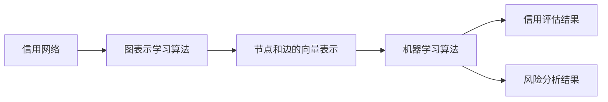

# 金融领域图表示学习在信用网络中的应用

> 关键词：金融领域、图表示学习、信用网络、图嵌入、风险评估

> 摘要：本文聚焦于金融领域中图表示学习在信用网络里的应用。首先介绍了相关的背景知识，包括目的范围、预期读者等内容。接着深入探讨图表示学习的核心概念及其与信用网络的联系，通过文本示意图和 Mermaid 流程图直观展示。详细阐述核心算法原理，结合 Python 代码进行说明，同时给出数学模型和公式并举例讲解。通过项目实战呈现代码实际案例及详细解释。分析了图表示学习在信用网络中的实际应用场景，推荐了相关的学习资源、开发工具框架和论文著作。最后总结了未来发展趋势与挑战，还设置了常见问题与解答及扩展阅读参考资料，旨在全面且深入地探讨金融领域图表示学习在信用网络中的应用，为相关领域的研究和实践提供有价值的参考。

## 1. 背景介绍 
### 1.1 目的和范围
在金融领域，信用评估是至关重要的环节，传统的信用评估方法往往依赖于单一实体的特征信息，忽略了实体之间复杂的关系。随着金融业务的不断发展，信用网络变得日益复杂，包含众多的实体（如企业、个人、金融机构等）以及它们之间的各种关系（如借贷关系、担保关系等）。图表示学习作为一种新兴的技术，能够将图结构数据转化为低维向量表示，从而有效地捕捉实体之间的关系信息。本文的目的在于深入探讨图表示学习在金融信用网络中的应用，包括如何利用图表示学习技术提高信用评估的准确性和效率，挖掘信用网络中的潜在风险等。范围涵盖了图表示学习的基本概念、核心算法、数学模型，以及在实际信用网络中的应用案例和未来发展趋势。

### 1.2 预期读者
本文预期读者包括金融领域的从业者，如银行信贷员、风险评估师、金融分析师等，他们可以通过本文了解图表示学习技术在信用评估中的应用，从而优化现有的信用评估流程。同时，对于计算机科学领域的研究人员和开发者，特别是对图数据挖掘、机器学习等方向感兴趣的人员，本文可以提供关于图表示学习在金融场景中应用的实际案例和技术细节。此外，高校相关专业的学生，如金融工程、计算机科学等专业的学生，也可以通过本文拓宽知识面，了解跨学科领域的研究动态。

### 1.3 文档结构概述
本文首先在背景介绍部分阐述了研究的目的、范围、预期读者等内容。接着进入核心概念与联系部分，详细介绍图表示学习和信用网络的核心概念，并通过示意图和流程图展示它们之间的关系。核心算法原理与具体操作步骤部分将深入讲解图表示学习的核心算法，并用 Python 代码进行实现。数学模型和公式部分给出相关的数学理论支持并举例说明。项目实战部分提供代码实际案例和详细解释。实际应用场景部分分析图表示学习在信用网络中的具体应用。工具和资源推荐部分推荐了学习资源、开发工具框架和相关论文著作。总结部分探讨未来发展趋势与挑战。附录部分解答常见问题，最后提供扩展阅读和参考资料。

### 1.4 术语表
#### 1.4.1 核心术语定义
- **图表示学习**：将图结构数据中的节点和边映射到低维向量空间的技术，使得向量能够保留图的结构和语义信息，便于后续的机器学习任务。
- **信用网络**：由参与金融活动的实体（如企业、个人、金融机构等）以及它们之间的信用关系（如借贷、担保等）构成的网络。
- **图嵌入**：图表示学习的一种具体实现方式，通过某种算法将图中的节点和边转换为向量表示。
- **节点特征**：描述图中节点属性的信息，如企业的财务指标、个人的信用记录等。
- **边特征**：描述图中边属性的信息，如借贷关系中的金额、期限等。

#### 1.4.2 相关概念解释
- **图数据**：由节点和边组成的数据结构，节点表示实体，边表示实体之间的关系。图数据可以是有向图或无向图，边可以有权重。
- **机器学习**：一门多领域交叉学科，涉及概率论、统计学、逼近论、凸分析、算法复杂度理论等多门学科。它专门研究计算机怎样模拟或实现人类的学习行为，以获取新的知识或技能，重新组织已有的知识结构使之不断改善自身的性能。
- **特征工程**：将原始数据转换为更能代表预测模型的潜在问题的特征的过程，包括特征选择、特征提取和特征构造等步骤。

#### 1.4.3 缩略词列表
- **GNN**：Graph Neural Network，图神经网络
- **DeepWalk**：一种图嵌入算法
- **Node2Vec**：一种图嵌入算法

## 2. 核心概念与联系 

### 2.1 图表示学习核心概念
图表示学习的核心目标是将图结构数据转换为低维向量表示，以便于机器学习算法进行处理。在图数据中，节点和边都包含着丰富的信息，图表示学习的任务就是将这些信息编码到向量中。常见的图表示学习方法包括基于随机游走的方法（如 DeepWalk、Node2Vec）和基于图神经网络的方法（如 GCN、GAT）。

基于随机游走的方法通过在图上进行随机游走生成节点序列，然后将这些序列作为语料库，利用词嵌入的方法（如 Skip - Gram）来学习节点的向量表示。例如，DeepWalk 算法通过在图上进行随机游走得到一系列节点序列，将这些序列视为句子，节点视为单词，使用 Skip - Gram 模型学习节点的嵌入向量。

基于图神经网络的方法则是通过对节点的邻域信息进行聚合来学习节点的表示。以 GCN（Graph Convolutional Network）为例，它通过对节点的邻接矩阵和特征矩阵进行卷积操作，不断更新节点的特征表示，从而得到节点的最终向量表示。

### 2.2 信用网络核心概念
信用网络是一个复杂的图结构，其中节点代表参与金融活动的实体，如企业、个人、金融机构等，边代表实体之间的信用关系，如借贷关系、担保关系等。信用网络中的节点和边都包含着丰富的信息，节点的特征可以包括企业的财务指标、个人的信用记录等，边的特征可以包括借贷关系中的金额、期限、利率等。

信用网络的结构和信息对于信用评估和风险分析具有重要意义。例如，一个企业的信用状况不仅取决于自身的财务指标，还可能受到其关联企业的影响。通过分析信用网络中节点之间的关系，可以发现潜在的风险，如企业之间的联保风险、资金链风险等。

### 2.3 图表示学习与信用网络的联系
图表示学习技术可以有效地应用于信用网络中，帮助挖掘信用网络中的潜在信息。通过将信用网络中的节点和边映射到低维向量空间，可以将复杂的图结构数据转换为易于处理的向量数据，从而可以利用传统的机器学习算法进行信用评估和风险分析。

例如，在信用评估中，可以使用图表示学习技术将企业的信用网络信息转换为向量表示，然后将这些向量与企业的财务指标等特征一起输入到分类器中，预测企业的信用等级。在风险分析中，可以通过分析节点向量之间的相似度，发现信用网络中的潜在风险群体，如联保企业群体等。

### 2.4 文本示意图
图表示学习在信用网络中的应用可以用以下文本示意图表示：

信用网络（包含节点和边） -> 图表示学习算法（如 DeepWalk、GCN 等） -> 节点和边的向量表示 -> 机器学习算法（如分类器、聚类算法等） -> 信用评估结果、风险分析结果

### 2.5 Mermaid 流程图


## 3. 核心算法原理 & 具体操作步骤 

### 3.1 DeepWalk 算法原理
DeepWalk 算法是一种基于随机游走的图嵌入算法，其核心思想是通过在图上进行随机游走生成节点序列，然后将这些序列作为语料库，利用 Skip - Gram 模型学习节点的向量表示。

#### 3.1.1 随机游走
随机游走是指从图中的一个节点开始，随机选择一个相邻节点作为下一个节点，重复这个过程，直到达到指定的步数或回到起始节点。例如，在一个有向图中，从节点 $v_1$ 开始，它有两个相邻节点 $v_2$ 和 $v_3$，随机选择一个节点，假设选择了 $v_2$，然后从 $v_2$ 继续随机选择相邻节点，以此类推，得到一个节点序列，如 $[v_1, v_2, v_4, v_3, \cdots]$。

#### 3.1.2 Skip - Gram 模型
Skip - Gram 模型是一种用于学习词向量的模型，它的目标是根据中心词预测上下文词。在 DeepWalk 中，将随机游走得到的节点序列视为句子，节点视为单词，使用 Skip - Gram 模型学习节点的向量表示。具体来说，对于一个节点序列 $[v_1, v_2, v_3, v_4]$，以 $v_2$ 为中心词，其上下文词可以是 $v_1$ 和 $v_3$，Skip - Gram 模型的目标是最大化在给定 $v_2$ 的情况下预测 $v_1$ 和 $v_3$ 的概率。

### 3.2 DeepWalk 算法 Python 实现
```python
import networkx as nx
import random
from gensim.models import Word2Vec

def random_walk(G, node, walk_length):
    walk = [node]
    for _ in range(walk_length - 1):
        neighbors = list(G.neighbors(walk[-1]))
        if neighbors:
            walk.append(random.choice(neighbors))
        else:
            break
    return walk

def generate_walks(G, num_walks, walk_length):
    walks = []
    nodes = list(G.nodes())
    for _ in range(num_walks):
        random.shuffle(nodes)
        for node in nodes:
            walk = random_walk(G, node, walk_length)
            walks.append(walk)
    return walks

def deepwalk(G, num_walks, walk_length, embedding_size, window_size):
    walks = generate_walks(G, num_walks, walk_length)
    model = Word2Vec(walks, size=embedding_size, window=window_size, min_count=0, sg=1, workers=4)
    return model

# 示例使用
G = nx.karate_club_graph()
model = deepwalk(G, num_walks=10, walk_length=80, embedding_size=128, window_size=10)
node_embeddings = {node: model.wv[node] for node in G.nodes()}
```

### 3.3 算法具体操作步骤
1. **构建信用网络**：根据实际的金融数据，构建信用网络的图结构，确定节点和边的信息。
2. **随机游走**：在信用网络上进行随机游走，生成节点序列。
3. **训练 Skip - Gram 模型**：将随机游走得到的节点序列作为语料库，使用 Skip - Gram 模型学习节点的向量表示。
4. **获取节点嵌入**：从训练好的模型中获取节点的向量表示，用于后续的信用评估和风险分析。

## 4. 数学模型和公式 & 详细讲解 & 举例说明 

### 4.1 Skip - Gram 模型数学模型
Skip - Gram 模型的目标是最大化给定中心词 $w_c$ 预测上下文词 $w_o$ 的概率。设 $V$ 为词汇表的大小，$v$ 为词向量的维度，$w_c$ 的向量表示为 $\mathbf{v}_c \in \mathbb{R}^v$，$w_o$ 的向量表示为 $\mathbf{u}_o \in \mathbb{R}^v$。

Skip - Gram 模型的概率计算公式为：

$$P(w_o|w_c) = \frac{\exp(\mathbf{u}_o^T\mathbf{v}_c)}{\sum_{w = 1}^{V} \exp(\mathbf{u}_w^T\mathbf{v}_c)}$$

其中，$\mathbf{u}_w$ 是词汇表中第 $w$ 个词的向量表示。

### 4.2 损失函数
Skip - Gram 模型的损失函数通常采用负对数似然损失函数，即：

$$L = -\sum_{t = 1}^{T} \sum_{-m \leq j \leq m, j \neq 0} \log P(w_{t + j}|w_t)$$

其中，$T$ 是语料库的长度，$m$ 是上下文窗口的大小。

### 4.3 详细讲解
Skip - Gram 模型通过最大化给定中心词预测上下文词的概率来学习词向量。在训练过程中，模型会不断调整词向量的参数，使得预测概率最大。损失函数用于衡量模型预测结果与真实结果之间的差异，通过最小化损失函数来优化模型的参数。

### 4.4 举例说明
假设我们有一个简单的节点序列 $[v_1, v_2, v_3, v_4]$，上下文窗口大小 $m = 1$。以 $v_2$ 为中心词，其上下文词为 $v_1$ 和 $v_3$。根据 Skip - Gram 模型的概率计算公式，我们需要计算 $P(v_1|v_2)$ 和 $P(v_3|v_2)$ 的概率。在训练过程中，模型会不断调整 $v_1$、$v_2$ 和 $v_3$ 的向量表示，使得 $P(v_1|v_2)$ 和 $P(v_3|v_2)$ 的概率最大，同时最小化损失函数 $L$。

## 5. 项目实战：代码实际案例和详细解释说明 

### 5.1 开发环境搭建
#### 5.1.1 安装 Python
首先需要安装 Python 环境，建议使用 Python 3.6 及以上版本。可以从 Python 官方网站（https://www.python.org/downloads/）下载并安装。

#### 5.1.2 安装必要的库
使用以下命令安装必要的库：
```sh
pip install networkx gensim numpy pandas
```
- `networkx`：用于构建和操作图结构。
- `gensim`：用于实现 Word2Vec 模型。
- `numpy`：用于数值计算。
- `pandas`：用于数据处理。

### 5.2 源代码详细实现和代码解读
```python
import networkx as nx
import random
from gensim.models import Word2Vec
import pandas as pd
import numpy as np

# 生成示例信用网络数据
def generate_credit_network_data(num_nodes, num_edges):
    G = nx.gnm_random_graph(num_nodes, num_edges)
    # 为节点添加特征
    for node in G.nodes():
        G.nodes[node]['feature'] = np.random.rand(10)
    # 为边添加特征
    for edge in G.edges():
        G.edges[edge]['amount'] = random.randint(1000, 10000)
    return G

# 随机游走函数
def random_walk(G, node, walk_length):
    walk = [node]
    for _ in range(walk_length - 1):
        neighbors = list(G.neighbors(walk[-1]))
        if neighbors:
            walk.append(random.choice(neighbors))
        else:
            break
    return walk

# 生成随机游走序列
def generate_walks(G, num_walks, walk_length):
    walks = []
    nodes = list(G.nodes())
    for _ in range(num_walks):
        random.shuffle(nodes)
        for node in nodes:
            walk = random_walk(G, node, walk_length)
            walks.append(walk)
    return walks

# DeepWalk 算法
def deepwalk(G, num_walks, walk_length, embedding_size, window_size):
    walks = generate_walks(G, num_walks, walk_length)
    model = Word2Vec(walks, size=embedding_size, window=window_size, min_count=0, sg=1, workers=4)
    return model

# 信用评估示例
def credit_evaluation(G, model):
    node_embeddings = {node: model.wv[node] for node in G.nodes()}
    node_features = {node: G.nodes[node]['feature'] for node in G.nodes()}
    X = []
    y = []
    for node in G.nodes():
        embedding = node_embeddings[node]
        feature = node_features[node]
        combined_feature = np.concatenate((embedding, feature))
        X.append(combined_feature)
        # 简单模拟信用标签
        if random.random() > 0.5:
            y.append(1)
        else:
            y.append(0)
    X = np.array(X)
    y = np.array(y)
    from sklearn.model_selection import train_test_split
    from sklearn.linear_model import LogisticRegression
    X_train, X_test, y_train, y_test = train_test_split(X, y, test_size=0.2, random_state=42)
    model = LogisticRegression()
    model.fit(X_train, y_train)
    score = model.score(X_test, y_test)
    return score

# 主函数
if __name__ == "__main__":
    num_nodes = 100
    num_edges = 200
    G = generate_credit_network_data(num_nodes, num_edges)
    num_walks = 10
    walk_length = 80
    embedding_size = 128
    window_size = 10
    deepwalk_model = deepwalk(G, num_walks, walk_length, embedding_size, window_size)
    credit_score = credit_evaluation(G, deepwalk_model)
    print(f"Credit evaluation accuracy: {credit_score}")
```

### 5.3 代码解读与分析
1. **数据生成**：`generate_credit_network_data` 函数用于生成示例信用网络数据，包括节点和边的特征。
2. **随机游走**：`random_walk` 函数实现了在图上的随机游走，`generate_walks` 函数生成多个随机游走序列。
3. **DeepWalk 算法**：`deepwalk` 函数使用 `gensim` 库中的 `Word2Vec` 模型实现了 DeepWalk 算法，学习节点的向量表示。
4. **信用评估**：`credit_evaluation` 函数将节点的嵌入向量和节点特征组合，使用逻辑回归模型进行信用评估，并计算评估的准确率。
5. **主函数**：在主函数中，调用上述函数完成信用网络数据生成、DeepWalk 算法训练和信用评估，并输出评估的准确率。

## 6. 实际应用场景 

### 6.1 信用评估
在传统的信用评估中，主要考虑企业或个人的财务指标和信用记录等单一实体的信息。而在信用网络中，一个实体的信用状况可能受到其关联实体的影响。通过图表示学习技术，可以将信用网络中的节点和边的信息转换为向量表示，将这些向量与传统的特征一起输入到信用评估模型中，提高信用评估的准确性。例如，在评估一个企业的信用等级时，可以考虑其上下游企业的信用状况，以及企业之间的担保关系等。

### 6.2 风险预警
图表示学习技术可以帮助发现信用网络中的潜在风险。通过分析节点向量之间的相似度，可以发现信用网络中的潜在风险群体，如联保企业群体等。当一个群体中的某个企业出现信用风险时，可以及时预警该群体中的其他企业。此外，还可以通过分析边的特征和节点的动态变化，预测信用网络中的风险传播路径，提前采取措施防范风险。

### 6.3 客户细分
在金融领域，客户细分是非常重要的。通过图表示学习技术，可以将客户在信用网络中的关系信息转换为向量表示，利用聚类算法对客户进行细分。例如，可以将具有相似信用网络结构的客户分为一类，针对不同类别的客户制定不同的营销策略和风险控制措施。

### 6.4 金融产品推荐
图表示学习技术可以帮助挖掘客户在信用网络中的潜在需求。通过分析客户的信用网络关系和向量表示，可以了解客户的金融行为模式和偏好，从而为客户推荐合适的金融产品。例如，对于一个与多个金融机构有借贷关系的客户，可以推荐更适合其需求的贷款产品或理财产品。

## 7. 工具和资源推荐
### 7.1 学习资源推荐
#### 7.1.1 书籍推荐
- 《图神经网络：基础、前沿与应用》：全面介绍了图神经网络的基本概念、算法和应用，对于理解图表示学习技术有很大帮助。
- 《Python 机器学习》：详细介绍了 Python 中机器学习的相关知识和算法，包括图嵌入算法的实现。
- 《金融风险管理》：介绍了金融领域的风险管理知识，结合图表示学习技术可以更好地理解在信用网络中的应用。

#### 7.1.2 在线课程
- Coursera 上的“Graph Neural Networks for Machine Learning”：由知名学者授课，系统介绍图神经网络的理论和实践。
- edX 上的“Machine Learning for Finance”：结合金融领域的实际案例，介绍机器学习在金融中的应用，包括图表示学习在信用网络中的应用。

#### 7.1.3 技术博客和网站
- Medium 上的“Graph Machine Learning”：有很多关于图机器学习的最新研究成果和实践经验分享。
- arXiv.org：可以搜索到关于图表示学习和金融领域应用的最新学术论文。

### 7.2 开发工具框架推荐
#### 7.2.1 IDE和编辑器
- PyCharm：功能强大的 Python 集成开发环境，支持代码编辑、调试、版本控制等功能。
- Jupyter Notebook：交互式的开发环境，适合进行数据分析和模型训练的实验。

#### 7.2.2 调试和性能分析工具
- TensorBoard：用于可视化深度学习模型的训练过程和性能指标，对于图神经网络的训练调试有很大帮助。
- cProfile：Python 内置的性能分析工具，可以分析代码的性能瓶颈。

#### 7.2.3 相关框架和库
- DGL（Deep Graph Library）：专门用于图神经网络的深度学习框架，提供了丰富的图神经网络模型和工具。
- PyTorch Geometric：基于 PyTorch 的图神经网络库，方便实现和训练图神经网络模型。

### 7.3 相关论文著作推荐
#### 7.3.1 经典论文
- “DeepWalk: Online Learning of Social Representations”：提出了 DeepWalk 算法，是图表示学习领域的经典论文。
- “Semi-Supervised Classification with Graph Convolutional Networks”：介绍了 GCN 算法，为图神经网络的发展奠定了基础。

#### 7.3.2 最新研究成果
- 关注 arXiv.org 上关于图表示学习和金融领域应用的最新论文，了解该领域的最新研究动态。

#### 7.3.3 应用案例分析
- 可以参考一些金融机构的研究报告和案例分析，了解图表示学习技术在实际信用网络中的应用效果和经验教训。

## 8. 总结：未来发展趋势与挑战

### 8.1 未来发展趋势
- **多模态信息融合**：未来的图表示学习将不仅仅局限于图结构信息，还会融合更多的多模态信息，如文本、图像等。在信用网络中，可以结合企业的财务报表文本信息、企业的经营场所图像信息等，更全面地刻画企业的信用状况。
- **图神经网络的深度和可解释性**：随着图神经网络的发展，模型的深度会不断增加，同时也会更加注重模型的可解释性。在信用评估中，可解释的图神经网络模型可以让金融从业者更好地理解模型的决策过程，提高模型的可信度。
- **联邦学习与图表示学习的结合**：在金融领域，数据隐私和安全非常重要。联邦学习与图表示学习的结合可以在保证数据隐私的前提下，利用多个机构的数据进行联合训练，提高信用评估的准确性。

### 8.2 挑战
- **数据质量和隐私问题**：在信用网络中，数据的质量和隐私是非常关键的问题。数据可能存在噪声、缺失值等问题，需要进行数据清洗和预处理。同时，金融数据涉及到客户的隐私，需要采取有效的措施保护数据隐私。
- **计算资源和效率问题**：图表示学习算法，特别是图神经网络算法，通常需要大量的计算资源和时间。在处理大规模信用网络时，如何提高算法的效率是一个挑战。
- **模型的泛化能力**：由于信用网络的复杂性和多样性，模型的泛化能力是一个重要的问题。一个在某个数据集上表现良好的模型，在其他数据集上可能效果不佳，需要提高模型的泛化能力。

## 9. 附录：常见问题与解答

### 9.1 图表示学习和传统机器学习有什么区别？
传统机器学习通常处理的是结构化的数据，如表格数据，忽略了数据之间的关系信息。而图表示学习专门处理图结构数据，能够捕捉数据之间的复杂关系，将图结构数据转换为低维向量表示，便于后续的机器学习任务。

### 9.2 如何选择合适的图表示学习算法？
选择合适的图表示学习算法需要考虑多个因素，如数据的规模、图的结构、任务的需求等。如果数据规模较小，可以选择基于随机游走的算法，如 DeepWalk、Node2Vec。如果数据规模较大，且需要考虑节点的邻域信息，可以选择基于图神经网络的算法，如 GCN、GAT。

### 9.3 图表示学习在信用网络中的应用有哪些局限性？
图表示学习在信用网络中的应用存在一些局限性，如数据质量和隐私问题、计算资源和效率问题、模型的泛化能力问题等。此外，图表示学习算法通常是基于图的结构信息，对于一些非结构化的信息，如文本、图像等，处理能力有限。

### 9.4 如何评估图表示学习模型的性能？
评估图表示学习模型的性能可以从多个方面进行，如节点分类任务可以使用准确率、召回率、F1 值等指标，链接预测任务可以使用 AUC、AP 等指标。此外，还可以通过可视化节点的嵌入向量，观察节点之间的聚类效果来评估模型的性能。

## 10. 扩展阅读 & 参考资料

### 10.1 扩展阅读
- 可以阅读更多关于图论、机器学习、深度学习等方面的书籍和论文，深入了解图表示学习的理论基础。
- 关注金融领域的最新研究动态和实践案例，了解图表示学习在金融领域的最新应用。

### 10.2 参考资料
- 本文参考了大量的学术论文、书籍和技术博客，具体参考文献可以在文中相应的引用处查找。
- 相关的代码实现可以参考网络上的开源代码库，如 GitHub 上的相关项目。