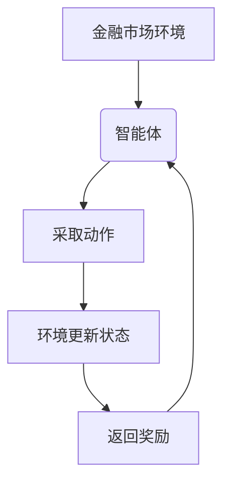

# 金融领域强化学习在资产定价中的应用

> 关键词：金融领域、强化学习、资产定价、马尔可夫决策过程、深度强化学习

> 摘要：本文深入探讨了金融领域中强化学习在资产定价方面的应用。首先介绍了相关背景知识，包括目的范围、预期读者等内容。接着阐述了强化学习与资产定价的核心概念及联系，详细讲解了核心算法原理和具体操作步骤，并给出了相应的 Python 代码示例。同时，介绍了相关的数学模型和公式，通过具体例子进行说明。在项目实战部分，给出了开发环境搭建、源代码实现和解读。然后探讨了实际应用场景，推荐了相关的工具和资源。最后总结了未来发展趋势与挑战，提供了常见问题解答和扩展阅读参考资料，旨在全面呈现强化学习在资产定价中的应用，为相关研究和实践提供参考。

## 1. 背景介绍 
### 1.1 目的和范围
在金融市场中，资产定价是核心问题之一，准确的资产定价对于投资者决策、金融机构风险管理以及市场的有效运行都具有至关重要的意义。传统的资产定价方法往往基于一系列假设和简化模型，在面对复杂多变的市场环境时，其局限性逐渐显现。强化学习作为一种新兴的人工智能技术，具有能够在动态环境中不断学习和优化策略的能力，为资产定价问题提供了新的思路和方法。

本文的范围主要聚焦于探讨强化学习在金融资产定价中的具体应用，包括核心概念、算法原理、数学模型、实际案例以及未来发展趋势等方面，旨在全面深入地介绍强化学习在这一领域的应用，帮助读者理解和掌握相关知识和技术。

### 1.2 预期读者
本文预期读者包括金融领域的从业者，如投资经理、交易员、风险分析师等，他们可以通过本文了解强化学习在资产定价中的应用，为实际工作提供新的工具和方法；计算机科学和人工智能领域的研究人员和开发者，他们可以通过本文了解金融领域的具体问题和需求，拓展强化学习的应用场景；以及对金融和人工智能交叉领域感兴趣的学生和爱好者，为他们提供一个系统学习和研究的参考资料。

### 1.3 文档结构概述
本文按照以下结构进行组织：首先介绍背景知识，包括目的范围、预期读者等内容；接着阐述强化学习与资产定价的核心概念及联系，通过文本示意图和 Mermaid 流程图进行说明；然后详细讲解核心算法原理和具体操作步骤，并给出相应的 Python 代码示例；同时，介绍相关的数学模型和公式，通过具体例子进行说明；在项目实战部分，给出开发环境搭建、源代码实现和解读；然后探讨实际应用场景；推荐相关的工具和资源；最后总结未来发展趋势与挑战，提供常见问题解答和扩展阅读参考资料。

### 1.4 术语表
#### 1.4.1 核心术语定义
- **强化学习（Reinforcement Learning）**：是一种机器学习范式，智能体通过与环境进行交互，根据环境反馈的奖励信号来学习最优策略，以最大化长期累积奖励。
- **资产定价（Asset Pricing）**：是指确定金融资产的合理价值，通过对资产未来现金流的预测和折现等方法，为资产的交易和投资决策提供依据。
- **马尔可夫决策过程（Markov Decision Process，MDP）**：是一种用于描述强化学习问题的数学模型，由状态、动作、奖励、状态转移概率等要素组成，假设系统的未来状态只依赖于当前状态。
- **策略（Policy）**：是指智能体在不同状态下选择动作的规则，通常用 $\pi(s)$ 表示，其中 $s$ 表示状态。
- **价值函数（Value Function）**：用于评估在某个状态下采取某个动作或遵循某个策略的价值，常见的有状态价值函数 $V(s)$ 和动作价值函数 $Q(s,a)$。

#### 1.4.2 相关概念解释
- **环境（Environment）**：在强化学习中，环境是智能体交互的对象，它接收智能体的动作并返回下一个状态和奖励信号。在资产定价应用中，金融市场可以看作是环境，其状态包括资产价格、市场波动率等因素。
- **奖励（Reward）**：是环境对智能体动作的反馈，用于指导智能体学习最优策略。在资产定价中，奖励可以是投资收益、风险调整后的收益等。
- **探索与利用（Exploration and Exploitation）**：是强化学习中的一个重要问题。探索是指智能体尝试不同的动作，以发现更优的策略；利用是指智能体根据已有的经验选择当前认为最优的动作。在实际应用中，需要在探索和利用之间找到平衡。

#### 1.4.3 缩略词列表
- **MDP**：Markov Decision Process（马尔可夫决策过程）
- **Q - learning**：一种基于动作价值函数的强化学习算法
- **DQN**：Deep Q - Network（深度 Q 网络），是将深度学习与 Q - learning 相结合的算法
- **A2C**：Advantage Actor - Critic（优势演员 - 评论家），一种基于策略梯度的强化学习算法

## 2. 核心概念与联系 

### 核心概念原理
#### 强化学习原理
强化学习的基本原理是智能体在环境中不断进行交互，通过选择动作并接收环境反馈的奖励信号来学习最优策略。智能体的目标是最大化长期累积奖励。马尔可夫决策过程（MDP）是描述强化学习问题的常用数学模型，一个 MDP 可以用一个五元组 $\langle S, A, P, R, \gamma \rangle$ 表示，其中：
- $S$ 是状态空间，表示环境可能处于的所有状态的集合。
- $A$ 是动作空间，表示智能体可以采取的所有动作的集合。
- $P(s'|s,a)$ 是状态转移概率，表示在状态 $s$ 下采取动作 $a$ 后转移到状态 $s'$ 的概率。
- $R(s,a,s')$ 是奖励函数，表示在状态 $s$ 下采取动作 $a$ 并转移到状态 $s'$ 时获得的奖励。
- $\gamma \in [0,1]$ 是折扣因子，用于衡量未来奖励的重要性。

智能体的策略 $\pi(s)$ 定义了在状态 $s$ 下选择动作的概率分布。状态价值函数 $V^{\pi}(s)$ 表示在遵循策略 $\pi$ 时从状态 $s$ 开始的预期累积折扣奖励：
$$V^{\pi}(s) = \mathbb{E}_{\pi}\left[\sum_{t=0}^{\infty} \gamma^{t} R_{t+1} | S_0 = s\right]$$
动作价值函数 $Q^{\pi}(s,a)$ 表示在遵循策略 $\pi$ 时从状态 $s$ 采取动作 $a$ 开始的预期累积折扣奖励：
$$Q^{\pi}(s,a) = \mathbb{E}_{\pi}\left[\sum_{t=0}^{\infty} \gamma^{t} R_{t+1} | S_0 = s, A_0 = a\right]$$

#### 资产定价原理
资产定价的基本思想是根据资产未来的现金流和风险来确定其当前的价值。常见的资产定价模型包括资本资产定价模型（CAPM）、套利定价理论（APT）等。这些模型通常基于一些假设，如市场有效性、投资者理性等。在实际应用中，资产价格受到多种因素的影响，如宏观经济指标、公司财务状况、市场情绪等。

### 架构的文本示意图
强化学习在资产定价中的应用架构可以描述如下：智能体（强化学习算法）接收金融市场环境的状态信息，包括资产价格、市场波动率、宏观经济指标等。智能体根据当前状态选择动作，如买入、卖出或持有资产。环境根据智能体的动作更新状态，并返回奖励信号，奖励信号可以是投资收益、风险调整后的收益等。智能体根据奖励信号更新自己的策略，以最大化长期累积奖励。

### Mermaid 流程图


## 3. 核心算法原理 & 具体操作步骤 

### Q - learning 算法原理
Q - learning 是一种基于动作价值函数的强化学习算法，其目标是学习最优动作价值函数 $Q^*(s,a)$。Q - learning 算法通过迭代更新动作价值函数来逼近最优动作价值函数，更新公式如下：
$$Q(S_t, A_t) \leftarrow Q(S_t, A_t) + \alpha \left[R_{t+1} + \gamma \max_{a} Q(S_{t+1}, a) - Q(S_t, A_t)\right]$$
其中，$\alpha$ 是学习率，控制每次更新的步长；$\gamma$ 是折扣因子，衡量未来奖励的重要性。

### 具体操作步骤
1. **初始化**：初始化动作价值函数 $Q(s,a)$ 为任意值，通常初始化为 0。
2. **循环执行以下步骤**：
    - 选择当前状态 $S_t$。
    - 根据某种策略（如 $\epsilon$ - 贪心策略）选择动作 $A_t$。
    - 执行动作 $A_t$，观察环境反馈的奖励 $R_{t+1}$ 和下一个状态 $S_{t+1}$。
    - 根据 Q - learning 更新公式更新 $Q(S_t, A_t)$。
    - 更新当前状态 $S_t = S_{t+1}$。
3. **终止条件**：达到预设的迭代次数或满足收敛条件。

### Python 源代码实现
```python
import numpy as np

# 定义 Q - learning 类
class QLearning:
    def __init__(self, state_size, action_size, learning_rate=0.1, discount_factor=0.9):
        self.state_size = state_size
        self.action_size = action_size
        self.learning_rate = learning_rate
        self.discount_factor = discount_factor
        # 初始化 Q 表
        self.q_table = np.zeros((state_size, action_size))

    def choose_action(self, state, epsilon):
        if np.random.uniform(0, 1) < epsilon:
            # 探索：随机选择动作
            action = np.random.choice(self.action_size)
        else:
            # 利用：选择 Q 值最大的动作
            action = np.argmax(self.q_table[state, :])
        return action

    def update(self, state, action, reward, next_state):
        # 根据 Q - learning 更新公式更新 Q 表
        max_q_next = np.max(self.q_table[next_state, :])
        self.q_table[state, action] += self.learning_rate * (reward + self.discount_factor * max_q_next - self.q_table[state, action])
```

### 代码解释
- `__init__` 方法：初始化 Q - learning 类的参数，包括状态空间大小、动作空间大小、学习率和折扣因子，并初始化 Q 表为全零矩阵。
- `choose_action` 方法：根据 $\epsilon$ - 贪心策略选择动作，以一定的概率 $\epsilon$ 进行探索（随机选择动作），以 $1 - \epsilon$ 的概率进行利用（选择 Q 值最大的动作）。
- `update` 方法：根据 Q - learning 更新公式更新 Q 表，通过计算下一个状态的最大 Q 值来更新当前状态和动作的 Q 值。

## 4. 数学模型和公式 & 详细讲解 & 举例说明 

### 马尔可夫决策过程（MDP）公式
如前所述，一个 MDP 可以用五元组 $\langle S, A, P, R, \gamma \rangle$ 表示。状态价值函数 $V^{\pi}(s)$ 和动作价值函数 $Q^{\pi}(s,a)$ 满足以下贝尔曼方程：
$$V^{\pi}(s) = \sum_{a \in A} \pi(a|s) \sum_{s' \in S} P(s'|s,a) \left[R(s,a,s') + \gamma V^{\pi}(s')\right]$$
$$Q^{\pi}(s,a) = \sum_{s' \in S} P(s'|s,a) \left[R(s,a,s') + \gamma \sum_{a' \in A} \pi(a'|s') Q^{\pi}(s',a')\right]$$

### 详细讲解
贝尔曼方程描述了状态价值函数和动作价值函数的递归关系。状态价值函数 $V^{\pi}(s)$ 表示在遵循策略 $\pi$ 时从状态 $s$ 开始的预期累积折扣奖励，它可以通过对所有可能的动作和下一个状态进行求和得到。动作价值函数 $Q^{\pi}(s,a)$ 表示在遵循策略 $\pi$ 时从状态 $s$ 采取动作 $a$ 开始的预期累积折扣奖励，同样可以通过对所有可能的下一个状态和动作进行求和得到。

### 举例说明
假设一个简单的资产定价问题，状态空间 $S = \{s_1, s_2\}$，动作空间 $A = \{a_1, a_2\}$，状态转移概率矩阵 $P$ 和奖励函数 $R$ 如下：
$$P = \begin{bmatrix}
0.7 & 0.3 \\
0.4 & 0.6
\end{bmatrix}$$
$$R = \begin{bmatrix}
1 & 2 \\
3 & 4
\end{bmatrix}$$
折扣因子 $\gamma = 0.9$，策略 $\pi$ 为均匀分布，即 $\pi(a_1|s_1) = \pi(a_2|s_1) = \pi(a_1|s_2) = \pi(a_2|s_2) = 0.5$。

首先计算 $Q^{\pi}(s_1,a_1)$：
$$Q^{\pi}(s_1,a_1) = P(s_1|s_1,a_1) \left[R(s_1,a_1,s_1) + \gamma \left(\pi(a_1|s_1) Q^{\pi}(s_1,a_1) + \pi(a_2|s_1) Q^{\pi}(s_1,a_2)\right)\right] + P(s_2|s_1,a_1) \left[R(s_1,a_1,s_2) + \gamma \left(\pi(a_1|s_2) Q^{\pi}(s_2,a_1) + \pi(a_2|s_2) Q^{\pi}(s_2,a_2)\right)\right]$$
由于初始时 $Q^{\pi}(s,a) = 0$，则：
$$Q^{\pi}(s_1,a_1) = 0.7 \times (1 + 0.9 \times 0) + 0.3 \times (2 + 0.9 \times 0) = 0.7 + 0.6 = 1.3$$
同理可以计算其他的 $Q^{\pi}(s,a)$ 值，然后再计算 $V^{\pi}(s)$ 值。

## 5. 项目实战：代码实际案例和详细解释说明 

### 5.1  开发环境搭建
- **Python 环境**：建议使用 Python 3.7 及以上版本，可以通过 Anaconda 或官方 Python 网站进行安装。
- **依赖库**：需要安装 `numpy`、`pandas`、`matplotlib` 等常用库，以及 `gym` 库用于构建强化学习环境。可以使用以下命令进行安装：
```sh
pip install numpy pandas matplotlib gym
```

### 5.2  源代码详细实现和代码解读
以下是一个简单的资产定价强化学习示例，使用 `gym` 库构建一个简单的金融市场环境。

```python
import gym
import numpy as np
import matplotlib.pyplot as plt

# 定义简单的金融市场环境
class SimpleFinanceEnv(gym.Env):
    def __init__(self):
        self.asset_price = 100
        self.max_steps = 100
        self.current_step = 0
        self.action_space = gym.spaces.Discrete(3)  # 0: 持有, 1: 买入, 2: 卖出
        self.observation_space = gym.spaces.Box(low=0, high=np.inf, shape=(1,))

    def step(self, action):
        # 模拟资产价格变化
        if action == 1:  # 买入
            self.asset_price += np.random.normal(1, 0.5)
        elif action == 2:  # 卖出
            self.asset_price -= np.random.normal(1, 0.5)
        else:  # 持有
            self.asset_price += np.random.normal(0, 0.5)

        # 计算奖励
        reward = self.asset_price - 100  # 简单的奖励计算

        self.current_step += 1
        done = self.current_step >= self.max_steps
        info = {}
        return np.array([self.asset_price]), reward, done, info

    def reset(self):
        self.asset_price = 100
        self.current_step = 0
        return np.array([self.asset_price])

    def render(self, mode='human'):
        print(f"当前资产价格: {self.asset_price}")


# 定义 Q - learning 类
class QLearning:
    def __init__(self, state_size, action_size, learning_rate=0.1, discount_factor=0.9, epsilon=0.1):
        self.state_size = state_size
        self.action_size = action_size
        self.learning_rate = learning_rate
        self.discount_factor = discount_factor
        self.epsilon = epsilon
        self.q_table = np.zeros((state_size, action_size))

    def choose_action(self, state):
        if np.random.uniform(0, 1) < self.epsilon:
            action = np.random.choice(self.action_size)
        else:
            action = np.argmax(self.q_table[state, :])
        return action

    def update(self, state, action, reward, next_state):
        max_q_next = np.max(self.q_table[next_state, :])
        self.q_table[state, action] += self.learning_rate * (reward + self.discount_factor * max_q_next - self.q_table[state, action])


# 主程序
if __name__ == "__main__":
    env = SimpleFinanceEnv()
    state_size = 100  # 离散化状态空间
    action_size = env.action_space.n
    agent = QLearning(state_size, action_size)

    num_episodes = 1000
    rewards = []

    for episode in range(num_episodes):
        state = env.reset()
        state = int(state[0]) % state_size
        total_reward = 0

        for step in range(env.max_steps):
            action = agent.choose_action(state)
            next_state, reward, done, _ = env.step(action)
            next_state = int(next_state[0]) % state_size
            agent.update(state, action, reward, next_state)
            state = next_state
            total_reward += reward

            if done:
                break

        rewards.append(total_reward)
        if episode % 100 == 0:
            print(f"Episode {episode}: Total Reward = {total_reward}")

    # 绘制奖励曲线
    plt.plot(rewards)
    plt.xlabel('Episode')
    plt.ylabel('Total Reward')
    plt.title('Training Rewards')
    plt.show()
```

### 5.3  代码解读与分析
- **SimpleFinanceEnv 类**：定义了一个简单的金融市场环境，继承自 `gym.Env` 类。`__init__` 方法初始化环境的参数，包括资产价格、最大步数、动作空间和观测空间。`step` 方法根据智能体的动作更新资产价格，计算奖励，并返回下一个状态、奖励、是否结束等信息。`reset` 方法重置环境状态，`render` 方法用于显示当前资产价格。
- **QLearning 类**：实现了 Q - learning 算法，包括选择动作和更新 Q 表的方法。
- **主程序**：创建环境和 Q - learning 智能体，进行多个回合的训练。在每个回合中，智能体根据当前状态选择动作，执行动作后更新 Q 表，并累积奖励。最后绘制奖励曲线，观察训练效果。

## 6. 实际应用场景 
### 股票定价
在股票市场中，强化学习可以用于预测股票价格走势，帮助投资者做出买入、卖出或持有的决策。通过考虑多种因素，如公司财务报表、宏观经济指标、市场情绪等，强化学习智能体可以学习到最优的投资策略，以实现最大化投资收益。

### 债券定价
债券的价格受到多种因素的影响，如利率、信用风险、市场流动性等。强化学习可以用于构建债券定价模型，通过对历史数据的学习和分析，预测债券的价格波动，为投资者提供合理的投资建议。

### 期权定价
期权的定价是一个复杂的问题，传统的期权定价模型如布莱克 - 斯科尔斯模型（Black - Scholes Model）基于一些假设，在实际应用中存在一定的局限性。强化学习可以通过考虑更多的市场因素和不确定性，为期权定价提供更准确的方法。

### 资产组合优化
强化学习可以用于资产组合优化问题，通过在不同资产之间分配资金，以实现风险和收益的平衡。智能体可以根据市场环境的变化动态调整资产组合，以最大化长期累积收益。

## 7. 工具和资源推荐
### 7.1 学习资源推荐
#### 7.1.1 书籍推荐
- 《强化学习：原理与Python实现》：全面介绍了强化学习的基本原理和算法，通过 Python 代码示例进行讲解，适合初学者入门。
- 《Deep Reinforcement Learning Hands-On》：深入探讨了深度强化学习的理论和实践，包含多个实际案例和代码实现，适合有一定基础的读者。
- 《金融数学》：介绍了金融领域的数学基础，包括资产定价模型、期权定价理论等，对于理解强化学习在金融领域的应用有很大帮助。

#### 7.1.2 在线课程
- Coursera 上的 “Reinforcement Learning Specialization”：由顶尖高校的教授授课，系统介绍了强化学习的理论和算法，包含多个实践项目。
- edX 上的 “Introduction to Financial Engineering and Risk Management”：介绍了金融工程和风险管理的基本概念和方法，对于理解金融市场和资产定价有很大帮助。

#### 7.1.3 技术博客和网站
- OpenAI Blog：OpenAI 发布的关于人工智能和强化学习的最新研究成果和应用案例。
- Towards Data Science：一个数据科学和机器学习领域的博客平台，有很多关于强化学习和金融领域应用的文章。

### 7.2 开发工具框架推荐
#### 7.2.1 IDE和编辑器
- PyCharm：一款功能强大的 Python 集成开发环境，提供代码编辑、调试、版本控制等功能。
- Jupyter Notebook：一个交互式的开发环境，适合进行数据探索和模型实验，方便展示代码和结果。

#### 7.2.2 调试和性能分析工具
- TensorBoard：TensorFlow 提供的可视化工具，可以用于查看训练过程中的损失曲线、奖励曲线等信息，帮助调试和优化模型。
- cProfile：Python 内置的性能分析工具，可以用于分析代码的运行时间和性能瓶颈。

#### 7.2.3 相关框架和库
- TensorFlow：一个开源的深度学习框架，提供了丰富的深度学习模型和工具，可用于实现深度强化学习算法。
- PyTorch：另一个流行的深度学习框架，具有动态计算图的特点，适合快速开发和实验。
- Stable Baselines：一个基于 OpenAI Gym 的强化学习库，提供了多种预训练的强化学习算法和工具，方便快速搭建和训练强化学习模型。

### 7.3 相关论文著作推荐
#### 7.3.1 经典论文
- “Reinforcement Learning: A Survey”：一篇关于强化学习的综述论文，系统介绍了强化学习的基本概念、算法和应用。
- “Deep Q - Learning”：介绍了深度 Q 网络（DQN）的原理和算法，开创了深度强化学习的先河。

#### 7.3.2 最新研究成果
- 关注顶级学术会议如 NeurIPS、ICML、AISTATS 等，这些会议上会发表很多关于强化学习和金融领域应用的最新研究成果。
- 关注顶级学术期刊如 Journal of Financial Economics、Review of Financial Studies 等，这些期刊上会发表很多关于金融领域的前沿研究。

#### 7.3.3 应用案例分析
- 一些金融机构和科技公司会发布关于强化学习在资产定价和投资决策中的应用案例，可以通过他们的官方网站或研究报告进行了解。

## 8. 总结：未来发展趋势与挑战
### 未来发展趋势
- **深度强化学习的应用**：随着深度学习技术的不断发展，深度强化学习在资产定价中的应用将越来越广泛。深度强化学习可以处理高维、复杂的状态和动作空间，能够更好地捕捉金融市场的复杂特征和动态变化。
- **多智能体强化学习**：在金融市场中，存在多个参与者，如投资者、交易员、金融机构等。多智能体强化学习可以用于模拟这些参与者之间的交互和竞争，为资产定价和投资决策提供更真实的模型。
- **结合其他技术**：强化学习可以与其他技术如自然语言处理、计算机视觉等相结合，用于处理金融文本数据、图像数据等，提高资产定价的准确性和效率。

### 挑战
- **数据质量和数量**：强化学习需要大量的高质量数据进行训练，而金融数据往往存在噪声、缺失值等问题，数据的质量和数量会影响强化学习模型的性能。
- **模型可解释性**：深度强化学习模型通常是黑盒模型，其决策过程难以解释。在金融领域，模型的可解释性非常重要，因为投资者和监管机构需要了解模型的决策依据。
- **市场不确定性**：金融市场具有高度的不确定性和复杂性，市场环境随时可能发生变化。强化学习模型需要具备良好的适应性和鲁棒性，以应对市场的不确定性。

## 9. 附录：常见问题与解答
### Q1：强化学习在资产定价中的优势是什么？
A1：强化学习可以在动态环境中不断学习和优化策略，能够考虑多种因素和不确定性，为资产定价提供更灵活、更准确的方法。与传统的资产定价模型相比，强化学习不需要严格的假设条件，能够更好地适应复杂多变的金融市场环境。

### Q2：如何选择合适的强化学习算法？
A2：选择合适的强化学习算法需要考虑问题的特点和需求。如果问题的状态和动作空间较小，可以选择基于表格的算法，如 Q - learning；如果问题的状态和动作空间较大，可以选择深度强化学习算法，如 DQN、A2C 等。此外，还需要考虑算法的收敛速度、稳定性等因素。

### Q3：强化学习模型的训练时间较长，如何提高训练效率？
A3：可以采取以下措施提高训练效率：1. 优化算法参数，如学习率、折扣因子等；2. 使用并行计算技术，如 GPU 加速；3. 采用经验回放机制，提高数据的利用率；4. 对数据进行预处理，减少噪声和冗余信息。

### Q4：如何评估强化学习模型在资产定价中的性能？
A4：可以使用以下指标评估强化学习模型在资产定价中的性能：1. 投资收益率：衡量模型的盈利能力；2. 风险调整后的收益率：如夏普比率、索提诺比率等，考虑了风险因素；3. 策略的稳定性：评估模型在不同市场环境下的表现是否稳定。

## 10. 扩展阅读 & 参考资料
- Sutton, R. S., & Barto, A. G. (2018). Reinforcement Learning: An Introduction. MIT press.
- Goodfellow, I., Bengio, Y., & Courville, A. (2016). Deep Learning. MIT press.
- Hull, J. C. (2018). Options, Futures, and Other Derivatives. Pearson.
- OpenAI Gym 官方文档：https://gym.openai.com/
- TensorFlow 官方文档：https://www.tensorflow.org/
- PyTorch 官方文档：https://pytorch.org/