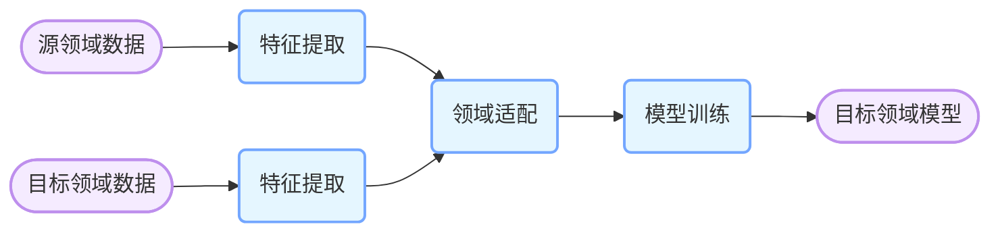

# 金融领域的迁移学习应用研究

> 关键词：金融领域、迁移学习、机器学习、数据挖掘、风险评估、投资决策、信贷分析

> 摘要：本文聚焦于金融领域的迁移学习应用研究。迁移学习作为机器学习的一个重要分支，能够将从一个或多个源领域学到的知识迁移到目标领域，有效解决金融领域数据稀缺、标注成本高以及领域间知识复用等问题。文章首先介绍了研究的背景、目的、预期读者等内容，接着阐述了迁移学习的核心概念与联系，详细讲解了核心算法原理及具体操作步骤，给出了相关数学模型和公式，通过项目实战展示了迁移学习在金融领域的具体应用，分析了实际应用场景，推荐了相关工具和资源，最后总结了未来发展趋势与挑战，并提供了常见问题解答和扩展阅读参考资料，旨在为金融领域的研究者和从业者提供全面深入的迁移学习应用指导。

## 1. 背景介绍 
### 1.1 目的和范围
在金融领域，数据具有高价值但同时也面临诸多挑战，如数据标注困难、不同金融场景下数据分布差异大等。本研究的目的在于深入探讨迁移学习在金融领域的应用，挖掘其在解决金融数据问题、提升金融模型性能等方面的潜力。研究范围涵盖了金融领域的多个方面，包括但不限于信贷风险评估、投资决策、市场趋势预测等，旨在全面展示迁移学习在金融领域的应用价值和可行性。

### 1.2 预期读者
本文预期读者包括金融领域的从业者，如银行信贷分析师、投资经理、金融数据分析师等，他们可以通过本文了解迁移学习在实际工作中的应用方法和优势，从而改进现有的金融分析和决策模型。同时，也适合机器学习和人工智能领域的研究者和开发者，为他们提供金融领域这一具体应用场景下的迁移学习研究思路和实践案例。此外，对金融科技感兴趣的学生和爱好者也能从本文中获取相关知识和信息。

### 1.3 文档结构概述
本文首先介绍了研究的背景信息，包括目的、预期读者和文档结构概述等内容。接着，详细阐述了迁移学习的核心概念与联系，通过文本示意图和 Mermaid 流程图进行直观展示。然后，讲解了迁移学习的核心算法原理，并给出具体操作步骤，同时用 Python 源代码进行详细阐述。之后，介绍了相关的数学模型和公式，并举例说明。通过项目实战部分，展示了迁移学习在金融领域的实际应用，包括开发环境搭建、源代码实现和代码解读。分析了迁移学习在金融领域的实际应用场景，推荐了相关的工具和资源。最后，总结了未来发展趋势与挑战，提供了常见问题解答和扩展阅读参考资料。

### 1.4 术语表
#### 1.4.1 核心术语定义
- **迁移学习**：是一种机器学习方法，旨在将从一个或多个源领域学到的知识迁移到目标领域，以提高目标领域的学习性能。
- **源领域**：是指已经有大量数据和知识积累的领域，迁移学习从中获取可迁移的知识。
- **目标领域**：是指需要应用迁移学习知识来解决问题的领域，通常数据较少或标注成本较高。
- **特征表示**：是指将原始数据转换为一种适合机器学习算法处理的表示形式，在迁移学习中，合适的特征表示有助于知识的迁移。
- **模型泛化能力**：是指模型在未见过的数据上的表现能力，迁移学习可以通过知识迁移提高模型的泛化能力。

#### 1.4.2 相关概念解释
- **领域自适应**：是迁移学习中的一个重要概念，它旨在调整源领域和目标领域之间的分布差异，使得从源领域学到的知识能够更好地应用到目标领域。
- **多源迁移学习**：是指从多个不同的源领域中获取知识，并将其迁移到目标领域，以充分利用不同源领域的信息。
- **负迁移**：是指在迁移学习过程中，由于源领域和目标领域的差异过大或迁移方法不当，导致目标领域的学习性能反而下降的现象。

#### 1.4.3 缩略词列表
- **ML**：Machine Learning，机器学习
- **TL**：Transfer Learning，迁移学习
- **SVM**：Support Vector Machine，支持向量机
- **CNN**：Convolutional Neural Network，卷积神经网络
- **RNN**：Recurrent Neural Network，循环神经网络

## 2. 核心概念与联系 
### 2.1 迁移学习的基本原理
迁移学习的基本思想是利用源领域和目标领域之间的相关性，将源领域的知识迁移到目标领域，从而提高目标领域的学习效率和性能。在金融领域，不同的金融场景可能存在一定的相似性，例如不同地区的信贷风险评估、不同类型的投资决策等，迁移学习可以利用这些相似性，将在一个场景中学习到的知识应用到其他场景中。

### 2.2 迁移学习的分类
迁移学习可以根据不同的标准进行分类，常见的分类方法包括基于迁移层次的分类和基于迁移场景的分类。
- **基于迁移层次的分类**
    - **样本迁移**：直接将源领域的样本迁移到目标领域，通过调整样本的权重或进行样本选择来实现知识迁移。
    - **特征迁移**：将源领域和目标领域的特征进行映射和转换，使得它们在特征空间中具有相似性，从而实现知识迁移。
    - **模型迁移**：将在源领域训练好的模型迁移到目标领域，通过微调模型的参数来适应目标领域的任务。
    - **关系迁移**：挖掘源领域和目标领域之间的关系，如因果关系、依赖关系等，将这些关系迁移到目标领域。
- **基于迁移场景的分类**
    - **同构迁移学习**：源领域和目标领域具有相同的特征空间和数据分布，只是样本数量或标签信息不同。
    - **异构迁移学习**：源领域和目标领域的特征空间或数据分布不同，需要进行更复杂的知识迁移。

### 2.3 迁移学习与传统机器学习的联系与区别
迁移学习和传统机器学习都是机器学习领域的重要方法，但它们有一些明显的区别。传统机器学习通常假设训练数据和测试数据来自相同的分布，并且需要大量的标注数据来训练模型。而迁移学习则可以处理源领域和目标领域数据分布不同的情况，并且可以利用源领域的知识来减少目标领域对标注数据的需求。同时，迁移学习也可以看作是传统机器学习的扩展，它在传统机器学习的基础上引入了知识迁移的思想，以提高模型的泛化能力和学习效率。

### 2.4 文本示意图
迁移学习的核心概念可以用以下文本示意图来表示：

源领域（大量数据、丰富知识） -- 知识提取 -- 迁移方法 -- 目标领域（数据稀缺、待解决问题）

在这个过程中，知识提取是从源领域中获取有用的知识，迁移方法则是将这些知识应用到目标领域的具体手段，通过这种方式，目标领域可以利用源领域的知识来提升自身的学习性能。

### 2.5 Mermaid 流程图

这个流程图展示了迁移学习的基本流程。首先从源领域和目标领域的数据中提取特征，然后进行领域适配，以减少两个领域之间的差异，最后利用适配后的特征进行模型训练，得到适用于目标领域的模型。

## 3. 核心算法原理 & 具体操作步骤 
### 3.1 基于特征迁移的算法原理
基于特征迁移的算法旨在寻找一种合适的特征表示，使得源领域和目标领域的特征在该表示下具有相似性。常见的基于特征迁移的算法有最大均值差异（MMD）和多核学习（MKL）。

#### 3.1.1 最大均值差异（MMD）
最大均值差异是一种衡量两个分布之间差异的方法，它通过计算两个分布在再生核希尔伯特空间（RKHS）中的均值差异来度量分布差异。具体来说，给定源领域样本 $X_s = \{x_{s1}, x_{s2}, \cdots, x_{sn_s}\}$ 和目标领域样本 $X_t = \{x_{t1}, x_{t2}, \cdots, x_{tn_t}\}$，MMD 定义为：

$$MMD^2(X_s, X_t) = \left\|\frac{1}{n_s}\sum_{i=1}^{n_s}\phi(x_{si}) - \frac{1}{n_t}\sum_{j=1}^{n_t}\phi(x_{tj})\right\|^2_{\mathcal{H}}$$

其中，$\phi(x)$ 是将样本 $x$ 映射到再生核希尔伯特空间 $\mathcal{H}$ 的映射函数。MMD 的目标是找到一个合适的特征变换，使得 $MMD^2(X_s, X_t)$ 最小化，从而减小源领域和目标领域之间的分布差异。

#### 3.1.2 多核学习（MKL）
多核学习是一种将多个核函数组合起来的方法，它可以更灵活地处理不同类型的数据和分布。在迁移学习中，MKL 可以用于寻找一种合适的核函数组合，使得源领域和目标领域的特征在该组合核下具有相似性。具体来说，MKL 可以表示为：

$$K(x, y) = \sum_{k=1}^{K}\beta_k K_k(x, y)$$

其中，$K_k(x, y)$ 是第 $k$ 个核函数，$\beta_k$ 是对应的权重，且 $\sum_{k=1}^{K}\beta_k = 1$，$\beta_k \geq 0$。MKL 的目标是找到最优的权重 $\beta_k$，使得源领域和目标领域的特征在组合核 $K(x, y)$ 下的 MMD 最小化。

### 3.2 基于模型迁移的算法原理
基于模型迁移的算法是将在源领域训练好的模型迁移到目标领域，并对模型进行微调以适应目标领域的任务。常见的基于模型迁移的算法有微调预训练模型和多任务学习。

#### 3.2.1 微调预训练模型
微调预训练模型是一种常用的模型迁移方法，它首先在源领域上训练一个大规模的模型，然后将该模型的部分或全部参数作为初始化参数，在目标领域上进行微调。例如，在图像识别领域，可以先在大规模图像数据集上训练一个卷积神经网络（CNN），然后将该 CNN 的参数作为初始化参数，在特定的图像分类任务上进行微调。

#### 3.2.2 多任务学习
多任务学习是一种同时学习多个相关任务的方法，它可以通过共享模型的参数来提高模型的泛化能力和学习效率。在迁移学习中，多任务学习可以将源领域和目标领域的任务作为多个相关任务进行学习，通过共享部分模型参数来实现知识迁移。

### 3.3 具体操作步骤
#### 3.3.1 数据准备
- 收集源领域和目标领域的数据，确保数据的质量和完整性。
- 对数据进行预处理，包括数据清洗、特征选择、归一化等操作。

#### 3.3.2 特征提取
- 根据数据的特点和任务需求，选择合适的特征提取方法，如主成分分析（PCA）、线性判别分析（LDA）等。
- 提取源领域和目标领域的特征，得到特征表示。

#### 3.3.3 领域适配
- 根据选择的迁移算法，进行领域适配操作，如使用 MMD 或 MKL 来减小源领域和目标领域之间的分布差异。

#### 3.3.4 模型训练
- 根据任务需求，选择合适的机器学习模型，如支持向量机（SVM）、神经网络等。
- 使用适配后的特征进行模型训练，得到目标领域的模型。

#### 3.3.5 模型评估
- 使用目标领域的测试数据对训练好的模型进行评估，计算模型的性能指标，如准确率、召回率、F1 值等。

### 3.4 Python 源代码实现
以下是一个基于 MMD 的特征迁移示例代码：

```python
import numpy as np
from sklearn.metrics.pairwise import rbf_kernel

def mmd(X_s, X_t, gamma=1.0):
    """
    计算最大均值差异（MMD）
    :param X_s: 源领域样本
    :param X_t: 目标领域样本
    :param gamma: 核函数的带宽参数
    :return: MMD 值
    """
    n_s = X_s.shape[0]
    n_t = X_t.shape[0]
    K_ss = rbf_kernel(X_s, X_s, gamma=gamma)
    K_st = rbf_kernel(X_s, X_t, gamma=gamma)
    K_tt = rbf_kernel(X_t, X_t, gamma=gamma)
    mmd_value = np.sum(K_ss) / (n_s * n_s) - 2 * np.sum(K_st) / (n_s * n_t) + np.sum(K_tt) / (n_t * n_t)
    return mmd_value

# 示例数据
X_s = np.random.rand(100, 10)  # 源领域样本
X_t = np.random.rand(50, 10)   # 目标领域样本

# 计算 MMD
mmd_value = mmd(X_s, X_t)
print("MMD 值:", mmd_value)
```

这段代码实现了最大均值差异（MMD）的计算，通过计算源领域和目标领域样本之间的核矩阵，然后根据 MMD 的定义计算出 MMD 值。

## 4. 数学模型和公式 & 详细讲解 & 举例说明 
### 4.1 最大均值差异（MMD）的数学模型和公式
如前面所述，MMD 的定义为：

$$MMD^2(X_s, X_t) = \left\|\frac{1}{n_s}\sum_{i=1}^{n_s}\phi(x_{si}) - \frac{1}{n_t}\sum_{j=1}^{n_t}\phi(x_{tj})\right\|^2_{\mathcal{H}}$$

详细讲解：
- $\phi(x)$ 是将样本 $x$ 映射到再生核希尔伯特空间 $\mathcal{H}$ 的映射函数。在实际应用中，通常使用核函数来计算 $\phi(x)$ 的内积，而不需要显式地计算 $\phi(x)$ 本身。
- $\frac{1}{n_s}\sum_{i=1}^{n_s}\phi(x_{si})$ 是源领域样本在再生核希尔伯特空间中的均值，$\frac{1}{n_t}\sum_{j=1}^{n_t}\phi(x_{tj})$ 是目标领域样本在再生核希尔伯特空间中的均值。
- $\left\|\cdot\right\|^2_{\mathcal{H}}$ 表示在再生核希尔伯特空间 $\mathcal{H}$ 中的范数平方。

举例说明：
假设我们有两个一维的样本集合，源领域样本 $X_s = \{1, 2, 3\}$，目标领域样本 $X_t = \{4, 5, 6\}$。我们使用高斯核函数 $K(x, y) = \exp(-\frac{\|x - y\|^2}{2\sigma^2})$ 来计算 MMD。

首先，计算核矩阵：
$K_{ss} = \begin{bmatrix}
K(1, 1) & K(1, 2) & K(1, 3) \\
K(2, 1) & K(2, 2) & K(2, 3) \\
K(3, 1) & K(3, 2) & K(3, 3)
\end{bmatrix}$

$K_{st} = \begin{bmatrix}
K(1, 4) & K(1, 5) & K(1, 6) \\
K(2, 4) & K(2, 5) & K(2, 6) \\
K(3, 4) & K(3, 5) & K(3, 6)
\end{bmatrix}$

$K_{tt} = \begin{bmatrix}
K(4, 4) & K(4, 5) & K(4, 6) \\
K(5, 4) & K(5, 5) & K(5, 6) \\
K(6, 4) & K(6, 5) & K(6, 6)
\end{bmatrix}$

然后，根据 MMD 的定义计算 MMD 值：
$MMD^2(X_s, X_t) = \frac{1}{3^2}\sum_{i=1}^{3}\sum_{j=1}^{3}K_{ss}(i, j) - \frac{2}{3\times3}\sum_{i=1}^{3}\sum_{j=1}^{3}K_{st}(i, j) + \frac{1}{3^2}\sum_{i=1}^{3}\sum_{j=1}^{3}K_{tt}(i, j)$

### 4.2 多核学习（MKL）的数学模型和公式
多核学习的数学模型可以表示为：

$$K(x, y) = \sum_{k=1}^{K}\beta_k K_k(x, y)$$

其中，$K_k(x, y)$ 是第 $k$ 个核函数，$\beta_k$ 是对应的权重，且 $\sum_{k=1}^{K}\beta_k = 1$，$\beta_k \geq 0$。

详细讲解：
- 多核学习通过将多个核函数组合起来，以更灵活地处理不同类型的数据和分布。
- 权重 $\beta_k$ 表示每个核函数的重要性，通过优化 $\beta_k$ 可以找到最优的核函数组合。

举例说明：
假设我们有两个核函数 $K_1(x, y) = x^T y$（线性核）和 $K_2(x, y) = \exp(-\frac{\|x - y\|^2}{2\sigma^2})$（高斯核）。我们可以将它们组合成一个新的核函数：

$K(x, y) = \beta_1 K_1(x, y) + \beta_2 K_2(x, y)$

其中，$\beta_1 + \beta_2 = 1$，$\beta_1 \geq 0$，$\beta_2 \geq 0$。通过优化 $\beta_1$ 和 $\beta_2$，可以找到最优的核函数组合，使得源领域和目标领域的特征在该组合核下的 MMD 最小化。

### 4.3 基于模型迁移的数学模型和公式
#### 4.3.1 微调预训练模型
微调预训练模型的数学模型可以表示为：

$\theta_{new} = \theta_{old} + \Delta\theta$

其中，$\theta_{old}$ 是预训练模型的参数，$\Delta\theta$ 是在目标领域上微调得到的参数更新量，$\theta_{new}$ 是微调后的模型参数。

详细讲解：
- 微调预训练模型的过程是在预训练模型的基础上，使用目标领域的数据对模型进行进一步的训练，以更新模型的参数。
- $\Delta\theta$ 通常通过优化目标领域的损失函数来计算，例如使用梯度下降法。

举例说明：
假设我们有一个在 ImageNet 数据集上预训练的卷积神经网络（CNN），其参数为 $\theta_{old}$。现在我们要将该 CNN 应用到一个特定的图像分类任务上，我们可以使用该任务的训练数据对 CNN 进行微调，通过最小化该任务的损失函数 $L(\theta)$，得到参数更新量 $\Delta\theta$，从而得到微调后的模型参数 $\theta_{new}$。

#### 4.3.2 多任务学习
多任务学习的数学模型可以表示为：

$\min_{\theta}\sum_{i=1}^{M}\lambda_i L_i(\theta) + \Omega(\theta)$

其中，$L_i(\theta)$ 是第 $i$ 个任务的损失函数，$\lambda_i$ 是第 $i$ 个任务的权重，$\Omega(\theta)$ 是正则化项，$\theta$ 是模型的参数。

详细讲解：
- 多任务学习通过同时优化多个任务的损失函数，来共享模型的参数，提高模型的泛化能力和学习效率。
- 权重 $\lambda_i$ 表示每个任务的重要性，通过调整 $\lambda_i$ 可以平衡不同任务的学习。

举例说明：
假设我们有两个相关的任务，任务 1 是图像分类任务，任务 2 是图像分割任务。我们可以使用多任务学习的方法，同时优化这两个任务的损失函数，例如：

$\min_{\theta}\lambda_1 L_1(\theta) + \lambda_2 L_2(\theta) + \Omega(\theta)$

其中，$L_1(\theta)$ 是图像分类任务的损失函数，$L_2(\theta)$ 是图像分割任务的损失函数，$\lambda_1$ 和 $\lambda_2$ 是对应的权重。

## 5. 项目实战：代码实际案例和详细解释说明 
### 5.1  开发环境搭建
#### 5.1.1 操作系统
可以选择 Windows、Linux 或 macOS 等常见的操作系统。本项目实战以 Ubuntu 18.04 为例进行说明。

#### 5.1.2 编程语言和环境
- **Python**：选择 Python 3.7 或以上版本。可以使用 Anaconda 来管理 Python 环境，Anaconda 提供了方便的包管理和环境管理功能。
- **安装 Anaconda**：从 Anaconda 官方网站下载适合自己操作系统的安装包，然后按照安装向导进行安装。

#### 5.1.3 安装必要的库
在 Anaconda 环境中，使用以下命令安装必要的库：
```bash
conda install numpy pandas scikit-learn matplotlib
```

### 5.2  源代码详细实现和代码解读
#### 5.2.1 数据准备
我们使用一个简化的信贷风险评估数据集作为示例，假设我们有一个源领域数据集和一个目标领域数据集，分别表示不同地区的信贷数据。

```python
import numpy as np
import pandas as pd

# 生成示例数据
np.random.seed(42)
# 源领域数据
n_s = 100
X_s = np.random.randn(n_s, 5)
y_s = np.random.randint(0, 2, n_s)

# 目标领域数据
n_t = 50
X_t = np.random.randn(n_t, 5)
y_t = np.random.randint(0, 2, n_t)

# 将数据转换为 DataFrame 格式
df_s = pd.DataFrame(X_s, columns=['feature1', 'feature2', 'feature3', 'feature4', 'feature5'])
df_s['label'] = y_s

df_t = pd.DataFrame(X_t, columns=['feature1', 'feature2', 'feature3', 'feature4', 'feature5'])
df_t['label'] = y_t

# 保存数据
df_s.to_csv('source_data.csv', index=False)
df_t.to_csv('target_data.csv', index=False)
```
代码解读：
- 首先，使用 `numpy` 生成随机的源领域和目标领域数据，包括特征和标签。
- 然后，将数据转换为 `pandas` 的 `DataFrame` 格式，并添加列名。
- 最后，将数据保存为 CSV 文件。

#### 5.2.2 特征迁移
我们使用 MMD 来进行特征迁移，以减小源领域和目标领域之间的分布差异。

```python
from sklearn.metrics.pairwise import rbf_kernel

def mmd(X_s, X_t, gamma=1.0):
    """
    计算最大均值差异（MMD）
    :param X_s: 源领域样本
    :param X_t: 目标领域样本
    :param gamma: 核函数的带宽参数
    :return: MMD 值
    """
    n_s = X_s.shape[0]
    n_t = X_t.shape[0]
    K_ss = rbf_kernel(X_s, X_s, gamma=gamma)
    K_st = rbf_kernel(X_s, X_t, gamma=gamma)
    K_tt = rbf_kernel(X_t, X_t, gamma=gamma)
    mmd_value = np.sum(K_ss) / (n_s * n_s) - 2 * np.sum(K_st) / (n_s * n_t) + np.sum(K_tt) / (n_t * n_t)
    return mmd_value

# 加载数据
df_s = pd.read_csv('source_data.csv')
df_t = pd.read_csv('target_data.csv')

X_s = df_s.drop('label', axis=1).values
y_s = df_s['label'].values

X_t = df_t.drop('label', axis=1).values
y_t = df_t['label'].values

# 计算 MMD
mmd_value = mmd(X_s, X_t)
print("MMD 值:", mmd_value)
```
代码解读：
- 定义了 `mmd` 函数来计算最大均值差异（MMD），使用高斯核函数来计算核矩阵。
- 加载源领域和目标领域的数据，提取特征和标签。
- 调用 `mmd` 函数计算 MMD 值，并打印结果。

#### 5.2.3 模型训练和评估
我们使用支持向量机（SVM）作为分类模型，分别在源领域数据和迁移后的目标领域数据上进行训练和评估。

```python
from sklearn.svm import SVC
from sklearn.metrics import accuracy_score

# 在源领域数据上训练模型
model_s = SVC()
model_s.fit(X_s, y_s)

# 在源领域数据上评估模型
y_pred_s = model_s.predict(X_s)
accuracy_s = accuracy_score(y_s, y_pred_s)
print("源领域模型准确率:", accuracy_s)

# 在目标领域数据上直接训练模型
model_t_direct = SVC()
model_t_direct.fit(X_t, y_t)

# 在目标领域数据上评估直接训练的模型
y_pred_t_direct = model_t_direct.predict(X_t)
accuracy_t_direct = accuracy_score(y_t, y_pred_t_direct)
print("目标领域直接训练模型准确率:", accuracy_t_direct)

# 迁移学习：使用源领域模型在目标领域数据上进行预测
y_pred_t_transfer = model_s.predict(X_t)
accuracy_t_transfer = accuracy_score(y_t, y_pred_t_transfer)
print("迁移学习模型准确率:", accuracy_t_transfer)
```
代码解读：
- 使用 `sklearn` 中的 `SVC` 类创建支持向量机模型。
- 在源领域数据上训练模型，并评估模型的准确率。
- 在目标领域数据上直接训练模型，并评估模型的准确率。
- 使用源领域训练好的模型在目标领域数据上进行预测，并评估迁移学习模型的准确率。

### 5.3  代码解读与分析
#### 5.3.1 数据准备阶段
在数据准备阶段，我们生成了示例数据并保存为 CSV 文件，这样可以方便后续的数据处理和分析。使用 `pandas` 库可以方便地处理数据，包括数据的读取、转换和保存。

#### 5.3.2 特征迁移阶段
在特征迁移阶段，我们使用 MMD 来计算源领域和目标领域之间的分布差异。MMD 是一种有效的衡量两个分布差异的方法，通过最小化 MMD 值，可以减小源领域和目标领域之间的分布差异，从而提高迁移学习的效果。

#### 5.3.3 模型训练和评估阶段
在模型训练和评估阶段，我们分别在源领域数据、目标领域数据上直接训练模型，以及使用迁移学习的方法在目标领域数据上进行预测。通过比较不同模型的准确率，可以评估迁移学习的效果。一般来说，如果迁移学习模型的准确率高于目标领域直接训练模型的准确率，说明迁移学习起到了积极的作用，能够利用源领域的知识来提高目标领域的学习性能。

## 6. 实际应用场景 
### 6.1 信贷风险评估
在信贷风险评估中，不同地区或不同时间段的信贷数据可能存在分布差异。迁移学习可以利用在其他地区或时间段积累的信贷数据知识，来帮助评估目标地区或时间段的信贷风险。例如，银行在一个新的地区开展业务，可能缺乏该地区的历史信贷数据，但可以利用在其他地区积累的大量数据进行迁移学习，从而建立更准确的信贷风险评估模型。

### 6.2 投资决策
在投资决策中，不同的投资领域和市场环境可能存在一定的相似性。迁移学习可以将在一个投资领域学到的知识迁移到其他投资领域，帮助投资者做出更明智的投资决策。例如，投资者可以利用股票市场的分析模型和知识，迁移到债券市场或期货市场，以提高投资决策的准确性。

### 6.3 市场趋势预测
市场趋势预测是金融领域的一个重要任务，不同的金融市场可能受到相似的宏观经济因素和市场情绪的影响。迁移学习可以利用在一个金融市场学到的趋势预测知识，迁移到其他金融市场，提高市场趋势预测的准确性。例如，通过分析股票市场的趋势预测模型，迁移到外汇市场或商品市场，以更好地预测市场走势。

### 6.4 金融欺诈检测
金融欺诈检测需要处理大量的交易数据，不同类型的金融欺诈行为可能存在一定的相似性。迁移学习可以将在一种金融欺诈类型上学到的检测知识，迁移到其他金融欺诈类型上，提高金融欺诈检测的效率和准确性。例如，通过分析信用卡欺诈的检测模型，迁移到网络支付欺诈或贷款欺诈的检测中。

## 7. 工具和资源推荐
### 7.1 学习资源推荐
#### 7.1.1 书籍推荐
- 《机器学习》（周志华著）：这本书是机器学习领域的经典教材，全面介绍了机器学习的基本概念、算法和应用，对于理解迁移学习的基础知识有很大帮助。
- 《深度学习》（Ian Goodfellow、Yoshua Bengio 和 Aaron Courville 著）：深度学习是迁移学习的重要基础，这本书详细介绍了深度学习的原理、算法和应用，对于深入理解迁移学习中的神经网络模型有很大帮助。
- 《迁移学习》（Sinno Jialin Pan 和 Qiang Yang 著）：这是一本专门介绍迁移学习的书籍，全面系统地介绍了迁移学习的理论、算法和应用，是学习迁移学习的重要参考资料。

#### 7.1.2 在线课程
- Coursera 上的 “Machine Learning” 课程（由 Andrew Ng 教授授课）：这是一门非常经典的机器学习课程，涵盖了机器学习的基本概念、算法和应用，对于初学者来说是一个很好的入门课程。
- edX 上的 “Deep Learning Specialization” 课程：这是一个深度学习的专项课程，由多位深度学习领域的专家授课，内容涵盖了深度学习的各个方面，对于深入学习深度学习和迁移学习有很大帮助。
- 中国大学 MOOC 上的 “机器学习基础” 课程：这是一门由国内高校教师授课的机器学习课程，内容丰富，讲解详细，适合国内学生学习。

#### 7.1.3 技术博客和网站
- Medium 上的机器学习和人工智能相关博客：Medium 上有很多机器学习和人工智能领域的优秀博客，作者们会分享最新的研究成果、技术应用和实践经验，对于了解迁移学习的最新动态有很大帮助。
- arXiv 网站：arXiv 是一个预印本数据库，收录了大量的学术论文，其中包括很多迁移学习领域的最新研究成果，可以通过 arXiv 网站及时了解迁移学习的前沿技术。
- 开源中国（OSChina）：开源中国是一个国内的开源技术社区，上面有很多关于机器学习和人工智能的技术文章和开源项目，对于学习和实践迁移学习有很大帮助。

### 7.2 开发工具框架推荐
#### 7.2.1 IDE和编辑器
- PyCharm：PyCharm 是一款专门为 Python 开发设计的集成开发环境（IDE），提供了丰富的功能，如代码编辑、调试、代码分析等，对于开发迁移学习相关的 Python 代码非常方便。
- Jupyter Notebook：Jupyter Notebook 是一个交互式的开发环境，支持多种编程语言，如 Python、R 等。它可以将代码、文本、图表等内容整合在一起，方便进行数据分析和模型训练，对于快速验证迁移学习算法和模型非常有用。
- Visual Studio Code：Visual Studio Code 是一款轻量级的代码编辑器，支持多种编程语言和插件扩展。它具有丰富的代码编辑功能和调试功能，对于开发迁移学习相关的代码也非常方便。

#### 7.2.2 调试和性能分析工具
- PDB：PDB 是 Python 自带的调试工具，可以在代码中设置断点，逐步执行代码，查看变量的值和程序的执行流程，对于调试迁移学习相关的 Python 代码非常有用。
- TensorBoard：TensorBoard 是 TensorFlow 提供的一个可视化工具，可以用于可视化模型的训练过程、损失函数的变化、模型的结构等，对于分析迁移学习模型的性能和优化模型非常有帮助。
- Scikit-learn 中的性能评估工具：Scikit-learn 提供了丰富的性能评估工具，如准确率、召回率、F1 值等，可以用于评估迁移学习模型的性能，帮助开发者选择合适的模型和参数。

#### 7.2.3 相关框架和库
- Scikit-learn：Scikit-learn 是一个开源的机器学习库，提供了丰富的机器学习算法和工具，如分类、回归、聚类等。它可以用于实现迁移学习中的基本算法和模型，如 SVM、决策树等。
- TensorFlow：TensorFlow 是一个开源的深度学习框架，提供了丰富的深度学习模型和工具，如神经网络、卷积神经网络等。它可以用于实现迁移学习中的深度学习模型，如微调预训练的神经网络模型。
- PyTorch：PyTorch 是另一个开源的深度学习框架，具有简洁易用的特点，提供了丰富的深度学习模型和工具。它也可以用于实现迁移学习中的深度学习模型，并且在学术界有广泛的应用。

### 7.3 相关论文著作推荐
#### 7.3.1 经典论文
- “A Survey on Transfer Learning”（Sinno Jialin Pan 和 Qiang Yang 著）：这是一篇关于迁移学习的经典综述论文，全面系统地介绍了迁移学习的理论、算法和应用，是学习迁移学习的重要参考资料。
- “Domain Adaptation via Transfer Component Analysis”（Sinno Jialin Pan 等著）：这篇论文提出了一种基于迁移成分分析（TCA）的领域自适应方法，是迁移学习领域的经典论文之一。
- “Deep Transfer Learning with Joint Adaptation Networks”（Mingsheng Long 等著）：这篇论文提出了一种基于联合自适应网络（JAN）的深度迁移学习方法，在深度学习和迁移学习领域有重要的影响。

#### 7.3.2 最新研究成果
- 可以通过 arXiv 网站、ACM 数字图书馆、IEEE Xplore 等学术数据库查找迁移学习领域的最新研究成果。关注最新的研究成果可以帮助我们了解迁移学习的前沿技术和发展趋势。

#### 7.3.3 应用案例分析
- 可以通过查阅相关的学术论文、行业报告和案例分析，了解迁移学习在金融领域的实际应用案例。分析这些应用案例可以帮助我们更好地理解迁移学习在金融领域的应用方法和效果，为实际应用提供参考。

## 8. 总结：未来发展趋势与挑战
### 8.1 未来发展趋势
#### 8.1.1 深度迁移学习的发展
随着深度学习技术的不断发展，深度迁移学习将成为迁移学习领域的一个重要发展方向。深度迁移学习可以利用深度神经网络的强大特征表示能力，更好地处理复杂的数据和任务，提高迁移学习的性能和效果。例如，通过微调预训练的深度神经网络模型，可以在不同的图像分类任务、自然语言处理任务等之间进行知识迁移。

#### 8.1.2 多模态迁移学习的兴起
在现实世界中，数据往往具有多种模态，如图像、文本、音频等。多模态迁移学习可以将不同模态的数据知识进行迁移，从而更好地处理多模态数据和任务。例如，在金融领域，可以将图像数据（如财务报表图像）和文本数据（如新闻报道）的知识进行迁移，以提高金融分析和决策的准确性。

#### 8.1.3 迁移学习与强化学习的结合
迁移学习和强化学习都是机器学习领域的重要分支，将它们结合起来可以更好地解决复杂的决策问题。在金融领域，迁移学习可以将在一个金融场景中学习到的策略和知识迁移到其他金融场景中，强化学习可以通过与环境的交互不断优化策略，从而提高金融决策的效率和效果。

#### 8.1.4 迁移学习在金融科技中的广泛应用
随着金融科技的不断发展，迁移学习将在金融领域得到更广泛的应用。例如，在智能投顾、风险评估、金融监管等方面，迁移学习可以帮助金融机构更好地处理数据和知识，提高业务效率和决策准确性。

### 8.2 挑战
#### 8.2.1 领域差异问题
源领域和目标领域之间的差异是迁移学习面临的一个主要挑战。不同的金融场景可能具有不同的数据分布、特征空间和任务需求，如何有效地处理这些差异，是提高迁移学习性能的关键。例如，在不同地区的信贷风险评估中，由于地区经济发展水平、文化背景等因素的差异，信贷数据的分布和特征可能存在很大的不同，需要寻找合适的迁移方法来处理这些差异。

#### 8.2.2 负迁移问题
负迁移是迁移学习中一个严重的问题，它可能导致目标领域的学习性能反而下降。在金融领域，由于数据的复杂性和不确定性，负迁移问题可能更加突出。例如，在将一个金融市场的分析模型迁移到另一个金融市场时，如果两个市场的环境和规律差异过大，可能会导致负迁移，使得迁移学习的效果不如直接在目标市场上训练模型。

#### 8.2.3 数据隐私和安全问题
在金融领域，数据隐私和安全是非常重要的问题。迁移学习需要共享和使用不同领域的数据，这可能会涉及到数据隐私和安全问题。例如，在将一个银行的客户信贷数据迁移到另一个银行进行风险评估时，需要确保客户数据的隐私和安全，防止数据泄露和滥用。

#### 8.2.4 模型可解释性问题
在金融领域，模型的可解释性是非常重要的。迁移学习中的深度学习模型往往具有较高的复杂度，其决策过程和结果难以解释。这可能会影响金融机构对模型的信任和使用，需要研究如何提高迁移学习模型的可解释性，以便更好地应用于金融决策。

## 9. 附录：常见问题与解答
### 9.1 迁移学习适用于所有金融场景吗？
迁移学习并不适用于所有金融场景。迁移学习的效果取决于源领域和目标领域之间的相关性。如果两个领域之间的差异过大，可能会导致负迁移，使得目标领域的学习性能下降。因此，在应用迁移学习之前，需要对源领域和目标领域的数据和任务进行分析，评估它们之间的相关性，选择合适的迁移方法和模型。

### 9.2 如何选择合适的迁移算法？
选择合适的迁移算法需要考虑多个因素，如源领域和目标领域的数据分布、特征空间、任务需求等。一般来说，如果源领域和目标领域的特征空间相似，可以选择基于特征迁移的算法，如 MMD、MKL 等；如果源领域和目标领域的任务相似，可以选择基于模型迁移的算法，如微调预训练模型、多任务学习等。此外，还可以通过实验比较不同迁移算法的性能，选择最优的算法。

### 9.3 迁移学习会增加模型的复杂度吗？
迁移学习可能会增加模型的复杂度，特别是在使用深度学习模型进行迁移学习时。例如，微调预训练的深度神经网络模型需要调整大量的参数，可能会增加模型的复杂度。但是，迁移学习也可以通过利用源领域的知识来减少目标领域对标注数据的需求，从而在一定程度上降低模型的训练成本和复杂度。因此，需要在模型复杂度和性能之间进行权衡。

### 9.4 如何评估迁移学习模型的性能？
评估迁移学习模型的性能可以使用传统的机器学习评估指标，如准确率、召回率、F1 值等。此外，还可以比较迁移学习模型和直接在目标领域训练的模型的性能，评估迁移学习的效果。在评估过程中，需要注意使用独立的测试数据，以确保评估结果的准确性和可靠性。

## 10. 扩展阅读 & 参考资料
### 10.1 扩展阅读
- 可以阅读更多关于机器学习、深度学习和迁移学习的书籍和论文，深入了解相关的理论和算法。
- 关注金融领域的最新研究成果和实践案例，了解迁移学习在金融领域的最新应用和发展趋势。
- 参与相关的学术会议和技术交流活动，与同行进行交流和讨论，获取更多的知识和经验。

### 10.2 参考资料
- 周志华. 机器学习[M]. 清华大学出版社, 2016.
- Ian Goodfellow, Yoshua Bengio, Aaron Courville. 深度学习[M]. 人民邮电出版社, 2017.
- Sinno Jialin Pan, Qiang Yang. A Survey on Transfer Learning[J]. IEEE Transactions on Knowledge and Data Engineering, 2010, 22(10): 1345-1359.
- Sinno Jialin Pan, et al. Domain Adaptation via Transfer Component Analysis[J]. IEEE Transactions on Neural Networks, 2011, 22(2): 199-210.
- Mingsheng Long, et al. Deep Transfer Learning with Joint Adaptation Networks[C]. Proceedings of the International Conference on Machine Learning, 2017: 2208-2217.