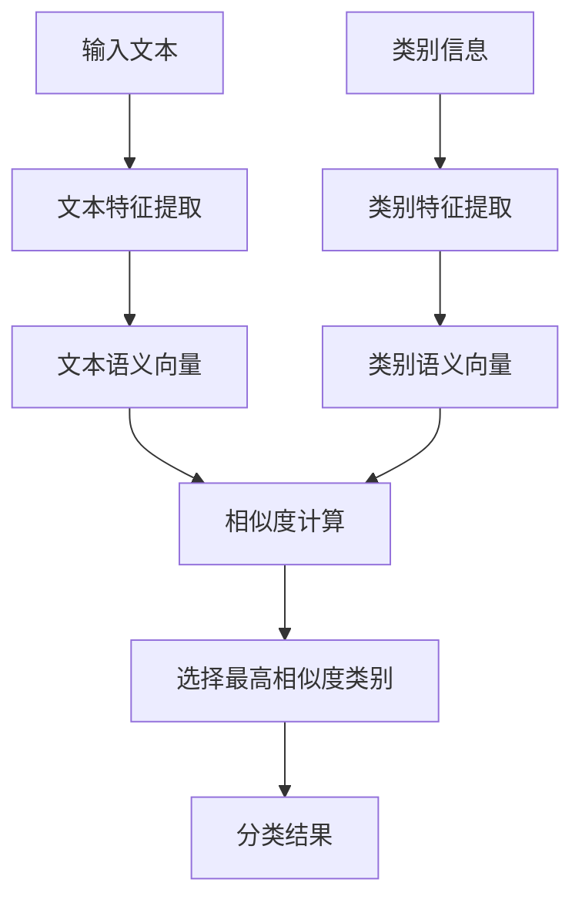

# 零样本文本分类:利用语义知识处理未知类别

> 关键词：零样本文本分类、语义知识、未知类别、文本特征、分类算法

> 摘要：本文围绕零样本文本分类展开，详细阐述了利用语义知识处理未知类别的技术。首先介绍了零样本文本分类的背景，包括其目的、适用读者和文档结构。接着深入探讨了核心概念、算法原理、数学模型等内容。通过Python代码给出了具体的操作步骤和项目实战案例，分析了实际应用场景。还推荐了相关的学习资源、开发工具和论文著作。最后总结了该领域的未来发展趋势与挑战，并提供了常见问题解答和扩展阅读参考资料，旨在帮助读者全面了解和掌握零样本文本分类技术。

## 1. 背景介绍 
### 1.1 目的和范围
零样本文本分类旨在解决在缺乏特定类别样本的情况下对文本进行分类的问题。传统的文本分类方法通常依赖于大量标注好的样本数据来训练模型，然而在实际应用中，新的类别可能会不断涌现，获取这些新类别的标注样本往往是困难且耗时的。零样本文本分类通过利用语义知识，如词向量、本体知识等，来识别和分类未知类别的文本，扩大了文本分类的应用范围，提高了系统的灵活性和适应性。本文的范围涵盖了零样本文本分类的基本概念、核心算法、数学模型、实际应用案例以及相关的工具和资源推荐等方面。

### 1.2 预期读者
本文的预期读者包括对自然语言处理、机器学习和人工智能领域感兴趣的研究人员、开发者和学生。对于从事文本分类、信息检索、情感分析等相关工作的专业人士，本文可以帮助他们了解和掌握零样本文本分类的技术，解决实际应用中遇到的未知类别文本分类问题。同时，对于初学者来说，本文提供了一个系统的学习资源，有助于他们快速入门和深入理解该领域的知识。

### 1.3 文档结构概述
本文的文档结构如下：首先介绍零样本文本分类的背景信息，包括目的、预期读者和文档结构概述。接着详细阐述核心概念与联系，通过文本示意图和Mermaid流程图展示其原理和架构。然后讲解核心算法原理和具体操作步骤，并使用Python源代码进行详细阐述。之后介绍数学模型和公式，通过举例说明其应用。再通过项目实战展示代码实际案例和详细解释说明。接着分析实际应用场景。随后推荐相关的工具和资源，包括学习资源、开发工具框架和论文著作。最后总结未来发展趋势与挑战，提供常见问题解答和扩展阅读参考资料。

### 1.4 术语表
#### 1.4.1 核心术语定义
- **零样本文本分类（Zero-shot Text Classification）**：在没有目标类别样本的情况下，利用语义知识对文本进行分类的技术。
- **语义知识（Semantic Knowledge）**：文本中蕴含的语义信息，如词的含义、概念之间的关系等。
- **未知类别（Unknown Classes）**：在训练阶段没有出现过的类别。
- **文本特征（Text Features）**：从文本中提取的用于表示文本的特征，如词向量、主题特征等。
- **分类算法（Classification Algorithm）**：用于对文本进行分类的算法，如支持向量机、神经网络等。

#### 1.4.2 相关概念解释
- **词向量（Word Embedding）**：将词映射到低维向量空间的表示方法，使得语义相似的词在向量空间中距离较近。
- **本体知识（Ontology Knowledge）**：对领域内概念及其关系的形式化表示，可用于描述语义信息。
- **迁移学习（Transfer Learning）**：将在一个任务上学习到的知识迁移到另一个相关任务上的技术。

#### 1.4.3 缩略词列表
- **NLP**：自然语言处理（Natural Language Processing）
- **ML**：机器学习（Machine Learning）
- **SVM**：支持向量机（Support Vector Machine）
- **CNN**：卷积神经网络（Convolutional Neural Network）
- **RNN**：循环神经网络（Recurrent Neural Network）

## 2. 核心概念与联系 
### 核心概念原理
零样本文本分类的核心思想是利用语义知识来建立文本和类别之间的联系，即使在没有目标类别样本的情况下也能进行分类。具体来说，它通过以下几个步骤实现：
1. **语义表示**：将文本和类别都表示为语义向量，常用的方法包括词向量、主题模型等。
2. **语义匹配**：计算文本向量和类别向量之间的相似度，选择相似度最高的类别作为文本的分类结果。

### 架构的文本示意图
```plaintext
输入文本 -> 文本特征提取（词向量、主题特征等） -> 文本语义向量
类别信息 -> 类别特征提取（类别描述、本体知识等） -> 类别语义向量
文本语义向量与类别语义向量进行相似度计算 -> 选择相似度最高的类别作为分类结果
```

### Mermaid流程图


## 3. 核心算法原理 & 具体操作步骤 
### 算法原理
零样本文本分类的核心算法是基于语义相似度的计算。常见的相似度度量方法包括余弦相似度、欧氏距离等。下面以余弦相似度为例，介绍其原理。

余弦相似度用于计算两个向量之间的夹角余弦值，其值越接近1，表示两个向量越相似。对于两个向量 $\vec{a}$ 和 $\vec{b}$，余弦相似度的计算公式为：

$$
\cos(\vec{a},\vec{b}) = \frac{\vec{a} \cdot \vec{b}}{\|\vec{a}\| \|\vec{b}\|}
$$

其中，$\vec{a} \cdot \vec{b}$ 表示向量 $\vec{a}$ 和 $\vec{b}$ 的点积，$\|\vec{a}\|$ 和 $\|\vec{b}\|$ 分别表示向量 $\vec{a}$ 和 $\vec{b}$ 的模。

### 具体操作步骤
1. **数据预处理**：对输入的文本进行清洗、分词等处理。
2. **特征提取**：将文本和类别都转换为向量表示。
3. **相似度计算**：计算文本向量和每个类别向量之间的余弦相似度。
4. **分类决策**：选择相似度最高的类别作为文本的分类结果。

### Python源代码实现
```python
import numpy as np
from sklearn.feature_extraction.text import TfidfVectorizer
from sklearn.metrics.pairwise import cosine_similarity

# 示例文本数据
texts = ["This is a sample text about sports.", "Another text related to technology."]
categories = ["Sports", "Technology", "Entertainment"]

# 文本特征提取
vectorizer = TfidfVectorizer()
text_vectors = vectorizer.fit_transform(texts)

# 类别特征提取
category_vectors = vectorizer.transform(categories)

# 相似度计算
for i, text_vector in enumerate(text_vectors):
    similarities = cosine_similarity(text_vector, category_vectors)
    best_category_index = np.argmax(similarities)
    best_category = categories[best_category_index]
    print(f"Text: {texts[i]}, Predicted Category: {best_category}")
```

## 4. 数学模型和公式 & 详细讲解 & 举例说明 
### 数学模型
零样本文本分类的数学模型可以表示为一个映射函数 $f: X \to Y$，其中 $X$ 是输入的文本集合，$Y$ 是类别集合。在没有目标类别样本的情况下，我们通过语义知识来构建这个映射函数。

### 公式详细讲解
#### 余弦相似度公式
$$
\cos(\vec{a},\vec{b}) = \frac{\vec{a} \cdot \vec{b}}{\|\vec{a}\| \|\vec{b}\|}
$$

- **点积 $\vec{a} \cdot \vec{b}$**：表示两个向量对应元素的乘积之和，反映了两个向量在方向上的一致性。
- **模 $\|\vec{a}\|$ 和 $\|\vec{b}\|$**：分别表示向量 $\vec{a}$ 和 $\vec{b}$ 的长度，用于归一化点积结果。

#### 分类决策公式
假设我们有 $n$ 个类别，文本向量为 $\vec{x}$，类别向量为 $\vec{y}_1, \vec{y}_2, \cdots, \vec{y}_n$，则文本的分类结果为：

$$
y = \arg\max_{i=1}^{n} \cos(\vec{x}, \vec{y}_i)
$$

### 举例说明
假设我们有一个文本向量 $\vec{x} = [1, 2, 3]$ 和两个类别向量 $\vec{y}_1 = [2, 4, 6]$，$\vec{y}_2 = [3, 1, 2]$。

首先计算 $\vec{x}$ 和 $\vec{y}_1$ 的余弦相似度：

$$
\vec{x} \cdot \vec{y}_1 = 1\times2 + 2\times4 + 3\times6 = 2 + 8 + 18 = 28
$$

$$
\|\vec{x}\| = \sqrt{1^2 + 2^2 + 3^2} = \sqrt{1 + 4 + 9} = \sqrt{14}
$$

$$
\|\vec{y}_1\| = \sqrt{2^2 + 4^2 + 6^2} = \sqrt{4 + 16 + 36} = \sqrt{56} = 2\sqrt{14}
$$

$$
\cos(\vec{x}, \vec{y}_1) = \frac{28}{\sqrt{14} \times 2\sqrt{14}} = 1
$$

然后计算 $\vec{x}$ 和 $\vec{y}_2$ 的余弦相似度：

$$
\vec{x} \cdot \vec{y}_2 = 1\times3 + 2\times1 + 3\times2 = 3 + 2 + 6 = 11
$$

$$
\|\vec{y}_2\| = \sqrt{3^2 + 1^2 + 2^2} = \sqrt{9 + 1 + 4} = \sqrt{14}
$$

$$
\cos(\vec{x}, \vec{y}_2) = \frac{11}{\sqrt{14} \times \sqrt{14}} = \frac{11}{14} \approx 0.786
$$

由于 $\cos(\vec{x}, \vec{y}_1) > \cos(\vec{x}, \vec{y}_2)$，所以文本的分类结果为类别 $\vec{y}_1$。

## 5. 项目实战：代码实际案例和详细解释说明 
### 5.1  开发环境搭建
- **Python环境**：建议使用Python 3.7及以上版本。
- **依赖库安装**：使用以下命令安装所需的库：
```bash
pip install numpy scikit-learn
```

### 5.2  源代码详细实现和代码解读
```python
import numpy as np
from sklearn.feature_extraction.text import TfidfVectorizer
from sklearn.metrics.pairwise import cosine_similarity

# 示例文本数据
texts = ["This is a sample text about sports.", "Another text related to technology."]
categories = ["Sports", "Technology", "Entertainment"]

# 文本特征提取
vectorizer = TfidfVectorizer()
text_vectors = vectorizer.fit_transform(texts)

# 代码解读：TfidfVectorizer是一个用于将文本转换为TF-IDF特征向量的工具。
# fit_transform方法会先学习文本的词汇表，然后将文本转换为TF-IDF向量。

# 类别特征提取
category_vectors = vectorizer.transform(categories)

# 代码解读：transform方法使用之前学习的词汇表将类别文本转换为TF-IDF向量。

# 相似度计算
for i, text_vector in enumerate(text_vectors):
    similarities = cosine_similarity(text_vector, category_vectors)
    best_category_index = np.argmax(similarities)
    best_category = categories[best_category_index]
    print(f"Text: {texts[i]}, Predicted Category: {best_category}")

# 代码解读：cosine_similarity函数用于计算文本向量和类别向量之间的余弦相似度。
# np.argmax函数用于找到相似度最高的类别索引。
```

### 5.3  代码解读与分析
- **数据准备**：我们使用了两个示例文本和三个类别作为输入数据。
- **特征提取**：使用TfidfVectorizer将文本和类别转换为TF-IDF特征向量。TF-IDF是一种常用的文本特征表示方法，它考虑了词在文本中的频率和在整个语料库中的逆文档频率。
- **相似度计算**：使用cosine_similarity函数计算文本向量和类别向量之间的余弦相似度。
- **分类决策**：使用np.argmax函数选择相似度最高的类别作为文本的分类结果。

这个示例代码展示了一个简单的零样本文本分类过程，通过计算文本和类别之间的语义相似度来进行分类。

## 6. 实际应用场景 
### 新闻分类
在新闻媒体领域，每天都会有大量的新闻文章发布，新的新闻类别也会不断涌现。零样本文本分类可以帮助自动对这些新闻文章进行分类，即使遇到新的类别也能快速准确地进行识别。例如，当出现一个新的科技领域的新闻类别时，不需要等待标注样本，就可以利用语义知识对相关新闻进行分类。

### 客户反馈分类
在客户服务中，客户的反馈信息可能涉及各种不同的问题和需求。零样本文本分类可以对客户反馈进行实时分类，帮助客服人员快速了解客户的问题类型，提高服务效率。例如，当出现一个新的产品问题类别时，系统可以利用语义知识对相关反馈进行分类，及时提供解决方案。

### 社交媒体话题分类
社交媒体上的内容丰富多样，话题也不断变化。零样本文本分类可以对社交媒体上的帖子进行分类，帮助用户快速找到感兴趣的话题。例如，当出现一个新的流行话题时，系统可以利用语义知识对相关帖子进行分类，方便用户浏览和参与讨论。

## 7. 工具和资源推荐
### 7.1 学习资源推荐
#### 7.1.1 书籍推荐
- 《自然语言处理入门》：这本书详细介绍了自然语言处理的基本概念、方法和技术，包括文本分类、信息检索等内容，适合初学者入门。
- 《深度学习》：深度学习在自然语言处理领域有广泛的应用，这本书系统地介绍了深度学习的理论和实践，对于深入理解零样本文本分类的相关算法有很大帮助。

#### 7.1.2 在线课程
- Coursera上的“Natural Language Processing Specialization”：该课程由知名高校的教授授课，涵盖了自然语言处理的各个方面，包括文本分类、语义分析等内容。
- edX上的“Deep Learning for Natural Language Processing”：课程主要介绍了深度学习在自然语言处理中的应用，包括神经网络、循环神经网络等模型在文本分类中的应用。

#### 7.1.3 技术博客和网站
- Medium上的自然语言处理相关博客：Medium上有很多自然语言处理领域的专家分享他们的研究成果和实践经验，关注这些博客可以及时了解最新的技术动态。
- arXiv.org：这是一个学术论文预印本平台，上面有很多关于零样本文本分类的最新研究论文，可以帮助读者深入了解该领域的前沿技术。

### 7.2 开发工具框架推荐
#### 7.2.1 IDE和编辑器
- PyCharm：一款专门为Python开发设计的集成开发环境，具有代码编辑、调试、版本控制等功能，方便开发人员进行项目开发。
- Jupyter Notebook：一种交互式的开发环境，适合进行数据分析和模型实验。可以在浏览器中直接编写和运行代码，同时可以插入文本说明和可视化图表。

#### 7.2.2 调试和性能分析工具
- Py-Spy：一个用于分析Python程序性能的工具，可以帮助开发人员找出程序中的性能瓶颈。
- PDB：Python自带的调试器，可以在代码中设置断点，逐步执行代码，方便调试程序。

#### 7.2.3 相关框架和库
- Scikit-learn：一个常用的机器学习库，提供了各种机器学习算法和工具，包括文本特征提取、分类算法等，方便开发人员进行零样本文本分类的实现。
- PyTorch：一个深度学习框架，具有强大的张量计算和自动求导功能，适合实现基于深度学习的零样本文本分类模型。

### 7.3 相关论文著作推荐
#### 7.3.1 经典论文
- “Zero-Shot Learning - A Comprehensive Evaluation of the Good, the Bad and the Ugly”：这篇论文对零样本学习进行了全面的评估和分析，介绍了零样本学习的基本概念、方法和挑战。
- “Learning to Classify Text without Labels”：论文提出了一种无监督的文本分类方法，为零样本文本分类提供了新的思路。

#### 7.3.2 最新研究成果
- 关注ACL（Association for Computational Linguistics）、EMNLP（Conference on Empirical Methods in Natural Language Processing）等自然语言处理领域的顶级会议，这些会议上会有很多关于零样本文本分类的最新研究成果。

#### 7.3.3 应用案例分析
- 一些实际应用案例的研究论文可以帮助读者了解零样本文本分类在不同领域的应用情况和效果。例如，在新闻分类、客户反馈分类等领域的应用案例分析。

## 8. 总结：未来发展趋势与挑战
### 未来发展趋势
- **结合多模态信息**：未来的零样本文本分类可能会结合图像、音频等多模态信息，提高分类的准确性和丰富性。例如，在新闻分类中，可以结合新闻文章中的图片和视频信息进行更全面的分类。
- **强化学习的应用**：强化学习可以通过与环境的交互来不断优化分类策略，未来可能会在零样本文本分类中得到更广泛的应用。例如，通过强化学习算法自动调整语义相似度计算的参数，提高分类性能。
- **跨语言零样本文本分类**：随着全球化的发展，跨语言的文本分类需求越来越大。未来的零样本文本分类技术可能会更加注重跨语言的处理能力，实现不同语言之间的零样本分类。

### 挑战
- **语义知识的表示和利用**：如何更有效地表示和利用语义知识是零样本文本分类面临的一个重要挑战。目前的语义表示方法还存在一定的局限性，需要进一步研究和改进。
- **数据稀缺性问题**：虽然零样本文本分类不需要目标类别样本，但仍然需要一定的语义知识和辅助数据。在一些领域，数据的稀缺性可能会影响分类的性能。
- **模型的泛化能力**：零样本文本分类模型需要具备良好的泛化能力，能够在不同的数据集和应用场景下都取得较好的分类效果。如何提高模型的泛化能力是一个需要解决的问题。

## 9. 附录：常见问题与解答
### 问题1：零样本文本分类和传统文本分类有什么区别？
解答：传统文本分类需要大量标注好的目标类别样本进行模型训练，而零样本文本分类在没有目标类别样本的情况下，利用语义知识来进行分类。

### 问题2：如何选择合适的语义表示方法？
解答：选择合适的语义表示方法需要考虑数据特点、任务需求和计算资源等因素。常见的语义表示方法包括词向量、主题模型等。可以通过实验比较不同方法的性能，选择最优的方法。

### 问题3：零样本文本分类的准确性如何保证？
解答：可以通过以下方法提高零样本文本分类的准确性：选择合适的语义知识表示方法、优化相似度计算方法、引入更多的辅助信息等。同时，对模型进行评估和调优也是保证准确性的重要步骤。

## 10. 扩展阅读 & 参考资料
- 《自然语言处理实战》
- 《Python自然语言处理》
- ACL、EMNLP等会议的相关论文
- GitHub上的零样本文本分类开源项目

通过阅读这些扩展阅读资料和参考资料，可以进一步深入了解零样本文本分类的技术和应用。