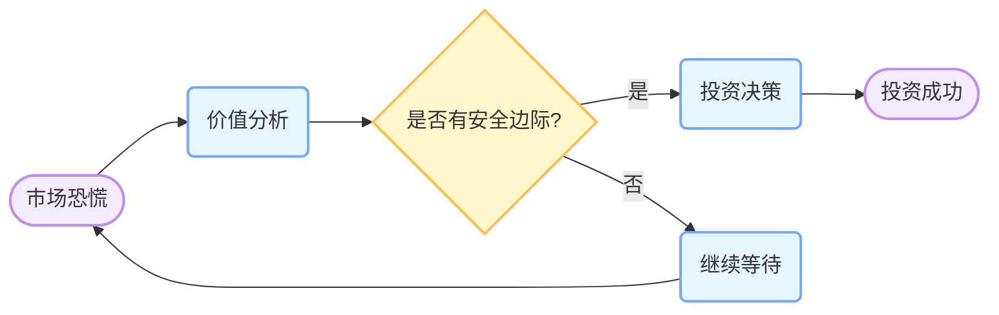

# 霍华德·马克斯的逆向价值投资：在市场恐慌中寻找机会

> 关键词：霍华德·马克斯、逆向价值投资、市场恐慌、投资机会、价值分析、风险控制、投资策略

> 摘要：本文深入探讨了霍华德·马克斯所倡导的逆向价值投资理念，即在市场恐慌的特殊时期如何发现并把握投资机会。详细阐述了逆向价值投资的核心概念、相关联系以及背后的算法原理和数学模型，通过项目实战案例分析了该投资策略在实际操作中的应用。同时，介绍了逆向价值投资在不同领域的实际应用场景，推荐了相关的学习工具、资源和论文著作。最后，总结了逆向价值投资的未来发展趋势与挑战，并对常见问题进行了解答。旨在为投资者提供全面、深入的逆向价值投资知识体系，帮助其在复杂多变的市场环境中做出明智的投资决策。

## 1. 背景介绍 
### 1.1 目的和范围
本文的目的在于全面剖析霍华德·马克斯的逆向价值投资理念，深入研究在市场恐慌情境下如何运用这一理念寻找投资机会。我们将探讨逆向价值投资的核心原理、具体操作方法以及在实际投资中的应用，为投资者提供一套系统的投资思路和方法。范围涵盖逆向价值投资的理论基础、数学模型、实战案例、应用场景等多个方面，力求为读者呈现一个完整的逆向价值投资知识框架。

### 1.2 预期读者
本文预期读者包括对投资领域感兴趣的初学者、有一定投资经验的投资者、金融从业者以及研究投资理论的学者。无论是希望学习投资基础知识的新手，还是寻求优化投资策略的专业人士，都能从本文中获得有价值的信息和启示。

### 1.3 文档结构概述
本文首先介绍逆向价值投资的背景知识，包括目的、预期读者和文档结构概述等内容。接着阐述逆向价值投资的核心概念与联系，通过文本示意图和 Mermaid 流程图展示其原理和架构。然后详细讲解核心算法原理和具体操作步骤，并给出相应的 Python 源代码。随后介绍逆向价值投资的数学模型和公式，结合实际例子进行详细讲解。通过项目实战部分展示代码实际案例并进行详细解释说明。之后探讨逆向价值投资的实际应用场景，推荐相关的工具和资源，包括学习资源、开发工具框架和论文著作等。最后总结逆向价值投资的未来发展趋势与挑战，解答常见问题并提供扩展阅读和参考资料。

### 1.4 术语表
#### 1.4.1 核心术语定义
- **逆向价值投资**：一种与市场主流趋势相反的投资策略，强调在市场过度悲观或乐观时，通过深入的价值分析，寻找被低估或高估的资产进行投资，以获取长期的超额收益。
- **市场恐慌**：指市场参与者因受到各种负面因素的影响，如经济衰退、政治动荡、重大突发事件等，产生过度的恐惧和焦虑情绪，导致市场价格大幅下跌的现象。
- **价值分析**：通过对资产的基本面进行研究，包括财务状况、行业前景、竞争优势等方面，评估资产的内在价值，以判断其是否被低估或高估。
- **安全边际**：指投资价格与资产内在价值之间的差值，安全边际越大，投资风险越低。

#### 1.4.2 相关概念解释
- **有效市场假说**：认为在有效市场中，资产价格已经反映了所有可用的信息，投资者无法通过分析信息获得超额收益。逆向价值投资则认为市场并非完全有效，存在定价错误的机会。
- **羊群效应**：指市场参与者在信息不确定的情况下，往往会跟随大多数人的决策，导致市场出现过度反应。逆向价值投资者则会反其道而行之，在市场恐慌时保持冷静，寻找投资机会。

#### 1.4.3 缩略词列表
- **PE**：市盈率（Price - Earnings Ratio），指股票价格与每股收益的比率，用于评估股票的估值水平。
- **PB**：市净率（Price - Book Ratio），指股票价格与每股净资产的比率，用于衡量股票的投资价值。

## 2. 核心概念与联系 
逆向价值投资的核心在于在市场恐慌时，投资者能够克服恐惧和从众心理，通过深入的价值分析，发现被市场低估的资产，从而实现长期的投资收益。其核心概念与联系可以用以下文本示意图和 Mermaid 流程图来表示。

### 文本示意图
逆向价值投资的核心概念包括市场恐慌、价值分析、安全边际和投资决策。市场恐慌是逆向价值投资的契机，当市场出现恐慌时，资产价格往往会大幅下跌，可能会低于其内在价值。价值分析是逆向价值投资的基础，通过对资产的基本面进行研究，评估其内在价值。安全边际是逆向价值投资的保障，在投资时要确保有足够的安全边际，以降低投资风险。投资决策是逆向价值投资的关键，根据价值分析和安全边际的评估结果，做出是否投资的决策。

### Mermaid 流程图

该流程图展示了逆向价值投资的基本流程。当市场出现恐慌时，投资者首先进行价值分析，评估资产的内在价值。然后判断是否有足够的安全边际，如果有，则做出投资决策；如果没有，则继续等待市场机会。

## 3. 核心算法原理 & 具体操作步骤 
逆向价值投资的核心算法原理在于通过对资产的内在价值进行评估，并与市场价格进行比较，寻找具有安全边际的投资机会。以下是具体的操作步骤和 Python 源代码示例。

### 具体操作步骤
1. **选择投资标的**：确定要投资的资产类别，如股票、债券、房地产等。
2. **收集数据**：收集与投资标的相关的财务数据、行业数据、宏观经济数据等。
3. **价值分析**：运用合适的估值模型，如现金流折现模型、相对估值模型等，评估投资标的的内在价值。
4. **计算安全边际**：用内在价值减去市场价格，得到安全边际。
5. **投资决策**：如果安全边际足够大，则考虑投资；否则，继续寻找其他投资机会。

### Python 源代码示例
```python
# 导入必要的库
import pandas as pd
import numpy as np

# 定义现金流折现模型函数
def dcf_model(cash_flows, discount_rate):
    """
    现金流折现模型
    :param cash_flows: 未来各期的现金流
    :param discount_rate: 折现率
    :return: 资产的内在价值
    """
    n = len(cash_flows)
    present_values = []
    for i in range(n):
        present_value = cash_flows[i] / (1 + discount_rate) ** (i + 1)
        present_values.append(present_value)
    return sum(present_values)

# 示例数据
cash_flows = [100, 120, 150, 180, 200]  # 未来五年的现金流
discount_rate = 0.1  # 折现率为 10%
market_price = 500  # 市场价格

# 计算内在价值
intrinsic_value = dcf_model(cash_flows, discount_rate)

# 计算安全边际
safety_margin = intrinsic_value - market_price

# 投资决策
if safety_margin > 0:
    print("有安全边际，可以考虑投资")
else:
    print("没有安全边际，继续等待")
```
在上述代码中，我们首先定义了一个现金流折现模型函数 `dcf_model`，用于计算资产的内在价值。然后，我们给出了示例数据，包括未来五年的现金流、折现率和市场价格。接着，我们调用 `dcf_model` 函数计算内在价值，并计算安全边际。最后，根据安全边际的大小做出投资决策。

## 4. 数学模型和公式 & 详细讲解 & 举例说明 
逆向价值投资中常用的数学模型包括现金流折现模型（DCF）和相对估值模型。以下是对这些模型和公式的详细讲解和举例说明。

### 现金流折现模型（DCF）
现金流折现模型是一种基于未来现金流的估值方法，其基本思想是将资产未来各期的现金流按照一定的折现率折现到当前时刻，得到资产的内在价值。

#### 数学公式
$$
V = \sum_{t = 1}^{n} \frac{CF_t}{(1 + r)^t}
$$
其中，$V$ 表示资产的内在价值，$CF_t$ 表示第 $t$ 期的现金流，$r$ 表示折现率，$n$ 表示现金流的期数。

#### 详细讲解
现金流折现模型的核心在于确定未来各期的现金流和折现率。未来现金流的预测需要考虑资产的经营状况、行业前景、宏观经济环境等因素。折现率则反映了投资者对资产风险的预期，风险越高，折现率越高。

#### 举例说明
假设某公司未来五年的现金流分别为 100 万元、120 万元、150 万元、180 万元和 200 万元，折现率为 10%。则该公司的内在价值为：
$$
\begin{align*}
V &= \frac{100}{(1 + 0.1)^1} + \frac{120}{(1 + 0.1)^2} + \frac{150}{(1 + 0.1)^3} + \frac{180}{(1 + 0.1)^4} + \frac{200}{(1 + 0.1)^5}\\
&= \frac{100}{1.1} + \frac{120}{1.21} + \frac{150}{1.331} + \frac{180}{1.4641} + \frac{200}{1.61051}\\
&\approx 90.91 + 99.17 + 112.69 + 122.94 + 124.18\\
&= 549.89 \text{（万元）}
\end{align*}
$$
如果该公司的市场价格为 500 万元，则安全边际为 $549.89 - 500 = 49.89$ 万元，说明该公司的股票被低估，可以考虑投资。

### 相对估值模型
相对估值模型是通过比较同行业或类似资产的估值指标，来评估目标资产的价值。常用的相对估值指标包括市盈率（PE）、市净率（PB）等。

#### 数学公式
- **市盈率估值法**：$V = EPS \times PE$，其中 $V$ 表示资产的价值，$EPS$ 表示每股收益，$PE$ 表示市盈率。
- **市净率估值法**：$V = BVPS \times PB$，其中 $V$ 表示资产的价值，$BVPS$ 表示每股净资产，$PB$ 表示市净率。

#### 详细讲解
相对估值模型的优点是简单易懂，易于操作。但它也有一定的局限性，因为不同公司的财务状况、行业前景等因素可能存在差异，直接比较估值指标可能会导致估值不准确。

#### 举例说明
假设某公司的每股收益为 2 元，同行业平均市盈率为 15 倍。则该公司的股票价值为 $2 \times 15 = 30$ 元。如果该公司的股票市场价格为 25 元，则说明该股票被低估，可以考虑投资。

## 5. 项目实战：代码实际案例和详细解释说明 
### 5.1  开发环境搭建
在进行逆向价值投资的项目实战时，我们需要搭建相应的开发环境。以下是具体的步骤：

1. **安装 Python**：从 Python 官方网站（https://www.python.org/downloads/）下载并安装 Python 3.x 版本。
2. **安装必要的库**：使用 `pip` 命令安装以下库：
    - `pandas`：用于数据处理和分析。
    - `numpy`：用于数值计算。
    - `matplotlib`：用于数据可视化。

```sh
pip install pandas numpy matplotlib
```

### 5.2  源代码详细实现和代码解读
以下是一个基于 Python 的逆向价值投资项目实战代码示例，我们将使用相对估值模型对股票进行估值。

```python
import pandas as pd
import numpy as np
import matplotlib.pyplot as plt

# 示例数据
data = {
    '公司名称': ['A 公司', 'B 公司', 'C 公司', '目标公司'],
    '每股收益（元）': [2, 2.5, 3, 2.2],
    '市盈率（倍）': [15, 18, 20, None]
}

df = pd.DataFrame(data)

# 计算同行业平均市盈率
average_pe = df[df['公司名称'] != '目标公司']['市盈率（倍）'].mean()

# 计算目标公司的股票价值
df.loc[df['公司名称'] == '目标公司', '市盈率（倍）'] = average_pe
df['股票价值（元）'] = df['每股收益（元）'] * df['市盈率（倍）']

# 假设目标公司的市场价格为 30 元
market_price = 30
df.loc[df['公司名称'] == '目标公司', '市场价格（元）'] = market_price

# 计算安全边际
df['安全边际（元）'] = df['股票价值（元）'] - df['市场价格（元）']

# 输出结果
print(df)

# 数据可视化
plt.figure(figsize=(10, 6))
plt.bar(df['公司名称'], df['股票价值（元）'], label='股票价值')
plt.bar(df['公司名称'], df['市场价格（元）'], label='市场价格', alpha=0.7)
plt.xlabel('公司名称')
plt.ylabel('价格（元）')
plt.title('股票价值与市场价格对比')
plt.legend()
plt.show()
```

### 5.3  代码解读与分析
1. **数据准备**：我们首先创建了一个包含公司名称、每股收益和市盈率的示例数据字典，并将其转换为 Pandas 数据框。
2. **计算同行业平均市盈率**：通过筛选出除目标公司外的其他公司，计算它们的平均市盈率。
3. **计算目标公司的股票价值**：将同行业平均市盈率赋值给目标公司，并计算其股票价值。
4. **计算安全边际**：假设目标公司的市场价格为 30 元，计算其安全边际。
5. **输出结果**：打印出包含股票价值、市场价格和安全边际的数据框。
6. **数据可视化**：使用 Matplotlib 库绘制柱状图，直观地展示股票价值和市场价格的对比。

通过这个项目实战，我们可以看到如何使用相对估值模型对股票进行估值，并计算安全边际，从而做出投资决策。

## 6. 实际应用场景 
逆向价值投资在多个领域都有广泛的应用，以下是一些常见的实际应用场景。

### 股票投资
在股票市场中，市场恐慌往往会导致股票价格大幅下跌。逆向价值投资者可以通过深入的价值分析，寻找被低估的股票进行投资。例如，在 2008 年全球金融危机期间，许多优质股票的价格大幅下跌，逆向价值投资者通过买入这些股票，在市场复苏后获得了丰厚的回报。

### 债券投资
债券市场也会受到市场恐慌的影响，当市场恐慌时，债券价格可能会下跌，收益率上升。逆向价值投资者可以通过分析债券的信用风险、利率风险等因素，寻找被低估的债券进行投资。例如，在经济衰退期间，一些高等级债券的价格可能会下跌，逆向价值投资者可以买入这些债券，获得固定的利息收益和资本增值。

### 房地产投资
房地产市场也存在市场周期，当市场出现恐慌时，房地产价格可能会下跌。逆向价值投资者可以通过评估房地产的地理位置、租金收益、市场需求等因素，寻找被低估的房地产进行投资。例如，在房地产市场调整期间，一些优质地段的房产价格可能会下跌，逆向价值投资者可以买入这些房产，等待市场复苏后获得资产增值。

### 私募股权投资
在私募股权投资领域，逆向价值投资同样适用。当市场恐慌时，一些优质企业可能会面临资金困难，估值下降。逆向价值投资者可以通过深入的尽职调查，寻找具有潜力的企业进行投资。例如，在行业寒冬期间，一些创新型企业可能会受到市场冷落，逆向价值投资者可以抓住机会，投资这些企业，分享其成长带来的收益。

## 7. 工具和资源推荐
### 7.1 学习资源推荐
#### 7.1.1 书籍推荐
- 《投资最重要的事》（霍华德·马克斯著）：本书是霍华德·马克斯的代表作，详细阐述了逆向价值投资的理念和方法，是学习逆向价值投资的必读之书。
- 《聪明的投资者》（本杰明·格雷厄姆著）：价值投资的经典著作，对逆向价值投资的理论和实践有深入的探讨。
- 《巴菲特致股东的信》（沃伦·巴菲特著）：通过巴菲特的信件，我们可以了解到他的投资理念和方法，其中也包含了逆向价值投资的思想。

#### 7.1.2 在线课程
- Coursera 平台上的“投资学原理”课程：由知名大学教授授课，系统地介绍了投资学的基本原理和方法，包括逆向价值投资。
- 网易云课堂上的“价值投资实战”课程：结合实际案例，讲解价值投资的实战技巧，对逆向价值投资有深入的分析。

#### 7.1.3 技术博客和网站
- 雪球网：国内知名的投资社区，有大量的投资者分享投资经验和研究报告，其中不乏逆向价值投资的案例和分析。
- Seeking Alpha：国外知名的投资研究网站，提供全球范围内的投资分析和研究报告，对逆向价值投资有深入的探讨。

### 7.2 开发工具框架推荐
#### 7.2.1 IDE和编辑器
- PyCharm：一款专业的 Python 集成开发环境，具有代码编辑、调试、版本控制等功能，适合进行逆向价值投资的数据分析和建模。
- Jupyter Notebook：一个交互式的开发环境，支持 Python 代码的编写、运行和可视化，方便进行数据探索和分析。

#### 7.2.2 调试和性能分析工具
- pdb：Python 内置的调试工具，可以帮助我们调试代码，查找错误。
- cProfile：Python 内置的性能分析工具，可以帮助我们分析代码的性能瓶颈，优化代码。

#### 7.2.3 相关框架和库
- Pandas：用于数据处理和分析，提供了丰富的数据结构和数据操作方法。
- Numpy：用于数值计算，提供了高效的数组和矩阵运算功能。
- Matplotlib：用于数据可视化，提供了各种绘图功能，方便我们展示数据和分析结果。

### 7.3 相关论文著作推荐
#### 7.3.1 经典论文
- “The Intelligent Investor”（Benjamin Graham）：价值投资的经典论文，奠定了逆向价值投资的理论基础。
- “Security Analysis”（Benjamin Graham and David Dodd）：对证券分析的理论和方法进行了系统的阐述，对逆向价值投资有重要的指导意义。

#### 7.3.2 最新研究成果
- 近年来，学术界对逆向价值投资的研究不断深入，许多期刊和会议上发表了相关的研究论文。可以通过学术数据库，如知网、万方、Web of Science 等，搜索最新的研究成果。

#### 7.3.3 应用案例分析
- 一些金融机构和投资公司会发布逆向价值投资的应用案例分析报告，可以通过它们的官方网站或相关金融媒体获取这些报告，了解逆向价值投资在实际中的应用情况。

## 8. 总结：未来发展趋势与挑战
### 未来发展趋势
- **数据驱动的逆向价值投资**：随着大数据、人工智能等技术的发展，逆向价值投资将更加注重数据的分析和挖掘。通过对海量数据的分析，投资者可以更准确地评估资产的内在价值，发现投资机会。
- **全球资产配置**：在全球化的背景下，逆向价值投资者将更加注重全球资产配置。通过在不同国家和地区寻找被低估的资产，可以降低投资风险，提高投资收益。
- **社会责任投资与逆向价值投资的结合**：越来越多的投资者开始关注企业的社会责任，逆向价值投资也将与社会责任投资相结合。投资者不仅会关注资产的财务价值，还会关注企业的社会和环境影响，寻找具有可持续发展潜力的企业进行投资。

### 挑战
- **市场不确定性增加**：随着全球政治、经济环境的变化，市场不确定性不断增加。逆向价值投资者需要面对各种突发因素的影响，如贸易摩擦、地缘政治冲突、自然灾害等，这增加了投资决策的难度。
- **信息过载**：在信息时代，投资者面临着海量的信息。如何从这些信息中筛选出有价值的信息，进行准确的价值分析，是逆向价值投资者面临的挑战之一。
- **投资者情绪的影响**：逆向价值投资需要投资者克服恐惧和贪婪等情绪的影响，保持理性的投资决策。但在市场恐慌或狂热的情况下，投资者往往难以做到这一点，这可能导致投资决策失误。

## 9. 附录：常见问题与解答
### 问题 1：逆向价值投资是否适合所有投资者？
逆向价值投资并不适合所有投资者。它需要投资者具备一定的投资知识和经验，能够进行深入的价值分析。同时，逆向价值投资需要投资者有较强的心理素质，能够在市场恐慌时保持冷静，克服恐惧和从众心理。对于缺乏投资经验和心理素质的投资者来说，逆向价值投资可能会带来较大的风险。

### 问题 2：如何判断市场是否处于恐慌状态？
判断市场是否处于恐慌状态可以从多个方面入手。一是观察市场价格的波动情况，如果市场价格出现大幅下跌，且跌幅超过了正常的波动范围，可能意味着市场处于恐慌状态。二是关注投资者情绪指标，如恐慌指数（VIX）等，当恐慌指数大幅上升时，说明市场恐慌情绪加剧。三是分析宏观经济环境和政策变化，如果出现重大的负面经济数据或政策调整，可能会引发市场恐慌。

### 问题 3：逆向价值投资的风险如何控制？
逆向价值投资的风险控制主要包括以下几个方面。一是进行充分的价值分析，确保投资的资产具有足够的安全边际。二是分散投资，通过投资不同的资产类别和行业，降低单一资产的风险。三是设定止损点，当投资损失达到一定程度时，及时止损，避免损失进一步扩大。四是定期评估投资组合，根据市场变化和资产价值的变化，及时调整投资组合。

## 10. 扩展阅读 & 参考资料
### 扩展阅读
- 《金融炼金术》（乔治·索罗斯著）：探讨了金融市场的运行规律和投资者的行为模式，对逆向价值投资有一定的启示作用。
- 《黑天鹅》（纳西姆·尼古拉斯·塔勒布著）：介绍了极端事件对金融市场的影响，提醒投资者要关注市场的不确定性，这与逆向价值投资的理念相契合。

### 参考资料
- 霍华德·马克斯的官方网站和演讲资料。
- 相关金融期刊和报纸，如《金融研究》《证券时报》等。
- 学术数据库中的研究论文，如知网、万方、Web of Science 等。