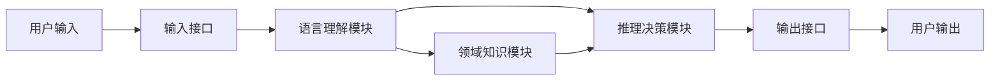

# 领域特定AI Agent：LLM在垂直行业的深度应用

> 关键词：领域特定AI Agent、大语言模型（LLM）、垂直行业、深度应用、AI技术

> 摘要：本文聚焦于领域特定AI Agent以及大语言模型（LLM）在垂直行业的深度应用。首先介绍了相关背景，包括目的范围、预期读者等内容。接着阐述了核心概念与联系，通过文本示意图和Mermaid流程图进行清晰展示。深入剖析了核心算法原理，并结合Python源代码详细阐述具体操作步骤。对涉及的数学模型和公式进行详细讲解并举例说明。通过项目实战，展示代码实际案例并进行详细解释。探讨了其在不同垂直行业的实际应用场景，还推荐了相关的工具和资源。最后总结了未来发展趋势与挑战，提供常见问题解答和扩展阅读参考资料，旨在全面深入地探讨LLM在垂直行业的应用价值和发展前景。

## 1. 背景介绍 
### 1.1 目的和范围
在当今数字化快速发展的时代，人工智能技术不断取得突破，大语言模型（LLM）如GPT系列、文心一言等展现出强大的自然语言处理能力。然而，通用的大语言模型在某些垂直行业的应用中，可能无法满足特定领域的专业需求。领域特定AI Agent的出现，旨在将LLM与垂直行业的专业知识、业务流程相结合，为行业提供更精准、高效、智能的解决方案。

本文章的范围涵盖了领域特定AI Agent的基本概念、核心算法、数学模型，以及其在多个垂直行业的应用案例。同时，还提供了相关的工具和资源推荐，帮助读者更好地理解和应用这一技术。

### 1.2 预期读者
本文预期读者包括但不限于人工智能领域的研究人员、开发人员、软件架构师、企业技术负责人、行业分析师以及对AI技术在垂直行业应用感兴趣的相关人士。无论是希望深入了解领域特定AI Agent技术原理的专业人员，还是关注如何将AI技术应用于自身行业的企业决策者，都能从本文中获取有价值的信息。

### 1.3 文档结构概述
本文将按照以下结构进行阐述：首先介绍领域特定AI Agent和LLM的背景知识，包括相关术语和概念；接着详细讲解核心概念与联系，通过文本示意图和流程图进行直观展示；然后深入剖析核心算法原理，并结合Python代码说明具体操作步骤；对涉及的数学模型和公式进行详细讲解和举例；通过项目实战展示代码案例并进行解读；探讨其在不同垂直行业的实际应用场景；推荐相关的学习资源、开发工具和论文著作；最后总结未来发展趋势与挑战，提供常见问题解答和扩展阅读参考资料。

### 1.4 术语表
#### 1.4.1 核心术语定义
- **领域特定AI Agent**：是一种专门为特定领域设计的人工智能代理，它结合了大语言模型的自然语言处理能力和领域专业知识，能够在该领域内执行特定任务，如问题解答、决策支持等。
- **大语言模型（LLM）**：是一种基于深度学习的语言模型，通过在大规模文本数据上进行训练，学习语言的模式和规律，能够生成自然语言文本、回答问题等。
- **垂直行业**：指的是具有特定业务领域和专业需求的行业，如医疗、金融、教育等。

#### 1.4.2 相关概念解释
- **知识图谱**：是一种语义网络，用于表示实体之间的关系和知识。在领域特定AI Agent中，知识图谱可以帮助Agent更好地理解领域知识，提高回答的准确性和专业性。
- **强化学习**：是一种机器学习方法，通过智能体与环境的交互，根据环境反馈的奖励信号来学习最优策略。在领域特定AI Agent中，强化学习可以用于优化Agent的决策过程。

#### 1.4.3 缩略词列表
- **LLM**：大语言模型（Large Language Model）
- **AI**：人工智能（Artificial Intelligence）

## 2. 核心概念与联系 
领域特定AI Agent的核心在于将大语言模型（LLM）的自然语言处理能力与垂直行业的专业知识相结合。其基本原理是，首先利用LLM对输入的自然语言进行理解和分析，然后根据领域知识和业务规则进行推理和决策，最后生成相应的输出。

### 文本示意图
领域特定AI Agent主要由以下几个部分组成：
1. **输入接口**：负责接收用户的自然语言输入，如文本、语音等。
2. **语言理解模块**：利用LLM对输入的自然语言进行解析，提取关键信息和语义。
3. **领域知识模块**：存储垂直行业的专业知识和业务规则，如医学知识、金融法规等。
4. **推理决策模块**：根据语言理解模块的输出和领域知识模块的内容，进行推理和决策。
5. **输出接口**：将推理决策模块的结果以自然语言的形式输出给用户。

### Mermaid流程图


## 3. 核心算法原理 & 具体操作步骤 
### 核心算法原理
领域特定AI Agent的核心算法主要包括自然语言处理算法和推理决策算法。

#### 自然语言处理算法
自然语言处理算法主要用于对用户输入的自然语言进行理解和分析。常用的自然语言处理算法包括词法分析、句法分析、语义分析等。在领域特定AI Agent中，通常会使用预训练的大语言模型（LLM）来完成这些任务。例如，使用Transformer架构的模型，通过多头自注意力机制来捕捉文本中的语义信息。

#### 推理决策算法
推理决策算法主要用于根据语言理解模块的输出和领域知识模块的内容，进行推理和决策。常用的推理决策算法包括规则推理、基于案例的推理、机器学习推理等。在领域特定AI Agent中，可以根据具体的应用场景选择合适的推理决策算法。

### 具体操作步骤
以下是一个使用Python实现的简单领域特定AI Agent的示例代码，假设我们要实现一个医疗领域的AI Agent，用于回答用户关于疾病症状和治疗方法的问题。

```python
import torch
from transformers import AutoTokenizer, AutoModelForQuestionAnswering

# 加载预训练的语言模型和分词器
tokenizer = AutoTokenizer.from_pretrained("bert-large-uncased-whole-word-masking-finetuned-squad")
model = AutoModelForQuestionAnswering.from_pretrained("bert-large-uncased-whole-word-masking-finetuned-squad")

# 定义领域知识
medical_knowledge = {
    "感冒": "症状：咳嗽、流鼻涕、发热等。治疗方法：多喝水、休息，可服用感冒药。",
    "肺炎": "症状：发热、咳嗽、呼吸困难等。治疗方法：使用抗生素治疗，严重时需住院治疗。"
}

def answer_question(question):
    # 对输入的问题进行分词
    inputs = tokenizer(question, return_tensors="pt")
    
    # 使用语言模型进行问题回答
    outputs = model(**inputs)
    answer_start_scores = outputs.start_logits
    answer_end_scores = outputs.end_logits
    
    # 找到答案的起始和结束位置
    answer_start = torch.argmax(answer_start_scores)
    answer_end = torch.argmax(answer_end_scores) + 1
    
    # 提取答案
    answer = tokenizer.convert_tokens_to_string(tokenizer.convert_ids_to_tokens(inputs["input_ids"][0][answer_start:answer_end]))
    
    # 根据答案查找领域知识
    if answer in medical_knowledge:
        return medical_knowledge[answer]
    else:
        return "抱歉，未找到相关信息。"

# 测试
question = "感冒有哪些症状和治疗方法？"
answer = answer_question(question)
print(answer)
```

### 代码解释
1. **加载预训练的语言模型和分词器**：使用`transformers`库加载预训练的BERT模型和分词器。
2. **定义领域知识**：使用字典`medical_knowledge`存储医疗领域的专业知识。
3. **回答问题**：对输入的问题进行分词，使用语言模型进行问题回答，找到答案的起始和结束位置，提取答案。然后根据答案查找领域知识，返回相应的信息。

## 4. 数学模型和公式 & 详细讲解 & 举例说明 
### 自然语言处理中的数学模型
在自然语言处理中，常用的数学模型包括概率图模型、神经网络模型等。其中，Transformer架构的模型是目前最流行的自然语言处理模型之一，它基于注意力机制，能够有效地捕捉文本中的语义信息。

#### Transformer架构的数学原理
Transformer架构主要由编码器和解码器组成。编码器用于对输入的文本进行编码，解码器用于生成输出的文本。

##### 多头自注意力机制
多头自注意力机制是Transformer架构的核心部分，它允许模型在不同的表示子空间中并行地关注输入序列的不同部分。其数学公式如下：

$$
\text{Attention}(Q, K, V) = \text{softmax}(\frac{QK^T}{\sqrt{d_k}})V
$$

其中，$Q$、$K$、$V$分别是查询矩阵、键矩阵和值矩阵，$d_k$是查询向量的维度。

##### 多头自注意力
多头自注意力是将多个自注意力机制并行运行，然后将结果拼接起来。其数学公式如下：

$$
\text{MultiHead}(Q, K, V) = \text{Concat}(\text{head}_1, \cdots, \text{head}_h)W^O
$$

其中，$\text{head}_i = \text{Attention}(QW_i^Q, KW_i^K, VW_i^V)$，$W_i^Q$、$W_i^K$、$W_i^V$和$W^O$是可学习的参数矩阵。

### 推理决策中的数学模型
在推理决策中，常用的数学模型包括概率推理模型、逻辑推理模型等。例如，基于贝叶斯网络的概率推理模型可以用于处理不确定性问题。

#### 贝叶斯网络
贝叶斯网络是一种有向无环图，用于表示变量之间的概率依赖关系。其数学公式如下：

$$
P(X_1, \cdots, X_n) = \prod_{i=1}^n P(X_i | \text{Parents}(X_i))
$$

其中，$X_1, \cdots, X_n$是变量，$\text{Parents}(X_i)$是$X_i$的父节点。

### 举例说明
假设我们有一个简单的医疗诊断贝叶斯网络，包含三个变量：$X$（疾病）、$Y$（症状）和$Z$（检查结果）。已知$P(X) = [0.2, 0.8]$（表示患某种疾病的概率为0.2，不患的概率为0.8），$P(Y|X)$和$P(Z|X)$分别表示在不同疾病状态下出现症状和检查结果的概率。

如果我们观察到症状$Y$和检查结果$Z$，可以使用贝叶斯公式计算患疾病$X$的概率：

$$
P(X|Y, Z) = \frac{P(Y, Z|X)P(X)}{P(Y, Z)}
$$

其中，$P(Y, Z|X) = P(Y|X)P(Z|X)$，$P(Y, Z) = \sum_{x} P(Y, Z|x)P(x)$。

## 5. 项目实战：代码实际案例和详细解释说明 
### 5.1  开发环境搭建
为了实现一个领域特定AI Agent，我们需要搭建相应的开发环境。以下是具体的步骤：

#### 安装Python
首先，需要安装Python环境。建议使用Python 3.7及以上版本。可以从Python官方网站（https://www.python.org/downloads/）下载并安装。

#### 安装依赖库
使用`pip`命令安装所需的依赖库，包括`transformers`、`torch`等。

```bash
pip install transformers torch
```

### 5.2  源代码详细实现和代码解读
以下是一个完整的领域特定AI Agent的代码示例，假设我们要实现一个金融领域的AI Agent，用于回答用户关于股票投资的问题。

```python
import torch
from transformers import AutoTokenizer, AutoModelForQuestionAnswering

# 加载预训练的语言模型和分词器
tokenizer = AutoTokenizer.from_pretrained("bert-large-uncased-whole-word-masking-finetuned-squad")
model = AutoModelForQuestionAnswering.from_pretrained("bert-large-uncased-whole-word-masking-finetuned-squad")

# 定义金融领域知识
financial_knowledge = {
    "股票投资": "股票投资是指企业或个人用积累起来的货币购买股票，借以获得收益的行为。投资股票需要考虑公司基本面、行业趋势、宏观经济环境等因素。",
    "风险控制": "在股票投资中，风险控制非常重要。可以通过分散投资、设置止损点等方式来降低风险。"
}

def answer_question(question):
    # 对输入的问题进行分词
    inputs = tokenizer(question, return_tensors="pt")
    
    # 使用语言模型进行问题回答
    outputs = model(**inputs)
    answer_start_scores = outputs.start_logits
    answer_end_scores = outputs.end_logits
    
    # 找到答案的起始和结束位置
    answer_start = torch.argmax(answer_start_scores)
    answer_end = torch.argmax(answer_end_scores) + 1
    
    # 提取答案
    answer = tokenizer.convert_tokens_to_string(tokenizer.convert_ids_to_tokens(inputs["input_ids"][0][answer_start:answer_end]))
    
    # 根据答案查找领域知识
    if answer in financial_knowledge:
        return financial_knowledge[answer]
    else:
        return "抱歉，未找到相关信息。"

# 主程序
if __name__ == "__main__":
    while True:
        question = input("请输入你的问题（输入q退出）：")
        if question == 'q':
            break
        answer = answer_question(question)
        print(answer)
```

### 5.3  代码解读与分析
1. **加载预训练的语言模型和分词器**：使用`transformers`库加载预训练的BERT模型和分词器，用于对用户输入的问题进行处理。
2. **定义金融领域知识**：使用字典`financial_knowledge`存储金融领域的专业知识。
3. **回答问题**：对输入的问题进行分词，使用语言模型进行问题回答，找到答案的起始和结束位置，提取答案。然后根据答案查找领域知识，返回相应的信息。
4. **主程序**：通过一个循环不断接收用户的问题，直到用户输入`q`退出。

## 6. 实际应用场景 
### 医疗领域
在医疗领域，领域特定AI Agent可以用于辅助医生进行疾病诊断、提供治疗建议、解答患者的疑问等。例如，AI Agent可以根据患者的症状和检查结果，结合医学知识图谱，快速给出可能的疾病诊断和治疗方案。同时，AI Agent还可以为患者提供关于疾病预防、康复等方面的知识，提高患者的健康意识。

### 金融领域
在金融领域，领域特定AI Agent可以用于投资咨询、风险评估、客户服务等。例如，AI Agent可以根据客户的投资目标、风险承受能力等信息，提供个性化的投资建议。同时，AI Agent还可以实时监测市场动态，为投资者提供及时的风险预警。

### 教育领域
在教育领域，领域特定AI Agent可以用于智能辅导、课程推荐、学习评估等。例如，AI Agent可以根据学生的学习情况和需求，提供个性化的学习计划和辅导材料。同时，AI Agent还可以对学生的作业和考试进行自动评估，提供详细的反馈和建议。

### 法律领域
在法律领域，领域特定AI Agent可以用于法律咨询、法律文书生成、案例分析等。例如，AI Agent可以根据用户的法律问题，结合法律法规和案例库，提供准确的法律建议和解决方案。同时，AI Agent还可以帮助律师快速生成合同、诉状等法律文书，提高工作效率。

## 7. 工具和资源推荐
### 7.1 学习资源推荐
#### 7.1.1 书籍推荐
- 《深度学习》（Ian Goodfellow、Yoshua Bengio和Aaron Courville著）：介绍了深度学习的基本原理和方法，是深度学习领域的经典教材。
- 《自然语言处理入门》（何晗著）：适合初学者学习自然语言处理的基础知识和技术。
- 《人工智能：一种现代的方法》（Stuart Russell和Peter Norvig著）：全面介绍了人工智能的各个领域和方法。

#### 7.1.2 在线课程
- Coursera上的“深度学习专项课程”（Deep Learning Specialization）：由Andrew Ng教授主讲，深入介绍了深度学习的理论和实践。
- edX上的“自然语言处理”（Natural Language Processing）：提供了自然语言处理的系统学习资源。
- 中国大学MOOC上的“人工智能基础”：介绍了人工智能的基本概念和方法。

#### 7.1.3 技术博客和网站
- Medium上的AI相关博客：有很多关于人工智能的最新研究成果和实践经验分享。
- arXiv.org：提供了大量的人工智能学术论文。
- 机器之心（https://www.alldatasheet.com/）：专注于人工智能领域的资讯和技术分享。

### 7.2 开发工具框架推荐
#### 7.2.1 IDE和编辑器
- PyCharm：功能强大的Python集成开发环境，适合开发Python项目。
- Visual Studio Code：轻量级的代码编辑器，支持多种编程语言和插件扩展。
- Jupyter Notebook：交互式的开发环境，适合进行数据分析和模型训练。

#### 7.2.2 调试和性能分析工具
- TensorBoard：用于可视化深度学习模型的训练过程和性能指标。
- PyTorch Profiler：用于分析PyTorch模型的性能瓶颈。
- cProfile：Python内置的性能分析工具，用于分析Python代码的执行时间。

#### 7.2.3 相关框架和库
- Transformers：由Hugging Face开发的自然语言处理框架，提供了丰富的预训练模型和工具。
- PyTorch：深度学习框架，广泛应用于自然语言处理、计算机视觉等领域。
- Scikit-learn：机器学习库，提供了各种机器学习算法和工具。

### 7.3 相关论文著作推荐
#### 7.3.1 经典论文
- “Attention Is All You Need”（Vaswani等人著）：介绍了Transformer架构，是自然语言处理领域的经典论文。
- “BERT: Pre-training of Deep Bidirectional Transformers for Language Understanding”（Devlin等人著）：介绍了BERT模型，推动了自然语言处理的发展。

#### 7.3.2 最新研究成果
- 关注顶级学术会议如NeurIPS、ICML、ACL等上的最新论文，了解领域特定AI Agent和LLM的最新研究进展。

#### 7.3.3 应用案例分析
- 可以参考各大科技公司的技术博客和研究报告，了解领域特定AI Agent在实际应用中的案例和经验。

## 8. 总结：未来发展趋势与挑战
### 未来发展趋势
- **更加专业化**：领域特定AI Agent将不断深入各个垂直行业，与行业的专业知识和业务流程更加紧密结合，提供更加专业化的服务。
- **多模态融合**：未来的领域特定AI Agent将不仅仅局限于文本处理，还将融合图像、语音等多模态信息，提供更加丰富和全面的服务。
- **个性化定制**：根据用户的个性化需求和偏好，提供定制化的服务和解决方案，提高用户体验。
- **协同合作**：多个领域特定AI Agent之间可以进行协同合作，共同解决复杂的问题，提高工作效率和质量。

### 挑战
- **领域知识获取和更新**：获取和更新垂直行业的专业知识是一个挑战，需要建立有效的知识管理系统和更新机制。
- **数据隐私和安全**：在处理用户数据和领域知识时，需要确保数据的隐私和安全，防止数据泄露和滥用。
- **模型可解释性**：大语言模型通常是黑盒模型，其决策过程难以解释。在一些对可解释性要求较高的领域，如医疗、法律等，需要提高模型的可解释性。
- **性能和效率**：随着应用场景的不断扩大和数据量的增加，需要提高领域特定AI Agent的性能和效率，以满足实时性要求。

## 9. 附录：常见问题与解答
### 1. 领域特定AI Agent与通用AI Agent有什么区别？
领域特定AI Agent是专门为特定领域设计的，结合了该领域的专业知识和业务规则，能够在该领域内提供更精准、高效的服务。而通用AI Agent则更注重通用性，适用于多种领域，但在专业领域的应用效果可能不如领域特定AI Agent。

### 2. 如何选择合适的大语言模型（LLM）？
选择合适的LLM需要考虑多个因素，如模型的性能、规模、适用领域、训练数据等。可以根据具体的应用场景和需求，选择预训练的开源模型或商业模型。同时，还可以对模型进行微调，以提高其在特定领域的性能。

### 3. 领域特定AI Agent的开发难度大吗？
领域特定AI Agent的开发难度取决于多个因素，如领域的复杂程度、所需的专业知识、模型的选择和调优等。对于一些简单的领域和应用场景，开发难度相对较低；而对于一些复杂的领域和应用场景，开发难度可能较大，需要专业的技术团队和资源支持。

### 4. 领域特定AI Agent的应用前景如何？
领域特定AI Agent的应用前景非常广阔。随着人工智能技术的不断发展和垂直行业数字化转型的加速，领域特定AI Agent将在医疗、金融、教育、法律等多个领域发挥重要作用，提高行业的效率和服务质量，推动行业的创新和发展。

## 10. 扩展阅读 & 参考资料
- Goodfellow, I., Bengio, Y., & Courville, A. (2016). Deep Learning. MIT Press.
- 何晗. (2019). 自然语言处理入门. 人民邮电出版社.
- Russell, S. J., & Norvig, P. (2009). Artificial Intelligence: A Modern Approach. Prentice Hall.
- Vaswani, A., Shazeer, N., Parmar, N., Uszkoreit, J., Jones, L., Gomez, A. N., ... & Polosukhin, I. (2017). Attention is all you need. Advances in neural information processing systems, 5998-6008.
- Devlin, J., Chang, M. W., Lee, K., & Toutanova, K. (2018). Bert: Pre-training of deep bidirectional transformers for language understanding. arXiv preprint arXiv:1810.04805.
- Hugging Face官方文档（https://huggingface.co/docs/transformers/index）
- PyTorch官方文档（https://pytorch.org/docs/stable/index.html）
- Scikit-learn官方文档（https://scikit-learn.org/stable/documentation.html）