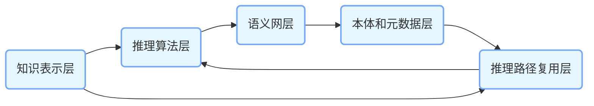

# 高质量推理路径的可复用性研究

> 关键词：高质量推理路径、可复用性、知识表示、推理算法、语义网、本体、元数据

> 摘要：本文围绕高质量推理路径的可复用性展开深入研究。在当今知识爆炸的时代，如何高效地复用已有的推理路径来提高推理效率和质量是一个重要的研究课题。文章首先介绍了研究的背景、目的和范围等基础信息，阐述了与推理路径相关的核心概念及其联系。接着详细讲解了核心算法原理和具体操作步骤，通过Python代码进行示例。同时给出了相关的数学模型和公式，并结合实际例子进行说明。在项目实战部分，通过具体的代码案例展示了如何实现推理路径的复用。此外，还探讨了高质量推理路径可复用性的实际应用场景，推荐了相关的工具和资源。最后总结了未来的发展趋势与挑战，并对常见问题进行了解答，提供了扩展阅读和参考资料，旨在为该领域的研究和实践提供全面且深入的指导。

## 1. 背景介绍 
### 1.1 目的和范围
在人工智能、知识工程、语义网等众多领域，推理是一个核心的任务。推理路径是指在推理过程中从前提到结论所经过的一系列步骤和规则。高质量的推理路径通常具有准确性、完整性和高效性等特点。本研究的目的在于探讨如何提高这些高质量推理路径的可复用性，以减少重复的推理工作，提高推理系统的效率和性能。

研究的范围涵盖了多种推理类型，如基于规则的推理、基于本体的推理、基于机器学习的推理等。同时，也涉及到不同的知识表示形式，如语义网中的RDF（资源描述框架）、OWL（网络本体语言）等。

### 1.2 预期读者
本文的预期读者包括人工智能领域的研究人员、知识工程师、软件开发者、对推理技术感兴趣的研究生和专业人士等。对于希望深入了解推理路径可复用性相关技术和方法的读者，本文将提供有价值的参考。

### 1.3 文档结构概述
本文首先介绍研究的背景信息，包括目的、范围、预期读者等。接着阐述与高质量推理路径可复用性相关的核心概念及其联系，通过文本示意图和Mermaid流程图进行直观展示。然后详细讲解核心算法原理和具体操作步骤，并用Python代码进行说明。之后给出相关的数学模型和公式，并结合例子进行讲解。在项目实战部分，通过实际的代码案例展示推理路径复用的实现过程。再探讨实际应用场景，推荐相关的工具和资源。最后总结未来发展趋势与挑战，解答常见问题，并提供扩展阅读和参考资料。

### 1.4 术语表
#### 1.4.1 核心术语定义
- **推理路径**：在推理过程中，从初始前提到最终结论所经过的一系列推理步骤和规则的组合。
- **可复用性**：指推理路径能够在不同的推理任务或场景中被重复使用的特性。
- **高质量推理路径**：具有准确性、完整性、高效性等特点的推理路径，能够在多种场景下可靠地得出正确的结论。
- **知识表示**：将知识以计算机能够理解和处理的形式进行表示的方法，如RDF、OWL等。
- **本体**：对特定领域的概念、关系和规则进行形式化描述的一种知识表示方式，用于支持推理和知识共享。

#### 1.4.2 相关概念解释
- **语义网**：是万维网的扩展，旨在使计算机能够更好地理解和处理网页中的信息，通过语义标记和知识表示技术来实现信息的互操作性和自动化推理。
- **元数据**：关于数据的数据，用于描述数据的来源、结构、含义等信息，在推理路径复用中可以用于描述推理路径的属性和特征。

#### 1.4.3 缩略词列表
- **RDF**：Resource Description Framework（资源描述框架）
- **OWL**：Web Ontology Language（网络本体语言）
- **SPARQL**：SPARQL Protocol and RDF Query Language（SPARQL协议和RDF查询语言）

## 2. 核心概念与联系 

### 核心概念原理
推理路径的可复用性基于以下几个核心概念：

#### 知识表示
知识表示是推理的基础，不同的知识表示方式会影响推理路径的构建和复用。例如，RDF使用三元组（主语、谓语、宾语）来表示知识，OWL则在RDF的基础上增加了更多的语义表达能力，用于描述概念之间的关系和约束。通过合理的知识表示，可以将推理所需的信息准确地存储和管理起来，为推理路径的复用提供支持。

#### 推理算法
推理算法是根据知识表示中的信息进行推理的方法。常见的推理算法包括基于规则的推理算法（如Drools）、基于本体的推理算法（如Pellet、Hermit）等。不同的推理算法适用于不同的知识表示和推理任务，选择合适的推理算法对于构建高质量的推理路径至关重要。

#### 语义网技术
语义网技术通过为网页和数据添加语义标记，使得计算机能够理解和处理信息的含义。在推理路径复用中，语义网技术可以帮助实现不同数据源之间的互操作性，使得推理路径能够在更广泛的范围内被复用。

#### 本体和元数据
本体用于描述领域知识的结构和关系，为推理提供语义基础。元数据则用于描述推理路径的属性和特征，如推理路径的适用场景、前提条件、结论等。通过本体和元数据的结合，可以更好地管理和复用推理路径。

### 架构的文本示意图
```plaintext
知识表示层
|-- RDF数据
|-- OWL本体
|-- 其他知识表示形式

推理算法层
|-- 基于规则的推理算法
|-- 基于本体的推理算法
|-- 其他推理算法

语义网层
|-- 语义标记
|-- 数据互操作性

本体和元数据层
|-- 领域本体
|-- 推理路径元数据

推理路径复用层
|-- 推理路径存储
|-- 推理路径检索
|-- 推理路径适配
```

### Mermaid流程图


这个流程图展示了各个核心概念之间的联系。知识表示层为推理算法层提供数据和知识基础，推理算法层利用这些知识进行推理。语义网层增强了数据的互操作性，本体和元数据层则为推理路径的管理和复用提供支持。推理路径复用层可以将复用的推理路径反馈给推理算法层，同时也可以直接从知识表示层获取信息。

## 3. 核心算法原理 & 具体操作步骤 

### 核心算法原理
我们以基于规则的推理算法为例，介绍推理路径可复用性的核心算法原理。基于规则的推理算法通过定义一系列的规则来进行推理，当满足规则的前提条件时，就可以得出相应的结论。

在推理路径复用中，我们需要对推理路径进行存储、检索和适配。存储推理路径时，需要将推理路径的前提条件、推理步骤和结论等信息进行记录。检索推理路径时，根据当前的推理任务和前提条件，从存储的推理路径中查找匹配的路径。适配推理路径时，可能需要对推理路径进行一些调整，以使其适应当前的推理任务。

### 具体操作步骤
1. **推理路径的存储**
    - 定义推理路径的元数据结构，包括前提条件、推理步骤、结论、适用场景等信息。
    - 将推理路径的信息存储到数据库或文件系统中。

2. **推理路径的检索**
    - 根据当前的推理任务和前提条件，构建检索条件。
    - 在存储的推理路径中查找匹配的路径。

3. **推理路径的适配**
    - 分析检索到的推理路径与当前推理任务的差异。
    - 根据差异对推理路径进行调整，如替换变量、调整规则顺序等。

### Python源代码示例
```python
# 定义推理路径的元数据结构
class InferencePath:
    def __init__(self, premises, steps, conclusion, scenario):
        self.premises = premises
        self.steps = steps
        self.conclusion = conclusion
        self.scenario = scenario

    def __str__(self):
        return f"Premises: {self.premises}, Steps: {self.steps}, Conclusion: {self.conclusion}, Scenario: {self.scenario}"

# 存储推理路径
inference_paths = []

def store_inference_path(premises, steps, conclusion, scenario):
    path = InferencePath(premises, steps, conclusion, scenario)
    inference_paths.append(path)

# 检索推理路径
def retrieve_inference_path(current_premises, current_scenario):
    matching_paths = []
    for path in inference_paths:
        if all(premise in path.premises for premise in current_premises) and current_scenario == path.scenario:
            matching_paths.append(path)
    return matching_paths

# 适配推理路径（简单示例：替换变量）
def adapt_inference_path(path, variable_mapping):
    new_steps = []
    for step in path.steps:
        new_step = step
        for old_var, new_var in variable_mapping.items():
            new_step = new_step.replace(old_var, new_var)
        new_steps.append(new_step)
    path.steps = new_steps
    return path

# 示例使用
# 存储推理路径
store_inference_path(["A", "B"], ["if A and B then C"], "C", "Scenario1")
store_inference_path(["D", "E"], ["if D and E then F"], "F", "Scenario2")

# 检索推理路径
current_premises = ["A", "B"]
current_scenario = "Scenario1"
matching_paths = retrieve_inference_path(current_premises, current_scenario)

# 适配推理路径
if matching_paths:
    path = matching_paths[0]
    variable_mapping = {"A": "X", "B": "Y"}
    adapted_path = adapt_inference_path(path, variable_mapping)
    print("Adapted Inference Path:", adapted_path)
```

这个Python代码示例展示了推理路径的存储、检索和适配的基本过程。首先定义了推理路径的元数据结构，然后实现了存储、检索和适配的函数。最后通过示例使用演示了这些函数的调用过程。

## 4. 数学模型和公式 & 详细讲解 & 举例说明 

### 数学模型
我们可以用图论的方法来描述推理路径。将推理过程中的前提条件、中间结论和最终结论看作图中的节点，推理步骤看作图中的边。这样，推理路径就可以表示为图中的一条路径。

设 $G=(V, E)$ 是一个有向图，其中 $V$ 是节点集合，$E$ 是边集合。每个节点 $v \in V$ 表示一个命题，每条边 $(u, v) \in E$ 表示一个推理步骤，即从命题 $u$ 可以推导出命题 $v$。

### 公式
- **推理路径的长度**：推理路径的长度是指路径中边的数量。设推理路径 $P=(v_0, v_1, \cdots, v_n)$，其中 $(v_i, v_{i+1}) \in E$ 对于 $i = 0, 1, \cdots, n - 1$，则推理路径的长度 $|P| = n$。

- **推理路径的可达性**：如果存在一条从节点 $u$ 到节点 $v$ 的路径，则称节点 $v$ 是从节点 $u$ 可达的。可达性可以通过图的遍历算法（如深度优先搜索、广度优先搜索）来判断。

### 详细讲解
在推理路径的复用中，推理路径的长度和可达性是重要的指标。推理路径的长度可以反映推理的复杂度，较短的推理路径通常意味着更高效的推理。可达性则用于判断一个推理路径是否适用于当前的推理任务，只有当推理路径的起始节点（前提条件）和目标节点（结论）与当前推理任务匹配时，该推理路径才可能被复用。

### 举例说明
假设有以下推理规则：
- 如果 $A$ 成立，且 $B$ 成立，则 $C$ 成立。
- 如果 $C$ 成立，则 $D$ 成立。

对应的图 $G=(V, E)$ 中，$V = \{A, B, C, D\}$，$E = \{(A \land B, C), (C, D)\}$。

推理路径 $P=(A \land B, C, D)$ 的长度 $|P| = 2$。如果当前的推理任务是从前提条件 $A$ 和 $B$ 推导出结论 $D$，则该推理路径是可达的，可以被复用。

## 5. 项目实战：代码实际案例和详细解释说明 

### 5.1  开发环境搭建
- **Python环境**：确保已经安装了Python 3.x版本。
- **相关库**：可以使用一些常见的Python库，如`rdflib`用于处理RDF数据，`owlready2`用于处理OWL本体等。可以使用以下命令进行安装：
```sh
pip install rdflib owlready2
```

### 5.2  源代码详细实现和代码解读
以下是一个基于RDF和OWL的推理路径复用的代码示例：

```python
from rdflib import Graph, Literal, URIRef, Namespace
from owlready2 import *

# 定义命名空间
EX = Namespace("http://example.org/")

# 创建RDF图
g = Graph()

# 添加RDF数据
g.add((URIRef(EX["person1"]), URIRef(EX["hasAge"]), Literal(25)))
g.add((URIRef(EX["person1"]), URIRef(EX["isStudent"]), Literal(True)))

# 加载OWL本体
onto = get_ontology("http://example.org/ontology.owl").load()

# 定义推理规则
with onto:
    class Person(Thing):
        pass

    class hasAge(Person >> int):
        pass

    class isStudent(Person >> bool):
        pass

    class Adult(Person):
        equivalent_to = [Person & (hasAge >= 18)]

    class Student(Person):
        equivalent_to = [Person & (isStudent == True)]

# 存储推理路径（简单示例：记录推理步骤）
inference_paths = []

def store_path(premises, steps, conclusion):
    path = (premises, steps, conclusion)
    inference_paths.append(path)

# 检索推理路径
def retrieve_path(current_premises, conclusion):
    matching_paths = []
    for path in inference_paths:
        if all(premise in path[0] for premise in current_premises) and path[2] == conclusion:
            matching_paths.append(path)
    return matching_paths

# 推理过程
for s, p, o in g:
    if p == URIRef(EX["hasAge"]):
        person = onto[URIRef(s).fragment]
        age = int(o)
        if age >= 18:
            premises = [f"{person} has age {age}"]
            steps = ["Check age >= 18"]
            conclusion = f"{person} is an adult"
            store_path(premises, steps, conclusion)
            print(conclusion)

    if p == URIRef(EX["isStudent"]):
        person = onto[URIRef(s).fragment]
        is_student = bool(o)
        if is_student:
            premises = [f"{person} is a student"]
            steps = ["Check isStudent == True"]
            conclusion = f"{person} is a student"
            store_path(premises, steps, conclusion)
            print(conclusion)

# 复用推理路径
current_premises = ["person1 has age 25"]
conclusion = "person1 is an adult"
matching_paths = retrieve_path(current_premises, conclusion)
if matching_paths:
    path = matching_paths[0]
    print("Reused Inference Path:", path)
```

### 5.3  代码解读与分析
1. **RDF数据处理**：使用`rdflib`库创建RDF图，并添加相关的RDF数据。这些数据描述了人物的年龄和是否是学生的信息。
2. **OWL本体加载**：使用`owlready2`库加载OWL本体，并定义相关的类和属性。本体中定义了`Person`、`Adult`和`Student`等类，以及`hasAge`和`isStudent`等属性。
3. **推理路径存储**：定义了`store_path`函数，用于存储推理路径。推理路径包括前提条件、推理步骤和结论。
4. **推理路径检索**：定义了`retrieve_path`函数，用于根据当前的前提条件和结论检索匹配的推理路径。
5. **推理过程**：遍历RDF图中的数据，根据本体中的规则进行推理。如果满足条件，则存储相应的推理路径并输出结论。
6. **推理路径复用**：最后，根据当前的前提条件和结论检索匹配的推理路径，并输出复用的推理路径。

这个代码示例展示了如何在RDF和OWL的环境下实现推理路径的复用。通过存储和检索推理路径，可以避免重复的推理工作，提高推理效率。

## 6. 实际应用场景 
### 智能客服系统
在智能客服系统中，经常需要回答用户的各种问题。通过复用高质量的推理路径，可以快速地从用户的问题中提取关键信息，并根据已有的推理路径得出答案。例如，当用户询问关于产品功能的问题时，系统可以复用之前处理类似问题的推理路径，快速给出准确的回答。

### 医疗诊断系统
在医疗诊断系统中，医生需要根据患者的症状、检查结果等信息进行诊断。复用高质量的推理路径可以帮助医生快速参考之前类似病例的诊断过程和结论，提高诊断的准确性和效率。例如，对于某种疾病的诊断，系统可以复用之前成功诊断该疾病的推理路径，辅助医生进行诊断。

### 金融风险评估系统
在金融风险评估系统中，需要根据客户的信用记录、财务状况等信息评估风险。复用高质量的推理路径可以使系统更加高效地进行风险评估。例如，对于新客户的风险评估，可以复用之前类似客户的评估推理路径，快速得出风险评估结果。

### 智能交通系统
在智能交通系统中，需要根据交通流量、天气等信息进行交通管理和调度。复用高质量的推理路径可以帮助系统快速做出决策。例如，当遇到交通拥堵时，系统可以复用之前处理类似拥堵情况的推理路径，采取相应的交通疏导措施。

## 7. 工具和资源推荐
### 7.1 学习资源推荐
#### 7.1.1 书籍推荐
- 《人工智能：一种现代的方法》：这本书全面介绍了人工智能的各个领域，包括推理、知识表示等内容，是学习人工智能的经典教材。
- 《语义网基础教程》：详细介绍了语义网的相关技术和概念，对于理解推理路径复用中的语义网技术非常有帮助。
- 《知识图谱：方法、实践与应用》：介绍了知识图谱的构建、推理和应用等方面的知识，与推理路径复用密切相关。

#### 7.1.2 在线课程
- Coursera上的“Artificial Intelligence”课程：由斯坦福大学的教授授课，系统地介绍了人工智能的基本概念和方法。
- edX上的“Semantic Web Technologies”课程：深入讲解了语义网的相关技术和应用。
- 中国大学MOOC上的“知识工程与语义网”课程：结合国内的教学特点，介绍了知识工程和语义网的知识。

#### 7.1.3 技术博客和网站
- AI Time：提供人工智能领域的最新研究成果和技术动态。
- 语义网中文社区：专注于语义网技术的交流和分享。
- ACM Digital Library：收录了大量计算机领域的学术论文和研究报告，对于深入研究推理路径复用相关技术有很大的帮助。

### 7.2 开发工具框架推荐
#### 7.2.1 IDE和编辑器
- PyCharm：一款功能强大的Python集成开发环境，支持代码编辑、调试、版本控制等功能。
- Visual Studio Code：一款轻量级的代码编辑器，支持多种编程语言和插件扩展，对于开发推理路径复用相关的代码非常方便。

#### 7.2.2 调试和性能分析工具
- pdb：Python自带的调试工具，可以帮助开发者调试Python代码。
- cProfile：Python的性能分析工具，可以分析代码的运行时间和函数调用情况，帮助优化代码性能。

#### 7.2.3 相关框架和库
- rdflib：用于处理RDF数据的Python库，提供了创建、查询和操作RDF图的功能。
- owlready2：用于处理OWL本体的Python库，支持本体的加载、推理和查询等操作。
- Drools：一个基于规则的推理引擎，可用于实现基于规则的推理路径复用。

### 7.3 相关论文著作推荐
#### 7.3.1 经典论文
- “Towards the Semantic Web”：由Tim Berners-Lee等人发表的论文，介绍了语义网的概念和愿景，是语义网领域的经典之作。
- “Description Logic Handbook”：详细介绍了描述逻辑的理论和应用，对于理解基于本体的推理有重要的参考价值。

#### 7.3.2 最新研究成果
- 关注顶级学术会议（如AAAI、IJCAI、ISWC等）上发表的关于推理路径复用、知识表示、推理算法等方面的论文，了解该领域的最新研究动态。

#### 7.3.3 应用案例分析
- 一些实际应用领域（如智能客服、医疗诊断等）的相关论文和报告，会介绍推理路径复用在这些领域的具体应用案例和实践经验，可以从中学习到实际应用中的技巧和方法。

## 8. 总结：未来发展趋势与挑战
### 未来发展趋势
- **与深度学习的融合**：将推理路径复用技术与深度学习相结合，利用深度学习的强大表示能力和推理能力，提高推理的准确性和效率。例如，通过深度学习模型对推理路径进行学习和优化，实现更智能的推理路径复用。
- **跨领域的推理路径复用**：随着知识的不断积累和共享，未来将更加注重跨领域的推理路径复用。不同领域的知识可以相互关联和融合，使得推理路径能够在更广泛的范围内被复用，提高知识的利用效率。
- **自动化的推理路径生成和优化**：研究自动化的推理路径生成和优化算法，能够根据不同的推理任务自动生成高质量的推理路径，并对已有的推理路径进行优化和更新，减少人工干预。
- **与物联网的结合**：将推理路径复用技术应用于物联网领域，实现对物联网设备产生的数据进行智能推理和决策。例如，根据物联网设备收集的环境数据，复用推理路径进行智能环境控制。

### 挑战
- **知识的语义理解和对齐**：不同领域的知识可能存在语义差异，如何准确地理解和对齐这些知识是一个挑战。在推理路径复用中，需要确保不同知识源之间的语义一致性，否则可能会导致推理错误。
- **推理路径的可解释性**：随着推理算法的复杂度增加，推理路径的可解释性变得越来越重要。用户需要理解推理的过程和依据，以便对推理结果进行评估和信任。如何在保证推理效率的同时，提高推理路径的可解释性是一个需要解决的问题。
- **大规模知识的管理和存储**：随着知识的不断增长，如何有效地管理和存储大规模的知识是一个挑战。在推理路径复用中，需要快速地检索和访问相关的知识和推理路径，对知识管理系统的性能和可扩展性提出了更高的要求。
- **安全和隐私问题**：在推理路径复用过程中，涉及到大量的知识和数据，如何保证这些知识和数据的安全和隐私是一个重要的问题。例如，在医疗诊断等领域，需要保护患者的隐私信息，防止信息泄露。

## 9. 附录：常见问题与解答
### 问题1：如何判断一个推理路径是否是高质量的？
高质量的推理路径通常具有准确性、完整性和高效性等特点。准确性是指推理路径能够得出正确的结论；完整性是指推理路径包含了所有必要的推理步骤；高效性是指推理路径的推理效率较高，能够在较短的时间内得出结论。可以通过对推理路径的前提条件、推理步骤和结论进行验证和评估，以及对推理效率进行测试来判断一个推理路径是否是高质量的。

### 问题2：在推理路径复用过程中，如何处理不同知识表示之间的差异？
可以采用语义映射和转换的方法来处理不同知识表示之间的差异。例如，通过定义不同知识表示之间的映射规则，将一种知识表示转换为另一种知识表示，使得推理路径能够在不同的知识表示之间进行复用。另外，也可以使用中间表示形式，将不同的知识表示转换为中间表示，再进行推理和复用。

### 问题3：如何提高推理路径的可复用性？
可以从以下几个方面提高推理路径的可复用性：
- 合理的知识表示：采用统一、规范的知识表示方式，使得推理路径能够更容易地被理解和复用。
- 元数据的管理：为推理路径添加详细的元数据，描述推理路径的适用场景、前提条件、结论等信息，方便检索和复用。
- 模块化设计：将推理路径设计为模块化的结构，使得不同的模块可以独立复用，提高复用的灵活性。
- 推理路径的优化和更新：定期对推理路径进行优化和更新，保证推理路径的质量和有效性，提高复用的成功率。

### 问题4：推理路径复用是否适用于所有类型的推理任务？
推理路径复用并不适用于所有类型的推理任务。一些复杂的、需要实时决策的推理任务，可能需要根据具体情况进行实时推理，难以直接复用已有的推理路径。另外，一些创新性的推理任务，可能没有现成的推理路径可供复用。但是，对于一些常见的、重复性的推理任务，推理路径复用可以显著提高推理效率和质量。

## 10. 扩展阅读 & 参考资料
### 扩展阅读
- 阅读关于知识图谱、语义网、人工智能等领域的前沿研究成果和技术动态，了解相关领域的最新发展趋势。
- 研究不同领域（如医疗、金融、交通等）中推理技术的应用案例，学习实际应用中的经验和技巧。

### 参考资料
- [1] Berners-Lee, T., Hendler, J., & Lassila, O. (2001). The semantic web. Scientific American, 284(5), 34-43.
- [2] Baader, F., Calvanese, D., McGuinness, D. L., Nardi, D., & Patel-Schneider, P. F. (Eds.). (2003). The description logic handbook: theory, implementation, and applications. Cambridge University Press.
- [3] rdflib官方文档：https://rdflib.readthedocs.io/
- [4] owlready2官方文档：https://owlready2.readthedocs.io/
- [5] Drools官方网站：https://drools.org/