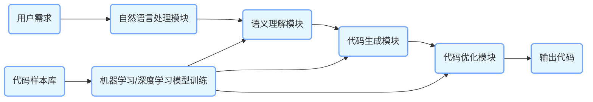

# 2025年的编程现场:AI如何改变开发流程

> 关键词：AI编程、开发流程、2025年趋势、自动化编程、代码生成、智能辅助、开发效率

> 摘要：本文深入探讨了2025年AI在编程领域对开发流程带来的变革。从背景介绍入手，阐述了研究目的、预期读者等内容。详细剖析了AI编程的核心概念与联系，通过Mermaid流程图清晰呈现其架构。讲解了核心算法原理并给出Python源代码示例，介绍了相关数学模型和公式。通过项目实战案例展示了AI在实际开发中的应用和代码实现。探讨了AI编程的实际应用场景，推荐了学习资源、开发工具框架以及相关论文著作。最后总结了未来发展趋势与挑战，还设置了常见问题解答和扩展阅读参考资料，全面展现了AI对编程开发流程的影响和发展前景。

## 1. 背景介绍 
### 1.1 目的和范围
在科技飞速发展的当下，AI技术正以前所未有的速度渗透到各个领域，编程领域也不例外。本文章的目的在于深入探究2025年AI在编程现场对开发流程产生的具体影响。我们将研究范围涵盖从AI在代码生成、调试、优化等基础开发环节的应用，到其在项目管理、团队协作等高级开发流程中的作用，全面剖析AI如何重塑编程开发的各个方面。

### 1.2 预期读者
本文预期读者包括广大程序员、软件架构师、CTO等IT行业从业者，他们希望了解AI在编程领域的最新发展趋势，以及如何利用AI提升开发效率和质量。同时，也适合对AI技术和编程感兴趣的学生、研究人员，为他们提供关于AI与编程结合的深入见解和学习参考。

### 1.3 文档结构概述
本文将按照以下结构展开：首先介绍背景信息，让读者了解研究的目的、范围和预期读者。接着阐述AI编程的核心概念与联系，通过示意图和流程图帮助读者理解其原理和架构。然后详细讲解核心算法原理和具体操作步骤，给出Python源代码示例。之后介绍相关的数学模型和公式，并举例说明。通过项目实战展示AI在实际开发中的应用和代码实现。探讨AI编程的实际应用场景，为读者提供实际参考。推荐学习资源、开发工具框架以及相关论文著作，方便读者深入学习和研究。最后总结未来发展趋势与挑战，设置常见问题解答和扩展阅读参考资料，为读者提供全面的信息和指导。

### 1.4 术语表
#### 1.4.1 核心术语定义
- **AI编程**：指利用人工智能技术辅助或自动完成编程任务的过程，包括代码生成、代码优化、错误检测等。
- **自动化编程**：通过预先设定的规则和算法，让计算机自动生成程序代码的技术。
- **代码生成**：AI根据用户需求或输入的信息，自动生成相应的代码片段或完整程序。
- **智能辅助**：AI在编程过程中为开发者提供提示、建议、优化方案等帮助。

#### 1.4.2 相关概念解释
- **机器学习**：是AI的一个重要分支，通过让计算机从数据中学习模式和规律，从而实现预测和决策。在编程中，机器学习可以用于代码分类、错误预测等。
- **自然语言处理（NLP）**：使计算机能够理解和处理人类语言的技术。在AI编程中，NLP可用于将自然语言描述转换为代码。
- **深度学习**：一种基于人工神经网络的机器学习方法，能够处理复杂的数据和任务。在代码生成中，深度学习可以学习大量的代码样本，生成高质量的代码。

#### 1.4.3 缩略词列表
- **AI**：Artificial Intelligence（人工智能）
- **NLP**：Natural Language Processing（自然语言处理）
- **ML**：Machine Learning（机器学习）
- **DL**：Deep Learning（深度学习）

## 2. 核心概念与联系 

### AI编程的核心概念原理
AI编程的核心在于利用人工智能技术来处理编程任务。其基本原理是通过机器学习和深度学习算法，让计算机学习大量的代码样本，从而掌握代码的语法、结构和语义。在接收到用户的需求后，AI系统可以根据学习到的知识，生成相应的代码或提供相关的建议。

例如，在代码生成方面，AI系统可以将用户用自然语言描述的需求转换为代码。这需要借助自然语言处理技术，将自然语言解析为计算机能够理解的语义表示，然后根据语义表示生成代码。

### AI编程的架构示意图


这个流程图展示了AI编程的主要流程。用户提出需求后，首先经过自然语言处理模块，将自然语言转换为计算机能够处理的形式。然后语义理解模块对需求进行分析和理解，代码生成模块根据理解结果生成代码。生成的代码再经过代码优化模块进行优化，最后输出最终的代码。同时，代码样本库为机器学习和深度学习模型的训练提供数据支持，训练好的模型用于辅助各个模块的工作。

## 3. 核心算法原理 & 具体操作步骤 

### 核心算法原理
在AI编程中，常用的算法包括基于规则的算法、机器学习算法和深度学习算法。这里我们以深度学习中的循环神经网络（RNN）为例，讲解代码生成的算法原理。

RNN是一种能够处理序列数据的神经网络，它在处理代码生成任务时，将代码看作是一个字符序列。RNN通过不断地学习代码序列中的模式和规律，来预测下一个字符。

以下是一个简单的RNN代码生成的Python示例：

```python
import numpy as np
import tensorflow as tf
from tensorflow.keras.models import Sequential
from tensorflow.keras.layers import SimpleRNN, Dense

# 定义训练数据
text = "if x > 5: print('x is greater than 5')"
chars = sorted(list(set(text)))
char_to_index = {char: index for index, char in enumerate(chars)}
index_to_char = {index: char for index, char in enumerate(chars)}

# 准备训练数据
max_length = 10
step = 1
sentences = []
next_chars = []
for i in range(0, len(text) - max_length, step):
    sentences.append(text[i: i + max_length])
    next_chars.append(text[i + max_length])

x = np.zeros((len(sentences), max_length, len(chars)), dtype=np.bool)
y = np.zeros((len(sentences), len(chars)), dtype=np.bool)
for i, sentence in enumerate(sentences):
    for t, char in enumerate(sentence):
        x[i, t, char_to_index[char]] = 1
    y[i, char_to_index[next_chars[i]]] = 1

# 构建RNN模型
model = Sequential()
model.add(SimpleRNN(128, input_shape=(max_length, len(chars))))
model.add(Dense(len(chars), activation='softmax'))

model.compile(loss='categorical_crossentropy', optimizer='adam')

# 训练模型
model.fit(x, y, batch_size=128, epochs=100)

# 生成代码
start_index = np.random.randint(0, len(text) - max_length)
generated = text[start_index: start_index + max_length]
print('Seed:', generated)

for i in range(400):
    x_pred = np.zeros((1, max_length, len(chars)))
    for t, char in enumerate(generated):
        x_pred[0, t, char_to_index[char]] = 1

    preds = model.predict(x_pred, verbose=0)[0]
    next_index = np.argmax(preds)
    next_char = index_to_char[next_index]

    generated += next_char
    generated = generated[1:]

    print(next_char, end='', flush=True)
```

### 具体操作步骤
1. **数据准备**：首先，我们需要准备训练数据。在上述示例中，我们将一段简单的代码作为训练数据，并将其转换为适合RNN输入的格式。
2. **模型构建**：使用Keras构建一个简单的RNN模型，包含一个RNN层和一个全连接层。
3. **模型训练**：使用准备好的训练数据对模型进行训练，设置合适的批次大小和训练轮数。
4. **代码生成**：选择一个随机的起始序列，然后使用训练好的模型预测下一个字符，不断生成新的代码。

## 4. 数学模型和公式 & 详细讲解 & 举例说明 

### 数学模型和公式
在RNN中，核心的数学公式是隐藏状态的更新公式和输出的计算公式。

#### 隐藏状态更新公式
$$h_t = \tanh(W_{hh}h_{t - 1}+W_{xh}x_t + b_h)$$

其中，$h_t$ 是时间步 $t$ 的隐藏状态，$h_{t - 1}$ 是上一个时间步的隐藏状态，$x_t$ 是时间步 $t$ 的输入，$W_{hh}$ 是隐藏状态到隐藏状态的权重矩阵，$W_{xh}$ 是输入到隐藏状态的权重矩阵，$b_h$ 是隐藏状态的偏置向量。$\tanh$ 是激活函数，用于将输入映射到 $(-1, 1)$ 的范围内。

#### 输出计算公式
$$y_t = W_{hy}h_t + b_y$$

其中，$y_t$ 是时间步 $t$ 的输出，$W_{hy}$ 是隐藏状态到输出的权重矩阵，$b_y$ 是输出的偏置向量。

### 详细讲解
隐藏状态更新公式描述了RNN如何根据上一个时间步的隐藏状态和当前时间步的输入来更新当前时间步的隐藏状态。通过不断地迭代这个公式，RNN可以捕捉到序列中的长期依赖关系。

输出计算公式则根据当前时间步的隐藏状态计算输出。在代码生成任务中，输出通常是一个概率分布，表示下一个字符的可能性。

### 举例说明
假设我们有一个简单的RNN，输入维度为 3，隐藏状态维度为 2，输出维度为 4。则权重矩阵 $W_{xh}$ 的形状为 $(3, 2)$，$W_{hh}$ 的形状为 $(2, 2)$，$W_{hy}$ 的形状为 $(2, 4)$。

假设在某个时间步 $t$，输入 $x_t = [0.1, 0.2, 0.3]$，上一个时间步的隐藏状态 $h_{t - 1} = [0.4, 0.5]$。则根据隐藏状态更新公式：

$$
\begin{align*}
W_{xh}x_t + W_{hh}h_{t - 1}+b_h &= \begin{bmatrix}
w_{11} & w_{12} & w_{13} \\
w_{21} & w_{22} & w_{23}
\end{bmatrix} \begin{bmatrix}
0.1 \\
0.2 \\
0.3
\end{bmatrix} + \begin{bmatrix}
u_{11} & u_{12} \\
u_{21} & u_{22}
\end{bmatrix} \begin{bmatrix}
0.4 \\
0.5
\end{bmatrix} + \begin{bmatrix}
b_{h1} \\
b_{h2}
\end{bmatrix} \\
&= \begin{bmatrix}
0.1w_{11} + 0.2w_{12} + 0.3w_{13} + 0.4u_{11} + 0.5u_{12} + b_{h1} \\
0.1w_{21} + 0.2w_{22} + 0.3w_{23} + 0.4u_{21} + 0.5u_{22} + b_{h2}
\end{bmatrix}
\end{align*}
$$

然后通过 $\tanh$ 激活函数得到当前时间步的隐藏状态 $h_t$。

再根据输出计算公式：

$$
\begin{align*}
y_t &= \begin{bmatrix}
v_{11} & v_{12} \\
v_{21} & v_{22} \\
v_{31} & v_{32} \\
v_{41} & v_{42}
\end{bmatrix} \begin{bmatrix}
h_{t1} \\
h_{t2}
\end{bmatrix} + \begin{bmatrix}
b_{y1} \\
b_{y2} \\
b_{y3} \\
b_{y4}
\end{bmatrix} \\
&= \begin{bmatrix}
v_{11}h_{t1} + v_{12}h_{t2} + b_{y1} \\
v_{21}h_{t1} + v_{22}h_{t2} + b_{y2} \\
v_{31}h_{t1} + v_{32}h_{t2} + b_{y3} \\
v_{41}h_{t1} + v_{42}h_{t2} + b_{y4}
\end{bmatrix}
\end{align*}
$$

得到当前时间步的输出 $y_t$。

## 5. 项目实战：代码实际案例和详细解释说明 

### 5.1  开发环境搭建
- **操作系统**：推荐使用Ubuntu 20.04或Windows 10。
- **Python环境**：安装Python 3.8及以上版本。
- **深度学习框架**：安装TensorFlow 2.x版本，可以使用以下命令进行安装：
```sh
pip install tensorflow
```
- **其他依赖库**：安装numpy等常用库：
```sh
pip install numpy
```

### 5.2  源代码详细实现和代码解读
以下是一个更完整的代码生成项目示例，使用长短期记忆网络（LSTM）来生成Python代码：

```python
import numpy as np
import tensorflow as tf
from tensorflow.keras.models import Sequential
from tensorflow.keras.layers import LSTM, Dense
import random

# 读取训练数据
with open('python_code.txt', 'r', encoding='utf-8') as file:
    text = file.read()

chars = sorted(list(set(text)))
char_to_index = {char: index for index, char in enumerate(chars)}
index_to_char = {index: char for index, char in enumerate(chars)}

# 准备训练数据
max_length = 40
step = 3
sentences = []
next_chars = []
for i in range(0, len(text) - max_length, step):
    sentences.append(text[i: i + max_length])
    next_chars.append(text[i + max_length])

x = np.zeros((len(sentences), max_length, len(chars)), dtype=np.bool)
y = np.zeros((len(sentences), len(chars)), dtype=np.bool)
for i, sentence in enumerate(sentences):
    for t, char in enumerate(sentence):
        x[i, t, char_to_index[char]] = 1
    y[i, char_to_index[next_chars[i]]] = 1

# 构建LSTM模型
model = Sequential()
model.add(LSTM(128, input_shape=(max_length, len(chars))))
model.add(Dense(len(chars), activation='softmax'))

model.compile(loss='categorical_crossentropy', optimizer='adam')

# 训练模型
epochs = 60
for epoch in range(epochs):
    print(f'Epoch {epoch + 1}/{epochs}')
    model.fit(x, y, batch_size=128, epochs=1)

    start_index = random.randint(0, len(text) - max_length)
    generated = text[start_index: start_index + max_length]
    print('Seed:', generated)

    for diversity in [0.2, 0.5, 1.0, 1.2]:
        print(f'\nDiversity: {diversity}')
        generated_text = generated
        for i in range(400):
            x_pred = np.zeros((1, max_length, len(chars)))
            for t, char in enumerate(generated_text):
                x_pred[0, t, char_to_index[char]] = 1

            preds = model.predict(x_pred, verbose=0)[0]
            next_index = np.random.choice(len(chars), p=preds)
            next_char = index_to_char[next_index]

            generated_text += next_char
            generated_text = generated_text[1:]

            print(next_char, end='', flush=True)
        print()
```

### 代码解读与分析
1. **数据读取和预处理**：首先，我们从文件中读取Python代码作为训练数据。然后，将字符转换为索引，将文本数据转换为适合LSTM输入的格式。
2. **模型构建**：使用Keras构建一个LSTM模型，包含一个LSTM层和一个全连接层。LSTM层用于处理序列数据，全连接层用于输出字符的概率分布。
3. **模型训练**：使用准备好的训练数据对模型进行训练，设置训练轮数和批次大小。
4. **代码生成**：在每个训练轮次结束后，选择一个随机的起始序列，根据不同的多样性参数生成代码。多样性参数控制了生成代码的随机性，值越大，生成的代码越随机。

## 6. 实际应用场景 
### 代码快速生成
在实际开发中，开发者经常需要编写一些重复性的代码，如数据结构的初始化、文件读写等。AI可以根据用户的需求快速生成这些代码，大大提高开发效率。例如，开发者只需要描述需要实现的功能，AI就可以生成相应的Python代码。

### 代码优化
AI可以分析现有的代码，找出其中的性能瓶颈和潜在问题，并提供优化建议。例如，对于一个复杂的算法，AI可以分析其时间复杂度和空间复杂度，提出优化方案，提高代码的运行效率。

### 错误检测和调试
AI可以在代码编写过程中实时检测错误，并给出错误提示和修复建议。当代码运行出现异常时，AI可以分析异常信息，定位问题所在，并提供解决方案。例如，当Python代码出现语法错误时，AI可以快速指出错误位置并给出修正建议。

### 项目管理和团队协作
AI可以帮助项目管理者进行任务分配、进度跟踪和风险评估。通过分析团队成员的代码贡献和工作效率，AI可以合理分配任务，确保项目按时完成。同时，AI可以在团队协作中提供智能提示和建议，促进团队成员之间的沟通和协作。

## 7. 工具和资源推荐
### 7.1 学习资源推荐
#### 7.1.1 书籍推荐
- 《深度学习》（Deep Learning）：由Ian Goodfellow、Yoshua Bengio和Aaron Courville所著，是深度学习领域的经典教材，全面介绍了深度学习的理论和实践。
- 《Python深度学习》（Deep Learning with Python）：由Francois Chollet所著，通过Python和Keras框架详细介绍了深度学习的应用，适合初学者入门。
- 《人工智能：一种现代的方法》（Artificial Intelligence: A Modern Approach）：由Stuart Russell和Peter Norvig所著，是人工智能领域的权威教材，涵盖了AI的各个方面。

#### 7.1.2 在线课程
- Coursera上的“深度学习专项课程”（Deep Learning Specialization）：由Andrew Ng教授授课，系统介绍了深度学习的理论和实践。
- edX上的“人工智能导论”（Introduction to Artificial Intelligence）：由麻省理工学院（MIT）提供，讲解了AI的基本概念和算法。
- 哔哩哔哩（Bilibili）上有很多关于AI编程的免费教程，适合初学者快速入门。

#### 7.1.3 技术博客和网站
- Medium：上面有很多AI和编程领域的优秀文章，作者来自世界各地的专业人士。
- Towards Data Science：专注于数据科学和机器学习领域，提供了很多实用的技术文章和案例分析。
- 开源中国（OSChina）：国内知名的开源技术社区，有很多关于AI和编程的技术分享和讨论。

### 7.2 开发工具框架推荐
#### 7.2.1 IDE和编辑器
- PyCharm：专业的Python集成开发环境，提供了丰富的代码编辑、调试和版本控制功能。
- Visual Studio Code（VS Code）：轻量级的代码编辑器，支持多种编程语言，有大量的扩展插件可供选择。
- Jupyter Notebook：交互式的编程环境，适合进行数据分析和模型训练，方便展示代码和结果。

#### 7.2.2 调试和性能分析工具
- Py-Spy：用于Python代码的性能分析工具，可以实时监测代码的运行状态和性能瓶颈。
- pdb：Python自带的调试器，方便开发者在代码中设置断点，进行单步调试。
- TensorBoard：TensorFlow提供的可视化工具，用于可视化模型训练过程中的指标和参数。

#### 7.2.3 相关框架和库
- TensorFlow：开源的深度学习框架，广泛应用于图像识别、自然语言处理等领域。
- PyTorch：另一个流行的深度学习框架，具有动态图和易于使用的特点。
- Scikit-learn：用于机器学习的Python库，提供了丰富的机器学习算法和工具。

### 7.3 相关论文著作推荐
#### 7.3.1 经典论文
- “Long Short-Term Memory”：由Sepp Hochreiter和Jürgen Schmidhuber发表，介绍了长短期记忆网络（LSTM）的原理和应用。
- “Attention Is All You Need”：提出了Transformer架构，是自然语言处理领域的重要突破。
- “ImageNet Classification with Deep Convolutional Neural Networks”：介绍了AlexNet卷积神经网络，开启了深度学习在图像识别领域的应用热潮。

#### 7.3.2 最新研究成果
- 关注arXiv预印本平台，上面有很多关于AI和编程的最新研究论文。
- 参加顶级学术会议，如NeurIPS（神经信息处理系统大会）、ICML（国际机器学习会议）等，了解最新的研究成果和趋势。

#### 7.3.3 应用案例分析
- 《AI in Practice: How 50 Successful Companies Used Artificial Intelligence to Solve Problems》：介绍了50家成功应用AI解决实际问题的公司案例，包括编程领域的应用。
- 各大科技公司的技术博客，如Google AI Blog、Facebook AI Research等，会分享他们在AI和编程领域的实践经验和应用案例。

## 8. 总结：未来发展趋势与挑战
### 未来发展趋势
- **更强大的代码生成能力**：未来，AI将能够生成更加复杂、高质量的代码，甚至可以根据用户的需求生成完整的项目。
- **智能编程助手的普及**：智能编程助手将成为开发者的标配，为开发者提供实时的帮助和支持，提高开发效率和质量。
- **AI与编程教育的深度融合**：AI将在编程教育中发挥重要作用，通过个性化的学习方案和智能辅导，帮助学生更快地掌握编程技能。
- **跨领域的编程应用**：AI将促进编程在医疗、金融、交通等更多领域的应用，推动各行业的数字化转型。

### 挑战
- **数据隐私和安全问题**：AI编程需要大量的代码数据进行训练，如何保护这些数据的隐私和安全是一个重要挑战。
- **伦理和道德问题**：AI生成的代码可能存在版权、伦理等问题，需要建立相应的法律法规和道德准则来规范。
- **技术的可解释性**：深度学习等AI技术往往是黑盒模型，其决策过程难以解释，这给代码的审查和维护带来了困难。
- **人类开发者的角色转变**：随着AI在编程领域的应用越来越广泛，人类开发者需要不断学习和提升自己的技能，适应新的角色和工作方式。

## 9. 附录：常见问题与解答
### 问题1：AI生成的代码质量可靠吗？
AI生成的代码质量取决于训练数据的质量和模型的性能。目前，AI生成的代码在一些简单任务上已经可以达到较高的质量，但在复杂任务上还存在一定的局限性。开发者在使用AI生成的代码时，需要进行仔细的审查和测试。

### 问题2：AI会取代人类开发者吗？
AI不会完全取代人类开发者。虽然AI可以完成一些重复性的编程任务，但人类开发者的创造力、逻辑思维和问题解决能力是AI无法替代的。未来，AI将成为人类开发者的助手，帮助开发者提高工作效率和质量。

### 问题3：如何提高AI编程的效果？
可以通过以下方法提高AI编程的效果：使用高质量的训练数据，选择合适的模型和算法，进行充分的模型训练和调优，以及结合人类开发者的经验和知识进行优化。

### 问题4：AI编程对开发者的技能要求有哪些变化？
AI编程要求开发者不仅要掌握传统的编程技能，还需要了解AI和机器学习的基本原理和方法。同时，开发者需要具备数据处理、模型调优等能力，以及与AI工具和系统进行交互的能力。

## 10. 扩展阅读 & 参考资料
### 扩展阅读
- 《AI 3.0》：作者李开复，探讨了AI的发展现状和未来趋势，以及对社会和人类的影响。
- 《机器之心》：介绍了AI技术的发展历程和应用案例，帮助读者全面了解AI领域。

### 参考资料
- 相关的学术论文和研究报告，如IEEE、ACM等学术组织发表的关于AI编程的论文。
- 各大科技公司的官方文档和技术博客，如Google、Microsoft、Facebook等公司的相关资料。
- 开源项目的文档和代码，如TensorFlow、PyTorch等开源框架的官方文档和代码仓库。