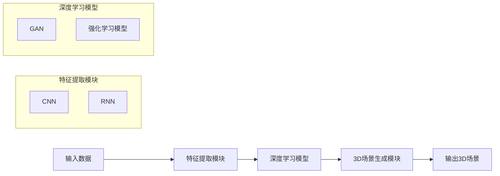

# 3D场景生成中的AI辅助技术进展

> 关键词：3D场景生成、AI辅助技术、深度学习、计算机图形学、生成对抗网络、强化学习、虚拟现实

> 摘要：本文深入探讨了3D场景生成中的AI辅助技术进展。随着计算机图形学和人工智能的飞速发展，AI在3D场景生成领域发挥着越来越重要的作用。文章首先介绍了相关背景，包括目的、预期读者、文档结构和术语表。接着阐述了核心概念与联系，通过文本示意图和Mermaid流程图展示其原理和架构。详细讲解了核心算法原理及具体操作步骤，结合Python源代码进行阐述。介绍了相关的数学模型和公式，并举例说明。通过项目实战展示代码实际案例并详细解释。探讨了实际应用场景，推荐了学习资源、开发工具框架和相关论文著作。最后总结了未来发展趋势与挑战，提供了常见问题与解答及扩展阅读和参考资料，旨在为读者全面呈现3D场景生成中AI辅助技术的最新进展和应用。

## 1. 背景介绍 
### 1.1 目的和范围
随着虚拟现实（VR）、增强现实（AR）、游戏、影视等行业的蓬勃发展，对高质量3D场景的需求日益增长。传统的3D场景生成方法往往需要大量的人工干预和专业技能，效率较低且成本较高。AI辅助技术的出现为3D场景生成带来了新的机遇和挑战。本文的目的在于全面介绍3D场景生成中的AI辅助技术进展，涵盖从基本概念到实际应用的各个方面，包括相关算法原理、数学模型、项目实战等，旨在为读者提供一个系统的知识体系，使其对该领域有更深入的了解。

### 1.2 预期读者
本文预期读者包括计算机图形学、人工智能领域的研究人员、开发者、学生，以及对3D场景生成和AI技术感兴趣的爱好者。对于专业人士，本文可以作为技术参考和研究方向的指引；对于学生和爱好者，本文可以帮助他们快速入门并了解该领域的前沿动态。

### 1.3 文档结构概述
本文共分为十个部分。第一部分为背景介绍，包括目的、预期读者、文档结构和术语表；第二部分阐述核心概念与联系，通过文本示意图和Mermaid流程图展示其原理和架构；第三部分详细讲解核心算法原理及具体操作步骤，结合Python源代码进行阐述；第四部分介绍相关的数学模型和公式，并举例说明；第五部分通过项目实战展示代码实际案例并详细解释；第六部分探讨实际应用场景；第七部分推荐学习资源、开发工具框架和相关论文著作；第八部分总结未来发展趋势与挑战；第九部分提供常见问题与解答；第十部分为扩展阅读和参考资料。

### 1.4 术语表
#### 1.4.1 核心术语定义
- **3D场景生成**：指创建三维虚拟环境的过程，包括场景中的物体、地形、光照等元素的建模和渲染。
- **AI辅助技术**：利用人工智能算法和模型来辅助3D场景生成，提高生成效率和质量。
- **深度学习**：一种基于人工神经网络的机器学习方法，通过大量数据的训练来学习数据的特征和模式。
- **生成对抗网络（GAN）**：由生成器和判别器组成的深度学习模型，通过两者的对抗训练来生成逼真的数据。
- **强化学习**：智能体通过与环境进行交互，根据环境反馈的奖励信号来学习最优策略的机器学习方法。

#### 1.4.2 相关概念解释
- **计算机图形学**：研究如何在计算机中表示、处理和显示图形的学科，是3D场景生成的基础。
- **虚拟现实（VR）**：利用计算机技术创建的沉浸式虚拟环境，用户可以通过特殊设备与之进行交互。
- **增强现实（AR）**：将虚拟信息与真实场景相结合的技术，为用户提供增强的视觉体验。

#### 1.4.3 缩略词列表
- **GAN**：Generative Adversarial Network（生成对抗网络）
- **VR**：Virtual Reality（虚拟现实）
- **AR**：Augmented Reality（增强现实）
- **CNN**：Convolutional Neural Network（卷积神经网络）
- **RNN**：Recurrent Neural Network（循环神经网络）

## 2. 核心概念与联系 

### 核心概念原理
在3D场景生成中，AI辅助技术主要基于深度学习和机器学习的方法。深度学习模型可以学习大量3D场景数据的特征和模式，从而实现自动生成3D场景。例如，生成对抗网络（GAN）通过生成器和判别器的对抗训练，能够生成逼真的3D模型和场景。生成器尝试生成与真实数据相似的3D场景，而判别器则负责判断生成的场景是否真实。通过不断的对抗训练，生成器的能力逐渐提高，最终能够生成高质量的3D场景。

强化学习在3D场景生成中也有重要应用。智能体可以在3D场景中进行探索和交互，根据环境反馈的奖励信号来学习如何生成更合理的场景布局和物体放置。例如，智能体可以通过不断尝试不同的场景布置，以达到最大化用户满意度或其他目标的奖励。

### 架构的文本示意图
以下是一个简化的3D场景生成中AI辅助技术的架构示意图：

输入数据（2D图像、3D模型数据、用户需求等） -> 特征提取模块（CNN、RNN等） -> 深度学习模型（GAN、强化学习模型等） -> 3D场景生成模块 -> 输出3D场景

特征提取模块负责从输入数据中提取有用的特征，深度学习模型利用这些特征进行学习和生成，3D场景生成模块将模型的输出转换为具体的3D场景。

### Mermaid流程图


## 3. 核心算法原理 & 具体操作步骤 

### 生成对抗网络（GAN）原理
生成对抗网络由生成器（Generator）和判别器（Discriminator）组成。生成器的目标是生成逼真的3D场景数据，而判别器的目标是区分生成的数据和真实的数据。两者通过对抗训练不断提高自身的能力。

#### Python源代码实现
```python
import torch
import torch.nn as nn
import torch.optim as optim

# 定义生成器
class Generator(nn.Module):
    def __init__(self, input_dim, output_dim):
        super(Generator, self).__init__()
        self.model = nn.Sequential(
            nn.Linear(input_dim, 128),
            nn.LeakyReLU(0.2),
            nn.Linear(128, 256),
            nn.BatchNorm1d(256),
            nn.LeakyReLU(0.2),
            nn.Linear(256, 512),
            nn.BatchNorm1d(512),
            nn.LeakyReLU(0.2),
            nn.Linear(512, output_dim),
            nn.Tanh()
        )

    def forward(self, x):
        return self.model(x)

# 定义判别器
class Discriminator(nn.Module):
    def __init__(self, input_dim):
        super(Discriminator, self).__init__()
        self.model = nn.Sequential(
            nn.Linear(input_dim, 512),
            nn.LeakyReLU(0.2),
            nn.Linear(512, 256),
            nn.LeakyReLU(0.2),
            nn.Linear(256, 1),
            nn.Sigmoid()
        )

    def forward(self, x):
        return self.model(x)

# 训练参数设置
input_dim = 100
output_dim = 784  # 假设生成的3D场景数据维度为784
batch_size = 32
epochs = 100
learning_rate = 0.0002

# 初始化生成器和判别器
generator = Generator(input_dim, output_dim)
discriminator = Discriminator(output_dim)

# 定义损失函数和优化器
criterion = nn.BCELoss()
generator_optimizer = optim.Adam(generator.parameters(), lr=learning_rate)
discriminator_optimizer = optim.Adam(discriminator.parameters(), lr=learning_rate)

# 训练循环
for epoch in range(epochs):
    for i in range(batch_size):
        # 训练判别器
        discriminator_optimizer.zero_grad()

        # 真实数据
        real_data = torch.randn(batch_size, output_dim)
        real_labels = torch.ones(batch_size, 1)
        real_output = discriminator(real_data)
        real_loss = criterion(real_output, real_labels)

        # 生成数据
        noise = torch.randn(batch_size, input_dim)
        fake_data = generator(noise)
        fake_labels = torch.zeros(batch_size, 1)
        fake_output = discriminator(fake_data.detach())
        fake_loss = criterion(fake_output, fake_labels)

        # 判别器总损失
        discriminator_loss = real_loss + fake_loss
        discriminator_loss.backward()
        discriminator_optimizer.step()

        # 训练生成器
        generator_optimizer.zero_grad()
        fake_labels = torch.ones(batch_size, 1)
        fake_output = discriminator(fake_data)
        generator_loss = criterion(fake_output, fake_labels)
        generator_loss.backward()
        generator_optimizer.step()

    print(f'Epoch [{epoch+1}/{epochs}], Generator Loss: {generator_loss.item()}, Discriminator Loss: {discriminator_loss.item()}')
```

### 具体操作步骤
1. **数据准备**：收集和整理3D场景数据，包括3D模型、纹理、光照等信息。将数据进行预处理，如归一化、裁剪等。
2. **模型初始化**：根据具体需求选择合适的深度学习模型，如GAN、强化学习模型等，并初始化模型的参数。
3. **训练模型**：将预处理后的数据输入到模型中进行训练，根据模型的损失函数和优化器不断调整模型的参数。
4. **生成3D场景**：使用训练好的模型生成3D场景数据，将其转换为具体的3D场景。
5. **评估和优化**：对生成的3D场景进行评估，根据评估结果对模型进行优化，提高生成场景的质量。

## 4. 数学模型和公式 & 详细讲解 & 举例说明 

### 生成对抗网络（GAN）的数学模型
生成对抗网络的目标是最小化生成器和判别器的损失函数。判别器的目标是最大化区分真实数据和生成数据的能力，其损失函数可以表示为：

$$
\min_D V(D, G) = \mathbb{E}_{x \sim p_{data}(x)}[\log D(x)] + \mathbb{E}_{z \sim p_z(z)}[\log (1 - D(G(z)))]
$$

其中，$D(x)$ 表示判别器对真实数据 $x$ 的判断结果，$G(z)$ 表示生成器根据噪声 $z$ 生成的数据，$p_{data}(x)$ 表示真实数据的分布，$p_z(z)$ 表示噪声的分布。

生成器的目标是最小化判别器将生成数据判断为假的概率，其损失函数可以表示为：

$$
\min_G V(D, G) = \mathbb{E}_{z \sim p_z(z)}[\log (1 - D(G(z)))]
$$

### 详细讲解
判别器的损失函数由两部分组成：第一部分是对真实数据的判断，希望判别器能够正确判断真实数据为真，即 $\log D(x)$ 尽可能大；第二部分是对生成数据的判断，希望判别器能够正确判断生成数据为假，即 $\log (1 - D(G(z)))$ 尽可能大。

生成器的损失函数则是希望判别器将生成数据判断为真，即 $\log (1 - D(G(z)))$ 尽可能小。

### 举例说明
假设我们有一个简单的二维数据分布，真实数据分布为一个高斯分布，噪声分布为均匀分布。生成器的任务是根据噪声生成与真实数据分布相似的数据。判别器的任务是区分真实数据和生成数据。

在训练过程中，判别器不断学习区分真实数据和生成数据的特征，生成器则不断调整生成的数据，使其更接近真实数据分布。最终，当生成器和判别器达到平衡时，生成器能够生成与真实数据分布相似的数据。

## 5. 项目实战：代码实际案例和详细解释说明 

### 5.1  开发环境搭建
- **操作系统**：推荐使用Linux或Windows操作系统。
- **编程语言**：Python 3.x
- **深度学习框架**：PyTorch
- **其他依赖库**：NumPy、Matplotlib等

### 5.2  源代码详细实现和代码解读
以下是一个简单的3D场景生成项目的源代码示例：

```python
import torch
import torch.nn as nn
import torch.optim as optim
import numpy as np
import matplotlib.pyplot as plt

# 定义生成器
class Generator(nn.Module):
    def __init__(self, input_dim, output_dim):
        super(Generator, self).__init__()
        self.model = nn.Sequential(
            nn.Linear(input_dim, 128),
            nn.LeakyReLU(0.2),
            nn.Linear(128, 256),
            nn.BatchNorm1d(256),
            nn.LeakyReLU(0.2),
            nn.Linear(256, 512),
            nn.BatchNorm1d(512),
            nn.LeakyReLU(0.2),
            nn.Linear(512, output_dim),
            nn.Tanh()
        )

    def forward(self, x):
        return self.model(x)

# 定义判别器
class Discriminator(nn.Module):
    def __init__(self, input_dim):
        super(Discriminator, self).__init__()
        self.model = nn.Sequential(
            nn.Linear(input_dim, 512),
            nn.LeakyReLU(0.2),
            nn.Linear(512, 256),
            nn.LeakyReLU(0.2),
            nn.Linear(256, 1),
            nn.Sigmoid()
        )

    def forward(self, x):
        return self.model(x)

# 训练参数设置
input_dim = 100
output_dim = 784  # 假设生成的3D场景数据维度为784
batch_size = 32
epochs = 100
learning_rate = 0.0002

# 初始化生成器和判别器
generator = Generator(input_dim, output_dim)
discriminator = Discriminator(output_dim)

# 定义损失函数和优化器
criterion = nn.BCELoss()
generator_optimizer = optim.Adam(generator.parameters(), lr=learning_rate)
discriminator_optimizer = optim.Adam(discriminator.parameters(), lr=learning_rate)

# 训练循环
generator_losses = []
discriminator_losses = []

for epoch in range(epochs):
    for i in range(batch_size):
        # 训练判别器
        discriminator_optimizer.zero_grad()

        # 真实数据
        real_data = torch.randn(batch_size, output_dim)
        real_labels = torch.ones(batch_size, 1)
        real_output = discriminator(real_data)
        real_loss = criterion(real_output, real_labels)

        # 生成数据
        noise = torch.randn(batch_size, input_dim)
        fake_data = generator(noise)
        fake_labels = torch.zeros(batch_size, 1)
        fake_output = discriminator(fake_data.detach())
        fake_loss = criterion(fake_output, fake_labels)

        # 判别器总损失
        discriminator_loss = real_loss + fake_loss
        discriminator_loss.backward()
        discriminator_optimizer.step()

        # 训练生成器
        generator_optimizer.zero_grad()
        fake_labels = torch.ones(batch_size, 1)
        fake_output = discriminator(fake_data)
        generator_loss = criterion(fake_output, fake_labels)
        generator_loss.backward()
        generator_optimizer.step()

    generator_losses.append(generator_loss.item())
    discriminator_losses.append(discriminator_loss.item())
    print(f'Epoch [{epoch+1}/{epochs}], Generator Loss: {generator_loss.item()}, Discriminator Loss: {discriminator_loss.item()}')

# 绘制损失曲线
plt.plot(generator_losses, label='Generator Loss')
plt.plot(discriminator_losses, label='Discriminator Loss')
plt.xlabel('Epoch')
plt.ylabel('Loss')
plt.legend()
plt.show()

# 生成3D场景数据
noise = torch.randn(1, input_dim)
generated_data = generator(noise)
print(generated_data)
```

### 5.3  代码解读与分析
1. **生成器和判别器的定义**：使用PyTorch定义了生成器和判别器的神经网络结构。生成器将随机噪声作为输入，输出3D场景数据；判别器将3D场景数据作为输入，输出判断结果（真或假）。
2. **训练循环**：在训练循环中，交替训练判别器和生成器。判别器的目标是区分真实数据和生成数据，生成器的目标是生成能够骗过判别器的3D场景数据。
3. **损失函数和优化器**：使用二元交叉熵损失函数（BCELoss）来计算判别器和生成器的损失，使用Adam优化器来更新模型的参数。
4. **损失曲线绘制**：在训练过程中，记录生成器和判别器的损失值，并使用Matplotlib绘制损失曲线，以便观察训练过程的收敛情况。
5. **生成3D场景数据**：训练完成后，使用生成器生成一个3D场景数据并输出。

## 6. 实际应用场景 
### 游戏开发
在游戏开发中，AI辅助技术可以用于快速生成游戏场景，包括地形、建筑、道具等。例如，使用GAN可以生成逼真的游戏地图，强化学习可以用于优化游戏场景的布局和难度。这可以大大提高游戏开发的效率，减少人工建模的工作量。

### 影视制作
在影视制作中，AI辅助技术可以用于创建虚拟场景和特效。例如，使用深度学习模型可以根据2D图像生成3D场景，为电影、动画等提供逼真的背景和特效。这可以节省制作成本，提高制作效率。

### 虚拟现实（VR）和增强现实（AR）
在VR和AR应用中，AI辅助技术可以用于实时生成3D场景，为用户提供更加沉浸式的体验。例如，使用强化学习可以根据用户的行为和环境反馈动态调整3D场景的内容和布局。

### 建筑设计
在建筑设计中，AI辅助技术可以用于生成建筑模型和场景。例如，使用GAN可以根据用户的需求和设计风格生成不同的建筑方案，帮助设计师快速进行方案评估和优化。

### 工业设计
在工业设计中，AI辅助技术可以用于生成产品的3D模型和展示场景。例如，使用深度学习模型可以根据产品的功能和外观要求生成不同的设计方案，提高设计效率和质量。

## 7. 工具和资源推荐
### 7.1 学习资源推荐
#### 7.1.1 书籍推荐
- 《深度学习》（Deep Learning），Ian Goodfellow、Yoshua Bengio和Aaron Courville著，是深度学习领域的经典教材。
- 《计算机图形学原理与实践》（Computer Graphics: Principles and Practice），James D. Foley、Andries van Dam、Steven K. Feiner和John F. Hughes著，是计算机图形学领域的权威著作。
- 《Python深度学习》（Deep Learning with Python），Francois Chollet著，介绍了使用Python和Keras进行深度学习的实践方法。

#### 7.1.2 在线课程
- Coursera上的“深度学习专项课程”（Deep Learning Specialization），由Andrew Ng教授授课，是深度学习领域的经典在线课程。
- edX上的“计算机图形学”（Computer Graphics）课程，介绍了计算机图形学的基本原理和算法。
- Udemy上的“Python for Data Science and Machine Learning Bootcamp”，介绍了使用Python进行数据科学和机器学习的实践方法。

#### 7.1.3 技术博客和网站
- Medium上的“Towards Data Science”，是一个专注于数据科学和机器学习的技术博客，有很多关于深度学习和AI辅助技术的文章。
- arXiv.org是一个预印本服务器，提供了大量关于计算机科学、数学、物理学等领域的最新研究论文。
- Kaggle是一个数据科学竞赛平台，有很多关于深度学习和计算机图形学的竞赛和开源代码。

### 7.2 开发工具框架推荐
#### 7.2.1 IDE和编辑器
- PyCharm是一个专业的Python集成开发环境，提供了丰富的代码编辑、调试和版本控制功能。
- Visual Studio Code是一个轻量级的代码编辑器，支持多种编程语言和插件扩展，非常适合Python开发。

#### 7.2.2 调试和性能分析工具
- PyTorch Profiler是PyTorch提供的性能分析工具，可以帮助开发者分析模型的性能瓶颈。
- TensorBoard是TensorFlow提供的可视化工具，也可以用于PyTorch模型的训练过程可视化和性能分析。

#### 7.2.3 相关框架和库
- PyTorch是一个开源的深度学习框架，提供了丰富的神经网络模块和优化算法，非常适合3D场景生成中的AI辅助技术开发。
- NumPy是Python的一个科学计算库，提供了高效的数组操作和数学函数，是深度学习开发的基础库。
- Matplotlib是Python的一个绘图库，用于数据可视化和结果展示。

### 7.3 相关论文著作推荐
#### 7.3.1 经典论文
- “Generative Adversarial Networks”，Ian J. Goodfellow等著，是生成对抗网络的开创性论文。
- “DeepDream: Visualizing Neural Network”，Alexander Mordvintsev等著，介绍了深度学习在图像生成和可视化方面的应用。
- “Neural Rendering: A Survey”，Shubham Tulsiani等著，是关于神经渲染技术的综述论文。

#### 7.3.2 最新研究成果
- 关注CVPR（计算机视觉与模式识别会议）、ICCV（国际计算机视觉会议）、ECCV（欧洲计算机视觉会议）等计算机视觉领域的顶级会议，了解3D场景生成中AI辅助技术的最新研究成果。
- 关注顶级学术期刊，如ACM Transactions on Graphics、IEEE Transactions on Pattern Analysis and Machine Intelligence等。

#### 7.3.3 应用案例分析
- 分析游戏开发公司、影视制作公司等在3D场景生成中应用AI辅助技术的实际案例，了解其技术实现和应用效果。
- 参考开源项目和代码库，如GitHub上的相关项目，学习他人的经验和实践方法。

## 8. 总结：未来发展趋势与挑战
### 未来发展趋势
- **更高的生成质量**：随着深度学习技术的不断发展，3D场景生成的质量将不断提高，生成的场景将更加逼真、细腻。
- **更加智能化**：AI辅助技术将更加智能化，能够根据用户的需求和环境反馈自动生成和调整3D场景。例如，智能体可以通过强化学习不断优化场景的布局和内容，以满足用户的个性化需求。
- **跨领域融合**：3D场景生成中的AI辅助技术将与其他领域，如计算机视觉、自然语言处理、机器人等进行更深入的融合。例如，结合计算机视觉技术可以实现从真实场景到虚拟场景的快速转换，结合自然语言处理技术可以实现通过文本描述生成3D场景。
- **实时交互性**：在VR、AR等应用中，3D场景生成将更加注重实时交互性。用户可以与3D场景进行实时交互，AI辅助技术可以根据用户的行为实时调整场景的内容和布局。

### 挑战
- **数据获取和标注**：高质量的3D场景数据获取和标注是一个挑战。3D场景数据的采集需要专业的设备和技术，而且标注工作也非常繁琐和耗时。
- **计算资源需求**：深度学习模型的训练需要大量的计算资源，如GPU、TPU等。这对于一些小型企业和研究机构来说是一个很大的挑战。
- **模型可解释性**：深度学习模型往往是黑盒模型，其决策过程和生成结果难以解释。在一些对安全性和可靠性要求较高的应用场景中，模型的可解释性是一个重要的问题。
- **伦理和法律问题**：AI辅助技术生成的3D场景可能会涉及到伦理和法律问题，如版权、隐私、虚假信息等。如何解决这些问题是未来需要面对的挑战。

## 9. 附录：常见问题与解答
### 问题1：AI辅助技术生成的3D场景质量如何保证？
答：可以通过以下方法保证生成的3D场景质量：
- 使用高质量的训练数据，包括大量的真实3D场景数据和标注信息。
- 选择合适的深度学习模型，并进行充分的训练和优化。
- 引入评估指标，如视觉质量评估、语义准确性评估等，对生成的3D场景进行评估和改进。

### 问题2：AI辅助技术在3D场景生成中的计算效率如何提高？
答：可以通过以下方法提高计算效率：
- 使用高效的深度学习框架和优化算法，如PyTorch、TensorFlow等。
- 采用并行计算和分布式计算技术，利用多GPU、TPU等进行加速。
- 对模型进行压缩和优化，减少模型的参数数量和计算量。

### 问题3：AI辅助技术生成的3D场景是否可以用于商业用途？
答：这取决于具体的情况。如果生成的3D场景是基于公开数据集或自己采集的数据，并且没有侵犯他人的版权和隐私等权益，一般可以用于商业用途。但如果使用了受版权保护的数据或模型，需要获得相关的授权。

### 问题4：如何选择适合的AI辅助技术用于3D场景生成？
答：需要根据具体的应用场景和需求来选择适合的AI辅助技术。例如，如果需要生成逼真的3D场景，可以选择生成对抗网络（GAN）；如果需要根据用户的行为和环境反馈动态调整3D场景，可以选择强化学习。同时，还需要考虑计算资源、数据量等因素。

## 10. 扩展阅读 & 参考资料
### 扩展阅读
- 阅读更多关于深度学习、计算机图形学、虚拟现实等领域的书籍和论文，深入了解相关技术的原理和应用。
- 关注行业动态和前沿研究，了解3D场景生成中AI辅助技术的最新发展趋势。

### 参考资料
- Goodfellow, I. J., et al. "Generative adversarial networks." Communications of the ACM 63.11 (2020): 139-144.
- Foley, J. D., et al. Computer Graphics: Principles and Practice. Addison-Wesley, 1990.
- Chollet, F. Deep Learning with Python. Manning Publications, 2018.
- 相关的开源代码库和项目，如GitHub上的3D场景生成相关项目。