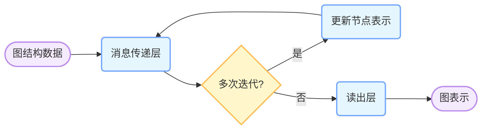

# AI Agent中的图神经网络应用

> 关键词：AI Agent、图神经网络、应用场景、算法原理、项目实战

> 摘要：本文聚焦于AI Agent中图神经网络的应用。首先介绍了相关背景知识，包括目的范围、预期读者等内容。接着深入阐述图神经网络的核心概念与联系，通过文本示意图和Mermaid流程图清晰呈现其架构。详细讲解了核心算法原理并给出Python源代码，同时介绍了相关数学模型和公式。在项目实战部分，提供了开发环境搭建、源代码实现与解读。分析了图神经网络在AI Agent中的实际应用场景，推荐了学习、开发工具框架以及相关论文著作。最后总结了未来发展趋势与挑战，并对常见问题进行解答，为读者全面了解AI Agent中图神经网络的应用提供了系统而深入的参考。

## 1. 背景介绍 
### 1.1 目的和范围
在当今的人工智能领域，AI Agent作为一种能够自主感知环境、做出决策并采取行动的智能体，正发挥着越来越重要的作用。图神经网络（Graph Neural Networks，GNN）作为一种专门处理图结构数据的深度学习方法，为AI Agent处理复杂的关系数据提供了强大的工具。本文的目的在于深入探讨图神经网络在AI Agent中的应用，从理论原理到实际案例，全面剖析其应用的各个方面。范围涵盖图神经网络的基本概念、核心算法、数学模型，以及在不同领域的实际应用场景等内容。

### 1.2 预期读者
本文预期读者包括人工智能领域的研究人员、开发者、学生，以及对AI Agent和图神经网络感兴趣的技术爱好者。对于希望深入了解图神经网络在AI Agent中应用原理和实践方法的读者，本文将提供有价值的参考。

### 1.3 文档结构概述
本文首先介绍背景知识，让读者对文章的目的和适用人群有清晰的认识。接着阐述图神经网络的核心概念与联系，通过直观的方式展示其架构。然后详细讲解核心算法原理和具体操作步骤，并给出Python代码示例。介绍相关的数学模型和公式，并举例说明。在项目实战部分，提供开发环境搭建和源代码实现与解读。分析图神经网络在AI Agent中的实际应用场景。推荐学习、开发工具框架以及相关论文著作。最后总结未来发展趋势与挑战，解答常见问题，并提供扩展阅读和参考资料。

### 1.4 术语表
#### 1.4.1 核心术语定义
- **AI Agent（人工智能智能体）**：是一种能够感知环境、通过内部决策机制做出决策，并采取相应行动以实现特定目标的智能实体。
- **图神经网络（Graph Neural Networks，GNN）**：是一类专门用于处理图结构数据的神经网络，能够对图中的节点和边进行学习和表示。
- **图（Graph）**：由节点（Vertex）和边（Edge）组成的数据结构，用于表示实体之间的关系。

#### 1.4.2 相关概念解释
- **节点特征（Node Features）**：每个节点所具有的属性信息，例如在社交网络中，节点可能代表用户，节点特征可以是用户的年龄、性别等信息。
- **边特征（Edge Features）**：边所具有的属性信息，例如在社交网络中，边可能代表用户之间的关系，边特征可以是关系的强度、类型等。
- **消息传递机制（Message Passing Mechanism）**：图神经网络中用于节点信息更新的一种机制，通过节点之间的消息传递来更新节点的表示。

#### 1.4.3 缩略词列表
- **GNN**：Graph Neural Networks（图神经网络）
- **MLP**：Multi - Layer Perceptron（多层感知机）

## 2. 核心概念与联系 

### 图神经网络的核心概念原理
图神经网络的核心思想是通过节点之间的信息传递来学习节点和图的表示。在图结构中，节点的特征不仅取决于自身的属性，还受到其邻居节点的影响。图神经网络通过迭代的方式，让节点不断聚合其邻居节点的信息，从而更新自身的表示。

### 图神经网络的架构
图神经网络的一般架构包括消息传递层和读出层。消息传递层用于节点信息的更新，读出层用于将节点表示聚合为图的表示。

#### 文本示意图
图神经网络的架构可以用以下文本描述：
输入为图结构数据，包括节点特征和边信息。首先经过消息传递层，在消息传递层中，每个节点根据其邻居节点的信息进行更新。经过多次迭代的消息传递后，得到更新后的节点表示。最后，通过读出层将节点表示聚合为图的表示，用于后续的任务，如节点分类、图分类等。

#### Mermaid流程图


## 3. 核心算法原理 & 具体操作步骤 

### 核心算法原理
图神经网络中常用的消息传递机制是图卷积网络（Graph Convolutional Network，GCN）。GCN的核心思想是通过聚合邻居节点的特征来更新节点的表示。

设图 $G=(V, E)$，其中 $V$ 是节点集合，$E$ 是边集合。节点 $i$ 的特征向量为 $h_i$，其邻居节点集合为 $N(i)$。在第 $l$ 层的消息传递中，节点 $i$ 的更新公式为：

$$h_i^{l + 1} = \sigma\left(\sum_{j \in N(i) \cup \{i\}} \frac{1}{\sqrt{d_i d_j}} W^l h_j^l\right)$$

其中，$d_i$ 和 $d_j$ 分别是节点 $i$ 和节点 $j$ 的度，$W^l$ 是第 $l$ 层的可学习权重矩阵，$\sigma$ 是激活函数。

### 具体操作步骤
1. **数据准备**：将图结构数据转换为合适的输入格式，包括节点特征矩阵和邻接矩阵。
2. **初始化参数**：初始化图神经网络的权重矩阵。
3. **消息传递**：按照上述公式进行多次消息传递，更新节点的表示。
4. **读出操作**：将更新后的节点表示聚合为图的表示。
5. **损失计算和参数更新**：根据具体任务，计算损失函数，并使用优化算法更新参数。

### Python源代码详细阐述
```python
import torch
import torch.nn as nn
import torch.nn.functional as F

# 定义图卷积层
class GraphConvolution(nn.Module):
    def __init__(self, in_features, out_features):
        super(GraphConvolution, self).__init__()
        self.weight = nn.Parameter(torch.FloatTensor(in_features, out_features))
        self.reset_parameters()

    def reset_parameters(self):
        nn.init.xavier_uniform_(self.weight)

    def forward(self, input, adj):
        support = torch.mm(input, self.weight)
        output = torch.spmm(adj, support)
        return output

# 定义简单的图神经网络模型
class GCN(nn.Module):
    def __init__(self, nfeat, nhid, nclass, dropout):
        super(GCN, self).__init__()
        self.gc1 = GraphConvolution(nfeat, nhid)
        self.gc2 = GraphConvolution(nhid, nclass)
        self.dropout = dropout

    def forward(self, x, adj):
        x = F.relu(self.gc1(x, adj))
        x = F.dropout(x, self.dropout, training=self.training)
        x = self.gc2(x, adj)
        return F.log_softmax(x, dim=1)

# 示例数据
n_nodes = 10
n_features = 5
n_hidden = 16
n_classes = 2
dropout = 0.5

# 随机生成节点特征和邻接矩阵
features = torch.randn(n_nodes, n_features)
adj = torch.randn(n_nodes, n_nodes)
adj = adj * (adj > 0).float()  # 确保邻接矩阵非负
adj = adj / adj.sum(dim=1, keepdim=True)  # 归一化邻接矩阵

# 初始化模型
model = GCN(n_features, n_hidden, n_classes, dropout)

# 前向传播
output = model(features, adj)
print(output)
```

## 4. 数学模型和公式 & 详细讲解 & 举例说明 

### 数学模型和公式
#### 图卷积网络（GCN）的数学模型
如前面所述，GCN的节点更新公式为：

$$h_i^{l + 1} = \sigma\left(\sum_{j \in N(i) \cup \{i\}} \frac{1}{\sqrt{d_i d_j}} W^l h_j^l\right)$$

其中，$h_i^l$ 是节点 $i$ 在第 $l$ 层的特征向量，$d_i$ 是节点 $i$ 的度，$W^l$ 是第 $l$ 层的可学习权重矩阵，$\sigma$ 是激活函数。

#### 损失函数
在节点分类任务中，常用的损失函数是交叉熵损失函数：

$$L = -\sum_{i \in V} y_i \log(p_i)$$

其中，$y_i$ 是节点 $i$ 的真实标签，$p_i$ 是节点 $i$ 的预测概率。

### 详细讲解
#### GCN的节点更新公式
- **邻居节点信息聚合**：公式中的 $\sum_{j \in N(i) \cup \{i\}}$ 表示对节点 $i$ 及其邻居节点的信息进行聚合。
- **归一化**：$\frac{1}{\sqrt{d_i d_j}}$ 是为了对邻居节点的信息进行归一化，避免度大的节点对信息聚合的影响过大。
- **线性变换**：$W^l h_j^l$ 是对邻居节点的特征进行线性变换，$W^l$ 是可学习的权重矩阵。
- **非线性激活**：$\sigma$ 是激活函数，如ReLU函数，用于引入非线性因素。

#### 交叉熵损失函数
交叉熵损失函数衡量了预测概率分布与真实标签分布之间的差异。当预测概率与真实标签越接近时，损失函数的值越小。

### 举例说明
假设我们有一个简单的图，包含3个节点，节点特征向量维度为2。邻接矩阵和节点特征矩阵如下：

邻接矩阵 $A$：
$$
A = \begin{bmatrix}
0 & 1 & 1 \\
1 & 0 & 1 \\
1 & 1 & 0
\end{bmatrix}
$$

节点特征矩阵 $X$：
$$
X = \begin{bmatrix}
1 & 2 \\
3 & 4 \\
5 & 6
\end{bmatrix}
$$

节点的度分别为 $d_1 = 2, d_2 = 2, d_3 = 2$。

假设第一层的权重矩阵 $W^1$ 为：
$$
W^1 = \begin{bmatrix}
0.1 & 0.2 \\
0.3 & 0.4
\end{bmatrix}
$$

以节点1为例，其邻居节点为节点2和节点3，根据GCN的节点更新公式：

首先计算归一化系数：
$$
\frac{1}{\sqrt{d_1 d_1}} = \frac{1}{2}, \frac{1}{\sqrt{d_1 d_2}} = \frac{1}{2}, \frac{1}{\sqrt{d_1 d_3}} = \frac{1}{2}
$$

然后计算邻居节点信息聚合：
$$
\begin{align*}
\sum_{j \in N(1) \cup \{1\}} \frac{1}{\sqrt{d_1 d_j}} W^1 h_j^1 &= \frac{1}{2} W^1 h_1^1 + \frac{1}{2} W^1 h_2^1 + \frac{1}{2} W^1 h_3^1 \\
&= \frac{1}{2} \begin{bmatrix}
0.1 & 0.2 \\
0.3 & 0.4
\end{bmatrix} \begin{bmatrix}
1 \\
2
\end{bmatrix} + \frac{1}{2} \begin{bmatrix}
0.1 & 0.2 \\
0.3 & 0.4
\end{bmatrix} \begin{bmatrix}
3 \\
4
\end{bmatrix} + \frac{1}{2} \begin{bmatrix}
0.1 & 0.2 \\
0.3 & 0.4
\end{bmatrix} \begin{bmatrix}
5 \\
6
\end{bmatrix}
\end{align*}
$$

最后经过激活函数（如ReLU）得到节点1在第二层的特征向量。

## 5. 项目实战：代码实际案例和详细解释说明 

### 5.1  开发环境搭建
#### 安装Python
首先需要安装Python，建议使用Python 3.7及以上版本。可以从Python官方网站（https://www.python.org/downloads/）下载安装包进行安装。

#### 安装深度学习框架
本文使用PyTorch作为深度学习框架，可以根据自己的系统和CUDA版本选择合适的安装方式。在命令行中执行以下命令安装PyTorch：
```sh
pip install torch torchvision
```

#### 安装图神经网络库
可以使用DGL（Deep Graph Library）或PyTorch Geometric等图神经网络库。以DGL为例，在命令行中执行以下命令安装：
```sh
pip install dgl
```

### 5.2  源代码详细实现和代码解读
以下是一个使用DGL库进行节点分类任务的完整代码示例：

```python
import dgl
import torch
import torch.nn as nn
import torch.nn.functional as F
from dgl.data import CoraGraphDataset
from dgl.nn.pytorch import GraphConv

# 定义图神经网络模型
class GCN(nn.Module):
    def __init__(self, in_feats, h_feats, num_classes):
        super(GCN, self).__init__()
        self.conv1 = GraphConv(in_feats, h_feats)
        self.conv2 = GraphConv(h_feats, num_classes)

    def forward(self, g, in_feat):
        h = self.conv1(g, in_feat)
        h = F.relu(h)
        h = self.conv2(g, h)
        return h

# 加载数据集
dataset = CoraGraphDataset()
g = dataset[0]
features = g.ndata['feat']
labels = g.ndata['label']
train_mask = g.ndata['train_mask']
test_mask = g.ndata['test_mask']

# 初始化模型
in_feats = features.shape[1]
h_feats = 16
num_classes = dataset.num_classes
model = GCN(in_feats, h_feats, num_classes)

# 定义优化器和损失函数
optimizer = torch.optim.Adam(model.parameters(), lr=0.01)
criterion = nn.CrossEntropyLoss()

# 训练模型
for epoch in range(200):
    logits = model(g, features)
    loss = criterion(logits[train_mask], labels[train_mask])

    optimizer.zero_grad()
    loss.backward()
    optimizer.step()

    if epoch % 10 == 0:
        print(f'Epoch {epoch}: Loss = {loss.item()}')

# 测试模型
with torch.no_grad():
    logits = model(g, features)
    pred = logits.argmax(1)
    test_acc = (pred[test_mask] == labels[test_mask]).float().mean()
    print(f'Test Accuracy: {test_acc.item()}')
```

### 5.3  代码解读与分析
#### 模型定义
`GCN` 类定义了一个简单的图神经网络模型，包含两个图卷积层。`GraphConv` 是DGL库中提供的图卷积层。

#### 数据集加载
使用 `CoraGraphDataset` 加载Cora数据集，该数据集是一个常用的节点分类数据集。

#### 训练过程
在训练过程中，首先前向传播计算模型的输出，然后计算损失函数。使用 `Adam` 优化器进行参数更新。

#### 测试过程
在测试过程中，使用 `argmax` 函数获取预测标签，然后计算测试集的准确率。

## 6. 实际应用场景 
### 社交网络分析
在社交网络中，用户可以看作节点，用户之间的关系可以看作边。图神经网络可以用于分析用户的社交行为、预测用户之间的关系、进行社区发现等任务。例如，通过图神经网络可以预测用户是否会关注某个新的用户，或者发现社交网络中的重要节点。

### 知识图谱推理
知识图谱是一种图结构的数据，节点表示实体，边表示实体之间的关系。图神经网络可以用于知识图谱的推理任务，如实体分类、关系预测等。例如，在一个知识图谱中，通过图神经网络可以预测两个实体之间是否存在某种关系。

### 推荐系统
在推荐系统中，用户和物品可以看作节点，用户对物品的行为（如点击、购买等）可以看作边。图神经网络可以用于捕捉用户和物品之间的复杂关系，提高推荐的准确性。例如，通过图神经网络可以为用户推荐更符合其兴趣的物品。

### 药物发现
在药物发现中，分子可以看作图结构，原子是节点，化学键是边。图神经网络可以用于预测分子的性质、筛选潜在的药物分子等任务。例如，通过图神经网络可以预测一个分子是否具有某种生物活性。

## 7. 工具和资源推荐
### 7.1 学习资源推荐
#### 7.1.1 书籍推荐
- 《深度学习》（Deep Learning）：由Ian Goodfellow、Yoshua Bengio和Aaron Courville所著，是深度学习领域的经典教材，涵盖了神经网络的基本原理和方法。
- 《图神经网络：基础、前沿与应用》：系统介绍了图神经网络的基本概念、算法和应用，适合深入学习图神经网络的读者。

#### 7.1.2 在线课程
- Coursera上的“Deep Learning Specialization”：由Andrew Ng教授授课，是深度学习领域的经典在线课程，包含了神经网络的基础和应用。
- 李沐的“动手学深度学习”：提供了丰富的深度学习实践案例和代码，帮助读者更好地理解和掌握深度学习的知识。

#### 7.1.3 技术博客和网站
- Medium：有很多关于人工智能和图神经网络的技术博客文章，可以了解到最新的研究成果和应用案例。
- arXiv：是一个预印本数据库，包含了大量的学术论文，可以及时了解到图神经网络领域的最新研究动态。

### 7.2 开发工具框架推荐
#### 7.2.1 IDE和编辑器
- PyCharm：是一款专业的Python集成开发环境，提供了丰富的代码编辑、调试和分析功能。
- Visual Studio Code：是一款轻量级的代码编辑器，支持多种编程语言和插件扩展，适合快速开发和调试。

#### 7.2.2 调试和性能分析工具
- PyTorch Profiler：是PyTorch提供的性能分析工具，可以帮助开发者分析模型的性能瓶颈。
- TensorBoard：是一个可视化工具，可以用于可视化模型的训练过程和性能指标。

#### 7.2.3 相关框架和库
- DGL（Deep Graph Library）：是一个专门用于图神经网络的深度学习框架，提供了丰富的图神经网络模型和工具。
- PyTorch Geometric：是基于PyTorch的图神经网络库，提供了高效的图数据处理和模型实现。

### 7.3 相关论文著作推荐
#### 7.3.1 经典论文
- “Semi - Supervised Classification with Graph Convolutional Networks”：提出了图卷积网络（GCN）的基本框架，是图神经网络领域的经典论文。
- “Graph Attention Networks”：提出了图注意力网络（GAT），通过注意力机制提高了图神经网络的性能。

#### 7.3.2 最新研究成果
- 关注ICML、NeurIPS、AAAI等人工智能领域的顶级会议，了解图神经网络领域的最新研究成果。

#### 7.3.3 应用案例分析
- 一些开源项目和学术论文中会包含图神经网络在不同领域的应用案例分析，可以参考学习。

## 8. 总结：未来发展趋势与挑战
### 未来发展趋势
#### 模型创新
未来图神经网络的模型将不断创新，例如引入更复杂的注意力机制、结合强化学习等方法，提高模型的性能和表达能力。

#### 跨领域应用
图神经网络将在更多领域得到应用，如医疗、金融、交通等，为解决复杂的实际问题提供有效的方法。

#### 与其他技术融合
图神经网络将与其他人工智能技术（如自然语言处理、计算机视觉等）融合，实现更强大的智能系统。

### 挑战
#### 计算资源需求
图神经网络的训练和推理需要大量的计算资源，尤其是处理大规模图数据时，如何提高计算效率是一个挑战。

#### 数据质量和可解释性
图数据的质量对图神经网络的性能有重要影响，同时图神经网络的可解释性也是一个亟待解决的问题，需要更好地理解模型的决策过程。

#### 模型泛化能力
如何提高图神经网络的泛化能力，使其在不同的图数据和任务上都能取得良好的性能，是未来研究的重点之一。

## 9. 附录：常见问题与解答
### 问题1：图神经网络和传统神经网络有什么区别？
传统神经网络通常处理的是结构化的数据，如图像、文本等，而图神经网络专门处理图结构数据，能够捕捉节点之间的关系信息。

### 问题2：图神经网络的训练时间为什么比较长？
图神经网络的训练时间长主要是因为其需要处理图结构数据，涉及到节点之间的信息传递和聚合，计算复杂度较高。

### 问题3：如何选择合适的图神经网络模型？
需要根据具体的任务和数据特点选择合适的图神经网络模型。例如，对于节点分类任务，可以选择GCN、GAT等模型；对于图分类任务，可以选择GraphSAGE等模型。

## 10. 扩展阅读 & 参考资料
### 扩展阅读
- 阅读更多关于图神经网络的学术论文和技术博客，深入了解图神经网络的最新研究进展。
- 参与相关的开源项目，实践图神经网络的应用。

### 参考资料
- 相关的学术论文和书籍，如前面推荐的《深度学习》《图神经网络：基础、前沿与应用》等。
- 深度学习框架和图神经网络库的官方文档，如PyTorch、DGL、PyTorch Geometric的官方文档。