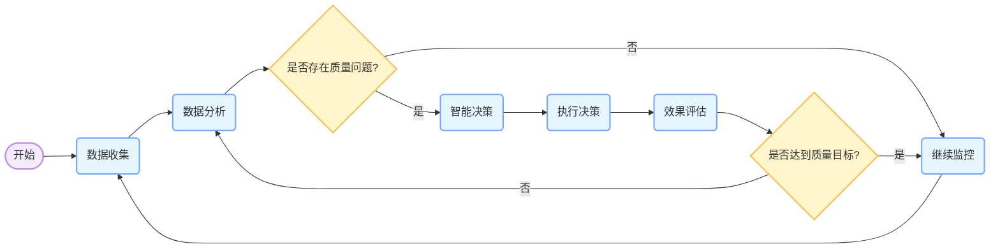

# AI Agent在企业全面质量管理(TQM)中的深度应用

> 关键词：AI Agent、全面质量管理(TQM)、企业应用、质量控制、智能决策

> 摘要：本文聚焦于AI Agent在企业全面质量管理(TQM)中的深度应用。全面质量管理作为企业提升产品和服务质量、增强竞争力的关键理念，而AI Agent凭借其智能化、自动化等特性，为TQM的实施带来了新的机遇和变革。文章详细阐述了AI Agent与TQM的核心概念及联系，深入剖析了其核心算法原理和具体操作步骤，通过数学模型和公式进行理论支撑，并结合项目实战展示了代码实现与应用。同时探讨了其实际应用场景，推荐了相关工具和资源，最后对未来发展趋势与挑战进行总结，旨在为企业有效利用AI Agent推动全面质量管理提供全面的技术指导和参考。

## 1. 背景介绍 
### 1.1 目的和范围
随着市场竞争的日益激烈，企业对产品和服务质量的要求越来越高。全面质量管理(TQM)作为一种系统性的管理方法，旨在通过全员参与、全过程控制等方式，不断提高企业的质量水平。而AI Agent的出现，为TQM的进一步发展提供了强大的技术支持。本文的目的在于深入探讨AI Agent在企业全面质量管理中的应用，涵盖从理论原理到实际操作的各个方面，包括核心概念的解释、算法原理的阐述、实际案例的分析等，为企业管理者、技术人员等提供全面的技术指导和参考。

### 1.2 预期读者
本文预期读者包括企业中从事质量管理的相关人员，如质量管理人员、生产管理人员等，他们可以从本文中了解AI Agent在TQM中的应用方法和实践经验，以提升企业的质量管理水平。同时，也适合从事人工智能技术研究和开发的专业人员，他们可以通过本文了解AI Agent在质量管理领域的具体应用场景和需求，为进一步的技术创新提供思路。此外，对企业管理和人工智能领域感兴趣的学者和研究人员也可以从本文中获取相关的理论和实践知识。

### 1.3 文档结构概述
本文首先介绍了AI Agent和全面质量管理(TQM)的背景知识，包括目的和范围、预期读者等内容。接着阐述了核心概念与联系，通过文本示意图和Mermaid流程图展示其架构和关系。然后详细讲解了核心算法原理和具体操作步骤，并结合Python源代码进行说明。随后介绍了数学模型和公式，并举例说明。再通过项目实战展示代码实际案例和详细解释。之后探讨了实际应用场景，推荐了相关的工具和资源。最后对未来发展趋势与挑战进行总结，并提供了常见问题与解答以及扩展阅读和参考资料。

### 1.4 术语表
#### 1.4.1 核心术语定义
- **AI Agent**：即人工智能代理，是一种能够感知环境、自主决策并采取行动以实现特定目标的智能实体。它可以通过学习和推理来适应不同的环境和任务需求。
- **全面质量管理(TQM)**：是一种以质量为中心，以全员参与为基础，旨在通过让顾客满意和本组织所有成员及社会受益而达到长期成功的管理途径。它强调全过程、全方位的质量管理。

#### 1.4.2 相关概念解释
- **质量控制**：是质量管理的一部分，致力于满足质量要求。通过采取一系列的措施和方法，对产品或服务的质量进行监控和调整，以确保其符合规定的标准。
- **智能决策**：是指利用人工智能技术，对大量的数据进行分析和处理，从而做出最优的决策。在企业全面质量管理中，智能决策可以帮助企业快速准确地判断质量问题，并采取相应的措施。

#### 1.4.3 缩略词列表
- **TQM**：Total Quality Management（全面质量管理）
- **AI**：Artificial Intelligence（人工智能）

## 2. 核心概念与联系 

### 2.1 AI Agent的核心概念
AI Agent是人工智能领域中的一个重要概念，它具有以下几个关键特性：
- **感知能力**：能够通过各种传感器或接口获取环境信息，例如在企业质量管理中，可以感知生产线上的温度、湿度、压力等物理参数，以及产品的外观、尺寸等质量特征。
- **决策能力**：基于感知到的信息，运用内置的算法和模型进行推理和判断，做出相应的决策。例如，当检测到产品质量出现异常时，能够判断是否需要调整生产参数或进行进一步的检测。
- **行动能力**：根据决策结果，采取相应的行动，实现特定的目标。在质量管理中，可能表现为自动调整生产设备的运行参数、触发警报系统等。

### 2.2 全面质量管理(TQM)的核心概念
全面质量管理(TQM)强调以下几个核心原则：
- **全员参与**：质量管理不仅仅是质量部门的责任，而是涉及企业的各个部门和全体员工。每个员工都应该对质量负责，积极参与到质量管理活动中。
- **全过程控制**：从产品的设计、生产、销售到售后服务的整个过程，都要进行严格的质量控制。确保每一个环节都符合质量要求，从而提高产品的整体质量。
- **持续改进**：质量是一个不断提升的过程，企业应该不断地寻求改进的机会，通过数据分析、客户反馈等方式，发现质量问题并采取措施加以解决，以提高企业的质量管理水平。

### 2.3 AI Agent与TQM的联系
AI Agent可以为TQM的实施提供强大的技术支持，具体体现在以下几个方面：
- **数据收集与分析**：AI Agent可以自动收集生产过程中的各种数据，包括质量数据、设备运行数据等，并运用数据分析技术对这些数据进行挖掘和分析，为质量管理决策提供依据。
- **实时监控与预警**：通过对生产过程的实时监控，AI Agent可以及时发现质量问题的潜在风险，并发出预警信号，帮助企业及时采取措施，避免质量事故的发生。
- **智能决策与优化**：AI Agent可以根据数据分析结果，运用智能算法进行决策，优化生产过程和质量管理策略，提高产品质量和生产效率。

### 2.4 文本示意图
AI Agent与TQM的关系可以用以下文本示意图表示：

AI Agent在TQM中的应用可以分为三个层次：数据层、分析层和决策层。

数据层：AI Agent通过各种传感器和接口收集生产过程中的数据，包括质量数据、设备运行数据、环境数据等。这些数据被存储在数据库中，为后续的分析和决策提供基础。

分析层：AI Agent运用数据分析技术，对数据层收集的数据进行挖掘和分析。通过建立数据模型，发现数据中的规律和趋势，识别质量问题的潜在风险。

决策层：AI Agent根据分析层的结果，运用智能算法进行决策。例如，根据质量数据的分析结果，调整生产参数；根据设备运行数据的分析结果，安排设备维护计划等。决策结果被反馈到生产过程中，实现对质量的实时控制和优化。

### 2.5 Mermaid流程图


该流程图展示了AI Agent在TQM中的工作流程。首先进行数据收集，然后对收集到的数据进行分析。根据分析结果判断是否存在质量问题，如果存在则进行智能决策并执行决策，执行后进行效果评估，判断是否达到质量目标。如果未达到则重新进行数据分析，如此循环。如果不存在质量问题，则继续进行数据监控。

## 3. 核心算法原理 & 具体操作步骤 

### 3.1 核心算法原理
在AI Agent应用于企业全面质量管理(TQM)中，常用的核心算法包括机器学习算法和深度学习算法。下面以监督学习中的决策树算法为例进行详细阐述。

决策树是一种基于树结构进行决策的算法，它通过对数据的学习和分析，构建一个决策树模型，用于对新的数据进行分类或预测。决策树的基本思想是将数据集按照某个特征进行划分，使得划分后的子集尽可能地纯净，即同一子集中的数据属于同一类别。

决策树的构建过程主要包括以下几个步骤：
1. **特征选择**：选择一个最优的特征作为当前节点的划分特征。常用的特征选择指标包括信息增益、信息增益率、基尼指数等。
2. **划分数据集**：根据选择的特征，将数据集划分为多个子集。
3. **递归构建子树**：对每个子集递归地重复步骤1和步骤2，直到满足停止条件。停止条件可以是子集的数据全部属于同一类别、子集的数据量小于某个阈值等。

### 3.2 Python源代码实现决策树算法
```python
import numpy as np
from collections import Counter

# 计算数据集的基尼指数
def gini(data):
    labels = [row[-1] for row in data]
    counter = Counter(labels)
    impurity = 1
    for label in counter:
        prob = counter[label] / len(labels)
        impurity -= prob ** 2
    return impurity

# 划分数据集
def split_data(data, feature_index, value):
    left = []
    right = []
    for row in data:
        if row[feature_index] < value:
            left.append(row)
        else:
            right.append(row)
    return np.array(left), np.array(right)

# 选择最优划分特征和划分值
def get_best_split(data):
    best_gini = float('inf')
    best_feature_index = None
    best_value = None
    n_features = len(data[0]) - 1
    for feature_index in range(n_features):
        values = [row[feature_index] for row in data]
        for value in values:
            left, right = split_data(data, feature_index, value)
            if len(left) == 0 or len(right) == 0:
                continue
            gini_index = (len(left) / len(data)) * gini(left) + (len(right) / len(data)) * gini(right)
            if gini_index < best_gini:
                best_gini = gini_index
                best_feature_index = feature_index
                best_value = value
    return best_feature_index, best_value

# 构建决策树
class DecisionTree:
    def __init__(self, max_depth=5):
        self.max_depth = max_depth

    def fit(self, data, depth=0):
        labels = [row[-1] for row in data]
        if len(set(labels)) == 1 or depth >= self.max_depth:
            return Counter(labels).most_common(1)[0][0]
        feature_index, value = get_best_split(data)
        left, right = split_data(data, feature_index, value)
        tree = {
            'feature_index': feature_index,
            'value': value,
            'left': self.fit(left, depth + 1),
            'right': self.fit(right, depth + 1)
        }
        return tree

    def predict(self, tree, sample):
        if not isinstance(tree, dict):
            return tree
        feature_index = tree['feature_index']
        value = tree['value']
        if sample[feature_index] < value:
            return self.predict(tree['left'], sample)
        else:
            return self.predict(tree['right'], sample)
```

### 3.3 具体操作步骤
1. **数据准备**：收集企业生产过程中的质量数据，包括产品的各种特征和质量标签。将数据进行预处理，如数据清洗、特征选择、数据标准化等。
2. **模型训练**：使用准备好的数据训练决策树模型。调用`DecisionTree`类的`fit`方法，传入训练数据，构建决策树模型。
3. **模型评估**：使用测试数据对训练好的模型进行评估，计算模型的准确率、召回率、F1值等指标，评估模型的性能。
4. **质量预测**：使用训练好的模型对新的产品数据进行质量预测。调用`DecisionTree`类的`predict`方法，传入决策树模型和新的产品样本，得到预测结果。
5. **决策执行**：根据预测结果，采取相应的决策措施。例如，如果预测结果显示产品质量存在问题，则调整生产参数或进行进一步的检测。

## 4. 数学模型和公式 & 详细讲解 & 举例说明 

### 4.1 基尼指数公式
基尼指数（Gini Index）是一种衡量数据集纯度的指标，其计算公式为：
$$Gini(D) = 1 - \sum_{k=1}^{K} p_{k}^{2}$$
其中，$D$ 表示数据集，$K$ 表示数据集中的类别数，$p_{k}$ 表示数据集中属于第 $k$ 类的样本占总样本数的比例。

基尼指数的值越小，说明数据集的纯度越高，即数据集中的样本越倾向于属于同一类别。

### 4.2 详细讲解
在决策树算法中，基尼指数用于选择最优的划分特征和划分值。具体步骤如下：
1. 对于每个特征，遍历该特征的所有可能取值，将数据集按照该取值进行划分，得到左右两个子集。
2. 计算划分后左右子集的基尼指数，根据以下公式计算划分后的基尼指数：
$$Gini_{split} = \frac{|D_{left}|}{|D|} Gini(D_{left}) + \frac{|D_{right}|}{|D|} Gini(D_{right})$$
其中，$|D|$ 表示数据集的总样本数，$|D_{left}|$ 和 $|D_{right}|$ 分别表示左右子集的样本数，$Gini(D_{left})$ 和 $Gini(D_{right})$ 分别表示左右子集的基尼指数。
3. 选择基尼指数最小的划分特征和划分值作为最优划分。

### 4.3 举例说明
假设有一个数据集 $D$，包含 10 个样本，分为 2 类，其中 6 个样本属于类别 1，4 个样本属于类别 2。则该数据集的基尼指数为：
$$Gini(D) = 1 - (\frac{6}{10})^{2} - (\frac{4}{10})^{2} = 1 - 0.36 - 0.16 = 0.48$$

假设我们选择某个特征进行划分，划分后左子集 $D_{left}$ 包含 4 个样本，其中 3 个属于类别 1，1 个属于类别 2；右子集 $D_{right}$ 包含 6 个样本，其中 3 个属于类别 1，3 个属于类别 2。则左右子集的基尼指数分别为：
$$Gini(D_{left}) = 1 - (\frac{3}{4})^{2} - (\frac{1}{4})^{2} = 1 - 0.5625 - 0.0625 = 0.375$$
$$Gini(D_{right}) = 1 - (\frac{3}{6})^{2} - (\frac{3}{6})^{2} = 1 - 0.25 - 0.25 = 0.5$$

划分后的基尼指数为：
$$Gini_{split} = \frac{4}{10} \times 0.375 + \frac{6}{10} \times 0.5 = 0.15 + 0.3 = 0.45$$

通过比较不同划分的基尼指数，选择基尼指数最小的划分作为最优划分。

## 5. 项目实战：代码实际案例和详细解释说明 

### 5.1 开发环境搭建
1. **安装Python**：从Python官方网站（https://www.python.org/downloads/）下载并安装Python 3.x版本。
2. **安装必要的库**：使用pip命令安装以下必要的库：
```bash
pip install numpy pandas scikit-learn matplotlib
```

### 5.2 源代码详细实现和代码解读
```python
import numpy as np
import pandas as pd
from sklearn.model_selection import train_test_split
from sklearn.metrics import accuracy_score
import matplotlib.pyplot as plt

# 加载数据集
def load_data():
    data = pd.read_csv('quality_data.csv')
    X = data.iloc[:, :-1].values
    y = data.iloc[:, -1].values
    return X, y

# 划分训练集和测试集
def split_dataset(X, y):
    X_train, X_test, y_train, y_test = train_test_split(X, y, test_size=0.2, random_state=42)
    return X_train, X_test, y_train, y_test

# 定义决策树类
class DecisionTree:
    def __init__(self, max_depth=5):
        self.max_depth = max_depth

    def gini(self, data):
        labels = [row[-1] for row in data]
        counter = Counter(labels)
        impurity = 1
        for label in counter:
            prob = counter[label] / len(labels)
            impurity -= prob ** 2
        return impurity

    def split_data(self, data, feature_index, value):
        left = []
        right = []
        for row in data:
            if row[feature_index] < value:
                left.append(row)
            else:
                right.append(row)
        return np.array(left), np.array(right)

    def get_best_split(self, data):
        best_gini = float('inf')
        best_feature_index = None
        best_value = None
        n_features = len(data[0]) - 1
        for feature_index in range(n_features):
            values = [row[feature_index] for row in data]
            for value in values:
                left, right = split_data(data, feature_index, value)
                if len(left) == 0 or len(right) == 0:
                    continue
                gini_index = (len(left) / len(data)) * self.gini(left) + (len(right) / len(data)) * self.gini(right)
                if gini_index < best_gini:
                    best_gini = gini_index
                    best_feature_index = feature_index
                    best_value = value
        return best_feature_index, best_value

    def fit(self, data, depth=0):
        labels = [row[-1] for row in data]
        if len(set(labels)) == 1 or depth >= self.max_depth:
            return Counter(labels).most_common(1)[0][0]
        feature_index, value = self.get_best_split(data)
        left, right = self.split_data(data, feature_index, value)
        tree = {
            'feature_index': feature_index,
            'value': value,
            'left': self.fit(left, depth + 1),
            'right': self.fit(right, depth + 1)
        }
        return tree

    def predict(self, tree, sample):
        if not isinstance(tree, dict):
            return tree
        feature_index = tree['feature_index']
        value = tree['value']
        if sample[feature_index] < value:
            return self.predict(tree['left'], sample)
        else:
            return self.predict(tree['right'], sample)

# 主函数
def main():
    # 加载数据
    X, y = load_data()
    # 划分数据集
    X_train, X_test, y_train, y_test = split_dataset(X, y)
    # 合并特征和标签
    train_data = np.hstack((X_train, y_train.reshape(-1, 1)))
    # 创建决策树模型
    model = DecisionTree(max_depth=5)
    # 训练模型
    tree = model.fit(train_data)
    # 预测测试集
    y_pred = []
    for sample in X_test:
        y_pred.append(model.predict(tree, sample))
    # 计算准确率
    accuracy = accuracy_score(y_test, y_pred)
    print(f"Accuracy: {accuracy}")

if __name__ == "__main__":
    main()
```

### 5.3 代码解读与分析
1. **数据加载**：`load_data`函数用于加载数据集，使用`pandas`库读取CSV文件，并将特征和标签分离。
2. **数据集划分**：`split_dataset`函数使用`sklearn`库的`train_test_split`函数将数据集划分为训练集和测试集，测试集占比为20%。
3. **决策树类**：`DecisionTree`类实现了决策树的核心功能，包括基尼指数计算、数据集划分、最优划分选择、模型训练和预测等方法。
4. **主函数**：`main`函数是程序的入口，依次调用数据加载、数据集划分、模型训练、预测和准确率计算等步骤，最终输出模型的准确率。

通过这个项目实战，我们可以看到如何使用决策树算法对企业质量数据进行分析和预测，为企业全面质量管理提供决策支持。

## 6. 实际应用场景 
### 6.1 生产过程质量监控
AI Agent可以实时监控生产过程中的各种参数，如温度、湿度、压力、转速等，通过对这些参数的分析，及时发现生产过程中的异常情况。例如，在汽车制造过程中，AI Agent可以监控发动机的装配过程，当检测到某个零件的安装扭矩不符合标准时，立即发出警报，提醒操作人员进行调整，从而避免质量问题的发生。

### 6.2 产品质量检测
AI Agent可以利用计算机视觉、传感器等技术对产品进行质量检测。例如，在电子产品制造中，AI Agent可以通过摄像头对电路板进行图像识别，检测电路板上的元件是否安装正确、是否存在短路等问题。在食品加工行业，AI Agent可以利用传感器检测食品的重量、尺寸、颜色等特征，判断食品是否符合质量标准。

### 6.3 供应链质量管理
AI Agent可以对供应链中的各个环节进行质量管理，包括原材料采购、供应商评估、物流运输等。通过对供应商的历史数据进行分析，AI Agent可以评估供应商的质量信誉，选择优质的供应商。在物流运输过程中，AI Agent可以实时监控货物的状态，确保货物在运输过程中不受损坏。

### 6.4 客户反馈分析
AI Agent可以收集和分析客户的反馈信息，了解客户对产品和服务的满意度。通过对客户反馈的文本进行情感分析和主题挖掘，AI Agent可以发现产品和服务中存在的问题，并及时反馈给相关部门进行改进。例如，在电商平台中，AI Agent可以分析用户的评价和投诉，找出产品的质量缺陷和服务短板，为企业的产品改进和服务优化提供依据。

## 7. 工具和资源推荐
### 7.1 学习资源推荐
#### 7.1.1 书籍推荐
- 《人工智能：一种现代的方法》：这本书是人工智能领域的经典教材，全面介绍了人工智能的基本概念、算法和应用，对于深入理解AI Agent的原理和技术有很大的帮助。
- 《Python机器学习》：本书详细介绍了Python在机器学习领域的应用，包括各种机器学习算法的实现和优化，适合想要使用Python进行AI Agent开发的读者。
- 《全面质量管理》：这本书系统地阐述了全面质量管理的理论和方法，对于理解企业全面质量管理的理念和实践有重要的参考价值。

#### 7.1.2 在线课程
- Coursera平台上的“人工智能基础”课程：该课程由知名高校的教授授课，内容涵盖人工智能的基本概念、算法和应用，通过在线视频、作业和讨论等方式进行学习。
- edX平台上的“机器学习”课程：这是一门非常受欢迎的机器学习课程，由著名学者授课，课程内容丰富，包括机器学习的基本算法、模型评估和优化等方面的知识。
- 中国大学MOOC平台上的“质量管理学”课程：该课程由国内高校的专家讲授，系统地介绍了质量管理的理论和方法，结合实际案例进行讲解，有助于学习者深入理解全面质量管理的实践应用。

#### 7.1.3 技术博客和网站
- Medium：这是一个技术博客平台，上面有很多关于人工智能和质量管理的优秀文章，作者来自不同的领域和背景，可以为读者提供不同的视角和思路。
- arXiv：这是一个学术论文预印本平台，上面有很多关于人工智能和质量管理的最新研究成果，可以帮助读者了解该领域的前沿动态。
- 质量管理协会官网：该网站提供了丰富的质量管理资源，包括标准、案例、研究报告等，对于想要深入了解全面质量管理的读者有很大的帮助。

### 7.2 开发工具框架推荐
#### 7.2.1 IDE和编辑器
- PyCharm：这是一款专门为Python开发设计的集成开发环境（IDE），具有代码自动补全、调试、版本控制等功能，非常适合开发AI Agent相关的Python代码。
- Visual Studio Code：这是一款轻量级的代码编辑器，支持多种编程语言，具有丰富的插件生态系统，可以方便地进行AI Agent的开发和调试。

#### 7.2.2 调试和性能分析工具
- pdb：这是Python自带的调试工具，可以帮助开发者在代码中设置断点、单步执行代码、查看变量值等，方便调试AI Agent的代码。
- cProfile：这是Python的性能分析工具，可以帮助开发者分析代码的性能瓶颈，找出执行时间较长的代码段，从而进行优化。

#### 7.2.3 相关框架和库
- scikit-learn：这是一个常用的机器学习框架，提供了各种机器学习算法的实现，如决策树、支持向量机、神经网络等，可以方便地进行AI Agent的开发。
- TensorFlow：这是一个开源的深度学习框架，由Google开发，广泛应用于图像识别、自然语言处理等领域，可以用于开发更复杂的AI Agent。
- PyTorch：这是另一个流行的深度学习框架，具有简洁易用的特点，适合快速开发和实验AI Agent的模型。

### 7.3 相关论文著作推荐
#### 7.3.1 经典论文
- “A Logical Calculus of the Ideas Immanent in Nervous Activity”：这篇论文由Warren S. McCulloch和Walter Pitts发表于1943年，提出了人工神经元模型，为神经网络的发展奠定了基础。
- “Learning Representations by Back-propagating Errors”：这篇论文由David E. Rumelhart、Geoffrey E. Hinton和Ronald J. Williams发表于1986年，介绍了反向传播算法，使得神经网络的训练变得更加高效。

#### 7.3.2 最新研究成果
- “Attention Is All You Need”：这篇论文由Ashish Vaswani等人发表于2017年，提出了Transformer架构，在自然语言处理领域取得了巨大的成功，为AI Agent的开发提供了新的思路和方法。
- “Deep Learning for Quality Control in Manufacturing”：这篇论文探讨了深度学习在制造业质量控制中的应用，介绍了一些最新的研究成果和实践经验，对于AI Agent在企业全面质量管理中的应用有重要的参考价值。

#### 7.3.3 应用案例分析
- “AI-Enabled Quality Management in the Automotive Industry”：该案例分析了AI Agent在汽车行业质量管理中的应用，介绍了某汽车制造企业如何利用AI Agent实现生产过程的质量监控和优化，提高了产品质量和生产效率。
- “Implementing AI in Supply Chain Quality Management”：这篇案例分析了AI Agent在供应链质量管理中的应用，介绍了某电商企业如何利用AI Agent对供应商进行评估和管理，优化了供应链的质量和效率。

## 8. 总结：未来发展趋势与挑战
### 8.1 未来发展趋势
- **智能化程度不断提高**：随着人工智能技术的不断发展，AI Agent的智能化程度将不断提高。它将能够更好地理解和处理复杂的质量数据，做出更加准确和智能的决策，实现对企业全面质量管理的深度优化。
- **与物联网的深度融合**：物联网技术的发展使得企业能够获取更多的生产过程数据，AI Agent与物联网的深度融合将成为未来的发展趋势。通过物联网设备实时采集数据，AI Agent可以对这些数据进行实时分析和处理，实现对生产过程的实时监控和控制。
- **跨领域应用拓展**：AI Agent在企业全面质量管理中的应用将不仅仅局限于制造业，还将拓展到服务业、医疗、金融等多个领域。例如，在医疗领域，AI Agent可以帮助医生进行疾病诊断和治疗方案的制定，提高医疗质量。

### 8.2 挑战
- **数据安全与隐私问题**：AI Agent的应用需要大量的企业质量数据，这些数据包含了企业的核心机密和客户的隐私信息。如何保证数据的安全和隐私，防止数据泄露和滥用，是AI Agent应用面临的重要挑战。
- **技术复杂性**：AI Agent的开发和应用涉及到人工智能、机器学习、数据分析等多个领域的技术，技术复杂性较高。企业需要培养和引进相关的技术人才，才能更好地应用AI Agent进行全面质量管理。
- **员工接受度**：AI Agent的应用可能会对企业的工作流程和员工的工作方式产生影响，部分员工可能会对其产生抵触情绪。如何提高员工对AI Agent的接受度，促进员工与AI Agent的协同工作，是企业需要解决的问题。

## 9. 附录：常见问题与解答
### 9.1 AI Agent在企业全面质量管理中需要多少数据量？
AI Agent在企业全面质量管理中需要的数据量取决于具体的应用场景和算法模型。一般来说，数据量越大，模型的训练效果越好，预测的准确性也越高。但是，过多的数据也会增加数据处理和存储的成本。因此，企业需要根据实际情况，合理确定数据量。

### 9.2 AI Agent的决策结果是否完全可靠？
AI Agent的决策结果是基于数据和算法模型得出的，虽然在大多数情况下是可靠的，但也存在一定的误差和不确定性。这是因为数据可能存在噪声和偏差，算法模型也可能存在局限性。因此，在实际应用中，需要对AI Agent的决策结果进行人工审核和验证，以确保决策的准确性和可靠性。

### 9.3 如何评估AI Agent在企业全面质量管理中的效果？
可以从以下几个方面评估AI Agent在企业全面质量管理中的效果：
- **质量指标**：如产品的合格率、次品率等，通过对比使用AI Agent前后的质量指标，评估其对产品质量的提升效果。
- **生产效率**：如生产周期、设备利用率等，评估AI Agent是否提高了生产效率。
- **成本效益**：如质量成本、生产成本等，评估AI Agent的应用是否降低了企业的成本。

## 10. 扩展阅读 & 参考资料
### 10.1 扩展阅读
- 《智能质量管理：理论、方法与应用》：这本书进一步探讨了智能质量管理的理论和方法，对于深入理解AI Agent在企业全面质量管理中的应用有很大的帮助。
- 《工业4.0时代的质量管理》：该书介绍了工业4.0时代质量管理的新趋势和新方法，为企业如何利用AI Agent等新技术提升质量管理水平提供了有益的参考。

### 10.2 参考资料
- 相关的行业报告和研究论文，如《人工智能在质量管理中的应用现状与趋势》、《企业全面质量管理的实践与探索》等。
- 企业的实际案例和经验分享，如某企业如何成功应用AI Agent进行全面质量管理的案例分析。
- 人工智能和质量管理领域的标准和规范，如ISO 9001质量管理体系标准等。