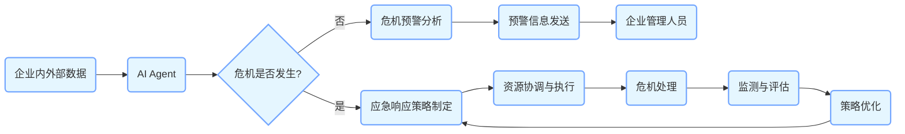

# AI Agent在企业危机预警与应急响应中的关键作用

> 关键词：AI Agent、企业危机预警、应急响应、智能决策、风险管理

> 摘要：本文聚焦于AI Agent在企业危机预警与应急响应中的关键作用。随着企业面临的内外部环境日益复杂多变，危机的出现难以预测且影响巨大。AI Agent凭借其智能化、自动化的特点，能够在危机预警阶段精准捕捉潜在风险信号，在应急响应阶段迅速制定并执行有效的应对策略。文章详细阐述了AI Agent的核心概念、算法原理、数学模型，通过项目实战展示其具体应用，探讨了实际应用场景，推荐了相关工具和资源，最后对其未来发展趋势与挑战进行总结，旨在为企业更好地利用AI Agent提升危机管理能力提供全面的技术参考和指导。

## 1. 背景介绍 
### 1.1 目的和范围
在当今竞争激烈且充满不确定性的商业环境中，企业面临着各种各样的危机，如市场波动、自然灾害、网络攻击、供应链中断等。这些危机一旦爆发，可能会给企业带来巨大的经济损失、声誉损害甚至导致企业倒闭。因此，有效的危机预警与应急响应机制对于企业的生存和发展至关重要。本文的目的是深入探讨AI Agent在企业危机预警与应急响应中的应用，包括其原理、方法、实际案例等，范围涵盖了AI Agent在不同类型企业危机中的作用以及相关技术和管理方面的内容。

### 1.2 预期读者
本文预期读者包括企业的管理人员、风险管理人员、技术人员以及对AI技术在企业管理中应用感兴趣的研究人员和学者。对于企业管理人员，本文可以帮助他们了解如何利用AI Agent提升企业的危机管理能力；对于风险管理人员，提供了一种新的技术手段和方法来进行危机预警和应急响应；对于技术人员，有助于深入理解AI Agent的原理和实现方式；对于研究人员和学者，则可以作为相关领域研究的参考资料。

### 1.3 文档结构概述
本文首先介绍了相关的背景知识，包括目的、预期读者和文档结构。接着阐述了AI Agent的核心概念以及与企业危机预警和应急响应的联系，通过文本示意图和Mermaid流程图进行直观展示。然后详细讲解了AI Agent的核心算法原理和具体操作步骤，并使用Python源代码进行阐述。随后介绍了相关的数学模型和公式，并通过举例进行说明。在项目实战部分，展示了AI Agent在企业危机预警与应急响应中的代码实际案例和详细解释。之后探讨了AI Agent的实际应用场景。再推荐了相关的工具和资源，包括学习资源、开发工具框架和相关论文著作。最后总结了AI Agent的未来发展趋势与挑战，并提供了常见问题与解答以及扩展阅读和参考资料。

### 1.4 术语表
#### 1.4.1 核心术语定义
- **AI Agent（人工智能代理）**：是一种能够感知环境、根据感知信息进行决策并采取行动的智能实体。它可以自主地或在人类的指导下完成特定的任务。
- **企业危机预警**：通过对企业内外部环境信息的监测和分析，提前发现可能导致危机的潜在因素，并发出警报信号的过程。
- **应急响应**：在危机发生后，企业采取的一系列应对措施，旨在减少危机的影响，恢复企业的正常运营。

#### 1.4.2 相关概念解释
- **机器学习**：是一门多领域交叉学科，涉及概率论、统计学、逼近论、凸分析、算法复杂度理论等多门学科。它专门研究计算机怎样模拟或实现人类的学习行为，以获取新的知识或技能，重新组织已有的知识结构使之不断改善自身的性能。在AI Agent中，机器学习算法可以用于对大量的危机相关数据进行分析和预测。
- **自然语言处理**：是计算机科学领域与人工智能领域中的一个重要方向。它研究能实现人与计算机之间用自然语言进行有效通信的各种理论和方法。在企业危机预警与应急响应中，自然语言处理可以用于对新闻、社交媒体等文本信息的分析，提取与危机相关的信息。

#### 1.4.3 缩略词列表
- **AI**：Artificial Intelligence（人工智能）
- **ML**：Machine Learning（机器学习）
- **NLP**：Natural Language Processing（自然语言处理）

## 2. 核心概念与联系 
### 2.1 AI Agent的核心概念
AI Agent是人工智能领域中的一个重要概念，它是一个具有自主性、反应性、社会性和主动性的智能实体。自主性意味着AI Agent能够在没有人类干预的情况下自主地完成任务；反应性表示AI Agent能够感知环境的变化，并及时做出相应的反应；社会性指AI Agent可以与其他Agent或人类进行交互；主动性则体现为AI Agent能够主动地采取行动来实现其目标。

### 2.2 AI Agent与企业危机预警的联系
在企业危机预警中，AI Agent可以通过多种方式发挥作用。它可以收集企业内外部的各种数据，如市场数据、财务数据、社交媒体数据等。然后利用机器学习和数据分析技术对这些数据进行挖掘和分析，识别出潜在的危机信号。例如，AI Agent可以监测市场趋势，如果发现某个关键指标出现异常波动，就可能预示着市场危机的来临。通过实时的监测和分析，AI Agent能够提前发出预警信号，帮助企业及时采取措施应对危机。

### 2.3 AI Agent与企业应急响应的联系
当危机发生后，AI Agent可以在应急响应中发挥重要作用。它可以根据危机的类型和严重程度，迅速制定应对策略。例如，对于网络攻击危机，AI Agent可以自动启动安全防护机制，隔离受攻击的系统，同时分析攻击的来源和手段，为后续的处理提供依据。AI Agent还可以协调企业内部的各个部门，确保应急响应措施的有效执行。通过与其他系统和设备的集成，AI Agent能够实现自动化的应急响应，提高响应速度和效率。

### 2.4 文本示意图
AI Agent在企业危机预警与应急响应中的作用可以用以下文本示意图表示：

AI Agent接收来自企业内外部的各种数据，包括市场数据、财务数据、社交媒体数据等。在危机预警阶段，AI Agent对这些数据进行分析和处理，识别潜在的危机信号，并将预警信息发送给企业的管理人员。在应急响应阶段，AI Agent根据危机的情况制定应对策略，并协调企业内部的资源进行响应。同时，AI Agent还可以对危机的处理过程进行监测和评估，不断优化应对策略。

### 2.5 Mermaid流程图


## 3. 核心算法原理 & 具体操作步骤 
### 3.1 核心算法原理
AI Agent在企业危机预警与应急响应中主要使用机器学习和深度学习算法。以下以决策树算法为例进行详细阐述。

决策树是一种基于树结构进行决策的机器学习算法。它通过对数据的特征进行划分，构建一棵决策树，每个内部节点表示一个特征上的测试，每个分支表示一个测试输出，每个叶节点表示一个类别或值。在企业危机预警中，决策树可以根据不同的特征（如市场数据、财务数据等）来判断是否存在危机风险。

### 3.2 Python源代码实现决策树算法
```python
import pandas as pd
from sklearn.model_selection import train_test_split
from sklearn.tree import DecisionTreeClassifier
from sklearn.metrics import accuracy_score

# 加载数据
data = pd.read_csv('enterprise_crisis_data.csv')

# 划分特征和标签
X = data.drop('crisis_label', axis=1)
y = data['crisis_label']

# 划分训练集和测试集
X_train, X_test, y_train, y_test = train_test_split(X, y, test_size=0.2, random_state=42)

# 创建决策树分类器
clf = DecisionTreeClassifier()

# 训练模型
clf.fit(X_train, y_train)

# 预测
y_pred = clf.predict(X_test)

# 计算准确率
accuracy = accuracy_score(y_test, y_pred)
print(f"模型准确率: {accuracy}")
```

### 3.3 具体操作步骤
1. **数据收集**：收集企业内外部的各种数据，包括市场数据、财务数据、社交媒体数据等。这些数据可以来自不同的数据源，如数据库、文件、API接口等。
2. **数据预处理**：对收集到的数据进行清洗、转换和归一化等处理，以提高数据的质量和可用性。例如，去除缺失值、处理异常值、将文本数据转换为数值数据等。
3. **特征选择**：从预处理后的数据中选择与危机预警和应急响应相关的特征。可以使用特征选择算法（如相关性分析、卡方检验等）来筛选出最重要的特征。
4. **模型训练**：使用选择好的特征和标签数据来训练机器学习模型。可以选择不同的算法，如决策树、支持向量机、神经网络等。
5. **模型评估**：使用测试数据对训练好的模型进行评估，计算模型的准确率、召回率、F1值等指标，以评估模型的性能。
6. **模型优化**：根据模型评估的结果，对模型进行优化。可以调整模型的参数、选择不同的算法或增加数据量等。
7. **部署和应用**：将优化后的模型部署到实际的系统中，用于企业危机预警和应急响应。在实际应用中，不断收集新的数据，对模型进行更新和优化。

## 4. 数学模型和公式 & 详细讲解 & 举例说明 
### 4.1 信息熵
信息熵是衡量数据不确定性的一个指标。在决策树算法中，信息熵用于计算数据集的纯度。信息熵的计算公式为：
$$H(X) = -\sum_{i=1}^{n} p(x_i) \log_2 p(x_i)$$
其中，$X$ 是一个随机变量，$p(x_i)$ 是 $X$ 取值为 $x_i$ 的概率，$n$ 是 $X$ 可能取值的个数。

### 4.2 信息增益
信息增益是决策树算法中用于选择最优特征的一个指标。它表示在使用某个特征进行划分后，数据集的信息熵减少的程度。信息增益的计算公式为：
$$IG(D, A) = H(D) - \sum_{v \in Values(A)} \frac{|D^v|}{|D|} H(D^v)$$
其中，$D$ 是数据集，$A$ 是特征，$Values(A)$ 是特征 $A$ 可能取值的集合，$D^v$ 是数据集 $D$ 中特征 $A$ 取值为 $v$ 的子集，$|D|$ 和 $|D^v|$ 分别表示数据集 $D$ 和子集 $D^v$ 的样本数量。

### 4.3 详细讲解
信息熵反映了数据集的不确定性程度。信息熵越大，数据集的不确定性越高；信息熵越小，数据集的纯度越高。在决策树算法中，我们希望通过选择合适的特征进行划分，使得划分后的子集的信息熵尽可能小，即纯度尽可能高。信息增益则是衡量一个特征对数据集划分效果的指标。信息增益越大，说明使用该特征进行划分后，数据集的纯度提高得越多，该特征就越适合作为划分的依据。

### 4.4 举例说明
假设我们有一个数据集 $D$，包含 10 个样本，其中 6 个样本属于类别 0，4 个样本属于类别 1。则数据集 $D$ 的信息熵为：
$$H(D) = -\frac{6}{10} \log_2 \frac{6}{10} - \frac{4}{10} \log_2 \frac{4}{10} \approx 0.971$$
假设我们有一个特征 $A$，它有两个取值 $v_1$ 和 $v_2$。在特征 $A$ 取值为 $v_1$ 的子集中，有 4 个样本，其中 3 个属于类别 0，1 个属于类别 1；在特征 $A$ 取值为 $v_2$ 的子集中，有 6 个样本，其中 3 个属于类别 0，3 个属于类别 1。则特征 $A$ 的信息增益为：
$$IG(D, A) = H(D) - (\frac{4}{10} H(D^{v_1}) + \frac{6}{10} H(D^{v_2}))$$
其中，
$$H(D^{v_1}) = -\frac{3}{4} \log_2 \frac{3}{4} - \frac{1}{4} \log_2 \frac{1}{4} \approx 0.811$$
$$H(D^{v_2}) = -\frac{3}{6} \log_2 \frac{3}{6} - \frac{3}{6} \log_2 \frac{3}{6} = 1$$
则
$$IG(D, A) = 0.971 - (\frac{4}{10} \times 0.811 + \frac{6}{10} \times 1) \approx 0.137$$

## 5. 项目实战：代码实际案例和详细解释说明 
### 5.1  开发环境搭建
1. **安装Python**：从Python官方网站（https://www.python.org/downloads/）下载并安装Python 3.x版本。
2. **安装必要的库**：使用pip命令安装所需的库，如pandas、scikit-learn等。
```bash
pip install pandas scikit-learn
```
3. **选择开发工具**：可以选择使用PyCharm、Jupyter Notebook等开发工具。

### 5.2  源代码详细实现和代码解读
```python
import pandas as pd
from sklearn.model_selection import train_test_split
from sklearn.tree import DecisionTreeClassifier
from sklearn.metrics import accuracy_score

# 加载数据
data = pd.read_csv('enterprise_crisis_data.csv')

# 代码解读：使用pandas库的read_csv函数读取CSV文件，将数据存储在DataFrame对象中。

# 划分特征和标签
X = data.drop('crisis_label', axis=1)
y = data['crisis_label']

# 代码解读：使用drop函数删除DataFrame中的指定列（这里是'crisis_label'列），得到特征数据X；使用索引操作获取'crisis_label'列，得到标签数据y。

# 划分训练集和测试集
X_train, X_test, y_train, y_test = train_test_split(X, y, test_size=0.2, random_state=42)

# 代码解读：使用train_test_split函数将特征数据X和标签数据y划分为训练集和测试集，测试集占比为20%，random_state参数用于保证每次划分的结果相同。

# 创建决策树分类器
clf = DecisionTreeClassifier()

# 代码解读：创建一个DecisionTreeClassifier对象，用于构建决策树模型。

# 训练模型
clf.fit(X_train, y_train)

# 代码解读：使用fit方法对决策树模型进行训练，传入训练集的特征数据X_train和标签数据y_train。

# 预测
y_pred = clf.predict(X_test)

# 代码解读：使用predict方法对测试集的特征数据X_test进行预测，得到预测结果y_pred。

# 计算准确率
accuracy = accuracy_score(y_test, y_pred)
print(f"模型准确率: {accuracy}")

# 代码解读：使用accuracy_score函数计算预测结果y_pred与真实标签y_test的准确率，并打印输出。
```

### 5.3  代码解读与分析
通过上述代码，我们实现了一个简单的决策树模型用于企业危机预警。首先，我们加载了企业危机相关的数据，然后对数据进行了划分，分为训练集和测试集。接着，我们创建了一个决策树分类器，并使用训练集数据对其进行训练。最后，我们使用测试集数据对训练好的模型进行预测，并计算了预测的准确率。

在实际应用中，我们可以根据需要调整决策树模型的参数，如树的深度、最小样本数等，以提高模型的性能。同时，我们还可以尝试使用其他的机器学习算法，如支持向量机、神经网络等，来构建更复杂的模型。

## 6. 实际应用场景 
### 6.1 市场危机预警
AI Agent可以实时监测市场数据，如股票价格、汇率、利率等。当发现某个关键指标出现异常波动时，AI Agent可以迅速发出预警信号，提醒企业管理人员采取相应的措施。例如，当股票价格大幅下跌时，AI Agent可以分析下跌的原因，如市场趋势、公司业绩等，并提供相应的建议，如调整投资策略、加强市场推广等。

### 6.2 自然灾害应急响应
对于可能受到自然灾害影响的企业，AI Agent可以通过气象数据、地理信息等预测自然灾害的发生概率和影响范围。在自然灾害发生前，AI Agent可以自动启动应急预案，如疏散员工、转移重要物资等。在自然灾害发生后，AI Agent可以协调救援力量，评估损失情况，并提供恢复生产的建议。

### 6.3 网络攻击应急响应
随着企业数字化程度的不断提高，网络攻击成为企业面临的重要危机之一。AI Agent可以实时监测企业的网络安全状况，如入侵检测、恶意软件检测等。当发现网络攻击时，AI Agent可以迅速采取措施，如隔离受攻击的系统、封锁攻击源等。同时，AI Agent还可以分析攻击的手段和目的，为企业的网络安全防护提供改进建议。

### 6.4 供应链中断应急响应
企业的供应链可能会受到各种因素的影响，如供应商破产、运输中断等。AI Agent可以实时监测供应链的运行情况，当发现供应链中断的风险时，AI Agent可以迅速寻找替代供应商，调整生产计划，以减少对企业生产和销售的影响。

## 7. 工具和资源推荐
### 7.1 学习资源推荐
#### 7.1.1 书籍推荐
- 《机器学习》（周志华著）：全面介绍了机器学习的基本概念、算法和应用，是学习机器学习的经典教材。
- 《Python机器学习》（Sebastian Raschka著）：结合Python语言介绍了机器学习的算法和实践，适合初学者。
- 《人工智能：一种现代的方法》（Stuart Russell、Peter Norvig著）：是人工智能领域的经典著作，涵盖了人工智能的各个方面。

#### 7.1.2 在线课程
- Coursera上的“机器学习”课程（Andrew Ng教授主讲）：是全球知名的机器学习课程，内容丰富，讲解详细。
- edX上的“人工智能基础”课程：介绍了人工智能的基本概念、算法和应用。
- 中国大学MOOC上的“Python数据分析与应用”课程：结合Python语言介绍了数据分析的方法和实践。

#### 7.1.3 技术博客和网站
- Medium：是一个技术博客平台，上面有很多关于AI、机器学习等领域的优秀文章。
- Towards Data Science：专注于数据科学和机器学习领域的技术博客，提供了很多实用的教程和案例。
- Kaggle：是一个数据科学竞赛平台，上面有很多数据集和优秀的解决方案，可以学习到很多实战经验。

### 7.2 开发工具框架推荐
#### 7.2.1 IDE和编辑器
- PyCharm：是一款专门为Python开发设计的集成开发环境，功能强大，提供了代码编辑、调试、版本控制等功能。
- Jupyter Notebook：是一个交互式的开发环境，适合进行数据探索和模型开发。
- Visual Studio Code：是一款轻量级的代码编辑器，支持多种编程语言，具有丰富的插件和扩展功能。

#### 7.2.2 调试和性能分析工具
- Py-Spy：是一个Python性能分析工具，可以实时监测Python程序的运行情况，找出性能瓶颈。
- PDB：是Python自带的调试工具，可以对Python程序进行单步调试，查看变量的值和程序的执行流程。
- TensorBoard：是TensorFlow的可视化工具，可以用于可视化模型的训练过程、网络结构等。

#### 7.2.3 相关框架和库
- Scikit-learn：是一个简单易用的机器学习库，提供了各种机器学习算法和工具，如分类、回归、聚类等。
- TensorFlow：是一个开源的深度学习框架，广泛应用于图像识别、自然语言处理等领域。
- PyTorch：是另一个流行的深度学习框架，具有动态计算图的特点，适合进行研究和开发。

### 7.3 相关论文著作推荐
#### 7.3.1 经典论文
- “A Logical Calculus of the Ideas Immanent in Nervous Activity”（Warren S. McCulloch、Walter Pitts著）：是神经网络领域的经典论文，提出了神经元模型。
- “Learning Representations by Back-propagating Errors”（David E. Rumelhart、Geoffrey E. Hinton、Ronald J. Williams著）：介绍了反向传播算法，是深度学习领域的重要基础。
- “Random Forests”（Leo Breiman著）：提出了随机森林算法，是一种强大的机器学习算法。

#### 7.3.2 最新研究成果
- 可以关注顶级学术会议如NeurIPS、ICML、CVPR等的论文，了解AI Agent在企业危机预警与应急响应领域的最新研究成果。
- 查阅相关学术期刊如Journal of Artificial Intelligence Research、Artificial Intelligence等的文章。

#### 7.3.3 应用案例分析
- 可以参考一些企业的案例研究报告，了解AI Agent在实际企业危机预警与应急响应中的应用效果和经验教训。
- 关注行业咨询公司的研究报告，如Gartner、Forrester等，获取行业最新动态和应用案例。

## 8. 总结：未来发展趋势与挑战
### 8.1 未来发展趋势
- **更加智能化**：未来的AI Agent将具备更强的智能水平，能够更好地理解和处理复杂的企业危机场景。例如，能够进行更深入的数据分析和推理，提供更准确的预警和决策建议。
- **与其他技术融合**：AI Agent将与物联网、区块链、大数据等技术深度融合，实现更全面、更高效的企业危机管理。例如，通过物联网设备实时获取企业的运行数据，结合区块链技术保证数据的安全性和可信度。
- **个性化定制**：根据不同企业的特点和需求，为企业提供个性化的AI Agent解决方案。例如，针对不同行业的企业，定制不同的危机预警和应急响应策略。

### 8.2 挑战
- **数据质量和安全**：AI Agent的性能依赖于大量高质量的数据。然而，数据的收集、存储和管理过程中可能存在数据质量不高、数据泄露等问题。因此，如何保证数据的质量和安全是一个重要的挑战。
- **算法可解释性**：一些复杂的机器学习和深度学习算法，如神经网络，往往具有较高的准确率，但缺乏可解释性。在企业危机预警与应急响应中，决策需要有合理的解释和依据。因此，如何提高算法的可解释性是一个亟待解决的问题。
- **伦理和法律问题**：AI Agent的应用可能会带来一些伦理和法律问题，如隐私保护、责任界定等。例如，当AI Agent的决策导致企业损失时，责任应该由谁承担。因此，需要建立相应的伦理和法律规范来规范AI Agent的应用。

## 9. 附录：常见问题与解答
### 9.1 如何选择适合企业的AI Agent算法？
选择适合企业的AI Agent算法需要考虑多个因素，如数据的类型和规模、问题的复杂度、计算资源等。一般来说，可以先对数据进行分析和预处理，然后尝试使用不同的算法进行实验，比较它们的性能和效果。同时，也可以参考相关的研究和实践经验，选择在类似场景下表现较好的算法。

### 9.2 AI Agent在企业危机预警与应急响应中的应用成本高吗？
AI Agent的应用成本包括硬件成本、软件成本、人力成本等。硬件成本主要是服务器、存储设备等的购买和维护费用；软件成本包括AI开发工具、算法库等的使用费用；人力成本则是开发和维护AI Agent的人员费用。具体的成本取决于企业的规模和需求。对于一些小型企业，可以选择使用云服务来降低硬件成本；对于一些简单的应用场景，可以使用开源的算法库和工具来降低软件成本。

### 9.3 如何保证AI Agent的决策准确性？
保证AI Agent的决策准确性需要从多个方面入手。首先，要保证数据的质量，包括数据的准确性、完整性和一致性。其次，要选择合适的算法，并对算法进行优化和调整。此外，还可以采用多模型融合的方法，综合多个模型的结果来提高决策的准确性。最后，要对AI Agent的决策结果进行评估和验证，及时发现和纠正错误。

## 10. 扩展阅读 & 参考资料
### 10.1 扩展阅读
- 《AI 3.0》（梅拉妮·米歇尔著）：探讨了人工智能的发展现状和未来趋势，对理解AI Agent的发展有一定的帮助。
- 《智能时代》（吴军著）：介绍了智能技术在各个领域的应用，包括企业管理领域。

### 10.2 参考资料
- 相关学术论文和研究报告
- 企业的案例研究和实践经验
- 行业标准和规范