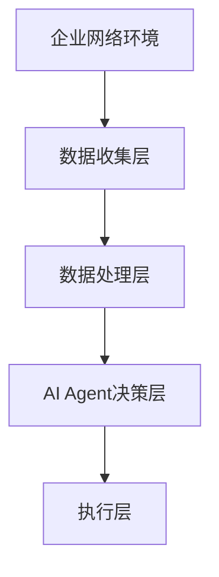

# AI Agent在企业网络安全态势感知与主动防御中的应用

> 关键词：AI Agent、企业网络安全、态势感知、主动防御、网络安全技术

> 摘要：本文深入探讨了AI Agent在企业网络安全态势感知与主动防御中的应用。首先介绍了相关背景，包括研究目的、预期读者等内容。接着阐述了AI Agent、网络安全态势感知和主动防御的核心概念及它们之间的联系，通过文本示意图和Mermaid流程图进行了清晰展示。详细讲解了AI Agent相关的核心算法原理，并给出Python源代码示例。还介绍了相关的数学模型和公式，并举例说明。通过项目实战，展示了代码实际案例及详细解释。分析了AI Agent在企业网络安全中的实际应用场景。推荐了相关的学习资源、开发工具框架以及论文著作。最后总结了未来发展趋势与挑战，提供了常见问题解答和扩展阅读参考资料，旨在为企业网络安全领域的从业者和研究者提供全面且深入的技术参考。

## 1. 背景介绍 
### 1.1 目的和范围
随着信息技术的飞速发展，企业的数字化程度越来越高，网络安全问题也日益严峻。企业面临着来自外部黑客攻击、内部数据泄露等多种安全威胁。传统的网络安全防护手段往往是被动防御，难以应对日益复杂多变的安全威胁。本文章的目的在于探讨如何利用AI Agent技术提升企业网络安全态势感知与主动防御能力。范围涵盖了AI Agent的基本概念、相关算法原理、在企业网络安全中的应用场景、实际案例分析以及未来发展趋势等方面。

### 1.2 预期读者
本文预期读者包括企业网络安全管理人员、网络安全工程师、对网络安全技术感兴趣的研究人员、相关专业的学生等。对于那些希望了解如何利用先进技术提升企业网络安全防护水平的人员具有较高的参考价值。

### 1.3 文档结构概述
本文首先介绍背景信息，让读者对研究的目的和范围有清晰的认识。接着阐述核心概念及它们之间的联系，帮助读者建立基本的知识框架。通过详细讲解核心算法原理和数学模型，让读者深入了解技术的内在机制。项目实战部分展示实际代码案例和分析，使读者能够将理论知识应用到实际中。介绍实际应用场景，让读者了解技术的具体应用方向。推荐相关的工具和资源，方便读者进一步学习和研究。最后总结未来发展趋势与挑战，解答常见问题，并提供扩展阅读和参考资料。

### 1.4 术语表
#### 1.4.1 核心术语定义
- **AI Agent（人工智能代理）**：是一种能够感知环境、自主决策并采取行动以实现特定目标的人工智能实体。它可以根据环境的变化动态调整自己的行为。
- **网络安全态势感知**：指通过对网络中的各种安全相关信息进行收集、分析和评估，从而全面、准确地了解网络的安全状态，并预测未来可能的安全威胁。
- **主动防御**：与传统的被动防御不同，主动防御是一种积极主动的安全防护策略，它能够在攻击发生之前或过程中采取措施，阻止或减轻攻击的影响。

#### 1.4.2 相关概念解释
- **威胁情报**：关于潜在安全威胁的信息，包括攻击者的身份、攻击手段、攻击目标等。威胁情报可以帮助企业提前做好防范措施。
- **安全漏洞**：指系统或软件中存在的缺陷或弱点，攻击者可以利用这些漏洞来入侵系统或获取敏感信息。
- **入侵检测**：通过对网络中的活动进行监测和分析，发现潜在的入侵行为，并及时发出警报。

#### 1.4.3 缩略词列表
- **IDS**：Intrusion Detection System，入侵检测系统
- **IPS**：Intrusion Prevention System，入侵防御系统
- **SIEM**：Security Information and Event Management，安全信息和事件管理

## 2. 核心概念与联系 

### 核心概念原理
#### AI Agent
AI Agent是基于人工智能技术的自主实体，它通常由感知模块、决策模块和执行模块组成。感知模块负责收集环境信息，决策模块根据收集到的信息进行分析和决策，执行模块根据决策结果采取相应的行动。例如，在网络安全领域，AI Agent可以感知网络中的流量信息、系统日志等，通过分析这些信息判断是否存在安全威胁，并采取相应的防御措施。

#### 网络安全态势感知
网络安全态势感知的核心原理是通过收集网络中的各种数据，包括网络流量、系统日志、安全设备告警等，然后对这些数据进行关联分析、数据挖掘和机器学习等处理，从而全面了解网络的安全状态。它不仅要了解当前的安全状况，还要预测未来可能的安全威胁。

#### 主动防御
主动防御的原理是通过对潜在的安全威胁进行实时监测和分析，在攻击发生之前或过程中采取主动措施，如阻断网络连接、修改系统配置、更新安全策略等，以阻止或减轻攻击的影响。

### 架构的文本示意图
```plaintext
                 +---------------------+
                 | 企业网络环境        |
                 +---------------------+
                          |
                          v
         +--------------------------------+
         | 数据收集层（网络流量、日志等） |
         +--------------------------------+
                          |
                          v
         +--------------------------------+
         | 数据处理层（清洗、关联分析等） |
         +--------------------------------+
                          |
                          v
         +--------------------------------+
         | AI Agent决策层（威胁判断、决策）|
         +--------------------------------+
                          |
                          v
         +--------------------------------+
         | 执行层（主动防御措施）          |
         +--------------------------------+
```

### Mermaid流程图


## 3. 核心算法原理 & 具体操作步骤 

### 核心算法原理 - 基于机器学习的异常检测算法
在企业网络安全态势感知中，异常检测是非常重要的一环。我们可以使用基于机器学习的异常检测算法，如孤立森林（Isolation Forest）算法。

孤立森林算法的基本思想是：异常数据点在数据集中是稀疏的，因此更容易被孤立出来。该算法通过构建多个随机二叉树，将数据点划分到不同的叶子节点。异常数据点通常会更快地到达叶子节点，因此其路径长度会更短。

### Python源代码实现
```python
import numpy as np
from sklearn.ensemble import IsolationForest

# 生成示例数据
np.random.seed(42)
X_inliers = 0.3 * np.random.randn(100, 2)
X_inliers = np.r_[X_inliers + 2, X_inliers - 2]
X_outliers = np.random.uniform(low=-4, high=4, size=(20, 2))
X = np.r_[X_inliers, X_outliers]

# 训练孤立森林模型
clf = IsolationForest(contamination=0.1)
clf.fit(X)

# 预测异常数据点
y_pred = clf.predict(X)

# 输出预测结果
for i in range(len(X)):
    if y_pred[i] == -1:
        print(f"数据点 {X[i]} 被判定为异常数据点")
```

### 具体操作步骤
1. **数据收集**：收集企业网络中的各种数据，如网络流量数据、系统日志数据等。
2. **数据预处理**：对收集到的数据进行清洗、归一化等处理，以便后续的机器学习算法能够更好地处理。
3. **模型训练**：使用预处理后的数据训练孤立森林模型。
4. **异常检测**：使用训练好的模型对新的数据进行异常检测，判断是否存在异常行为。
5. **决策与响应**：根据异常检测的结果，AI Agent进行决策，并采取相应的主动防御措施。

## 4. 数学模型和公式 & 详细讲解 & 举例说明 

### 孤立森林算法的数学模型和公式
孤立森林算法的核心是构建随机二叉树。设数据集为 $X = \{x_1, x_2, \cdots, x_n\}$，在构建随机二叉树时，每次随机选择一个特征 $f$ 和一个分割点 $p$，将数据集划分为两部分。

设 $h(x)$ 表示数据点 $x$ 在随机二叉树中的路径长度。异常数据点的 $h(x)$ 通常较短。为了计算异常分数，我们需要对 $h(x)$ 进行标准化处理。

异常分数 $s(x, n)$ 的计算公式为：
$$s(x, n) = 2^{-\frac{E(h(x))}{c(n)}}$$
其中，$E(h(x))$ 是数据点 $x$ 在所有随机二叉树中的平均路径长度，$c(n)$ 是一个与数据集大小 $n$ 有关的常数，其计算公式为：
$$c(n) = 2H(n - 1) - \frac{2(n - 1)}{n}$$
其中，$H(i)$ 是调和级数，$H(i) = \sum_{k = 1}^{i}\frac{1}{k}$。

### 详细讲解
异常分数 $s(x, n)$ 的取值范围是 $[0, 1]$。当 $s(x, n)$ 接近 1 时，数据点 $x$ 越可能是异常数据点；当 $s(x, n)$ 接近 0 时，数据点 $x$ 越可能是正常数据点。

### 举例说明
假设我们有一个数据集 $X$，包含 100 个数据点。我们使用孤立森林算法对其进行异常检测。经过计算，某个数据点 $x$ 的平均路径长度 $E(h(x)) = 3$，数据集大小 $n = 100$。

首先计算 $c(n)$：
$$H(99) = \sum_{k = 1}^{99}\frac{1}{k} \approx 5.187377517639621$$
$$c(100) = 2H(99) - \frac{2\times99}{100} \approx 2\times5.187377517639621 - 1.98 \approx 8.394755035279242 - 1.98 \approx 6.414755035279242$$

然后计算异常分数 $s(x, 100)$：
$$s(x, 100) = 2^{-\frac{3}{6.414755035279242}} \approx 2^{-0.4677} \approx 0.72$$

由于异常分数 $s(x, 100) \approx 0.72$ 比较接近 1，因此可以判断数据点 $x$ 是一个异常数据点。

## 5. 项目实战：代码实际案例和详细解释说明 

### 5.1  开发环境搭建
- **操作系统**：推荐使用 Linux 系统，如 Ubuntu 18.04 或更高版本。
- **Python 版本**：Python 3.7 或更高版本。
- **依赖库安装**：使用以下命令安装所需的依赖库：
```bash
pip install numpy scikit-learn pandas
```

### 5.2  源代码详细实现和代码解读
```python
import numpy as np
import pandas as pd
from sklearn.ensemble import IsolationForest

# 读取网络流量数据
def read_network_traffic_data(file_path):
    data = pd.read_csv(file_path)
    return data

# 数据预处理
def preprocess_data(data):
    # 去除缺失值
    data = data.dropna()
    # 选择需要的特征
    features = data[['src_ip', 'dst_ip', 'src_port', 'dst_port', 'bytes_sent', 'bytes_received']]
    # 对特征进行编码
    features = pd.get_dummies(features)
    return features

# 训练孤立森林模型
def train_isolation_forest_model(features):
    clf = IsolationForest(contamination=0.1)
    clf.fit(features)
    return clf

# 异常检测
def detect_anomalies(clf, features):
    y_pred = clf.predict(features)
    anomalies = features[y_pred == -1]
    return anomalies

# 主函数
def main():
    file_path = 'network_traffic.csv'
    data = read_network_traffic_data(file_path)
    features = preprocess_data(data)
    clf = train_isolation_forest_model(features)
    anomalies = detect_anomalies(clf, features)
    print("检测到的异常数据点：")
    print(anomalies)

if __name__ == "__main__":
    main()
```

### 5.3  代码解读与分析
- **read_network_traffic_data 函数**：该函数用于读取网络流量数据，使用 `pandas` 库的 `read_csv` 函数读取 CSV 文件。
- **preprocess_data 函数**：该函数对读取的数据进行预处理，包括去除缺失值、选择需要的特征和对特征进行编码。
- **train_isolation_forest_model 函数**：该函数使用预处理后的数据训练孤立森林模型，设置异常数据的比例为 0.1。
- **detect_anomalies 函数**：该函数使用训练好的模型对数据进行异常检测，返回检测到的异常数据点。
- **main 函数**：该函数是程序的入口，调用上述函数完成数据读取、预处理、模型训练和异常检测的整个流程，并输出检测到的异常数据点。

## 6. 实际应用场景 
### 网络入侵检测
AI Agent 可以实时监测企业网络中的流量，通过分析流量模式和行为特征，及时发现潜在的入侵行为。例如，检测到异常的端口扫描、暴力破解等行为时，AI Agent 可以自动采取阻断网络连接、通知安全管理员等措施。

### 数据泄露防护
AI Agent 可以对企业内部的数据进行监控，识别敏感数据的流动和访问行为。当发现异常的数据访问或传输时，如未经授权的文件下载、数据外传等，AI Agent 可以立即采取措施，如限制访问权限、加密数据等，防止数据泄露。

### 恶意软件检测
AI Agent 可以分析系统中的文件和进程，检测是否存在恶意软件。通过对文件的特征、行为模式等进行分析，AI Agent 可以识别出病毒、木马、勒索软件等恶意软件，并及时进行清除或隔离。

### 安全策略优化
AI Agent 可以根据网络安全态势感知的结果，自动调整企业的安全策略。例如，当发现某个区域的网络攻击频繁时，AI Agent 可以自动加强该区域的访问控制策略，提高网络的安全性。

## 7. 工具和资源推荐
### 7.1 学习资源推荐
#### 7.1.1 书籍推荐
- 《Python 机器学习》：介绍了 Python 中常用的机器学习算法和库，对于学习基于机器学习的网络安全技术有很大帮助。
- 《网络安全技术与实践》：全面介绍了网络安全的基本概念、技术和实践方法，是网络安全领域的经典教材。
- 《人工智能：一种现代的方法》：系统地介绍了人工智能的基本原理、算法和应用，对于理解 AI Agent 的原理和实现有重要参考价值。

#### 7.1.2 在线课程
- Coursera 上的“机器学习”课程：由斯坦福大学教授 Andrew Ng 授课，是学习机器学习的经典课程。
- edX 上的“网络安全基础”课程：介绍了网络安全的基本概念、技术和实践，适合初学者学习。
- Udemy 上的“Python 网络安全编程”课程：通过实际项目介绍如何使用 Python 进行网络安全编程。

#### 7.1.3 技术博客和网站
- 安全客（https://www.anquanke.com/）：提供了丰富的网络安全技术文章和案例分析。
- 嘶吼网（https://www.4hou.com/）：专注于网络安全领域的资讯和技术分享。
- Medium 上的网络安全相关博客：有很多专业的网络安全专家分享他们的经验和见解。

### 7.2 开发工具框架推荐
#### 7.2.1 IDE和编辑器
- PyCharm：是一款专业的 Python 集成开发环境，提供了丰富的功能和插件，方便开发和调试 Python 代码。
- Visual Studio Code：是一款轻量级的代码编辑器，支持多种编程语言，具有丰富的插件生态系统。

#### 7.2.2 调试和性能分析工具
- pdb：Python 自带的调试工具，可以帮助开发者调试 Python 代码。
- cProfile：Python 自带的性能分析工具，可以分析代码的性能瓶颈。

#### 7.2.3 相关框架和库
- scikit-learn：是 Python 中常用的机器学习库，提供了丰富的机器学习算法和工具。
- Pandas：是 Python 中用于数据处理和分析的库，方便对网络流量数据等进行处理。
- TensorFlow：是一个开源的机器学习框架，可用于构建和训练深度学习模型。

### 7.3 相关论文著作推荐
#### 7.3.1 经典论文
- “Isolation Forest”：介绍了孤立森林算法的原理和实现，是异常检测领域的经典论文。
- “A Survey of Intrusion Detection Techniques”：对入侵检测技术进行了全面的综述，是入侵检测领域的重要参考文献。

#### 7.3.2 最新研究成果
- 可以通过 IEEE Xplore、ACM Digital Library 等学术数据库查找关于 AI Agent 在网络安全领域的最新研究成果。

#### 7.3.3 应用案例分析
- 可以参考一些企业的网络安全报告和案例分析，了解 AI Agent 在实际企业网络安全中的应用效果和经验教训。

## 8. 总结：未来发展趋势与挑战
### 未来发展趋势
- **智能化程度不断提高**：AI Agent 将不断学习和进化，能够更加准确地感知网络安全态势，做出更加智能的决策。
- **与其他技术深度融合**：AI Agent 将与区块链、物联网等技术深度融合，为企业网络安全提供更加全面的防护。
- **自动化程度提升**：未来的 AI Agent 将能够自动完成更多的安全防护任务，减少人工干预，提高企业网络安全的响应速度和效率。

### 挑战
- **数据隐私和安全问题**：AI Agent 需要处理大量的企业网络数据，如何保证数据的隐私和安全是一个重要的挑战。
- **算法的可解释性**：一些复杂的机器学习算法和深度学习算法的可解释性较差，当 AI Agent 做出决策时，难以解释其决策的依据，这给安全管理员带来了一定的困扰。
- **对抗性攻击**：攻击者可能会针对 AI Agent 进行对抗性攻击，试图欺骗 AI Agent 做出错误的决策，如何提高 AI Agent 的抗攻击能力是一个亟待解决的问题。

## 9. 附录：常见问题与解答
### 问题 1：AI Agent 在企业网络安全中是否能够完全替代人工？
解答：不能。虽然 AI Agent 可以自动完成很多安全防护任务，但在一些复杂的情况下，如涉及到企业的业务策略、法律合规等问题，仍然需要人工进行决策和处理。AI Agent 可以作为人工的辅助工具，提高企业网络安全的效率和准确性。

### 问题 2：如何选择适合企业的 AI Agent 技术？
解答：需要考虑企业的网络规模、安全需求、技术实力等因素。可以先对市场上的 AI Agent 技术进行调研和评估，选择那些功能强大、性能稳定、易于集成的技术。同时，可以进行小规模的试点应用，验证技术的可行性和有效性。

### 问题 3：AI Agent 技术的实施成本高吗？
解答：AI Agent 技术的实施成本包括硬件设备、软件授权、人员培训等方面。具体成本因企业的需求和规模而异。一般来说，随着技术的不断发展和普及，AI Agent 技术的实施成本会逐渐降低。

## 10. 扩展阅读 & 参考资料
### 扩展阅读
- 《人工智能时代的网络安全》
- 《网络空间安全概论》

### 参考资料
- 相关的学术论文和研究报告
- 企业的网络安全白皮书和案例分析
- 网络安全领域的技术博客和论坛