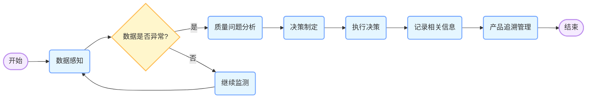

# AI Agent在企业质量控制与产品追溯中的应用

> 关键词：AI Agent、企业质量控制、产品追溯、自动化、数据驱动

> 摘要：本文深入探讨了AI Agent在企业质量控制与产品追溯中的应用。首先介绍了相关背景，包括目的范围、预期读者等内容。接着阐述了AI Agent的核心概念及与质量控制、产品追溯的联系，通过文本示意图和Mermaid流程图清晰展示其架构。详细讲解了AI Agent的核心算法原理，用Python代码进行具体说明，同时给出了相关数学模型和公式并举例。通过项目实战，从开发环境搭建到源代码实现及解读，展示了AI Agent在实际中的应用。还介绍了其实际应用场景，推荐了学习资源、开发工具框架和相关论文著作。最后总结了未来发展趋势与挑战，给出常见问题解答及扩展阅读参考资料，旨在为企业在质量控制和产品追溯中更好地应用AI Agent提供全面的技术指导。

## 1. 背景介绍 
### 1.1 目的和范围
在当今竞争激烈的市场环境中，企业对于产品质量的把控和产品追溯能力的要求越来越高。高质量的产品不仅能提升企业的市场竞争力，还能增强消费者的信任度。产品追溯则有助于企业在出现质量问题时快速定位问题源头，减少损失并改进生产流程。

本文的目的在于深入探讨AI Agent在企业质量控制与产品追溯中的应用，涵盖从AI Agent的基本概念、算法原理到实际项目应用的各个方面。通过详细的分析和案例展示，为企业提供全面的技术参考，帮助企业更好地利用AI Agent提升质量控制水平和产品追溯能力。

### 1.2 预期读者
本文的预期读者包括企业的质量管理人员、生产管理人员、技术研发人员以及对AI Agent在工业领域应用感兴趣的研究人员和学生。质量管理人员可以从中了解如何借助AI Agent优化质量控制流程，提高产品质量；生产管理人员可以学习如何利用AI Agent实现产品的有效追溯，提升生产管理效率；技术研发人员可以深入研究AI Agent的算法原理和实现细节，为进一步的技术创新提供思路；研究人员和学生则可以通过本文对AI Agent在企业质量控制与产品追溯中的应用有一个系统的认识，为相关领域的研究和学习奠定基础。

### 1.3 文档结构概述
本文将按照以下结构进行阐述：首先介绍背景信息，包括目的范围、预期读者等；接着讲解AI Agent的核心概念及与质量控制、产品追溯的联系，通过文本示意图和Mermaid流程图进行清晰展示；然后详细阐述AI Agent的核心算法原理，用Python代码进行具体说明，并给出相关数学模型和公式及举例；通过项目实战，从开发环境搭建到源代码实现及解读，展示AI Agent在实际中的应用；介绍其实际应用场景；推荐学习资源、开发工具框架和相关论文著作；最后总结未来发展趋势与挑战，给出常见问题解答及扩展阅读参考资料。

### 1.4 术语表
#### 1.4.1 核心术语定义
- **AI Agent（人工智能智能体）**：是一种能够感知环境、基于感知信息进行决策并采取行动以实现特定目标的人工智能实体。它可以自主地与环境进行交互，通过学习和适应不断优化自身的行为。
- **企业质量控制**：是指企业为了确保产品或服务符合规定的质量标准而采取的一系列活动和措施，包括质量策划、质量保证和质量改进等。
- **产品追溯**：是指通过记录和管理产品的相关信息，实现对产品从原材料采购、生产加工、销售到使用的全过程进行追踪和溯源的能力。

#### 1.4.2 相关概念解释
- **自动化**：是指在生产过程中，利用各种技术和设备，使生产过程自动进行，减少人工干预，提高生产效率和质量稳定性。
- **数据驱动**：是指决策和行动基于大量的数据和分析结果，通过对数据的挖掘和分析，发现潜在的问题和规律，从而做出更加科学合理的决策。

#### 1.4.3 缩略词列表
- **AI**：Artificial Intelligence（人工智能）
- **ML**：Machine Learning（机器学习）
- **DL**：Deep Learning（深度学习）

## 2. 核心概念与联系 

### 核心概念原理
AI Agent的核心原理基于人工智能技术，它通过传感器或接口感知环境信息，将这些信息输入到智能决策模块。智能决策模块可以基于规则、机器学习或深度学习算法对感知信息进行处理和分析，生成相应的决策。然后，AI Agent通过执行器将决策转化为具体的行动，作用于环境。在这个过程中，AI Agent会不断地感知环境反馈，对决策进行调整和优化，以实现预定的目标。

在企业质量控制中，AI Agent可以实时监测生产过程中的各种数据，如设备运行参数、产品质量指标等。当监测到异常数据时，AI Agent可以根据预设的规则或学习到的模式进行分析，判断是否存在质量问题，并及时采取相应的措施，如调整生产参数、发出警报等。

在产品追溯中，AI Agent可以在产品的整个生命周期中记录和管理相关信息，包括原材料来源、生产工艺、生产时间、检验结果等。当需要进行产品追溯时，AI Agent可以根据这些信息快速定位产品的历史记录，为问题的解决和质量改进提供依据。

### 架构的文本示意图
AI Agent在企业质量控制与产品追溯中的架构可以分为以下几个层次：
1. **数据感知层**：负责收集生产过程中的各种数据，包括传感器数据、设备运行数据、质量检验数据等。这些数据可以来自于生产线上的各种设备和系统，如PLC（可编程逻辑控制器）、传感器网络、质量检测仪器等。
2. **数据传输层**：将数据感知层收集到的数据传输到数据处理层。可以采用有线或无线通信技术，如以太网、Wi-Fi、蓝牙等。
3. **数据处理层**：对传输过来的数据进行清洗、预处理和分析。可以采用数据挖掘、机器学习、深度学习等技术，提取有价值的信息和知识。
4. **决策执行层**：根据数据处理层的分析结果，AI Agent做出相应的决策，并通过执行器执行这些决策。执行器可以是生产设备的控制系统、报警装置等。
5. **信息管理与追溯层**：负责管理和存储产品的相关信息，建立产品追溯数据库。当需要进行产品追溯时，可以从数据库中查询和获取相关信息。

### Mermaid流程图


## 3. 核心算法原理 & 具体操作步骤 

### 核心算法原理
在AI Agent的应用中，机器学习和深度学习算法起着关键的作用。以异常检测为例，我们可以使用基于机器学习的孤立森林算法来检测生产过程中的异常数据。

孤立森林算法是一种无监督学习算法，它通过构建多棵决策树来对数据进行划分。在构建决策树的过程中，异常数据往往会更快地被划分到叶子节点，因此可以根据数据在决策树中的路径长度来判断其是否为异常数据。

### 具体操作步骤
1. **数据收集**：收集生产过程中的相关数据，如设备运行参数、产品质量指标等。
2. **数据预处理**：对收集到的数据进行清洗、归一化等预处理操作，以提高算法的性能。
3. **模型训练**：使用预处理后的数据训练孤立森林模型。
4. **异常检测**：将新的数据输入到训练好的模型中，根据模型的输出判断数据是否异常。
5. **决策与执行**：如果检测到异常数据，AI Agent根据预设的规则或学习到的模式进行决策，并执行相应的措施。

### Python源代码详细阐述
```python
import numpy as np
from sklearn.ensemble import IsolationForest

# 生成示例数据
np.random.seed(42)
normal_data = np.random.randn(100, 2)  # 正常数据
anomaly_data = np.random.randn(10, 2) + 5  # 异常数据
data = np.vstack((normal_data, anomaly_data))

# 训练孤立森林模型
clf = IsolationForest(contamination=0.1)
clf.fit(data)

# 进行异常检测
predictions = clf.predict(data)

# 输出检测结果
for i in range(len(data)):
    if predictions[i] == -1:
        print(f"数据点 {data[i]} 是异常数据")
    else:
        print(f"数据点 {data[i]} 是正常数据")
```
在上述代码中，我们首先生成了示例数据，包括正常数据和异常数据。然后使用`IsolationForest`类训练了一个孤立森林模型，并将数据输入到模型中进行异常检测。最后根据模型的输出判断每个数据点是否为异常数据。

## 4. 数学模型和公式 & 详细讲解 & 举例说明 

### 数学模型和公式
在孤立森林算法中，主要的数学模型基于决策树的构建和路径长度的计算。

设数据集 $X = \{x_1, x_2, \cdots, x_n\}$，其中 $x_i \in \mathbb{R}^d$ 表示第 $i$ 个数据点，$d$ 表示数据的维度。

孤立森林算法通过构建多棵决策树来对数据进行划分。对于每棵决策树，随机选择一个特征 $f$ 和一个划分点 $p$，将数据集划分为两个子集：
$$
X_1 = \{x_i \in X | x_{i,f} < p\} \\
X_2 = \{x_i \in X | x_{i,f} \geq p\}
$$
其中 $x_{i,f}$ 表示数据点 $x_i$ 在特征 $f$ 上的值。

重复上述过程，直到每个子集只包含一个数据点或达到预设的树深度。

对于一个数据点 $x$，其在决策树中的路径长度 $h(x)$ 定义为从根节点到包含该数据点的叶子节点的路径上的边数。

异常分数 $s(x)$ 可以通过以下公式计算：
$$
s(x) = 2^{-\frac{E(h(x))}{c(n)}}
$$
其中 $E(h(x))$ 表示数据点 $x$ 在所有决策树中的平均路径长度，$c(n)$ 是一个与数据集大小 $n$ 相关的函数，定义为：
$$
c(n) = 2H(n - 1) - \frac{2(n - 1)}{n}
$$
其中 $H(n)$ 是调和数，$H(n) = \sum_{i = 1}^{n} \frac{1}{i}$。

### 详细讲解
异常分数 $s(x)$ 的取值范围在 $[0, 1]$ 之间。当 $s(x)$ 接近 1 时，表示数据点 $x$ 是异常数据；当 $s(x)$ 接近 0 时，表示数据点 $x$ 是正常数据。

在孤立森林算法中，异常数据往往会更快地被划分到叶子节点，因此其路径长度较短，异常分数较高。

### 举例说明
假设我们有一个数据集 $X = \{x_1, x_2, x_3, x_4\}$，其中 $x_1 = [1, 2]$，$x_2 = [2, 3]$，$x_3 = [10, 11]$，$x_4 = [11, 12]$。

我们构建一棵决策树，随机选择特征 $f = 0$ 和划分点 $p = 5$，将数据集划分为两个子集：
$$
X_1 = \{x_1, x_2\} \\
X_2 = \{x_3, x_4\}
$$
对于数据点 $x_3$ 和 $x_4$，它们在这棵决策树中的路径长度较短，因此异常分数较高，可能被判断为异常数据。

## 5. 项目实战：代码实际案例和详细解释说明 

### 5.1  开发环境搭建
- **操作系统**：推荐使用Linux或Windows操作系统。
- **编程语言**：Python 3.x
- **开发工具**：推荐使用PyCharm或Jupyter Notebook。
- **相关库**：安装`numpy`、`pandas`、`scikit-learn`等库，可以使用以下命令进行安装：
```sh
pip install numpy pandas scikit-learn
```

### 5.2  源代码详细实现和代码解读
```python
import numpy as np
import pandas as pd
from sklearn.ensemble import IsolationForest

# 读取数据
data = pd.read_csv('production_data.csv')

# 数据预处理
# 假设数据集中有多个特征列，最后一列为标签列
X = data.iloc[:, :-1].values
y = data.iloc[:, -1].values

# 训练孤立森林模型
clf = IsolationForest(contamination=0.1)
clf.fit(X)

# 进行异常检测
predictions = clf.predict(X)

# 输出检测结果
for i in range(len(X)):
    if predictions[i] == -1:
        print(f"数据点 {X[i]} 是异常数据，真实标签为 {y[i]}")
    else:
        print(f"数据点 {X[i]} 是正常数据，真实标签为 {y[i]}")
```
### 代码解读与分析
1. **数据读取**：使用`pandas`库的`read_csv`函数读取生产数据文件`production_data.csv`。
2. **数据预处理**：将数据集中的特征列和标签列分离，分别存储在`X`和`y`中。
3. **模型训练**：使用`IsolationForest`类训练孤立森林模型，设置异常数据的比例为 0.1。
4. **异常检测**：将数据输入到训练好的模型中进行异常检测，得到预测结果`predictions`。
5. **结果输出**：根据预测结果判断每个数据点是否为异常数据，并输出其真实标签。

通过这个项目实战，我们可以看到如何使用AI Agent的异常检测算法对生产数据进行分析，及时发现异常数据，为企业质量控制提供支持。

## 6. 实际应用场景 
### 生产过程质量控制
在制造业中，AI Agent可以实时监测生产设备的运行状态和产品质量指标。例如，在汽车制造过程中，AI Agent可以监测发动机的各项参数，如温度、压力、转速等。当监测到异常数据时，AI Agent可以及时发出警报，并调整生产参数，避免产品出现质量问题。

### 供应链管理与产品追溯
在供应链管理中，AI Agent可以跟踪产品的物流信息和原材料来源。例如，在食品行业中，AI Agent可以记录食品的原材料采购、加工、运输等环节的信息。当出现食品安全问题时，AI Agent可以快速追溯到问题产品的源头，采取相应的措施，保障消费者的健康。

### 质量改进与优化
AI Agent可以对生产过程中的数据进行分析，发现潜在的质量问题和改进机会。例如，通过对产品质量数据的分析，AI Agent可以找出影响产品质量的关键因素，并提出相应的改进建议。企业可以根据这些建议对生产工艺进行优化，提高产品质量和生产效率。

## 7. 工具和资源推荐
### 7.1 学习资源推荐
#### 7.1.1 书籍推荐
- 《Python机器学习》：详细介绍了Python在机器学习中的应用，包括各种机器学习算法的原理和实现。
- 《深度学习》：由深度学习领域的三位顶级专家撰写，系统地介绍了深度学习的基本原理、算法和应用。
- 《人工智能：一种现代的方法》：全面介绍了人工智能的各个领域，包括搜索算法、知识表示、机器学习、自然语言处理等。

#### 7.1.2 在线课程
- Coursera上的“机器学习”课程：由Andrew Ng教授授课，是机器学习领域的经典课程。
- edX上的“深度学习”课程：提供了深度学习的系统学习资源。
- 中国大学MOOC上的“人工智能基础”课程：适合初学者了解人工智能的基本概念和方法。

#### 7.1.3 技术博客和网站
- Medium：上面有很多关于人工智能和机器学习的技术文章和案例分享。
- Towards Data Science：专注于数据科学和机器学习领域的技术博客。
- Kaggle：一个数据科学竞赛平台，上面有很多优秀的数据集和开源代码。

### 7.2 开发工具框架推荐
#### 7.2.1 IDE和编辑器
- PyCharm：一款专业的Python集成开发环境，提供了丰富的代码编辑、调试和管理功能。
- Jupyter Notebook：一个交互式的编程环境，适合进行数据探索和模型实验。
- Visual Studio Code：一款轻量级的代码编辑器，支持多种编程语言和插件扩展。

#### 7.2.2 调试和性能分析工具
- PySnooper：一个简单易用的Python调试工具，可以自动记录函数的执行过程和变量的值。
- cProfile：Python自带的性能分析工具，可以分析代码的运行时间和函数调用次数。
- TensorBoard：TensorFlow提供的可视化工具，可以用于可视化模型的训练过程和性能指标。

#### 7.2.3 相关框架和库
- TensorFlow：一个开源的深度学习框架，提供了丰富的深度学习模型和工具。
- PyTorch：另一个流行的深度学习框架，具有简洁的API和高效的计算性能。
- Scikit-learn：一个简单易用的机器学习库，提供了各种机器学习算法和工具。

### 7.3 相关论文著作推荐
#### 7.3.1 经典论文
- “A Survey on Anomaly Detection in Industrial Internet of Things”：对工业物联网中的异常检测技术进行了全面的综述。
- “Deep Learning for Anomaly Detection: A Survey”：介绍了深度学习在异常检测中的应用和研究进展。
- “Isolation Forest”：孤立森林算法的原始论文，详细阐述了算法的原理和实现。

#### 7.3.2 最新研究成果
- 关注顶级学术会议，如NeurIPS、ICML、CVPR等，了解人工智能和机器学习领域的最新研究成果。
- 查阅相关学术期刊，如Journal of Artificial Intelligence Research、Artificial Intelligence等，获取最新的研究论文。

#### 7.3.3 应用案例分析
- 关注行业报告和企业案例，了解AI Agent在不同行业中的实际应用情况和效果。
- 参考相关的技术博客和论坛，获取其他开发者分享的应用案例和经验。

## 8. 总结：未来发展趋势与挑战
### 未来发展趋势
- **智能化程度不断提高**：随着人工智能技术的不断发展，AI Agent将具备更强的学习和推理能力，能够更加智能地处理复杂的质量控制和产品追溯问题。
- **与其他技术融合**：AI Agent将与物联网、大数据、区块链等技术深度融合，实现更加高效、准确的质量控制和产品追溯。例如，通过物联网技术实时收集生产数据，利用大数据技术进行数据分析和挖掘，借助区块链技术保证数据的安全性和不可篡改。
- **应用领域不断拓展**：除了制造业，AI Agent在服务业、医疗、农业等领域的质量控制和产品追溯中也将得到广泛应用。

### 挑战
- **数据安全和隐私问题**：在质量控制和产品追溯过程中，涉及大量的企业敏感数据和消费者个人信息。如何保证数据的安全和隐私是一个重要的挑战。
- **算法的可解释性**：一些复杂的人工智能算法，如深度学习算法，其决策过程往往难以解释。在企业质量控制和产品追溯中，需要算法具有良好的可解释性，以便企业管理人员理解和信任算法的决策结果。
- **技术人才短缺**：AI Agent的开发和应用需要具备人工智能、机器学习、数据分析等多方面知识的技术人才。目前，相关技术人才短缺是制约AI Agent推广应用的一个重要因素。

## 9. 附录：常见问题与解答
### 问题1：AI Agent在质量控制中如何处理不确定性？
答：AI Agent可以通过概率模型和不确定性量化方法来处理不确定性。例如，在异常检测中，可以使用贝叶斯方法来估计异常数据的概率，从而更好地处理不确定性。

### 问题2：如何选择适合企业的AI Agent算法？
答：选择适合企业的AI Agent算法需要考虑多个因素，如数据类型、问题复杂度、企业需求等。可以先对企业的数据进行分析，了解数据的特点和分布，然后根据问题的类型选择合适的算法。例如，如果是异常检测问题，可以选择孤立森林、One-Class SVM等算法；如果是分类问题，可以选择决策树、神经网络等算法。

### 问题3：AI Agent在产品追溯中如何保证数据的准确性？
答：可以通过以下措施保证数据的准确性：1. 建立完善的数据采集系统，确保数据的实时性和准确性；2. 对采集到的数据进行清洗和预处理，去除噪声和错误数据；3. 采用数据校验和验证机制，对数据的准确性进行验证；4. 利用区块链技术保证数据的不可篡改和可追溯性。

## 10. 扩展阅读 & 参考资料
- 李航. 《统计学习方法》. 清华大学出版社
- 周志华. 《机器学习》. 清华大学出版社
- Goodfellow, I. J., Bengio, Y., & Courville, A. (2016). 《深度学习》. MIT Press
- 相关学术论文和技术报告可以在IEEE Xplore、ACM Digital Library等学术数据库中查找。
- 工业4.0相关标准和规范可以参考德国工业4.0平台、中国工业互联网产业联盟等发布的文件。