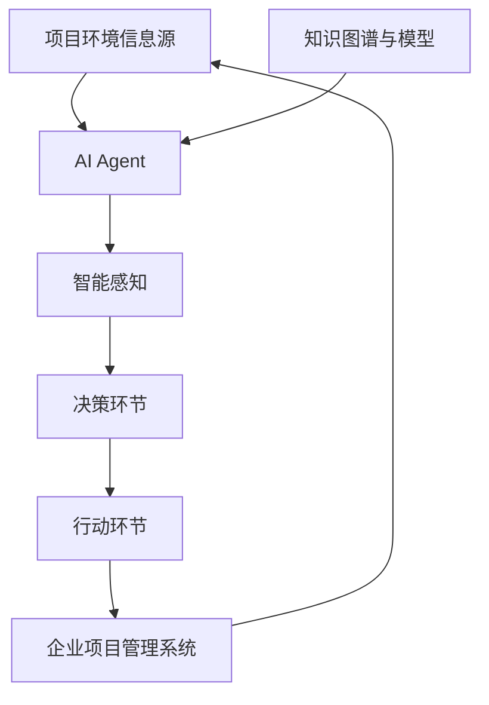

# AI Agent在企业项目管理中的应用

> 关键词：AI Agent、企业项目管理、智能决策、自动化流程、任务分配、进度监控、风险管理

> 摘要：本文聚焦于AI Agent在企业项目管理中的应用，全面探讨了其相关核心概念、算法原理、数学模型等内容。首先介绍了AI Agent在企业项目管理领域应用的背景，包括目的范围、预期读者等。接着阐述了AI Agent与企业项目管理的核心概念及联系，给出了清晰的原理和架构示意图与流程图。详细讲解了AI Agent应用的核心算法原理，并用Python代码进行阐述。同时，分析了相关数学模型和公式，并举例说明。通过项目实战，展示了具体的代码实现和解读。探讨了AI Agent在企业项目管理中的实际应用场景，推荐了相关的学习资源、开发工具框架以及论文著作。最后总结了其未来发展趋势与挑战，还包含常见问题解答和扩展阅读参考资料，旨在为企业在项目管理中更好地应用AI Agent提供全面且深入的技术指导。

## 1. 背景介绍 
### 1.1 目的和范围
在当今竞争激烈的商业环境中，企业项目管理面临着越来越多的挑战，如任务分配不合理、进度监控不及时、风险管理困难等。AI Agent作为一种具有智能决策和自动化执行能力的技术，为解决这些问题提供了新的思路和方法。本文的目的在于深入探讨AI Agent在企业项目管理中的应用，包括如何利用AI Agent实现任务的智能分配、项目进度的实时监控、风险的预警和处理等。范围涵盖了AI Agent的基本概念、相关算法、数学模型，以及在企业项目管理中的具体应用场景和实践案例。

### 1.2 预期读者
本文预期读者包括企业项目管理人员、IT技术人员、对人工智能和项目管理交叉领域感兴趣的研究人员和学者。项目管理人员可以从中了解如何借助AI Agent提升项目管理效率和质量；IT技术人员可以获取AI Agent在项目管理中实现的技术细节和开发思路；研究人员和学者则可以在理论和实践方面得到启发，开展相关的研究工作。

### 1.3 文档结构概述
本文首先介绍AI Agent在企业项目管理应用的背景信息，包括目的、预期读者等。接着阐述AI Agent与企业项目管理相关的核心概念及联系，给出原理和架构的示意图与流程图。然后详细讲解AI Agent应用的核心算法原理，用Python代码进行说明，并分析相关数学模型和公式。通过项目实战展示具体的代码实现和解读。探讨AI Agent在企业项目管理中的实际应用场景。推荐相关的学习资源、开发工具框架以及论文著作。最后总结AI Agent在企业项目管理中的未来发展趋势与挑战，包含常见问题解答和扩展阅读参考资料。

### 1.4 术语表
#### 1.4.1 核心术语定义
- **AI Agent（人工智能智能体）**：是一种能够感知环境、进行决策并采取行动以实现特定目标的智能实体。它可以根据环境的变化自动调整自己的行为，具有一定的自主性和适应性。
- **企业项目管理**：是指企业为了实现项目目标，对项目从启动到结束的全过程进行计划、组织、协调、控制等一系列活动的总称。
- **智能决策**：是指利用人工智能技术，对复杂的问题进行分析和判断，从而做出最优决策的过程。
- **自动化流程**：是指通过计算机程序和系统，自动执行一系列预定的任务和操作，减少人工干预的过程。

#### 1.4.2 相关概念解释
- **机器学习**：是人工智能的一个重要分支，它通过让计算机从数据中学习模式和规律，从而实现对未知数据的预测和分类等任务。在AI Agent中，机器学习可以用于训练智能体的决策模型。
- **自然语言处理**：是研究如何让计算机理解和处理人类语言的技术。在企业项目管理中，自然语言处理可以用于处理项目文档、沟通信息等。
- **知识图谱**：是一种用于表示知识和关系的图结构，它可以将企业项目管理中的各种信息和知识进行整合和关联，为AI Agent提供更全面的知识支持。

#### 1.4.3 缩略词列表
- **AI**：Artificial Intelligence（人工智能）
- **ML**：Machine Learning（机器学习）
- **NLP**：Natural Language Processing（自然语言处理）

## 2. 核心概念与联系 
### 核心概念原理
AI Agent的核心原理基于智能感知、决策和行动三个主要环节。智能感知是指AI Agent通过各种传感器或接口获取环境信息，例如在企业项目管理中，它可以获取项目进度数据、团队成员状态、市场变化等信息。决策环节则是AI Agent根据感知到的信息，运用内置的算法和模型进行分析和判断，确定最优的行动方案。行动环节是AI Agent根据决策结果采取相应的行动，例如分配任务、调整进度计划、发出风险预警等。

在企业项目管理中，AI Agent可以作为一个智能的辅助工具，与项目管理系统进行集成。它可以实时监测项目的各个方面，根据预设的规则和目标进行决策，并自动执行相关的操作，从而提高项目管理的效率和质量。

### 架构的文本示意图
```plaintext
                          +----------------------+
                          |   企业项目管理系统   |
                          +----------------------+
                                 |
                                 | 数据交互
                                 v
+----------------------+      +----------------------+
|      AI Agent       | <----> |    知识图谱与模型   |
+----------------------+      +----------------------+
         |                         |
         | 感知环境信息           | 提供知识支持
         v                         v
+----------------------+      +----------------------+
|    项目环境信息源    |      |    机器学习模型库   |
+----------------------+      +----------------------+
```

### Mermaid流程图


## 3. 核心算法原理 & 具体操作步骤 
### 核心算法原理
在AI Agent应用于企业项目管理中，常用的算法包括强化学习算法和规则推理算法。

#### 强化学习算法
强化学习是一种通过智能体与环境进行交互，不断尝试不同的行动，并根据环境反馈的奖励信号来学习最优策略的算法。在企业项目管理中，AI Agent可以被看作是一个智能体，项目环境是环境，任务分配、进度调整等操作是行动，项目的成功完成、按时交付等是奖励信号。

以下是一个简单的强化学习算法的Python示例，使用OpenAI Gym库模拟一个简单的项目管理环境：

```python
import gym
import numpy as np

# 创建一个简单的项目管理环境（这里使用自定义环境示例）
class ProjectManagementEnv(gym.Env):
    def __init__(self):
        self.state = np.array([0, 0])  # 初始状态，例如项目进度和资源剩余
        self.action_space = gym.spaces.Discrete(2)  # 两个动作，例如增加资源或减少资源
        self.observation_space = gym.spaces.Box(low=0, high=100, shape=(2,))

    def step(self, action):
        if action == 0:
            self.state[0] += 10  # 增加项目进度
            self.state[1] -= 5   # 消耗资源
        else:
            self.state[0] -= 5   # 减少项目进度
            self.state[1] += 10  # 增加资源

        reward = self._get_reward()
        done = self._is_done()
        return self.state, reward, done, {}

    def reset(self):
        self.state = np.array([0, 0])
        return self.state

    def _get_reward(self):
        if self.state[0] >= 100:
            return 100  # 项目成功完成
        elif self.state[1] < 0:
            return -100  # 资源耗尽
        else:
            return -1    # 每一步的小惩罚

    def _is_done(self):
        return self.state[0] >= 100 or self.state[1] < 0

# 强化学习算法实现
env = ProjectManagementEnv()
state = env.reset()
total_reward = 0
for _ in range(100):
    action = env.action_space.sample()  # 随机选择一个动作
    state, reward, done, _ = env.step(action)
    total_reward += reward
    if done:
        break

print(f"Total reward: {total_reward}")
```

#### 规则推理算法
规则推理算法是基于预先定义的规则和条件进行决策的算法。在企业项目管理中，可以根据项目的类型、规模、优先级等因素制定一系列规则，例如“如果项目进度落后且资源充足，则增加资源加快进度”。AI Agent可以根据当前的项目状态和规则进行匹配，从而做出相应的决策。

以下是一个简单的规则推理算法的Python示例：

```python
class Project:
    def __init__(self, progress, resources):
        self.progress = progress
        self.resources = resources

def rule_based_decision(project):
    if project.progress < 50 and project.resources > 20:
        return "增加资源加快进度"
    elif project.progress > 80 and project.resources > 10:
        return "减少资源"
    else:
        return "维持现状"

project = Project(40, 30)
decision = rule_based_decision(project)
print(f"决策结果: {decision}")
```

### 具体操作步骤
1. **环境建模**：将企业项目管理的实际情况抽象为一个环境模型，定义状态、动作和奖励等要素。
2. **算法选择**：根据项目的特点和需求，选择合适的算法，如强化学习算法或规则推理算法。
3. **模型训练**：如果使用强化学习算法，需要对智能体进行训练，使其学习到最优策略。
4. **集成到项目管理系统**：将训练好的AI Agent集成到企业项目管理系统中，实现数据的交互和决策的执行。
5. **监控和优化**：在实际应用过程中，不断监控AI Agent的性能，根据反馈结果进行优化和调整。

## 4. 数学模型和公式 & 详细讲解 & 举例说明 
### 强化学习数学模型
在强化学习中，常用的数学模型是马尔可夫决策过程（Markov Decision Process, MDP）。一个MDP可以用一个五元组 $<S, A, P, R, \gamma>$ 来表示，其中：
- $S$ 是状态集合，表示环境的所有可能状态。
- $A$ 是动作集合，表示智能体可以采取的所有动作。
- $P$ 是状态转移概率函数，$P(s'|s, a)$ 表示在状态 $s$ 下采取动作 $a$ 后转移到状态 $s'$ 的概率。
- $R$ 是奖励函数，$R(s, a, s')$ 表示在状态 $s$ 下采取动作 $a$ 转移到状态 $s'$ 时获得的奖励。
- $\gamma$ 是折扣因子，用于平衡即时奖励和未来奖励，取值范围为 $[0, 1]$。

智能体的目标是找到一个最优策略 $\pi^*(s)$，使得在每个状态 $s$ 下选择的动作能够最大化长期累积奖励。长期累积奖励可以用以下公式表示：

$$G_t = \sum_{k=0}^{\infty} \gamma^k R_{t+k+1}$$

其中，$G_t$ 是从时间步 $t$ 开始的长期累积奖励，$R_{t+k+1}$ 是在时间步 $t + k + 1$ 获得的奖励。

### 举例说明
假设一个简单的项目管理环境，状态 $s$ 表示项目进度（取值范围为 $0$ 到 $100$），动作 $a$ 有两个：增加资源和减少资源。状态转移概率 $P$ 可以根据项目的实际情况进行定义，例如在进度为 $30$ 时增加资源，有 $80\%$ 的概率进度增加到 $40$，$20\%$ 的概率进度增加到 $35$。奖励函数 $R$ 可以定义为：如果项目进度达到 $100$，则获得奖励 $100$；如果资源耗尽，则获得奖励 $-100$；每一步获得一个小的负奖励 $-1$。

### 规则推理数学模型
规则推理可以用逻辑表达式来表示。假设我们有规则 $R_1$：“如果项目进度 $p$ 小于 $50$ 且资源 $r$ 大于 $20$，则增加资源加快进度”，可以用逻辑表达式表示为：

$$(p < 50) \land (r > 20) \Rightarrow \text{增加资源加快进度}$$

其中，$\land$ 表示逻辑与，$\Rightarrow$ 表示逻辑蕴含。

### 举例说明
假设有一个项目，进度 $p = 40$，资源 $r = 30$。将这些值代入规则 $R_1$ 的逻辑表达式中，$40 < 50$ 为真，$30 > 20$ 为真，所以整个逻辑表达式为真，根据规则得出决策为“增加资源加快进度”。

## 5. 项目实战：代码实际案例和详细解释说明 
### 5.1  开发环境搭建
#### 操作系统
可以选择常见的操作系统，如Windows、Linux或macOS。这里以Ubuntu 20.04为例进行说明。

#### 编程语言和库
- **Python**：版本3.7及以上。可以使用以下命令安装Python：
```bash
sudo apt update
sudo apt install python3 python3-pip
```
- **相关库**：需要安装一些常用的Python库，如`numpy`、`pandas`、`scikit-learn`等。可以使用以下命令安装：
```bash
pip3 install numpy pandas scikit-learn
```
- **如果使用强化学习**：还需要安装`gym`库：
```bash
pip3 install gym
```

### 5.2  源代码详细实现和代码解读
#### 项目管理环境类
```python
import numpy as np

class ProjectManagementEnv:
    def __init__(self):
        # 初始化项目状态，进度和资源
        self.state = np.array([0, 100])  # 初始进度为0，初始资源为100
        self.action_space = [0, 1]  # 两个动作：0表示增加资源，1表示减少资源
        self.observation_space = np.array([0, 100])  # 状态空间范围

    def step(self, action):
        if action == 0:
            # 增加资源，进度加快，资源减少
            self.state[0] += 20
            self.state[1] -= 10
        else:
            # 减少资源，进度减慢，资源增加
            self.state[0] -= 10
            self.state[1] += 20

        # 确保进度和资源在合理范围内
        self.state[0] = np.clip(self.state[0], 0, 100)
        self.state[1] = np.clip(self.state[1], 0, 100)

        # 计算奖励
        reward = self._get_reward()
        # 判断是否结束
        done = self._is_done()
        return self.state, reward, done, {}

    def reset(self):
        # 重置环境状态
        self.state = np.array([0, 100])
        return self.state

    def _get_reward(self):
        if self.state[0] >= 100:
            return 100  # 项目成功完成
        elif self.state[1] == 0:
            return -100  # 资源耗尽
        else:
            return -1  # 每一步的小惩罚

    def _is_done(self):
        return self.state[0] >= 100 or self.state[1] == 0
```
**代码解读**：
- `__init__` 方法：初始化项目的状态，包括进度和资源，定义动作空间和状态空间范围。
- `step` 方法：根据输入的动作更新项目状态，计算奖励和判断是否结束。
- `reset` 方法：重置项目状态为初始状态。
- `_get_reward` 方法：根据项目状态计算奖励。
- `_is_done` 方法：判断项目是否结束。

#### 强化学习智能体类
```python
import random

class QLearningAgent:
    def __init__(self, state_space, action_space, learning_rate=0.1, discount_factor=0.9, exploration_rate=0.1):
        self.state_space = state_space
        self.action_space = action_space
        self.learning_rate = learning_rate
        self.discount_factor = discount_factor
        self.exploration_rate = exploration_rate
        # 初始化Q表
        self.q_table = {}
        for state in range(state_space[0], state_space[1] + 1):
            for resource in range(state_space[0], state_space[1] + 1):
                self.q_table[(state, resource)] = {action: 0 for action in action_space}

    def choose_action(self, state):
        if random.uniform(0, 1) < self.exploration_rate:
            # 探索：随机选择动作
            return random.choice(self.action_space)
        else:
            # 利用：选择Q值最大的动作
            q_values = self.q_table[tuple(state)]
            max_q_value = max(q_values.values())
            actions_with_max_q = [action for action, q_value in q_values.items() if q_value == max_q_value]
            return random.choice(actions_with_max_q)

    def update_q_table(self, state, action, reward, next_state):
        current_q_value = self.q_table[tuple(state)][action]
        next_max_q_value = max(self.q_table[tuple(next_state)].values())
        new_q_value = (1 - self.learning_rate) * current_q_value + self.learning_rate * (reward + self.discount_factor * next_max_q_value)
        self.q_table[tuple(state)][action] = new_q_value
```
**代码解读**：
- `__init__` 方法：初始化智能体的参数，包括学习率、折扣因子、探索率等，同时初始化Q表。
- `choose_action` 方法：根据探索率选择动作，以一定概率进行探索（随机选择动作），否则选择Q值最大的动作。
- `update_q_table` 方法：根据经验更新Q表中的Q值。

#### 主程序
```python
# 创建环境和智能体
env = ProjectManagementEnv()
agent = QLearningAgent(env.observation_space, env.action_space)

# 训练智能体
num_episodes = 1000
for episode in range(num_episodes):
    state = env.reset()
    total_reward = 0
    done = False
    while not done:
        action = agent.choose_action(state)
        next_state, reward, done, _ = env.step(action)
        agent.update_q_table(state, action, reward, next_state)
        state = next_state
        total_reward += reward
    if episode % 100 == 0:
        print(f"Episode {episode}: Total reward = {total_reward}")
```
**代码解读**：
- 创建项目管理环境和强化学习智能体。
- 进行一定数量的训练回合，在每个回合中，智能体与环境进行交互，选择动作，更新Q表，直到回合结束。
- 每100个回合打印一次总奖励。

### 5.3  代码解读与分析
#### 环境类分析
- 环境类模拟了一个简单的项目管理环境，包括项目进度和资源的变化。通过`step`方法实现了状态的更新，根据不同的动作对进度和资源进行调整。
- 奖励机制的设计鼓励智能体尽快完成项目，同时避免资源耗尽。

#### 智能体类分析
- 智能体使用Q学习算法进行学习，通过Q表存储状态-动作对的Q值。
- 探索和利用的平衡通过探索率来控制，在训练初期，智能体更多地进行探索，随着训练的进行，逐渐增加利用的比例。

#### 主程序分析
- 主程序控制训练的过程，通过多个回合的训练，智能体不断学习最优策略。
- 总奖励的变化可以反映智能体的学习效果，随着训练的进行，总奖励应该逐渐增加。

## 6. 实际应用场景 
### 任务分配
AI Agent可以根据团队成员的技能、工作量、工作效率等因素，智能地分配项目任务。例如，对于一个软件开发项目，AI Agent可以分析每个开发人员的技术专长，将适合的模块分配给相应的人员，提高项目的整体开发效率。

### 进度监控
AI Agent可以实时监控项目的进度，对比实际进度与计划进度的差异。当发现进度落后时，AI Agent可以自动分析原因，如资源不足、任务分配不合理等，并提出相应的调整建议，如增加资源、重新分配任务等。

### 风险管理
AI Agent可以识别项目中的潜在风险，如技术难题、人员变动、市场变化等。通过对历史数据和实时信息的分析，AI Agent可以预测风险发生的概率和影响程度，并提前制定应对措施，降低风险对项目的影响。

### 智能决策支持
在项目管理过程中，经常需要做出各种决策，如项目优先级的确定、资源的分配、项目的延期或终止等。AI Agent可以根据项目的目标、约束条件和当前状态，提供决策建议，帮助项目管理人员做出更明智的决策。

### 沟通协调
AI Agent可以协助项目团队进行沟通协调。例如，它可以自动提醒团队成员任务的截止日期、会议的时间和地点等；还可以对团队成员之间的沟通信息进行分析，发现潜在的问题和矛盾，并及时进行调解。

## 7. 工具和资源推荐
### 7.1 学习资源推荐
#### 7.1.1 书籍推荐
- 《人工智能：一种现代的方法》：这本书是人工智能领域的经典教材，全面介绍了人工智能的基本概念、算法和应用，对于理解AI Agent的原理和技术有很大的帮助。
- 《强化学习：原理与Python实现》：专注于强化学习的理论和实践，详细讲解了强化学习的算法和应用，对于学习AI Agent在项目管理中应用的强化学习算法非常有用。
- 《项目管理知识体系指南（PMBOK指南）》：是项目管理领域的权威书籍，介绍了项目管理的各个方面，包括项目的启动、规划、执行、监控和收尾等过程，有助于了解企业项目管理的基本知识和流程。

#### 7.1.2 在线课程
- Coursera上的“人工智能基础”课程：由知名大学的教授授课，系统地介绍了人工智能的基础知识和技术，包括机器学习、自然语言处理等，对于初学者来说是一个很好的入门课程。
- edX上的“强化学习”课程：深入讲解了强化学习的理论和算法，通过实际案例和编程练习，帮助学习者掌握强化学习的应用，适合有一定编程基础的学习者。
- Udemy上的“项目管理实战”课程：结合实际项目案例，介绍了项目管理的方法和技巧，对于想要了解项目管理实践的学习者有很大的帮助。

#### 7.1.3 技术博客和网站
- Medium：上面有很多关于人工智能和项目管理的技术博客文章，作者来自不同的领域和背景，可以从中获取最新的技术动态和实践经验。
- Towards Data Science：专注于数据科学和人工智能领域，提供了大量的技术文章和教程，对于学习AI Agent相关技术有很大的帮助。
- ProjectManagement.com：是一个专业的项目管理网站，提供了项目管理的知识、工具和案例等资源，对于了解企业项目管理的最新趋势和最佳实践非常有用。

### 7.2 开发工具框架推荐
#### 7.2.1 IDE和编辑器
- PyCharm：是一款专业的Python集成开发环境，提供了丰富的代码编辑、调试、版本控制等功能，对于开发AI Agent相关的Python代码非常方便。
- Visual Studio Code：是一款轻量级的代码编辑器，支持多种编程语言和插件，具有良好的扩展性，可以通过安装相关插件来进行Python开发和调试。

#### 7.2.2 调试和性能分析工具
- pdb：是Python内置的调试器，可以帮助开发者定位代码中的问题和错误。
- cProfile：是Python的性能分析工具，可以分析代码的运行时间和资源消耗情况，帮助开发者优化代码性能。

#### 7.2.3 相关框架和库
- TensorFlow：是一个开源的机器学习框架，提供了丰富的工具和接口，用于开发和训练深度学习模型，在AI Agent的开发中可以用于实现复杂的决策模型。
- PyTorch：也是一个流行的深度学习框架，具有简洁易用的特点，适合快速开发和实验AI Agent的模型。
- OpenAI Gym：是一个用于开发和比较强化学习算法的工具包，提供了各种模拟环境，方便开发者进行强化学习算法的训练和测试。

### 7.3 相关论文著作推荐
#### 7.3.1 经典论文
- “Reinforcement Learning: An Introduction”：由Richard S. Sutton和Andrew G. Barto所著，是强化学习领域的经典论文，系统地介绍了强化学习的基本概念、算法和理论，对于理解AI Agent中的强化学习算法具有重要的参考价值。
- “Artificial Intelligence: A General Survey”：全面介绍了人工智能的发展历程、基本概念和主要技术，对于了解AI Agent的整体背景和技术体系有很大的帮助。

#### 7.3.2 最新研究成果
- 可以关注顶级学术会议和期刊上的最新研究成果，如NeurIPS（神经信息处理系统大会）、ICML（国际机器学习会议）、Journal of Artificial Intelligence Research（人工智能研究杂志）等，这些会议和期刊上的论文反映了AI Agent和项目管理领域的最新研究动态和技术进展。

#### 7.3.3 应用案例分析
- 一些企业和研究机构会发布AI Agent在项目管理中的应用案例，可以通过查阅相关的报告和文档，了解实际应用中的经验和教训，为自己的项目实践提供参考。

## 8. 总结：未来发展趋势与挑战
### 未来发展趋势
#### 更强大的智能决策能力
随着人工智能技术的不断发展，AI Agent的智能决策能力将不断提升。它将能够处理更复杂的项目管理问题，考虑更多的因素和约束条件，做出更准确、更优化的决策。

#### 与其他技术的深度融合
AI Agent将与物联网、大数据、区块链等技术深度融合。例如，通过物联网设备获取项目现场的实时数据，为AI Agent提供更全面的信息；利用大数据分析挖掘项目中的潜在规律和趋势，辅助AI Agent进行决策；借助区块链技术保证项目数据的安全性和可信度。

#### 个性化和定制化服务
不同的企业和项目有不同的特点和需求，未来的AI Agent将能够提供个性化和定制化的服务。它可以根据企业的行业特点、项目的规模和类型等因素，进行针对性的配置和优化，更好地满足企业的项目管理需求。

#### 协作式智能体系统
多个AI Agent可以组成协作式智能体系统，共同完成项目管理任务。它们可以通过信息共享、协同决策等方式，提高项目管理的效率和质量。例如，在一个大型项目中，不同的AI Agent可以分别负责不同的领域，如任务分配、进度监控、风险管理等，通过协作实现项目的整体优化。

### 挑战
#### 数据质量和安全问题
AI Agent的决策和行动依赖于大量的数据，数据的质量直接影响到AI Agent的性能。如果数据存在错误、缺失或不准确等问题，可能会导致AI Agent做出错误的决策。此外，项目数据往往包含企业的敏感信息，数据的安全和隐私保护也是一个重要的挑战。

#### 算法的可解释性和透明度
一些复杂的人工智能算法，如深度学习算法，往往被视为“黑盒”模型，其决策过程难以解释和理解。在企业项目管理中，项目管理人员需要了解AI Agent的决策依据和原因，以便进行评估和调整。因此，提高算法的可解释性和透明度是一个亟待解决的问题。

#### 人员的接受和适应问题
引入AI Agent可能会对企业的项目管理流程和人员角色产生影响。一些项目管理人员可能对新技术存在疑虑和抵触情绪，需要一定的时间来接受和适应。此外，员工需要具备相应的技术和知识，才能有效地与AI Agent协作，这也对企业的人才培养和培训提出了挑战。

#### 伦理和法律问题
随着AI Agent在企业项目管理中的应用越来越广泛，伦理和法律问题也日益凸显。例如，AI Agent的决策可能会对员工的权益产生影响，如何确保其决策的公平性和合法性是一个重要的问题。此外，在发生纠纷和责任认定时，如何确定AI Agent和相关人员的责任也需要进一步探讨。

## 9. 附录：常见问题与解答
### 问题1：AI Agent在企业项目管理中的应用是否会完全取代人类项目管理人员？
答：不会。虽然AI Agent可以在很多方面辅助项目管理，如任务分配、进度监控、风险管理等，但人类项目管理人员具有丰富的经验、判断力和沟通能力，这些是AI Agent目前无法完全替代的。AI Agent更像是一个智能助手，帮助项目管理人员提高工作效率和决策质量，而不是取代他们。

### 问题2：如何确保AI Agent的决策是准确和可靠的？
答：可以从以下几个方面确保AI Agent的决策准确性和可靠性：
- **数据质量**：保证输入数据的准确性、完整性和一致性，对数据进行清洗和预处理。
- **算法选择和优化**：选择合适的算法，并对其进行优化和调参，提高算法的性能。
- **模型评估和验证**：使用测试数据对AI Agent的模型进行评估和验证，确保其在不同情况下都能做出合理的决策。
- **人工监督和干预**：在AI Agent运行过程中，进行人工监督，当发现决策不合理时，及时进行干预和调整。

### 问题3：AI Agent在企业项目管理中的应用需要哪些技术基础？
答：需要以下技术基础：
- **人工智能技术**：如机器学习、强化学习、自然语言处理等，用于实现AI Agent的智能决策和自动化执行能力。
- **数据处理和分析技术**：包括数据采集、存储、清洗、分析等，为AI Agent提供准确的数据支持。
- **编程和软件开发技术**：掌握至少一种编程语言，如Python，以及相关的开发框架和工具，用于实现AI Agent的具体功能。
- **项目管理知识**：了解企业项目管理的基本流程和方法，以便将AI Agent的功能与项目管理实际需求相结合。

### 问题4：如何将AI Agent集成到现有的企业项目管理系统中？
答：可以按照以下步骤将AI Agent集成到现有的企业项目管理系统中：
1. **需求分析**：明确AI Agent在项目管理系统中的功能和需求，确定集成的目标和范围。
2. **接口设计**：设计AI Agent与项目管理系统之间的数据交互接口，确保数据的顺畅传输。
3. **开发和测试**：开发AI Agent的功能模块，并进行测试，确保其与项目管理系统的兼容性和稳定性。
4. **部署和上线**：将开发好的AI Agent部署到项目管理系统中，并进行上线运行，同时进行监控和优化。

### 问题5：AI Agent在企业项目管理中的应用会带来哪些成本？
答：AI Agent在企业项目管理中的应用可能会带来以下成本：
- **技术研发成本**：包括AI Agent的开发、测试和维护成本。
- **数据采集和处理成本**：需要采集和处理大量的数据，包括数据的存储、清洗和分析等成本。
- **人员培训成本**：员工需要学习和掌握相关的技术和知识，需要进行培训，这会产生培训成本。
- **硬件和软件成本**：可能需要购买相关的硬件设备和软件工具，以支持AI Agent的运行。

## 10. 扩展阅读 & 参考资料
### 扩展阅读
- 《智能时代：大数据与智能革命重新定义未来》：探讨了人工智能和大数据对未来社会的影响，对于理解AI Agent在企业项目管理中的应用背景和趋势有一定的帮助。
- 《创新者的窘境》：分析了企业在面对技术创新时的挑战和机遇，对于思考AI Agent在企业项目管理中的应用和变革有一定的启示。

### 参考资料
- 相关的学术论文和研究报告，如在IEEE Xplore、ACM Digital Library等数据库中搜索到的关于AI Agent和项目管理的研究成果。
- 企业的项目管理实践案例和经验分享，如一些知名企业在其官方网站或行业论坛上发布的关于AI Agent应用的案例和报告。
- 人工智能和项目管理相关的标准和规范，如ISO 21500《项目管理指南》、IEEE标准等。