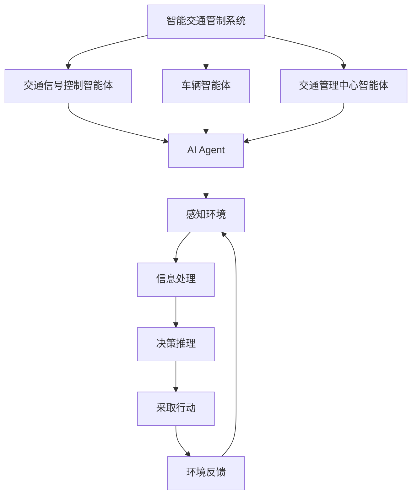

# AI Agent在智能交通管制中的实践

> 关键词：AI Agent、智能交通管制、交通流优化、自动驾驶、交通信号控制

> 摘要：本文围绕AI Agent在智能交通管制中的实践展开，深入探讨了AI Agent的核心概念及其与智能交通管制的紧密联系。详细阐述了相关核心算法原理，并结合Python代码进行具体操作步骤的讲解。通过数学模型和公式的分析，为智能交通管制提供理论支撑。同时，给出项目实战案例，包括开发环境搭建、源代码实现与解读。此外，介绍了AI Agent在智能交通管制中的实际应用场景，推荐了相关的学习资源、开发工具框架以及论文著作。最后，总结了AI Agent在智能交通管制领域的未来发展趋势与挑战，并对常见问题进行解答，为该领域的研究和实践提供全面的参考。

## 1. 背景介绍 
### 1.1 目的和范围
随着城市化进程的加速和汽车保有量的持续增长，交通拥堵、交通事故等问题日益严重，给人们的生活和社会经济发展带来了诸多负面影响。智能交通管制作为解决交通问题的有效手段，受到了广泛关注。AI Agent作为一种具有自主决策和学习能力的智能体，能够在复杂的交通环境中感知、推理和行动，为智能交通管制提供了新的思路和方法。

本文的范围主要涵盖AI Agent在智能交通管制中的核心概念、算法原理、数学模型、项目实战、实际应用场景等方面，旨在全面深入地探讨AI Agent在智能交通管制中的应用实践，为相关领域的研究和工程实践提供理论支持和技术参考。

### 1.2 预期读者
本文预期读者包括从事智能交通领域研究的科研人员、交通工程专业的学生、智能交通系统的开发工程师、交通管理部门的工作人员以及对AI Agent和智能交通管制感兴趣的技术爱好者。

### 1.3 文档结构概述
本文共分为十个部分。第一部分为背景介绍，阐述了研究的目的和范围、预期读者以及文档结构概述，并给出了相关术语表。第二部分介绍了AI Agent与智能交通管制的核心概念与联系，包括原理和架构的文本示意图以及Mermaid流程图。第三部分详细讲解了核心算法原理，并通过Python源代码阐述具体操作步骤。第四部分给出了数学模型和公式，并进行详细讲解和举例说明。第五部分是项目实战，包括开发环境搭建、源代码详细实现和代码解读以及代码分析。第六部分介绍了AI Agent在智能交通管制中的实际应用场景。第七部分推荐了相关的学习资源、开发工具框架以及论文著作。第八部分总结了未来发展趋势与挑战。第九部分是附录，对常见问题进行解答。第十部分提供了扩展阅读和参考资料。

### 1.4 术语表
#### 1.4.1 核心术语定义
- **AI Agent（人工智能智能体）**：是一种能够感知环境、进行推理决策并采取行动以实现特定目标的智能实体。它可以是软件程序、机器人或其他具有智能行为的系统。
- **智能交通管制**：是指利用先进的信息技术、通信技术、控制技术等手段，对交通系统进行实时监测、分析、决策和控制，以提高交通效率、保障交通安全、减少交通污染的一种综合管理模式。
- **交通流**：是指在单位时间内通过道路某一断面的车辆或行人的数量，是描述交通运行状态的重要参数。
- **自动驾驶**：是指车辆在没有人类驾驶员直接操作的情况下，通过车载传感器、控制器和执行器等设备，自动完成行驶任务的技术。
- **交通信号控制**：是指通过设置交通信号灯等设备，对道路交叉口的交通流进行时间和空间上的分配，以提高交叉口的通行能力和安全性的一种交通管理措施。

#### 1.4.2 相关概念解释
- **多智能体系统（MAS）**：是由多个AI Agent组成的系统，这些智能体之间可以通过通信和协作来完成共同的任务。在智能交通管制中，多个AI Agent可以分别负责不同的交通管理任务，如交通信号控制、车辆调度等，通过协作实现整个交通系统的优化。
- **强化学习**：是一种机器学习方法，智能体通过与环境进行交互，根据环境反馈的奖励信号来学习最优的行为策略。在智能交通管制中，AI Agent可以利用强化学习来优化交通信号控制策略、车辆路径规划等。
- **传感器融合**：是指将来自多个传感器的数据进行处理和融合，以获取更准确、更全面的环境信息。在智能交通管制中，AI Agent可以通过传感器融合技术获取车辆的位置、速度、行驶方向等信息，从而更好地进行决策和控制。

#### 1.4.3 缩略词列表
- **AI**：Artificial Intelligence（人工智能）
- **MAS**：Multi - Agent System（多智能体系统）
- **RL**：Reinforcement Learning（强化学习）
- **GPS**：Global Positioning System（全球定位系统）
- **LIDAR**：Light Detection and Ranging（激光雷达）

## 2. 核心概念与联系 
### 核心概念原理
AI Agent是一种具有自主性、反应性、社会性和主动性的智能实体。其基本原理是通过传感器感知环境信息，将这些信息输入到内部的决策模块中，决策模块根据预设的目标和规则进行推理和决策，然后通过执行器采取相应的行动。在智能交通管制中，AI Agent可以是交通信号控制智能体、车辆智能体、交通管理中心智能体等。

交通信号控制智能体通过感知路口的交通流量、车辆排队长度等信息，运用一定的算法决策出最优的信号灯配时方案，以提高路口的通行效率。车辆智能体可以感知周围车辆的位置、速度、行驶方向等信息，根据交通规则和自身的行驶目标，自主决策行驶路径和速度，实现自动驾驶或辅助驾驶。交通管理中心智能体则可以收集和分析整个交通网络的信息，协调各个路口的交通信号控制智能体和车辆智能体的行为，实现全局的交通优化。

### 架构的文本示意图
```plaintext
智能交通管制系统
├── 交通信号控制智能体
│   ├── 传感器（如摄像头、地磁传感器）
│   ├── 决策模块（如基于规则的决策、强化学习算法）
│   ├── 执行器（信号灯控制器）
├── 车辆智能体
│   ├── 传感器（如GPS、LIDAR、摄像头）
│   ├── 决策模块（如路径规划算法、避障算法）
│   ├── 执行器（车辆的动力系统、转向系统）
├── 交通管理中心智能体
│   ├── 数据收集模块（收集各个路口和车辆的信息）
│   ├── 数据分析模块（对收集到的数据进行分析和处理）
│   ├── 决策模块（协调各个智能体的行为）
│   ├── 通信模块（与其他智能体进行通信）
```

### Mermaid流程图


## 3. 核心算法原理 & 具体操作步骤 
### 强化学习算法原理
强化学习是AI Agent在智能交通管制中常用的算法之一。其基本思想是智能体通过与环境进行交互，不断尝试不同的行为，根据环境反馈的奖励信号来学习最优的行为策略。在智能交通管制中，以交通信号控制为例，智能体的状态可以定义为路口的交通流量、车辆排队长度等信息，行为可以是不同的信号灯配时方案，奖励可以是路口的通行效率、车辆的平均等待时间等。

### Python源代码实现
```python
import numpy as np

# 定义环境类
class TrafficEnvironment:
    def __init__(self):
        # 初始化环境参数
        self.state_dim = 3  # 状态维度，如交通流量、排队长度等
        self.action_dim = 4  # 动作维度，如不同的信号灯配时方案
        self.reset()

    def reset(self):
        # 重置环境状态
        self.state = np.random.rand(self.state_dim)
        return self.state

    def step(self, action):
        # 执行动作并返回新的状态、奖励和是否结束
        new_state = np.random.rand(self.state_dim)
        reward = np.random.rand()  # 简单示例，实际中根据具体情况计算
        done = False
        return new_state, reward, done

# 定义智能体类
class QLearningAgent:
    def __init__(self, state_dim, action_dim, learning_rate=0.1, discount_factor=0.9):
        self.state_dim = state_dim
        self.action_dim = action_dim
        self.learning_rate = learning_rate
        self.discount_factor = discount_factor
        self.q_table = np.zeros((state_dim, action_dim))

    def choose_action(self, state):
        # 根据状态选择动作
        if np.random.uniform(0, 1) < 0.1:  # 探索率
            action = np.random.choice(self.action_dim)
        else:
            action = np.argmax(self.q_table[state])
        return action

    def update_q_table(self, state, action, reward, next_state):
        # 更新Q表
        max_q_next = np.max(self.q_table[next_state])
        self.q_table[state, action] += self.learning_rate * (reward + self.discount_factor * max_q_next - self.q_table[state, action])

# 训练过程
env = TrafficEnvironment()
agent = QLearningAgent(env.state_dim, env.action_dim)

num_episodes = 1000
for episode in range(num_episodes):
    state = env.reset()
    done = False
    while not done:
        action = agent.choose_action(state)
        next_state, reward, done = env.step(action)
        agent.update_q_table(state, action, reward, next_state)
        state = next_state
```

### 具体操作步骤
1. **环境初始化**：创建交通环境对象，设置环境的状态维度和动作维度，并重置环境状态。
2. **智能体初始化**：创建QLearningAgent对象，设置学习率、折扣因子等参数，并初始化Q表。
3. **训练过程**：进行多个回合的训练，每个回合中，智能体根据当前状态选择动作，执行动作后得到新的状态、奖励和是否结束的信息，然后更新Q表。
4. **测试过程**：训练完成后，可以使用训练好的智能体在实际环境中进行测试，观察智能体的表现。

## 4. 数学模型和公式 & 详细讲解 & 举例说明 
### Q学习算法的数学模型
Q学习算法是一种基于值函数的强化学习算法，其核心是学习Q值函数 $Q(s,a)$，表示在状态 $s$ 下采取动作 $a$ 的期望累积奖励。Q学习算法的更新公式为：

$$Q(s,a) \leftarrow Q(s,a) + \alpha [r + \gamma \max_{a'} Q(s',a') - Q(s,a)]$$

其中：
- $Q(s,a)$ 是当前状态 $s$ 下采取动作 $a$ 的Q值。
- $\alpha$ 是学习率，控制每次更新的步长。
- $r$ 是执行动作 $a$ 后获得的即时奖励。
- $\gamma$ 是折扣因子，用于权衡即时奖励和未来奖励的重要性。
- $s'$ 是执行动作 $a$ 后转移到的下一个状态。
- $\max_{a'} Q(s',a')$ 是下一个状态 $s'$ 下所有可能动作的最大Q值。

### 详细讲解
Q学习算法的基本思想是通过不断地与环境进行交互，根据环境反馈的奖励信号来更新Q值函数，使得Q值函数逐渐逼近最优的Q值函数。学习率 $\alpha$ 决定了每次更新的步长，如果 $\alpha$ 过大，可能会导致算法不稳定；如果 $\alpha$ 过小，算法的收敛速度会很慢。折扣因子 $\gamma$ 用于权衡即时奖励和未来奖励的重要性，$\gamma$ 越接近1，表示越重视未来的奖励；$\gamma$ 越接近0，表示越重视即时奖励。

### 举例说明
假设在一个简单的交通信号控制场景中，状态 $s$ 表示路口的交通流量，动作 $a$ 表示信号灯的配时方案，奖励 $r$ 表示路口的通行效率。初始时，Q表中的所有值都为0。智能体在状态 $s_1$ 下选择动作 $a_1$，执行动作后获得即时奖励 $r_1 = 10$，转移到下一个状态 $s_2$。假设学习率 $\alpha = 0.1$，折扣因子 $\gamma = 0.9$，下一个状态 $s_2$ 下所有可能动作的最大Q值 $\max_{a'} Q(s_2,a') = 20$。则根据Q学习算法的更新公式，更新后的 $Q(s_1,a_1)$ 为：

$$Q(s_1,a_1) \leftarrow Q(s_1,a_1) + 0.1 [10 + 0.9 \times 20 - Q(s_1,a_1)]$$

如果初始时 $Q(s_1,a_1) = 0$，则更新后的 $Q(s_1,a_1) = 0 + 0.1 [10 + 0.9 \times 20 - 0] = 2.8$。

## 5. 项目实战：代码实际案例和详细解释说明 
### 5.1  开发环境搭建
- **操作系统**：推荐使用Linux系统，如Ubuntu 18.04及以上版本，也可以使用Windows 10或macOS。
- **编程语言**：Python 3.6及以上版本。
- **开发工具**：推荐使用PyCharm作为集成开发环境（IDE），也可以使用Jupyter Notebook进行交互式开发。
- **依赖库**：安装NumPy、Matplotlib等常用库，用于数值计算和数据可视化。可以使用以下命令进行安装：
```bash
pip install numpy matplotlib
```

### 5.2  源代码详细实现和代码解读
```python
import numpy as np
import matplotlib.pyplot as plt

# 定义交通环境类
class TrafficEnvironment:
    def __init__(self):
        # 状态维度，如交通流量、排队长度等
        self.state_dim = 3
        # 动作维度，如不同的信号灯配时方案
        self.action_dim = 4
        # 重置环境
        self.reset()

    def reset(self):
        # 随机初始化状态
        self.state = np.random.rand(self.state_dim)
        return self.state

    def step(self, action):
        # 模拟执行动作，更新状态
        new_state = np.random.rand(self.state_dim)
        # 简单计算奖励，实际中根据具体情况计算
        reward = np.sum(new_state) - np.sum(self.state)
        done = False
        self.state = new_state
        return new_state, reward, done

# 定义Q学习智能体类
class QLearningAgent:
    def __init__(self, state_dim, action_dim, learning_rate=0.1, discount_factor=0.9):
        self.state_dim = state_dim
        self.action_dim = action_dim
        self.learning_rate = learning_rate
        self.discount_factor = discount_factor
        # 初始化Q表
        self.q_table = np.zeros((state_dim, action_dim))

    def choose_action(self, state):
        # 以一定的概率进行探索
        if np.random.uniform(0, 1) < 0.1:
            action = np.random.choice(self.action_dim)
        else:
            action = np.argmax(self.q_table[state])
        return action

    def update_q_table(self, state, action, reward, next_state):
        # 根据Q学习算法更新Q表
        max_q_next = np.max(self.q_table[next_state])
        self.q_table[state, action] += self.learning_rate * (reward + self.discount_factor * max_q_next - self.q_table[state, action])

# 训练过程
env = TrafficEnvironment()
agent = QLearningAgent(env.state_dim, env.action_dim)

num_episodes = 1000
total_rewards = []

for episode in range(num_episodes):
    state = env.reset()
    total_reward = 0
    done = False
    while not done:
        action = agent.choose_action(state)
        next_state, reward, done = env.step(action)
        agent.update_q_table(state, action, reward, next_state)
        state = next_state
        total_reward += reward
    total_rewards.append(total_reward)

# 绘制训练过程中的总奖励曲线
plt.plot(total_rewards)
plt.xlabel('Episode')
plt.ylabel('Total Reward')
plt.title('Training Curve')
plt.show()
```

### 代码解读与分析
1. **交通环境类（TrafficEnvironment）**：
    - `__init__` 方法：初始化环境的状态维度和动作维度，并调用 `reset` 方法重置环境。
    - `reset` 方法：随机初始化环境的状态。
    - `step` 方法：模拟执行动作，更新环境状态，并计算奖励。

2. **Q学习智能体类（QLearningAgent）**：
    - `__init__` 方法：初始化智能体的状态维度、动作维度、学习率、折扣因子和Q表。
    - `choose_action` 方法：根据当前状态选择动作，以一定的概率进行探索。
    - `update_q_table` 方法：根据Q学习算法更新Q表。

3. **训练过程**：
    - 初始化交通环境和Q学习智能体。
    - 进行多个回合的训练，每个回合中，智能体根据当前状态选择动作，执行动作后得到新的状态、奖励和是否结束的信息，然后更新Q表。
    - 记录每个回合的总奖励，并绘制训练曲线。

通过分析训练曲线，可以观察到智能体的学习效果。如果总奖励逐渐增加，说明智能体在不断学习和优化策略；如果总奖励波动较大或没有明显的上升趋势，可能需要调整学习率、折扣因子等参数。

## 6. 实际应用场景 
### 交通信号控制
AI Agent可以实时感知路口的交通流量、车辆排队长度等信息，根据这些信息动态调整信号灯的配时方案。例如，在交通高峰期，增加主干道的绿灯时间，减少次干道的绿灯时间，以提高路口的通行效率；在交通低谷期，适当缩短信号灯的周期，减少车辆的等待时间。

### 车辆调度与路径规划
AI Agent可以根据实时交通信息，为车辆规划最优的行驶路径，避免拥堵路段。同时，还可以对车辆进行调度，如优化公交车辆的发车间隔、协调出租车的接送任务等。例如，在城市中发生重大活动时，AI Agent可以根据活动的时间和地点，合理调度公交车辆，将乘客快速、安全地送达目的地。

### 自动驾驶
AI Agent可以作为自动驾驶车辆的核心决策模块，通过车载传感器感知周围环境，如其他车辆的位置、速度、行驶方向，行人的位置和运动状态等，根据交通规则和预设的行驶目标，自主决策车辆的行驶路径、速度和转向等。例如，在高速公路上，自动驾驶车辆可以根据前方车辆的行驶情况，自动调整车速和车距，保持安全的行驶状态。

### 交通事件检测与处理
AI Agent可以通过分析交通监控视频、传感器数据等，实时检测交通事件，如交通事故、交通拥堵、车辆违规等。一旦检测到交通事件，AI Agent可以及时通知交通管理部门，并提供相关的信息和建议，如事故的位置、严重程度、影响范围等，以便交通管理部门快速做出响应和处理。

## 7. 工具和资源推荐
### 7.1 学习资源推荐
#### 7.1.1 书籍推荐
- 《人工智能：一种现代的方法》：全面介绍了人工智能的基本概念、算法和应用，是人工智能领域的经典教材。
- 《强化学习：原理与Python实现》：详细讲解了强化学习的原理和算法，并通过Python代码进行实现，适合初学者学习强化学习。
- 《智能交通系统：原理、方法与应用》：系统介绍了智能交通系统的基本原理、关键技术和应用案例，对智能交通领域的研究和实践具有重要的参考价值。

#### 7.1.2 在线课程
- Coursera上的“人工智能基础”课程：由知名高校的教授授课，内容涵盖人工智能的各个方面，包括机器学习、深度学习、自然语言处理等。
- edX上的“强化学习”课程：深入讲解了强化学习的理论和算法，通过实际案例和编程作业帮助学习者掌握强化学习的应用。
- 中国大学MOOC上的“智能交通系统”课程：介绍了智能交通系统的发展现状、关键技术和应用前景，适合交通工程专业的学生和相关从业人员学习。

#### 7.1.3 技术博客和网站
- Medium：有许多关于人工智能、智能交通等领域的技术博客，作者们分享了自己的研究成果和实践经验。
- arXiv：是一个预印本数据库，收录了大量关于人工智能、智能交通等领域的最新研究论文，可以及时了解该领域的研究动态。
- 中国智能交通协会官网：提供了智能交通领域的政策法规、行业标准、技术动态等信息，是了解智能交通行业的重要渠道。

### 7.2 开发工具框架推荐
#### 7.2.1 IDE和编辑器
- PyCharm：是一款专门为Python开发设计的集成开发环境，具有代码编辑、调试、版本控制等功能，提高了开发效率。
- Jupyter Notebook：是一个交互式的开发环境，适合进行数据探索、模型训练和可视化等工作，方便用户进行实验和分享代码。
- Visual Studio Code：是一款轻量级的代码编辑器，支持多种编程语言和插件，具有丰富的扩展功能，可用于AI Agent和智能交通系统的开发。

#### 7.2.2 调试和性能分析工具
- PDB：是Python的内置调试器，可以帮助开发者定位代码中的错误和问题。
- TensorBoard：是TensorFlow的可视化工具，可以用于可视化模型的训练过程、性能指标等，帮助开发者优化模型。
- cProfile：是Python的性能分析工具，可以分析代码的运行时间和资源消耗情况，找出性能瓶颈。

#### 7.2.3 相关框架和库
- TensorFlow：是一个开源的机器学习框架，提供了丰富的深度学习模型和工具，可用于AI Agent的开发和训练。
- PyTorch：是另一个流行的深度学习框架，具有简洁易用的接口和高效的计算性能，广泛应用于人工智能领域。
- SUMO：是一个开源的交通仿真软件，可以模拟不同的交通场景，用于智能交通系统的开发和测试。

### 7.3 相关论文著作推荐
#### 7.3.1 经典论文
- “Reinforcement Learning: An Introduction”：是强化学习领域的经典论文，系统介绍了强化学习的基本概念、算法和应用。
- “Intelligent Transportation Systems: A Review”：对智能交通系统的发展现状、关键技术和应用前景进行了全面的综述。
- “Multi - Agent Systems for Traffic Control: A Survey”：对多智能体系统在交通控制中的应用进行了详细的调研和分析。

#### 7.3.2 最新研究成果
- 可以通过arXiv、IEEE Xplore等数据库查找关于AI Agent在智能交通管制中的最新研究论文，了解该领域的前沿动态。

#### 7.3.3 应用案例分析
- 一些国际知名的智能交通项目，如新加坡的智能交通系统、美国的智能高速公路项目等，都有相关的技术报告和案例分析，可以从中学习到实际应用中的经验和教训。

## 8. 总结：未来发展趋势与挑战
### 未来发展趋势
- **多智能体协作的深化**：未来，AI Agent在智能交通管制中的应用将更加注重多智能体之间的协作。不同类型的智能体，如交通信号控制智能体、车辆智能体、交通管理中心智能体等，将通过更加高效的通信和协作机制，实现全局的交通优化。例如，车辆智能体可以与交通信号控制智能体实时交互，根据信号灯的状态调整行驶速度，减少停车次数，提高交通效率。
- **与新兴技术的融合**：AI Agent将与物联网、大数据、云计算、区块链等新兴技术深度融合。物联网技术可以提供更丰富、更准确的交通数据，大数据和云计算技术可以对海量的交通数据进行存储、分析和处理，区块链技术可以保证交通数据的安全性和可信度。例如，通过物联网传感器收集车辆的实时信息，利用大数据分析技术预测交通流量，为AI Agent的决策提供更有力的支持。
- **自动驾驶的普及**：随着AI Agent技术的不断发展，自动驾驶车辆将逐渐普及。自动驾驶车辆将成为智能交通系统的重要组成部分，与其他交通参与者（如行人、非机动车、传统车辆等）实现协同运行。这将大大提高交通安全性和效率，减少交通事故的发生。
- **智能交通的国际化合作**：智能交通是一个全球性的问题，需要各国之间的合作与交流。未来，国际间将加强在智能交通领域的合作，共同开展研究项目、制定标准和规范，推动智能交通技术的全球化发展。

### 挑战
- **数据安全与隐私保护**：AI Agent在智能交通管制中需要大量的交通数据，这些数据涉及到车辆和行人的隐私信息。如何保证数据的安全性和隐私性，防止数据泄露和滥用，是一个亟待解决的问题。
- **算法的可靠性和可解释性**：AI Agent的决策往往基于复杂的算法，如深度学习、强化学习等。这些算法的可靠性和可解释性较差，在一些关键场景下，如交通事故发生时，很难理解AI Agent的决策依据，这给交通管理和安全保障带来了挑战。
- **技术标准和规范的缺失**：目前，智能交通领域的技术标准和规范还不够完善，不同厂商和系统之间的兼容性较差。这给AI Agent在智能交通管制中的应用和推广带来了困难。
- **社会接受度**：自动驾驶等新技术的推广需要得到社会的广泛接受。一些人对自动驾驶的安全性存在疑虑，担心技术故障或系统失灵会导致交通事故。如何提高社会对智能交通新技术的接受度，是一个需要解决的社会问题。

## 9. 附录：常见问题与解答
### 问题1：AI Agent在智能交通管制中的应用是否会导致失业？
解答：虽然AI Agent在智能交通管制中的应用可能会替代一些重复性、规律性的工作，如交通信号控制员、部分交通监控人员等，但同时也会创造一些新的就业机会。例如，需要专业人员进行AI Agent的开发、维护和管理，需要数据分析师对交通数据进行处理和分析，需要技术支持人员解决智能交通系统中出现的技术问题等。因此，AI Agent的应用不会导致大规模的失业，而是会促进就业结构的调整和升级。

### 问题2：如何保证AI Agent在智能交通管制中的安全性？
解答：保证AI Agent在智能交通管制中的安全性需要从多个方面入手。首先，在算法设计上，要采用可靠的算法，并进行充分的测试和验证，确保算法在各种情况下都能做出正确的决策。其次，要建立完善的安全机制，如备份系统、故障诊断和恢复机制等，以应对可能出现的技术故障。此外，还需要加强对AI Agent的监管和管理，制定相关的安全标准和规范，确保其符合安全要求。

### 问题3：AI Agent在智能交通管制中的应用成本高吗？
解答：AI Agent在智能交通管制中的应用成本受到多种因素的影响，如硬件设备的采购成本、软件系统的开发成本、数据采集和处理成本等。在初期，应用成本可能相对较高，但随着技术的不断发展和规模的扩大，成本会逐渐降低。同时，AI Agent的应用可以提高交通效率、减少交通事故，带来显著的经济效益和社会效益，从长远来看，其成本效益是可观的。

### 问题4：AI Agent在智能交通管制中如何处理复杂的交通场景？
解答：AI Agent可以通过多传感器融合技术获取更全面、准确的交通信息，利用深度学习等算法对复杂的交通场景进行感知和理解。同时，采用强化学习等方法进行决策和优化，根据不同的交通场景动态调整行为策略。此外，多智能体协作机制可以使不同的AI Agent之间进行信息共享和协同工作，共同应对复杂的交通场景。

## 10. 扩展阅读 & 参考资料
### 扩展阅读
- 《深度学习》：深入介绍了深度学习的原理、算法和应用，对于理解AI Agent中的深度学习技术有很大帮助。
- 《交通工程学》：系统介绍了交通工程的基本原理、方法和应用，是学习智能交通管制的基础书籍。
- 《物联网技术与应用》：介绍了物联网的基本概念、关键技术和应用领域，对于理解AI Agent与物联网的融合有重要意义。

### 参考资料
- IEEE Transactions on Intelligent Transportation Systems：该期刊发表了大量关于智能交通系统的研究论文，涵盖了AI Agent在智能交通管制中的应用等方面的内容。
- ACM Transactions on Intelligent Systems and Technology：发表了许多关于人工智能和智能系统的研究成果，为AI Agent的研究提供了理论支持。
- 相关的国际会议和研讨会，如Intelligent Transportation Systems Conference（ITSC）、International Conference on Autonomous Agents and Multi - Agent Systems（AAMAS）等，会议论文集中包含了最新的研究成果和实践经验。