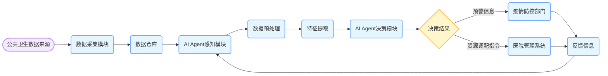

# AI Agent在智能公共卫生管理中的角色

> 关键词：AI Agent、智能公共卫生管理、医疗决策支持、疫情监测、资源分配

> 摘要：本文聚焦于AI Agent在智能公共卫生管理中的角色。首先介绍了相关背景，包括目的、预期读者等内容。接着阐述了AI Agent和智能公共卫生管理的核心概念及联系，通过文本示意图和Mermaid流程图进行了清晰展示。深入讲解了AI Agent相关的核心算法原理，并用Python代码详细阐述，同时给出了对应的数学模型和公式。通过项目实战，呈现了代码实际案例并进行详细解释。探讨了AI Agent在智能公共卫生管理中的实际应用场景，推荐了相关的学习资源、开发工具框架以及论文著作。最后总结了未来发展趋势与挑战，提供了常见问题与解答以及扩展阅读和参考资料，旨在全面深入地剖析AI Agent在智能公共卫生管理中的重要作用和价值。

## 1. 背景介绍 
### 1.1 目的和范围
随着全球人口的增长、城市化进程的加速以及传染病的不断出现和传播，公共卫生管理面临着越来越多的挑战。传统的公共卫生管理方式在处理海量数据、快速决策和实时监测等方面存在一定的局限性。AI Agent作为一种具有自主学习、决策和执行能力的智能体，为解决这些问题提供了新的思路和方法。本文的目的在于深入探讨AI Agent在智能公共卫生管理中的角色和作用，范围涵盖AI Agent在疫情监测、医疗决策支持、资源分配等多个方面的应用。

### 1.2 预期读者
本文预期读者包括公共卫生领域的专业人员，如公共卫生管理者、流行病学家、医护人员等，他们可以通过本文了解AI Agent在公共卫生管理中的应用，为实际工作提供参考。同时，计算机科学和人工智能领域的研究人员和开发者也可以从中获取相关的技术思路和应用场景，推动AI Agent技术在公共卫生领域的进一步发展。此外，对智能公共卫生管理感兴趣的普通读者也能通过本文了解到相关的前沿知识。

### 1.3 文档结构概述
本文首先介绍了研究的背景，包括目的、预期读者和文档结构概述等内容。接着详细阐述了AI Agent和智能公共卫生管理的核心概念及它们之间的联系，并通过文本示意图和Mermaid流程图进行展示。然后深入讲解了AI Agent的核心算法原理，用Python代码进行详细阐述，同时给出了对应的数学模型和公式。通过项目实战，给出了代码实际案例并进行详细解释。之后探讨了AI Agent在智能公共卫生管理中的实际应用场景。推荐了相关的学习资源、开发工具框架以及论文著作。最后总结了未来发展趋势与挑战，提供了常见问题与解答以及扩展阅读和参考资料。

### 1.4 术语表
#### 1.4.1 核心术语定义
- **AI Agent（人工智能智能体）**：是一种能够感知环境、根据自身的知识和目标进行决策，并采取行动以实现目标的智能实体。它可以是软件程序、机器人等形式。
- **智能公共卫生管理**：利用先进的信息技术和人工智能等手段，对公共卫生领域的各种数据进行收集、分析和处理，以实现高效、精准的公共卫生决策和管理。
- **疫情监测**：对传染病的发生、发展和传播情况进行实时监测和预警，以便及时采取防控措施。
- **医疗决策支持**：利用人工智能技术为医护人员提供诊断、治疗方案等方面的决策建议，辅助医疗决策。
- **资源分配**：根据公共卫生需求，合理分配医疗资源、人力等，以提高资源利用效率。

#### 1.4.2 相关概念解释
- **机器学习**：是AI Agent实现自主学习的重要技术手段，通过对大量数据的学习和分析，使AI Agent能够发现数据中的规律和模式，从而提高其决策和执行能力。
- **深度学习**：是机器学习的一个分支，通过构建深度神经网络模型，对数据进行更复杂的特征提取和分析，在图像识别、自然语言处理等领域取得了显著的成果。
- **大数据**：公共卫生领域产生了大量的数据，如医疗记录、疫情报告等，大数据技术可以对这些海量数据进行存储、管理和分析，为AI Agent提供丰富的信息来源。

#### 1.4.3 缩略词列表
- **AI**：Artificial Intelligence（人工智能）
- **ML**：Machine Learning（机器学习）
- **DL**：Deep Learning（深度学习）
- **EHR**：Electronic Health Record（电子健康记录）

## 2. 核心概念与联系 
### 核心概念原理
#### AI Agent原理
AI Agent通常由感知模块、决策模块和执行模块组成。感知模块负责收集环境信息，如公共卫生领域中的疫情数据、医疗资源数据等。决策模块根据感知到的信息和自身的知识、目标，运用一定的算法进行决策，例如判断疫情的发展趋势、确定最佳的防控策略等。执行模块则根据决策结果采取相应的行动，如发送预警信息、调配医疗资源等。

#### 智能公共卫生管理原理
智能公共卫生管理是一个综合性的管理体系，它整合了公共卫生领域的各种数据和信息，利用先进的信息技术和人工智能手段，对这些数据进行分析和处理，以实现公共卫生管理的智能化、精准化和高效化。其核心在于通过数据驱动的决策，提高公共卫生管理的水平和效果。

### 架构的文本示意图
AI Agent在智能公共卫生管理中的架构可以描述如下：

公共卫生数据来源包括医院信息系统、疾病监测系统、社交媒体等。这些数据通过数据采集模块收集到数据仓库中进行存储和管理。AI Agent的感知模块从数据仓库中获取数据，对其进行预处理和特征提取。决策模块利用机器学习、深度学习等算法对处理后的数据进行分析和建模，生成决策结果。执行模块根据决策结果与公共卫生管理系统进行交互，如向疫情防控部门发送预警信息、向医院管理系统发送资源调配指令等。同时，AI Agent会不断地从环境中获取反馈信息，对自身的决策和行为进行调整和优化。

### Mermaid流程图


## 3. 核心算法原理 & 具体操作步骤 
### 核心算法原理
在AI Agent应用于智能公共卫生管理中，机器学习算法起着关键作用。以监督学习中的逻辑回归算法为例，它可以用于预测疫情的发生概率。逻辑回归是一种用于二分类问题的算法，通过对输入特征进行线性组合，然后通过逻辑函数将其映射到[0, 1]区间，得到事件发生的概率。

### Python源代码详细阐述
```python
import numpy as np
from sklearn.linear_model import LogisticRegression
from sklearn.model_selection import train_test_split
from sklearn.metrics import accuracy_score

# 生成示例数据
np.random.seed(42)
X = np.random.randn(100, 5)  # 100个样本，每个样本有5个特征
y = np.random.randint(0, 2, 100)  # 二分类标签

# 划分训练集和测试集
X_train, X_test, y_train, y_test = train_test_split(X, y, test_size=0.2, random_state=42)

# 创建逻辑回归模型
model = LogisticRegression()

# 训练模型
model.fit(X_train, y_train)

# 预测
y_pred = model.predict(X_test)

# 计算准确率
accuracy = accuracy_score(y_test, y_pred)
print(f"模型准确率: {accuracy}")
```
### 具体操作步骤
1. **数据准备**：收集公共卫生相关的数据，如人口统计信息、疾病症状、环境因素等，并进行数据清洗和预处理，确保数据的质量和可用性。
2. **特征选择**：从原始数据中选择与预测目标相关的特征，去除冗余和无关的特征，以提高模型的效率和准确性。
3. **模型训练**：使用训练数据对逻辑回归模型进行训练，通过优化模型的参数，使模型能够更好地拟合数据。
4. **模型评估**：使用测试数据对训练好的模型进行评估，计算模型的准确率、召回率、F1值等指标，评估模型的性能。
5. **模型应用**：将训练好的模型应用到实际的公共卫生管理中，进行疫情预测、风险评估等任务。

## 4. 数学模型和公式 & 详细讲解 & 举例说明 
### 逻辑回归数学模型
逻辑回归的数学模型可以表示为：

$$P(y = 1|x) = \frac{1}{1 + e^{-z}}$$

其中，$P(y = 1|x)$ 表示在输入特征 $x$ 的条件下，事件 $y = 1$ 发生的概率，$z$ 是线性组合：

$$z = \theta_0 + \theta_1x_1 + \theta_2x_2 + \cdots + \theta_nx_n$$

$\theta_0, \theta_1, \cdots, \theta_n$ 是模型的参数，$x_1, x_2, \cdots, x_n$ 是输入特征。

### 详细讲解
逻辑回归的核心思想是通过线性组合将输入特征映射到一个实数 $z$，然后通过逻辑函数（也称为 sigmoid 函数）将 $z$ 映射到[0, 1]区间，得到事件发生的概率。逻辑函数的特点是在 $z = 0$ 处取值为 0.5，当 $z$ 趋近于正无穷时，概率趋近于 1；当 $z$ 趋近于负无穷时，概率趋近于 0。

### 举例说明
假设我们要预测某地区是否会发生疫情，输入特征包括该地区的人口密度、卫生条件、平均气温等。我们可以使用逻辑回归模型对这些特征进行分析，得到该地区发生疫情的概率。例如，如果计算得到的概率为 0.8，那么我们可以认为该地区有 80% 的可能性会发生疫情。

## 5. 项目实战：代码实际案例和详细解释说明 
### 5.1  开发环境搭建
- **操作系统**：推荐使用 Linux 或 macOS 系统，也可以使用 Windows 系统。
- **Python 环境**：安装 Python 3.7 及以上版本。
- **开发工具**：可以使用 PyCharm、Jupyter Notebook 等开发工具。
- **依赖库安装**：安装必要的 Python 库，如 numpy、pandas、scikit-learn 等。可以使用以下命令进行安装：
```sh
pip install numpy pandas scikit-learn
```

### 5.2  源代码详细实现和代码解读
```python
import numpy as np
import pandas as pd
from sklearn.model_selection import train_test_split
from sklearn.linear_model import LogisticRegression
from sklearn.metrics import accuracy_score

# 读取数据
data = pd.read_csv('public_health_data.csv')

# 分离特征和标签
X = data.drop('label', axis=1)
y = data['label']

# 划分训练集和测试集
X_train, X_test, y_train, y_test = train_test_split(X, y, test_size=0.2, random_state=42)

# 创建逻辑回归模型
model = LogisticRegression()

# 训练模型
model.fit(X_train, y_train)

# 预测
y_pred = model.predict(X_test)

# 计算准确率
accuracy = accuracy_score(y_test, y_pred)
print(f"模型准确率: {accuracy}")
```
### 代码解读与分析
1. **数据读取**：使用 `pandas` 库的 `read_csv` 函数读取公共卫生数据文件。
2. **特征和标签分离**：将数据集中的特征和标签分离，`X` 表示特征矩阵，`y` 表示标签向量。
3. **数据集划分**：使用 `train_test_split` 函数将数据集划分为训练集和测试集，其中测试集占比为 20%。
4. **模型创建**：创建逻辑回归模型对象。
5. **模型训练**：使用训练集数据对模型进行训练。
6. **模型预测**：使用训练好的模型对测试集数据进行预测。
7. **准确率计算**：使用 `accuracy_score` 函数计算模型的准确率，并输出结果。

## 6. 实际应用场景 
### 疫情监测与预警
AI Agent可以实时收集和分析来自多个数据源的疫情数据，如医院的病例报告、社交媒体的舆情信息等。通过对这些数据的分析，AI Agent可以及时发现疫情的潜在风险和传播趋势，提前发出预警信息，为公共卫生部门采取防控措施提供决策支持。

### 医疗决策支持
在临床诊断和治疗过程中，AI Agent可以根据患者的电子健康记录、症状表现等信息，利用机器学习和医学知识图谱等技术，为医护人员提供诊断建议和治疗方案推荐。例如，对于疑难病症，AI Agent可以快速分析大量的医学文献和病例数据，为医生提供参考。

### 资源分配优化
AI Agent可以根据疫情的发展情况和医疗需求，对医疗资源进行合理分配。例如，根据不同地区的疫情严重程度，调配医疗设备、药品和医护人员等资源，提高资源的利用效率，确保医疗服务的公平性和可及性。

### 疾病预防与健康管理
AI Agent可以通过对人群的健康数据进行分析，识别出高风险人群，并提供个性化的健康建议和预防措施。例如，针对患有慢性疾病的人群，AI Agent可以提醒他们按时服药、定期体检等，促进人群的健康管理。

## 7. 工具和资源推荐
### 7.1 学习资源推荐
#### 7.1.1 书籍推荐
- 《Python机器学习》：这本书详细介绍了Python在机器学习领域的应用，包括各种机器学习算法的原理和实现，适合初学者入门。
- 《深度学习》：由深度学习领域的三位先驱 Ian Goodfellow、Yoshua Bengio 和 Aaron Courville 合著，是深度学习领域的经典教材。
- 《人工智能：一种现代的方法》：全面介绍了人工智能的各个领域，包括搜索算法、知识表示、机器学习等，是人工智能领域的权威书籍。

#### 7.1.2 在线课程
- Coursera 上的《机器学习》课程：由 Andrew Ng 教授主讲，是机器学习领域的经典课程，课程内容丰富，讲解清晰。
- edX 上的《深度学习》课程：由知名学者授课，深入介绍了深度学习的原理和应用。
- 中国大学MOOC上的《人工智能基础》课程：适合国内学习者，课程内容结合了国内的教学特点。

#### 7.1.3 技术博客和网站
- Medium：上面有很多关于人工智能和机器学习的优质博客文章，作者来自不同的领域，分享了他们的实践经验和研究成果。
- Towards Data Science：专注于数据科学和机器学习领域，提供了大量的技术文章和案例分析。
- 开源中国：国内知名的技术社区，有很多关于人工智能和公共卫生领域的技术讨论和分享。

### 7.2 开发工具框架推荐
#### 7.2.1 IDE和编辑器
- PyCharm：是一款专门为Python开发设计的集成开发环境，具有强大的代码编辑、调试和自动补全功能。
- Jupyter Notebook：是一个交互式的开发环境，适合进行数据探索和模型实验，支持多种编程语言。
- Visual Studio Code：是一款轻量级的代码编辑器，支持多种编程语言和插件，具有丰富的扩展功能。

#### 7.2.2 调试和性能分析工具
- PDB：Python自带的调试器，可以帮助开发者调试Python代码，定位问题。
- cProfile：Python的性能分析工具，可以分析代码的执行时间和资源消耗情况，帮助优化代码性能。
- TensorBoard：是TensorFlow的可视化工具，可以用于可视化模型的训练过程和性能指标。

#### 7.2.3 相关框架和库
- TensorFlow：是一个开源的深度学习框架，由Google开发，提供了丰富的深度学习模型和工具。
- PyTorch：是另一个流行的深度学习框架，具有动态计算图的特点，适合快速迭代和实验。
- scikit-learn：是一个Python的机器学习库，提供了各种机器学习算法和工具，方便开发者进行机器学习任务。

### 7.3 相关论文著作推荐
#### 7.3.1 经典论文
- “ImageNet Classification with Deep Convolutional Neural Networks”：这篇论文介绍了AlexNet模型，开启了深度学习在计算机视觉领域的革命。
- “Long Short-Term Memory”：详细介绍了长短期记忆网络（LSTM）的原理和应用，是循环神经网络领域的经典论文。
- “Attention Is All You Need”：提出了Transformer模型，在自然语言处理领域取得了巨大的成功。

#### 7.3.2 最新研究成果
- 可以关注顶级学术会议如NeurIPS、ICML、CVPR等的最新研究成果，了解AI Agent在公共卫生管理领域的前沿技术和应用。
- 一些知名学术期刊如《Artificial Intelligence in Medicine》《Journal of Biomedical Informatics》等也会发表相关的研究论文。

#### 7.3.3 应用案例分析
- 可以参考一些实际的应用案例，如某地区利用AI Agent进行疫情监测和防控的案例分析，了解AI Agent在实际应用中的效果和挑战。

## 8. 总结：未来发展趋势与挑战
### 未来发展趋势
- **多智能体协作**：未来，多个AI Agent可以相互协作，共同完成复杂的公共卫生管理任务。例如，不同功能的AI Agent可以在疫情监测、医疗决策支持和资源分配等方面进行协同工作，提高公共卫生管理的效率和效果。
- **融合更多技术**：AI Agent将与物联网、区块链等技术深度融合。物联网可以提供更丰富的实时数据，区块链可以保证数据的安全性和可信度，从而进一步提升AI Agent在公共卫生管理中的应用价值。
- **个性化公共卫生服务**：基于个体的健康数据和行为习惯，AI Agent可以提供个性化的公共卫生服务，如个性化的疾病预防方案、健康管理建议等，提高公共卫生服务的针对性和有效性。

### 挑战
- **数据隐私和安全**：公共卫生数据包含大量的个人敏感信息，如医疗记录、健康状况等。如何保证这些数据的隐私和安全，防止数据泄露和滥用，是AI Agent应用面临的重要挑战。
- **算法可解释性**：许多AI Agent使用的机器学习和深度学习算法是黑盒模型，其决策过程难以解释。在公共卫生管理中，这可能会导致医生和患者对AI Agent的决策结果缺乏信任，影响其应用效果。
- **伦理和法律问题**：AI Agent在公共卫生管理中的应用可能会引发一系列伦理和法律问题，如责任界定、公平性等。如何制定相应的伦理和法律准则，规范AI Agent的应用，是需要解决的问题。

## 9. 附录：常见问题与解答
### 1. AI Agent在公共卫生管理中的应用是否会取代人类的工作？
不会。AI Agent在公共卫生管理中主要起到辅助作用，它可以帮助人类处理大量的数据和复杂的任务，提高工作效率和决策的准确性。但人类的专业知识、经验和判断力仍然是不可替代的，特别是在涉及到伦理、法律和人文关怀等方面。

### 2. 如何保证AI Agent使用的数据的质量和准确性？
可以通过建立严格的数据采集、清洗和验证机制来保证数据的质量和准确性。在数据采集阶段，要确保数据来源的可靠性和规范性。在数据清洗阶段，要去除噪声数据和错误数据。在数据验证阶段，要对数据进行交叉验证和一致性检查。

### 3. AI Agent的决策结果是否一定准确？
不是。AI Agent的决策结果是基于其学习的模型和数据，存在一定的误差和不确定性。模型的准确性受到数据质量、算法选择和参数调整等多种因素的影响。因此，在实际应用中，需要对AI Agent的决策结果进行评估和验证，结合人类的专业判断进行综合决策。

## 10. 扩展阅读 & 参考资料
### 扩展阅读
- 《AI未来进行式》：这本书探讨了人工智能在各个领域的应用和发展趋势，包括公共卫生领域，可以帮助读者更全面地了解AI Agent的发展前景。
- 《数字医疗革命》：介绍了信息技术在医疗领域的应用和变革，对于理解AI Agent在智能公共卫生管理中的作用有一定的帮助。

### 参考资料
- 相关的学术论文和研究报告，如IEEE、ACM等学术组织发表的关于AI Agent和公共卫生管理的论文。
- 政府部门和国际组织发布的公共卫生政策和报告，如世界卫生组织（WHO）的相关报告。
- 开源项目和代码库，如GitHub上关于AI Agent在公共卫生领域应用的开源项目。