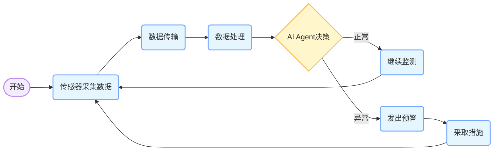

# AI Agent在智能地下管网监测中的实践

> 关键词：AI Agent、智能地下管网监测、传感器网络、数据分析、决策优化、实时监测、故障预警

> 摘要：本文聚焦于AI Agent在智能地下管网监测中的实践应用。首先介绍了智能地下管网监测的背景和意义，阐述了AI Agent的核心概念及其与管网监测的联系。接着详细讲解了AI Agent相关的核心算法原理，通过Python代码进行了具体步骤的演示。深入探讨了其中涉及的数学模型和公式，并结合实例说明。在项目实战部分，给出了开发环境搭建、源代码实现及解读。同时分析了AI Agent在智能地下管网监测中的实际应用场景，推荐了相关的学习资源、开发工具框架和论文著作。最后总结了未来发展趋势与挑战，并对常见问题进行了解答，还提供了扩展阅读和参考资料，旨在为相关领域的研究和实践提供全面且深入的参考。

## 1. 背景介绍 
### 1.1 目的和范围
智能地下管网是城市基础设施的重要组成部分，涵盖了供水、排水、燃气、热力、电力、通信等多个系统。其运行状况直接关系到城市的正常运转和居民的生活质量。然而，地下管网具有隐蔽性强、分布范围广、运行环境复杂等特点，传统的监测和管理方式存在效率低、实时性差、难以全面掌握管网状态等问题。

本文的目的在于探讨如何利用AI Agent技术提升智能地下管网监测的效率和准确性，实现对管网运行状态的实时监测、故障预警和决策优化。范围包括AI Agent在地下管网监测中的核心概念、算法原理、数学模型、项目实战以及实际应用场景等方面的内容。

### 1.2 预期读者
本文预期读者包括从事智能地下管网监测相关领域的研究人员、工程师、技术开发者，以及对人工智能技术在基础设施领域应用感兴趣的专业人士和爱好者。

### 1.3 文档结构概述
本文首先介绍背景信息，包括目的、预期读者和文档结构概述等。接着阐述AI Agent的核心概念及其与智能地下管网监测的联系，展示相关的原理和架构示意图及流程图。然后详细讲解核心算法原理和具体操作步骤，给出Python代码示例。之后深入探讨数学模型和公式，并举例说明。在项目实战部分，从开发环境搭建、源代码实现到代码解读进行全面阐述。再分析AI Agent在智能地下管网监测中的实际应用场景。推荐相关的学习资源、开发工具框架和论文著作。最后总结未来发展趋势与挑战，解答常见问题，并提供扩展阅读和参考资料。

### 1.4 术语表
#### 1.4.1 核心术语定义
- **AI Agent（人工智能智能体）**：是一种能够感知环境、根据内部状态和目标进行决策，并通过执行器对环境产生影响的智能实体。在智能地下管网监测中，AI Agent可以接收传感器数据，进行分析和决策，实现对管网的监测和控制。
- **智能地下管网监测**：利用先进的传感器技术、通信技术和信息技术，对地下管网的运行状态进行实时监测、数据采集、分析和处理，以保障管网的安全、高效运行。
- **传感器网络**：由大量的传感器节点组成，分布在地下管网的各个位置，用于实时采集管网的各种参数，如压力、流量、温度、湿度等。

#### 1.4.2 相关概念解释
- **数据融合**：将来自多个传感器的不同类型的数据进行综合处理，以获取更准确、全面的信息。在智能地下管网监测中，数据融合可以提高对管网状态的判断准确性。
- **故障预警**：通过对监测数据的分析和处理，提前发现管网可能存在的故障隐患，并及时发出警报，以便采取相应的措施进行处理。
- **决策优化**：根据监测数据和分析结果，利用AI Agent的决策能力，制定最优的管网运行策略和维护方案。

#### 1.4.3 缩略词列表
- **IoT（Internet of Things）**：物联网
- **GIS（Geographic Information System）**：地理信息系统
- **ML（Machine Learning）**：机器学习
- **DL（Deep Learning）**：深度学习

## 2. 核心概念与联系 

### 核心概念原理
AI Agent在智能地下管网监测中的核心原理是基于感知 - 决策 - 行动的循环过程。AI Agent通过传感器网络感知地下管网的运行状态，将获取的数据进行处理和分析，根据预设的目标和规则进行决策，然后通过执行器对管网进行相应的控制和调节。

AI Agent可以分为反应式智能体和基于模型的智能体。反应式智能体根据当前的感知信息直接做出决策，而基于模型的智能体则会考虑历史数据和环境模型，做出更全面、更准确的决策。

### 架构的文本示意图
智能地下管网监测系统的整体架构包括传感器层、数据传输层、数据处理层、AI Agent层和应用层。

- **传感器层**：由各种类型的传感器组成，如压力传感器、流量传感器、温度传感器等，负责实时采集地下管网的运行参数。
- **数据传输层**：将传感器采集的数据通过有线或无线通信网络传输到数据处理中心。
- **数据处理层**：对传输过来的数据进行清洗、预处理和存储，为后续的分析和决策提供基础。
- **AI Agent层**：是整个系统的核心，AI Agent接收数据处理层的数据，进行分析和决策，根据决策结果向执行器发送控制指令。
- **应用层**：将AI Agent的决策结果以直观的方式呈现给用户，如监控界面、报表等，同时为用户提供交互功能，方便用户进行管理和操作。

### Mermaid 流程图


## 3. 核心算法原理 & 具体操作步骤 

### 核心算法原理
在智能地下管网监测中，AI Agent常用的算法包括机器学习算法和深度学习算法。这里以基于机器学习的故障预测算法为例进行讲解。

机器学习算法的基本思想是通过对历史数据的学习，建立故障预测模型。常用的机器学习算法有决策树、支持向量机、神经网络等。以决策树算法为例，决策树是一种基于树结构进行决策的算法，每个内部节点是一个属性上的测试，每个分支是一个测试输出，每个叶节点是一个类别或值。

### 具体操作步骤及Python源代码
以下是一个使用Python实现基于决策树算法的故障预测示例：

```python
import pandas as pd
from sklearn.model_selection import train_test_split
from sklearn.tree import DecisionTreeClassifier
from sklearn.metrics import accuracy_score

# 步骤1：数据加载
data = pd.read_csv('pipeline_data.csv')  # 假设数据存储在pipeline_data.csv文件中

# 步骤2：数据预处理
X = data.drop('fault_label', axis=1)  # 特征数据
y = data['fault_label']  # 标签数据

# 步骤3：数据集划分
X_train, X_test, y_train, y_test = train_test_split(X, y, test_size=0.2, random_state=42)

# 步骤4：模型训练
model = DecisionTreeClassifier()
model.fit(X_train, y_train)

# 步骤5：模型预测
y_pred = model.predict(X_test)

# 步骤6：模型评估
accuracy = accuracy_score(y_test, y_pred)
print(f"模型准确率: {accuracy}")
```

### 代码解释
1. **数据加载**：使用`pandas`库读取存储在`pipeline_data.csv`文件中的管网监测数据。
2. **数据预处理**：将特征数据和标签数据分离，`fault_label`表示故障标签。
3. **数据集划分**：使用`train_test_split`函数将数据集划分为训练集和测试集，测试集占比20%。
4. **模型训练**：创建决策树分类器模型，并使用训练集数据进行训练。
5. **模型预测**：使用训练好的模型对测试集数据进行预测。
6. **模型评估**：使用`accuracy_score`函数计算模型的准确率。

## 4. 数学模型和公式 & 详细讲解 & 举例说明 

### 数学模型
在基于机器学习的故障预测中，决策树算法的数学模型可以用决策树的结构来表示。决策树是一个有向无环图，每个内部节点对应一个属性上的测试，每个分支对应一个测试输出，每个叶节点对应一个类别或值。

### 公式
决策树的构建过程通常基于信息增益或基尼不纯度等指标。以信息增益为例，信息增益的计算公式为：

$$IG(S,A)=H(S)-\sum_{v\in Values(A)}\frac{|S_v|}{|S|}H(S_v)$$

其中：
- $IG(S,A)$ 表示在数据集 $S$ 上属性 $A$ 的信息增益。
- $H(S)$ 表示数据集 $S$ 的信息熵，计算公式为：

$$H(S)=-\sum_{i=1}^{n}p_i\log_2(p_i)$$

其中 $p_i$ 表示数据集 $S$ 中第 $i$ 个类别的概率。
- $S_v$ 表示数据集 $S$ 中属性 $A$ 取值为 $v$ 的子集。
- $|S|$ 表示数据集 $S$ 的样本数量，$|S_v|$ 表示子集 $S_v$ 的样本数量。

### 详细讲解
信息增益的意义在于衡量使用某个属性进行划分后，数据集的不确定性减少的程度。信息增益越大，说明使用该属性进行划分越能提高分类的准确性。

### 举例说明
假设有一个数据集 $S$ 包含10个样本，其中6个属于类别 $C_1$，4个属于类别 $C_2$。则数据集 $S$ 的信息熵为：

$$H(S)=-\frac{6}{10}\log_2(\frac{6}{10})-\frac{4}{10}\log_2(\frac{4}{10})\approx 0.971$$

假设有一个属性 $A$，其取值有 $v_1$ 和 $v_2$ 两种。$S_{v_1}$ 包含4个样本，其中3个属于类别 $C_1$，1个属于类别 $C_2$；$S_{v_2}$ 包含6个样本，其中3个属于类别 $C_1$，3个属于类别 $C_2$。

则 $S_{v_1}$ 的信息熵为：

$$H(S_{v_1})=-\frac{3}{4}\log_2(\frac{3}{4})-\frac{1}{4}\log_2(\frac{1}{4})\approx 0.811$$

$S_{v_2}$ 的信息熵为：

$$H(S_{v_2})=-\frac{3}{6}\log_2(\frac{3}{6})-\frac{3}{6}\log_2(\frac{3}{6}) = 1$$

属性 $A$ 的信息增益为：

$$IG(S,A)=0.971-\frac{4}{10}\times 0.811-\frac{6}{10}\times 1\approx 0.0466$$

## 5. 项目实战：代码实际案例和详细解释说明 

### 5.1  开发环境搭建
- **操作系统**：推荐使用Linux系统，如Ubuntu 18.04及以上版本，也可以使用Windows 10系统。
- **Python环境**：安装Python 3.7及以上版本。可以使用Anaconda来管理Python环境，方便安装各种依赖库。
- **依赖库安装**：使用`pip`或`conda`安装所需的依赖库，包括`pandas`、`scikit-learn`、`numpy`等。

```bash
# 使用pip安装依赖库
pip install pandas scikit-learn numpy
```

### 5.2  源代码详细实现和代码解读
以下是一个完整的智能地下管网监测系统的Python代码示例，包括数据加载、预处理、模型训练、预测和结果可视化：

```python
import pandas as pd
import numpy as np
from sklearn.model_selection import train_test_split
from sklearn.tree import DecisionTreeClassifier
from sklearn.metrics import accuracy_score
import matplotlib.pyplot as plt

# 步骤1：数据加载
data = pd.read_csv('pipeline_data.csv')

# 步骤2：数据预处理
X = data.drop('fault_label', axis=1)
y = data['fault_label']

# 步骤3：数据集划分
X_train, X_test, y_train, y_test = train_test_split(X, y, test_size=0.2, random_state=42)

# 步骤4：模型训练
model = DecisionTreeClassifier()
model.fit(X_train, y_train)

# 步骤5：模型预测
y_pred = model.predict(X_test)

# 步骤6：模型评估
accuracy = accuracy_score(y_test, y_pred)
print(f"模型准确率: {accuracy}")

# 步骤7：结果可视化
plt.figure(figsize=(10, 6))
plt.plot(np.arange(len(y_test)), y_test, label='真实标签')
plt.plot(np.arange(len(y_pred)), y_pred, label='预测标签')
plt.xlabel('样本编号')
plt.ylabel('故障标签')
plt.title('故障预测结果可视化')
plt.legend()
plt.show()
```

### 代码解读与分析
1. **数据加载**：使用`pandas`库的`read_csv`函数读取存储在`pipeline_data.csv`文件中的管网监测数据。
2. **数据预处理**：将特征数据和标签数据分离，`fault_label`表示故障标签。
3. **数据集划分**：使用`train_test_split`函数将数据集划分为训练集和测试集，测试集占比20%。
4. **模型训练**：创建决策树分类器模型，并使用训练集数据进行训练。
5. **模型预测**：使用训练好的模型对测试集数据进行预测。
6. **模型评估**：使用`accuracy_score`函数计算模型的准确率。
7. **结果可视化**：使用`matplotlib`库绘制真实标签和预测标签的折线图，直观展示模型的预测结果。

## 6. 实际应用场景 
### 实时监测
AI Agent可以实时接收传感器网络采集的地下管网运行数据，对管网的压力、流量、温度等参数进行实时监测。一旦发现参数异常，AI Agent可以立即发出预警，通知相关人员进行处理。

### 故障预警
通过对历史数据的学习和分析，AI Agent可以建立故障预测模型，提前发现管网可能存在的故障隐患。例如，当管网的压力突然下降或流量异常增大时，AI Agent可以预测可能存在管道泄漏故障，并及时发出警报。

### 决策优化
AI Agent可以根据实时监测数据和故障预警信息，结合预设的目标和规则，制定最优的管网运行策略和维护方案。例如，当某个区域的管网压力过高时，AI Agent可以自动调节阀门开度，降低压力，保障管网的安全运行。

### 资产维护管理
AI Agent可以对地下管网的资产信息进行管理，包括管道的材质、规格、安装时间等。通过对资产信息的分析和预测，AI Agent可以制定合理的维护计划，延长管网的使用寿命，降低维护成本。

## 7. 工具和资源推荐
### 7.1 学习资源推荐
#### 7.1.1 书籍推荐
- 《机器学习》（周志华著）：全面介绍了机器学习的基本概念、算法和应用，是机器学习领域的经典教材。
- 《深度学习》（Ian Goodfellow、Yoshua Bengio和Aaron Courville著）：深入探讨了深度学习的原理和方法，是深度学习领域的权威著作。
- 《Python机器学习实战》（Sebastian Raschka著）：结合Python代码，详细介绍了机器学习的实际应用，适合初学者学习。

#### 7.1.2 在线课程
- Coursera平台上的“Machine Learning”（Andrew Ng教授授课）：是机器学习领域的经典在线课程，内容全面，讲解深入浅出。
- edX平台上的“Introduction to Artificial Intelligence”：介绍了人工智能的基本概念、算法和应用，对AI Agent的学习有很大帮助。
- 中国大学MOOC平台上的“人工智能基础”：由国内知名高校的教授授课，内容丰富，适合初学者入门。

#### 7.1.3 技术博客和网站
- Medium：有很多关于人工智能和机器学习的技术博客，其中不乏AI Agent在各个领域应用的案例和经验分享。
- Towards Data Science：专注于数据科学和机器学习领域的技术文章，提供了很多实用的算法和代码示例。
- 机器之心：国内知名的人工智能媒体平台，及时报道人工智能领域的最新技术和应用案例。

### 7.2 开发工具框架推荐
#### 7.2.1 IDE和编辑器
- PyCharm：是一款专门为Python开发设计的集成开发环境，功能强大，提供了代码编辑、调试、版本控制等多种功能。
- Visual Studio Code：是一款轻量级的代码编辑器，支持多种编程语言，有丰富的插件扩展功能，适合快速开发和调试。

#### 7.2.2 调试和性能分析工具
- PDB：Python自带的调试工具，可以在代码中设置断点，逐步执行代码，方便查找和解决问题。
- cProfile：Python的性能分析工具，可以分析代码的运行时间和函数调用情况，帮助优化代码性能。

#### 7.2.3 相关框架和库
- Scikit-learn：是Python中常用的机器学习库，提供了丰富的机器学习算法和工具，方便进行模型训练和评估。
- TensorFlow：是Google开发的深度学习框架，支持多种深度学习模型的构建和训练，具有高效的计算性能。
- PyTorch：是Facebook开发的深度学习框架，具有动态图机制，易于使用和调试，适合快速迭代开发。

### 7.3 相关论文著作推荐
#### 7.3.1 经典论文
- “A Rational Agent Architecture for Intelligent Tutoring Systems”：提出了一种基于AI Agent的智能辅导系统架构，对AI Agent的设计和应用有重要的参考价值。
- “Multi-Agent Systems: A Modern Approach to Distributed Artificial Intelligence”：系统介绍了多智能体系统的理论和方法，是多智能体系统领域的经典著作。

#### 7.3.2 最新研究成果
- 关注顶级学术会议如AAAI（Association for the Advancement of Artificial Intelligence）、IJCAI（International Joint Conference on Artificial Intelligence）等的最新论文，了解AI Agent在智能地下管网监测等领域的最新研究进展。

#### 7.3.3 应用案例分析
- 查阅相关的行业报告和案例分析，了解AI Agent在国内外智能地下管网监测项目中的实际应用情况和效果。

## 8. 总结：未来发展趋势与挑战
### 未来发展趋势
- **多智能体协同**：未来的智能地下管网监测系统将采用多智能体协同的方式，不同类型的AI Agent可以协同工作，实现更高效、更智能的监测和管理。例如，监测智能体负责数据采集和分析，决策智能体负责制定策略，执行智能体负责控制管网设备。
- **与物联网和大数据的深度融合**：随着物联网技术的发展，地下管网将部署更多的传感器，产生海量的数据。AI Agent将与物联网和大数据技术深度融合，实现对海量数据的实时处理和分析，挖掘更多有价值的信息。
- **智能化决策**：AI Agent将不断学习和进化，具备更强的智能化决策能力。可以根据不同的场景和需求，自动调整监测策略和决策方案，实现更精准、更优化的管网运行管理。

### 挑战
- **数据质量和安全**：地下管网监测数据的质量直接影响AI Agent的决策准确性。同时，数据的安全也是一个重要问题，需要采取有效的措施保障数据的完整性、保密性和可用性。
- **算法复杂度和计算资源**：随着AI Agent功能的不断增强，算法复杂度也会不断提高，对计算资源的需求也会增加。如何在有限的计算资源下实现高效的算法运行是一个挑战。
- **标准和规范缺失**：目前，智能地下管网监测领域还缺乏统一的标准和规范，这给AI Agent的开发和应用带来了一定的困难。需要加快标准和规范的制定，促进AI Agent在智能地下管网监测中的推广和应用。

## 9. 附录：常见问题与解答
### 问题1：AI Agent在智能地下管网监测中需要哪些类型的传感器？
答：AI Agent在智能地下管网监测中需要多种类型的传感器，包括压力传感器、流量传感器、温度传感器、湿度传感器、气体传感器等。不同类型的传感器可以采集不同的管网运行参数，为AI Agent的决策提供全面的数据支持。

### 问题2：如何提高AI Agent在智能地下管网监测中的决策准确性？
答：可以从以下几个方面提高AI Agent的决策准确性：
- 提高数据质量：确保传感器采集的数据准确、可靠，对数据进行有效的清洗和预处理。
- 优化算法模型：选择合适的算法模型，并对模型进行调优和训练，提高模型的准确性和泛化能力。
- 引入多源数据：除了传感器数据外，还可以引入地理信息、气象数据等多源数据，丰富AI Agent的决策依据。

### 问题3：AI Agent在智能地下管网监测中的应用成本高吗？
答：AI Agent在智能地下管网监测中的应用成本主要包括传感器设备成本、数据传输成本、计算资源成本和开发维护成本等。随着技术的不断发展和成本的不断降低，AI Agent的应用成本也在逐渐下降。同时，AI Agent的应用可以提高管网监测的效率和准确性，降低管网运行和维护成本，从长远来看具有较高的性价比。

## 10. 扩展阅读 & 参考资料
### 扩展阅读
- 《智能城市：创新、实践与未来》：介绍了智能城市的发展现状和未来趋势，其中涉及到智能地下管网等基础设施的智能化建设。
- 《工业4.0：即将来袭的第四次工业革命》：探讨了工业4.0时代的技术变革和应用，对AI Agent在工业领域的应用有一定的启示。

### 参考资料
- 相关的行业标准和规范，如《城市地下管线探测技术规程》等。
- 国内外智能地下管网监测项目的案例报告和技术文档。
- 学术期刊和会议上发表的关于AI Agent和智能地下管网监测的研究论文。