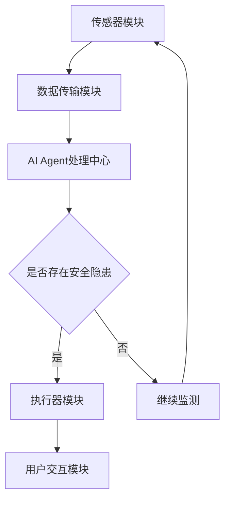

# AI Agent在智能婴儿床中的安全监控

> 关键词：AI Agent、智能婴儿床、安全监控、人工智能、传感器技术、机器学习、物联网

> 摘要：本文聚焦于AI Agent在智能婴儿床安全监控领域的应用。随着科技的飞速发展，智能婴儿床逐渐成为保障婴儿安全与健康的重要设备。AI Agent凭借其强大的感知、决策和执行能力，能够对婴儿的状态进行实时、精准的监测和预警。文章详细介绍了AI Agent的核心概念、相关算法原理、数学模型，通过实际项目案例展示其具体实现和应用，探讨了其在不同场景下的应用价值，并推荐了相关的学习资源、开发工具和研究论文，最后对其未来发展趋势和面临的挑战进行了总结与展望。

## 1. 背景介绍 
### 1.1 目的和范围
智能婴儿床安全监控的目的在于利用先进的技术手段，为婴儿提供一个安全、舒适的睡眠环境。传统的婴儿床仅具备基本的物理功能，无法对婴儿的状态进行实时监测和预警。而AI Agent的引入，使得智能婴儿床能够自动感知婴儿的行为、生理状态等信息，并根据预设的规则和算法进行智能决策，及时发现潜在的安全隐患并采取相应的措施。本文的范围涵盖了AI Agent在智能婴儿床安全监控中的核心概念、算法原理、实际应用等方面，旨在全面介绍这一技术的原理、实现和应用价值。

### 1.2 预期读者
本文预期读者包括对人工智能、物联网、智能家居等领域感兴趣的技术爱好者，从事相关领域研究和开发的科研人员、工程师，以及关注婴儿安全和智能产品的家长和消费者。

### 1.3 文档结构概述
本文首先介绍了AI Agent和智能婴儿床安全监控的背景知识，包括目的、范围、预期读者等内容。接着详细阐述了AI Agent的核心概念和与智能婴儿床安全监控的联系，通过文本示意图和Mermaid流程图进行直观展示。然后讲解了核心算法原理，并使用Python源代码进行详细阐述，同时给出了相关的数学模型和公式。之后通过实际项目案例，介绍了开发环境搭建、源代码实现和代码解读。随后探讨了AI Agent在智能婴儿床安全监控中的实际应用场景。再推荐了相关的学习资源、开发工具和研究论文。最后对AI Agent在智能婴儿床安全监控中的未来发展趋势和面临的挑战进行总结，并提供常见问题与解答以及扩展阅读和参考资料。

### 1.4 术语表
#### 1.4.1 核心术语定义
- **AI Agent（人工智能代理）**：是一种能够感知环境、根据感知信息进行决策，并采取行动以实现特定目标的智能实体。
- **智能婴儿床**：集成了多种传感器和智能设备，能够对婴儿的状态进行监测和控制的婴儿床。
- **安全监控**：通过各种技术手段对婴儿的行为、生理状态等进行实时监测，及时发现并预警潜在的安全隐患。
- **传感器**：能够感知物理量、化学量等信息，并将其转换为电信号或其他形式信号的装置。
- **机器学习**：是一门多领域交叉学科，涉及概率论、统计学、逼近论、凸分析、算法复杂度理论等多门学科。它专门研究计算机怎样模拟或实现人类的学习行为，以获取新的知识或技能，重新组织已有的知识结构使之不断改善自身的性能。

#### 1.4.2 相关概念解释
- **物联网（IoT）**：通过各种信息传感器、射频识别技术、全球定位系统、红外感应器、激光扫描器等各种装置与技术，实时采集任何需要监控、连接、互动的物体或过程，采集其声、光、热、电、力学、化学、生物、位置等各种需要的信息，通过各类可能的网络接入，实现物与物、物与人的泛在连接，实现对物品和过程的智能化感知、识别和管理。在智能婴儿床中，物联网技术用于连接各种传感器和智能设备，实现数据的传输和共享。
- **深度学习**：是机器学习的一个分支领域，它是一种基于对数据进行表征学习的方法。深度学习通过构建具有很多层的神经网络模型，自动从大量数据中学习特征和模式，从而实现对数据的分类、预测等任务。在智能婴儿床安全监控中，深度学习可用于对婴儿的行为和生理状态进行识别和分析。

#### 1.4.3 缩略词列表
- **AI**：Artificial Intelligence（人工智能）
- **IoT**：Internet of Things（物联网）
- **ML**：Machine Learning（机器学习）
- **DL**：Deep Learning（深度学习）

## 2. 核心概念与联系 

### 核心概念原理
AI Agent是一种具有自主性、反应性、社会性和能动性的智能实体。它能够通过传感器感知环境信息，然后根据内部的知识库和算法进行推理和决策，最后通过执行器采取相应的行动。在智能婴儿床安全监控中，AI Agent的工作原理如下：
- **感知层**：智能婴儿床配备了多种传感器，如摄像头、麦克风、温度传感器、湿度传感器、心率传感器等。这些传感器实时采集婴儿的图像、声音、环境温度、湿度、心率等信息，并将其传输给AI Agent。
- **决策层**：AI Agent接收到传感器传来的信息后，对其进行分析和处理。它使用机器学习和深度学习算法对婴儿的行为和生理状态进行识别和判断，例如判断婴儿是否翻身、是否哭闹、心率是否正常等。根据预设的规则和模型，AI Agent做出决策，确定是否存在安全隐患。
- **执行层**：如果AI Agent判断存在安全隐患，它将通过执行器采取相应的措施。例如，发出警报提醒家长，调整婴儿床的温度和湿度，或者自动调整婴儿的睡姿等。

### 架构的文本示意图
智能婴儿床安全监控系统的架构主要包括以下几个部分：
- **传感器模块**：负责采集婴儿的各种信息，如图像、声音、温度、湿度、心率等。
- **数据传输模块**：将传感器采集到的数据传输到AI Agent处理中心。
- **AI Agent处理中心**：对采集到的数据进行分析和处理，做出决策。
- **执行器模块**：根据AI Agent的决策，采取相应的行动，如发出警报、调整环境参数等。
- **用户交互模块**：家长可以通过手机APP或其他终端设备与智能婴儿床进行交互，查看婴儿的状态和控制智能婴儿床的功能。

### Mermaid流程图


## 3. 核心算法原理 & 具体操作步骤 

### 核心算法原理
在智能婴儿床安全监控中，常用的核心算法包括机器学习算法和深度学习算法。下面以基于卷积神经网络（Convolutional Neural Network，CNN）的婴儿行为识别算法为例进行介绍。

#### 卷积神经网络原理
卷积神经网络是一种专门为处理具有网格结构数据（如图像）而设计的深度学习模型。它主要由卷积层、池化层和全连接层组成。
- **卷积层**：通过卷积核在输入数据上滑动，提取数据的特征。卷积核是一个小的矩阵，它与输入数据的局部区域进行卷积运算，得到特征图。
- **池化层**：对卷积层输出的特征图进行下采样，减少数据的维度，同时保留重要的特征信息。常用的池化方法有最大池化和平均池化。
- **全连接层**：将池化层输出的特征图展平成一维向量，然后通过全连接层进行分类或回归任务。

### 具体操作步骤
#### 数据采集
使用摄像头采集婴儿的图像数据，同时标注出婴儿的不同行为，如睡觉、翻身、哭闹等。

#### 数据预处理
对采集到的图像数据进行预处理，包括图像裁剪、缩放、归一化等操作，以提高模型的训练效果。

#### 模型训练
使用预处理后的图像数据对CNN模型进行训练。训练过程中，通过反向传播算法不断调整模型的参数，使得模型的预测结果与标注结果之间的误差最小。

#### 模型评估
使用测试数据集对训练好的模型进行评估，计算模型的准确率、召回率等指标，评估模型的性能。

#### 模型部署
将训练好的模型部署到AI Agent处理中心，实时对采集到的婴儿图像进行行为识别。

### Python源代码实现
```python
import tensorflow as tf
from tensorflow.keras import layers, models
import numpy as np
import os
from sklearn.model_selection import train_test_split

# 数据加载和预处理
def load_data(data_dir):
    images = []
    labels = []
    for label in os.listdir(data_dir):
        label_dir = os.path.join(data_dir, label)
        for image_file in os.listdir(label_dir):
            image_path = os.path.join(label_dir, image_file)
            image = tf.keras.preprocessing.image.load_img(image_path, target_size=(100, 100))
            image = tf.keras.preprocessing.image.img_to_array(image)
            image = image / 255.0  # 归一化
            images.append(image)
            labels.append(int(label))
    images = np.array(images)
    labels = np.array(labels)
    return images, labels

# 构建CNN模型
def build_model():
    model = models.Sequential()
    model.add(layers.Conv2D(32, (3, 3), activation='relu', input_shape=(100, 100, 3)))
    model.add(layers.MaxPooling2D((2, 2)))
    model.add(layers.Conv2D(64, (3, 3), activation='relu'))
    model.add(layers.MaxPooling2D((2, 2)))
    model.add(layers.Conv2D(64, (3, 3), activation='relu'))
    model.add(layers.Flatten())
    model.add(layers.Dense(64, activation='relu'))
    model.add(layers.Dense(3, activation='softmax'))  # 假设3种行为分类
    model.compile(optimizer='adam',
                  loss='sparse_categorical_crossentropy',
                  metrics=['accuracy'])
    return model

# 主函数
def main():
    data_dir = 'path/to/your/data'  # 数据目录
    images, labels = load_data(data_dir)
    X_train, X_test, y_train, y_test = train_test_split(images, labels, test_size=0.2, random_state=42)
    model = build_model()
    model.fit(X_train, y_train, epochs=10, validation_data=(X_test, y_test))
    test_loss, test_acc = model.evaluate(X_test, y_test)
    print(f"Test accuracy: {test_acc}")

if __name__ == "__main__":
    main()
```

## 4. 数学模型和公式 & 详细讲解 & 举例说明 

### 卷积运算公式
卷积运算的数学公式为：
$$(I * K)_{i,j} = \sum_{m=0}^{M-1} \sum_{n=0}^{N-1} I_{i+m,j+n} K_{m,n}$$
其中，$I$ 是输入图像，$K$ 是卷积核，$M$ 和 $N$ 分别是卷积核的高度和宽度，$(I * K)_{i,j}$ 是卷积结果在位置 $(i,j)$ 处的值。

### 详细讲解
卷积运算的过程是将卷积核在输入图像上滑动，每次滑动到一个位置时，将卷积核与输入图像的对应区域进行逐元素相乘，然后将结果相加，得到卷积结果的一个值。这个过程可以有效地提取输入图像的特征。

### 举例说明
假设输入图像 $I$ 是一个 $3\times3$ 的矩阵：
$$I = \begin{bmatrix}
1 & 2 & 3 \\
4 & 5 & 6 \\
7 & 8 & 9
\end{bmatrix}$$
卷积核 $K$ 是一个 $2\times2$ 的矩阵：
$$K = \begin{bmatrix}
1 & 0 \\
0 & 1
\end{bmatrix}$$
首先，将卷积核放在输入图像的左上角，进行逐元素相乘并求和：
$$(I * K)_{0,0} = 1\times1 + 2\times0 + 4\times0 + 5\times1 = 6$$
然后，将卷积核向右滑动一个位置，继续进行计算：
$$(I * K)_{0,1} = 2\times1 + 3\times0 + 5\times0 + 6\times1 = 8$$
以此类推，最终得到卷积结果。

### 交叉熵损失函数公式
在分类任务中，常用的损失函数是交叉熵损失函数。对于单样本的交叉熵损失函数公式为：
$$L(y, \hat{y}) = -\sum_{i=1}^{C} y_i \log(\hat{y}_i)$$
其中，$y$ 是真实标签的 one-hot 编码，$\hat{y}$ 是模型的预测概率分布，$C$ 是类别数。

### 详细讲解
交叉熵损失函数衡量的是真实标签分布和模型预测分布之间的差异。当模型的预测结果与真实标签越接近时，交叉熵损失函数的值越小；反之，当模型的预测结果与真实标签越偏离时，交叉熵损失函数的值越大。在模型训练过程中，通过最小化交叉熵损失函数来调整模型的参数，使得模型的预测结果更加准确。

### 举例说明
假设一个二分类任务，真实标签 $y = [1, 0]$，模型的预测概率分布 $\hat{y} = [0.8, 0.2]$，则交叉熵损失函数的值为：
$$L(y, \hat{y}) = -(1\times\log(0.8) + 0\times\log(0.2)) \approx 0.223$$

## 5. 项目实战：代码实际案例和详细解释说明 

### 5.1  开发环境搭建
#### 硬件环境
- **智能婴儿床**：选择一款支持传感器接入和网络连接的智能婴儿床。
- **传感器**：配备摄像头、麦克风、温度传感器、湿度传感器、心率传感器等。
- **服务器**：用于运行AI Agent处理中心的服务器，可以选择云服务器或本地服务器。

#### 软件环境
- **操作系统**：选择适合的操作系统，如Linux（Ubuntu、CentOS等）或Windows。
- **编程语言**：Python，用于开发AI Agent的算法和应用程序。
- **深度学习框架**：TensorFlow、PyTorch等，用于构建和训练深度学习模型。
- **数据库**：MySQL、MongoDB等，用于存储传感器采集到的数据和模型训练的结果。

### 5.2  源代码详细实现和代码解读
#### 传感器数据采集代码
```python
import time
import random

# 模拟传感器数据采集
class Sensor:
    def __init__(self, sensor_type):
        self.sensor_type = sensor_type

    def read_data(self):
        if self.sensor_type == 'temperature':
            return random.uniform(20, 30)  # 模拟温度数据
        elif self.sensor_type == 'humidity':
            return random.uniform(40, 60)  # 模拟湿度数据
        elif self.sensor_type == 'heart_rate':
            return random.randint(80, 120)  # 模拟心率数据
        else:
            return None

# 主程序
if __name__ == "__main__":
    temperature_sensor = Sensor('temperature')
    humidity_sensor = Sensor('humidity')
    heart_rate_sensor = Sensor('heart_rate')
    while True:
        temperature = temperature_sensor.read_data()
        humidity = humidity_sensor.read_data()
        heart_rate = heart_rate_sensor.read_data()
        print(f"Temperature: {temperature}°C, Humidity: {humidity}%, Heart Rate: {heart_rate} bpm")
        time.sleep(1)
```
代码解读：
- `Sensor` 类用于模拟传感器数据采集，根据不同的传感器类型返回相应的模拟数据。
- 主程序中创建了温度、湿度和心率传感器对象，然后不断循环读取传感器数据并打印输出。

#### AI Agent决策代码
```python
# AI Agent决策模块
class AIAgent:
    def __init__(self):
        self.temperature_threshold = 25  # 温度阈值
        self.humidity_threshold = 50  # 湿度阈值
        self.heart_rate_threshold = 100  # 心率阈值

    def make_decision(self, temperature, humidity, heart_rate):
        if temperature > self.temperature_threshold:
            print("Temperature is too high! Take cooling measures.")
        if humidity > self.humidity_threshold:
            print("Humidity is too high! Take dehumidification measures.")
        if heart_rate > self.heart_rate_threshold:
            print("Heart rate is too high! Check the baby's condition.")

# 主程序
if __name__ == "__main__":
    ai_agent = AIAgent()
    temperature_sensor = Sensor('temperature')
    humidity_sensor = Sensor('humidity')
    heart_rate_sensor = Sensor('heart_rate')
    while True:
        temperature = temperature_sensor.read_data()
        humidity = humidity_sensor.read_data()
        heart_rate = heart_rate_sensor.read_data()
        ai_agent.make_decision(temperature, humidity, heart_rate)
        time.sleep(1)
```
代码解读：
- `AIAgent` 类用于实现AI Agent的决策功能，根据预设的阈值对传感器数据进行判断，并输出相应的决策信息。
- 主程序中创建了AI Agent对象和传感器对象，然后不断循环读取传感器数据并调用AI Agent的决策方法。

### 5.3  代码解读与分析
#### 传感器数据采集代码分析
- 该代码通过模拟的方式实现了传感器数据的采集，实际应用中需要根据具体的传感器型号和接口协议进行修改。
- 数据采集的频率可以通过 `time.sleep()` 函数进行调整，以满足不同的应用需求。

#### AI Agent决策代码分析
- AI Agent的决策逻辑是基于简单的阈值判断，实际应用中可以使用更复杂的机器学习和深度学习算法进行决策。
- 决策信息的输出可以通过短信、邮件、APP推送等方式发送给家长，以实现及时的预警。

## 6. 实际应用场景 
### 睡眠状态监测
AI Agent可以通过摄像头和麦克风实时监测婴儿的睡眠状态，判断婴儿是否翻身、是否哭闹等。如果婴儿长时间保持一个姿势，AI Agent可以自动调整婴儿床的角度，帮助婴儿更换睡姿，提高睡眠质量。如果婴儿哭闹，AI Agent可以发出警报提醒家长。

### 生理状态监测
利用心率传感器、温度传感器和湿度传感器等，AI Agent可以实时监测婴儿的心率、体温和环境湿度等生理状态信息。如果婴儿的心率异常、体温过高或环境湿度过大，AI Agent可以及时发出警报，并采取相应的措施，如调整婴儿床的温度和湿度。

### 安全防护
AI Agent可以通过摄像头监测婴儿床周围的环境，防止异物进入婴儿床，避免婴儿发生窒息等危险。如果检测到有异物靠近婴儿床，AI Agent可以发出警报并自动关闭婴儿床的防护栏。

### 远程监控
家长可以通过手机APP或其他终端设备远程查看婴儿的状态和智能婴儿床的运行情况。即使不在家，家长也能随时了解婴儿的安全和健康状况。

## 7. 工具和资源推荐
### 7.1 学习资源推荐
#### 7.1.1 书籍推荐
- 《深度学习》（Deep Learning）：由Ian Goodfellow、Yoshua Bengio和Aaron Courville三位深度学习领域的先驱共同撰写，是深度学习领域的经典教材。
- 《Python机器学习》（Python Machine Learning）：介绍了Python在机器学习中的应用，包括各种机器学习算法的原理和实现。
- 《人工智能：一种现代的方法》（Artificial Intelligence: A Modern Approach）：全面介绍了人工智能的各个领域，包括搜索算法、知识表示、机器学习、自然语言处理等。

#### 7.1.2 在线课程
- Coursera上的“深度学习专项课程”（Deep Learning Specialization）：由Andrew Ng教授授课，系统地介绍了深度学习的理论和实践。
- edX上的“人工智能基础”（Introduction to Artificial Intelligence）：讲解了人工智能的基本概念、算法和应用。
- 中国大学MOOC上的“机器学习”课程：由国内知名高校的教授授课，介绍了机器学习的基本原理和算法。

#### 7.1.3 技术博客和网站
- Medium：上面有很多关于人工智能、机器学习和深度学习的技术文章和教程。
- Towards Data Science：专注于数据科学和机器学习领域的技术博客，提供了很多实用的案例和教程。
- AI开源社区：国内的人工智能开源社区，提供了丰富的开源项目和技术文章。

### 7.2 开发工具框架推荐
#### 7.2.1 IDE和编辑器
- PyCharm：是一款专门为Python开发设计的集成开发环境，提供了丰富的功能和插件，方便开发和调试Python代码。
- Jupyter Notebook：是一个交互式的开发环境，适合进行数据探索、模型训练和实验验证。
- Visual Studio Code：是一款轻量级的代码编辑器，支持多种编程语言和插件，具有良好的扩展性。

#### 7.2.2 调试和性能分析工具
- TensorBoard：是TensorFlow提供的可视化工具，可以用于查看模型的训练过程、损失函数的变化、模型的结构等信息。
- PyTorch Profiler：是PyTorch提供的性能分析工具，可以帮助开发者分析模型的性能瓶颈，优化代码。
- cProfile：是Python内置的性能分析工具，可以用于分析Python代码的运行时间和函数调用情况。

#### 7.2.3 相关框架和库
- TensorFlow：是Google开发的深度学习框架，提供了丰富的工具和接口，支持各种深度学习任务。
- PyTorch：是Facebook开发的深度学习框架，具有动态图的特点，适合快速开发和实验。
- Scikit-learn：是Python中常用的机器学习库，提供了各种机器学习算法和工具，方便进行数据预处理、模型训练和评估。

### 7.3 相关论文著作推荐
#### 7.3.1 经典论文
- “ImageNet Classification with Deep Convolutional Neural Networks”：Alex Krizhevsky等人在2012年发表的论文，提出了AlexNet卷积神经网络，开启了深度学习在计算机视觉领域的热潮。
- “Long Short-Term Memory”：Sepp Hochreiter和Jürgen Schmidhuber在1997年发表的论文，提出了长短期记忆网络（LSTM），解决了传统循环神经网络的梯度消失问题。
- “Attention Is All You Need”：Ashish Vaswani等人在2017年发表的论文，提出了Transformer模型，为自然语言处理领域带来了革命性的变化。

#### 7.3.2 最新研究成果
- 关注顶级学术会议如NeurIPS、ICML、CVPR、ACL等的最新论文，了解人工智能领域的最新研究进展。
- 关注知名学术期刊如Journal of Artificial Intelligence Research（JAIR）、Artificial Intelligence等的最新文章。

#### 7.3.3 应用案例分析
- 研究一些实际应用中AI Agent在智能婴儿床安全监控领域的案例，了解其技术实现和应用效果。
- 参考一些智能家居领域的成功案例，学习如何将AI Agent与其他智能设备进行集成和协同工作。

## 8. 总结：未来发展趋势与挑战
### 未来发展趋势
- **智能化程度不断提高**：随着人工智能技术的不断发展，AI Agent在智能婴儿床安全监控中的智能化程度将不断提高。它将能够更加准确地识别婴儿的行为和生理状态，做出更加智能的决策。
- **多传感器融合**：未来的智能婴儿床将集成更多种类的传感器，实现多传感器融合。通过融合不同传感器的数据，可以提高监测的准确性和可靠性。
- **个性化服务**：根据婴儿的个体差异和家长的需求，AI Agent可以提供个性化的服务。例如，根据婴儿的睡眠习惯调整婴儿床的温度和湿度，为婴儿提供更加舒适的睡眠环境。
- **与智能家居系统的集成**：智能婴儿床将与智能家居系统进行深度集成，实现更加便捷的控制和管理。家长可以通过智能家居系统统一控制智能婴儿床、智能灯光、智能空调等设备。

### 挑战
- **数据安全和隐私问题**：智能婴儿床采集的婴儿数据涉及到个人隐私，如何保障数据的安全和隐私是一个重要的挑战。需要采取有效的数据加密、访问控制等措施，防止数据泄露。
- **算法的准确性和可靠性**：AI Agent的决策依赖于算法的准确性和可靠性。在复杂的环境下，如何提高算法的性能，减少误判和漏判是一个需要解决的问题。
- **成本问题**：智能婴儿床的研发和生产成本较高，如何降低成本，提高产品的性价比，是推广智能婴儿床的关键。
- **用户接受度**：部分家长可能对智能婴儿床的安全性和可靠性存在疑虑，如何提高用户的接受度，让更多的家长愿意使用智能婴儿床，也是一个挑战。

## 9. 附录：常见问题与解答
### 智能婴儿床的传感器数据准确吗？
智能婴儿床的传感器数据的准确性取决于传感器的质量和性能。一般来说，采用高质量的传感器，并进行合理的校准和调试，可以保证传感器数据的准确性。同时，通过多传感器融合的方法，可以进一步提高数据的准确性和可靠性。

### AI Agent的决策会出现误判吗？
AI Agent的决策可能会出现误判，这主要与算法的准确性和数据的质量有关。为了减少误判的发生，可以采用更复杂的机器学习和深度学习算法，提高算法的性能。同时，加强数据的预处理和清洗，提高数据的质量。

### 智能婴儿床的安全性如何保障？
智能婴儿床的安全性可以从多个方面进行保障。在硬件方面，选择质量可靠的材料和零部件，确保婴儿床的结构安全。在软件方面，加强数据安全和隐私保护，防止数据泄露。同时，采用多重安全防护机制，如警报系统、自动关闭防护栏等，确保婴儿的安全。

### 智能婴儿床的价格贵吗？
智能婴儿床的价格相对传统婴儿床会贵一些，这主要是因为智能婴儿床集成了多种传感器和智能设备，研发和生产成本较高。但是，随着技术的不断发展和市场的竞争，智能婴儿床的价格有望逐渐降低。

## 10. 扩展阅读 & 参考资料
### 扩展阅读
- 《智能家居技术与应用》：介绍了智能家居的相关技术和应用案例，对智能婴儿床的发展有一定的参考价值。
- 《物联网技术与应用》：深入讲解了物联网的原理、技术和应用，有助于理解智能婴儿床中物联网技术的应用。
- 《人工智能伦理与法律》：探讨了人工智能领域的伦理和法律问题，对于思考智能婴儿床中AI Agent的伦理和法律问题有一定的帮助。

### 参考资料
- 相关传感器的产品说明书和技术文档。
- 深度学习框架（如TensorFlow、PyTorch）的官方文档和教程。
- 智能婴儿床相关的专利文献和行业标准。