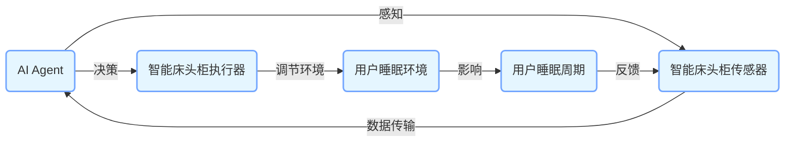

# AI Agent在智能床头柜中的睡眠周期优化

> 关键词：AI Agent、智能床头柜、睡眠周期、优化算法、传感器技术

> 摘要：本文聚焦于AI Agent在智能床头柜中对睡眠周期的优化应用。首先介绍了相关背景知识，包括研究目的、预期读者、文档结构等。接着阐述了AI Agent、智能床头柜及睡眠周期等核心概念及其联系，详细讲解了用于睡眠周期优化的核心算法原理与具体操作步骤，给出了相关数学模型和公式并举例说明。通过项目实战展示了如何在智能床头柜中实现睡眠周期优化，包括开发环境搭建、源代码实现与解读。探讨了其实际应用场景，推荐了学习、开发相关的工具和资源，最后总结了未来发展趋势与挑战，提供常见问题解答和扩展阅读参考资料，旨在为智能睡眠领域的研究与应用提供全面的技术指导和理论支持。

## 1. 背景介绍 
### 1.1 目的和范围
睡眠是人类生活中至关重要的生理过程，良好的睡眠质量对于身体健康、认知功能和情绪状态都有着深远的影响。然而，现代生活的快节奏和各种干扰因素，导致许多人面临睡眠问题。智能床头柜作为智能家居的一部分，结合AI Agent技术，有望为用户提供个性化的睡眠优化方案。本研究的目的在于探索如何利用AI Agent在智能床头柜中实现对睡眠周期的有效优化，提高用户的睡眠质量。

研究范围涵盖了AI Agent技术的原理与应用、智能床头柜的硬件与软件架构、睡眠周期的监测与分析，以及基于这些技术实现的睡眠优化策略。通过综合运用传感器技术、数据分析和机器学习算法，实现对用户睡眠状态的实时监测和精准干预。

### 1.2 预期读者
本文预期读者包括智能家居领域的研究人员、开发者、产品经理，以及对智能睡眠技术感兴趣的技术爱好者和普通用户。对于研究人员和开发者，本文提供了详细的技术原理和实现方法，可作为进一步研究和开发的参考；对于产品经理，有助于了解智能床头柜中睡眠周期优化功能的市场需求和技术可行性；对于普通用户和技术爱好者，能帮助他们更好地理解智能睡眠技术的工作原理和应用价值。

### 1.3 文档结构概述
本文将按照以下结构进行阐述：首先介绍相关背景知识，包括目的、预期读者和文档结构等；接着深入探讨核心概念与联系，包括AI Agent、智能床头柜和睡眠周期等；详细讲解核心算法原理和具体操作步骤，结合Python源代码进行说明；给出相关数学模型和公式，并举例说明；通过项目实战展示智能床头柜中睡眠周期优化的实现过程，包括开发环境搭建、源代码实现与解读；探讨实际应用场景；推荐学习、开发相关的工具和资源；总结未来发展趋势与挑战；提供常见问题解答和扩展阅读参考资料。

### 1.4 术语表
#### 1.4.1 核心术语定义
- **AI Agent（人工智能智能体）**：是一种能够感知环境、进行决策并采取行动以实现特定目标的智能实体。在本文中，AI Agent用于感知用户的睡眠状态，分析数据并制定优化策略。
- **智能床头柜**：集成了多种传感器和智能设备的床头柜，能够与用户进行交互，收集睡眠数据并提供个性化的睡眠服务。
- **睡眠周期**：是指睡眠过程中从浅睡眠到深睡眠再到快速眼动睡眠（REM）的一个完整循环，通常持续90 - 120分钟。

#### 1.4.2 相关概念解释
- **传感器技术**：用于感知用户的睡眠状态，如心率、呼吸、体动等。常见的传感器包括心率传感器、加速度计、压力传感器等。
- **机器学习算法**：用于对睡眠数据进行分析和预测，如分类算法、聚类算法、回归算法等。通过机器学习算法，AI Agent可以学习用户的睡眠习惯和模式，从而制定个性化的优化策略。
- **智能家居系统**：是一个集成了多种智能设备的系统，通过网络实现设备之间的互联互通和协同工作。智能床头柜作为智能家居系统的一部分，可以与其他智能设备（如智能床垫、智能灯具等）进行联动，提供更加全面的睡眠优化服务。

#### 1.4.3 缩略词列表
- **AI**：Artificial Intelligence，人工智能
- **REM**：Rapid Eye Movement，快速眼动睡眠
- **IoT**：Internet of Things，物联网

## 2. 核心概念与联系 
### 2.1 AI Agent原理
AI Agent是一种具有自主性、反应性、社会性和适应性的智能实体。它通过传感器感知环境信息，利用内部的知识和算法进行决策，并通过执行器采取行动。AI Agent的基本架构包括感知模块、决策模块和执行模块。感知模块负责收集环境信息，决策模块根据感知到的信息和内部知识进行推理和决策，执行模块根据决策结果采取相应的行动。

### 2.2 智能床头柜架构
智能床头柜通常由硬件和软件两部分组成。硬件部分包括传感器、处理器、通信模块、执行器等。传感器用于收集用户的睡眠数据，如心率、呼吸、体动等；处理器用于处理和分析数据；通信模块用于与其他智能设备进行通信；执行器用于实现对环境的控制，如调节灯光、温度等。软件部分包括操作系统、应用程序和算法库等。操作系统负责管理硬件资源和提供基本的服务；应用程序用于实现具体的功能，如睡眠监测、睡眠优化等；算法库用于提供各种数据分析和机器学习算法。

### 2.3 睡眠周期原理
睡眠周期是指睡眠过程中从浅睡眠到深睡眠再到快速眼动睡眠（REM）的一个完整循环。一个完整的睡眠周期通常持续90 - 120分钟，在一夜的睡眠中，人体通常会经历4 - 6个睡眠周期。睡眠周期的不同阶段对人体的生理和心理功能有着不同的影响。浅睡眠阶段主要用于身体的放松和恢复，深睡眠阶段主要用于身体的修复和生长，快速眼动睡眠阶段主要用于大脑的整理和记忆巩固。

### 2.4 核心概念联系示意图


## 3. 核心算法原理 & 具体操作步骤 
### 3.1 睡眠状态分类算法
睡眠状态分类是睡眠周期优化的基础，通过对用户的睡眠数据进行分析，将睡眠状态分为浅睡眠、深睡眠、快速眼动睡眠和清醒状态。常用的睡眠状态分类算法包括基于机器学习的分类算法，如支持向量机（SVM）、决策树、随机森林等。

以下是一个基于Python的支持向量机睡眠状态分类示例代码：
```python
import numpy as np
from sklearn import svm
from sklearn.model_selection import train_test_split
from sklearn.metrics import accuracy_score

# 生成示例数据
X = np.random.rand(100, 5)  # 100个样本，每个样本有5个特征
y = np.random.randint(0, 4, 100)  # 标签，0-3分别表示浅睡眠、深睡眠、快速眼动睡眠和清醒状态

# 划分训练集和测试集
X_train, X_test, y_train, y_test = train_test_split(X, y, test_size=0.2, random_state=42)

# 创建SVM分类器
clf = svm.SVC()

# 训练模型
clf.fit(X_train, y_train)

# 预测
y_pred = clf.predict(X_test)

# 计算准确率
accuracy = accuracy_score(y_test, y_pred)
print(f"准确率: {accuracy}")
```
### 3.2 睡眠周期预测算法
睡眠周期预测是根据用户的历史睡眠数据预测未来的睡眠周期。常用的睡眠周期预测算法包括基于时间序列分析的算法，如ARIMA、LSTM等。

以下是一个基于Python的LSTM睡眠周期预测示例代码：
```python
import numpy as np
import pandas as pd
from tensorflow.keras.models import Sequential
from tensorflow.keras.layers import LSTM, Dense
from sklearn.preprocessing import MinMaxScaler

# 生成示例数据
data = np.random.rand(100)  # 100个时间步的数据
data = data.reshape(-1, 1)

# 数据归一化
scaler = MinMaxScaler(feature_range=(0, 1))
data = scaler.fit_transform(data)

# 准备训练数据
look_back = 10
X = []
y = []
for i in range(len(data) - look_back):
    X.append(data[i:(i + look_back), 0])
    y.append(data[i + look_back, 0])
X = np.array(X)
y = np.array(y)

# 调整输入数据的形状以适应LSTM模型
X = np.reshape(X, (X.shape[0], X.shape[1], 1))

# 创建LSTM模型
model = Sequential()
model.add(LSTM(50, input_shape=(look_back, 1)))
model.add(Dense(1))
model.compile(loss='mean_squared_error', optimizer='adam')

# 训练模型
model.fit(X, y, epochs=100, batch_size=1, verbose=2)

# 预测
test_data = data[-look_back:]
test_data = test_data.reshape(1, look_back, 1)
prediction = model.predict(test_data)
prediction = scaler.inverse_transform(prediction)
print(f"预测值: {prediction[0][0]}")
```
### 3.3 睡眠优化策略生成算法
睡眠优化策略生成算法根据睡眠状态分类和睡眠周期预测的结果，结合用户的个性化需求，生成相应的睡眠优化策略。例如，如果用户处于浅睡眠状态，可以调节灯光亮度和温度，创造一个更加舒适的睡眠环境；如果预测到用户即将进入快速眼动睡眠阶段，可以适当增加空气湿度，提高睡眠质量。

以下是一个简单的睡眠优化策略生成示例代码：
```python
def generate_optimization_strategy(sleep_state, predicted_cycle):
    if sleep_state == '浅睡眠':
        strategy = "调节灯光亮度至较暗，温度调节至25摄氏度"
    elif sleep_state == '快速眼动睡眠':
        strategy = "增加空气湿度至50%"
    else:
        strategy = "保持当前环境不变"
    return strategy

# 示例调用
sleep_state = '浅睡眠'
predicted_cycle = '即将进入快速眼动睡眠阶段'
strategy = generate_optimization_strategy(sleep_state, predicted_cycle)
print(f"优化策略: {strategy}")
```

## 4. 数学模型和公式 & 详细讲解 & 举例说明 
### 4.1 睡眠状态分类的数学模型
支持向量机（SVM）是一种常用的分类算法，其基本思想是在特征空间中找到一个最优的超平面，将不同类别的样本分开。对于二分类问题，SVM的目标是找到一个超平面 $w^T x + b = 0$，使得不同类别的样本到超平面的间隔最大。

SVM的优化目标可以表示为：
$$
\begin{aligned}
\min_{w, b, \xi} &\quad \frac{1}{2}w^T w + C \sum_{i=1}^{n} \xi_i \\
\text{s.t.} &\quad y_i (w^T x_i + b) \geq 1 - \xi_i, \quad i = 1, \cdots, n \\
&\quad \xi_i \geq 0, \quad i = 1, \cdots, n
\end{aligned}
$$
其中，$w$ 是超平面的法向量，$b$ 是偏置，$\xi_i$ 是松弛变量，$C$ 是惩罚参数，$x_i$ 是第 $i$ 个样本，$y_i$ 是第 $i$ 个样本的标签。

### 4.2 睡眠周期预测的数学模型
LSTM（长短期记忆网络）是一种特殊的循环神经网络，能够处理序列数据中的长期依赖关系。LSTM的基本单元包括输入门、遗忘门、输出门和细胞状态。

遗忘门的计算公式为：
$$
f_t = \sigma(W_f [h_{t-1}, x_t] + b_f)
$$
输入门的计算公式为：
$$
i_t = \sigma(W_i [h_{t-1}, x_t] + b_i)
$$
细胞状态的更新公式为：
$$
\tilde{C}_t = \tanh(W_C [h_{t-1}, x_t] + b_C)
$$
$$
C_t = f_t \odot C_{t-1} + i_t \odot \tilde{C}_t
$$
输出门的计算公式为：
$$
o_t = \sigma(W_o [h_{t-1}, x_t] + b_o)
$$
隐藏状态的更新公式为：
$$
h_t = o_t \odot \tanh(C_t)
$$
其中，$f_t$ 是遗忘门的输出，$i_t$ 是输入门的输出，$\tilde{C}_t$ 是候选细胞状态，$C_t$ 是细胞状态，$o_t$ 是输出门的输出，$h_t$ 是隐藏状态，$\sigma$ 是 sigmoid 函数，$\tanh$ 是双曲正切函数，$W$ 是权重矩阵，$b$ 是偏置向量。

### 4.3 举例说明
假设我们有一个包含10个样本的睡眠数据集，每个样本有3个特征，标签为0或1，表示两种不同的睡眠状态。我们可以使用SVM对这些样本进行分类。

首先，我们将数据集划分为训练集和测试集：
```python
import numpy as np
from sklearn import svm
from sklearn.model_selection import train_test_split
from sklearn.metrics import accuracy_score

# 生成示例数据
X = np.random.rand(10, 3)
y = np.random.randint(0, 2, 10)

# 划分训练集和测试集
X_train, X_test, y_train, y_test = train_test_split(X, y, test_size=0.2, random_state=42)

# 创建SVM分类器
clf = svm.SVC()

# 训练模型
clf.fit(X_train, y_train)

# 预测
y_pred = clf.predict(X_test)

# 计算准确率
accuracy = accuracy_score(y_test, y_pred)
print(f"准确率: {accuracy}")
```
在这个例子中，我们使用SVM对睡眠状态进行分类，并计算了分类的准确率。

## 5. 项目实战：代码实际案例和详细解释说明 
### 5.1  开发环境搭建
#### 5.1.1 硬件环境
- **智能床头柜**：选择一款支持传感器扩展和通信功能的智能床头柜，如小米智能床头柜。
- **传感器**：安装心率传感器、加速度计、压力传感器等，用于收集用户的睡眠数据。
- **开发板**：选择一款性能稳定的开发板，如树莓派，用于处理和分析睡眠数据。

#### 5.1.2 软件环境
- **操作系统**：在开发板上安装Linux操作系统，如Raspbian。
- **开发工具**：安装Python开发环境，以及相关的库和框架，如TensorFlow、Scikit-learn等。
- **通信协议**：选择合适的通信协议，如MQTT，用于实现智能床头柜与其他智能设备之间的通信。

### 5.2  源代码详细实现和代码解读
#### 5.2.1 数据采集模块
```python
import time
import random

# 模拟传感器数据采集
def collect_sensor_data():
    heart_rate = random.randint(60, 100)
    movement = random.randint(0, 10)
    pressure = random.randint(50, 100)
    return heart_rate, movement, pressure

# 主循环
while True:
    heart_rate, movement, pressure = collect_sensor_data()
    print(f"心率: {heart_rate}，体动: {movement}，压力: {pressure}")
    time.sleep(1)
```
代码解读：该模块模拟了传感器数据的采集过程，通过随机数生成心率、体动和压力数据，并每隔1秒打印一次。

#### 5.2.2 数据处理模块
```python
import numpy as np
from sklearn import svm

# 训练SVM模型
def train_svm_model(X_train, y_train):
    clf = svm.SVC()
    clf.fit(X_train, y_train)
    return clf

# 睡眠状态分类
def classify_sleep_state(clf, data):
    data = np.array(data).reshape(1, -1)
    sleep_state = clf.predict(data)
    return sleep_state

# 示例数据
X_train = np.random.rand(100, 3)
y_train = np.random.randint(0, 4, 100)

# 训练模型
clf = train_svm_model(X_train, y_train)

# 模拟数据
data = [70, 5, 80]

# 分类
sleep_state = classify_sleep_state(clf, data)
print(f"睡眠状态: {sleep_state}")
```
代码解读：该模块实现了睡眠状态的分类功能，首先训练一个SVM模型，然后使用该模型对输入的数据进行分类。

#### 5.2.3 优化策略生成模块
```python
def generate_optimization_strategy(sleep_state):
    if sleep_state == 0:
        strategy = "调节灯光亮度至较暗，温度调节至25摄氏度"
    elif sleep_state == 1:
        strategy = "保持当前环境不变"
    elif sleep_state == 2:
        strategy = "增加空气湿度至50%"
    else:
        strategy = "提醒用户起床"
    return strategy

# 示例调用
sleep_state = 0
strategy = generate_optimization_strategy(sleep_state)
print(f"优化策略: {strategy}")
```
代码解读：该模块根据睡眠状态生成相应的优化策略，不同的睡眠状态对应不同的优化策略。

### 5.3  代码解读与分析
#### 5.3.1 数据采集模块
数据采集模块是整个系统的基础，它负责收集用户的睡眠数据。在实际应用中，需要根据具体的传感器型号和通信协议进行相应的开发。通过模拟数据采集，我们可以快速验证系统的基本功能。

#### 5.3.2 数据处理模块
数据处理模块主要实现了睡眠状态的分类功能。使用SVM算法对睡眠数据进行分类，需要对数据进行预处理和特征提取。在实际应用中，可能需要使用更复杂的算法和模型，以提高分类的准确率。

#### 5.3.3 优化策略生成模块
优化策略生成模块根据睡眠状态生成相应的优化策略。优化策略的生成需要考虑用户的个性化需求和睡眠环境的实际情况。在实际应用中，可以通过用户反馈和机器学习算法不断优化优化策略。

## 6. 实际应用场景 
### 6.1 家庭睡眠监测与优化
在家庭环境中，智能床头柜可以实时监测用户的睡眠状态，根据睡眠周期优化睡眠环境。例如，在用户进入浅睡眠阶段时，自动调节灯光亮度和温度，创造一个更加舒适的睡眠环境；在用户即将醒来时，逐渐增加灯光亮度，模拟自然日出，帮助用户更轻松地醒来。

### 6.2 酒店智能客房服务
在酒店客房中，智能床头柜可以为客人提供个性化的睡眠服务。客人可以通过手机APP设置自己的睡眠偏好，智能床头柜根据客人的偏好和睡眠状态进行相应的调节。例如，调节房间的温度、湿度、灯光等，提高客人的睡眠质量，提升酒店的服务水平。

### 6.3 医疗康复辅助
在医疗康复领域，智能床头柜可以用于监测患者的睡眠状态，为医生提供重要的诊断依据。例如，对于患有睡眠障碍的患者，智能床头柜可以实时监测患者的睡眠数据，帮助医生了解患者的睡眠情况，制定个性化的治疗方案。

## 7. 工具和资源推荐
### 7.1 学习资源推荐
#### 7.1.1 书籍推荐
- 《Python机器学习》：介绍了Python在机器学习领域的应用，包括各种机器学习算法的原理和实现。
- 《深度学习》：深度学习领域的经典著作，详细介绍了深度学习的基本原理和应用。
- 《智能家居技术与应用》：介绍了智能家居的基本概念、技术和应用案例，对于了解智能床头柜的技术原理和应用场景有很大的帮助。

#### 7.1.2 在线课程
- Coursera上的“机器学习”课程：由斯坦福大学教授Andrew Ng主讲，是机器学习领域的经典课程。
- edX上的“深度学习”课程：介绍了深度学习的基本原理和应用，包括神经网络、卷积神经网络、循环神经网络等。
- 中国大学MOOC上的“智能家居技术”课程：介绍了智能家居的基本概念、技术和应用案例，对于了解智能床头柜的技术原理和应用场景有很大的帮助。

#### 7.1.3 技术博客和网站
- Medium：一个技术博客平台，有很多关于AI、机器学习、智能家居等领域的文章。
- Towards Data Science：专注于数据科学和机器学习领域的技术博客，有很多高质量的文章和教程。
- 开源中国：国内知名的开源技术社区，有很多关于智能家居、物联网等领域的技术文章和项目案例。

### 7.2 开发工具框架推荐
#### 7.2.1 IDE和编辑器
- PyCharm：一款专业的Python集成开发环境，提供了丰富的功能和插件，适合Python开发。
- Visual Studio Code：一款轻量级的代码编辑器，支持多种编程语言和插件，适合快速开发和调试。
- Jupyter Notebook：一个交互式的编程环境，适合数据探索和模型训练。

#### 7.2.2 调试和性能分析工具
- TensorBoard：TensorFlow的可视化工具，用于可视化模型训练过程和性能指标。
- Scikit-learn的交叉验证工具：用于评估模型的性能和选择最优的模型参数。
- Profiler：Python的性能分析工具，用于分析代码的性能瓶颈。

#### 7.2.3 相关框架和库
- TensorFlow：一个开源的机器学习框架，提供了丰富的工具和库，用于构建和训练深度学习模型。
- Scikit-learn：一个开源的机器学习库，提供了各种机器学习算法和工具，用于数据预处理、模型训练和评估。
- MQTT Python Client：一个Python实现的MQTT客户端库，用于实现智能设备之间的通信。

### 7.3 相关论文著作推荐
#### 7.3.1 经典论文
- “Support-Vector Networks”：支持向量机的经典论文，介绍了支持向量机的基本原理和算法。
- “Long Short-Term Memory”：LSTM的经典论文，介绍了LSTM的基本原理和结构。
- “Deep Learning”：深度学习领域的综述论文，介绍了深度学习的发展历程、基本原理和应用。

#### 7.3.2 最新研究成果
- 关注IEEE Transactions on Neural Networks and Learning Systems、ACM Transactions on Intelligent Systems and Technology等顶级学术期刊，了解AI Agent、智能家居等领域的最新研究成果。
- 参加ACM SIGKDD、NeurIPS等国际学术会议，了解最新的研究动态和技术趋势。

#### 7.3.3 应用案例分析
- 研究国内外知名企业的智能家居产品和解决方案，如小米、华为、谷歌等，了解他们在智能床头柜和睡眠优化方面的应用案例和技术实现。
- 分析一些科研机构的研究项目和成果，如斯坦福大学、麻省理工学院等，了解他们在智能睡眠领域的最新研究进展。

## 8. 总结：未来发展趋势与挑战
### 8.1 未来发展趋势
- **个性化定制**：未来的智能床头柜将更加注重用户的个性化需求，通过对用户睡眠数据的深入分析，为用户提供更加个性化的睡眠优化方案。
- **多设备联动**：智能床头柜将与更多的智能设备进行联动，如智能床垫、智能灯具、智能空调等，实现更加全面的睡眠优化服务。
- **智能化升级**：随着AI技术的不断发展，智能床头柜将具备更强的智能化能力，能够自动学习用户的睡眠习惯和模式，不断优化睡眠优化策略。

### 8.2 挑战
- **数据隐私和安全**：智能床头柜需要收集大量的用户睡眠数据，这些数据涉及用户的隐私和安全。如何保护用户的数据隐私和安全，是智能床头柜发展面临的重要挑战。
- **算法准确性**：睡眠状态分类和睡眠周期预测的准确性直接影响睡眠优化的效果。如何提高算法的准确性，是智能床头柜发展需要解决的关键问题。
- **用户接受度**：智能床头柜作为一种新兴的智能家居产品，用户对其功能和使用方法还存在一定的认知障碍。如何提高用户的接受度，是智能床头柜推广应用的重要挑战。

## 9. 附录：常见问题与解答
### 9.1 智能床头柜的传感器数据准确吗？
智能床头柜的传感器数据的准确性取决于传感器的质量和性能。一般来说，采用高质量的传感器可以提高数据的准确性。同时，通过对传感器数据进行校准和滤波处理，也可以进一步提高数据的准确性。

### 9.2 智能床头柜的优化策略是如何制定的？
智能床头柜的优化策略是根据睡眠状态分类和睡眠周期预测的结果，结合用户的个性化需求制定的。通过对大量的睡眠数据进行分析和学习，不断优化优化策略，以提高睡眠质量。

### 9.3 智能床头柜与其他智能设备如何联动？
智能床头柜与其他智能设备可以通过网络进行通信，采用统一的通信协议，如MQTT、ZigBee等。通过通信协议，智能床头柜可以与其他智能设备进行数据交互和协同工作，实现多设备联动。

## 10. 扩展阅读 & 参考资料
### 10.1 扩展阅读
- 《人工智能：一种现代方法》：全面介绍了人工智能的基本概念、技术和应用，对于深入理解AI Agent技术有很大的帮助。
- 《物联网：技术、应用与标准》：介绍了物联网的基本概念、技术和应用，对于了解智能床头柜的物联网技术有很大的帮助。
- 《睡眠医学》：介绍了睡眠的生理和心理机制，以及睡眠障碍的诊断和治疗方法，对于了解睡眠周期优化的医学原理有很大的帮助。

### 10.2 参考资料
- [IEEE Xplore](https://ieeexplore.ieee.org/)：IEEE的数字图书馆，提供了大量的学术论文和技术报告。
- [ACM Digital Library](https://dl.acm.org/)：ACM的数字图书馆，提供了大量的计算机科学领域的学术论文和技术报告。
- [arXiv](https://arxiv.org/)：一个预印本服务器，提供了大量的最新研究成果和学术论文。