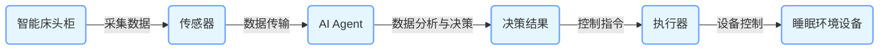

# AI Agent在智能床头柜中的睡眠环境优化

> 关键词：AI Agent、智能床头柜、睡眠环境优化、传感器、机器学习

> 摘要：本文聚焦于AI Agent在智能床头柜中对睡眠环境优化的应用。首先介绍了相关背景，包括研究目的、预期读者等内容。接着阐述了AI Agent及智能床头柜的核心概念与联系，深入讲解了核心算法原理及具体操作步骤，并给出了相应的数学模型和公式。通过项目实战，详细展示了代码实现和解读。同时探讨了实际应用场景，推荐了相关的工具和资源。最后对未来发展趋势与挑战进行总结，并提供常见问题解答和扩展阅读参考资料，旨在为利用AI Agent优化智能床头柜睡眠环境提供全面且深入的技术指导。

## 1. 背景介绍 
### 1.1 目的和范围
随着人们生活水平的提高，对睡眠质量的关注度日益增加。睡眠环境作为影响睡眠质量的关键因素，其优化具有重要意义。本研究的目的在于探索如何利用AI Agent技术，使智能床头柜能够自动感知和调整睡眠环境，从而提高用户的睡眠质量。研究范围涵盖了从AI Agent的原理到智能床头柜的具体实现，包括传感器数据采集、算法处理、环境控制等多个方面。

### 1.2 预期读者
本文预期读者包括对人工智能、智能家居领域感兴趣的技术爱好者，从事相关领域研究的科研人员，以及智能家居产品的开发人员和设计师。希望通过本文的介绍，能够为他们提供有益的参考和启发。

### 1.3 文档结构概述
本文将按照以下结构进行阐述：首先介绍背景信息，包括目的、预期读者和文档结构概述等；接着讲解核心概念与联系，明确相关技术的原理和架构；然后深入探讨核心算法原理及具体操作步骤，并给出数学模型和公式；通过项目实战展示代码实现和解读；探讨实际应用场景；推荐相关的工具和资源；最后对未来发展趋势与挑战进行总结，提供常见问题解答和扩展阅读参考资料。

### 1.4 术语表
#### 1.4.1 核心术语定义
- **AI Agent**：即人工智能代理，是一种能够感知环境、进行决策并采取行动的智能实体。它可以根据预设的目标和规则，自主地完成特定的任务。
- **智能床头柜**：结合了传感器、控制器和通信模块等技术的床头柜，能够感知睡眠环境的各种参数，并通过与AI Agent的协作，实现对睡眠环境的自动调整。
- **睡眠环境优化**：通过调整睡眠环境中的温度、湿度、光照、噪音等参数，使其达到最适合用户睡眠的状态，从而提高睡眠质量。

#### 1.4.2 相关概念解释
- **传感器**：用于感知睡眠环境中的各种物理量，如温度传感器、湿度传感器、光照传感器、噪音传感器等。传感器将物理量转换为电信号，以便后续的处理和分析。
- **机器学习**：AI Agent实现智能决策的重要技术手段。通过对大量数据的学习和分析，机器学习算法可以发现数据中的规律和模式，从而为AI Agent的决策提供依据。
- **环境控制**：根据AI Agent的决策结果，对睡眠环境中的各种设备进行控制，如调节空调温度、开关灯光、控制窗帘等。

#### 1.4.3 缩略词列表
- **AI**：Artificial Intelligence，人工智能
- **ML**：Machine Learning，机器学习
- **IoT**：Internet of Things，物联网

## 2. 核心概念与联系 
### 核心概念原理
#### AI Agent原理
AI Agent的核心原理是基于感知 - 决策 - 行动的循环过程。首先，AI Agent通过传感器感知睡眠环境的各种参数，如温度、湿度、光照、噪音等。然后，它对这些感知数据进行分析和处理，利用机器学习算法或预设的规则，做出关于睡眠环境调整的决策。最后，AI Agent通过执行器对睡眠环境中的设备进行控制，实现对睡眠环境的优化。

#### 智能床头柜原理
智能床头柜集成了多种传感器和执行器，以及通信模块和处理器。传感器负责采集睡眠环境的参数，通信模块用于与AI Agent进行数据传输和交互，处理器则对采集到的数据进行处理和分析。执行器根据AI Agent的决策结果，对睡眠环境中的设备进行控制，如调节灯光亮度、控制空调温度等。

### 架构的文本示意图
智能床头柜与AI Agent的架构可以描述为：智能床头柜作为前端设备，通过传感器采集睡眠环境数据，并将数据发送给AI Agent。AI Agent作为智能决策中心，对数据进行分析和处理，做出决策后将控制指令发送给智能床头柜。智能床头柜的执行器根据控制指令对睡眠环境中的设备进行控制。

### Mermaid流程图


## 3. 核心算法原理 & 具体操作步骤 
### 核心算法原理
在AI Agent对睡眠环境进行优化的过程中，机器学习算法起着关键作用。这里我们以基于规则的决策算法和简单的机器学习算法（如线性回归）为例进行说明。

#### 基于规则的决策算法
基于规则的决策算法是一种简单而直观的方法。它根据预设的规则对睡眠环境数据进行判断，并做出相应的决策。例如，当温度高于28℃时，AI Agent会发送指令给空调，将温度调低；当光照强度高于500lux时，AI Agent会发送指令关闭窗帘。

#### 线性回归算法
线性回归算法用于预测睡眠质量与睡眠环境参数之间的关系。通过对大量的睡眠环境数据和对应的睡眠质量数据进行训练，线性回归算法可以得到一个线性模型。在实际应用中，AI Agent可以根据当前的睡眠环境参数，利用该线性模型预测睡眠质量，并根据预测结果做出决策。

### 具体操作步骤
#### 数据采集
智能床头柜的传感器定期采集睡眠环境的参数，如温度、湿度、光照、噪音等。采集到的数据通过通信模块发送给AI Agent。

#### 数据预处理
AI Agent接收到数据后，首先对数据进行预处理。预处理包括数据清洗、数据归一化等操作，以提高数据的质量和可用性。

#### 数据分析与决策
AI Agent根据预处理后的数据，利用基于规则的决策算法或机器学习算法进行分析和决策。如果采用基于规则的决策算法，AI Agent会根据预设的规则判断当前睡眠环境是否需要调整；如果采用机器学习算法，AI Agent会根据训练好的模型预测睡眠质量，并根据预测结果做出决策。

#### 控制指令发送
AI Agent根据决策结果，生成相应的控制指令，并将指令发送给智能床头柜的执行器。执行器根据控制指令对睡眠环境中的设备进行控制。

### Python源代码阐述
```python
import numpy as np

# 模拟传感器数据采集
def collect_sensor_data():
    temperature = np.random.uniform(20, 30)  # 模拟温度数据
    humidity = np.random.uniform(40, 60)  # 模拟湿度数据
    light = np.random.uniform(100, 1000)  # 模拟光照数据
    noise = np.random.uniform(30, 60)  # 模拟噪音数据
    return temperature, humidity, light, noise

# 数据预处理：数据归一化
def preprocess_data(data):
    min_values = np.array([20, 40, 100, 30])
    max_values = np.array([30, 60, 1000, 60])
    normalized_data = (data - min_values) / (max_values - min_values)
    return normalized_data

# 基于规则的决策算法
def rule_based_decision(data):
    temperature, humidity, light, noise = data
    decisions = []
    if temperature > 28:
        decisions.append("调低空调温度")
    if light > 500:
        decisions.append("关闭窗帘")
    return decisions

# 主函数
def main():
    # 数据采集
    sensor_data = collect_sensor_data()
    print("采集到的传感器数据：", sensor_data)
    
    # 数据预处理
    preprocessed_data = preprocess_data(np.array(sensor_data))
    print("预处理后的数据：", preprocessed_data)
    
    # 数据分析与决策
    decisions = rule_based_decision(sensor_data)
    print("决策结果：", decisions)

if __name__ == "__main__":
    main()
```

## 4. 数学模型和公式 & 详细讲解 & 举例说明 
### 线性回归数学模型
线性回归的数学模型可以表示为：

$$y = \beta_0 + \beta_1x_1 + \beta_2x_2 + \cdots + \beta_nx_n + \epsilon$$

其中，$y$ 是因变量（如睡眠质量），$x_1, x_2, \cdots, x_n$ 是自变量（如温度、湿度、光照、噪音等睡眠环境参数），$\beta_0, \beta_1, \cdots, \beta_n$ 是回归系数，$\epsilon$ 是误差项。

### 详细讲解
线性回归的目标是通过最小化误差项的平方和，找到最优的回归系数 $\beta_0, \beta_1, \cdots, \beta_n$。常用的方法是最小二乘法。最小二乘法的目标函数可以表示为：

$$\min_{\beta_0, \beta_1, \cdots, \beta_n} \sum_{i=1}^{m} (y_i - (\beta_0 + \beta_1x_{i1} + \beta_2x_{i2} + \cdots + \beta_nx_{in}))^2$$

其中，$m$ 是样本数量，$y_i$ 是第 $i$ 个样本的因变量值，$x_{i1}, x_{i2}, \cdots, x_{in}$ 是第 $i$ 个样本的自变量值。

### 举例说明
假设我们有以下睡眠环境数据和对应的睡眠质量数据：

| 温度 ($x_1$) | 湿度 ($x_2$) | 光照 ($x_3$) | 噪音 ($x_4$) | 睡眠质量 ($y$) |
| --- | --- | --- | --- | --- |
| 22 | 50 | 300 | 40 | 8 |
| 25 | 55 | 400 | 45 | 7 |
| 28 | 60 | 500 | 50 | 6 |

我们可以使用Python的 `scikit-learn` 库来实现线性回归：

```python
from sklearn.linear_model import LinearRegression
import numpy as np

# 自变量数据
X = np.array([[22, 50, 300, 40], [25, 55, 400, 45], [28, 60, 500, 50]])
# 因变量数据
y = np.array([8, 7, 6])

# 创建线性回归模型
model = LinearRegression()
# 训练模型
model.fit(X, y)

# 预测新的睡眠质量
new_data = np.array([[23, 52, 350, 42]])
predicted_quality = model.predict(new_data)
print("预测的睡眠质量：", predicted_quality)
```

在这个例子中，我们使用线性回归模型对新的睡眠环境数据进行了预测，得到了对应的睡眠质量预测值。

## 5. 项目实战：代码实际案例和详细解释说明 
### 5.1  开发环境搭建
#### 硬件环境
- **智能床头柜**：选择具有多种传感器（温度、湿度、光照、噪音等）和执行器（继电器、电机等）的智能床头柜开发板。
- **服务器**：选择一台性能稳定的服务器，用于运行AI Agent程序。服务器可以是云服务器，也可以是本地服务器。

#### 软件环境
- **操作系统**：服务器可以选择Linux操作系统，如Ubuntu、CentOS等。智能床头柜开发板可以选择适合的嵌入式操作系统，如OpenWrt、Yocto等。
- **编程语言**：选择Python作为开发语言，因为Python具有丰富的机器学习和物联网开发库。
- **开发工具**：选择PyCharm作为Python开发工具，方便代码的编写、调试和管理。

### 5.2  源代码详细实现和代码解读
```python
import socket
import json
import numpy as np
from sklearn.linear_model import LinearRegression

# 模拟传感器数据采集
def collect_sensor_data():
    temperature = np.random.uniform(20, 30)  # 模拟温度数据
    humidity = np.random.uniform(40, 60)  # 模拟湿度数据
    light = np.random.uniform(100, 1000)  # 模拟光照数据
    noise = np.random.uniform(30, 60)  # 模拟噪音数据
    return temperature, humidity, light, noise

# 数据预处理：数据归一化
def preprocess_data(data):
    min_values = np.array([20, 40, 100, 30])
    max_values = np.array([30, 60, 1000, 60])
    normalized_data = (data - min_values) / (max_values - min_values)
    return normalized_data

# 线性回归模型训练
def train_linear_regression_model():
    # 模拟训练数据
    X_train = np.array([[22, 50, 300, 40], [25, 55, 400, 45], [28, 60, 500, 50]])
    y_train = np.array([8, 7, 6])
    model = LinearRegression()
    model.fit(X_train, y_train)
    return model

# 基于线性回归模型的决策算法
def linear_regression_decision(model, data):
    predicted_quality = model.predict([data])
    if predicted_quality < 7:
        decisions = []
        if data[0] > 25:
            decisions.append("调低空调温度")
        if data[2] > 400:
            decisions.append("关闭窗帘")
        return decisions
    else:
        return []

# 主函数
def main():
    # 训练线性回归模型
    model = train_linear_regression_model()
    
    # 模拟智能床头柜与AI Agent的通信
    server_socket = socket.socket(socket.AF_INET, socket.SOCK_STREAM)
    server_socket.bind(('localhost', 8888))
    server_socket.listen(1)
    print("等待智能床头柜连接...")
    
    while True:
        conn, addr = server_socket.accept()
        print("智能床头柜已连接：", addr)
        
        # 数据采集
        sensor_data = collect_sensor_data()
        print("采集到的传感器数据：", sensor_data)
        
        # 数据预处理
        preprocessed_data = preprocess_data(np.array(sensor_data))
        print("预处理后的数据：", preprocessed_data)
        
        # 数据分析与决策
        decisions = linear_regression_decision(model, sensor_data)
        print("决策结果：", decisions)
        
        # 发送决策结果给智能床头柜
        response = json.dumps(decisions).encode('utf-8')
        conn.sendall(response)
        
        conn.close()

if __name__ == "__main__":
    main()
```

### 5.3  代码解读与分析
#### 数据采集
`collect_sensor_data` 函数模拟了智能床头柜的传感器数据采集过程，返回温度、湿度、光照和噪音数据。

#### 数据预处理
`preprocess_data` 函数对采集到的数据进行归一化处理，将数据缩放到0到1的范围内，以提高机器学习算法的性能。

#### 模型训练
`train_linear_regression_model` 函数使用模拟的训练数据训练线性回归模型。

#### 决策算法
`linear_regression_decision` 函数根据训练好的线性回归模型预测睡眠质量，并根据预测结果做出决策。

#### 通信与控制
主函数中使用Python的 `socket` 库模拟了智能床头柜与AI Agent的通信过程。AI Agent接收传感器数据，进行数据分析和决策，然后将决策结果发送给智能床头柜。

## 6. 实际应用场景 
### 家庭卧室
在家庭卧室中，智能床头柜可以根据用户的睡眠习惯和环境参数，自动调节空调温度、灯光亮度、窗帘开合等，为用户创造一个舒适的睡眠环境。例如，在用户入睡后，智能床头柜可以逐渐调暗灯光，关闭窗帘，降低空调温度，提高用户的睡眠质量。

### 酒店客房
在酒店客房中，智能床头柜可以为不同的客人提供个性化的睡眠环境。客人可以通过手机APP或语音控制设置自己喜欢的睡眠环境参数，智能床头柜会根据客人的设置进行调整。同时，酒店管理人员可以通过后台系统对客房的睡眠环境进行监控和管理。

### 医院病房
在医院病房中，智能床头柜可以帮助病人更好地休息。它可以实时监测病人的睡眠环境参数，如温度、湿度、噪音等，并根据病人的身体状况进行调整。例如，对于患有呼吸道疾病的病人，智能床头柜可以保持室内空气湿度在适宜的范围内，有助于病人的康复。

## 7. 工具和资源推荐
### 7.1 学习资源推荐
#### 7.1.1 书籍推荐
- 《人工智能：一种现代的方法》：全面介绍了人工智能的基本概念、算法和应用，是人工智能领域的经典教材。
- 《Python机器学习》：详细介绍了Python在机器学习中的应用，包括各种机器学习算法的实现和优化。
- 《智能家居技术与应用》：介绍了智能家居的相关技术和应用案例，对智能床头柜的开发有一定的参考价值。

#### 7.1.2 在线课程
- Coursera上的“人工智能基础”课程：由知名高校的教授授课，系统地介绍了人工智能的基础知识和算法。
- edX上的“Python数据科学”课程：讲解了Python在数据科学中的应用，包括数据处理、数据分析和机器学习等方面。
- 中国大学MOOC上的“智能家居系统设计与实现”课程：介绍了智能家居系统的设计原理和实现方法，对智能床头柜的开发有一定的指导作用。

#### 7.1.3 技术博客和网站
- 机器之心：提供人工智能领域的最新技术和研究成果，以及相关的技术博客和案例分析。
- 开源中国：提供开源技术的相关信息和资源，包括智能家居领域的开源项目和代码。
- 电子发烧友网：提供电子技术和智能家居领域的技术文章和产品信息。

### 7.2 开发工具框架推荐
#### 7.2.1 IDE和编辑器
- PyCharm：功能强大的Python集成开发环境，支持代码调试、代码分析、版本控制等功能。
- Visual Studio Code：轻量级的代码编辑器，支持多种编程语言，具有丰富的插件扩展功能。

#### 7.2.2 调试和性能分析工具
- pdb：Python的内置调试工具，可以帮助开发者调试Python代码。
- cProfile：Python的性能分析工具，可以分析Python代码的性能瓶颈。

#### 7.2.3 相关框架和库
- scikit-learn：Python的机器学习库，提供了各种机器学习算法的实现和工具。
- TensorFlow：Google开发的深度学习框架，支持大规模的深度学习模型训练和部署。
- MQTT：轻量级的消息传输协议，适用于物联网设备之间的通信。

### 7.3 相关论文著作推荐
#### 7.3.1 经典论文
- “Artificial Intelligence: A Modern Approach”：人工智能领域的经典论文，系统地介绍了人工智能的基本概念和算法。
- “Machine Learning for Sleep Analysis”：介绍了机器学习在睡眠分析中的应用，对AI Agent在睡眠环境优化中的应用有一定的参考价值。

#### 7.3.2 最新研究成果
- 关注顶级学术会议（如NeurIPS、ICML等）和期刊（如Journal of Artificial Intelligence Research、Artificial Intelligence等）上的最新研究成果，了解AI Agent和智能家居领域的最新发展动态。

#### 7.3.3 应用案例分析
- 参考一些实际的智能家居应用案例，了解AI Agent在智能床头柜中的具体应用和实现方法。可以通过查阅相关的技术报告和案例分析文章来获取这些信息。

## 8. 总结：未来发展趋势与挑战
### 未来发展趋势
- **个性化定制**：未来的智能床头柜将能够根据用户的个人偏好和睡眠习惯，提供更加个性化的睡眠环境优化方案。例如，根据用户的生物钟调整灯光和温度，根据用户的睡眠阶段调整噪音水平等。
- **多设备协同**：智能床头柜将与其他智能家居设备（如智能床垫、智能空调、智能窗帘等）实现更加紧密的协同工作。通过数据共享和协同控制，实现整个睡眠环境的一体化优化。
- **智能化升级**：随着人工智能技术的不断发展，AI Agent将变得更加智能和自主。它将能够自动学习和适应不同用户的需求，不断优化睡眠环境优化策略。

### 挑战
- **数据隐私和安全**：智能床头柜需要采集大量的用户睡眠环境数据和个人信息，如何保障这些数据的隐私和安全是一个重要的挑战。需要采取有效的数据加密、访问控制等措施，防止数据泄露和滥用。
- **技术标准和兼容性**：目前智能家居领域的技术标准和协议还不够统一，不同品牌和型号的智能设备之间可能存在兼容性问题。这给智能床头柜与其他设备的协同工作带来了一定的困难。需要制定统一的技术标准和协议，促进智能家居设备的互联互通。
- **用户接受度**：一些用户可能对智能床头柜的功能和安全性存在疑虑，不愿意接受和使用智能床头柜。需要加强对智能床头柜的宣传和推广，提高用户对智能床头柜的认知和接受度。

## 9. 附录：常见问题与解答
### 1. 智能床头柜的传感器数据准确吗？
智能床头柜的传感器数据准确性取决于传感器的质量和性能。一般来说，采用高质量的传感器可以保证数据的准确性。同时，在使用过程中，需要定期对传感器进行校准和维护，以确保数据的准确性。

### 2. AI Agent的决策结果可靠吗？
AI Agent的决策结果可靠性取决于其采用的算法和训练数据的质量。通过不断优化算法和增加训练数据的数量和质量，可以提高AI Agent决策结果的可靠性。同时，在实际应用中，还可以结合人工干预，对AI Agent的决策结果进行验证和调整。

### 3. 智能床头柜与其他智能家居设备如何协同工作？
智能床头柜与其他智能家居设备可以通过通信协议（如MQTT、ZigBee等）进行数据传输和交互。通过数据共享和协同控制，实现整个睡眠环境的一体化优化。例如，智能床头柜可以根据智能床垫采集的用户睡眠状态数据，调整空调温度和灯光亮度。

### 4. 智能床头柜的安全性如何保障？
智能床头柜的安全性可以从多个方面进行保障。首先，采用数据加密技术对采集到的数据进行加密，防止数据在传输和存储过程中被窃取。其次，设置严格的访问控制机制，只有授权用户才能访问智能床头柜的相关数据和功能。此外，定期对智能床头柜进行安全漏洞检测和修复，及时更新软件和固件，以提高其安全性。

## 10. 扩展阅读 & 参考资料
### 扩展阅读
- 《智能硬件开发实战》：介绍了智能硬件的开发流程和技术，对智能床头柜的硬件开发有一定的参考价值。
- 《物联网安全技术》：详细介绍了物联网安全的相关技术和方法，有助于深入了解智能床头柜的安全保障机制。

### 参考资料
- 相关的技术文档和用户手册，如智能床头柜开发板的技术文档、传感器的用户手册等。
- 在线技术论坛和社区，如Stack Overflow、GitHub等，这些平台上有很多开发者分享的经验和代码，可以作为参考。