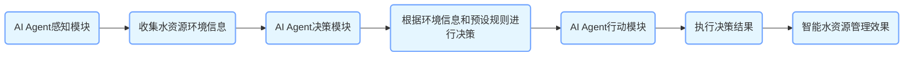

# AI Agent在智能水资源管理中的实践

> 关键词：AI Agent、智能水资源管理、水资源监测、水资源调配、决策优化

> 摘要：本文聚焦于AI Agent在智能水资源管理中的实践应用。首先介绍了智能水资源管理的背景以及AI Agent引入的目的和意义，明确预期读者和文档结构。接着阐述了AI Agent与智能水资源管理相关的核心概念及联系，详细讲解了核心算法原理与具体操作步骤，并结合数学模型和公式进行深入分析。通过项目实战展示了AI Agent在智能水资源管理中的代码实现和实际应用场景。最后推荐了相关的工具和资源，总结了未来发展趋势与挑战，还提供了常见问题解答和扩展阅读参考资料，旨在为相关领域的研究和实践提供全面且深入的指导。

## 1. 背景介绍 
### 1.1 目的和范围
随着全球人口的增长和经济的快速发展，水资源的供需矛盾日益突出，水资源管理面临着巨大的挑战。传统的水资源管理方式往往依赖于人工经验和简单的数据分析，难以应对复杂多变的水资源状况。智能水资源管理旨在利用先进的信息技术手段，实现对水资源的高效、精准管理。

本文章的目的在于探讨AI Agent在智能水资源管理中的应用实践，包括如何利用AI Agent进行水资源监测、调配和决策优化等。范围涵盖了AI Agent的基本原理、相关算法、数学模型，以及在实际项目中的应用案例等方面。

### 1.2 预期读者
本文预期读者包括从事水资源管理相关工作的专业人员，如水利工程师、水资源规划师等；对人工智能在水资源领域应用感兴趣的研究人员；以及相关专业的学生，希望通过阅读本文了解AI Agent在智能水资源管理中的应用原理和实践方法。

### 1.3 文档结构概述
本文首先介绍智能水资源管理的背景和引入AI Agent的目的，明确预期读者和文档结构。然后详细阐述AI Agent与智能水资源管理的核心概念及联系，包括相关的原理和架构。接着讲解核心算法原理和具体操作步骤，结合数学模型和公式进行深入分析。通过项目实战展示AI Agent在智能水资源管理中的代码实现和实际应用场景。最后推荐相关的工具和资源，总结未来发展趋势与挑战，提供常见问题解答和扩展阅读参考资料。

### 1.4 术语表
#### 1.4.1 核心术语定义
- **AI Agent（人工智能智能体）**：是一种能够感知环境、自主决策并采取行动以实现特定目标的人工智能实体。
- **智能水资源管理**：利用先进的信息技术，对水资源的开发、利用、保护等进行全面、高效、精准管理的过程。
- **水资源监测**：对水资源的数量、质量、分布等进行实时或定期观测和分析的活动。
- **水资源调配**：根据水资源的供需情况，对水资源进行合理分配和调度的过程。
- **决策优化**：在多种可行方案中，通过一定的方法选择最优方案以实现目标的过程。

#### 1.4.2 相关概念解释
- **环境感知**：AI Agent通过各种传感器和数据采集设备，获取水资源管理相关的环境信息，如水位、水质、流量等。
- **决策制定**：AI Agent根据感知到的环境信息，结合预设的目标和规则，运用一定的算法进行决策，确定最佳的行动方案。
- **行动执行**：AI Agent将决策结果转化为实际行动，如控制水泵的启停、调节水闸的开度等，以实现对水资源的有效管理。

#### 1.4.3 缩略词列表
- **AI**：Artificial Intelligence（人工智能）
- **IoT**：Internet of Things（物联网）

## 2. 核心概念与联系 

### 2.1 AI Agent的基本原理
AI Agent是一种具有自主性、反应性、社会性和主动性的智能实体。它通过感知环境中的信息，运用内部的知识和算法进行推理和决策，然后采取相应的行动来影响环境。其基本架构通常包括感知模块、决策模块和行动模块。

感知模块负责收集环境中的各种数据，如水资源的水位、水质、流量等信息。决策模块根据感知到的数据，结合预设的目标和规则，运用一定的算法进行推理和决策，确定最佳的行动方案。行动模块将决策结果转化为实际行动，如控制水泵的启停、调节水闸的开度等。

### 2.2 智能水资源管理的概念
智能水资源管理是利用先进的信息技术，如物联网、大数据、人工智能等，对水资源的开发、利用、保护等进行全面、高效、精准管理的过程。它包括水资源监测、水资源调配、决策优化等多个环节。

水资源监测是智能水资源管理的基础，通过各种传感器和数据采集设备，实时或定期获取水资源的数量、质量、分布等信息。水资源调配是根据水资源的供需情况，对水资源进行合理分配和调度，以满足不同用户的需求。决策优化是在多种可行方案中，通过一定的方法选择最优方案，以实现水资源的高效利用和可持续发展。

### 2.3 AI Agent与智能水资源管理的联系
AI Agent在智能水资源管理中发挥着重要作用。它可以通过感知模块实时获取水资源的环境信息，为水资源监测提供准确的数据支持。在决策制定方面，AI Agent可以运用先进的算法，结合历史数据和实时信息，进行快速、准确的决策，为水资源调配和决策优化提供科学依据。在行动执行方面，AI Agent可以直接控制相关设备，如水泵、水闸等，实现对水资源的实时调控。

### 2.4 文本示意图
AI Agent在智能水资源管理中的应用可以用以下文本示意图表示：

AI Agent感知模块 -> 收集水资源环境信息（水位、水质、流量等）
|
v
AI Agent决策模块 -> 根据环境信息和预设规则进行决策（水资源调配方案、决策优化等）
|
v
AI Agent行动模块 -> 执行决策结果（控制水泵、水闸等设备）
|
v
智能水资源管理效果（水资源合理利用、可持续发展等）

### 2.5 Mermaid流程图


## 3. 核心算法原理 & 具体操作步骤 

### 3.1 核心算法原理
在AI Agent应用于智能水资源管理中，常用的算法包括强化学习算法、遗传算法等。下面以强化学习算法为例进行详细讲解。

强化学习是一种通过智能体与环境进行交互，不断尝试不同的行动，根据环境反馈的奖励信号来学习最优策略的机器学习方法。在智能水资源管理中，AI Agent可以被看作是一个智能体，环境是水资源系统，行动是对水泵、水闸等设备的控制，奖励信号可以根据水资源的利用效率、供需平衡等指标来定义。

### 3.2 Python源代码实现
以下是一个简单的强化学习算法在智能水资源管理中的Python示例代码：

```python
import numpy as np

# 定义环境类
class WaterResourceEnv:
    def __init__(self):
        # 初始化环境参数
        self.water_level = 100  # 初始水位
        self.demand = 20  # 初始用水需求
        self.reward = 0  # 初始奖励

    def step(self, action):
        # 根据行动更新环境状态
        if action == 0:  # 不采取行动
            self.water_level -= self.demand
        elif action == 1:  # 增加供水
            self.water_level += 10 - self.demand
        elif action == 2:  # 减少供水
            self.water_level -= 10 - self.demand

        # 计算奖励
        if self.water_level >= 0 and self.water_level <= 200:
            self.reward = 1
        else:
            self.reward = -1

        # 判断是否结束
        done = self.water_level < 0 or self.water_level > 200

        return self.water_level, self.reward, done

    def reset(self):
        # 重置环境状态
        self.water_level = 100
        self.demand = 20
        self.reward = 0
        return self.water_level

# 定义智能体类
class AI_Agent:
    def __init__(self, num_actions):
        # 初始化智能体参数
        self.num_actions = num_actions
        self.q_table = np.zeros((201, num_actions))  # Q表
        self.epsilon = 0.1  # 探索率
        self.alpha = 0.1  # 学习率
        self.gamma = 0.9  # 折扣因子

    def choose_action(self, state):
        # 根据Q表选择行动
        if np.random.uniform(0, 1) < self.epsilon:
            action = np.random.choice(self.num_actions)
        else:
            action = np.argmax(self.q_table[state, :])
        return action

    def learn(self, state, action, reward, next_state):
        # 更新Q表
        q_predict = self.q_table[state, action]
        q_target = reward + self.gamma * np.max(self.q_table[next_state, :])
        self.q_table[state, action] += self.alpha * (q_target - q_predict)

# 训练智能体
env = WaterResourceEnv()
agent = AI_Agent(num_actions=3)

num_episodes = 1000
for episode in range(num_episodes):
    state = env.reset()
    done = False
    while not done:
        action = agent.choose_action(state)
        next_state, reward, done = env.step(action)
        agent.learn(state, action, reward, next_state)
        state = next_state
```

### 3.3 具体操作步骤
1. **环境初始化**：创建水资源环境对象，设置初始水位、用水需求等参数。
2. **智能体初始化**：创建AI Agent对象，初始化Q表、探索率、学习率、折扣因子等参数。
3. **训练循环**：进行多次训练，每次训练开始时重置环境状态，然后智能体根据当前状态选择行动，环境根据行动更新状态并返回奖励，智能体根据奖励更新Q表，直到环境结束。
4. **测试阶段**：训练完成后，可以使用训练好的智能体进行测试，观察其在不同环境下的表现。

## 4. 数学模型和公式 & 详细讲解 & 举例说明 

### 4.1 强化学习的数学模型
强化学习的核心是Q学习算法，其数学模型基于贝尔曼方程。贝尔曼方程描述了最优Q值的递归关系：

$$Q^*(s,a) = \mathbb{E}_{s'}\left[r(s,a) + \gamma \max_{a'} Q^*(s',a')\right]$$

其中，$Q^*(s,a)$ 表示在状态 $s$ 下采取行动 $a$ 的最优Q值，$r(s,a)$ 表示在状态 $s$ 下采取行动 $a$ 获得的即时奖励，$\gamma$ 是折扣因子，$s'$ 是下一个状态。

### 4.2 Q学习算法的更新公式
Q学习算法通过不断更新Q表来逼近最优Q值，其更新公式为：

$$Q(s,a) \leftarrow Q(s,a) + \alpha \left[r(s,a) + \gamma \max_{a'} Q(s',a') - Q(s,a)\right]$$

其中，$Q(s,a)$ 是当前状态 $s$ 下采取行动 $a$ 的Q值，$\alpha$ 是学习率。

### 4.3 详细讲解
贝尔曼方程表明，最优Q值等于即时奖励加上下一个状态的最优Q值的折扣和。Q学习算法通过不断迭代更新Q表，使得Q表中的值逐渐逼近最优Q值。学习率 $\alpha$ 控制了每次更新的步长，折扣因子 $\gamma$ 表示未来奖励的重要程度。

### 4.4 举例说明
假设当前状态 $s$ 下，智能体选择行动 $a$，获得即时奖励 $r(s,a)=1$，下一个状态 $s'$ 下的最优Q值为 $\max_{a'} Q(s',a') = 2$，当前Q值 $Q(s,a)=0$，学习率 $\alpha = 0.1$，折扣因子 $\gamma = 0.9$。

根据Q学习算法的更新公式，更新后的Q值为：

$$Q(s,a) = 0 + 0.1 \times (1 + 0.9 \times 2 - 0) = 0 + 0.1 \times (1 + 1.8) = 0.28$$

这样，智能体通过不断更新Q表，学习到在不同状态下采取不同行动的最优策略。

## 5. 项目实战：代码实际案例和详细解释说明 

### 5.1  开发环境搭建
#### 5.1.1 操作系统
可以选择Windows、Linux或macOS等主流操作系统。

#### 5.1.2 Python环境
安装Python 3.x版本，可以从Python官方网站（https://www.python.org/downloads/）下载安装包进行安装。

#### 5.1.3 依赖库安装
使用pip命令安装所需的依赖库，如numpy等：
```sh
pip install numpy
```

### 5.2  源代码详细实现和代码解读
```python
import numpy as np

# 定义环境类
class WaterResourceEnv:
    def __init__(self):
        # 初始化环境参数
        self.water_level = 100  # 初始水位
        self.demand = 20  # 初始用水需求
        self.reward = 0  # 初始奖励

    def step(self, action):
        # 根据行动更新环境状态
        if action == 0:  # 不采取行动
            self.water_level -= self.demand
        elif action == 1:  # 增加供水
            self.water_level += 10 - self.demand
        elif action == 2:  # 减少供水
            self.water_level -= 10 - self.demand

        # 计算奖励
        if self.water_level >= 0 and self.water_level <= 200:
            self.reward = 1
        else:
            self.reward = -1

        # 判断是否结束
        done = self.water_level < 0 or self.water_level > 200

        return self.water_level, self.reward, done

    def reset(self):
        # 重置环境状态
        self.water_level = 100
        self.demand = 20
        self.reward = 0
        return self.water_level

# 定义智能体类
class AI_Agent:
    def __init__(self, num_actions):
        # 初始化智能体参数
        self.num_actions = num_actions
        self.q_table = np.zeros((201, num_actions))  # Q表
        self.epsilon = 0.1  # 探索率
        self.alpha = 0.1  # 学习率
        self.gamma = 0.9  # 折扣因子

    def choose_action(self, state):
        # 根据Q表选择行动
        if np.random.uniform(0, 1) < self.epsilon:
            action = np.random.choice(self.num_actions)
        else:
            action = np.argmax(self.q_table[state, :])
        return action

    def learn(self, state, action, reward, next_state):
        # 更新Q表
        q_predict = self.q_table[state, action]
        q_target = reward + self.gamma * np.max(self.q_table[next_state, :])
        self.q_table[state, action] += self.alpha * (q_target - q_predict)

# 训练智能体
env = WaterResourceEnv()
agent = AI_Agent(num_actions=3)

num_episodes = 1000
for episode in range(num_episodes):
    state = env.reset()
    done = False
    while not done:
        action = agent.choose_action(state)
        next_state, reward, done = env.step(action)
        agent.learn(state, action, reward, next_state)
        state = next_state
```

#### 5.2.1 环境类 `WaterResourceEnv`
- `__init__` 方法：初始化环境参数，包括水位、用水需求和奖励。
- `step` 方法：根据智能体的行动更新环境状态，计算奖励，并判断是否结束。
- `reset` 方法：重置环境状态，返回初始水位。

#### 5.2.2 智能体类 `AI_Agent`
- `__init__` 方法：初始化智能体参数，包括Q表、探索率、学习率和折扣因子。
- `choose_action` 方法：根据Q表选择行动，采用 $\epsilon$-贪心策略进行探索和利用。
- `learn` 方法：根据环境反馈的奖励更新Q表。

#### 5.2.3 训练过程
通过循环进行多次训练，每次训练开始时重置环境状态，智能体选择行动，环境更新状态并返回奖励，智能体根据奖励更新Q表，直到环境结束。

### 5.3  代码解读与分析
#### 5.3.1 强化学习的基本思想
代码中使用的强化学习算法通过智能体与环境的交互，不断尝试不同的行动，根据环境反馈的奖励来学习最优策略。在这个案例中，智能体的目标是通过控制供水来维持水位在合理范围内，从而获得最大的奖励。

#### 5.3.2 Q表的作用
Q表记录了在不同状态下采取不同行动的Q值，智能体通过更新Q表来学习最优策略。在训练过程中，Q表的值会不断调整，使得智能体能够逐渐找到最优的行动方案。

#### 5.3.3 探索与利用的平衡
通过 $\epsilon$-贪心策略，智能体在训练初期会以一定的概率进行随机探索，以发现更多的行动方案；在训练后期，会更多地利用已经学习到的经验，选择Q值最大的行动。

## 6. 实际应用场景 
### 6.1 水资源监测
AI Agent可以通过物联网传感器实时获取水资源的水位、水质、流量等信息。例如，在河流、水库等水域布置水位传感器和水质监测设备，AI Agent可以实时收集这些数据，并进行分析和处理。如果发现水位异常或水质超标，AI Agent可以及时发出警报，通知相关人员采取措施。

### 6.2 水资源调配
在城市供水系统中，AI Agent可以根据不同区域的用水需求和水资源分布情况，实时调整水泵的启停和水闸的开度，实现水资源的合理调配。例如，在用水高峰期，AI Agent可以增加供水，确保居民的正常用水；在用水低谷期，减少供水，节约水资源。

### 6.3 水利工程设施管理
对于大坝、水闸等水利工程设施，AI Agent可以实时监测其运行状态，如结构应力、位移等。如果发现设施出现异常情况，AI Agent可以及时采取措施，如调整运行参数、进行维修等，确保水利工程设施的安全运行。

### 6.4 水资源决策支持
AI Agent可以通过对大量历史数据和实时数据的分析，为水资源管理决策提供科学依据。例如，在制定水资源规划时，AI Agent可以分析不同方案的可行性和效益，帮助决策者选择最优方案。

## 7. 工具和资源推荐
### 7.1 学习资源推荐
#### 7.1.1 书籍推荐
- 《人工智能：一种现代的方法》：全面介绍了人工智能的基本概念、算法和应用，是人工智能领域的经典教材。
- 《强化学习：原理与Python实现》：详细讲解了强化学习的原理和算法，并提供了Python代码实现，适合初学者学习。
- 《水资源管理》：系统介绍了水资源管理的基本理论、方法和技术，对于了解水资源管理领域有很大帮助。

#### 7.1.2 在线课程
- Coursera上的“人工智能基础”课程：由知名高校的教授授课，内容涵盖人工智能的各个方面。
- edX上的“强化学习”课程：深入讲解强化学习的理论和实践，提供丰富的案例和实验。
- 中国大学MOOC上的“水资源规划与管理”课程：介绍水资源规划与管理的基本原理和方法，结合实际案例进行讲解。

#### 7.1.3 技术博客和网站
- AI Stack Exchange：一个关于人工智能的问答社区，用户可以在这里提问、交流和分享经验。
- Towards Data Science：一个专注于数据科学和人工智能的技术博客，提供大量的技术文章和案例分析。
- 中国水利网：提供水资源管理领域的最新资讯、政策法规和技术动态。

### 7.2 开发工具框架推荐
#### 7.2.1 IDE和编辑器
- PyCharm：一款专业的Python集成开发环境，提供丰富的代码编辑、调试和管理功能。
- Visual Studio Code：一款轻量级的代码编辑器，支持多种编程语言，具有丰富的插件扩展功能。

#### 7.2.2 调试和性能分析工具
- pdb：Python自带的调试工具，可以帮助开发者定位和解决代码中的问题。
- cProfile：Python的性能分析工具，可以分析代码的运行时间和资源消耗情况。

#### 7.2.3 相关框架和库
- OpenAI Gym：一个用于开发和比较强化学习算法的工具包，提供了多种环境和示例代码。
- TensorFlow：一个开源的机器学习框架，支持深度学习、强化学习等多种算法。
- NumPy：一个用于科学计算的Python库，提供了高效的数组操作和数学函数。

### 7.3 相关论文著作推荐
#### 7.3.1 经典论文
- “Reinforcement Learning: A Survey”：对强化学习的发展历程、基本概念和算法进行了全面的综述。
- “A Unified Approach to Interpreting Model Predictions”：提出了一种统一的模型解释方法，对于理解AI Agent的决策过程有重要意义。

#### 7.3.2 最新研究成果
- 关注顶级学术会议如NeurIPS、ICML等上关于人工智能和水资源管理的最新研究成果。
- 查阅相关学术期刊如《Water Resources Research》《Journal of Hydrology》等上的最新论文。

#### 7.3.3 应用案例分析
- 分析国内外智能水资源管理项目的实际应用案例，了解AI Agent在不同场景下的应用效果和经验教训。

## 8. 总结：未来发展趋势与挑战
### 8.1 未来发展趋势
#### 8.1.1 多智能体协同
未来的智能水资源管理系统将越来越多地采用多智能体协同的方式。多个AI Agent可以分别负责不同的任务，如水资源监测、调配、决策等，通过协同工作实现更高效、更精准的水资源管理。

#### 8.1.2 与其他技术融合
AI Agent将与物联网、大数据、云计算等技术进一步融合。物联网提供更全面的水资源数据采集，大数据提供更强大的数据处理和分析能力，云计算提供更高效的计算资源支持，从而提升智能水资源管理的整体水平。

#### 8.1.3 智能化决策
随着人工智能技术的不断发展，AI Agent将能够做出更加智能化的决策。它可以考虑更多的因素，如气候变化、社会经济发展等，实现水资源的可持续利用和优化配置。

### 8.2 挑战
#### 8.2.1 数据质量和安全
智能水资源管理依赖于大量的水资源数据，数据的质量和安全至关重要。如何确保数据的准确性、完整性和及时性，以及如何防止数据泄露和恶意攻击，是面临的重要挑战。

#### 8.2.2 算法复杂度和可解释性
AI Agent所使用的算法往往具有较高的复杂度，这给算法的实现和优化带来了困难。同时，算法的可解释性也是一个问题，如何让决策者理解AI Agent的决策过程和依据，是需要解决的关键问题。

#### 8.2.3 系统集成和兼容性
智能水资源管理系统需要集成多种设备和技术，如何确保系统的集成和兼容性，使得不同的设备和技术能够协同工作，是一个挑战。

## 9. 附录：常见问题与解答
### 9.1 问题1：AI Agent在智能水资源管理中的应用是否成熟？
解答：AI Agent在智能水资源管理中的应用已经取得了一定的进展，但还处于不断发展和完善的阶段。目前在一些局部场景下已经有了成功的应用案例，但要实现全面、高效的智能水资源管理，还需要进一步的研究和实践。

### 9.2 问题2：如何保证AI Agent决策的准确性？
解答：保证AI Agent决策的准确性需要从多个方面入手。首先，要确保数据的质量，提供准确、完整的水资源数据。其次，选择合适的算法和模型，并进行充分的训练和优化。此外，还可以结合专家知识和经验，对AI Agent的决策进行验证和调整。

### 9.3 问题3：AI Agent在智能水资源管理中的应用成本高吗？
解答：AI Agent在智能水资源管理中的应用成本因具体情况而异。主要成本包括设备采购、数据采集、算法开发、系统集成等方面。随着技术的不断发展和成本的降低，AI Agent的应用成本也在逐渐下降。同时，其带来的效益，如水资源的节约、管理效率的提高等，往往能够弥补成本的支出。

## 10. 扩展阅读 & 参考资料
### 10.1 扩展阅读
- 阅读相关的学术专著和研究报告，深入了解人工智能和水资源管理领域的最新研究成果。
- 关注行业动态和新闻报道，了解智能水资源管理的实际应用案例和发展趋势。

### 10.2 参考资料
- 相关的学术论文、研究报告和技术文档。
- 开源代码库和技术社区中的相关资料。
- 智能水资源管理项目的案例分析和实践经验分享。