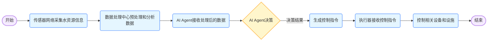

# AI Agent在智能水资源管理中的角色

> 关键词：AI Agent、智能水资源管理、自动化决策、数据处理、优化调度

> 摘要：本文深入探讨了AI Agent在智能水资源管理中的角色。首先介绍了智能水资源管理的背景和重要性，阐述了AI Agent的核心概念及其与水资源管理的联系。详细讲解了AI Agent在水资源管理中涉及的核心算法原理和具体操作步骤，包括使用Python代码示例。同时，给出了相关的数学模型和公式，并结合实际案例进行说明。通过项目实战展示了AI Agent在水资源管理中的具体应用，分析了其实际应用场景。最后推荐了学习和开发相关的工具与资源，总结了未来发展趋势与挑战，并提供常见问题解答和参考资料，旨在全面揭示AI Agent在智能水资源管理中发挥的关键作用。

## 1. 背景介绍 
### 1.1 目的和范围
水资源是人类生存和社会发展的重要基础，然而随着人口增长、经济发展和气候变化等因素的影响，水资源短缺、水污染等问题日益严重。智能水资源管理旨在利用先进的信息技术和管理手段，实现水资源的高效利用、合理配置和有效保护。本文的目的是探讨AI Agent在智能水资源管理中的角色和作用，范围涵盖AI Agent的基本原理、在水资源管理中的应用算法、实际案例分析以及未来发展趋势等方面。

### 1.2 预期读者
本文预期读者包括从事水资源管理、人工智能、自动化控制等领域的科研人员、工程师、技术爱好者，以及对智能水资源管理感兴趣的相关行业从业者和管理人员。

### 1.3 文档结构概述
本文首先介绍背景信息，包括目的、预期读者和文档结构概述等。接着阐述AI Agent的核心概念及其与智能水资源管理的联系，并给出相应的原理和架构示意图。然后详细讲解核心算法原理和具体操作步骤，同时给出数学模型和公式。通过项目实战展示AI Agent在水资源管理中的具体应用，分析实际应用场景。推荐相关的学习和开发工具与资源，最后总结未来发展趋势与挑战，提供常见问题解答和参考资料。

### 1.4 术语表
#### 1.4.1 核心术语定义
- **AI Agent（人工智能智能体）**：是一种能够感知环境、根据感知信息进行决策并采取行动的智能实体。它可以独立地或与其他智能体协作，以实现特定的目标。
- **智能水资源管理**：利用先进的信息技术、传感器网络、数据分析和决策支持系统等手段，对水资源的开发、利用、保护和管理进行全面、动态、科学的调控和优化。
- **自动化决策**：由计算机系统根据预设的规则和算法，自动对各种情况进行分析和判断，并做出相应的决策。

#### 1.4.2 相关概念解释
- **多智能体系统（MAS）**：由多个AI Agent组成的系统，这些智能体之间可以相互通信、协作和竞争，以实现共同的或各自的目标。在智能水资源管理中，多智能体系统可以用于协调不同部门、不同地区之间的水资源管理工作。
- **传感器网络**：由大量的传感器节点组成的网络，这些节点可以实时采集水资源的各种信息，如水位、流量、水质等，并将信息传输到数据处理中心。

#### 1.4.3 缩略词列表
- **AI**：Artificial Intelligence（人工智能）
- **MAS**：Multi - Agent System（多智能体系统）
- **IoT**：Internet of Things（物联网）

## 2. 核心概念与联系 
### 2.1 AI Agent的核心概念
AI Agent是一种具有感知、决策和行动能力的智能实体。它可以通过传感器感知环境信息，根据内部的知识库和推理机制进行决策，然后通过执行器采取相应的行动。AI Agent的基本结构包括感知模块、决策模块和行动模块。感知模块负责收集环境信息，决策模块根据感知信息和目标进行决策，行动模块执行决策结果。

### 2.2 AI Agent与智能水资源管理的联系
在智能水资源管理中，AI Agent可以扮演多种角色。例如，它可以作为数据采集智能体，通过传感器网络实时采集水资源的各种信息；作为决策智能体，根据采集到的数据和预设的规则进行自动化决策，如水资源的调度、污染治理等；作为执行智能体，控制相关的设备和设施，实现水资源管理的具体行动。

### 2.3 原理和架构的文本示意图
AI Agent在智能水资源管理中的原理和架构可以描述如下：首先，传感器网络将采集到的水资源信息传输到数据处理中心。数据处理中心对数据进行预处理和分析，然后将处理后的数据发送给AI Agent。AI Agent根据这些数据和内部的知识库进行决策，生成相应的控制指令。控制指令通过执行器传输到相关的设备和设施，如水泵、阀门等，实现对水资源的调控和管理。

### 2.4 Mermaid流程图


## 3. 核心算法原理 & 具体操作步骤 
### 3.1 核心算法原理
在智能水资源管理中，AI Agent常用的算法包括强化学习算法、遗传算法等。下面以强化学习算法为例进行详细讲解。

强化学习是一种通过智能体与环境进行交互，不断尝试和学习，以获得最大累积奖励的机器学习方法。在智能水资源管理中，智能体的目标是根据当前的水资源状态（如水位、流量等），采取最优的行动（如开启或关闭水泵、调节阀门开度等），以实现水资源的高效利用和合理配置。

强化学习算法的核心是策略函数 $\pi(s)$，它表示在状态 $s$ 下智能体采取行动 $a$ 的概率。智能体通过不断地与环境交互，根据获得的奖励 $r$ 来更新策略函数，以提高自身的性能。

### 3.2 具体操作步骤
1. **定义环境**：确定智能水资源管理的环境状态，如水位、流量、水质等。定义智能体可以采取的行动，如开启或关闭水泵、调节阀门开度等。
2. **初始化策略函数**：随机初始化策略函数 $\pi(s)$。
3. **智能体与环境交互**：智能体根据当前的状态 $s$，按照策略函数 $\pi(s)$ 选择行动 $a$，并执行该行动。环境根据智能体的行动，返回下一个状态 $s'$ 和奖励 $r$。
4. **更新策略函数**：根据获得的奖励 $r$ 和下一个状态 $s'$，使用强化学习算法（如Q - learning算法）更新策略函数 $\pi(s)$。
5. **重复步骤3和4**：直到达到预定的训练次数或满足终止条件。

### 3.3 Python源代码示例
```python
import numpy as np

# 定义环境状态和行动空间
state_space = 10  # 假设状态空间有10个状态
action_space = 3  # 假设行动空间有3个行动

# 初始化Q表
Q = np.zeros((state_space, action_space))

# 定义超参数
alpha = 0.1  # 学习率
gamma = 0.9  # 折扣因子
epsilon = 0.1  # 探索率
num_episodes = 1000  # 训练回合数

# 定义奖励函数（示例）
def get_reward(state, action):
    # 这里简单定义一个奖励函数，实际应用中需要根据具体情况定义
    if state == 5 and action == 1:
        return 10
    else:
        return -1

# 定义Q - learning算法
def q_learning():
    for episode in range(num_episodes):
        state = np.random.randint(0, state_space)  # 随机初始化状态
        done = False
        while not done:
            if np.random.uniform(0, 1) < epsilon:
                action = np.random.randint(0, action_space)  # 探索
            else:
                action = np.argmax(Q[state, :])  # 利用

            reward = get_reward(state, action)
            next_state = np.random.randint(0, state_space)  # 简单模拟下一个状态

            # 更新Q表
            Q[state, action] = Q[state, action] + alpha * (reward + gamma * np.max(Q[next_state, :]) - Q[state, action])

            state = next_state

            if state == 9:  # 终止条件
                done = True

    return Q

# 训练Q表
Q = q_learning()
print("训练后的Q表：")
print(Q)
```

## 4. 数学模型和公式 & 详细讲解 & 举例说明 
### 4.1 强化学习的数学模型
强化学习的数学模型可以用马尔可夫决策过程（MDP）来描述。马尔可夫决策过程由一个四元组 $(S, A, P, R)$ 组成，其中：
- $S$ 是状态空间，表示环境的所有可能状态。
- $A$ 是行动空间，表示智能体可以采取的所有可能行动。
- $P(s'|s, a)$ 是状态转移概率，表示在状态 $s$ 下采取行动 $a$ 后转移到状态 $s'$ 的概率。
- $R(s, a, s')$ 是奖励函数，表示在状态 $s$ 下采取行动 $a$ 后转移到状态 $s'$ 所获得的奖励。

### 4.2 Q - learning算法的公式
Q - learning算法是一种基于值函数的强化学习算法，其核心是更新Q表。Q表 $Q(s, a)$ 表示在状态 $s$ 下采取行动 $a$ 的价值。Q - learning算法的更新公式为：

$$Q(s, a) \leftarrow Q(s, a) + \alpha \left[ r + \gamma \max_{a'} Q(s', a') - Q(s, a) \right]$$

其中：
- $\alpha$ 是学习率，控制每次更新的步长。
- $\gamma$ 是折扣因子，用于权衡当前奖励和未来奖励的重要性。
- $r$ 是当前获得的奖励。
- $s'$ 是下一个状态。
- $\max_{a'} Q(s', a')$ 表示在下一个状态 $s'$ 下采取最优行动的Q值。

### 4.3 举例说明
假设智能水资源管理的状态空间 $S = \{0, 1, 2, 3, 4, 5, 6, 7, 8, 9\}$，行动空间 $A = \{0, 1, 2\}$。当前状态 $s = 3$，智能体采取行动 $a = 1$，获得奖励 $r = -1$，下一个状态 $s' = 4$。假设学习率 $\alpha = 0.1$，折扣因子 $\gamma = 0.9$，当前的Q表中 $Q(3, 1) = 0$，$\max_{a'} Q(4, a') = 2$。

根据Q - learning算法的更新公式，更新后的 $Q(3, 1)$ 为：

$$
\begin{align*}
Q(3, 1) &\leftarrow Q(3, 1) + \alpha \left[ r + \gamma \max_{a'} Q(4, a') - Q(3, 1) \right]\\
&= 0 + 0.1 \times \left[ -1 + 0.9 \times 2 - 0 \right]\\
&= 0 + 0.1 \times ( -1 + 1.8)\\
&= 0 + 0.1 \times 0.8\\
&= 0.08
\end{align*}
$$

## 5. 项目实战：代码实际案例和详细解释说明 
### 5.1  开发环境搭建
- **操作系统**：可以选择Windows、Linux或macOS等常见的操作系统。
- **Python环境**：安装Python 3.x版本，可以从Python官方网站（https://www.python.org/downloads/）下载安装包进行安装。
- **开发工具**：推荐使用PyCharm、Jupyter Notebook等开发工具。可以从官方网站下载安装。
- **相关库**：安装NumPy、Matplotlib等库，可以使用以下命令进行安装：
```sh
pip install numpy matplotlib
```

### 5.2  源代码详细实现和代码解读
```python
import numpy as np
import matplotlib.pyplot as plt

# 定义环境参数
state_space = 10  # 状态空间大小
action_space = 3  # 行动空间大小
num_episodes = 1000  # 训练回合数
alpha = 0.1  # 学习率
gamma = 0.9  # 折扣因子
epsilon = 0.1  # 探索率

# 初始化Q表
Q = np.zeros((state_space, action_space))

# 定义奖励函数（示例）
def get_reward(state, action):
    if state == 5 and action == 1:
        return 10
    else:
        return -1

# 定义Q - learning算法
def q_learning():
    total_rewards = []  # 记录每个回合的总奖励
    for episode in range(num_episodes):
        state = np.random.randint(0, state_space)  # 随机初始化状态
        done = False
        total_reward = 0  # 记录当前回合的总奖励
        while not done:
            if np.random.uniform(0, 1) < epsilon:
                action = np.random.randint(0, action_space)  # 探索
            else:
                action = np.argmax(Q[state, :])  # 利用

            reward = get_reward(state, action)
            next_state = np.random.randint(0, state_space)  # 简单模拟下一个状态

            # 更新Q表
            Q[state, action] = Q[state, action] + alpha * (reward + gamma * np.max(Q[next_state, :]) - Q[state, action])

            state = next_state
            total_reward += reward

            if state == 9:  # 终止条件
                done = True

        total_rewards.append(total_reward)

    return total_rewards

# 训练Q表
total_rewards = q_learning()

# 绘制训练过程中总奖励的变化曲线
plt.plot(total_rewards)
plt.xlabel('Episode')
plt.ylabel('Total Reward')
plt.title('Training Process of Q - learning')
plt.show()
```

### 5.3  代码解读与分析
- **环境参数定义**：定义了状态空间大小、行动空间大小、训练回合数、学习率、折扣因子和探索率等环境参数。
- **Q表初始化**：使用 `np.zeros` 函数初始化Q表，Q表的大小为状态空间大小乘以行动空间大小。
- **奖励函数**：定义了一个简单的奖励函数，根据当前状态和行动返回相应的奖励。
- **Q - learning算法**：在每个回合中，智能体根据当前状态选择行动，执行行动后获得奖励和下一个状态，然后更新Q表。记录每个回合的总奖励。
- **训练过程可视化**：使用 `matplotlib` 库绘制训练过程中总奖励的变化曲线，直观地展示智能体的学习过程。

## 6. 实际应用场景 
### 6.1 水资源调度
AI Agent可以根据实时的水位、流量等信息，自动调整水泵、阀门等设备的运行状态，实现水资源的合理调度。例如，在干旱时期，AI Agent可以根据水库的水位和各地区的用水需求，优化水资源的分配，确保重要地区的用水需求得到满足。

### 6.2 水质监测与治理
AI Agent可以通过传感器网络实时监测水质信息，如酸碱度、溶解氧、化学需氧量等。当检测到水质超标时，AI Agent可以自动启动相应的治理设备，如污水处理设备、水质净化设备等，对污染水源进行治理。

### 6.3 水资源预测与预警
AI Agent可以利用历史数据和机器学习算法，对水资源的变化趋势进行预测，如水位变化、流量变化、水质变化等。当预测到可能出现的水资源危机时，AI Agent可以及时发出预警信息，提醒相关部门采取措施。

### 6.4 水利设施管理
AI Agent可以对水利设施进行实时监测和管理，如大坝、水闸、泵站等。通过分析设施的运行状态和性能数据，AI Agent可以及时发现设施的故障和隐患，并自动安排维修和保养计划。

## 7. 工具和资源推荐
### 7.1 学习资源推荐
#### 7.1.1 书籍推荐
- 《人工智能：一种现代的方法》：全面介绍了人工智能的基本概念、算法和应用，是人工智能领域的经典教材。
- 《强化学习：原理与Python实现》：详细讲解了强化学习的原理和算法，并给出了Python代码实现，适合初学者学习。
- 《水资源系统分析》：介绍了水资源系统的分析方法和模型，对于理解智能水资源管理的原理和方法有很大帮助。

#### 7.1.2 在线课程
- Coursera上的“Artificial Intelligence for Robotics”：该课程介绍了人工智能在机器人领域的应用，包括强化学习等算法，对于理解AI Agent的原理和应用有很大帮助。
- edX上的“Introduction to Water Resources Systems”：该课程介绍了水资源系统的基本概念、模型和分析方法，适合学习智能水资源管理的基础知识。

#### 7.1.3 技术博客和网站
- Towards Data Science：一个专注于数据科学和人工智能的技术博客，上面有很多关于强化学习、AI Agent等方面的文章。
- 中国水利学会官网：提供了大量的水资源管理方面的政策、技术和研究成果等信息。

### 7.2 开发工具框架推荐
#### 7.2.1 IDE和编辑器
- PyCharm：一款专业的Python集成开发环境，具有代码编辑、调试、版本控制等功能，适合开发Python项目。
- Jupyter Notebook：一个交互式的开发环境，支持Python、R等多种编程语言，适合进行数据分析和模型开发。

#### 7.2.2 调试和性能分析工具
- PDB：Python自带的调试工具，可以帮助开发者定位代码中的错误。
- cProfile：Python的性能分析工具，可以分析代码的运行时间和资源占用情况。

#### 7.2.3 相关框架和库
- TensorFlow：一个开源的机器学习框架，提供了丰富的深度学习算法和工具，适合开发复杂的AI Agent模型。
- OpenAI Gym：一个开源的强化学习环境库，提供了多种环境和任务，方便开发者进行强化学习算法的实验和验证。

### 7.3 相关论文著作推荐
#### 7.3.1 经典论文
- “Reinforcement Learning: An Introduction”：由Richard S. Sutton和Andrew G. Barto撰写的经典论文，全面介绍了强化学习的基本概念、算法和理论。
- “A Markov Decision Process Model for Water Resources Management”：该论文提出了一种基于马尔可夫决策过程的水资源管理模型，对于理解AI Agent在水资源管理中的应用有重要参考价值。

#### 7.3.2 最新研究成果
- 关注ACM SIGKDD、NeurIPS等顶级学术会议的论文，这些会议上有很多关于人工智能和水资源管理的最新研究成果。
- 查阅《Water Resources Research》、《Journal of Hydrology》等水资源领域的权威期刊，了解最新的水资源管理技术和方法。

#### 7.3.3 应用案例分析
- 参考一些实际的水资源管理项目案例，如澳大利亚的墨累 - 达令盆地水资源管理项目、中国的南水北调工程等，了解AI Agent在实际项目中的应用效果和经验教训。

## 8. 总结：未来发展趋势与挑战
### 8.1 未来发展趋势
- **多智能体协同**：未来的智能水资源管理系统将越来越多地采用多智能体协同的方式，不同的AI Agent可以分工协作，共同完成水资源管理的任务。例如，数据采集智能体负责采集水资源信息，决策智能体负责进行决策，执行智能体负责执行决策结果。
- **与物联网深度融合**：随着物联网技术的发展，传感器网络将更加普及和智能化。AI Agent可以与物联网设备深度融合，实现对水资源的实时、精准监测和管理。
- **强化学习与深度学习的结合**：强化学习和深度学习都是人工智能领域的重要技术。未来，将强化学习和深度学习结合起来，可以提高AI Agent的学习能力和决策能力，更好地应对复杂的水资源管理问题。

### 8.2 挑战
- **数据质量和安全**：智能水资源管理依赖于大量的水资源信息，数据的质量和安全直接影响到AI Agent的决策效果。如何保证数据的准确性、完整性和安全性是一个重要的挑战。
- **算法的可解释性**：AI Agent的决策过程往往比较复杂，缺乏可解释性。在水资源管理这样的关键领域，需要保证AI Agent的决策过程是可解释的，以便用户理解和信任其决策结果。
- **系统的可靠性和稳定性**：智能水资源管理系统需要长期稳定运行，以确保水资源的安全和合理利用。如何提高系统的可靠性和稳定性，避免系统故障和错误决策是一个重要的挑战。

## 9. 附录：常见问题与解答
### 9.1 什么是AI Agent？
AI Agent是一种能够感知环境、根据感知信息进行决策并采取行动的智能实体。它可以独立地或与其他智能体协作，以实现特定的目标。

### 9.2 AI Agent在智能水资源管理中有哪些应用？
AI Agent在智能水资源管理中可以应用于水资源调度、水质监测与治理、水资源预测与预警、水利设施管理等方面。

### 9.3 如何选择适合的强化学习算法？
选择适合的强化学习算法需要考虑问题的特点、环境的复杂度、数据的可用性等因素。例如，对于简单的问题，可以选择Q - learning算法；对于复杂的问题，可以选择深度强化学习算法，如DQN、A2C等。

### 9.4 如何保证AI Agent在智能水资源管理中的决策质量？
可以通过以下方法保证AI Agent在智能水资源管理中的决策质量：
- 提高数据质量，确保采集到的水资源信息准确、完整。
- 选择合适的算法和模型，根据实际问题进行优化和调整。
- 进行充分的实验和验证，对AI Agent的决策结果进行评估和分析。
- 引入专家知识和经验，对AI Agent的决策过程进行指导和修正。

## 10. 扩展阅读 & 参考资料
- Sutton, R. S., & Barto, A. G. (2018). Reinforcement Learning: An Introduction. MIT press.
- Loucks, D. P., Stedinger, J. R., & Haith, D. A. (2005). Water resources systems planning and analysis. Prentice Hall.
- OpenAI Gym官方文档：https://gym.openai.com/docs/
- TensorFlow官方文档：https://www.tensorflow.org/
- 中国水利学会官网：https://www.cws.net.cn/ 