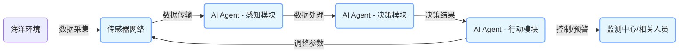

# AI Agent在智能海洋环境监测中的实践

> 关键词：AI Agent、智能海洋环境监测、传感器网络、数据处理、决策优化

> 摘要：本文围绕AI Agent在智能海洋环境监测中的实践展开深入探讨。首先介绍了海洋环境监测的背景和重要性，阐述了AI Agent的核心概念及其与海洋监测的联系。接着详细讲解了AI Agent相关的核心算法原理，并给出具体操作步骤和Python源代码示例。通过数学模型和公式进一步剖析其内在机制，结合实际案例说明其在海洋监测中的应用。同时介绍了项目实战的开发环境搭建、源代码实现与解读。还探讨了AI Agent在智能海洋环境监测中的实际应用场景，推荐了相关的学习资源、开发工具框架以及论文著作。最后总结了未来发展趋势与挑战，并提供常见问题解答和扩展阅读参考资料，旨在为相关领域的研究和实践提供全面而深入的技术指导。

## 1. 背景介绍 
### 1.1 目的和范围
海洋作为地球生态系统的重要组成部分，其环境状况对全球气候、生态平衡和人类社会发展有着深远影响。智能海洋环境监测旨在实时、准确地获取海洋环境的各种参数，包括水温、盐度、酸碱度、溶解氧、海流速度等，以便对海洋环境的变化进行监测、预警和管理。

本文章的范围主要聚焦于AI Agent在智能海洋环境监测中的应用，包括AI Agent的核心概念、算法原理、数学模型，以及如何在实际项目中运用AI Agent进行海洋环境监测，同时探讨其应用场景、未来发展趋势等。

### 1.2 预期读者
本文预期读者包括从事海洋科学研究、环境监测、人工智能、计算机科学等领域的科研人员、工程师、技术爱好者，以及相关专业的学生。对于希望了解AI Agent技术在海洋环境监测中应用的人士，本文将提供全面而深入的技术知识和实践经验。

### 1.3 文档结构概述
本文将按照以下结构进行组织：
1. **背景介绍**：阐述智能海洋环境监测的目的、范围，明确预期读者，概述文档结构，并介绍相关术语。
2. **核心概念与联系**：介绍AI Agent的核心概念，分析其与智能海洋环境监测的联系，通过文本示意图和Mermaid流程图展示其架构。
3. **核心算法原理 & 具体操作步骤**：详细讲解AI Agent在海洋环境监测中涉及的核心算法原理，给出具体操作步骤，并使用Python源代码进行阐述。
4. **数学模型和公式 & 详细讲解 & 举例说明**：建立AI Agent在海洋环境监测中的数学模型，给出相关公式并进行详细讲解，通过实际例子说明其应用。
5. **项目实战：代码实际案例和详细解释说明**：介绍项目实战的开发环境搭建，给出源代码的详细实现和代码解读，分析代码的功能和作用。
6. **实际应用场景**：探讨AI Agent在智能海洋环境监测中的实际应用场景，如海洋灾害预警、海洋生态保护等。
7. **工具和资源推荐**：推荐相关的学习资源、开发工具框架以及论文著作，帮助读者进一步深入学习和研究。
8. **总结：未来发展趋势与挑战**：总结AI Agent在智能海洋环境监测中的应用现状，分析未来发展趋势和面临的挑战。
9. **附录：常见问题与解答**：解答读者在学习和实践过程中常见的问题。
10. **扩展阅读 & 参考资料**：提供相关的扩展阅读资料和参考书目，方便读者进一步查阅。

### 1.4 术语表
#### 1.4.1 核心术语定义
- **AI Agent（人工智能智能体）**：是一种能够感知环境、根据感知信息进行决策并采取行动的智能实体。在海洋环境监测中，AI Agent可以通过传感器获取海洋环境数据，进行分析和处理，并根据结果采取相应的行动，如调整监测策略、发出预警等。
- **智能海洋环境监测**：利用先进的传感器技术、通信技术和人工智能技术，对海洋环境的各种参数进行实时、自动、智能的监测和分析，以实现对海洋环境变化的及时掌握和有效管理。
- **传感器网络**：由大量分布在海洋中的传感器节点组成的网络，用于实时采集海洋环境数据，并将数据传输到数据处理中心。
- **数据处理**：对传感器采集到的海洋环境数据进行清洗、滤波、特征提取、分析等操作，以获取有用的信息。
- **决策优化**：根据数据处理的结果，利用人工智能算法对监测策略、预警机制等进行优化，以提高海洋环境监测的效率和准确性。

#### 1.4.2 相关概念解释
- **机器学习**：是人工智能的一个重要分支，通过对大量数据的学习和分析，自动发现数据中的规律和模式，并利用这些规律和模式进行预测和决策。在海洋环境监测中，机器学习可以用于对海洋环境数据的分类、预测和异常检测等。
- **深度学习**：是机器学习的一种特殊形式，通过构建多层神经网络，自动学习数据的特征和表示，从而实现对复杂数据的处理和分析。在海洋环境监测中，深度学习可以用于对海洋图像、声音等非结构化数据的处理和分析。
- **物联网（IoT）**：是指通过各种信息传感器、射频识别技术、全球定位系统、红外感应器、激光扫描器等各种装置与技术，实时采集任何需要监控、 连接、互动的物体或过程，采集其声、光、热、电、力学、化学、生物、位置等各种需要的信息，通过各类可能的网络接入，实现物与物、物与人的泛在连接，实现对物品和过程的智能化感知、识别和管理。在海洋环境监测中，物联网技术可以用于传感器网络的构建和数据传输。

#### 1.4.3 缩略词列表
- **AI**：Artificial Intelligence（人工智能）
- **IoT**：Internet of Things（物联网）
- **ML**：Machine Learning（机器学习）
- **DL**：Deep Learning（深度学习）

## 2. 核心概念与联系 

### 2.1 AI Agent核心概念
AI Agent是一种具有感知、决策和行动能力的智能实体。它可以通过传感器感知环境中的信息，对这些信息进行分析和处理，然后根据预设的目标和规则做出决策，并采取相应的行动来影响环境。AI Agent通常由以下几个部分组成：
- **感知模块**：负责获取环境中的信息，如传感器采集的数据。
- **决策模块**：根据感知模块获取的信息，结合预设的目标和规则，进行推理和决策。
- **行动模块**：根据决策模块的结果，采取相应的行动，如控制传感器的工作状态、发送预警信息等。

### 2.2 AI Agent与智能海洋环境监测的联系
在智能海洋环境监测中，AI Agent可以发挥重要作用。传感器网络就像是AI Agent的感知器官，负责实时采集海洋环境的各种数据。AI Agent的决策模块可以对这些数据进行分析和处理，判断海洋环境的状态是否正常，是否存在潜在的风险。如果发现异常情况，AI Agent的行动模块可以及时发出预警信息，通知相关人员采取措施。同时，AI Agent还可以根据海洋环境的变化，自动调整传感器的工作参数和监测策略，提高监测的效率和准确性。

### 2.3 文本示意图
AI Agent在智能海洋环境监测中的架构可以用以下文本示意图表示：

海洋环境 <-- 传感器网络 --> AI Agent（感知模块 --> 决策模块 --> 行动模块） --> 监测中心/相关人员

传感器网络负责采集海洋环境的数据，并将数据传输给AI Agent的感知模块。感知模块将数据传递给决策模块，决策模块进行分析和决策，然后将决策结果传递给行动模块。行动模块根据决策结果采取相应的行动，如控制传感器、发出预警等。最终，相关信息可以传输到监测中心或通知相关人员。

### 2.4 Mermaid流程图


## 3. 核心算法原理 & 具体操作步骤 

### 3.1 核心算法原理 - 基于机器学习的异常检测算法
在智能海洋环境监测中，异常检测是一个重要的任务。我们可以使用基于机器学习的异常检测算法来判断海洋环境数据是否存在异常。这里以孤立森林（Isolation Forest）算法为例进行讲解。

孤立森林算法是一种基于树结构的异常检测算法，其基本思想是通过随机划分数据空间，将异常点与正常点分离。异常点通常是那些容易被孤立的点，因为它们在数据空间中相对较为稀疏。

### 3.2 具体操作步骤
1. **数据预处理**：对传感器采集到的海洋环境数据进行清洗、归一化等处理，以提高数据的质量和算法的性能。
2. **模型训练**：使用训练数据对孤立森林模型进行训练，确定模型的参数。
3. **异常检测**：使用训练好的模型对新的海洋环境数据进行异常检测，判断数据是否存在异常。
4. **结果分析**：对异常检测的结果进行分析，确定异常点的位置和原因，并采取相应的措施。

### 3.3 Python源代码实现
```python
import numpy as np
from sklearn.ensemble import IsolationForest

# 生成示例数据
np.random.seed(42)
normal_data = np.random.randn(100, 2)  # 正常数据
anomaly_data = np.random.randn(10, 2) + 5  # 异常数据
data = np.vstack((normal_data, anomaly_data))

# 数据预处理（这里简单省略）

# 模型训练
clf = IsolationForest(contamination=0.1)  # 异常数据比例为0.1
clf.fit(data)

# 异常检测
predictions = clf.predict(data)

# 结果分析
anomaly_indices = np.where(predictions == -1)[0]
print("异常点的索引：", anomaly_indices)
```

### 3.4 代码解释
1. **数据生成**：使用`numpy`生成了100个正常数据点和10个异常数据点，并将它们合并为一个数据集。
2. **模型训练**：使用`IsolationForest`类创建一个孤立森林模型，并使用`fit`方法对模型进行训练。
3. **异常检测**：使用`predict`方法对数据进行异常检测，返回值为1表示正常点，-1表示异常点。
4. **结果分析**：使用`np.where`函数找出异常点的索引，并打印出来。

## 4. 数学模型和公式 & 详细讲解 & 举例说明 

### 4.1 孤立森林算法的数学模型
孤立森林算法的核心是构建一系列的孤立树（Isolation Tree）。孤立树是一种二叉树，其构建过程如下：
1. 从数据集中随机选择一个特征和一个分割点。
2. 根据分割点将数据集划分为两个子集。
3. 递归地对两个子集重复步骤1和2，直到每个子集只有一个数据点或达到预设的树深度。

对于一个数据点 $x$，其在孤立树中的路径长度 $h(x)$ 可以用来衡量该数据点的异常程度。路径长度越短，说明该数据点越容易被孤立，即越有可能是异常点。

### 4.2 异常分数计算
孤立森林算法通过计算数据点的异常分数 $s(x, n)$ 来判断其是否为异常点，异常分数的计算公式如下：
$$s(x, n) = 2^{-\frac{E(h(x))}{c(n)}}$$
其中，$E(h(x))$ 是数据点 $x$ 在所有孤立树中的平均路径长度，$c(n)$ 是一个与数据集大小 $n$ 有关的函数，其计算公式为：
$$c(n) = 2H(n - 1) - \frac{2(n - 1)}{n}$$
其中，$H(k)$ 是调和数，其计算公式为：
$$H(k) = \ln(k) + \gamma + \frac{1}{2k} - \frac{1}{12k^2} + \cdots$$
$\gamma$ 是欧拉常数，约为0.5772。

### 4.3 详细讲解
异常分数 $s(x, n)$ 的取值范围是 $[0, 1]$。当 $s(x, n)$ 接近1时，说明数据点 $x$ 很可能是异常点；当 $s(x, n)$ 接近0时，说明数据点 $x$ 很可能是正常点。

### 4.4 举例说明
假设我们有一个数据集 $D$，大小为 $n = 100$，其中一个数据点 $x$ 在所有孤立树中的平均路径长度 $E(h(x)) = 3$。首先计算 $c(n)$：
$$c(100) = 2H(99) - \frac{2\times99}{100}$$
$$H(99) \approx \ln(99) + 0.5772 + \frac{1}{2\times99} - \frac{1}{12\times99^2} \approx 4.605 + 0.5772 + 0.0051 - 0.000009 \approx 5.1873$$
$$c(100) = 2\times5.1873 - \frac{2\times99}{100} = 10.3746 - 1.98 = 8.3946$$
然后计算异常分数 $s(x, 100)$：
$$s(x, 100) = 2^{-\frac{3}{8.3946}} \approx 2^{-0.3574} \approx 0.79$$
由于异常分数 $s(x, 100) \approx 0.79$ 接近1，所以数据点 $x$ 很可能是异常点。

## 5. 项目实战：代码实际案例和详细解释说明 

### 5.1  开发环境搭建
1. **操作系统**：推荐使用Linux或Windows操作系统。
2. **Python环境**：安装Python 3.6及以上版本。
3. **开发工具**：推荐使用PyCharm或Jupyter Notebook作为开发工具。
4. **依赖库安装**：使用`pip`安装以下依赖库：
```sh
pip install numpy scikit-learn pandas matplotlib
```

### 5.2  源代码详细实现和代码解读
以下是一个完整的AI Agent在智能海洋环境监测中的项目实战代码示例，该示例模拟了传感器数据的采集、异常检测和预警功能。

```python
import numpy as np
import pandas as pd
from sklearn.ensemble import IsolationForest
import matplotlib.pyplot as plt

# 模拟传感器数据采集
def generate_sensor_data(n_samples, n_features):
    normal_data = np.random.randn(n_samples, n_features)  # 正常数据
    anomaly_data = np.random.randn(int(n_samples * 0.1), n_features) + 5  # 10%的异常数据
    data = np.vstack((normal_data, anomaly_data))
    np.random.shuffle(data)
    return data

# 数据预处理
def preprocess_data(data):
    # 简单归一化处理
    mean = np.mean(data, axis=0)
    std = np.std(data, axis=0)
    data = (data - mean) / std
    return data

# 异常检测
def anomaly_detection(data, contamination=0.1):
    clf = IsolationForest(contamination=contamination)
    clf.fit(data)
    predictions = clf.predict(data)
    return predictions

# 预警功能
def send_warning(anomaly_indices):
    if len(anomaly_indices) > 0:
        print("检测到异常数据点，索引为：", anomaly_indices)
        # 这里可以添加实际的预警通知代码，如发送邮件、短信等
    else:
        print("未检测到异常数据点。")

# 主函数
def main():
    # 生成传感器数据
    n_samples = 1000
    n_features = 2
    data = generate_sensor_data(n_samples, n_features)

    # 数据预处理
    processed_data = preprocess_data(data)

    # 异常检测
    predictions = anomaly_detection(processed_data)

    # 找出异常点的索引
    anomaly_indices = np.where(predictions == -1)[0]

    # 发送预警
    send_warning(anomaly_indices)

    # 可视化结果
    plt.scatter(data[:, 0], data[:, 1], c=predictions, cmap='viridis')
    plt.title('异常检测结果')
    plt.xlabel('特征1')
    plt.ylabel('特征2')
    plt.show()

if __name__ == "__main__":
    main()
```

### 5.3  代码解读与分析
1. **传感器数据生成**：`generate_sensor_data`函数模拟了传感器数据的采集过程，生成了一定数量的正常数据和异常数据，并将它们打乱。
2. **数据预处理**：`preprocess_data`函数对采集到的数据进行归一化处理，以提高异常检测算法的性能。
3. **异常检测**：`anomaly_detection`函数使用孤立森林算法对预处理后的数据进行异常检测，返回每个数据点的预测结果。
4. **预警功能**：`send_warning`函数根据异常点的索引，判断是否检测到异常数据点，并发送相应的预警信息。
5. **主函数**：`main`函数调用上述函数，完成数据生成、预处理、异常检测、预警和可视化等任务。

通过这个项目实战，我们可以看到AI Agent在智能海洋环境监测中的具体应用过程，包括数据采集、处理、分析和决策等环节。

## 6. 实际应用场景 
### 6.1 海洋灾害预警
AI Agent可以实时监测海洋环境的各种参数，如海浪高度、海流速度、水温等。当监测到这些参数出现异常变化时，AI Agent可以及时发出预警信息，通知相关部门采取措施，预防海洋灾害的发生，如海啸、风暴潮等。

### 6.2 海洋生态保护
通过对海洋生态环境的监测，如海洋生物的种类、数量、分布等，AI Agent可以及时发现海洋生态系统的变化和异常情况。例如，当检测到某种海洋生物的数量突然减少时，AI Agent可以发出预警，提醒相关部门进行调查和保护，以维护海洋生态平衡。

### 6.3 海洋资源管理
AI Agent可以帮助监测海洋资源的分布和变化情况，如渔业资源、矿产资源等。通过对海洋资源的实时监测和分析，AI Agent可以为海洋资源的合理开发和利用提供决策支持，提高资源利用效率，避免资源过度开发和浪费。

### 6.4 海上安全保障
在海上航行和作业过程中，AI Agent可以实时监测海洋环境的变化，如气象条件、海况等。当遇到恶劣的天气或海况时，AI Agent可以及时向船只和作业人员发出预警信息，提醒他们采取安全措施，保障海上航行和作业的安全。

## 7. 工具和资源推荐
### 7.1 学习资源推荐
#### 7.1.1 书籍推荐
- 《Python机器学习实战》：介绍了Python在机器学习领域的应用，包括各种机器学习算法的原理和实现。
- 《深度学习》：由深度学习领域的三位先驱Ian Goodfellow、Yoshua Bengio和Aaron Courville撰写，是深度学习领域的经典教材。
- 《人工智能：一种现代的方法》：全面介绍了人工智能的各个领域，包括搜索算法、知识表示、机器学习、自然语言处理等。

#### 7.1.2 在线课程
- Coursera上的“机器学习”课程：由Andrew Ng教授授课，是机器学习领域的经典课程。
- edX上的“深度学习”课程：由MIT等高校的教授授课，系统介绍了深度学习的理论和实践。
- 中国大学MOOC上的“人工智能基础”课程：由国内知名高校的教授授课，适合初学者学习人工智能的基础知识。

#### 7.1.3 技术博客和网站
- Medium：是一个技术博客平台，上面有很多关于人工智能、机器学习等领域的优质文章。
- Towards Data Science：专注于数据科学和机器学习领域的技术博客，提供了很多实用的技术教程和案例分析。
- 机器之心：国内知名的人工智能媒体，提供了丰富的人工智能技术资讯、研究成果和行业动态。

### 7.2 开发工具框架推荐
#### 7.2.1 IDE和编辑器
- PyCharm：是一款专业的Python集成开发环境，提供了丰富的功能和插件，适合开发Python项目。
- Jupyter Notebook：是一个交互式的开发环境，适合进行数据探索、模型训练和可视化等工作。
- Visual Studio Code：是一款轻量级的代码编辑器，支持多种编程语言和插件，适合快速开发和调试。

#### 7.2.2 调试和性能分析工具
- PDB：Python自带的调试工具，可以帮助开发者调试Python代码。
- Py-Spy：是一个性能分析工具，可以帮助开发者找出Python代码中的性能瓶颈。
- TensorBoard：是TensorFlow的可视化工具，可以帮助开发者可视化模型的训练过程和性能指标。

#### 7.2.3 相关框架和库
- Scikit-learn：是一个开源的机器学习库，提供了丰富的机器学习算法和工具，适合快速开发机器学习模型。
- TensorFlow：是一个开源的深度学习框架，由Google开发，广泛应用于深度学习领域。
- PyTorch：是一个开源的深度学习框架，由Facebook开发，具有动态图的优势，适合研究和开发深度学习模型。

### 7.3 相关论文著作推荐
#### 7.3.1 经典论文
- “Isolation Forest”：介绍了孤立森林算法的原理和实现，是异常检测领域的经典论文。
- “Deep Learning”：由Yoshua Bengio、Geoffrey Hinton和Yann LeCun撰写的综述论文，全面介绍了深度学习的发展历程、理论基础和应用领域。
- “A Survey on Artificial Intelligence in Ocean Engineering”：对人工智能在海洋工程领域的应用进行了综述，分析了人工智能在海洋环境监测、海洋资源开发等方面的应用现状和发展趋势。

#### 7.3.2 最新研究成果
- 可以关注ACM SIGKDD、NeurIPS、ICML等顶级学术会议上的相关研究成果，了解AI Agent在智能海洋环境监测中的最新研究进展。
- 查阅《Journal of Marine Science and Engineering》、《Ocean Engineering》等海洋科学和工程领域的学术期刊，获取最新的研究论文。

#### 7.3.3 应用案例分析
- 可以参考一些实际的AI Agent在智能海洋环境监测中的应用案例，如某些海洋科研机构或企业的项目报告、技术文档等，了解AI Agent在实际应用中的具体实现和效果。

## 8. 总结：未来发展趋势与挑战
### 8.1 未来发展趋势
- **多模态数据融合**：未来的智能海洋环境监测将不仅仅依赖于传统的传感器数据，还将融合海洋图像、声音、视频等多模态数据，以获取更全面、准确的海洋环境信息。AI Agent需要具备处理和分析多模态数据的能力，以提高监测的精度和效率。
- **智能化决策**：随着人工智能技术的不断发展，AI Agent将具备更强的智能化决策能力。它可以根据实时监测数据和历史数据，自动分析和预测海洋环境的变化趋势，并提供最优的决策方案，为海洋管理和决策提供更有力的支持。
- **自主协作**：多个AI Agent之间可以实现自主协作，共同完成海洋环境监测任务。例如，不同区域的AI Agent可以相互通信和协调，共享监测数据和决策信息，提高整个监测系统的性能和可靠性。
- **与物联网深度融合**：物联网技术将为智能海洋环境监测提供更强大的支持。AI Agent可以与海洋中的各种物联网设备进行深度融合，实现对海洋环境的实时、全面、智能监测。

### 8.2 挑战
- **数据质量和安全**：海洋环境监测数据的质量和安全是一个重要的挑战。由于海洋环境的复杂性和不确定性，传感器采集到的数据可能存在噪声、缺失值等问题，需要进行有效的数据预处理和质量控制。同时，海洋环境监测数据涉及到国家海洋权益和安全，需要采取严格的安全措施，防止数据泄露和被攻击。
- **算法复杂度和计算资源**：AI Agent在处理大规模、复杂的海洋环境监测数据时，需要使用复杂的算法和模型。这些算法和模型的计算复杂度较高，需要大量的计算资源和时间。如何在有限的计算资源下提高算法的效率和性能，是一个亟待解决的问题。
- **海洋环境的复杂性**：海洋环境具有高度的复杂性和不确定性，如海洋水流、海浪、海洋生物等因素都会对监测数据产生影响。如何准确地建模和分析海洋环境的复杂性，是AI Agent在智能海洋环境监测中面临的一个挑战。
- **标准和规范**：目前，智能海洋环境监测领域还缺乏统一的标准和规范。不同的传感器、数据处理方法和AI Agent之间可能存在兼容性问题，影响监测系统的集成和互操作性。建立统一的标准和规范，是推动智能海洋环境监测技术发展的关键。

## 9. 附录：常见问题与解答
### 9.1 问题1：AI Agent在智能海洋环境监测中如何保证数据的实时性？
答：为了保证数据的实时性，可以采用以下措施：
- **优化传感器网络**：选择响应速度快、数据传输稳定的传感器，并合理布局传感器网络，减少数据传输的延迟。
- **实时数据处理**：采用高效的数据处理算法和并行计算技术，对传感器采集到的数据进行实时处理和分析。
- **数据缓存和预处理**：在传感器节点或数据传输过程中，对数据进行缓存和预处理，减少数据处理的时间。

### 9.2 问题2：如何选择适合海洋环境监测的AI Agent算法？
答：选择适合海洋环境监测的AI Agent算法需要考虑以下因素：
- **数据特点**：根据海洋环境监测数据的特点，如数据类型、数据量、数据分布等，选择合适的算法。例如，对于结构化的数值数据，可以选择传统的机器学习算法；对于非结构化的数据，如海洋图像、声音等，可以选择深度学习算法。
- **监测任务**：根据监测任务的需求，如异常检测、预测分析、分类识别等，选择合适的算法。例如，对于异常检测任务，可以选择孤立森林、One-Class SVM等算法；对于预测分析任务，可以选择回归分析、时间序列分析等算法。
- **计算资源**：考虑算法的计算复杂度和所需的计算资源，选择在现有计算资源下能够高效运行的算法。

### 9.3 问题3：AI Agent在海洋环境监测中如何处理不确定性？
答：AI Agent可以采用以下方法处理海洋环境监测中的不确定性：
- **概率模型**：使用概率模型来描述和处理不确定性。例如，贝叶斯网络可以用来表示变量之间的概率关系，通过贝叶斯推理来处理不确定性。
- **模糊逻辑**：模糊逻辑可以用来处理模糊和不确定的信息。通过定义模糊集合和模糊规则，AI Agent可以对不确定的信息进行推理和决策。
- **集成学习**：集成学习可以将多个模型的结果进行综合，减少单个模型的不确定性。例如，随机森林、梯度提升等集成学习算法可以提高模型的稳定性和准确性。

## 10. 扩展阅读 & 参考资料
### 10.1 扩展阅读
- 《海洋大数据：理论、方法与应用》：介绍了海洋大数据的概念、技术和应用，包括海洋数据的采集、存储、处理和分析等方面的内容。
- 《智能传感器技术》：详细介绍了智能传感器的原理、设计和应用，对于了解海洋环境监测中的传感器技术有很大的帮助。
- 《人工智能与海洋科技》：探讨了人工智能在海洋科技领域的应用前景和挑战，提供了一些前沿的研究思路和方法。

### 10.2 参考资料
- 相关学术论文和研究报告：可以查阅ACM SIGKDD、NeurIPS、ICML等学术会议和《Journal of Marine Science and Engineering》、《Ocean Engineering》等学术期刊上的相关论文和研究报告。
- 行业标准和规范：可以参考国家和行业发布的相关标准和规范，如海洋环境监测标准、传感器技术标准等。
- 开源代码和数据集：可以在GitHub等开源平台上查找相关的开源代码和数据集，进行学习和实践。