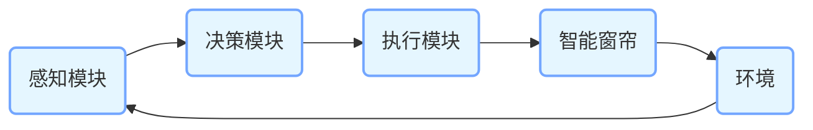

# AI Agent在智能窗帘中的日光与隐私平衡

> 关键词：AI Agent、智能窗帘、日光与隐私平衡、机器学习、传感器技术

> 摘要：本文聚焦于AI Agent在智能窗帘系统中的应用，旨在实现日光与隐私的平衡。通过深入探讨AI Agent的核心概念、相关算法原理以及数学模型，结合项目实战案例详细阐述其在智能窗帘中的具体实现。分析了AI Agent在不同实际应用场景中的作用，推荐了相关的学习资源、开发工具框架以及论文著作。最后对未来发展趋势与挑战进行总结，并提供常见问题解答和扩展阅读参考资料，为相关领域的研究和实践提供全面的指导。

## 1. 背景介绍 
### 1.1 目的和范围
在现代智能家居的发展进程中，智能窗帘作为重要的组成部分，其功能不仅仅局限于简单的开合控制。实现日光与隐私的平衡是智能窗帘进一步发展的关键需求。本文的目的在于深入研究如何利用AI Agent技术来优化智能窗帘系统，使其能够根据不同的环境条件和用户需求，自动调整窗帘的状态，以达到最佳的日光利用和隐私保护效果。范围涵盖了AI Agent的基本原理、相关算法、数学模型，以及在智能窗帘中的具体实现和应用场景分析。

### 1.2 预期读者
本文预期读者包括智能家居领域的研究人员、工程师、开发者，对AI Agent技术和智能窗帘系统感兴趣的技术爱好者，以及相关专业的学生。通过阅读本文，读者可以深入了解AI Agent在智能窗帘中实现日光与隐私平衡的技术原理和实现方法，为相关的研究和实践提供参考。

### 1.3 文档结构概述
本文首先介绍AI Agent在智能窗帘中实现日光与隐私平衡的背景和相关概念，包括目的、预期读者和文档结构概述。接着阐述核心概念与联系，包括AI Agent的原理和架构，以及与智能窗帘系统的关系。然后详细讲解核心算法原理和具体操作步骤，并给出数学模型和公式进行详细说明。通过项目实战案例，展示AI Agent在智能窗帘中的具体实现和代码解读。分析AI Agent在智能窗帘中的实际应用场景，推荐相关的学习资源、开发工具框架和论文著作。最后总结未来发展趋势与挑战，提供常见问题解答和扩展阅读参考资料。

### 1.4 术语表
#### 1.4.1 核心术语定义
- **AI Agent（人工智能智能体）**：是一种能够感知环境、进行决策并采取行动的智能实体，在本文中主要用于智能窗帘系统中，根据环境信息和用户需求进行窗帘状态的控制。
- **智能窗帘**：具备自动控制功能的窗帘系统，能够通过传感器感知环境信息，并根据预设的规则或AI Agent的决策进行窗帘的开合操作。
- **日光与隐私平衡**：指在保证室内有足够的自然光照的同时，满足用户对隐私保护的需求，通过智能窗帘的自动调整来实现两者的协调。

#### 1.4.2 相关概念解释
- **机器学习**：是AI Agent实现智能决策的重要技术手段，通过对大量数据的学习和分析，让AI Agent能够不断优化决策策略，以适应不同的环境和用户需求。
- **传感器技术**：用于智能窗帘系统中感知环境信息，如光照强度、人员活动等，为AI Agent提供决策依据。

#### 1.4.3 缩略词列表
- **AI**：Artificial Intelligence（人工智能）
- **ML**：Machine Learning（机器学习）

## 2. 核心概念与联系 

### 2.1 AI Agent原理
AI Agent的基本原理是通过感知环境信息，利用内部的决策机制进行分析和判断，然后采取相应的行动来影响环境。在智能窗帘系统中，AI Agent通过传感器感知光照强度、时间、人员活动等环境信息，根据预设的规则或机器学习模型进行决策，控制窗帘的开合程度，以实现日光与隐私的平衡。

### 2.2 AI Agent架构
AI Agent的架构主要包括感知模块、决策模块和执行模块。感知模块负责收集环境信息，如光照传感器、红外传感器等；决策模块根据感知到的信息进行分析和决策，可采用规则引擎或机器学习算法；执行模块根据决策结果控制窗帘的开合，如电机驱动装置。

以下是AI Agent架构的Mermaid流程图：


### 2.3 AI Agent与智能窗帘系统的联系
AI Agent是智能窗帘系统实现智能化的核心。智能窗帘系统通过传感器收集环境信息，将其传递给AI Agent。AI Agent根据这些信息进行决策，控制智能窗帘的开合状态，从而实现日光与隐私的平衡。同时，智能窗帘系统的实际运行效果又会反馈给AI Agent，用于其决策策略的优化和调整。

## 3. 核心算法原理 & 具体操作步骤 

### 3.1 基于规则的决策算法
基于规则的决策算法是一种简单直接的AI Agent决策方法。通过预设一系列的规则，根据感知到的环境信息进行匹配，从而确定窗帘的开合状态。

以下是一个基于Python的简单示例代码：
```python
# 定义光照强度阈值
LIGHT_THRESHOLD_HIGH = 800
LIGHT_THRESHOLD_LOW = 200

# 定义时间范围
DAY_TIME_START = 8
DAY_TIME_END = 18

# 定义人员活动状态
PERSON_PRESENT = True
PERSON_ABSENT = False

def rule_based_decision(light_intensity, time, person_status):
    if time >= DAY_TIME_START and time <= DAY_TIME_END:
        if person_status == PERSON_PRESENT:
            if light_intensity > LIGHT_THRESHOLD_HIGH:
                return "close_partially"
            elif light_intensity < LIGHT_THRESHOLD_LOW:
                return "open_full"
            else:
                return "open_partially"
        else:
            return "close_full"
    else:
        return "close_full"

# 示例调用
light_intensity = 600
time = 12
person_status = PERSON_PRESENT
decision = rule_based_decision(light_intensity, time, person_status)
print(f"决策结果: {decision}")
```
### 3.2 基于机器学习的决策算法
基于机器学习的决策算法通过对大量的历史数据进行学习，构建预测模型，从而实现更智能的决策。以监督学习为例，我们可以使用光照强度、时间、人员活动等作为特征，窗帘的开合状态作为标签，训练一个分类模型。

以下是一个使用Python和Scikit-learn库实现的简单示例代码：
```python
import numpy as np
from sklearn.ensemble import RandomForestClassifier

# 生成示例数据
X = np.array([
    [800, 10, 1],
    [300, 14, 1],
    [1000, 16, 0],
    [200, 12, 1]
])
y = np.array(["close_partially", "open_full", "close_full", "open_full"])

# 训练随机森林分类器
clf = RandomForestClassifier()
clf.fit(X, y)

# 示例预测
new_data = np.array([[700, 13, 1]])
prediction = clf.predict(new_data)
print(f"预测结果: {prediction[0]}")
```
### 3.3 具体操作步骤
1. **数据收集**：通过光照传感器、时间传感器、红外传感器等收集环境信息，包括光照强度、时间、人员活动等。
2. **数据预处理**：对收集到的数据进行清洗、归一化等处理，以提高算法的性能。
3. **模型训练**：如果使用机器学习算法，需要使用历史数据进行模型训练。
4. **决策执行**：根据感知到的环境信息，使用基于规则或机器学习的决策算法进行决策，并控制智能窗帘的开合状态。
5. **模型更新**：定期收集新的数据，对机器学习模型进行更新和优化，以适应环境的变化。

## 4. 数学模型和公式 & 详细讲解 & 举例说明 

### 4.1 基于规则的决策模型
基于规则的决策模型可以用条件判断语句来表示。假设光照强度为 $L$，时间为 $t$，人员活动状态为 $p$（$p = 1$ 表示有人，$p = 0$ 表示无人），窗帘的开合状态为 $s$。则可以用以下规则表示：

当 $DAY\_TIME\_START \leq t \leq DAY\_TIME\_END$ 且 $p = 1$ 时：
- 如果 $L > LIGHT\_THRESHOLD\_HIGH$，则 $s =$ "close_partially"
- 如果 $L < LIGHT\_THRESHOLD\_LOW$，则 $s =$ "open_full"
- 否则，$s =$ "open_partially"

当 $DAY\_TIME\_START \leq t \leq DAY\_TIME\_END$ 且 $p = 0$ 时：
- $s =$ "close_full"

当 $t < DAY\_TIME\_START$ 或 $t > DAY\_TIME\_END$ 时：
- $s =$ "close_full"

### 4.2 基于机器学习的决策模型
以随机森林分类器为例，其数学模型可以表示为多个决策树的组合。每个决策树根据输入的特征进行决策，最终通过投票的方式确定最终的分类结果。

假设输入特征向量为 $\mathbf{x} = [x_1, x_2, \cdots, x_n]$，其中 $x_1$ 表示光照强度，$x_2$ 表示时间，$x_3$ 表示人员活动状态等。随机森林分类器由 $m$ 个决策树组成，第 $i$ 个决策树的输出为 $y_i$，则最终的分类结果 $y$ 可以表示为：

$$y = \arg\max_{c \in C} \sum_{i = 1}^{m} \mathbb{I}(y_i = c)$$

其中，$C$ 是所有可能的分类标签集合，$\mathbb{I}(\cdot)$ 是指示函数，当条件为真时取值为 1，否则取值为 0。

### 4.3 举例说明
假设我们使用基于规则的决策模型，当前光照强度 $L = 900$，时间 $t = 11$，人员活动状态 $p = 1$。由于 $8 \leq 11 \leq 18$ 且 $p = 1$，同时 $900 > 800$，根据规则，窗帘的开合状态 $s$ 应该为 "close_partially"。

如果使用基于机器学习的决策模型，假设训练好的随机森林分类器已经对输入特征向量 $\mathbf{x} = [900, 11, 1]$ 进行预测，最终投票结果为 "close_partially"，则窗帘的开合状态也为 "close_partially"。

## 5. 项目实战：代码实际案例和详细解释说明 

### 5.1  开发环境搭建
1. **硬件环境**：
    - 智能窗帘电机驱动模块
    - 光照传感器
    - 红外传感器
    - 微控制器（如Arduino、Raspberry Pi等）
2. **软件环境**：
    - Python编程环境
    - 相关的Python库，如Scikit-learn、RPi.GPIO（如果使用Raspberry Pi）等

### 5.2  源代码详细实现和代码解读
以下是一个使用Raspberry Pi和Python实现的完整示例代码：
```python
import RPi.GPIO as GPIO
import time
import random

# 定义引脚
MOTOR_PIN_OPEN = 17
MOTOR_PIN_CLOSE = 18
LIGHT_SENSOR_PIN = 22
IR_SENSOR_PIN = 23

# 初始化GPIO
GPIO.setmode(GPIO.BCM)
GPIO.setup(MOTOR_PIN_OPEN, GPIO.OUT)
GPIO.setup(MOTOR_PIN_CLOSE, GPIO.OUT)
GPIO.setup(LIGHT_SENSOR_PIN, GPIO.IN)
GPIO.setup(IR_SENSOR_PIN, GPIO.IN)

# 定义光照强度阈值
LIGHT_THRESHOLD_HIGH = 800
LIGHT_THRESHOLD_LOW = 200

# 定义时间范围
DAY_TIME_START = 8
DAY_TIME_END = 18

# 模拟读取光照强度
def read_light_intensity():
    # 这里简单模拟，实际需要根据传感器读取
    return random.randint(100, 1000)

# 模拟读取人员活动状态
def read_person_status():
    # 这里简单模拟，实际需要根据传感器读取
    return random.choice([True, False])

# 基于规则的决策算法
def rule_based_decision(light_intensity, time, person_status):
    if time >= DAY_TIME_START and time <= DAY_TIME_END:
        if person_status == True:
            if light_intensity > LIGHT_THRESHOLD_HIGH:
                return "close_partially"
            elif light_intensity < LIGHT_THRESHOLD_LOW:
                return "open_full"
            else:
                return "open_partially"
        else:
            return "close_full"
    else:
        return "close_full"

# 控制窗帘开合
def control_curtain(decision):
    if decision == "open_full":
        GPIO.output(MOTOR_PIN_OPEN, GPIO.HIGH)
        GPIO.output(MOTOR_PIN_CLOSE, GPIO.LOW)
        time.sleep(5)  # 模拟全开时间
        GPIO.output(MOTOR_PIN_OPEN, GPIO.LOW)
    elif decision == "close_full":
        GPIO.output(MOTOR_PIN_OPEN, GPIO.LOW)
        GPIO.output(MOTOR_PIN_CLOSE, GPIO.HIGH)
        time.sleep(5)  # 模拟全关时间
        GPIO.output(MOTOR_PIN_CLOSE, GPIO.LOW)
    elif decision == "open_partially":
        GPIO.output(MOTOR_PIN_OPEN, GPIO.HIGH)
        GPIO.output(MOTOR_PIN_CLOSE, GPIO.LOW)
        time.sleep(2)  # 模拟部分打开时间
        GPIO.output(MOTOR_PIN_OPEN, GPIO.LOW)
    elif decision == "close_partially":
        GPIO.output(MOTOR_PIN_OPEN, GPIO.LOW)
        GPIO.output(MOTOR_PIN_CLOSE, GPIO.HIGH)
        time.sleep(2)  # 模拟部分关闭时间
        GPIO.output(MOTOR_PIN_CLOSE, GPIO.LOW)

try:
    while True:
        current_time = time.localtime().tm_hour
        light_intensity = read_light_intensity()
        person_status = read_person_status()

        decision = rule_based_decision(light_intensity, current_time, person_status)
        control_curtain(decision)

        time.sleep(60)  # 每分钟检查一次
except KeyboardInterrupt:
    GPIO.cleanup()
```
### 5.3  代码解读与分析
1. **硬件初始化**：通过 `RPi.GPIO` 库初始化GPIO引脚，设置电机驱动引脚和传感器引脚的输入输出模式。
2. **模拟传感器读取**：`read_light_intensity` 和 `read_person_status` 函数用于模拟读取光照强度和人员活动状态，实际应用中需要根据具体传感器进行读取。
3. **基于规则的决策算法**：`rule_based_decision` 函数根据光照强度、时间和人员活动状态进行决策，返回窗帘的开合状态。
4. **窗帘控制**：`control_curtain` 函数根据决策结果控制电机驱动模块，实现窗帘的开合操作。
5. **主循环**：在主循环中，每分钟读取一次环境信息，进行决策并控制窗帘的开合。

## 6. 实际应用场景 
### 6.1 家庭场景
在家庭场景中，AI Agent控制的智能窗帘可以根据不同的时间和人员活动状态自动调整。例如，在白天有人在家时，根据光照强度自动调整窗帘的开合程度，保证室内有足够的自然光照，同时保护隐私；在晚上或无人在家时，自动关闭窗帘，提供更好的隐私保护。

### 6.2 办公场景
在办公场景中，智能窗帘可以根据办公室的使用情况和光照条件进行调整。在白天办公时间，根据光照强度自动调整窗帘，避免阳光直射影响工作；在会议室等需要隐私的区域，当有人使用时自动关闭窗帘，使用结束后自动打开。

### 6.3 酒店场景
在酒店场景中，智能窗帘可以提升客人的入住体验。客人入住时，根据时间和光照条件自动调整窗帘，提供舒适的环境；客人离开房间时，自动关闭窗帘，保护房间隐私。

## 7. 工具和资源推荐
### 7.1 学习资源推荐
#### 7.1.1 书籍推荐
- 《人工智能：一种现代的方法》：全面介绍了人工智能的基本概念、算法和应用，是学习AI Agent的经典书籍。
- 《Python机器学习》：详细讲解了Python在机器学习中的应用，对于理解基于机器学习的决策算法有很大帮助。

#### 7.1.2 在线课程
- Coursera上的“机器学习”课程：由Andrew Ng教授主讲，是学习机器学习的优质课程。
- edX上的“人工智能基础”课程：系统介绍了人工智能的基础知识和应用。

#### 7.1.3 技术博客和网站
- Medium：有很多关于AI Agent和智能家居的技术博客文章。
- 开源中国：提供了丰富的技术文章和开源项目资源。

### 7.2 开发工具框架推荐
#### 7.2.1 IDE和编辑器
- PyCharm：是一款功能强大的Python集成开发环境，适合Python代码的开发和调试。
- Visual Studio Code：轻量级的代码编辑器，支持多种编程语言和插件扩展。

#### 7.2.2 调试和性能分析工具
- PDB：Python自带的调试工具，可以帮助开发者进行代码调试。
- cProfile：Python的性能分析工具，可以分析代码的运行时间和性能瓶颈。

#### 7.2.3 相关框架和库
- Scikit-learn：Python的机器学习库，提供了丰富的机器学习算法和工具。
- TensorFlow：Google开发的深度学习框架，可用于更复杂的AI Agent模型开发。

### 7.3 相关论文著作推荐
#### 7.3.1 经典论文
- “Artificial Intelligence: A Modern Approach”：介绍了人工智能的基本理论和方法。
- “Machine Learning”：阐述了机器学习的基本概念和算法。

#### 7.3.2 最新研究成果
- 可以通过IEEE Xplore、ACM Digital Library等学术数据库查找关于AI Agent在智能家居领域的最新研究成果。

#### 7.3.3 应用案例分析
- 一些智能家居厂商的官方网站会发布相关的应用案例分析，如小米、华为等。

## 8. 总结：未来发展趋势与挑战
### 8.1 未来发展趋势
- **更智能的决策算法**：随着机器学习和深度学习技术的不断发展，AI Agent的决策算法将更加智能和精准，能够更好地适应不同的环境和用户需求。
- **与其他智能家居设备的集成**：智能窗帘将与其他智能家居设备（如智能灯光、智能空调等）进行更深入的集成，实现整个家居环境的智能化控制。
- **个性化定制**：根据用户的个人习惯和偏好，提供个性化的日光与隐私平衡方案。

### 8.2 挑战
- **数据隐私和安全**：智能窗帘系统需要收集大量的环境信息和用户数据，如何保证数据的隐私和安全是一个重要的挑战。
- **环境适应性**：不同的环境条件（如不同的地理位置、季节、天气等）对智能窗帘的日光与隐私平衡控制提出了更高的要求，需要提高AI Agent的环境适应性。
- **成本和可靠性**：降低智能窗帘系统的成本，提高系统的可靠性和稳定性，是推广智能窗帘应用的关键。

## 9. 附录：常见问题与解答
### 9.1 智能窗帘系统的安装复杂吗？
智能窗帘系统的安装相对复杂，需要考虑电机驱动模块、传感器的安装位置和布线等问题。一般建议由专业人员进行安装。

### 9.2 AI Agent的决策算法可以自定义吗？
可以。基于规则的决策算法可以根据用户的需求进行自定义规则的设置；基于机器学习的决策算法可以通过不同的训练数据和模型进行调整。

### 9.3 智能窗帘系统的能耗高吗？
智能窗帘系统的能耗主要取决于电机驱动模块和传感器的功耗。一般来说，合理的设计和优化可以降低系统的能耗。

## 10. 扩展阅读 & 参考资料
- 《智能家居技术与应用》
- 《物联网技术原理与应用》
- 相关的学术期刊和会议论文
- 智能家居厂商的官方文档和技术资料