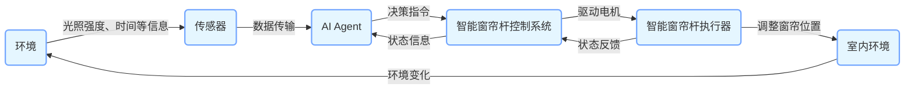

# AI Agent在智能窗帘杆中的自然光优化

> 关键词：AI Agent、智能窗帘杆、自然光优化、智能家居、环境感知、机器学习

> 摘要：本文围绕AI Agent在智能窗帘杆中的自然光优化展开深入探讨。随着智能家居的快速发展，智能窗帘杆作为其中的重要组成部分，如何有效利用自然光并实现智能化控制成为关键问题。AI Agent凭借其强大的感知、决策和执行能力，能够根据环境因素动态调整窗帘杆的位置，以达到自然光的最优利用。文章详细介绍了AI Agent及智能窗帘杆的核心概念与联系，阐述了相关算法原理、数学模型，通过项目实战展示了具体的代码实现和应用，分析了实际应用场景，并推荐了相关工具和资源，最后对未来发展趋势与挑战进行了总结。

## 1. 背景介绍 
### 1.1 目的和范围
本研究的目的在于探索如何利用AI Agent技术优化智能窗帘杆对自然光的利用，提高室内采光的舒适度和能源效率。范围涵盖了AI Agent的基本原理、智能窗帘杆的工作机制、两者结合的实现方式，以及相关算法和数学模型的研究。通过实际案例验证该技术的可行性和有效性，为智能家居领域的发展提供理论和实践支持。

### 1.2 预期读者
本文预期读者包括智能家居领域的研发人员、对AI技术在实际应用中感兴趣的技术爱好者、从事智能建筑相关工作的专业人士，以及希望深入了解自然光优化原理和方法的研究人员。

### 1.3 文档结构概述
本文首先介绍了相关的背景知识，包括目的、预期读者和文档结构。接着阐述了AI Agent和智能窗帘杆的核心概念与联系，通过文本示意图和Mermaid流程图进行直观展示。然后详细讲解了核心算法原理和具体操作步骤，并用Python代码进行了实现。随后介绍了数学模型和公式，并通过举例进行说明。在项目实战部分，展示了开发环境搭建、源代码实现和代码解读。之后分析了实际应用场景，推荐了相关工具和资源。最后总结了未来发展趋势与挑战，并提供了常见问题与解答以及扩展阅读和参考资料。

### 1.4 术语表
#### 1.4.1 核心术语定义
- **AI Agent（人工智能智能体）**：能够感知环境、做出决策并采取行动以实现特定目标的智能实体。
- **智能窗帘杆**：具备自动化控制功能的窗帘杆，可以通过接收指令来调整窗帘的位置。
- **自然光优化**：通过合理控制窗帘的位置，使室内获得适量、优质的自然光，同时满足节能和舒适的要求。

#### 1.4.2 相关概念解释
- **环境感知**：AI Agent通过各种传感器获取环境信息，如光照强度、时间、天气等。
- **决策机制**：AI Agent根据感知到的环境信息，运用一定的算法和策略做出决策，确定窗帘的最佳位置。
- **执行器**：智能窗帘杆中负责执行AI Agent决策的部件，如电机等。

#### 1.4.3 缩略词列表
- **AI**：Artificial Intelligence（人工智能）
- **IoT**：Internet of Things（物联网）

## 2. 核心概念与联系 

### 核心概念原理
#### AI Agent
AI Agent是一种具有自主性、反应性、社会性和主动性的智能实体。它通过传感器感知环境信息，然后根据内部的知识库和决策算法对这些信息进行处理，最后通过执行器采取相应的行动。在智能窗帘杆的应用中，AI Agent的主要任务是根据环境中的自然光情况，如光照强度、方向等，决定窗帘的开合程度和角度，以实现自然光的优化利用。

#### 智能窗帘杆
智能窗帘杆是一种具备自动化控制功能的设备，通常由电机、传动装置、控制系统等组成。它可以接收来自AI Agent或其他控制终端的指令，通过电机驱动传动装置来调整窗帘的位置。智能窗帘杆的控制方式可以分为有线控制和无线控制，常见的无线通信协议包括Wi-Fi、蓝牙、ZigBee等。

### 架构的文本示意图
AI Agent与智能窗帘杆的架构可以描述如下：

AI Agent作为核心控制单元，通过各种传感器（如光照传感器、温度传感器、时间传感器等）获取环境信息。这些传感器将采集到的数据传输给AI Agent，AI Agent对数据进行分析和处理，根据预设的算法和策略做出决策。决策结果以指令的形式发送给智能窗帘杆的控制系统，智能窗帘杆的执行器（电机）根据指令调整窗帘的位置，从而实现对自然光的优化控制。同时，智能窗帘杆的状态信息（如窗帘的位置、电机的运行状态等）也可以反馈给AI Agent，以便AI Agent进行实时调整和优化。

### Mermaid流程图


## 3. 核心算法原理 & 具体操作步骤 

### 算法原理
本算法的核心思想是基于环境感知和机器学习的方法，通过不断学习和优化，使AI Agent能够根据不同的环境条件做出最优的决策，实现智能窗帘杆对自然光的优化控制。具体步骤如下：

1. **数据采集**：通过光照传感器、时间传感器等采集环境信息，包括光照强度、时间、日期等。
2. **数据预处理**：对采集到的数据进行清洗、归一化等处理，以便后续的分析和计算。
3. **特征提取**：从预处理后的数据中提取有用的特征，如光照强度的变化趋势、时间的周期性等。
4. **模型训练**：使用机器学习算法（如决策树、神经网络等）对提取的特征进行训练，建立环境条件与窗帘位置之间的映射关系。
5. **决策制定**：根据当前的环境信息和训练好的模型，AI Agent做出决策，确定窗帘的最佳位置。
6. **执行与反馈**：将决策结果发送给智能窗帘杆的控制系统，控制窗帘的位置调整。同时，收集智能窗帘杆的状态信息和环境变化信息，作为反馈数据用于模型的更新和优化。

### Python源代码实现
```python
import numpy as np
from sklearn.tree import DecisionTreeRegressor

# 模拟数据采集
def collect_data():
    # 生成随机光照强度数据（0 - 1000 lux）
    light_intensity = np.random.randint(0, 1000)
    # 生成随机时间数据（0 - 23 小时）
    time = np.random.randint(0, 24)
    return light_intensity, time

# 数据预处理
def preprocess_data(light_intensity, time):
    # 归一化光照强度
    normalized_light = light_intensity / 1000
    # 归一化时间
    normalized_time = time / 23
    return normalized_light, normalized_time

# 特征提取
def extract_features(normalized_light, normalized_time):
    # 简单示例：将光照强度和时间作为特征
    features = [normalized_light, normalized_time]
    return np.array(features).reshape(1, -1)

# 模型训练
def train_model():
    # 模拟训练数据
    X_train = []
    y_train = []
    for _ in range(100):
        light_intensity, time = collect_data()
        normalized_light, normalized_time = preprocess_data(light_intensity, time)
        features = extract_features(normalized_light, normalized_time)
        # 模拟真实的窗帘位置标签（0 - 100% 开合程度）
        label = np.random.randint(0, 100)
        X_train.append(features[0])
        y_train.append(label)
    X_train = np.array(X_train)
    y_train = np.array(y_train)
    
    # 使用决策树回归模型进行训练
    model = DecisionTreeRegressor()
    model.fit(X_train, y_train)
    return model

# 决策制定
def make_decision(model, light_intensity, time):
    normalized_light, normalized_time = preprocess_data(light_intensity, time)
    features = extract_features(normalized_light, normalized_time)
    prediction = model.predict(features)
    # 将预测结果转换为整数（0 - 100% 开合程度）
    curtain_position = int(np.round(prediction[0]))
    return curtain_position

# 主函数
def main():
    # 训练模型
    model = train_model()
    
    # 模拟实时数据采集和决策
    light_intensity, time = collect_data()
    curtain_position = make_decision(model, light_intensity, time)
    
    print(f"当前光照强度: {light_intensity} lux")
    print(f"当前时间: {time} 小时")
    print(f"建议窗帘位置: {curtain_position}%")

if __name__ == "__main__":
    main()
```

### 具体操作步骤
1. **初始化环境**：安装必要的Python库，如`numpy`、`sklearn`等。
2. **数据采集**：使用传感器采集环境信息，将其转换为合适的数据格式。
3. **数据预处理**：对采集到的数据进行清洗、归一化等处理。
4. **特征提取**：从预处理后的数据中提取有用的特征。
5. **模型训练**：使用机器学习算法对提取的特征进行训练，建立模型。
6. **决策制定**：根据当前的环境信息和训练好的模型，做出决策，确定窗帘的最佳位置。
7. **执行与反馈**：将决策结果发送给智能窗帘杆的控制系统，控制窗帘的位置调整。同时，收集反馈数据，用于模型的更新和优化。

## 4. 数学模型和公式 & 详细讲解 & 举例说明 

### 数学模型
在智能窗帘杆的自然光优化中，我们可以使用线性回归模型来描述环境条件与窗帘位置之间的关系。线性回归模型的一般形式为：

$$y = \beta_0 + \beta_1x_1 + \beta_2x_2 + \cdots + \beta_nx_n + \epsilon$$

其中，$y$ 表示窗帘的位置（开合程度），$x_1, x_2, \cdots, x_n$ 表示环境变量（如光照强度、时间等），$\beta_0, \beta_1, \cdots, \beta_n$ 是模型的系数，$\epsilon$ 是误差项。

### 详细讲解
- **系数 $\beta_i$**：表示每个环境变量对窗帘位置的影响程度。例如，如果 $\beta_1$ 为正，则表示光照强度增加时，窗帘的开合程度也会增加；如果 $\beta_1$ 为负，则表示光照强度增加时，窗帘的开合程度会减小。
- **误差项 $\epsilon$**：表示模型无法完全解释的部分，可能是由于测量误差、环境噪声等因素引起的。

### 举例说明
假设我们只考虑光照强度 $x_1$ 和时间 $x_2$ 两个环境变量，线性回归模型可以表示为：

$$y = \beta_0 + \beta_1x_1 + \beta_2x_2 + \epsilon$$

我们通过收集大量的环境数据和对应的窗帘位置数据，使用最小二乘法来估计模型的系数 $\beta_0, \beta_1, \beta_2$。例如，经过训练得到的模型系数为 $\beta_0 = 10$，$\beta_1 = 0.5$，$\beta_2 = -0.2$。

现在，假设当前的光照强度 $x_1 = 500$ lux，时间 $x_2 = 12$ 小时，则预测的窗帘位置 $y$ 为：

$$y = 10 + 0.5 \times 500 - 0.2 \times 12 + \epsilon$$

$$y = 10 + 250 - 2.4 + \epsilon$$

$$y = 257.6 + \epsilon$$

由于误差项 $\epsilon$ 无法准确预测，我们通常取其期望值为 0，因此预测的窗帘位置约为 257.6%。但由于窗帘位置的取值范围是 0 - 100%，我们需要对预测结果进行截断处理，最终得到的窗帘位置为 100%。

## 5. 项目实战：代码实际案例和详细解释说明 

### 5.1  开发环境搭建
#### 硬件环境
- **智能窗帘杆**：选择支持远程控制的智能窗帘杆，如小米智能窗帘杆、杜亚智能窗帘杆等。
- **传感器**：选择光照传感器、时间传感器等，如BH1750光照传感器、DS3231实时时钟模块等。
- **开发板**：选择一款性能稳定的开发板，如Arduino、Raspberry Pi等。

#### 软件环境
- **操作系统**：根据开发板的类型选择合适的操作系统，如Arduino IDE、Raspbian等。
- **编程语言**：选择Python作为主要的编程语言，因为Python具有丰富的库和工具，便于开发和调试。
- **开发工具**：安装必要的开发工具，如PyCharm、VS Code等。

### 5.2  源代码详细实现和代码解读
#### 硬件连接
将光照传感器和时间传感器连接到开发板的相应引脚，将智能窗帘杆的控制接口连接到开发板的输出引脚。

#### 代码实现
```python
import smbus
import time
import RPi.GPIO as GPIO

# 光照传感器地址
BH1750_ADDRESS = 0x23
# 连续高分辨率模式
BH1750_CONTINUOUS_HIGH_RES_MODE_1 = 0x10

# 初始化I2C总线
bus = smbus.SMBus(1)

# 初始化GPIO
GPIO.setmode(GPIO.BCM)
# 定义智能窗帘杆控制引脚
CURTAIN_PIN = 18
GPIO.setup(CURTAIN_PIN, GPIO.OUT)

# 读取光照强度
def read_light_intensity():
    bus.write_byte(BH1750_ADDRESS, BH1750_CONTINUOUS_HIGH_RES_MODE_1)
    time.sleep(0.18)
    data = bus.read_i2c_block_data(BH1750_ADDRESS, 0x00)
    light_intensity = (data[1] + (256 * data[0])) / 1.2
    return light_intensity

# 控制智能窗帘杆
def control_curtain(position):
    if position > 50:
        GPIO.output(CURTAIN_PIN, GPIO.HIGH)
    else:
        GPIO.output(CURTAIN_PIN, GPIO.LOW)

# 主函数
def main():
    try:
        while True:
            # 读取光照强度
            light_intensity = read_light_intensity()
            print(f"当前光照强度: {light_intensity} lux")
            
            # 根据光照强度控制窗帘
            if light_intensity > 500:
                curtain_position = 80
            else:
                curtain_position = 20
            
            control_curtain(curtain_position)
            print(f"当前窗帘位置: {curtain_position}%")
            
            time.sleep(5)
    except KeyboardInterrupt:
        print("程序终止")
    finally:
        GPIO.cleanup()

if __name__ == "__main__":
    main()
```

#### 代码解读
- **读取光照强度**：通过`read_light_intensity`函数读取光照传感器的数据，并将其转换为光照强度值。
- **控制智能窗帘杆**：通过`control_curtain`函数根据窗帘的位置控制智能窗帘杆的电机，实现窗帘的开合。
- **主函数**：在主函数中，不断循环读取光照强度，并根据光照强度控制窗帘的位置。同时，使用`try-except-finally`语句确保程序在异常情况下能够正常退出，并清理GPIO资源。

### 5.3  代码解读与分析
- **数据采集**：通过光照传感器采集环境信息，为后续的决策提供依据。
- **决策制定**：根据光照强度的值，简单地判断窗帘的位置，当光照强度大于 500 lux 时，窗帘打开 80%；否则，窗帘打开 20%。
- **执行与反馈**：将决策结果发送给智能窗帘杆的控制系统，控制窗帘的位置调整。

这种简单的控制策略虽然能够实现基本的自然光优化功能，但缺乏灵活性和适应性。在实际应用中，可以使用更复杂的机器学习算法和模型，根据不同的环境条件做出更精确的决策。

## 6. 实际应用场景 
### 家庭住宅
在家庭住宅中，AI Agent控制的智能窗帘杆可以根据不同的时间和光照强度自动调整窗帘的位置，提高室内采光的舒适度。例如，在早晨阳光充足时，窗帘自动打开，让更多的自然光进入室内；在中午阳光强烈时，窗帘自动关闭一部分，避免阳光直射，降低室内温度。同时，用户还可以通过手机APP远程控制窗帘的位置，满足个性化的需求。

### 商业办公场所
在商业办公场所中，智能窗帘杆可以根据不同的办公区域和时间段自动调整窗帘的位置，提高员工的工作效率和舒适度。例如，在会议室中，当有会议时，窗帘自动关闭，营造安静的会议环境；在办公区域，根据员工的工作习惯和光照需求，自动调整窗帘的位置。

### 酒店客房
在酒店客房中，智能窗帘杆可以根据客人的入住时间和需求自动调整窗帘的位置，提供个性化的服务。例如，当客人入住时，窗帘自动打开，欢迎客人的到来；当客人休息时，窗帘自动关闭，营造舒适的睡眠环境。

### 博物馆和展览馆
在博物馆和展览馆中，智能窗帘杆可以根据展品的保护需求和观众的参观需求自动调整窗帘的位置，保护展品不受光线的损害，同时提供良好的参观环境。例如，对于一些对光线敏感的展品，窗帘自动关闭，减少光线的照射；对于一些需要展示的展品，窗帘自动打开，让观众能够更好地欣赏展品。

## 7. 工具和资源推荐
### 7.1 学习资源推荐
#### 7.1.1 书籍推荐
- 《人工智能：一种现代的方法》：全面介绍了人工智能的基本概念、算法和应用，是人工智能领域的经典教材。
- 《Python机器学习实战》：通过实际案例介绍了Python在机器学习中的应用，适合初学者学习。
- 《智能家居技术与应用》：介绍了智能家居的基本原理、技术和应用，对智能窗帘杆的开发有一定的参考价值。

#### 7.1.2 在线课程
- Coursera上的“人工智能基础”课程：由知名大学的教授授课，系统地介绍了人工智能的基本概念和算法。
- edX上的“Python for Data Science”课程：学习Python在数据科学中的应用，为智能窗帘杆的开发提供数据处理和分析的基础。
- 中国大学MOOC上的“智能家居技术与应用”课程：介绍了智能家居的相关技术和应用案例，对智能窗帘杆的开发有一定的指导作用。

#### 7.1.3 技术博客和网站
- 博客园：提供了大量的技术文章和经验分享，涉及人工智能、智能家居等领域。
- 开源中国：关注开源技术和项目，有很多关于智能硬件开发和智能家居的相关内容。
- 知乎：有很多关于人工智能和智能家居的讨论和问答，可以获取最新的技术动态和应用案例。

### 7.2 开发工具框架推荐
#### 7.2.1 IDE和编辑器
- PyCharm：功能强大的Python集成开发环境，提供了代码编辑、调试、版本控制等功能。
- VS Code：轻量级的代码编辑器，支持多种编程语言和插件，适合快速开发和调试。
- Arduino IDE：专门用于Arduino开发的集成开发环境，提供了简单易用的开发界面和工具。

#### 7.2.2 调试和性能分析工具
- pdb：Python自带的调试工具，可以帮助开发者定位和解决代码中的问题。
- Py-Spy：用于Python代码的性能分析工具，可以分析代码的运行时间和内存占用情况。
- Arduino Serial Monitor：用于Arduino开发的串口调试工具，可以查看开发板的输出信息和发送指令。

#### 7.2.3 相关框架和库
- TensorFlow：开源的机器学习框架，提供了丰富的算法和工具，用于构建和训练机器学习模型。
- Scikit-learn：Python的机器学习库，提供了多种机器学习算法和工具，方便开发者进行模型训练和评估。
- RPi.GPIO：用于树莓派的GPIO控制库，方便开发者控制树莓派的硬件接口。

### 7.3 相关论文著作推荐
#### 7.3.1 经典论文
- “Artificial Intelligence: A Modern Approach”：介绍了人工智能的基本概念、算法和应用，是人工智能领域的经典论文。
- “Machine Learning: A Probabilistic Perspective”：从概率的角度介绍了机器学习的基本原理和算法，对理解机器学习模型有很大的帮助。
- “Smart Home Technology: A Survey”：对智能家居技术进行了全面的综述，包括智能家居的定义、技术架构、应用场景等。

#### 7.3.2 最新研究成果
- 关注IEEE Transactions on Smart Grid、ACM Transactions on Sensor Networks等学术期刊，获取智能电网、传感器网络等领域的最新研究成果。
- 参加国际人工智能会议（如IJCAI、AAAI）和智能家居会议（如IEEE International Conference on Smart Home and Health Telematics），了解最新的研究动态和技术趋势。

#### 7.3.3 应用案例分析
- 研究一些知名智能家居企业的应用案例，如小米智能家居、华为智能家居等，了解他们在智能窗帘杆和自然光优化方面的技术和应用。
- 参考一些实际项目的文档和报告，如智能建筑项目、智能家居改造项目等，获取实际应用中的经验和教训。

## 8. 总结：未来发展趋势与挑战
### 未来发展趋势
- **智能化程度不断提高**：随着AI技术的不断发展，AI Agent将具备更强的学习和推理能力，能够根据不同的环境条件和用户需求做出更加智能的决策，实现智能窗帘杆对自然光的更优化控制。
- **与其他智能家居设备的集成**：智能窗帘杆将与其他智能家居设备（如智能灯具、智能空调等）实现更紧密的集成，形成一个智能化的家居系统，实现更高效的能源管理和舒适的居住环境。
- **个性化定制服务**：根据用户的个人习惯和偏好，提供个性化的自然光优化方案，满足不同用户的需求。
- **大数据和云计算的应用**：通过收集和分析大量的环境数据和用户行为数据，利用大数据和云计算技术优化AI Agent的决策模型，提高智能窗帘杆的性能和效率。

### 挑战
- **数据安全和隐私问题**：智能窗帘杆涉及到用户的环境信息和个人行为数据，如何保证数据的安全和隐私是一个重要的挑战。
- **技术标准和兼容性问题**：目前智能家居市场上的设备和技术标准不统一，智能窗帘杆与其他智能家居设备的兼容性存在问题，需要建立统一的技术标准和协议。
- **成本和可靠性问题**：智能窗帘杆的研发和生产成本较高，同时设备的可靠性和稳定性也需要进一步提高，以满足用户的需求。
- **用户接受度问题**：部分用户对智能家居设备的接受度较低，需要加强宣传和推广，提高用户对智能窗帘杆和自然光优化技术的认知和信任。

## 9. 附录：常见问题与解答
### 1. 智能窗帘杆的安装复杂吗？
智能窗帘杆的安装相对传统窗帘杆会复杂一些，需要考虑电源连接、通信协议、传感器安装等问题。但一般来说，厂家会提供详细的安装说明书和视频教程，按照说明进行安装即可。如果自己安装有困难，也可以联系厂家的售后人员进行安装。

### 2. 智能窗帘杆的使用寿命是多久？
智能窗帘杆的使用寿命受多种因素影响，如电机质量、使用频率、环境条件等。一般来说，质量较好的智能窗帘杆的使用寿命可以达到5 - 10年。

### 3. 智能窗帘杆的安全性如何？
智能窗帘杆在设计和生产过程中会考虑安全性问题，如电机的过载保护、限位保护等。同时，一些智能窗帘杆还具备防夹功能，确保用户的安全。但在使用过程中，用户仍需注意遵守使用说明，避免发生意外。

### 4. 智能窗帘杆可以与手机APP连接吗？
大多数智能窗帘杆都支持与手机APP连接，用户可以通过手机APP远程控制窗帘的位置，设置定时开关、场景模式等功能。具体的连接方式和功能可以参考产品说明书。

### 5. 智能窗帘杆的能耗高吗？
智能窗帘杆的能耗主要来自电机的运行，一般来说，其能耗较低。一些智能窗帘杆还采用了节能技术，如智能调速、自动休眠等，进一步降低能耗。

## 10. 扩展阅读 & 参考资料
### 扩展阅读
- 《智能家居：原理、设计与应用》
- 《人工智能与物联网》
- 《智能建筑技术与应用》

### 参考资料
- 各智能窗帘杆厂家的产品说明书和技术文档
- 相关学术期刊和会议论文
- 智能家居领域的技术博客和论坛