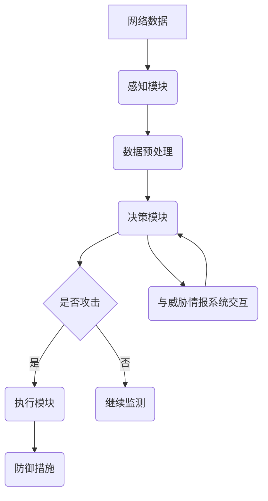

# AI Agent在智能网络攻击检测中的角色

> 关键词：AI Agent、智能网络攻击检测、机器学习、数据分析、自动化、安全防御、威胁情报

> 摘要：本文围绕AI Agent在智能网络攻击检测中的角色展开深入探讨。首先介绍了研究背景，明确目的、范围、预期读者和文档结构，并对相关术语进行解释。接着阐述AI Agent的核心概念及其与网络攻击检测的联系，通过文本示意图和Mermaid流程图展示其原理和架构。详细讲解核心算法原理，结合Python源代码说明具体操作步骤，同时给出相关数学模型和公式并举例。通过项目实战，介绍开发环境搭建、源代码实现与解读。分析了AI Agent在智能网络攻击检测中的实际应用场景，推荐了学习资源、开发工具框架和相关论文著作。最后总结未来发展趋势与挑战，提供常见问题解答和扩展阅读参考资料，旨在全面深入地剖析AI Agent在网络攻击检测领域的重要作用和价值。

## 1. 背景介绍 
### 1.1 目的和范围
随着信息技术的飞速发展，网络空间的安全形势日益严峻。网络攻击手段不断更新和复杂化，传统的网络攻击检测方法已经难以满足当前的安全需求。本研究的目的在于深入探讨AI Agent在智能网络攻击检测中的角色和作用，分析其如何利用先进的人工智能技术提升网络攻击检测的准确性、实时性和自动化程度。

研究范围涵盖AI Agent的基本概念、相关技术原理、在网络攻击检测中的具体应用场景，以及与之相关的算法、数学模型等。同时，通过实际项目案例展示AI Agent在网络攻击检测中的实际应用效果，并对其未来发展趋势和面临的挑战进行分析。

### 1.2 预期读者
本文预期读者包括网络安全专业人员，如安全分析师、安全工程师等，他们可以通过本文深入了解AI Agent在网络攻击检测中的技术细节和应用方法，为实际工作提供参考；计算机科学和人工智能领域的研究人员，有助于他们拓展研究思路，探索新的研究方向；对网络安全感兴趣的学生和爱好者，能帮助他们系统地学习AI Agent和网络攻击检测的相关知识。

### 1.3 文档结构概述
本文共分为十个部分。第一部分为背景介绍，阐述研究的目的、范围、预期读者和文档结构，并对相关术语进行解释。第二部分介绍AI Agent的核心概念及其与网络攻击检测的联系，通过文本示意图和Mermaid流程图展示其原理和架构。第三部分详细讲解AI Agent在网络攻击检测中使用的核心算法原理，并结合Python源代码说明具体操作步骤。第四部分给出相关的数学模型和公式，并进行详细讲解和举例说明。第五部分通过项目实战，介绍开发环境搭建、源代码实现与解读。第六部分分析AI Agent在智能网络攻击检测中的实际应用场景。第七部分推荐学习资源、开发工具框架和相关论文著作。第八部分总结未来发展趋势与挑战。第九部分为附录，提供常见问题解答。第十部分提供扩展阅读和参考资料。

### 1.4 术语表
#### 1.4.1 核心术语定义
- **AI Agent（人工智能智能体）**：是一种能够感知环境、根据感知信息进行决策并采取行动以实现特定目标的智能实体。在网络攻击检测中，AI Agent可以自动收集网络数据、分析数据并识别潜在的攻击行为。
- **智能网络攻击检测**：利用人工智能技术，如机器学习、深度学习等，对网络流量、系统日志等数据进行分析，以实时、准确地检测网络中的攻击行为。
- **机器学习**：是一门多领域交叉学科，涉及概率论、统计学、逼近论、凸分析、算法复杂度理论等多门学科。它专门研究计算机怎样模拟或实现人类的学习行为，以获取新的知识或技能，重新组织已有的知识结构使之不断改善自身的性能。
- **深度学习**：是机器学习的一个分支领域，它是一种基于对数据进行表征学习的方法。深度学习通过构建具有很多层的神经网络模型，自动从大量数据中学习特征和模式。

#### 1.4.2 相关概念解释
- **网络攻击**：指的是利用网络存在的漏洞和安全缺陷对网络系统的硬件、软件及其系统中的数据进行的攻击。常见的网络攻击包括DDoS攻击、SQL注入攻击、跨站脚本攻击等。
- **威胁情报**：是关于潜在威胁的信息，包括攻击者的战术、技术和程序（TTPs），以及受影响的资产和漏洞信息。威胁情报可以帮助安全团队更好地了解当前的安全形势，提前采取措施防范网络攻击。
- **异常检测**：是一种通过分析数据中的异常模式来发现潜在安全威胁的技术。在网络攻击检测中，异常检测可以通过建立正常行为模型，将偏离正常模式的行为识别为潜在的攻击行为。

#### 1.4.3 缩略词列表
- **AI**：Artificial Intelligence，人工智能
- **ML**：Machine Learning，机器学习
- **DL**：Deep Learning，深度学习
- **DDoS**：Distributed Denial of Service，分布式拒绝服务攻击
- **SQL**：Structured Query Language，结构化查询语言
- **XSS**：Cross-Site Scripting，跨站脚本攻击

## 2. 核心概念与联系 

### 2.1 AI Agent的核心概念
AI Agent是一种能够自主感知环境、进行决策并采取行动的智能实体。它由感知模块、决策模块和执行模块组成。感知模块负责收集环境信息，例如在网络攻击检测中，感知模块可以收集网络流量数据、系统日志等信息。决策模块根据感知到的信息进行分析和判断，确定应该采取的行动。执行模块则根据决策模块的指令执行相应的操作，例如发出警报、阻断网络连接等。

### 2.2 AI Agent与智能网络攻击检测的联系
在智能网络攻击检测中，AI Agent可以发挥重要作用。它可以自动收集和分析网络数据，实时监测网络中的异常行为。通过机器学习和深度学习算法，AI Agent可以学习正常的网络行为模式，并将偏离正常模式的行为识别为潜在的攻击行为。此外，AI Agent还可以根据检测到的攻击行为自动采取相应的防御措施，提高网络安全的自动化程度。

### 2.3 原理和架构的文本示意图
AI Agent在智能网络攻击检测中的原理和架构可以描述如下：

网络数据通过感知模块进入AI Agent，感知模块对数据进行预处理，例如数据清洗、特征提取等。预处理后的数据被发送到决策模块，决策模块利用机器学习或深度学习算法对数据进行分析，判断是否存在网络攻击行为。如果检测到攻击行为，决策模块会生成相应的指令，发送给执行模块。执行模块根据指令采取相应的防御措施，例如阻断网络连接、记录攻击信息等。同时，AI Agent还可以与威胁情报系统进行交互，获取最新的威胁信息，进一步提高检测的准确性。

### 2.4 Mermaid流程图


## 3. 核心算法原理 & 具体操作步骤 

### 3.1 核心算法原理
在智能网络攻击检测中，常用的AI Agent算法包括机器学习算法和深度学习算法。这里以支持向量机（SVM）和卷积神经网络（CNN）为例进行介绍。

#### 3.1.1 支持向量机（SVM）
支持向量机是一种有监督的机器学习算法，其基本思想是在特征空间中找到一个最优的超平面，将不同类别的样本分开。在网络攻击检测中，SVM可以将正常的网络行为和攻击行为分为两类，通过训练模型来识别新的网络行为是否为攻击行为。

#### 3.1.2 卷积神经网络（CNN）
卷积神经网络是一种深度学习算法，特别适合处理具有网格结构的数据，如图像、音频和时间序列数据。在网络攻击检测中，CNN可以自动从网络数据中学习特征，通过卷积层、池化层和全连接层的组合，构建一个高效的分类模型。

### 3.2 具体操作步骤及Python源代码

#### 3.2.1 数据准备
首先，我们需要准备网络攻击检测的数据集。这里我们使用一个简单的示例数据集，包含正常网络行为和攻击行为的特征。

```python
import numpy as np
from sklearn.model_selection import train_test_split

# 生成示例数据集
X = np.random.rand(1000, 10)  # 1000个样本，每个样本有10个特征
y = np.random.randint(0, 2, 1000)  # 标签，0表示正常行为，1表示攻击行为

# 划分训练集和测试集
X_train, X_test, y_train, y_test = train_test_split(X, y, test_size=0.2, random_state=42)
```

#### 3.2.2 支持向量机（SVM）实现
```python
from sklearn.svm import SVC
from sklearn.metrics import accuracy_score

# 创建SVM模型
svm_model = SVC()

# 训练模型
svm_model.fit(X_train, y_train)

# 预测
y_pred_svm = svm_model.predict(X_test)

# 计算准确率
accuracy_svm = accuracy_score(y_test, y_pred_svm)
print(f"SVM Accuracy: {accuracy_svm}")
```

#### 3.2.3 卷积神经网络（CNN）实现
```python
import tensorflow as tf
from tensorflow.keras.models import Sequential
from tensorflow.keras.layers import Conv1D, MaxPooling1D, Flatten, Dense

# 调整数据形状以适应CNN输入
X_train_cnn = X_train.reshape(X_train.shape[0], X_train.shape[1], 1)
X_test_cnn = X_test.reshape(X_test.shape[0], X_test.shape[1], 1)

# 创建CNN模型
cnn_model = Sequential([
    Conv1D(filters=32, kernel_size=3, activation='relu', input_shape=(X_train.shape[1], 1)),
    MaxPooling1D(pool_size=2),
    Flatten(),
    Dense(128, activation='relu'),
    Dense(1, activation='sigmoid')
])

# 编译模型
cnn_model.compile(optimizer='adam', loss='binary_crossentropy', metrics=['accuracy'])

# 训练模型
cnn_model.fit(X_train_cnn, y_train, epochs=10, batch_size=32, validation_data=(X_test_cnn, y_test))

# 评估模型
_, accuracy_cnn = cnn_model.evaluate(X_test_cnn, y_test)
print(f"CNN Accuracy: {accuracy_cnn}")
```

## 4. 数学模型和公式 & 详细讲解 & 举例说明 

### 4.1 支持向量机（SVM）的数学模型和公式

#### 4.1.1 基本原理
支持向量机的目标是在特征空间中找到一个最优的超平面，使得不同类别的样本到超平面的距离最大。对于线性可分的数据集，超平面可以表示为：

$$w^T x + b = 0$$

其中，$w$ 是超平面的法向量，$b$ 是偏置项，$x$ 是样本向量。

#### 4.1.2 间隔最大化
支持向量机通过最大化间隔来找到最优超平面。间隔定义为两类样本到超平面的最小距离之和。对于正类样本 $y_i = +1$ 和负类样本 $y_i = -1$，间隔可以表示为：

$$\gamma = \frac{2}{\|w\|}$$

最大化间隔等价于最小化 $\frac{1}{2}\|w\|^2$，同时满足约束条件：

$$y_i(w^T x_i + b) \geq 1, \quad i = 1, \ldots, n$$

其中，$n$ 是样本数量。

#### 4.1.3 拉格朗日乘子法求解
为了求解上述带约束的优化问题，我们可以使用拉格朗日乘子法。引入拉格朗日乘子 $\alpha_i \geq 0$，构造拉格朗日函数：

$$L(w, b, \alpha) = \frac{1}{2}\|w\|^2 - \sum_{i=1}^{n} \alpha_i (y_i(w^T x_i + b) - 1)$$

对 $w$ 和 $b$ 求偏导数并令其为 0，得到：

$$\frac{\partial L}{\partial w} = w - \sum_{i=1}^{n} \alpha_i y_i x_i = 0 \Rightarrow w = \sum_{i=1}^{n} \alpha_i y_i x_i$$

$$\frac{\partial L}{\partial b} = -\sum_{i=1}^{n} \alpha_i y_i = 0$$

将上述结果代入拉格朗日函数，得到对偶问题：

$$\max_{\alpha} \sum_{i=1}^{n} \alpha_i - \frac{1}{2} \sum_{i=1}^{n} \sum_{j=1}^{n} \alpha_i \alpha_j y_i y_j x_i^T x_j$$

$$\text{s.t.} \quad \sum_{i=1}^{n} \alpha_i y_i = 0, \quad \alpha_i \geq 0, \quad i = 1, \ldots, n$$

#### 4.1.4 举例说明
假设我们有一个二维数据集，包含两个类别的样本：正类样本 $(1, 2)$ 和 $(2, 3)$，负类样本 $(3, 1)$ 和 $(4, 2)$。我们可以使用Python的 `sklearn` 库来求解SVM模型：

```python
from sklearn.svm import SVC
import numpy as np

X = np.array([[1, 2], [2, 3], [3, 1], [4, 2]])
y = np.array([1, 1, -1, -1])

svm_model = SVC(kernel='linear')
svm_model.fit(X, y)

print("Coefficients:", svm_model.coef_)
print("Intercept:", svm_model.intercept_)
```

### 4.2 卷积神经网络（CNN）的数学模型和公式

#### 4.2.1 卷积层
卷积层是CNN的核心层，其主要作用是提取输入数据的特征。卷积操作可以表示为：

$$y_{i, j}^k = \sum_{m=0}^{M-1} \sum_{n=0}^{N-1} x_{i+m, j+n}^l w_{m, n}^k + b^k$$

其中，$y_{i, j}^k$ 是卷积层的输出特征图中第 $k$ 个通道的 $(i, j)$ 位置的值，$x_{i+m, j+n}^l$ 是输入特征图中第 $l$ 个通道的 $(i+m, j+n)$ 位置的值，$w_{m, n}^k$ 是卷积核的权重，$b^k$ 是偏置项，$M$ 和 $N$ 是卷积核的大小。

#### 4.2.2 池化层
池化层的作用是对输入特征图进行下采样，减少数据量，同时保留重要的特征信息。常见的池化操作有最大池化和平均池化。最大池化操作可以表示为：

$$y_{i, j}^k = \max_{m=0}^{M-1} \max_{n=0}^{N-1} x_{iM + m, jN + n}^k$$

其中，$y_{i, j}^k$ 是池化层的输出特征图中第 $k$ 个通道的 $(i, j)$ 位置的值，$x_{iM + m, jN + n}^k$ 是输入特征图中第 $k$ 个通道的 $(iM + m, jN + n)$ 位置的值，$M$ 和 $N$ 是池化窗口的大小。

#### 4.2.3 全连接层
全连接层将卷积层和池化层提取的特征进行整合，用于分类或回归任务。全连接层的输出可以表示为：

$$y_i = \sum_{j=1}^{n} w_{ij} x_j + b_i$$

其中，$y_i$ 是全连接层的第 $i$ 个输出，$x_j$ 是输入层的第 $j$ 个输入，$w_{ij}$ 是权重，$b_i$ 是偏置项，$n$ 是输入层的神经元数量。

#### 4.2.4 举例说明
假设我们有一个输入图像的大小为 $32 \times 32 \times 3$，使用一个大小为 $3 \times 3$ 的卷积核进行卷积操作，步长为 1，填充为 0。卷积核的数量为 16。则卷积层的输出特征图的大小为 $(32 - 3 + 1) \times (32 - 3 + 1) \times 16 = 30 \times 30 \times 16$。

```python
import tensorflow as tf
from tensorflow.keras.layers import Conv2D

input_shape = (32, 32, 3)
model = tf.keras.Sequential([
    Conv2D(filters=16, kernel_size=(3, 3), strides=1, padding='valid', input_shape=input_shape)
])

print(model.output_shape)
```

## 5. 项目实战：代码实际案例和详细解释说明 

### 5.1  开发环境搭建
#### 5.1.1 操作系统
本项目可以在Windows、Linux或macOS等操作系统上进行开发。建议使用Linux系统，如Ubuntu 18.04或更高版本，因为Linux系统在开发和部署机器学习项目方面具有更好的兼容性和性能。

#### 5.1.2 编程语言和版本
使用Python 3.7或更高版本作为开发语言。Python具有丰富的机器学习和深度学习库，如 `numpy`、`pandas`、`scikit-learn`、`tensorflow` 等，方便我们进行数据处理和模型训练。

#### 5.1.3 安装必要的库
在命令行中使用 `pip` 安装必要的库：

```bash
pip install numpy pandas scikit-learn tensorflow matplotlib
```

### 5.2  源代码详细实现和代码解读

#### 5.2.1 数据加载和预处理
```python
import numpy as np
import pandas as pd
from sklearn.preprocessing import StandardScaler
from sklearn.model_selection import train_test_split

# 加载数据集
data = pd.read_csv('network_attack_data.csv')

# 分离特征和标签
X = data.drop('label', axis=1).values
y = data['label'].values

# 数据标准化
scaler = StandardScaler()
X = scaler.fit_transform(X)

# 划分训练集和测试集
X_train, X_test, y_train, y_test = train_test_split(X, y, test_size=0.2, random_state=42)
```
代码解读：首先使用 `pandas` 库读取网络攻击数据集。然后将特征和标签分离，使用 `StandardScaler` 对特征数据进行标准化处理，使得数据具有零均值和单位方差。最后使用 `train_test_split` 函数将数据集划分为训练集和测试集，测试集占总数据集的20%。

#### 5.2.2 支持向量机（SVM）模型训练和评估
```python
from sklearn.svm import SVC
from sklearn.metrics import accuracy_score, classification_report, confusion_matrix

# 创建SVM模型
svm_model = SVC()

# 训练模型
svm_model.fit(X_train, y_train)

# 预测
y_pred_svm = svm_model.predict(X_test)

# 评估模型
accuracy_svm = accuracy_score(y_test, y_pred_svm)
print(f"SVM Accuracy: {accuracy_svm}")
print("Classification Report:")
print(classification_report(y_test, y_pred_svm))
print("Confusion Matrix:")
print(confusion_matrix(y_test, y_pred_svm))
```
代码解读：使用 `sklearn` 库中的 `SVC` 类创建SVM模型。然后使用训练集数据对模型进行训练，使用测试集数据进行预测。最后使用 `accuracy_score`、`classification_report` 和 `confusion_matrix` 等函数对模型的性能进行评估，输出准确率、分类报告和混淆矩阵。

#### 5.2.3 卷积神经网络（CNN）模型训练和评估
```python
import tensorflow as tf
from tensorflow.keras.models import Sequential
from tensorflow.keras.layers import Conv1D, MaxPooling1D, Flatten, Dense

# 调整数据形状以适应CNN输入
X_train_cnn = X_train.reshape(X_train.shape[0], X_train.shape[1], 1)
X_test_cnn = X_test.reshape(X_test.shape[0], X_test.shape[1], 1)

# 创建CNN模型
cnn_model = Sequential([
    Conv1D(filters=32, kernel_size=3, activation='relu', input_shape=(X_train.shape[1], 1)),
    MaxPooling1D(pool_size=2),
    Flatten(),
    Dense(128, activation='relu'),
    Dense(1, activation='sigmoid')
])

# 编译模型
cnn_model.compile(optimizer='adam', loss='binary_crossentropy', metrics=['accuracy'])

# 训练模型
history = cnn_model.fit(X_train_cnn, y_train, epochs=10, batch_size=32, validation_data=(X_test_cnn, y_test))

# 评估模型
_, accuracy_cnn = cnn_model.evaluate(X_test_cnn, y_test)
print(f"CNN Accuracy: {accuracy_cnn}")
```
代码解读：首先将训练集和测试集数据调整为适合CNN输入的形状。然后使用 `tensorflow.keras` 库创建CNN模型，包括卷积层、池化层、全连接层等。编译模型时，选择 `adam` 优化器和 `binary_crossentropy` 损失函数。使用 `fit` 函数对模型进行训练，同时指定验证集数据。最后使用 `evaluate` 函数对模型的性能进行评估，输出准确率。

### 5.3  代码解读与分析
#### 5.3.1 SVM模型分析
SVM模型通过最大化间隔来找到最优超平面，将不同类别的样本分开。在本项目中，SVM模型的准确率可以反映其对网络攻击行为的分类能力。通过分类报告和混淆矩阵，我们可以进一步分析模型在不同类别上的性能，如精确率、召回率和F1值等。

#### 5.3.2 CNN模型分析
CNN模型通过卷积层和池化层自动提取数据的特征，然后通过全连接层进行分类。在训练过程中，我们可以观察到训练集和验证集的准确率和损失值的变化情况。如果训练集的准确率不断提高，而验证集的准确率不再提高甚至下降，可能存在过拟合问题。此时，可以通过调整模型结构、增加正则化项等方法来解决过拟合问题。

## 6. 实际应用场景 
### 6.1 企业网络安全防护
在企业网络中，AI Agent可以实时监测网络流量，检测潜在的网络攻击行为，如DDoS攻击、SQL注入攻击等。一旦检测到攻击行为，AI Agent可以自动采取相应的防御措施，如阻断网络连接、记录攻击信息等，保护企业网络的安全。

### 6.2 云计算环境安全
在云计算环境中，多个用户共享云资源，网络安全面临更大的挑战。AI Agent可以对云环境中的网络流量进行分析，检测用户行为是否异常，防止用户之间的恶意攻击和数据泄露。同时，AI Agent还可以与云服务提供商的安全系统进行集成，实现更高效的安全防护。

### 6.3 物联网安全
随着物联网设备的广泛应用，物联网安全问题日益突出。AI Agent可以对物联网设备的通信数据进行监测，检测是否存在异常的通信行为，如设备被篡改、数据被窃取等。通过及时发现和处理这些安全问题，AI Agent可以保障物联网系统的安全运行。

### 6.4 金融行业安全
在金融行业，网络安全至关重要。AI Agent可以对金融交易数据进行实时监测，检测是否存在欺诈行为，如信用卡盗刷、网络诈骗等。通过分析交易数据的特征和模式，AI Agent可以快速准确地识别潜在的欺诈行为，并及时采取措施，保护用户的资金安全。

## 7. 工具和资源推荐
### 7.1 学习资源推荐
#### 7.1.1 书籍推荐
- 《机器学习》（周志华著）：这本书全面介绍了机器学习的基本概念、算法和应用，是机器学习领域的经典教材。
- 《深度学习》（Ian Goodfellow、Yoshua Bengio和Aaron Courville著）：该书系统地介绍了深度学习的理论和实践，适合对深度学习感兴趣的读者。
- 《Python机器学习》（Sebastian Raschka著）：本书结合Python语言，详细介绍了机器学习的算法和实现，是学习Python机器学习的优秀书籍。

#### 7.1.2 在线课程
- Coursera上的“机器学习”课程（Andrew Ng教授主讲）：该课程是机器学习领域的经典课程，通过视频讲解、编程作业等方式，帮助学生系统地学习机器学习的基本概念和算法。
- edX上的“深度学习”课程：由全球知名高校的教授授课，深入介绍深度学习的理论和实践，适合有一定机器学习基础的学生。
- 中国大学MOOC上的“人工智能基础”课程：该课程由国内知名高校的教授授课，全面介绍人工智能的基本概念、技术和应用，适合初学者学习。

#### 7.1.3 技术博客和网站
- Medium：一个开放的技术博客平台，上面有很多关于人工智能、机器学习和网络安全的优秀文章。
- Towards Data Science：专注于数据科学和机器学习领域的技术博客，提供了很多实用的技术文章和案例分析。
- 安全客：国内知名的网络安全技术博客平台，提供了大量的网络安全技术文章和漏洞分析报告。

### 7.2 开发工具框架推荐
#### 7.2.1 IDE和编辑器
- PyCharm：一款专业的Python集成开发环境，具有代码自动补全、调试、版本控制等功能，适合开发Python机器学习和深度学习项目。
- Jupyter Notebook：一个交互式的开发环境，支持Python、R等多种编程语言，适合进行数据探索、模型训练和可视化等工作。
- Visual Studio Code：一款轻量级的代码编辑器，支持多种编程语言和插件，具有丰富的扩展功能，适合快速开发和调试代码。

#### 7.2.2 调试和性能分析工具
- TensorBoard：TensorFlow的可视化工具，可以帮助用户可视化模型的训练过程、损失函数、准确率等指标，方便用户进行调试和性能分析。
- Scikit-learn的GridSearchCV：用于超参数调优的工具，可以帮助用户自动搜索最优的超参数组合，提高模型的性能。
- PyTorch Profiler：PyTorch的性能分析工具，可以帮助用户分析模型的运行时间、内存使用等情况，优化模型的性能。

#### 7.2.3 相关框架和库
- Scikit-learn：一个简单易用的机器学习库，提供了丰富的机器学习算法和工具，如分类、回归、聚类等算法，以及数据预处理、模型评估等工具。
- TensorFlow：一个开源的深度学习框架，支持多种深度学习模型的构建和训练，如卷积神经网络、循环神经网络等。
- PyTorch：另一个开源的深度学习框架，具有动态图机制，适合快速开发和实验深度学习模型。

### 7.3 相关论文著作推荐
#### 7.3.1 经典论文
- “Support-Vector Networks”（Cortes和Vapnik著）：该论文首次提出了支持向量机的概念和算法，是支持向量机领域的经典论文。
- “Gradient-Based Learning Applied to Document Recognition”（LeCun等人著）：该论文介绍了卷积神经网络的基本原理和应用，是卷积神经网络领域的经典论文。
- “Deep Residual Learning for Image Recognition”（He等人著）：该论文提出了残差网络的概念，解决了深度神经网络训练过程中的梯度消失问题，是深度学习领域的重要论文。

#### 7.3.2 最新研究成果
- 每年的ACM SIGSAC Conference on Computer and Communications Security（CCS）、IEEE Symposium on Security and Privacy（SP）等安全领域的顶级会议上都会发表很多关于网络攻击检测和AI Agent应用的最新研究成果。
- arXiv预印本平台上也有很多关于人工智能和网络安全的最新研究论文，可以及时了解该领域的研究动态。

#### 7.3.3 应用案例分析
- 一些知名企业和安全厂商会发布关于网络攻击检测和安全防护的应用案例分析报告，如Google、Microsoft等公司的安全博客，以及FireEye、Symantec等安全厂商的技术报告。这些案例分析可以帮助我们更好地了解AI Agent在实际应用中的效果和经验。

## 8. 总结：未来发展趋势与挑战
### 8.1 未来发展趋势
#### 8.1.1 多模态数据融合
未来的AI Agent将不仅依赖于网络流量数据，还会融合多种模态的数据，如系统日志、用户行为数据、威胁情报等，以提高网络攻击检测的准确性和全面性。

#### 8.1.2 自适应学习和进化
AI Agent将具备自适应学习和进化的能力，能够根据不断变化的网络环境和攻击手段自动调整检测策略和模型参数，保持对新型攻击的检测能力。

#### 8.1.3 与区块链技术结合
区块链技术具有去中心化、不可篡改等特点，可以为网络安全提供更好的保障。未来的AI Agent可能会与区块链技术结合，实现更安全、可信的网络攻击检测和防御。

#### 8.1.4 自动化安全运营
AI Agent将在安全运营中发挥更大的作用，实现自动化的安全事件响应和处置。例如，当检测到网络攻击时，AI Agent可以自动采取阻断网络连接、隔离受感染设备等措施，减少人工干预，提高安全运营的效率。

### 8.2 挑战
#### 8.2.1 数据隐私和安全
AI Agent在收集和处理大量网络数据的过程中，可能会涉及到用户的隐私和数据安全问题。如何在保证数据可用性的前提下，保护用户的隐私和数据安全，是一个亟待解决的问题。

#### 8.2.2 对抗性攻击
攻击者可能会采用对抗性攻击手段，故意干扰AI Agent的检测过程，使其产生误判或漏判。如何提高AI Agent的鲁棒性，抵御对抗性攻击，是当前研究的热点问题。

#### 8.2.3 模型可解释性
深度学习模型通常是黑盒模型，其决策过程难以解释。在网络攻击检测中，安全分析师需要了解模型的决策依据，以便采取相应的措施。如何提高AI Agent模型的可解释性，是一个重要的挑战。

#### 8.2.4 资源消耗
AI Agent的训练和运行需要大量的计算资源和存储资源。如何在资源有限的情况下，提高AI Agent的性能和效率，是一个需要解决的问题。

## 9. 附录：常见问题与解答
### 9.1 AI Agent在网络攻击检测中的准确率有多高？
AI Agent的准确率取决于多种因素，如数据集的质量、模型的选择和训练方法等。一般来说，通过合理选择模型和优化训练过程，可以达到较高的准确率。但由于网络攻击手段的不断变化，AI Agent需要不断学习和更新，以保持较高的准确率。

### 9.2 AI Agent是否可以完全替代人工进行网络攻击检测？
目前，AI Agent还不能完全替代人工进行网络攻击检测。虽然AI Agent可以自动收集和分析大量的网络数据，快速识别潜在的攻击行为，但在一些复杂的情况下，如新型攻击的识别和分析，还需要人工的专业知识和经验。因此，AI Agent和人工检测应该相互结合，共同提高网络攻击检测的效率和准确性。

### 9.3 如何选择适合的AI Agent算法进行网络攻击检测？
选择适合的AI Agent算法需要考虑多种因素，如数据集的特点、攻击类型、计算资源等。对于小规模数据集和简单的攻击类型，可以选择传统的机器学习算法，如支持向量机、决策树等。对于大规模数据集和复杂的攻击类型，深度学习算法，如卷积神经网络、循环神经网络等，可能更适合。此外，还可以通过实验和比较不同算法的性能，选择最优的算法。

### 9.4 AI Agent在网络攻击检测中会产生误报吗？
AI Agent在网络攻击检测中可能会产生误报。误报的原因可能是数据噪声、模型不准确、攻击手段的变化等。为了减少误报，可以采取数据预处理、模型优化、引入多模型融合等方法。同时，安全分析师需要对误报进行分析和过滤，提高检测的准确性。

## 10. 扩展阅读 & 参考资料
### 10.1 扩展阅读
- 《网络安全技术与实践》（谢希仁著）：该书全面介绍了网络安全的基本概念、技术和实践，适合对网络安全感兴趣的读者进一步学习。
- 《人工智能：现代方法》（Stuart Russell和Peter Norvig著）：这是一本关于人工智能的经典教材，涵盖了人工智能的各个领域，包括机器学习、自然语言处理、计算机视觉等，适合深入学习人工智能的读者。
- 《Python数据科学手册》（Jake VanderPlas著）：本书介绍了Python在数据科学领域的应用，包括数据处理、数据分析、数据可视化等方面的知识和技术，适合对数据科学感兴趣的读者。

### 10.2 参考资料
- 相关的学术论文和研究报告，如ACM SIGSAC Conference on Computer and Communications Security（CCS）、IEEE Symposium on Security and Privacy（SP）等会议的论文。
- 各大安全厂商的技术文档和报告，如FireEye、Symantec、McAfee等公司的技术白皮书。
- 开源的网络攻击检测数据集，如KDD Cup 99数据集、NSL-KDD数据集等。