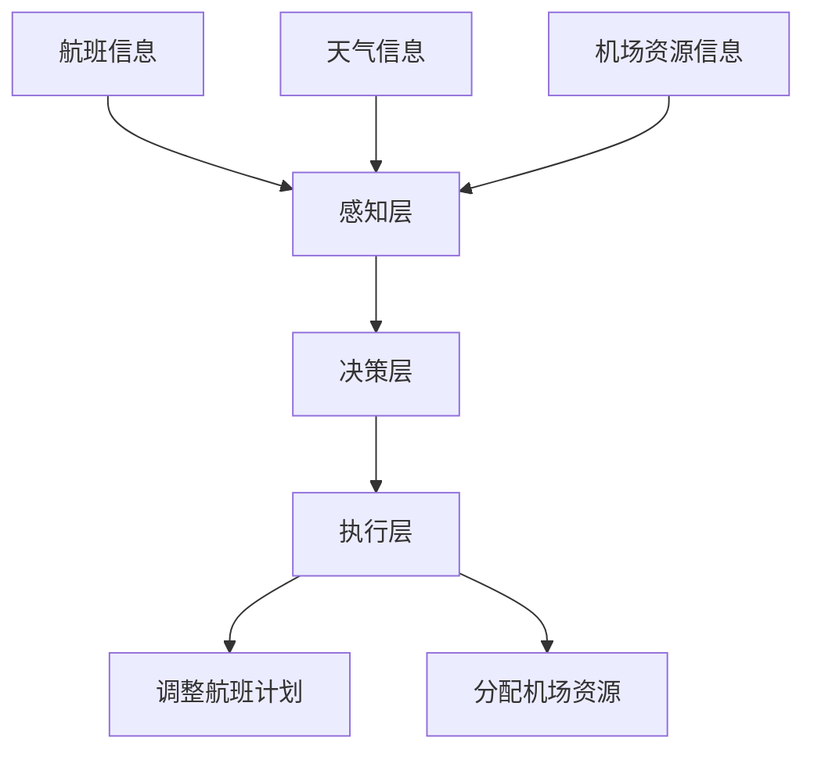

# AI Agent在智能航空管理中的应用

> 关键词：AI Agent、智能航空管理、航班调度、安全监控、资源分配

> 摘要：本文深入探讨了AI Agent在智能航空管理中的应用。随着航空业的快速发展，传统的管理方式面临诸多挑战，AI Agent凭借其自主决策、智能交互等特性为解决这些问题提供了新的途径。文章详细阐述了AI Agent的核心概念与架构，介绍了其在航班调度、安全监控、资源分配等方面的算法原理与具体操作步骤，通过数学模型和公式对其工作机制进行了理论分析，并结合实际案例展示了其在智能航空管理中的应用效果。同时，对相关的工具和资源进行了推荐，最后总结了AI Agent在智能航空管理领域的未来发展趋势与挑战。

## 1. 背景介绍 
### 1.1 目的和范围
随着全球航空运输需求的不断增长，航空管理面临着日益复杂的挑战，如航班延误、资源分配不合理、安全隐患等。本文章的目的在于探讨AI Agent在智能航空管理中的应用，旨在为解决这些问题提供新的思路和方法。具体范围涵盖了AI Agent在航班调度、安全监控、机场资源分配等方面的应用，以及相关的技术原理、算法实现和实际案例分析。

### 1.2 预期读者
本文预期读者包括航空管理领域的专业人士，如航空公司管理人员、机场运营人员、空管人员等，他们可以从本文中了解AI Agent在智能航空管理中的应用潜力，为实际工作提供参考。同时，也适合对人工智能和航空技术感兴趣的研究人员、学生等，帮助他们深入了解这一交叉领域的前沿知识。

### 1.3 文档结构概述
本文将按照以下结构进行组织：首先介绍AI Agent和智能航空管理的相关背景知识，包括术语定义和概念解释；然后阐述AI Agent的核心概念与架构，通过文本示意图和Mermaid流程图进行直观展示；接着详细讲解AI Agent在智能航空管理中应用的核心算法原理和具体操作步骤，并结合Python源代码进行说明；之后通过数学模型和公式对其工作机制进行理论分析，并举例说明；再通过实际案例展示AI Agent在智能航空管理中的应用效果，包括开发环境搭建、源代码实现和代码解读；随后介绍AI Agent在智能航空管理中的实际应用场景；接着推荐相关的工具和资源，包括学习资源、开发工具框架和相关论文著作；最后总结AI Agent在智能航空管理领域的未来发展趋势与挑战，并提供常见问题解答和扩展阅读参考资料。

### 1.4 术语表
#### 1.4.1 核心术语定义
- **AI Agent（人工智能智能体）**：是一种能够感知环境、自主决策并采取行动以实现特定目标的智能实体。在智能航空管理中，AI Agent可以根据航空环境的信息，如航班状态、天气情况、机场资源等，做出合理的决策，如航班调度、资源分配等。
- **智能航空管理**：利用先进的信息技术和人工智能技术，对航空运输系统进行全面、高效、智能的管理，以提高航空运输的安全性、效率和服务质量。
- **航班调度**：根据航班的起降时间、机型、目的地等信息，合理安排航班的起降顺序和航线，以优化机场的运行效率，减少航班延误。
- **安全监控**：对航空运输过程中的各个环节进行实时监测和分析，及时发现安全隐患并采取相应的措施，以确保航空运输的安全。
- **资源分配**：对机场的各种资源，如跑道、停机位、登机口等进行合理分配，以提高资源的利用率，满足航班运行的需求。

#### 1.4.2 相关概念解释
- **多智能体系统（Multi - Agent System，MAS）**：由多个AI Agent组成的系统，这些智能体之间可以通过通信和协作来完成复杂的任务。在智能航空管理中，多智能体系统可以用于协调不同部门和角色之间的工作，如航空公司、机场、空管等。
- **机器学习（Machine Learning）**：是一门多领域交叉学科，涉及概率论、统计学、逼近论、凸分析、算法复杂度理论等多门学科。它专门研究计算机怎样模拟或实现人类的学习行为，以获取新的知识或技能，重新组织已有的知识结构使之不断改善自身的性能。在AI Agent中，机器学习可以用于对航空数据的分析和预测，以辅助决策。
- **深度学习（Deep Learning）**：是机器学习的一个分支领域，它是一种基于对数据进行表征学习的方法。深度学习通过构建具有很多层的神经网络模型，自动从大量数据中学习特征和模式，从而实现对复杂数据的分析和处理。在智能航空管理中，深度学习可以用于对航班图像、语音等非结构化数据的处理和分析。

#### 1.4.3 缩略词列表
- **MAS**：Multi - Agent System（多智能体系统）
- **ML**：Machine Learning（机器学习）
- **DL**：Deep Learning（深度学习）

## 2. 核心概念与联系 

### 核心概念原理
AI Agent在智能航空管理中的应用基于其感知、决策和行动的基本原理。AI Agent通过各种传感器和数据源感知航空环境的信息，如航班状态、天气情况、机场资源等。然后，AI Agent利用内置的算法和模型对这些信息进行分析和处理，做出合理的决策，如航班调度、资源分配等。最后，AI Agent将决策结果转化为具体的行动，如向相关部门发送指令、调整航班计划等。

### 架构的文本示意图
AI Agent在智能航空管理中的架构主要包括感知层、决策层和执行层。感知层负责收集航空环境的信息，包括航班信息、天气信息、机场资源信息等。这些信息通过数据接口传输到决策层。决策层是AI Agent的核心部分，它利用机器学习、深度学习等算法对感知层收集的信息进行分析和处理，做出决策。决策层的决策结果通过指令接口传输到执行层。执行层负责将决策层的指令转化为具体的行动，如调整航班计划、分配机场资源等。

### Mermaid流程图


## 3. 核心算法原理 & 具体操作步骤 

### 航班调度算法原理
航班调度是智能航空管理中的一个重要任务，其目标是优化航班的起降顺序和航线，以减少航班延误。一种常用的航班调度算法是基于遗传算法的调度算法。遗传算法是一种模拟自然选择和遗传机制的优化算法，它通过对种群中的个体进行选择、交叉和变异操作，不断搜索最优解。

以下是基于Python实现的简单航班调度遗传算法示例：
```python
import random

# 定义航班信息
flights = [
    {"id": 1, "arrival_time": 8 * 60, "departure_time": 9 * 60},
    {"id": 2, "arrival_time": 9 * 60, "departure_time": 10 * 60},
    {"id": 3, "arrival_time": 10 * 60, "departure_time": 11 * 60}
]

# 定义种群大小和迭代次数
population_size = 10
generations = 20

# 生成初始种群
def generate_population():
    population = []
    for _ in range(population_size):
        individual = list(range(len(flights)))
        random.shuffle(individual)
        population.append(individual)
    return population

# 计算适应度函数
def fitness(individual):
    total_delay = 0
    current_time = 0
    for index in individual:
        flight = flights[index]
        if flight["arrival_time"] > current_time:
            current_time = flight["arrival_time"]
        else:
            delay = current_time - flight["arrival_time"]
            total_delay += delay
        current_time += (flight["departure_time"] - flight["arrival_time"])
    return 1 / (total_delay + 1)

# 选择操作
def selection(population):
    fitness_values = [fitness(individual) for individual in population]
    total_fitness = sum(fitness_values)
    probabilities = [fitness_value / total_fitness for fitness_value in fitness_values]
    selected_indices = random.choices(range(population_size), weights=probabilities, k=2)
    return [population[index] for index in selected_indices]

# 交叉操作
def crossover(parent1, parent2):
    crossover_point = random.randint(1, len(parent1) - 1)
    child1 = parent1[:crossover_point] + [gene for gene in parent2 if gene not in parent1[:crossover_point]]
    child2 = parent2[:crossover_point] + [gene for gene in parent1 if gene not in parent2[:crossover_point]]
    return child1, child2

# 变异操作
def mutation(individual):
    index1, index2 = random.sample(range(len(individual)), 2)
    individual[index1], individual[index2] = individual[index2], individual[index1]
    return individual

# 遗传算法主函数
def genetic_algorithm():
    population = generate_population()
    for _ in range(generations):
        new_population = []
        for _ in range(population_size // 2):
            parents = selection(population)
            child1, child2 = crossover(parents[0], parents[1])
            child1 = mutation(child1)
            child2 = mutation(child2)
            new_population.extend([child1, child2])
        population = new_population
    best_individual = max(population, key=fitness)
    return best_individual

# 运行遗传算法
best_schedule = genetic_algorithm()
print("最优航班调度顺序:", [flights[index]["id"] for index in best_schedule])
```
### 具体操作步骤
1. **数据收集**：收集航班的相关信息，如航班的起降时间、机型、目的地等。
2. **初始种群生成**：随机生成一定数量的航班调度方案作为初始种群。
3. **适应度计算**：计算每个个体的适应度值，适应度值越高表示该个体对应的调度方案越优。
4. **选择操作**：根据适应度值选择一定数量的个体作为父代。
5. **交叉操作**：对父代个体进行交叉操作，生成子代个体。
6. **变异操作**：对子代个体进行变异操作，增加种群的多样性。
7. **更新种群**：用子代个体替换父代个体，更新种群。
8. **终止条件判断**：判断是否满足终止条件，如达到最大迭代次数或找到最优解。如果满足终止条件，则输出最优解；否则，返回步骤3继续迭代。

## 4. 数学模型和公式 & 详细讲解 & 举例说明 

### 航班调度数学模型
设航班集合为 $F = \{f_1, f_2, \cdots, f_n\}$，每个航班 $f_i$ 有到达时间 $a_i$ 和离开时间 $d_i$。航班的调度顺序用一个排列 $\pi = (\pi_1, \pi_2, \cdots, \pi_n)$ 表示，其中 $\pi_i$ 表示第 $i$ 个执行的航班编号。

定义航班 $f_{\pi_i}$ 的实际到达时间 $A_{\pi_i}$ 和实际离开时间 $D_{\pi_i}$ 如下：
- 当 $i = 1$ 时，$A_{\pi_1}=a_{\pi_1}$，$D_{\pi_1}=A_{\pi_1}+(d_{\pi_1}-a_{\pi_1})$
- 当 $i > 1$ 时，$A_{\pi_i}=\max(a_{\pi_i}, D_{\pi_{i - 1}})$，$D_{\pi_i}=A_{\pi_i}+(d_{\pi_i}-a_{\pi_i})$

航班 $f_{\pi_i}$ 的延误时间 $delay_{\pi_i}$ 为：
$$delay_{\pi_i}=A_{\pi_i}-a_{\pi_i}$$

总延误时间 $TotalDelay$ 为：
$$TotalDelay=\sum_{i = 1}^{n}delay_{\pi_i}$$

我们的目标是找到一个调度顺序 $\pi$，使得总延误时间 $TotalDelay$ 最小。

### 详细讲解
在上述数学模型中，我们首先定义了航班的实际到达时间和实际离开时间。当第一个航班执行时，其实际到达时间就是其计划到达时间。对于后续航班，其实际到达时间取决于前一个航班的实际离开时间和自身的计划到达时间，取两者中的最大值。这样可以保证航班之间的时间顺序合理。

然后，我们定义了每个航班的延误时间，即实际到达时间与计划到达时间的差值。总延误时间是所有航班延误时间的总和。我们的目标就是通过优化航班的调度顺序，使得总延误时间最小。

### 举例说明
假设有三个航班，其信息如下：
- 航班1：$a_1 = 8\times60$，$d_1 = 9\times60$
- 航班2：$a_2 = 9\times60$，$d_2 = 10\times60$
- 航班3：$a_3 = 10\times60$，$d_3 = 11\times60$

如果调度顺序为 $\pi=(1, 2, 3)$：
- 航班1：$A_1 = 8\times60$，$D_1 = 9\times60$，$delay_1 = 0$
- 航班2：$A_2 = 9\times60$，$D_2 = 10\times60$，$delay_2 = 0$
- 航班3：$A_3 = 10\times60$，$D_3 = 11\times60$，$delay_3 = 0$
总延误时间 $TotalDelay = 0$

如果调度顺序为 $\pi=(2, 1, 3)$：
- 航班2：$A_2 = 9\times60$，$D_2 = 10\times60$，$delay_2 = 0$
- 航班1：$A_1 = 10\times60$，$D_1 = 11\times60$，$delay_1 = 2\times60$
- 航班3：$A_3 = 11\times60$，$D_3 = 12\times60$，$delay_3 = 1\times60$
总延误时间 $TotalDelay = 3\times60$

通过比较不同的调度顺序，我们可以看出合理的调度顺序可以减少总延误时间。

## 5. 项目实战：代码实际案例和详细解释说明 

### 5.1  开发环境搭建
- **操作系统**：可以选择Windows、Linux或macOS等常见操作系统。
- **Python环境**：安装Python 3.x版本。可以从Python官方网站（https://www.python.org/downloads/）下载安装包进行安装。
- **开发工具**：推荐使用PyCharm作为开发工具，它是一款功能强大的Python集成开发环境（IDE），可以从JetBrains官方网站（https://www.jetbrains.com/pycharm/download/）下载安装。
- **依赖库**：本项目需要使用`random`库，该库是Python的内置库，无需额外安装。

### 5.2  源代码详细实现和代码解读
以下是完整的航班调度遗传算法代码：
```python
import random

# 定义航班信息
flights = [
    {"id": 1, "arrival_time": 8 * 60, "departure_time": 9 * 60},
    {"id": 2, "arrival_time": 9 * 60, "departure_time": 10 * 60},
    {"id": 3, "arrival_time": 10 * 60, "departure_time": 11 * 60}
]

# 定义种群大小和迭代次数
population_size = 10
generations = 20

# 生成初始种群
def generate_population():
    population = []
    for _ in range(population_size):
        individual = list(range(len(flights)))
        random.shuffle(individual)
        population.append(individual)
    return population

# 计算适应度函数
def fitness(individual):
    total_delay = 0
    current_time = 0
    for index in individual:
        flight = flights[index]
        if flight["arrival_time"] > current_time:
            current_time = flight["arrival_time"]
        else:
            delay = current_time - flight["arrival_time"]
            total_delay += delay
        current_time += (flight["departure_time"] - flight["arrival_time"])
    return 1 / (total_delay + 1)

# 选择操作
def selection(population):
    fitness_values = [fitness(individual) for individual in population]
    total_fitness = sum(fitness_values)
    probabilities = [fitness_value / total_fitness for fitness_value in fitness_values]
    selected_indices = random.choices(range(population_size), weights=probabilities, k=2)
    return [population[index] for index in selected_indices]

# 交叉操作
def crossover(parent1, parent2):
    crossover_point = random.randint(1, len(parent1) - 1)
    child1 = parent1[:crossover_point] + [gene for gene in parent2 if gene not in parent1[:crossover_point]]
    child2 = parent2[:crossover_point] + [gene for gene in parent1 if gene not in parent2[:crossover_point]]
    return child1, child2

# 变异操作
def mutation(individual):
    index1, index2 = random.sample(range(len(individual)), 2)
    individual[index1], individual[index2] = individual[index2], individual[index1]
    return individual

# 遗传算法主函数
def genetic_algorithm():
    population = generate_population()
    for _ in range(generations):
        new_population = []
        for _ in range(population_size // 2):
            parents = selection(population)
            child1, child2 = crossover(parents[0], parents[1])
            child1 = mutation(child1)
            child2 = mutation(child2)
            new_population.extend([child1, child2])
        population = new_population
    best_individual = max(population, key=fitness)
    return best_individual

# 运行遗传算法
best_schedule = genetic_algorithm()
print("最优航班调度顺序:", [flights[index]["id"] for index in best_schedule])
```
### 代码解读
1. **航班信息定义**：`flights` 列表存储了每个航班的信息，包括航班编号、到达时间和离开时间。
2. **种群大小和迭代次数定义**：`population_size` 表示种群的大小，`generations` 表示迭代的次数。
3. **初始种群生成**：`generate_population` 函数通过随机打乱航班编号的顺序生成初始种群。
4. **适应度计算**：`fitness` 函数计算每个个体的适应度值，适应度值为总延误时间的倒数加1的倒数，这样可以保证总延误时间越小，适应度值越大。
5. **选择操作**：`selection` 函数根据适应度值选择一定数量的个体作为父代，采用轮盘赌选择法。
6. **交叉操作**：`crossover` 函数对父代个体进行交叉操作，生成子代个体。
7. **变异操作**：`mutation` 函数对子代个体进行变异操作，通过交换两个基因的位置增加种群的多样性。
8. **遗传算法主函数**：`genetic_algorithm` 函数是遗传算法的主函数，它通过不断迭代，选择、交叉、变异操作更新种群，最终找到最优个体。
9. **结果输出**：最后输出最优航班调度顺序。

### 5.3  代码解读与分析
通过上述代码，我们可以看到遗传算法在航班调度中的应用。遗传算法通过模拟自然选择和遗传机制，不断搜索最优解。在实际应用中，我们可以根据具体情况调整种群大小、迭代次数、交叉概率和变异概率等参数，以提高算法的性能。

同时，我们可以将该算法扩展到更复杂的航班调度问题中，如考虑多个机场、多种机型、不同的天气条件等因素。此外，我们还可以结合其他优化算法，如模拟退火算法、粒子群算法等，进一步提高航班调度的效率和质量。

## 6. 实际应用场景 
### 航班调度优化
AI Agent可以根据实时的航班信息、天气情况、机场资源等因素，动态调整航班的起降顺序和航线，以减少航班延误，提高机场的运行效率。例如，当遇到恶劣天气时，AI Agent可以及时调整航班的起降时间，避免航班在恶劣天气下起降，从而提高航班的安全性。

### 安全监控与预警
AI Agent可以对航空运输过程中的各个环节进行实时监测和分析，如飞机的飞行状态、机场的安全设施、旅客的行为等。当发现安全隐患时，AI Agent可以及时发出预警，并采取相应的措施，如通知相关部门进行处理、调整航班计划等，以确保航空运输的安全。

### 机场资源分配优化
AI Agent可以根据航班的需求和机场的资源情况，合理分配机场的各种资源，如跑道、停机位、登机口等。通过优化资源分配，可以提高资源的利用率，减少航班的等待时间，提高机场的运行效率。

### 旅客服务优化
AI Agent可以通过分析旅客的需求和行为，提供个性化的服务，如推荐合适的航班、提供机场内的导航服务、解答旅客的疑问等。通过提高旅客的满意度，增强航空公司的竞争力。

## 7. 工具和资源推荐
### 7.1 学习资源推荐
#### 7.1.1 书籍推荐
- 《人工智能：一种现代的方法》（Artificial Intelligence: A Modern Approach）：这是一本经典的人工智能教材，全面介绍了人工智能的各个领域，包括搜索算法、知识表示、机器学习、自然语言处理等。
- 《Python机器学习》（Python Machine Learning）：这本书详细介绍了如何使用Python进行机器学习，包括数据预处理、模型选择、模型评估等内容。
- 《多智能体系统导论》（An Introduction to Multi - Agent Systems）：这本书系统地介绍了多智能体系统的基本概念、理论和方法，对于理解AI Agent在智能航空管理中的应用有很大帮助。

#### 7.1.2 在线课程
- Coursera上的“人工智能基础”（Foundations of Artificial Intelligence）课程：由斯坦福大学的教授授课，全面介绍了人工智能的基本概念和方法。
- edX上的“Python数据科学”（Python for Data Science）课程：该课程介绍了如何使用Python进行数据科学，包括数据处理、数据分析、数据可视化等内容。
- Udemy上的“多智能体系统实战”（Multi - Agent Systems in Practice）课程：通过实际案例介绍了多智能体系统的应用和开发。

#### 7.1.3 技术博客和网站
- Medium上的人工智能相关博客：Medium上有很多人工智能领域的优秀博客，作者们分享了最新的研究成果、技术应用和实践经验。
- AI Time Hub：这是一个专注于人工智能领域的知识分享平台，提供了很多学术报告、技术讲座和行业动态。
- arXiv：这是一个开放获取的学术预印本平台，上面有很多人工智能领域的最新研究论文。

### 7.2 开发工具框架推荐
#### 7.2.1 IDE和编辑器
- PyCharm：一款功能强大的Python集成开发环境，提供了代码编辑、调试、版本控制等功能。
- Visual Studio Code：一款轻量级的代码编辑器，支持多种编程语言，通过安装插件可以实现Python开发的各种功能。

#### 7.2.2 调试和性能分析工具
- pdb：Python的内置调试器，可以帮助我们调试Python代码。
- cProfile：Python的性能分析工具，可以分析代码的性能瓶颈。

#### 7.2.3 相关框架和库
- TensorFlow：一个开源的机器学习框架，提供了丰富的工具和接口，用于开发和训练深度学习模型。
- PyTorch：另一个流行的深度学习框架，具有简洁易用的特点。
- Mesa：一个用于构建多智能体系统的Python框架，提供了多智能体系统的基本组件和工具。

### 7.3 相关论文著作推荐
#### 7.3.1 经典论文
- “Artificial Intelligence and Air Traffic Management”：这篇论文探讨了人工智能在空管领域的应用，分析了人工智能技术在解决空管问题中的潜力和挑战。
- “Multi - Agent Systems for Airport Ground Operations Management”：该论文介绍了多智能体系统在机场地面运行管理中的应用，提出了一种基于多智能体的机场地面运行管理模型。

#### 7.3.2 最新研究成果
- 近年来，有很多关于AI Agent在智能航空管理中的最新研究成果发表在《Journal of Air Transportation》、《AIAA Journal》等学术期刊上，可以关注这些期刊获取最新的研究动态。

#### 7.3.3 应用案例分析
- 一些航空公司和机场的官方网站上会发布关于AI Agent应用的案例分析，这些案例分析可以帮助我们了解AI Agent在实际应用中的效果和经验。

## 8. 总结：未来发展趋势与挑战
### 未来发展趋势
- **智能化程度不断提高**：随着人工智能技术的不断发展，AI Agent在智能航空管理中的智能化程度将不断提高。AI Agent将能够更好地理解和处理复杂的航空环境信息，做出更加准确和合理的决策。
- **多智能体协作更加紧密**：在智能航空管理中，不同的AI Agent需要协作完成各种任务。未来，多智能体系统将更加完善，不同智能体之间的协作将更加紧密，从而提高整个航空管理系统的效率和性能。
- **与其他技术深度融合**：AI Agent将与物联网、大数据、云计算等技术深度融合，实现对航空运输系统的全面感知和智能管理。例如，通过物联网技术可以实时获取飞机、机场设备等的运行状态信息，为AI Agent的决策提供更加准确的数据支持。

### 挑战
- **数据安全与隐私问题**：AI Agent在智能航空管理中需要处理大量的敏感数据，如航班信息、旅客信息等。如何保障这些数据的安全和隐私是一个重要的挑战。
- **算法的可靠性和可解释性**：AI Agent的决策往往基于复杂的算法，这些算法的可靠性和可解释性是一个关键问题。在航空管理这样的关键领域，需要确保AI Agent的决策是可靠的，并且能够解释其决策过程。
- **法律法规和伦理问题**：AI Agent的应用可能会带来一些法律法规和伦理问题，如责任认定、人工智能的道德问题等。需要制定相应的法律法规和伦理准则来规范AI Agent的应用。

## 9. 附录：常见问题与解答
### 问题1：AI Agent在智能航空管理中的应用是否会取代人类的工作？
解答：AI Agent在智能航空管理中的应用不会取代人类的工作，而是辅助人类更好地完成工作。AI Agent可以处理大量的数据和复杂的任务，提供决策支持，但最终的决策和操作仍然需要人类的参与和判断。

### 问题2：如何确保AI Agent在智能航空管理中的决策是正确的？
解答：可以通过以下方法确保AI Agent的决策正确性：一是使用高质量的数据进行训练，提高算法的准确性；二是对AI Agent的决策进行验证和评估，不断优化算法；三是引入人类的监督和干预，当AI Agent的决策出现问题时，人类可以及时进行纠正。

### 问题3：AI Agent在智能航空管理中的应用需要哪些技术支持？
解答：AI Agent在智能航空管理中的应用需要多种技术支持，包括人工智能技术（如机器学习、深度学习、多智能体系统等）、物联网技术、大数据技术、云计算技术等。

## 10. 扩展阅读 & 参考资料
### 扩展阅读
- 《智能交通系统》：了解智能交通系统的整体架构和发展趋势，有助于更好地理解AI Agent在智能航空管理中的应用。
- 《人工智能伦理》：探讨人工智能应用中的伦理问题，对于思考AI Agent在智能航空管理中的伦理和法律问题有帮助。

### 参考资料
- 相关的学术论文、研究报告和技术文档。
- 航空公司、机场的官方网站和行业报告。
- 人工智能和航空领域的专业书籍和教材。