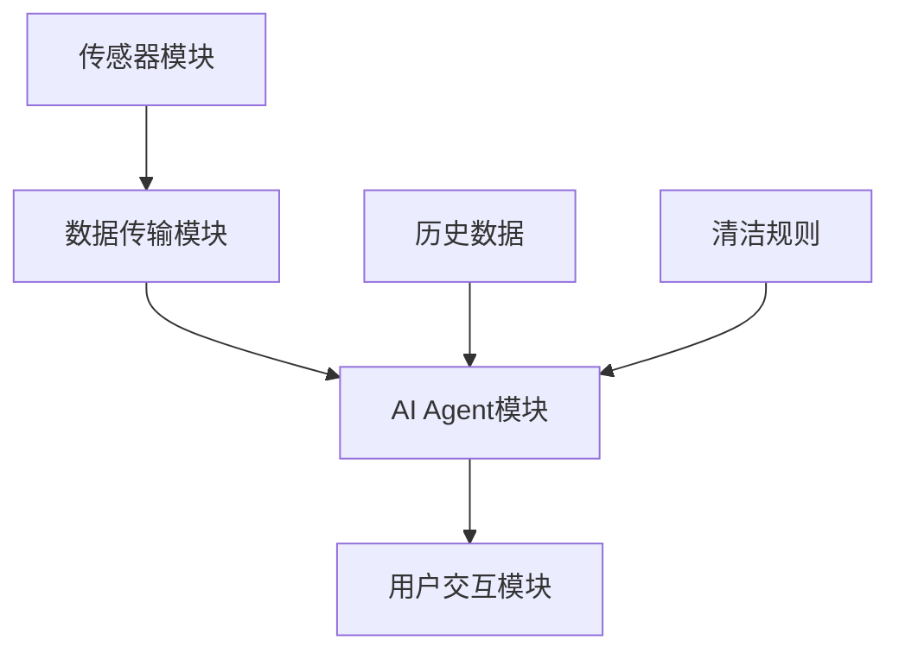

# AI Agent在智能衣架中的衣物清洁建议

> 关键词：AI Agent、智能衣架、衣物清洁建议、机器学习、传感器技术

> 摘要：本文围绕AI Agent在智能衣架中的衣物清洁建议展开深入探讨。首先介绍了相关背景，包括研究目的、预期读者等内容。接着阐述了AI Agent和智能衣架的核心概念与联系，通过文本示意图和Mermaid流程图清晰呈现其架构。详细讲解了核心算法原理，结合Python源代码进行说明，并给出数学模型和公式。在项目实战部分，从开发环境搭建到源代码详细实现与解读进行了全面分析。还探讨了实际应用场景，推荐了相关工具和资源，最后总结了未来发展趋势与挑战，同时给出常见问题解答和扩展阅读参考资料，旨在为AI Agent在智能衣架领域的应用提供全面且深入的技术指导和理论支持。

## 1. 背景介绍 
### 1.1 目的和范围
随着智能家居的快速发展，智能衣架作为其中的一个创新产品逐渐受到关注。本研究的目的在于探索如何利用AI Agent技术为智能衣架赋予智能决策能力，从而为用户提供准确、个性化的衣物清洁建议。研究范围涵盖了AI Agent的核心算法、智能衣架的硬件架构、衣物清洁建议的生成机制等方面，旨在构建一个完整的智能衣架系统，实现从衣物状态感知到清洁建议输出的全流程智能化。

### 1.2 预期读者
本文预期读者包括对智能家居技术、人工智能应用感兴趣的研究人员、工程师、开发者，以及关注智能生活产品的消费者。对于研究人员和工程师，本文提供了深入的技术原理和算法实现细节，可作为进一步研究和开发的参考；对于开发者，文中的项目实战部分将为其提供具体的代码实现和开发思路；对于消费者，通过了解AI Agent在智能衣架中的应用，能更好地理解智能产品的功能和价值。

### 1.3 文档结构概述
本文将按照以下结构展开：首先介绍背景知识，包括研究目的、预期读者和文档结构概述等内容；接着阐述AI Agent和智能衣架的核心概念与联系，通过文本示意图和Mermaid流程图呈现其架构；然后详细讲解核心算法原理，结合Python源代码进行说明，并给出数学模型和公式；在项目实战部分，从开发环境搭建到源代码详细实现与解读进行全面分析；探讨实际应用场景；推荐相关工具和资源；总结未来发展趋势与挑战；给出常见问题解答和扩展阅读参考资料。

### 1.4 术语表
#### 1.4.1 核心术语定义
- **AI Agent（人工智能智能体）**：是一种能够感知环境、进行决策并采取行动的智能实体，在本文中主要用于处理智能衣架收集到的衣物状态信息并生成清洁建议。
- **智能衣架**：具备多种传感器，能够感知衣物的材质、污渍程度、气味等信息，并与AI Agent进行交互，为用户提供衣物清洁建议的智能设备。
- **衣物清洁建议**：根据衣物的状态信息，由AI Agent生成的关于衣物清洁方式、清洁剂选择、清洁温度等方面的建议。

#### 1.4.2 相关概念解释
- **机器学习**：是AI Agent实现智能决策的重要技术手段，通过对大量衣物清洁数据的学习，AI Agent能够不断优化其决策模型，提高清洁建议的准确性。
- **传感器技术**：智能衣架通过各种传感器收集衣物的状态信息，如光学传感器用于检测污渍程度，气味传感器用于检测衣物气味等。

#### 1.4.3 缩略词列表
- **AI**：Artificial Intelligence（人工智能）
- **ML**：Machine Learning（机器学习）

## 2. 核心概念与联系 

### 核心概念原理
AI Agent在智能衣架中的应用主要基于以下原理：智能衣架通过各种传感器收集衣物的状态信息，如材质、污渍程度、气味等。这些信息被传输到AI Agent中，AI Agent利用机器学习算法对这些信息进行分析和处理，结合预设的清洁规则和历史数据，生成个性化的衣物清洁建议。然后，这些建议通过智能衣架的显示屏或手机应用程序反馈给用户。

### 架构的文本示意图
智能衣架系统主要由以下几个部分组成：
- **传感器模块**：包括光学传感器、气味传感器、材质识别传感器等，用于收集衣物的状态信息。
- **数据传输模块**：将传感器收集到的信息传输到AI Agent所在的服务器或本地设备。
- **AI Agent模块**：对传输过来的信息进行分析和处理，生成衣物清洁建议。
- **用户交互模块**：通过智能衣架的显示屏或手机应用程序将清洁建议反馈给用户。

### Mermaid流程图


## 3. 核心算法原理 & 具体操作步骤 

### 核心算法原理
AI Agent在生成衣物清洁建议时，主要采用了机器学习中的分类算法和规则推理算法。分类算法用于对衣物的材质、污渍程度等信息进行分类，规则推理算法则根据分类结果和预设的清洁规则生成清洁建议。

### 具体操作步骤
1. **数据收集**：智能衣架的传感器模块收集衣物的状态信息，如材质、污渍程度、气味等。
2. **数据预处理**：对收集到的信息进行清洗、归一化等预处理操作，以提高数据的质量。
3. **特征提取**：从预处理后的数据中提取有用的特征，如材质特征、污渍特征等。
4. **分类算法**：使用分类算法对衣物的材质、污渍程度等信息进行分类。
5. **规则推理**：根据分类结果和预设的清洁规则，生成衣物清洁建议。
6. **结果反馈**：将生成的清洁建议通过智能衣架的显示屏或手机应用程序反馈给用户。

### Python源代码详细阐述
```python
import numpy as np
from sklearn.preprocessing import StandardScaler
from sklearn.tree import DecisionTreeClassifier

# 模拟传感器收集的数据
def collect_data():
    # 假设收集到的信息包括材质、污渍程度、气味等
    data = np.random.rand(10, 3)  # 10个样本，3个特征
    return data

# 数据预处理
def preprocess_data(data):
    scaler = StandardScaler()
    preprocessed_data = scaler.fit_transform(data)
    return preprocessed_data

# 特征提取
def extract_features(data):
    # 这里简单地将数据作为特征
    features = data
    return features

# 分类算法
def classify(features):
    # 假设已经训练好的决策树分类器
    classifier = DecisionTreeClassifier()
    # 模拟训练数据
    X_train = np.random.rand(20, 3)
    y_train = np.random.randint(0, 2, 20)
    classifier.fit(X_train, y_train)
    labels = classifier.predict(features)
    return labels

# 规则推理
def rule_reasoning(labels):
    # 预设的清洁规则
    rules = {
        0: "轻柔洗涤，使用温和清洁剂",
        1: "正常洗涤，使用普通清洁剂"
    }
    suggestions = [rules[label] for label in labels]
    return suggestions

# 主函数
def main():
    data = collect_data()
    preprocessed_data = preprocess_data(data)
    features = extract_features(preprocessed_data)
    labels = classify(features)
    suggestions = rule_reasoning(labels)
    print("衣物清洁建议：", suggestions)

if __name__ == "__main__":
    main()
```

## 4. 数学模型和公式 & 详细讲解 & 举例说明 

### 分类算法的数学模型
在分类算法中，常用的决策树分类器的数学模型可以表示为：
$$
f(x) = \arg \max_{k} P(Y = k | X = x)
$$
其中，$x$ 是输入的特征向量，$Y$ 是类别标签，$k$ 是类别数，$P(Y = k | X = x)$ 是在给定特征向量 $x$ 的条件下，类别为 $k$ 的概率。决策树分类器通过递归地划分特征空间，找到最优的划分规则，使得每个划分区域内的样本属于同一类别。

### 详细讲解
决策树分类器的训练过程主要包括以下几个步骤：
1. **特征选择**：选择一个最优的特征作为划分节点，使得划分后的子节点的纯度最高。常用的特征选择方法有信息增益、信息增益比、基尼指数等。
2. **划分节点**：根据选择的特征将样本集划分为不同的子节点。
3. **递归构建**：对每个子节点重复步骤1和步骤2，直到满足停止条件，如子节点中的样本数小于某个阈值或所有样本属于同一类别。

### 举例说明
假设我们有一个衣物分类问题，特征包括材质（棉质、丝绸、羊毛）、污渍程度（轻度、中度、重度）和气味（无、有），类别标签为清洁方式（轻柔洗涤、正常洗涤、强力洗涤）。我们可以使用决策树分类器对这些样本进行训练，得到一个决策树模型。当有新的衣物信息输入时，决策树模型可以根据输入的特征进行分类，输出对应的清洁方式。

## 5. 项目实战：代码实际案例和详细解释说明 

### 5.1  开发环境搭建
1. **硬件环境**：需要一个智能衣架，配备光学传感器、气味传感器、材质识别传感器等，以及一个支持网络通信的开发板，如树莓派。
2. **软件环境**：安装Python开发环境，推荐使用Python 3.7及以上版本。同时，安装必要的Python库，如NumPy、Scikit-learn等。

### 5.2  源代码详细实现和代码解读
```python
import numpy as np
from sklearn.preprocessing import StandardScaler
from sklearn.tree import DecisionTreeClassifier
import socket

# 模拟传感器收集的数据
def collect_data():
    # 这里假设通过网络通信接收传感器数据
    server_socket = socket.socket(socket.AF_INET, socket.SOCK_STREAM)
    server_socket.bind(('localhost', 8888))
    server_socket.listen(1)
    print("等待传感器数据...")
    conn, addr = server_socket.accept()
    data_str = conn.recv(1024).decode()
    data = np.array([float(x) for x in data_str.split(',')]).reshape(1, -1)
    conn.close()
    return data

# 数据预处理
def preprocess_data(data):
    scaler = StandardScaler()
    preprocessed_data = scaler.fit_transform(data)
    return preprocessed_data

# 特征提取
def extract_features(data):
    # 这里简单地将数据作为特征
    features = data
    return features

# 分类算法
def classify(features):
    # 假设已经训练好的决策树分类器
    classifier = DecisionTreeClassifier()
    # 模拟训练数据
    X_train = np.random.rand(20, 3)
    y_train = np.random.randint(0, 2, 20)
    classifier.fit(X_train, y_train)
    labels = classifier.predict(features)
    return labels

# 规则推理
def rule_reasoning(labels):
    # 预设的清洁规则
    rules = {
        0: "轻柔洗涤，使用温和清洁剂",
        1: "正常洗涤，使用普通清洁剂"
    }
    suggestions = [rules[label] for label in labels]
    return suggestions

# 主函数
def main():
    data = collect_data()
    preprocessed_data = preprocess_data(data)
    features = extract_features(preprocessed_data)
    labels = classify(features)
    suggestions = rule_reasoning(labels)
    print("衣物清洁建议：", suggestions)

if __name__ == "__main__":
    main()
```

### 5.3  代码解读与分析
1. **数据收集**：通过网络通信接收传感器数据，将接收到的字符串数据转换为NumPy数组。
2. **数据预处理**：使用StandardScaler对数据进行归一化处理，使得数据具有零均值和单位方差。
3. **特征提取**：简单地将预处理后的数据作为特征。
4. **分类算法**：使用决策树分类器对特征进行分类，输出类别标签。
5. **规则推理**：根据类别标签和预设的清洁规则，生成衣物清洁建议。
6. **主函数**：调用上述函数，完成整个流程，并输出衣物清洁建议。

## 6. 实际应用场景 
### 家庭场景
在家庭中，智能衣架可以放置在衣柜中，当用户将衣物挂在衣架上时，智能衣架能够自动检测衣物的状态，并为用户提供个性化的清洁建议。例如，如果检测到衣物有轻微污渍，AI Agent会建议用户进行局部清洁；如果衣物有较重的气味，会建议用户进行全面洗涤。

### 酒店场景
在酒店中，智能衣架可以放置在客房内，为客人提供衣物清洁服务。当客人将衣物挂在衣架上时，智能衣架能够快速检测衣物的状态，并将清洁建议发送到客人的手机应用程序上。酒店工作人员可以根据这些建议为客人提供专业的衣物清洁服务。

### 洗衣店场景
在洗衣店中，智能衣架可以用于对衣物进行预处理。洗衣店工作人员可以将衣物挂在智能衣架上，智能衣架会自动检测衣物的材质、污渍程度等信息，并为工作人员提供清洁建议。这样可以提高洗衣店的工作效率和服务质量。

## 7. 工具和资源推荐
### 7.1 学习资源推荐
#### 7.1.1 书籍推荐
- 《Python机器学习实战》：详细介绍了Python在机器学习中的应用，包括分类算法、回归算法、聚类算法等。
- 《人工智能：一种现代方法》：全面介绍了人工智能的基本概念、算法和应用，是人工智能领域的经典教材。

#### 7.1.2 在线课程
- Coursera上的“机器学习”课程：由斯坦福大学教授Andrew Ng主讲，是机器学习领域的经典课程。
- edX上的“人工智能基础”课程：系统介绍了人工智能的基本概念、算法和应用。

#### 7.1.3 技术博客和网站
- Medium：上面有很多关于人工智能和智能家居的技术文章和案例分享。
- 开源中国：提供了丰富的开源项目和技术文章，对于学习和实践有很大的帮助。

### 7.2 开发工具框架推荐
#### 7.2.1 IDE和编辑器
- PyCharm：是一款专门用于Python开发的集成开发环境，具有代码编辑、调试、版本控制等功能。
- Visual Studio Code：是一款轻量级的代码编辑器，支持多种编程语言，具有丰富的插件生态系统。

#### 7.2.2 调试和性能分析工具
- Py-Spy：是一款用于Python代码性能分析的工具，可以帮助开发者找出代码中的性能瓶颈。
- PDB：是Python自带的调试工具，可以帮助开发者调试代码中的错误。

#### 7.2.3 相关框架和库
- Scikit-learn：是一个用于机器学习的Python库，提供了丰富的机器学习算法和工具。
- TensorFlow：是一个开源的机器学习框架，广泛应用于深度学习领域。

### 7.3 相关论文著作推荐
#### 7.3.1 经典论文
- “A Decision-Theoretic View of Machine Learning”：介绍了决策理论在机器学习中的应用，为决策树分类器等算法提供了理论基础。
- “Artificial Intelligence: A New Synthesis”：对人工智能的发展历程和主要算法进行了全面的总结和分析。

#### 7.3.2 最新研究成果
- 关注IEEE Transactions on Pattern Analysis and Machine Intelligence、Journal of Artificial Intelligence Research等学术期刊，了解人工智能领域的最新研究成果。

#### 7.3.3 应用案例分析
- 参考相关的行业报告和案例分析，了解AI Agent在智能家居、智能穿戴等领域的应用案例和实践经验。

## 8. 总结：未来发展趋势与挑战
### 未来发展趋势
1. **智能化程度不断提高**：随着人工智能技术的不断发展，AI Agent在智能衣架中的应用将越来越智能化，能够更加准确地感知衣物的状态，并提供更加个性化的清洁建议。
2. **与其他智能家居设备的融合**：智能衣架将与其他智能家居设备，如智能洗衣机、智能烘干机等进行融合，实现衣物清洁的自动化和智能化。
3. **大数据和云计算的应用**：通过大数据和云计算技术，智能衣架可以收集和分析更多的衣物清洁数据，不断优化AI Agent的决策模型，提高清洁建议的准确性和可靠性。

### 挑战
1. **传感器技术的局限性**：目前的传感器技术在衣物材质识别、污渍程度检测等方面还存在一定的局限性，需要进一步提高传感器的精度和可靠性。
2. **数据安全和隐私问题**：智能衣架收集的衣物状态信息涉及用户的隐私，需要加强数据安全和隐私保护，防止数据泄露和滥用。
3. **用户接受度**：用户对智能衣架这种新型产品的接受度还需要进一步提高，需要加强市场推广和用户教育，让用户了解智能衣架的功能和价值。

## 9. 附录：常见问题与解答
### 1. 智能衣架的传感器精度如何？
目前智能衣架的传感器精度在不断提高，但在某些复杂情况下，如衣物材质混合、污渍颜色特殊等，可能会存在一定的误差。随着传感器技术的发展，精度将不断提高。

### 2. 智能衣架的清洁建议是否准确？
智能衣架的清洁建议是基于AI Agent的算法和预设的清洁规则生成的，在大多数情况下是准确的。但由于衣物状态的复杂性和多样性，可能会存在一定的偏差。用户可以根据实际情况进行调整。

### 3. 智能衣架的数据安全如何保障？
智能衣架采用了多种数据安全技术，如数据加密、访问控制等，确保用户的衣物状态信息不被泄露和滥用。同时，相关企业也会遵守严格的数据安全法规和标准。

### 4. 智能衣架的价格如何？
智能衣架的价格因品牌、功能、配置等因素而异。目前市场上的智能衣架价格范围较广，用户可以根据自己的需求和预算进行选择。

## 10. 扩展阅读 & 参考资料
- 《智能家居技术与应用》
- 相关的学术论文和研究报告
- 智能家居行业的官方网站和论坛
- 智能衣架产品的官方文档和用户手册