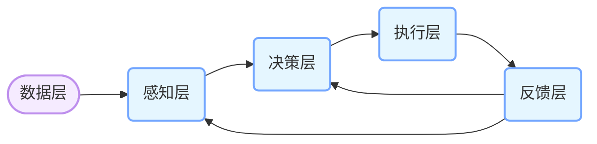

# AI Agent在智能资产管理中的应用

> 关键词：AI Agent、智能资产管理、自动化、决策辅助、风险评估、资源优化、资产绩效

> 摘要：本文聚焦于AI Agent在智能资产管理中的应用。随着数字化时代的发展，资产管理面临着越来越多的挑战和机遇，AI Agent凭借其自动化、智能决策等特性为解决这些问题提供了新的途径。文章将深入探讨AI Agent的核心概念与原理，详细阐述其在资产管理中的算法实现、数学模型以及具体操作步骤。通过项目实战案例，展示AI Agent在实际应用中的效果和优势。同时，分析其在不同场景下的应用，并推荐相关的学习资源、开发工具和研究论文。最后，对AI Agent在智能资产管理领域的未来发展趋势和挑战进行总结与展望。

## 1. 背景介绍 
### 1.1 目的和范围
在当今复杂多变的经济环境下，资产管理的重要性日益凸显。传统的资产管理方式往往依赖人工经验，存在效率低、易出错等问题。本文章的目的在于深入探讨AI Agent在智能资产管理中的应用，通过分析其原理、算法和实际案例，为资产管理领域提供新的思路和方法。文章的范围涵盖了AI Agent的基本概念、在资产管理中的具体应用场景、相关算法和数学模型，以及实际项目的开发与实现。

### 1.2 预期读者
本文预期读者包括资产管理领域的从业者，如资产管理人员、投资经理、风险分析师等，他们可以从文章中了解到如何利用AI Agent提升资产管理的效率和质量；计算机科学领域的研究人员和开发者，能够获取关于AI Agent技术在资产管理应用中的具体实现细节和技术思路；以及对智能资产管理和AI Agent技术感兴趣的广大爱好者，帮助他们初步了解这一新兴领域的知识和应用。

### 1.3 文档结构概述
本文将按照以下结构展开：首先介绍背景信息，包括目的、预期读者和文档结构概述等；接着阐述AI Agent的核心概念与联系，通过文本示意图和Mermaid流程图展示其原理和架构；然后详细讲解核心算法原理和具体操作步骤，结合Python源代码进行说明；再介绍相关的数学模型和公式，并举例说明；通过项目实战展示AI Agent在智能资产管理中的实际应用和代码实现；分析其在不同实际场景中的应用；推荐相关的学习工具和资源；最后总结AI Agent在智能资产管理中的未来发展趋势与挑战，并提供常见问题解答和扩展阅读参考资料。

### 1.4 术语表
#### 1.4.1 核心术语定义
- **AI Agent（人工智能代理）**：是一种能够感知环境、进行推理和决策，并采取行动以实现特定目标的智能实体。它可以根据预设的规则或通过学习来适应不同的环境和任务。
- **智能资产管理**：利用先进的信息技术和智能算法，对资产进行全面、系统的管理，包括资产的配置、监控、评估和优化等过程，以实现资产的保值增值和风险控制。
- **自动化**：指在不需要人工干预的情况下，系统自动完成一系列任务的过程。在智能资产管理中，自动化可以提高效率、减少人为错误。
- **决策辅助**：通过分析大量的数据和信息，为决策者提供支持和建议，帮助他们做出更明智的决策。
- **风险评估**：对资产面临的各种风险进行识别、分析和评估，以确定风险的程度和可能性，并采取相应的措施进行管理。

#### 1.4.2 相关概念解释
- **机器学习**：是AI Agent实现智能决策的重要技术之一，通过对大量数据的学习和分析，自动发现数据中的模式和规律，并据此进行预测和决策。
- **深度学习**：是机器学习的一个分支，利用深度神经网络模型，对复杂的数据进行特征提取和分析，具有很强的学习和泛化能力。
- **强化学习**：通过智能体与环境的交互，根据环境反馈的奖励信号来学习最优的行为策略，以实现长期的目标。

#### 1.4.3 缩略词列表
- **AI**：Artificial Intelligence（人工智能）
- **ML**：Machine Learning（机器学习）
- **DL**：Deep Learning（深度学习）
- **RL**：Reinforcement Learning（强化学习）

## 2. 核心概念与联系 

### 核心概念原理
AI Agent是一种基于人工智能技术的智能实体，它由感知模块、决策模块和执行模块组成。感知模块负责收集环境信息，包括资产的市场数据、财务数据、风险指标等；决策模块根据感知到的信息，运用预设的规则或通过机器学习算法进行推理和决策；执行模块根据决策结果采取相应的行动，如资产的买卖、配置调整等。

AI Agent的工作原理基于智能决策和自动化执行。它可以不断地学习和适应环境的变化，通过对历史数据的分析和对未来趋势的预测，做出最优的决策。同时，它可以自动执行决策，减少人工干预，提高资产管理的效率和准确性。

### 架构的文本示意图
AI Agent在智能资产管理中的架构可以分为以下几个层次：
- **数据层**：包括各种数据源，如金融市场数据、企业财务数据、宏观经济数据等。这些数据是AI Agent进行决策的基础。
- **感知层**：负责收集和处理数据层的数据，将其转化为AI Agent能够理解的信息。感知层可以使用传感器、数据接口等技术来获取数据，并进行数据清洗、预处理和特征提取等操作。
- **决策层**：根据感知层提供的信息，运用机器学习、深度学习等算法进行推理和决策。决策层可以使用规则引擎、优化算法等技术来实现决策的自动化和智能化。
- **执行层**：根据决策层的决策结果，采取相应的行动，如资产的买卖、配置调整等。执行层可以使用交易接口、自动化执行系统等技术来实现决策的执行。
- **反馈层**：负责收集执行层的执行结果和环境的变化信息，并将其反馈给感知层和决策层。反馈层可以使用监控系统、评估指标等技术来实现反馈的自动化和智能化。

### Mermaid流程图


## 3. 核心算法原理 & 具体操作步骤 

### 核心算法原理
在智能资产管理中，AI Agent常用的算法包括机器学习算法和强化学习算法。

#### 机器学习算法
以线性回归算法为例，线性回归是一种用于预测连续数值的算法，其基本原理是通过对历史数据的学习，找到自变量和因变量之间的线性关系。线性回归的数学模型可以表示为：
$$y = \theta_0 + \theta_1x_1 + \theta_2x_2 + \cdots + \theta_nx_n + \epsilon$$
其中，$y$ 是因变量，$x_1, x_2, \cdots, x_n$ 是自变量，$\theta_0, \theta_1, \theta_2, \cdots, \theta_n$ 是模型的参数，$\epsilon$ 是误差项。

线性回归的目标是找到一组最优的参数 $\theta$，使得预测值与真实值之间的误差最小。常用的误差度量方法是均方误差（MSE），其计算公式为：
$$MSE = \frac{1}{m}\sum_{i=1}^{m}(y_i - \hat{y}_i)^2$$
其中，$m$ 是样本数量，$y_i$ 是真实值，$\hat{y}_i$ 是预测值。

为了找到最优的参数 $\theta$，可以使用最小二乘法或梯度下降法。

#### 强化学习算法
以Q学习算法为例，Q学习是一种无模型的强化学习算法，其目标是学习一个最优的行为策略，使得智能体在环境中获得最大的累积奖励。Q学习的核心是Q值函数，它表示在某个状态下采取某个动作所获得的期望累积奖励。

Q值函数的更新公式为：
$$Q(s_t, a_t) \leftarrow Q(s_t, a_t) + \alpha[r_{t+1} + \gamma\max_{a}Q(s_{t+1}, a) - Q(s_t, a_t)]$$
其中，$s_t$ 是当前状态，$a_t$ 是当前动作，$r_{t+1}$ 是下一个时间步的奖励，$s_{t+1}$ 是下一个状态，$\alpha$ 是学习率，$\gamma$ 是折扣因子。

### 具体操作步骤

#### 数据收集与预处理
- 收集资产的市场数据、财务数据、风险指标等相关数据。
- 对数据进行清洗，去除缺失值、异常值等。
- 对数据进行标准化处理，使得不同特征的数据具有相同的尺度。

#### 模型训练
- 选择合适的算法，如线性回归、Q学习等。
- 将预处理后的数据分为训练集和测试集。
- 使用训练集对模型进行训练，调整模型的参数。

#### 模型评估
- 使用测试集对训练好的模型进行评估，计算评估指标，如均方误差、准确率等。
- 根据评估结果，对模型进行优化和调整。

#### 决策与执行
- 使用训练好的模型对新的数据进行预测和决策。
- 根据决策结果，采取相应的行动，如资产的买卖、配置调整等。

### Python源代码实现
以下是一个简单的线性回归算法的Python实现：

```python
import numpy as np
from sklearn.linear_model import LinearRegression
from sklearn.model_selection import train_test_split
from sklearn.metrics import mean_squared_error

# 生成示例数据
X = np.array([[1], [2], [3], [4], [5]])
y = np.array([2, 4, 6, 8, 10])

# 划分训练集和测试集
X_train, X_test, y_train, y_test = train_test_split(X, y, test_size=0.2, random_state=42)

# 创建线性回归模型
model = LinearRegression()

# 训练模型
model.fit(X_train, y_train)

# 进行预测
y_pred = model.predict(X_test)

# 计算均方误差
mse = mean_squared_error(y_test, y_pred)
print("均方误差:", mse)
```

以下是一个简单的Q学习算法的Python实现：

```python
import numpy as np

# 定义环境
num_states = 5
num_actions = 2
reward_matrix = np.array([[0, 1], [1, 0], [0, 1], [1, 0], [0, 1]])

# 初始化Q值表
Q = np.zeros((num_states, num_actions))

# 定义超参数
alpha = 0.1
gamma = 0.9
epsilon = 0.1
num_episodes = 1000

# Q学习算法
for episode in range(num_episodes):
    state = np.random.randint(0, num_states)
    done = False
    while not done:
        if np.random.uniform(0, 1) < epsilon:
            action = np.random.randint(0, num_actions)
        else:
            action = np.argmax(Q[state, :])
        
        next_state = np.random.randint(0, num_states)
        reward = reward_matrix[state, action]
        
        Q[state, action] = Q[state, action] + alpha * (reward + gamma * np.max(Q[next_state, :]) - Q[state, action])
        
        state = next_state
        
        if state == num_states - 1:
            done = True

print("Q值表:", Q)
```

## 4. 数学模型和公式 & 详细讲解 & 举例说明 

### 线性回归模型
线性回归模型的数学公式为：
$$y = \theta_0 + \theta_1x_1 + \theta_2x_2 + \cdots + \theta_nx_n + \epsilon$$
其中，$y$ 是因变量，$x_1, x_2, \cdots, x_n$ 是自变量，$\theta_0, \theta_1, \theta_2, \cdots, \theta_n$ 是模型的参数，$\epsilon$ 是误差项。

详细讲解：线性回归模型假设自变量和因变量之间存在线性关系，通过对历史数据的学习，找到一组最优的参数 $\theta$，使得预测值与真实值之间的误差最小。误差项 $\epsilon$ 表示模型无法解释的随机误差。

举例说明：假设我们要预测股票的价格，自变量可以是股票的成交量、市盈率等，因变量是股票的价格。通过线性回归模型，我们可以找到这些自变量和因变量之间的线性关系，从而对股票价格进行预测。

### 均方误差（MSE）
均方误差的计算公式为：
$$MSE = \frac{1}{m}\sum_{i=1}^{m}(y_i - \hat{y}_i)^2$$
其中，$m$ 是样本数量，$y_i$ 是真实值，$\hat{y}_i$ 是预测值。

详细讲解：均方误差是一种常用的误差度量方法，它衡量了预测值与真实值之间的平均误差平方。均方误差越小，说明模型的预测效果越好。

举例说明：假设我们有一组股票价格的真实值和预测值，通过计算均方误差，可以评估模型对股票价格的预测准确性。

### Q学习算法的Q值更新公式
Q值更新公式为：
$$Q(s_t, a_t) \leftarrow Q(s_t, a_t) + \alpha[r_{t+1} + \gamma\max_{a}Q(s_{t+1}, a) - Q(s_t, a_t)]$$
其中，$s_t$ 是当前状态，$a_t$ 是当前动作，$r_{t+1}$ 是下一个时间步的奖励，$s_{t+1}$ 是下一个状态，$\alpha$ 是学习率，$\gamma$ 是折扣因子。

详细讲解：Q学习算法通过不断地更新Q值表，来学习最优的行为策略。Q值表记录了在每个状态下采取每个动作所获得的期望累积奖励。学习率 $\alpha$ 控制了每次更新的步长，折扣因子 $\gamma$ 表示对未来奖励的重视程度。

举例说明：在智能资产管理中，状态可以是资产的配置情况，动作可以是资产的买卖操作，奖励可以是资产的收益。通过Q学习算法，AI Agent可以学习到最优的资产配置策略，以获得最大的收益。

## 5. 项目实战：代码实际案例和详细解释说明 

### 5.1  开发环境搭建
#### 安装Python
首先，需要安装Python环境。可以从Python官方网站（https://www.python.org/downloads/） 下载适合自己操作系统的Python安装包，并按照安装向导进行安装。

#### 安装必要的库
在智能资产管理项目中，需要使用一些常用的Python库，如NumPy、Pandas、Scikit-learn等。可以使用以下命令进行安装：
```sh
pip install numpy pandas scikit-learn
```

### 5.2  源代码详细实现和代码解读
以下是一个基于线性回归模型的股票价格预测的项目实战案例：

```python
import numpy as np
import pandas as pd
from sklearn.linear_model import LinearRegression
from sklearn.model_selection import train_test_split
from sklearn.metrics import mean_squared_error
import matplotlib.pyplot as plt

# 读取股票数据
data = pd.read_csv('stock_data.csv')

# 提取特征和标签
X = data[['Volume', 'PE']].values
y = data['Price'].values

# 划分训练集和测试集
X_train, X_test, y_train, y_test = train_test_split(X, y, test_size=0.2, random_state=42)

# 创建线性回归模型
model = LinearRegression()

# 训练模型
model.fit(X_train, y_train)

# 进行预测
y_pred = model.predict(X_test)

# 计算均方误差
mse = mean_squared_error(y_test, y_pred)
print("均方误差:", mse)

# 可视化预测结果
plt.scatter(y_test, y_pred)
plt.xlabel('真实值')
plt.ylabel('预测值')
plt.title('股票价格预测结果')
plt.show()
```

代码解读：
1. **数据读取**：使用Pandas库的`read_csv`函数读取股票数据文件。
2. **特征提取**：从数据中提取成交量（`Volume`）和市盈率（`PE`）作为特征，股票价格（`Price`）作为标签。
3. **数据划分**：使用`train_test_split`函数将数据划分为训练集和测试集，测试集占比为20%。
4. **模型创建**：创建线性回归模型对象。
5. **模型训练**：使用训练集对模型进行训练。
6. **模型预测**：使用训练好的模型对测试集进行预测。
7. **误差计算**：使用`mean_squared_error`函数计算预测值与真实值之间的均方误差。
8. **结果可视化**：使用Matplotlib库绘制真实值和预测值的散点图，直观展示预测结果。

### 5.3  代码解读与分析
#### 优点
- **简单易懂**：线性回归模型是一种简单的机器学习模型，易于理解和实现。
- **可解释性强**：线性回归模型的参数具有明确的物理意义，可以解释自变量对因变量的影响。
- **计算效率高**：线性回归模型的训练和预测速度较快，适用于大规模数据的处理。

#### 缺点
- **线性假设**：线性回归模型假设自变量和因变量之间存在线性关系，对于非线性关系的数据，预测效果可能不佳。
- **容易过拟合**：如果特征数量过多，线性回归模型可能会过拟合，导致泛化能力下降。

#### 改进措施
- **非线性模型**：可以使用非线性模型，如决策树、神经网络等，来处理非线性关系的数据。
- **正则化**：可以使用正则化方法，如Lasso回归、Ridge回归等，来防止模型过拟合。

## 6. 实际应用场景 

### 资产配置优化
AI Agent可以根据市场数据、资产的风险收益特征等信息，运用优化算法，为投资者提供最优的资产配置方案。例如，在股票、债券、基金等不同资产之间进行合理分配，以实现风险和收益的平衡。

### 风险评估与预警
AI Agent可以实时监控资产的风险指标，如波动率、贝塔系数等，对潜在的风险进行评估和预警。当风险指标超过预设的阈值时，及时发出警报，提醒投资者采取相应的措施。

### 交易决策辅助
AI Agent可以根据市场行情、资产的价格走势等信息，运用机器学习算法进行预测和分析，为投资者提供交易决策建议。例如，判断何时买入或卖出资产，以获取最大的收益。

### 资产绩效评估
AI Agent可以对资产的绩效进行评估，计算资产的收益率、夏普比率等指标，分析资产的表现和投资效果。通过对资产绩效的评估，投资者可以及时调整投资策略，优化资产配置。

## 7. 工具和资源推荐
### 7.1 学习资源推荐
#### 7.1.1 书籍推荐
- 《机器学习》（周志华著）：全面介绍了机器学习的基本概念、算法和应用，是机器学习领域的经典教材。
- 《深度学习》（Ian Goodfellow、Yoshua Bengio和Aaron Courville著）：系统阐述了深度学习的理论和实践，是深度学习领域的权威著作。
- 《强化学习：原理与Python实现》（智能系统学习与应用系列）：详细介绍了强化学习的基本原理和算法，并通过Python代码进行实现，适合初学者学习。

#### 7.1.2 在线课程
- Coursera平台的“机器学习”课程（Andrew Ng教授主讲）：是一门经典的机器学习入门课程，内容丰富，讲解详细。
- edX平台的“深度学习”课程（由全球顶尖高校的教授主讲）：深入介绍了深度学习的理论和实践，是学习深度学习的优质课程。
- 网易云课堂的“强化学习实战”课程：通过实际案例，详细介绍了强化学习的应用和实现，具有很强的实践性。

#### 7.1.3 技术博客和网站
- 机器之心（https://www.alijie.com/）：提供人工智能领域的最新技术资讯、研究成果和实践案例，是了解人工智能发展动态的重要平台。
- 深度学习技术前沿（https://www.deeplearningbook.org/）：专注于深度学习领域的技术分享和交流，提供了大量的深度学习论文解读和技术教程。
- Kaggle（https://www.kaggle.com/）：是一个数据科学竞赛平台，提供了丰富的数据集和竞赛项目，可以通过参与竞赛来提高自己的数据分析和机器学习能力。

### 7.2 开发工具框架推荐
#### 7.2.1 IDE和编辑器
- PyCharm：是一款专业的Python集成开发环境，具有强大的代码编辑、调试和项目管理功能，适合Python开发者使用。
- Jupyter Notebook：是一个交互式的开发环境，支持多种编程语言，如Python、R等。它可以将代码、文本、图表等内容整合在一起，方便进行数据分析和模型开发。
- Visual Studio Code：是一款轻量级的代码编辑器，支持多种编程语言和插件扩展。它具有丰富的插件生态系统，可以满足不同的开发需求。

#### 7.2.2 调试和性能分析工具
- PySnooper：是一个简单易用的Python调试工具，可以自动记录函数的执行过程和变量的值，方便进行调试和问题排查。
- cProfile：是Python内置的性能分析工具，可以统计函数的执行时间和调用次数，帮助开发者找出性能瓶颈。
- TensorBoard：是TensorFlow的可视化工具，可以用于可视化模型的训练过程、损失函数的变化等，方便进行模型优化和调试。

#### 7.2.3 相关框架和库
- NumPy：是Python中用于科学计算的基础库，提供了高效的多维数组对象和各种数学函数，是机器学习和数据分析的重要工具。
- Pandas：是Python中用于数据处理和分析的库，提供了高效的数据结构和数据操作方法，如数据读取、清洗、转换等。
- Scikit-learn：是Python中用于机器学习的开源库，提供了丰富的机器学习算法和工具，如分类、回归、聚类等。
- TensorFlow：是Google开发的深度学习框架，提供了高效的深度学习模型训练和部署工具，支持多种深度学习算法和模型结构。
- PyTorch：是Facebook开发的深度学习框架，具有简洁易用的API和动态计算图的特点，适合深度学习研究和开发。

### 7.3 相关论文著作推荐
#### 7.3.1 经典论文
- “A Logical Calculus of the Ideas Immanent in Nervous Activity”（Warren S. McCulloch和Walter Pitts著）：提出了神经元模型，是神经网络领域的经典论文。
- “Learning Representations by Back-propagating Errors”（David E. Rumelhart、Geoffrey E. Hinton和Ronald J. Williams著）：介绍了反向传播算法，是深度学习领域的重要突破。
- “Reinforcement Learning: An Introduction”（Richard S. Sutton和Andrew G. Barto著）：是强化学习领域的经典教材，系统阐述了强化学习的基本原理和算法。

#### 7.3.2 最新研究成果
- 关注顶级学术会议，如NeurIPS（神经信息处理系统大会）、ICML（国际机器学习会议）、CVPR（计算机视觉与模式识别会议）等，这些会议上的研究成果代表了人工智能领域的最新进展。
- 关注顶级学术期刊，如Journal of Artificial Intelligence Research（JAIR）、Artificial Intelligence（AI）等，这些期刊上发表的论文具有较高的学术水平和研究价值。

#### 7.3.3 应用案例分析
- 可以参考一些实际应用案例，如金融机构使用AI Agent进行风险管理、投资决策等方面的案例，了解AI Agent在智能资产管理中的实际应用效果和经验。

## 8. 总结：未来发展趋势与挑战
### 未来发展趋势
- **智能化程度不断提高**：随着人工智能技术的不断发展，AI Agent的智能化程度将不断提高，能够更加准确地感知环境、进行推理和决策，为智能资产管理提供更加高效、智能的解决方案。
- **与其他技术的融合**：AI Agent将与区块链、物联网、大数据等技术深度融合，实现资产信息的共享和互信，提高资产管理的透明度和安全性。
- **个性化服务**：根据投资者的风险偏好、投资目标等个性化需求，AI Agent将提供更加个性化的资产管理服务，满足不同投资者的需求。
- **自动化程度加深**：在资产管理的各个环节，如资产配置、交易执行、风险监控等，AI Agent的自动化程度将不断加深，减少人工干预，提高管理效率。

### 挑战
- **数据质量和安全问题**：AI Agent的决策依赖于大量的数据，数据的质量和安全直接影响到决策的准确性和可靠性。因此，需要解决数据的清洗、标注、存储和保护等问题。
- **算法的可解释性**：一些复杂的机器学习和深度学习算法，如神经网络，往往被视为“黑盒”模型，其决策过程难以解释。在智能资产管理中，需要提高算法的可解释性，以便投资者理解和信任AI Agent的决策。
- **伦理和法律问题**：AI Agent的应用可能会带来一些伦理和法律问题，如数据隐私、算法歧视、责任界定等。需要建立相应的伦理和法律框架，规范AI Agent的应用。
- **技术人才短缺**：AI Agent的开发和应用需要具备人工智能、机器学习、金融等多领域知识的复合型人才。目前，这类技术人才相对短缺，需要加强人才培养和引进。

## 9. 附录：常见问题与解答
### 1. AI Agent在智能资产管理中的应用是否会完全取代人类？
不会。虽然AI Agent具有自动化、智能决策等优势，但在智能资产管理中，人类的经验、判断力和创造力仍然是不可替代的。AI Agent可以作为人类的辅助工具，帮助人类更好地进行资产管理决策。

### 2. 如何选择适合的AI Agent算法？
选择适合的AI Agent算法需要考虑多个因素，如数据的特点、问题的类型、模型的复杂度等。一般来说，可以先对数据进行分析和预处理，然后尝试不同的算法，通过评估指标来选择最优的算法。

### 3. AI Agent在智能资产管理中的应用需要注意哪些风险？
需要注意数据质量和安全风险、算法的过拟合风险、决策的偏差风险等。为了降低风险，需要加强数据管理、进行模型评估和优化、建立风险预警机制等。

### 4. 如何提高AI Agent的性能？
可以从以下几个方面提高AI Agent的性能：优化算法和模型结构、增加数据量和数据质量、调整超参数、进行模型融合等。

## 10. 扩展阅读 & 参考资料
- 《人工智能：一种现代的方法》（Stuart J. Russell和Peter Norvig著）
- 《数据挖掘：概念与技术》（Jiawei Han、Jian Pei和Jianwen Yin著）
- 《金融科技：应用与创新》（谢平、邹传伟等著）
- 相关学术期刊和会议论文，如《Journal of Financial Economics》、《Management Science》等。
- 行业报告和研究机构的研究成果，如麦肯锡、波士顿咨询等发布的关于智能资产管理和人工智能应用的报告。