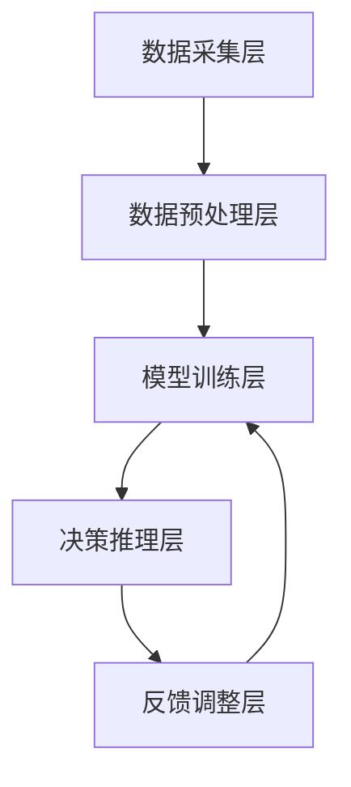
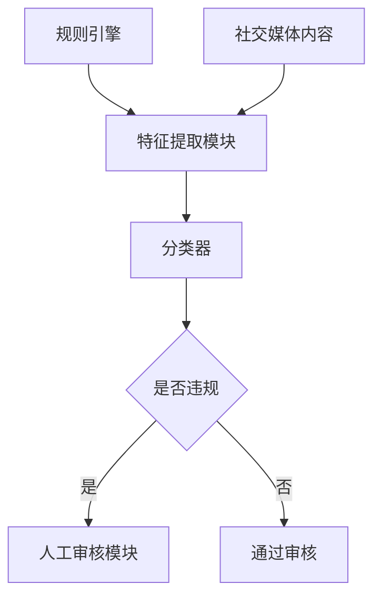
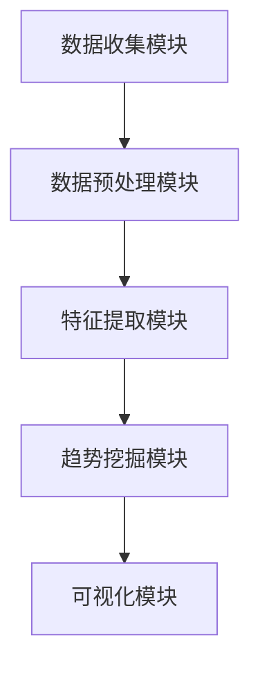

# AI Agent在社交媒体中的应用：内容审核与趋势分析

> 关键词：AI Agent、社交媒体、内容审核、趋势分析、人工智能、自然语言处理、机器学习

> 摘要：本文深入探讨了AI Agent在社交媒体领域的两大重要应用，即内容审核与趋势分析。首先介绍了相关背景知识，包括目的、预期读者等。接着阐述了AI Agent、内容审核和趋势分析的核心概念及其联系，并给出相应的原理和架构示意图。详细讲解了核心算法原理及具体操作步骤，同时给出数学模型和公式并举例说明。通过项目实战展示了代码实现及解读，分析了实际应用场景。推荐了相关的学习资源、开发工具框架和论文著作。最后总结了未来发展趋势与挑战，还包含常见问题解答及参考资料，旨在为读者全面呈现AI Agent在社交媒体中内容审核与趋势分析的应用全貌。

## 1. 背景介绍 
### 1.1 目的和范围
随着社交媒体的迅速发展，用户生成的内容呈现爆炸式增长。这既带来了信息的丰富性，也引发了一系列问题，如不良信息的传播、虚假信息的泛滥等。同时，社交媒体平台也需要及时把握用户关注的趋势，以便提供更好的服务和进行精准的运营。本文章的目的在于深入探讨AI Agent在社交媒体内容审核和趋势分析方面的应用，分析其原理、实现方法以及实际应用场景。范围涵盖了AI Agent的基本概念、相关算法、数学模型，以及在社交媒体平台上的具体实践案例。

### 1.2 预期读者
本文预期读者包括对人工智能、社交媒体技术感兴趣的研究人员、开发者、社交媒体平台的运营人员以及相关专业的学生。研究人员可以从本文中获取最新的研究思路和技术发展动态；开发者能够学习到具体的算法实现和项目实践经验；社交媒体平台运营人员可以了解如何利用AI Agent提升平台的内容质量和运营效果；学生则可以将本文作为学习相关知识的参考资料，加深对人工智能在社交媒体领域应用的理解。

### 1.3 文档结构概述
本文首先介绍相关背景知识，为读者构建基础认知。接着阐述核心概念与联系，使读者对AI Agent、内容审核和趋势分析有清晰的认识。然后详细讲解核心算法原理和具体操作步骤，同时给出数学模型和公式进行理论支撑。通过项目实战展示实际代码实现和解读，让读者了解如何在实际中应用这些技术。分析实际应用场景，探讨其在不同场景下的作用。推荐相关的工具和资源，帮助读者进一步深入学习。最后总结未来发展趋势与挑战，并提供常见问题解答和参考资料，方便读者查阅。

### 1.4 术语表
#### 1.4.1 核心术语定义
- **AI Agent（人工智能智能体）**：是一种能够感知环境、做出决策并采取行动以实现特定目标的智能实体。在社交媒体应用中，AI Agent可以根据预设的规则和学习到的知识，对社交媒体内容进行处理和分析。
- **内容审核**：指对社交媒体上用户生成的内容进行检查和筛选，以确保其符合平台的规定和社会道德规范，防止不良信息的传播。
- **趋势分析**：通过对社交媒体上大量内容的分析，挖掘出用户关注的热点话题、流行趋势等信息，为平台运营和决策提供依据。

#### 1.4.2 相关概念解释
- **自然语言处理（NLP）**：是人工智能的一个重要领域，主要研究如何让计算机理解和处理人类语言。在内容审核和趋势分析中，NLP技术用于对文本内容进行语义分析、情感分析等。
- **机器学习（ML）**：是一门多领域交叉学科，涉及概率论、统计学、逼近论、凸分析、算法复杂度理论等多门学科。它专门研究计算机怎样模拟或实现人类的学习行为，以获取新的知识或技能，重新组织已有的知识结构使之不断改善自身的性能。在AI Agent的应用中，机器学习算法用于训练模型，使其能够自动识别和分类社交媒体内容。

#### 1.4.3 缩略词列表
- **NLP**：Natural Language Processing（自然语言处理）
- **ML**：Machine Learning（机器学习）
- **CNN**：Convolutional Neural Network（卷积神经网络）
- **RNN**：Recurrent Neural Network（循环神经网络）
- **LSTM**：Long Short - Term Memory（长短期记忆网络）

## 2. 核心概念与联系 
### 2.1 AI Agent的原理和架构
AI Agent的基本原理是基于感知、决策和行动的循环过程。它通过传感器感知环境信息，将这些信息输入到决策模块中，决策模块根据预设的规则和学习到的知识做出决策，最后通过执行器采取相应的行动。

在社交媒体应用中，AI Agent的架构可以分为以下几个部分：
- **数据采集层**：负责从社交媒体平台上收集用户生成的内容，包括文本、图片、视频等。
- **数据预处理层**：对采集到的数据进行清洗、转换和特征提取等操作，以便后续的分析和处理。
- **模型训练层**：使用机器学习和深度学习算法对预处理后的数据进行训练，生成分类模型、情感分析模型等。
- **决策推理层**：根据训练好的模型对新的社交媒体内容进行分析和判断，做出决策，如是否通过审核、属于哪种趋势类别等。
- **反馈调整层**：将决策结果反馈给模型训练层，根据实际情况对模型进行调整和优化。

以下是AI Agent在社交媒体应用中的架构示意图：



### 2.2 内容审核的原理和架构
内容审核的原理是通过对社交媒体内容进行多维度的分析，判断其是否符合平台的规定和社会道德规范。常见的审核维度包括文本内容、图片内容、视频内容等。

内容审核的架构可以分为以下几个部分：
- **规则引擎**：定义了一系列的审核规则，如禁止发布的关键词、敏感信息等。
- **特征提取模块**：从社交媒体内容中提取特征，如文本的关键词、图片的颜色特征等。
- **分类器**：根据提取的特征对内容进行分类，判断其是否违规。
- **人工审核模块**：对于一些难以自动判断的内容，由人工进行审核。

以下是内容审核的架构示意图：



### 2.3 趋势分析的原理和架构
趋势分析的原理是通过对社交媒体上大量内容的分析，挖掘出用户关注的热点话题、流行趋势等信息。常见的分析方法包括文本挖掘、情感分析、话题建模等。

趋势分析的架构可以分为以下几个部分：
- **数据收集模块**：从社交媒体平台上收集相关的内容数据。
- **数据预处理模块**：对收集到的数据进行清洗、分词、去除停用词等操作。
- **特征提取模块**：从预处理后的数据中提取特征，如关键词、主题等。
- **趋势挖掘模块**：使用聚类、关联分析等算法挖掘出热点话题和流行趋势。
- **可视化模块**：将挖掘出的趋势信息以直观的图表、报表等形式展示出来。

以下是趋势分析的架构示意图：



### 2.4 核心概念之间的联系
AI Agent是实现内容审核和趋势分析的关键技术手段。在内容审核中，AI Agent可以利用其感知和决策能力，自动对社交媒体内容进行审核，提高审核效率和准确性。在趋势分析中，AI Agent可以通过对大量内容的分析和挖掘，发现用户关注的趋势信息。

内容审核和趋势分析也存在一定的联系。一方面，内容审核可以为趋势分析提供高质量的数据，去除不良信息和噪声，提高趋势分析的准确性。另一方面，趋势分析的结果可以为内容审核提供参考，及时发现新的违规趋势和热点问题。

## 3. 核心算法原理 & 具体操作步骤 
### 3.1 内容审核算法原理及Python实现
#### 3.1.1 关键词匹配算法
关键词匹配算法是一种简单而有效的内容审核方法。其原理是预先定义一系列的敏感关键词，然后在社交媒体内容中查找是否包含这些关键词。如果包含，则判定该内容违规。

以下是Python实现的关键词匹配算法示例：

```python
# 定义敏感关键词列表
sensitive_keywords = ["暴力", "色情", "毒品"]

def keyword_matching(content):
    for keyword in sensitive_keywords:
        if keyword in content:
            return True
    return False

# 测试示例
test_content = "这是一段包含暴力信息的内容"
if keyword_matching(test_content):
    print("该内容违规")
else:
    print("该内容通过审核")
```

#### 3.1.2 机器学习分类算法
机器学习分类算法可以更准确地对内容进行分类，判断其是否违规。常用的机器学习算法包括朴素贝叶斯、支持向量机等。

以下是使用Python和Scikit - learn库实现的朴素贝叶斯分类算法示例：

```python
from sklearn.feature_extraction.text import TfidfVectorizer
from sklearn.naive_bayes import MultinomialNB
from sklearn.pipeline import Pipeline

# 训练数据
train_data = ["这是一段正常的内容", "包含色情信息的不良内容"]
train_labels = [0, 1]  # 0表示正常，1表示违规

# 创建分类器管道
classifier = Pipeline([
    ('vectorizer', TfidfVectorizer()),
    ('classifier', MultinomialNB())
])

# 训练模型
classifier.fit(train_data, train_labels)

# 测试数据
test_content = "这是另一段正常的内容"
prediction = classifier.predict([test_content])

if prediction[0] == 1:
    print("该内容违规")
else:
    print("该内容通过审核")
```

### 3.2 趋势分析算法原理及Python实现
#### 3.2.1 话题建模算法（LDA）
潜在狄利克雷分配（LDA）是一种常用的话题建模算法，用于发现文本集合中的主题结构。

以下是使用Python和Gensim库实现的LDA算法示例：

```python
from gensim import corpora, models
from nltk.corpus import stopwords
from nltk.tokenize import word_tokenize
import nltk

nltk.download('stopwords')
nltk.download('punkt')

# 示例文本数据
documents = [
    "人工智能在医疗领域的应用越来越广泛",
    "社交媒体上的热点话题不断变化",
    "人工智能技术推动了科技的发展"
]

# 数据预处理
stop_words = set(stopwords.words('chinese'))
texts = []
for doc in documents:
    tokens = word_tokenize(doc)
    filtered_tokens = [token for token in tokens if token not in stop_words]
    texts.append(filtered_tokens)

# 创建词典和语料库
dictionary = corpora.Dictionary(texts)
corpus = [dictionary.doc2bow(text) for text in texts]

# 训练LDA模型
lda_model = models.LdaModel(corpus=corpus,
                            id2word=dictionary,
                            num_topics=2,
                            random_state=100,
                            update_every=1,
                            chunksize=100,
                            passes=10,
                            alpha='auto',
                            per_word_topics=True)

# 打印主题
for idx, topic in lda_model.print_topics(-1):
    print('Topic: {} \nWords: {}'.format(idx, topic))
```

#### 3.2.2 情感分析算法
情感分析算法用于判断文本的情感倾向，如积极、消极或中性。常用的情感分析算法包括基于词典的方法和机器学习方法。

以下是使用Python和SnowNLP库实现的基于词典的情感分析算法示例：

```python
from snownlp import SnowNLP

# 示例文本
text = "这个产品真的很不错，我很喜欢"
s = SnowNLP(text)
sentiment_score = s.sentiments

if sentiment_score > 0.5:
    print("积极情感")
elif sentiment_score < 0.5:
    print("消极情感")
else:
    print("中性情感")
```

## 4. 数学模型和公式 & 详细讲解 & 举例说明 
### 4.1 内容审核中的数学模型和公式
#### 4.1.1 关键词匹配的数学模型
关键词匹配可以用集合的概念来描述。设 $S$ 为敏感关键词集合，$C$ 为社交媒体内容中的词汇集合。如果 $S \cap C \neq \varnothing$，则判定该内容违规。

例如，$S = \{暴力, 色情\}$，$C = \{这是一段, 包含, 暴力, 信息\}$，则 $S \cap C = \{暴力\} \neq \varnothing$，所以该内容违规。

#### 4.1.2 机器学习分类算法的数学模型
以朴素贝叶斯分类算法为例，其基于贝叶斯定理：

$$P(Y|X)=\frac{P(X|Y)P(Y)}{P(X)}$$

其中，$Y$ 表示类别（如违规或正常），$X$ 表示特征向量（如文本的词频向量）。$P(Y|X)$ 表示在给定特征向量 $X$ 的情况下，属于类别 $Y$ 的概率；$P(X|Y)$ 表示在类别 $Y$ 下，特征向量 $X$ 出现的概率；$P(Y)$ 表示类别 $Y$ 出现的先验概率；$P(X)$ 表示特征向量 $X$ 出现的概率。

在实际应用中，由于 $P(X)$ 对于所有类别都是相同的，因此可以忽略。朴素贝叶斯算法假设特征之间相互独立，即：

$$P(X|Y)=\prod_{i = 1}^{n}P(x_i|Y)$$

其中，$x_i$ 是特征向量 $X$ 的第 $i$ 个特征。

例如，假设有两个类别 $Y_1$（正常）和 $Y_2$（违规），特征向量 $X=(x_1,x_2)$。已知 $P(Y_1)=0.8$，$P(Y_2)=0.2$，$P(x_1|Y_1)=0.6$，$P(x_1|Y_2)=0.3$，$P(x_2|Y_1)=0.7$，$P(x_2|Y_2)=0.4$。则：

$$P(Y_1|X)=\frac{P(x_1|Y_1)P(x_2|Y_1)P(Y_1)}{P(X)}\approx 0.8\times0.6\times0.7 = 0.336$$

$$P(Y_2|X)=\frac{P(x_1|Y_2)P(x_2|Y_2)P(Y_2)}{P(X)}\approx 0.2\times0.3\times0.4 = 0.024$$

由于 $P(Y_1|X)>P(Y_2|X)$，所以判定该内容属于正常类别。

### 4.2 趋势分析中的数学模型和公式
#### 4.2.1 LDA算法的数学模型
LDA算法基于概率图模型，其核心思想是每个文档由多个主题混合而成，每个主题由多个单词的概率分布表示。

设 $M$ 为文档数量，$N$ 为每个文档中的单词数量，$K$ 为主题数量。$\theta_m$ 表示文档 $m$ 的主题分布，$\varphi_k$ 表示主题 $k$ 的单词分布。$\alpha$ 是文档 - 主题分布的超参数，$\beta$ 是主题 - 单词分布的超参数。

LDA的生成过程如下：
1. 对于每个文档 $m$：
    - 从狄利克雷分布 $Dir(\alpha)$ 中采样一个主题分布 $\theta_m$。
2. 对于文档 $m$ 中的每个单词 $n$：
    - 从多项分布 $Mult(\theta_m)$ 中采样一个主题 $z_{mn}$。
    - 从多项分布 $Mult(\varphi_{z_{mn}})$ 中采样一个单词 $w_{mn}$。

LDA的目标是通过最大化对数似然函数来估计参数 $\theta$、$\varphi$、$z$：

$$\log P(W|\alpha,\beta)=\sum_{m = 1}^{M}\log\int_{\theta_m}P(\theta_m|\alpha)\left(\prod_{n = 1}^{N_m}P(w_{mn}|\theta_m,\beta)\right)d\theta_m$$

其中，$W$ 是所有文档中的单词集合。

#### 4.2.2 情感分析的数学模型
基于词典的情感分析方法通常使用情感词典，将文本中的每个单词与情感词典中的单词进行匹配，根据单词的情感极性计算文本的情感得分。

设 $D$ 为情感词典，$w_i$ 为文本中的第 $i$ 个单词，$s(w_i)$ 为单词 $w_i$ 的情感极性（如积极为1，消极为 - 1，中性为0）。则文本的情感得分 $S$ 可以表示为：

$$S=\frac{\sum_{i = 1}^{n}s(w_i)}{n}$$

其中，$n$ 为文本中的单词数量。

例如，文本 “这个产品真的很不错，我很喜欢”，假设 “不错” 的情感极性为1，“喜欢” 的情感极性为1，其他单词为中性（极性为0），则情感得分 $S=\frac{1 + 1}{6}\approx0.33$，由于 $S>0$，所以判断该文本为积极情感。

## 5. 项目实战：代码实际案例和详细解释说明 
### 5.1  开发环境搭建
#### 5.1.1 安装Python
首先，需要安装Python解释器。可以从Python官方网站（https://www.python.org/downloads/） 下载适合自己操作系统的Python版本，建议安装Python 3.7及以上版本。

#### 5.1.2 安装依赖库
使用pip工具安装项目所需的依赖库，以下是一些常用的库及其安装命令：
- **Scikit - learn**：用于机器学习算法的实现。
```sh
pip install scikit-learn
```
- **Gensim**：用于话题建模。
```sh
pip install gensim
```
- **SnowNLP**：用于情感分析。
```sh
pip install snownlp
```
- **NLTK**：用于自然语言处理。
```sh
pip install nltk
```

### 5.2  源代码详细实现和代码解读
#### 5.2.1 内容审核系统实现
```python
import pandas as pd
from sklearn.feature_extraction.text import TfidfVectorizer
from sklearn.naive_bayes import MultinomialNB
from sklearn.pipeline import Pipeline
from sklearn.model_selection import train_test_split
from sklearn.metrics import accuracy_score

# 读取训练数据
data = pd.read_csv('train_data.csv')
X = data['content']
y = data['label']

# 划分训练集和测试集
X_train, X_test, y_train, y_test = train_test_split(X, y, test_size=0.2, random_state=42)

# 创建分类器管道
classifier = Pipeline([
    ('vectorizer', TfidfVectorizer()),
    ('classifier', MultinomialNB())
])

# 训练模型
classifier.fit(X_train, y_train)

# 预测测试集
y_pred = classifier.predict(X_test)

# 计算准确率
accuracy = accuracy_score(y_test, y_pred)
print(f"模型准确率: {accuracy}")

# 对新内容进行审核
new_content = "这是一段包含色情信息的内容"
prediction = classifier.predict([new_content])
if prediction[0] == 1:
    print("该内容违规")
else:
    print("该内容通过审核")
```

**代码解读**：
1. **数据读取**：使用`pandas`库读取训练数据，数据文件`train_data.csv`包含两列，`content`列存储社交媒体内容，`label`列存储内容的标签（0表示正常，1表示违规）。
2. **数据划分**：使用`train_test_split`函数将数据划分为训练集和测试集，测试集占比为20%。
3. **创建分类器管道**：使用`Pipeline`将`TfidfVectorizer`和`MultinomialNB`组合在一起，`TfidfVectorizer`用于将文本转换为词频 - 逆文档频率（TF - IDF）特征向量，`MultinomialNB`是朴素贝叶斯分类器。
4. **模型训练**：使用训练集数据对分类器进行训练。
5. **模型评估**：使用测试集数据对模型进行评估，计算模型的准确率。
6. **新内容审核**：使用训练好的模型对新的社交媒体内容进行审核，判断其是否违规。

#### 5.2.2 趋势分析系统实现
```python
from gensim import corpora, models
from nltk.corpus import stopwords
from nltk.tokenize import word_tokenize
import nltk
import pandas as pd

nltk.download('stopwords')
nltk.download('punkt')

# 读取数据
data = pd.read_csv('social_media_data.csv')
documents = data['content'].tolist()

# 数据预处理
stop_words = set(stopwords.words('chinese'))
texts = []
for doc in documents:
    tokens = word_tokenize(doc)
    filtered_tokens = [token for token in tokens if token not in stop_words]
    texts.append(filtered_tokens)

# 创建词典和语料库
dictionary = corpora.Dictionary(texts)
corpus = [dictionary.doc2bow(text) for text in texts]

# 训练LDA模型
lda_model = models.LdaModel(corpus=corpus,
                            id2word=dictionary,
                            num_topics=5,
                            random_state=100,
                            update_every=1,
                            chunksize=100,
                            passes=10,
                            alpha='auto',
                            per_word_topics=True)

# 打印主题
for idx, topic in lda_model.print_topics(-1):
    print('Topic: {} \nWords: {}'.format(idx, topic))
```

**代码解读**：
1. **数据读取**：使用`pandas`库读取社交媒体数据，数据文件`social_media_data.csv`包含`content`列，存储社交媒体内容。
2. **数据预处理**：使用`nltk`库进行分词和去除停用词操作，将文本转换为单词列表。
3. **创建词典和语料库**：使用`gensim`库的`Dictionary`类创建词典，将单词列表转换为词袋表示的语料库。
4. **训练LDA模型**：使用`LdaModel`类训练LDA模型，设置主题数量为5。
5. **打印主题**：使用`print_topics`方法打印出每个主题的关键词。

### 5.3  代码解读与分析
#### 5.3.1 内容审核系统分析
- **优点**：使用朴素贝叶斯分类器和TF - IDF特征向量，实现简单，训练速度快，对于大规模数据的处理效率较高。
- **缺点**：朴素贝叶斯算法假设特征之间相互独立，在实际应用中可能不符合实际情况，导致分类准确率受到影响。同时，模型的性能依赖于训练数据的质量和数量。

#### 5.3.2 趋势分析系统分析
- **优点**：LDA算法可以自动发现文本集合中的主题结构，无需人工标注，具有较好的通用性和灵活性。
- **缺点**：LDA算法的结果解释性较差，需要人工对主题进行理解和分析。同时，主题数量的选择对模型的性能影响较大，需要通过实验进行调整。

## 6. 实际应用场景 
### 6.1 社交媒体平台内容管理
社交媒体平台每天都会产生大量的用户生成内容，需要对这些内容进行审核，以确保平台的内容质量和用户体验。AI Agent可以自动对内容进行分类和判断，标记出违规内容，提高审核效率。例如，Facebook、Twitter等社交媒体平台都使用了AI技术进行内容审核，防止虚假信息、暴力色情内容等的传播。

### 6.2 品牌声誉管理
企业和品牌需要关注社交媒体上关于自己的讨论和评价，及时了解用户的反馈和需求。AI Agent可以对社交媒体内容进行情感分析和趋势分析，帮助企业发现用户的满意度和潜在问题，及时采取措施进行品牌维护和声誉管理。例如，可口可乐公司通过分析社交媒体上的用户评论，了解消费者对产品的喜好和意见，从而调整产品策略和营销活动。

### 6.3 市场趋势预测
通过对社交媒体上的热点话题和流行趋势进行分析，企业可以及时了解市场动态和消费者需求的变化，为产品研发、市场营销等决策提供依据。例如，时尚品牌可以通过分析社交媒体上的时尚潮流趋势，提前设计和推出符合市场需求的产品。

### 6.4 舆情监测
政府和相关部门需要对社交媒体上的舆情进行监测，及时了解公众的意见和诉求，发现潜在的社会问题和风险。AI Agent可以对社交媒体内容进行实时监测和分析，快速发现热点事件和敏感信息，为政府决策提供支持。例如，在重大事件发生时，政府可以通过社交媒体舆情监测了解公众的情绪和态度，及时采取措施进行引导和应对。

## 7. 工具和资源推荐
### 7.1 学习资源推荐
#### 7.1.1 书籍推荐
- 《Python自然语言处理》：这本书详细介绍了Python在自然语言处理领域的应用，包括文本处理、分类、情感分析等内容，适合初学者入门。
- 《机器学习》（周志华著）：这本书系统地介绍了机器学习的基本概念、算法和应用，是机器学习领域的经典教材。
- 《深度学习》（Ian Goodfellow等著）：这本书全面介绍了深度学习的理论和实践，对于深入学习人工智能技术有很大的帮助。

#### 7.1.2 在线课程
- Coursera上的“机器学习”课程（由Andrew Ng教授授课）：这是一门非常经典的机器学习入门课程，通过视频讲解、编程作业等方式，帮助学习者掌握机器学习的基本概念和算法。
- edX上的“深度学习”课程：该课程由知名高校的教授授课，深入介绍了深度学习的原理和应用，适合有一定基础的学习者。
- 中国大学MOOC上的“自然语言处理”课程：这门课程结合了理论和实践，介绍了自然语言处理的基本技术和应用场景。

#### 7.1.3 技术博客和网站
- Medium：这是一个技术博客平台，上面有很多关于人工智能、自然语言处理等领域的优秀文章，涵盖了最新的研究成果和实践经验。
- Towards Data Science：专注于数据科学和人工智能领域，提供了很多高质量的技术文章和教程。
- 开源中国：这是一个国内的技术社区，上面有很多关于人工智能、机器学习等领域的技术分享和讨论。

### 7.2 开发工具框架推荐
#### 7.2.1 IDE和编辑器
- PyCharm：这是一款专门为Python开发设计的集成开发环境，具有代码编辑、调试、版本控制等功能，非常适合Python项目的开发。
- Jupyter Notebook：这是一个交互式的开发环境，支持多种编程语言，尤其适合数据科学和机器学习项目的开发和实验。
- Visual Studio Code：这是一款轻量级的代码编辑器，支持多种编程语言和插件扩展，具有丰富的功能和良好的用户体验。

#### 7.2.2 调试和性能分析工具
- PySnooper：这是一个Python调试工具，可以自动记录函数的执行过程和变量的值，方便开发者进行调试。
- cProfile：这是Python自带的性能分析工具，可以分析程序的运行时间和函数调用关系，帮助开发者优化代码性能。
- TensorBoard：这是TensorFlow提供的可视化工具，可以用于可视化深度学习模型的训练过程和性能指标。

#### 7.2.3 相关框架和库
- Scikit - learn：这是一个简单易用的机器学习库，提供了多种机器学习算法和工具，适合初学者和快速开发。
- PyTorch：这是一个深度学习框架，具有动态图和丰富的工具库，适合进行深度学习模型的开发和研究。
- NLTK：这是一个自然语言处理库，提供了多种自然语言处理工具和数据集，方便开发者进行文本处理和分析。

### 7.3 相关论文著作推荐
#### 7.3.1 经典论文
- “A Survey on Text Classification Algorithms”：这篇论文对文本分类算法进行了全面的综述，介绍了各种文本分类算法的原理、优缺点和应用场景。
- “Latent Dirichlet Allocation”：这是LDA算法的经典论文，详细介绍了LDA算法的原理和实现方法。
- “Sentiment Analysis: Mining Opinions, Sentiments, and Emotions”：这篇论文对情感分析技术进行了系统的介绍，包括情感分析的任务、方法和应用。

#### 7.3.2 最新研究成果
- 在ACM SIGKDD、NeurIPS、ACL等顶级学术会议上发表的关于人工智能、自然语言处理等领域的最新研究成果，这些成果反映了该领域的最新技术和发展趋势。
- 在《Journal of Artificial Intelligence Research》、《Artificial Intelligence》等学术期刊上发表的相关研究论文。

#### 7.3.3 应用案例分析
- 一些知名企业和研究机构发布的关于AI Agent在社交媒体中应用的案例分析报告，这些报告可以帮助读者了解实际应用中的问题和解决方案。
- 一些行业调研报告，如Gartner发布的关于人工智能在社交媒体领域的应用趋势报告，提供了行业的宏观视角和发展趋势分析。

## 8. 总结：未来发展趋势与挑战
### 8.1 未来发展趋势
#### 8.1.1 多模态融合
未来的AI Agent将不仅仅局限于文本分析，还将融合图像、视频、音频等多模态信息进行内容审核和趋势分析。例如，结合图像识别技术可以更准确地识别图片中的违规内容，结合音频分析技术可以对视频中的语音进行情感分析和内容审核。

#### 8.1.2 实时性和智能化
随着社交媒体数据的实时性要求越来越高，AI Agent将具备更强的实时处理能力，能够及时对新产生的内容进行审核和趋势分析。同时，AI Agent将更加智能化，能够自动学习和适应新的内容模式和趋势变化，提高审核和分析的准确性和效率。

#### 8.1.3 跨平台和跨语言应用
社交媒体平台众多，且用户来自不同的国家和地区，使用不同的语言。未来的AI Agent将具备跨平台和跨语言的应用能力，能够在不同的社交媒体平台上进行统一的内容审核和趋势分析，支持多种语言的处理。

### 8.2 挑战
#### 8.2.1 数据隐私和安全问题
在进行内容审核和趋势分析时，需要收集和处理大量的用户数据，这涉及到用户的隐私和数据安全问题。如何在保证分析效果的同时，保护用户的隐私和数据安全，是一个亟待解决的问题。

#### 8.2.2 对抗性攻击
随着AI技术的发展，一些不法分子可能会利用对抗性攻击技术来绕过内容审核系统。例如，通过对文本进行微小的修改，使恶意内容能够通过审核。如何提高AI Agent的抗攻击能力，是一个挑战。

#### 8.2.3 语义理解的局限性
虽然自然语言处理技术取得了很大的进展，但目前的AI Agent在语义理解方面仍然存在一定的局限性。例如，对于一些隐喻、反讽等语言表达方式，AI Agent可能无法准确理解其含义，导致审核和分析结果不准确。

## 9. 附录：常见问题与解答
### 9.1 内容审核的准确率如何提高？
- **增加训练数据**：使用更多、更具代表性的训练数据可以提高模型的泛化能力，从而提高准确率。
- **优化特征提取方法**：选择合适的特征提取方法，如TF - IDF、词嵌入等，可以更好地表示文本的特征，提高分类效果。
- **集成多种算法**：可以将多种分类算法进行集成，如将朴素贝叶斯、支持向量机、深度学习等算法结合起来，通过投票或加权平均等方式进行决策，提高准确率。

### 9.2 趋势分析中如何确定合适的主题数量？
- **主题连贯性评估**：可以使用主题连贯性指标来评估不同主题数量下的模型效果，选择连贯性最高的主题数量。
- **人工评估**：通过人工对不同主题数量下的主题进行分析和评估，选择最符合实际情况的主题数量。
- **实验法**：可以通过多次实验，尝试不同的主题数量，观察模型的效果和结果，选择最优的主题数量。

### 9.3 AI Agent在处理不同语言的社交媒体内容时需要注意什么？
- **语言特性**：不同的语言有不同的语法、词汇和表达方式，需要针对不同的语言进行相应的处理。例如，中文需要进行分词处理，而英文则需要进行词干提取等操作。
- **词典和语料库**：需要使用适合不同语言的词典和语料库进行训练和分析，以提高模型的性能。
- **文化差异**：不同的语言背后可能存在不同的文化背景，需要考虑文化差异对内容理解和分析的影响。

## 10. 扩展阅读 & 参考资料
- 《人工智能：现代方法》（Stuart Russell等著）
- 《自然语言处理入门》（何晗著）
- ACM SIGKDD会议论文集
- NeurIPS会议论文集
- ACL会议论文集
- 社交媒体平台官方文档和技术博客
- 相关的开源项目和代码库，如GitHub上的自然语言处理和机器学习相关项目。