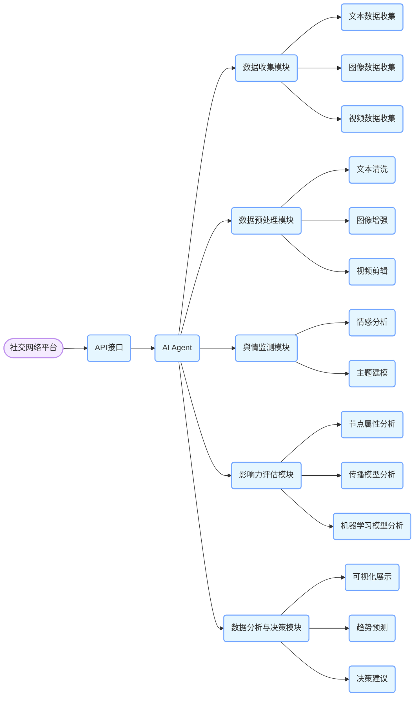

# AI Agent在社交网络分析中的应用：舆情监测与影响力评估

> 关键词：AI Agent、社交网络分析、舆情监测、影响力评估、人工智能

> 摘要：本文聚焦于AI Agent在社交网络分析中的重要应用，即舆情监测与影响力评估。首先介绍了相关背景知识，包括目的、预期读者、文档结构等内容。接着深入剖析了AI Agent、社交网络分析、舆情监测与影响力评估的核心概念及其联系，并给出了相应的原理和架构示意图与流程图。然后详细阐述了核心算法原理，结合Python源代码进行说明，同时介绍了相关数学模型和公式。通过项目实战，展示了AI Agent在舆情监测与影响力评估中的具体实现和代码解读。之后探讨了其实际应用场景，推荐了相关的学习资源、开发工具框架以及论文著作。最后总结了未来发展趋势与挑战，并对常见问题进行了解答，提供了扩展阅读和参考资料，旨在全面展现AI Agent在社交网络分析中舆情监测与影响力评估方面的技术原理、应用价值和发展前景。

## 1. 背景介绍 
### 1.1 目的和范围
随着社交网络的迅猛发展，每天都产生海量的用户数据，这些数据蕴含着丰富的舆情信息和用户影响力信息。本研究的目的在于探讨如何利用AI Agent技术对社交网络数据进行有效分析，实现精准的舆情监测和用户影响力评估。范围涵盖了常见社交网络平台，如微博、微信、Twitter等，以及与之相关的文本、图像、视频等多模态数据。通过对这些数据的分析，旨在为政府、企业和社会组织提供有价值的决策依据，帮助他们及时了解公众情绪和舆论走向，评估关键人物和事件的影响力。

### 1.2 预期读者
本文的预期读者包括对人工智能和社交网络分析感兴趣的技术人员，如数据科学家、算法工程师、软件开发者等；关注舆情动态和市场趋势的政府部门工作人员、企业管理人员和市场营销人员；以及从事相关领域研究的学者和学生。通过阅读本文，他们可以深入了解AI Agent在社交网络分析中的应用原理、方法和实践经验。

### 1.3 文档结构概述
本文将按照以下结构进行阐述：首先介绍相关背景知识，包括目的、预期读者和文档结构等；接着详细讲解AI Agent、社交网络分析、舆情监测与影响力评估的核心概念及其联系，并给出相应的原理和架构示意图与流程图；然后深入探讨核心算法原理，结合Python源代码进行说明，同时介绍相关数学模型和公式；通过项目实战，展示AI Agent在舆情监测与影响力评估中的具体实现和代码解读；之后探讨其实际应用场景；推荐相关的学习资源、开发工具框架以及论文著作；最后总结未来发展趋势与挑战，解答常见问题，并提供扩展阅读和参考资料。

### 1.4 术语表
#### 1.4.1 核心术语定义
- **AI Agent**：人工智能智能体，是一种能够感知环境、做出决策并采取行动以实现特定目标的软件实体。它可以自主地与环境进行交互，根据环境的变化调整自己的行为。
- **社交网络分析**：对社交网络中节点（如用户、组织）和边（如关系、互动）进行分析的方法和技术，旨在揭示社交网络的结构、动态和规律。
- **舆情监测**：对社会舆论的收集、分析和监测，及时了解公众对特定事件、话题或对象的看法、态度和情绪。
- **影响力评估**：对社交网络中节点（如用户、内容）的影响力大小进行评估和量化，确定其在社交网络中的传播能力和作用。

#### 1.4.2 相关概念解释
- **多模态数据**：指包含多种不同类型信息的数据，如文本、图像、音频、视频等。在社交网络分析中，多模态数据可以提供更丰富的信息，有助于更全面地了解用户行为和舆情动态。
- **自然语言处理**：研究如何让计算机理解和处理人类语言的技术，包括文本分类、情感分析、命名实体识别等任务。在舆情监测中，自然语言处理技术可以用于分析用户文本中的情感倾向和语义信息。
- **图神经网络**：一种专门用于处理图结构数据的神经网络模型，能够学习图中节点和边的特征表示。在社交网络分析中，图神经网络可以用于挖掘社交网络的结构信息和节点之间的关系。

#### 1.4.3 缩略词列表
- **NLP**：Natural Language Processing，自然语言处理
- **GNN**：Graph Neural Network，图神经网络
- **API**：Application Programming Interface，应用程序编程接口

## 2. 核心概念与联系 

### 核心概念原理
#### AI Agent
AI Agent是人工智能领域的一个重要概念，它基于智能算法和模型，能够感知环境中的信息，根据预设的目标和规则进行决策，并采取相应的行动。AI Agent可以分为反应式智能体、基于模型的智能体、基于目标的智能体和基于效用的智能体等不同类型。在社交网络分析中，AI Agent可以作为一个自动化的分析工具，通过与社交网络平台的API进行交互，收集和处理社交网络数据。

#### 社交网络分析
社交网络分析是一种研究社交关系和社会结构的方法，它将社交网络抽象为图结构，其中节点表示社交网络中的个体（如用户、组织），边表示节点之间的关系（如关注、好友、互动）。通过对社交网络的图结构进行分析，可以揭示社交网络的拓扑结构、节点的中心性、社区结构等信息，从而深入了解社交网络的动态和规律。

#### 舆情监测
舆情监测是对社会舆论的收集、分析和监测过程，旨在及时了解公众对特定事件、话题或对象的看法、态度和情绪。舆情监测的主要步骤包括数据收集、数据预处理、情感分析、主题建模等。通过对社交网络数据的舆情监测，可以及时发现热点事件和敏感信息，为政府、企业和社会组织提供决策依据。

#### 影响力评估
影响力评估是对社交网络中节点（如用户、内容）的影响力大小进行评估和量化的过程。影响力评估的方法主要包括基于节点属性的方法、基于传播模型的方法和基于机器学习的方法等。通过对社交网络中节点的影响力评估，可以确定关键人物和事件，为市场营销、品牌推广等提供参考。

### 架构的文本示意图
```plaintext
社交网络平台
|
|-- API接口
|
|-- AI Agent
|   |-- 数据收集模块
|   |   |-- 文本数据收集
|   |   |-- 图像数据收集
|   |   |-- 视频数据收集
|   |-- 数据预处理模块
|   |   |-- 文本清洗
|   |   |-- 图像增强
|   |   |-- 视频剪辑
|   |-- 舆情监测模块
|   |   |-- 情感分析
|   |   |-- 主题建模
|   |-- 影响力评估模块
|   |   |-- 节点属性分析
|   |   |-- 传播模型分析
|   |   |-- 机器学习模型分析
|
|-- 数据分析与决策模块
|   |-- 可视化展示
|   |-- 趋势预测
|   |-- 决策建议
```

### Mermaid流程图


## 3. 核心算法原理 & 具体操作步骤 

### 数据收集算法原理
数据收集是舆情监测和影响力评估的基础，其核心目标是从社交网络平台中获取相关的数据。在Python中，可以使用第三方库`requests`来发送HTTP请求，通过社交网络平台的API接口获取数据。以下是一个简单的示例代码，用于从Twitter API获取推文数据：

```python
import requests
import os

# 设置API访问凭证
bearer_token = os.environ.get("BEARER_TOKEN")

# 设置请求URL和参数
url = "https://api.twitter.com/2/tweets/search/recent"
params = {
    "query": "example_query",
    "max_results": 100
}

# 设置请求头
headers = {
    "Authorization": f"Bearer {bearer_token}"
}

# 发送请求
response = requests.get(url, params=params, headers=headers)

# 检查响应状态码
if response.status_code == 200:
    data = response.json()
    print(data)
else:
    print(f"请求失败，状态码：{response.status_code}")
```

### 数据预处理算法原理
数据预处理是为了提高数据的质量和可用性，主要包括文本清洗、图像增强、视频剪辑等操作。在文本清洗中，可以使用正则表达式去除特殊字符、停用词等。以下是一个简单的文本清洗示例代码：

```python
import re
import nltk
from nltk.corpus import stopwords

# 下载停用词
nltk.download('stopwords')

def clean_text(text):
    # 去除特殊字符
    text = re.sub(r'[^\w\s]', '', text)
    # 转换为小写
    text = text.lower()
    # 去除停用词
    stop_words = set(stopwords.words('english'))
    words = text.split()
    filtered_words = [word for word in words if word not in stop_words]
    cleaned_text = ' '.join(filtered_words)
    return cleaned_text

# 示例文本
text = "This is an example text! It contains some special characters."
cleaned_text = clean_text(text)
print(cleaned_text)
```

### 舆情监测算法原理
舆情监测的核心任务是进行情感分析和主题建模。在情感分析中，可以使用机器学习或深度学习模型对文本的情感倾向进行分类。以下是一个使用`TextBlob`库进行情感分析的示例代码：

```python
from textblob import TextBlob

def sentiment_analysis(text):
    blob = TextBlob(text)
    sentiment = blob.sentiment.polarity
    if sentiment > 0:
        return "积极"
    elif sentiment < 0:
        return "消极"
    else:
        return "中性"

# 示例文本
text = "This is a great movie!"
sentiment = sentiment_analysis(text)
print(f"情感倾向：{sentiment}")
```

### 影响力评估算法原理
影响力评估可以使用基于节点属性的方法、基于传播模型的方法或基于机器学习的方法。以下是一个简单的基于节点属性的影响力评估示例代码，通过计算节点的粉丝数、转发数、评论数等指标来评估节点的影响力：

```python
def influence_evaluation(followers, retweets, comments):
    influence_score = followers * 0.5 + retweets * 0.3 + comments * 0.2
    return influence_score

# 示例数据
followers = 1000
retweets = 100
comments = 50
influence_score = influence_evaluation(followers, retweets, comments)
print(f"影响力得分：{influence_score}")
```

### 具体操作步骤
1. **数据收集**：根据社交网络平台的API文档，设置访问凭证和请求参数，发送HTTP请求获取数据。
2. **数据预处理**：对收集到的数据进行清洗、转换等操作，提高数据的质量和可用性。
3. **舆情监测**：使用情感分析和主题建模算法对预处理后的数据进行分析，了解公众的情绪和话题焦点。
4. **影响力评估**：根据节点的属性、传播模型或机器学习模型对节点的影响力进行评估和量化。
5. **数据分析与决策**：对舆情监测和影响力评估的结果进行可视化展示、趋势预测和决策建议，为用户提供有价值的信息。

## 4. 数学模型和公式 & 详细讲解 & 举例说明 

### 情感分析数学模型
在情感分析中，常用的数学模型是朴素贝叶斯分类器。朴素贝叶斯分类器基于贝叶斯定理，通过计算文本属于不同情感类别的概率来进行分类。贝叶斯定理的公式如下：

$$P(c|x)=\frac{P(x|c)P(c)}{P(x)}$$

其中，$P(c|x)$ 表示在给定文本 $x$ 的情况下，文本属于类别 $c$ 的概率；$P(x|c)$ 表示在类别 $c$ 下，文本 $x$ 出现的概率；$P(c)$ 表示类别 $c$ 出现的先验概率；$P(x)$ 表示文本 $x$ 出现的概率。

在朴素贝叶斯分类器中，假设文本中的每个特征（如单词）是相互独立的，即：

$$P(x|c)=\prod_{i=1}^{n}P(x_i|c)$$

其中，$x_i$ 表示文本 $x$ 中的第 $i$ 个特征。

举例说明：假设有一个文本分类任务，需要将文本分为积极、消极和中性三类。已知在积极类别的文本中，单词“great”出现的概率为 $P(\text{great}|\text{positive}) = 0.2$，在消极类别的文本中，单词“great”出现的概率为 $P(\text{great}|\text{negative}) = 0.05$，在中性类别的文本中，单词“great”出现的概率为 $P(\text{great}|\text{neutral}) = 0.1$。假设积极、消极和中性类别的先验概率分别为 $P(\text{positive}) = 0.3$，$P(\text{negative}) = 0.2$，$P(\text{neutral}) = 0.5$。现在有一个文本“this is a great movie”，其中包含单词“great”，则可以计算该文本属于不同类别的概率：

$$P(\text{positive}|\text{great})=\frac{P(\text{great}|\text{positive})P(\text{positive})}{P(\text{great})}$$

$$P(\text{negative}|\text{great})=\frac{P(\text{great}|\text{negative})P(\text{negative})}{P(\text{great})}$$

$$P(\text{neutral}|\text{great})=\frac{P(\text{great}|\text{neutral})P(\text{neutral})}{P(\text{great})}$$

其中，$P(\text{great})$ 可以通过全概率公式计算：

$$P(\text{great}) = P(\text{great}|\text{positive})P(\text{positive}) + P(\text{great}|\text{negative})P(\text{negative}) + P(\text{great}|\text{neutral})P(\text{neutral})$$

计算得到 $P(\text{great}) = 0.2 \times 0.3 + 0.05 \times 0.2 + 0.1 \times 0.5 = 0.12$。

则 $P(\text{positive}|\text{great})=\frac{0.2 \times 0.3}{0.12} = 0.5$，$P(\text{negative}|\text{great})=\frac{0.05 \times 0.2}{0.12} \approx 0.083$，$P(\text{neutral}|\text{great})=\frac{0.1 \times 0.5}{0.12} \approx 0.417$。

因此，该文本属于积极类别的概率最大，分类结果为积极。

### 影响力评估数学模型
在基于节点属性的影响力评估中，可以使用加权求和的方法计算节点的影响力得分。假设节点的影响力得分 $S$ 由粉丝数 $F$、转发数 $R$ 和评论数 $C$ 决定，且它们的权重分别为 $w_F$、$w_R$ 和 $w_C$，则影响力得分的计算公式如下：

$$S = w_FF + w_RR + w_CC$$

其中，$w_F + w_R + w_C = 1$。

举例说明：假设有一个节点，其粉丝数为 $F = 1000$，转发数为 $R = 100$，评论数为 $C = 50$，且权重分别为 $w_F = 0.5$，$w_R = 0.3$，$w_C = 0.2$，则该节点的影响力得分 $S$ 为：

$$S = 0.5 \times 1000 + 0.3 \times 100 + 0.2 \times 50 = 500 + 30 + 10 = 540$$

## 5. 项目实战：代码实际案例和详细解释说明 

### 5.1  开发环境搭建
#### 安装Python
首先，需要安装Python环境。可以从Python官方网站（https://www.python.org/downloads/） 下载适合自己操作系统的Python安装包，并按照安装向导进行安装。

#### 安装依赖库
在项目中，需要使用一些第三方库，如`requests`、`nltk`、`textblob`等。可以使用`pip`命令进行安装：

```bash
pip install requests nltk textblob
```

#### 配置API访问凭证
如果需要从社交网络平台的API获取数据，需要配置相应的访问凭证。例如，从Twitter API获取数据需要申请开发者账号，并获取`Bearer Token`。将`Bearer Token`设置为环境变量，以便在代码中使用：

```bash
export BEARER_TOKEN=your_bearer_token
```

### 5.2  源代码详细实现和代码解读
以下是一个完整的项目实战代码示例，包括数据收集、数据预处理、舆情监测和影响力评估的功能：

```python
import requests
import os
import re
import nltk
from nltk.corpus import stopwords
from textblob import TextBlob

# 下载停用词
nltk.download('stopwords')

# 设置API访问凭证
bearer_token = os.environ.get("BEARER_TOKEN")

# 数据收集函数
def collect_data(query, max_results=100):
    url = "https://api.twitter.com/2/tweets/search/recent"
    params = {
        "query": query,
        "max_results": max_results
    }
    headers = {
        "Authorization": f"Bearer {bearer_token}"
    }
    response = requests.get(url, params=params, headers=headers)
    if response.status_code == 200:
        data = response.json()
        return data
    else:
        print(f"请求失败，状态码：{response.status_code}")
        return None

# 数据预处理函数
def preprocess_text(text):
    text = re.sub(r'[^\w\s]', '', text)
    text = text.lower()
    stop_words = set(stopwords.words('english'))
    words = text.split()
    filtered_words = [word for word in words if word not in stop_words]
    cleaned_text = ' '.join(filtered_words)
    return cleaned_text

# 舆情监测函数
def sentiment_analysis(text):
    blob = TextBlob(text)
    sentiment = blob.sentiment.polarity
    if sentiment > 0:
        return "积极"
    elif sentiment < 0:
        return "消极"
    else:
        return "中性"

# 影响力评估函数
def influence_evaluation(followers, retweets, comments):
    influence_score = followers * 0.5 + retweets * 0.3 + comments * 0.2
    return influence_score

# 主函数
def main():
    # 收集数据
    query = "example_query"
    data = collect_data(query)
    if data:
        tweets = data.get("data", [])
        for tweet in tweets:
            tweet_text = tweet.get("text", "")
            # 数据预处理
            cleaned_text = preprocess_text(tweet_text)
            # 舆情监测
            sentiment = sentiment_analysis(cleaned_text)
            # 影响力评估（假设粉丝数、转发数、评论数已知）
            followers = 1000
            retweets = 100
            comments = 50
            influence_score = influence_evaluation(followers, retweets, comments)
            print(f"推文内容：{tweet_text}")
            print(f"清洗后文本：{cleaned_text}")
            print(f"情感倾向：{sentiment}")
            print(f"影响力得分：{influence_score}")
            print("-" * 50)

if __name__ == "__main__":
    main()
```

### 5.3  代码解读与分析
#### 数据收集部分
`collect_data`函数使用`requests`库发送HTTP请求，从Twitter API获取推文数据。通过设置请求的URL、参数和请求头，实现与Twitter API的交互。如果请求成功，返回JSON格式的数据；否则，打印错误信息并返回`None`。

#### 数据预处理部分
`preprocess_text`函数使用正则表达式去除特殊字符，将文本转换为小写，并去除停用词。通过这些操作，提高文本数据的质量和可用性。

#### 舆情监测部分
`sentiment_analysis`函数使用`TextBlob`库对文本的情感倾向进行分类。根据文本的情感极性，将其分为积极、消极或中性三类。

#### 影响力评估部分
`influence_evaluation`函数根据节点的粉丝数、转发数和评论数，使用加权求和的方法计算节点的影响力得分。

#### 主函数部分
`main`函数是程序的入口点，调用`collect_data`函数收集数据，对每条推文进行数据预处理、舆情监测和影响力评估，并打印结果。

## 6. 实际应用场景 
### 政府部门
政府部门可以利用AI Agent在社交网络分析中的应用进行舆情监测，及时了解公众对政策、事件的看法和态度，以便调整政策、回应公众关切。例如，在重大政策出台后，通过对社交网络数据的分析，了解公众的满意度和意见建议，为政策的优化提供依据。同时，政府部门还可以评估关键人物和事件的影响力，加强对舆论的引导和管理，维护社会稳定。

### 企业
企业可以通过舆情监测了解消费者对产品和服务的评价和需求，及时发现产品的问题和市场趋势，为产品的研发、营销和客户服务提供支持。例如，企业可以分析消费者在社交网络上的反馈，了解产品的优缺点，针对性地进行改进；还可以通过影响力评估，找到有影响力的意见领袖，进行品牌推广和营销活动。

### 社会组织
社会组织可以利用AI Agent在社交网络分析中的应用了解公众对社会问题的关注和态度，为组织的决策和行动提供参考。例如，环保组织可以通过舆情监测了解公众对环境保护问题的关注度和参与意愿，制定相应的宣传和教育策略；慈善组织可以通过影响力评估，找到有影响力的支持者，扩大组织的影响力和募捐渠道。

### 媒体机构
媒体机构可以利用AI Agent在社交网络分析中的应用进行新闻线索挖掘和热点事件追踪。通过对社交网络数据的分析，媒体机构可以及时发现热点话题和事件，为新闻报道提供素材；还可以评估事件的影响力和传播范围，制定相应的报道策略，提高新闻的传播效果和影响力。

## 7. 工具和资源推荐
### 7.1 学习资源推荐
#### 7.1.1 书籍推荐
- 《Python数据分析实战》：介绍了Python在数据分析领域的应用，包括数据收集、清洗、分析和可视化等方面的内容。
- 《自然语言处理入门》：详细讲解了自然语言处理的基本概念、算法和技术，适合初学者入门。
- 《社交网络分析》：系统介绍了社交网络分析的理论、方法和应用，是学习社交网络分析的经典教材。

#### 7.1.2 在线课程
- Coursera上的“Natural Language Processing Specialization”：由顶尖大学的教授授课，涵盖了自然语言处理的各个方面。
- edX上的“Social Network Analysis”：介绍了社交网络分析的基本概念、方法和应用，通过实际案例进行教学。
- 网易云课堂上的“Python数据分析与挖掘实战”：结合实际项目，讲解了Python在数据分析和挖掘中的应用。

#### 7.1.3 技术博客和网站
- Medium：一个汇集了众多技术博客的平台，有很多关于人工智能、数据分析和社交网络分析的优质文章。
- Towards Data Science：专注于数据科学和机器学习领域的技术博客，提供了很多实用的教程和案例。
- 开源中国：国内知名的开源技术社区，有很多关于人工智能和数据分析的技术文章和经验分享。

### 7.2 开发工具框架推荐
#### 7.2.1 IDE和编辑器
- PyCharm：一款专业的Python集成开发环境，提供了丰富的功能和插件，适合Python开发。
- Visual Studio Code：一款轻量级的代码编辑器，支持多种编程语言，有丰富的插件和扩展功能。
- Jupyter Notebook：一个交互式的开发环境，适合进行数据分析和实验，支持Python、R等多种编程语言。

#### 7.2.2 调试和性能分析工具
- PDB：Python自带的调试工具，可以帮助开发者调试代码，定位问题。
- cProfile：Python标准库中的性能分析工具，可以分析代码的运行时间和性能瓶颈。
- Py-Spy：一个轻量级的Python性能分析工具，可以实时监测Python程序的性能。

#### 7.2.3 相关框架和库
- Scikit-learn：一个强大的机器学习库，提供了多种机器学习算法和工具，用于数据挖掘和数据分析。
- TensorFlow：一个开源的深度学习框架，广泛应用于自然语言处理、计算机视觉等领域。
- NetworkX：一个用于创建、操作和研究复杂网络的Python库，提供了丰富的图算法和工具。

### 7.3 相关论文著作推荐
#### 7.3.1 经典论文
- “A Mathematical Theory of Communication” by Claude E. Shannon：信息论的经典论文，奠定了信息论的基础。
- “The Structure of Scientific Revolutions” by Thomas S. Kuhn：科学哲学领域的经典著作，提出了范式转换的概念。
- “The Small World Problem” by Stanley Milgram：社会网络分析领域的经典论文，提出了小世界理论。

#### 7.3.2 最新研究成果
- 关注顶级学术会议和期刊，如NeurIPS（神经信息处理系统大会）、ACL（计算语言学协会年会）、WWW（万维网会议）等，了解人工智能、自然语言处理和社交网络分析领域的最新研究成果。
- 查阅相关的学术数据库，如IEEE Xplore、ACM Digital Library等，获取最新的学术论文和研究报告。

#### 7.3.3 应用案例分析
- 阅读相关的行业报告和案例分析，了解AI Agent在社交网络分析中的实际应用案例和经验教训。例如，Gartner发布的相关技术趋势报告，以及各大咨询公司发布的行业研究报告。

## 8. 总结：未来发展趋势与挑战
### 未来发展趋势
#### 多模态融合分析
未来，AI Agent在社交网络分析中的应用将越来越注重多模态数据的融合分析。除了文本数据，图像、音频、视频等多模态数据将被纳入分析范围，以更全面地了解用户行为和舆情动态。例如，通过分析视频中的表情、语音语调等信息，更准确地判断用户的情感倾向。

#### 实时分析与预测
随着社交网络数据的快速增长和实时性要求的提高，AI Agent将具备更强的实时分析和预测能力。能够及时捕捉热点事件和趋势变化，提前预测舆情发展和用户行为，为用户提供更及时、准确的决策支持。

#### 个性化服务
未来的AI Agent将能够根据用户的需求和偏好，提供个性化的舆情监测和影响力评估服务。例如，为不同行业的用户定制不同的分析指标和报告模板，满足他们的特定需求。

#### 与其他技术的融合
AI Agent将与区块链、物联网等其他技术进行深度融合，拓展其应用场景和功能。例如，利用区块链技术保证社交网络数据的真实性和安全性，利用物联网技术获取更多的环境数据，为舆情监测和影响力评估提供更丰富的信息。

### 挑战
#### 数据隐私和安全
社交网络数据包含大量用户的个人信息和隐私，如何在保证数据安全和隐私的前提下进行分析是一个重要的挑战。需要采取有效的数据加密、访问控制等技术手段，防止数据泄露和滥用。

#### 数据质量和噪声处理
社交网络数据存在大量的噪声和不规范信息，如虚假信息、广告信息等，如何提高数据质量和处理噪声是一个关键问题。需要开发更有效的数据清洗和预处理算法，去除噪声信息，提高分析结果的准确性。

#### 算法的可解释性
AI Agent中使用的一些机器学习和深度学习算法具有较强的黑盒性，其决策过程和结果难以解释。在舆情监测和影响力评估等应用场景中，需要算法具有较好的可解释性，以便用户理解和信任分析结果。

#### 计算资源和效率
随着社交网络数据量的不断增长，对计算资源和效率的要求也越来越高。如何在有限的计算资源下，实现高效的数据分析和处理是一个挑战。需要开发更高效的算法和并行计算技术，提高计算效率。

## 9. 附录：常见问题与解答
### 问题1：如何获取社交网络平台的API访问权限？
不同的社交网络平台有不同的API申请流程。一般来说，需要先注册开发者账号，然后按照平台的要求填写相关信息，申请API访问权限。有些平台可能需要提供应用的使用场景、开发计划等信息，审核通过后才能获取API访问凭证。

### 问题2：数据预处理的步骤是否可以根据具体情况进行调整？
是的，数据预处理的步骤可以根据具体情况进行调整。例如，如果数据中存在大量的错别字和语法错误，可以使用拼写检查和语法纠正工具进行处理；如果数据中存在重复信息，可以使用去重算法进行处理。根据数据的特点和分析的需求，选择合适的数据预处理方法。

### 问题3：如何选择合适的情感分析模型？
选择合适的情感分析模型需要考虑多个因素，如数据量、数据类型、分析精度要求等。如果数据量较小，可以选择基于规则的情感分析模型；如果数据量较大，可以选择基于机器学习或深度学习的情感分析模型。同时，还需要根据数据的类型选择合适的模型，如对于文本数据，可以选择基于自然语言处理的模型；对于图像数据，可以选择基于计算机视觉的模型。

### 问题4：影响力评估的指标是否可以根据不同的应用场景进行调整？
是的，影响力评估的指标可以根据不同的应用场景进行调整。例如，在市场营销场景中，可以重点关注节点的粉丝数、转发数、点赞数等指标；在学术研究场景中，可以重点关注节点的引用数、论文发表数量等指标。根据不同的应用场景和分析目的，选择合适的影响力评估指标。

## 10. 扩展阅读 & 参考资料
### 扩展阅读
- 《大数据时代》：介绍了大数据的概念、技术和应用，帮助读者了解大数据时代的发展趋势和挑战。
- 《人工智能时代》：探讨了人工智能的发展现状和未来趋势，以及对社会、经济和生活的影响。
- 《社交网络的兴起》：讲述了社交网络的发展历程和演变，分析了社交网络对人际关系和社会结构的影响。

### 参考资料
- 社交网络平台的官方文档和API文档，如Twitter API文档、微博开放平台文档等。
- 相关的学术论文和研究报告，如ACM、IEEE等学术组织发布的论文。
- 开源代码库和技术论坛，如GitHub、Stack Overflow等，获取相关的代码实现和技术交流。