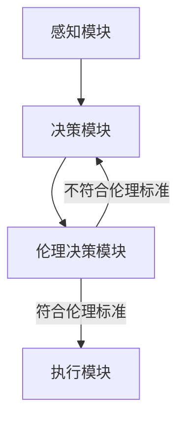

# AI Agent的伦理决策框架：在智能中植入道德考量

> 关键词：AI Agent、伦理决策框架、道德考量、人工智能伦理、智能体、决策机制、价值对齐

> 摘要：本文聚焦于AI Agent的伦理决策框架，旨在探讨如何在智能系统中融入道德考量。随着人工智能技术的飞速发展，AI Agent在各个领域的应用日益广泛，其决策行为对社会和人类产生的影响也愈发显著。因此，建立有效的伦理决策框架显得尤为重要。文章首先介绍了相关背景，包括目的、预期读者等内容；接着阐述了AI Agent及伦理决策的核心概念与联系；深入探讨了核心算法原理和具体操作步骤，并结合数学模型和公式进行详细讲解；通过项目实战案例展示了代码实现和分析；分析了实际应用场景；推荐了相关的工具和资源；最后总结了未来发展趋势与挑战，并提供了常见问题解答和扩展阅读参考资料，以期为推动AI Agent的伦理决策研究和实践提供全面而深入的参考。

## 1. 背景介绍 
### 1.1 目的和范围
随着人工智能技术的不断进步，AI Agent在诸多领域得到了广泛应用，如自动驾驶、医疗诊断、金融服务等。然而，这些智能体的决策行为可能会对人类的生活、安全和价值观产生重大影响。本文章的目的在于探讨如何构建一个有效的伦理决策框架，使AI Agent在做出决策时能够考虑到道德因素，确保其行为符合人类的伦理标准。

本文章的范围涵盖了AI Agent伦理决策框架的基本概念、核心算法、数学模型、实际应用案例以及相关的工具和资源等方面。通过全面深入的探讨，为研究者、开发者和决策者提供一个系统的参考，以促进AI Agent伦理决策的研究和实践。

### 1.2 预期读者
本文的预期读者包括但不限于人工智能领域的研究者、开发者、伦理学家、政策制定者以及对AI Agent伦理问题感兴趣的普通读者。对于研究者，本文提供了深入的理论探讨和最新的研究成果；对于开发者，本文给出了具体的算法实现和代码示例；对于伦理学家和政策制定者，本文有助于他们更好地理解AI Agent伦理决策的复杂性，从而制定相应的伦理准则和政策；对于普通读者，本文以通俗易懂的语言介绍了相关概念和实际应用场景，使他们能够了解AI Agent伦理决策的重要性。

### 1.3 文档结构概述
本文的结构如下：首先介绍背景信息，包括目的、预期读者和文档结构概述等；接着阐述AI Agent及伦理决策的核心概念与联系，通过文本示意图和Mermaid流程图进行说明；然后深入探讨核心算法原理和具体操作步骤，使用Python源代码详细阐述；结合数学模型和公式进行详细讲解，并举例说明；通过项目实战案例展示代码实现和详细解释；分析AI Agent伦理决策框架的实际应用场景；推荐相关的工具和资源，包括学习资源、开发工具框架和相关论文著作；最后总结未来发展趋势与挑战，提供常见问题解答和扩展阅读参考资料。

### 1.4 术语表
#### 1.4.1 核心术语定义
- **AI Agent（人工智能智能体）**：能够感知环境、进行推理和学习，并通过执行动作与环境进行交互的智能实体。
- **伦理决策框架**：用于指导AI Agent在面对各种决策场景时，考虑道德因素并做出符合伦理标准决策的一套方法和规则。
- **道德考量**：在决策过程中，对行为的道德性进行评估和权衡，考虑行为对不同利益相关者的影响。
- **价值对齐**：使AI Agent的目标和行为与人类的价值观相一致，确保其决策符合人类的道德和伦理要求。

#### 1.4.2 相关概念解释
- **功利主义**：一种道德哲学理论，认为行为的正确性取决于其是否能够产生最大的总体幸福或利益。在AI Agent的伦理决策中，功利主义可以作为一种决策原则，即选择能够带来最大社会福利的行为。
- **义务论**：强调行为的道德性基于行为本身的性质和义务，而不是其结果。在AI Agent的伦理决策中，义务论可以要求智能体遵循某些固定的道德规则，无论结果如何。
- **机器学习**：AI Agent实现智能的一种重要方法，通过从数据中学习模式和规律，以提高其决策能力。

#### 1.4.3 缩略词列表
- **AI**：Artificial Intelligence（人工智能）
- **ML**：Machine Learning（机器学习）
- **RL**：Reinforcement Learning（强化学习）

## 2. 核心概念与联系 

### 2.1 AI Agent的基本概念
AI Agent是一种能够感知环境、进行推理和学习，并通过执行动作与环境进行交互的智能实体。它通常由感知模块、决策模块和执行模块组成。感知模块负责收集环境信息，决策模块根据感知到的信息和预设的目标进行决策，执行模块则将决策转化为具体的动作。

### 2.2 伦理决策的基本概念
伦理决策是指在决策过程中考虑道德因素，评估行为的道德性，并选择符合伦理标准的行为。伦理决策通常涉及到对不同利益相关者的利益、权利和价值观的权衡。在AI Agent的背景下，伦理决策意味着智能体在做出决策时要考虑到其行为对人类社会的影响，遵循人类的道德和伦理准则。

### 2.3 核心概念原理和架构的文本示意图
AI Agent的伦理决策框架可以看作是在传统AI Agent架构的基础上，增加了一个伦理决策模块。该模块负责对决策进行伦理评估，并根据评估结果对决策进行调整。具体架构如下：

感知模块收集环境信息，将其传递给决策模块。决策模块根据预设的目标和算法进行初步决策。然后，初步决策被传递给伦理决策模块。伦理决策模块根据预先定义的伦理准则和道德考量对初步决策进行评估。如果初步决策符合伦理标准，则将其传递给执行模块执行；如果不符合伦理标准，则伦理决策模块会对决策进行调整，直到得到一个符合伦理标准的决策，再将其传递给执行模块执行。

### 2.4 Mermaid流程图


## 3. 核心算法原理 & 具体操作步骤 

### 3.1 核心算法原理
在AI Agent的伦理决策中，我们可以采用基于规则的方法和基于学习的方法相结合的方式。基于规则的方法是指预先定义一系列的伦理规则，AI Agent在决策时直接根据这些规则进行伦理评估。基于学习的方法则是通过机器学习算法，让AI Agent从大量的伦理案例中学习到伦理决策的模式和规律。

以下是一个简单的基于规则的伦理决策算法原理：

1. 定义伦理规则集合 $R = \{r_1, r_2, \cdots, r_n\}$，其中每个规则 $r_i$ 表示一个伦理约束条件。
2. 对于决策模块生成的初步决策 $d$，检查 $d$ 是否满足所有的伦理规则 $r_i$。
3. 如果 $d$ 满足所有的伦理规则，则 $d$ 是一个符合伦理标准的决策；否则，对 $d$ 进行调整，直到满足所有的伦理规则。

### 3.2 具体操作步骤
以下是使用Python实现基于规则的伦理决策算法的具体操作步骤：

```python
# 定义伦理规则集合
ethical_rules = [
    # 规则1：决策不能对人类造成直接伤害
    lambda decision: decision.get('harm_to_humans', 0) == 0,
    # 规则2：决策要公平对待所有利益相关者
    lambda decision: decision.get('fairness', 1) == 1
]

def is_ethical(decision):
    """
    检查决策是否符合伦理规则
    :param decision: 决策字典
    :return: True 或 False
    """
    for rule in ethical_rules:
        if not rule(decision):
            return False
    return True

def adjust_decision(decision):
    """
    调整决策以符合伦理规则
    :param decision: 决策字典
    :return: 调整后的决策字典
    """
    while not is_ethical(decision):
        # 简单示例：减少对人类的伤害
        if decision.get('harm_to_humans', 0) > 0:
            decision['harm_to_humans'] -= 1
        # 简单示例：提高公平性
        if decision.get('fairness', 0) < 1:
            decision['fairness'] += 0.1
    return decision

# 示例决策
initial_decision = {
    'harm_to_humans': 1,
    'fairness': 0.5
}

# 检查并调整决策
ethical_decision = adjust_decision(initial_decision)
print("调整后的符合伦理的决策:", ethical_decision)
```

### 3.3 代码解释
- `ethical_rules` 列表中定义了两个伦理规则，分别是决策不能对人类造成直接伤害和决策要公平对待所有利益相关者。
- `is_ethical` 函数用于检查决策是否符合所有的伦理规则。
- `adjust_decision` 函数用于调整决策，直到决策符合所有的伦理规则。
- 最后，我们创建了一个示例决策 `initial_decision`，并调用 `adjust_decision` 函数对其进行调整，得到符合伦理的决策 `ethical_decision`。

## 4. 数学模型和公式 & 详细讲解 & 举例说明 

### 4.1 数学模型
在AI Agent的伦理决策中，我们可以使用多目标优化模型来描述伦理决策问题。假设我们有 $m$ 个伦理目标 $G = \{g_1, g_2, \cdots, g_m\}$，每个目标 $g_i$ 都有一个对应的权重 $w_i$，表示该目标的重要性。决策 $d$ 对每个目标 $g_i$ 的实现程度可以用一个效用函数 $u_i(d)$ 来表示。

则决策 $d$ 的综合效用 $U(d)$ 可以表示为：

$$U(d)=\sum_{i = 1}^{m}w_iu_i(d)$$

我们的目标是找到一个决策 $d^*$，使得综合效用 $U(d^*)$ 最大，即：

$$d^*=\arg\max_{d}U(d)=\arg\max_{d}\sum_{i = 1}^{m}w_iu_i(d)$$

### 4.2 详细讲解
- **伦理目标 $G$**：伦理目标可以包括公平性、无害性、尊重隐私等。每个目标都代表了一个伦理维度，我们希望决策在这些维度上都能达到较好的效果。
- **权重 $w_i$**：权重 $w_i$ 表示每个伦理目标的相对重要性。不同的应用场景和利益相关者可能会对不同的伦理目标赋予不同的权重。例如，在医疗领域，无害性可能会被赋予更高的权重；在社会福利分配领域，公平性可能会被赋予更高的权重。
- **效用函数 $u_i(d)$**：效用函数 $u_i(d)$ 用于衡量决策 $d$ 对目标 $g_i$ 的实现程度。效用函数的具体形式可以根据不同的伦理目标进行定义。例如，对于公平性目标，效用函数可以定义为决策结果在不同利益相关者之间的分配均匀程度；对于无害性目标，效用函数可以定义为决策对人类造成的伤害程度的倒数。

### 4.3 举例说明
假设我们有两个伦理目标：公平性 $g_1$ 和无害性 $g_2$，对应的权重分别为 $w_1 = 0.6$ 和 $w_2 = 0.4$。决策 $d$ 对公平性目标的效用函数为 $u_1(d) = 0.8$，对无害性目标的效用函数为 $u_2(d) = 0.9$。

则决策 $d$ 的综合效用为：

$$U(d)=w_1u_1(d)+w_2u_2(d)=0.6\times0.8 + 0.4\times0.9 = 0.48 + 0.36 = 0.84$$

如果我们有另一个决策 $d'$，其对公平性目标的效用函数为 $u_1(d') = 0.7$，对无害性目标的效用函数为 $u_2(d') = 0.95$。

则决策 $d'$ 的综合效用为：

$$U(d')=w_1u_1(d')+w_2u_2(d')=0.6\times0.7 + 0.4\times0.95 = 0.42 + 0.38 = 0.8$$

由于 $U(d) > U(d')$，所以决策 $d$ 更符合伦理标准。

## 5. 项目实战：代码实际案例和详细解释说明 

### 5.1  开发环境搭建
在进行AI Agent伦理决策框架的项目实战之前，我们需要搭建相应的开发环境。以下是具体的步骤：

1. **安装Python**：建议使用Python 3.7及以上版本。可以从Python官方网站（https://www.python.org/downloads/） 下载并安装。
2. **安装开发工具**：可以选择使用PyCharm、VS Code等集成开发环境（IDE），方便代码的编写、调试和运行。
3. **安装必要的库**：在本项目中，我们主要使用Python的基本库，不需要额外安装其他复杂的库。

### 5.2  源代码详细实现和代码解读
以下是一个更完整的AI Agent伦理决策框架的Python代码示例：

```python
# 定义伦理目标和权重
ethical_goals = {
    'fairness': 0.6,
    'harmlessness': 0.4
}

# 定义效用函数
def fairness_utility(decision):
    """
    公平性效用函数
    :param decision: 决策字典
    :return: 公平性效用值
    """
    # 简单示例：假设公平性由一个公平系数表示，范围从 0 到 1
    return decision.get('fairness_coefficient', 0)

def harmlessness_utility(decision):
    """
    无害性效用函数
    :param decision: 决策字典
    :return: 无害性效用值
    """
    # 简单示例：假设无害性由一个伤害系数表示，范围从 0 到 1，值越小越无害
    harm_coefficient = decision.get('harm_coefficient', 1)
    return 1 - harm_coefficient

# 定义综合效用函数
def comprehensive_utility(decision):
    """
    计算决策的综合效用
    :param decision: 决策字典
    :return: 综合效用值
    """
    total_utility = 0
    for goal, weight in ethical_goals.items():
        if goal == 'fairness':
            utility = fairness_utility(decision)
        elif goal == 'harmlessness':
            utility = harmlessness_utility(decision)
        total_utility += weight * utility
    return total_utility

# 定义决策生成函数（简单示例）
def generate_decision():
    """
    生成一个随机决策
    :return: 决策字典
    """
    import random
    return {
        'fairness_coefficient': random.uniform(0, 1),
        'harm_coefficient': random.uniform(0, 1)
    }

# 定义伦理决策函数
def ethical_decision_making():
    """
    进行伦理决策
    :return: 符合伦理标准的决策字典
    """
    best_decision = None
    best_utility = -float('inf')
    # 生成多个决策并选择综合效用最大的决策
    for _ in range(10):
        decision = generate_decision()
        utility = comprehensive_utility(decision)
        if utility > best_utility:
            best_utility = utility
            best_decision = decision
    return best_decision

# 执行伦理决策
final_decision = ethical_decision_making()
print("最终符合伦理标准的决策:", final_decision)
```

### 5.3  代码解读与分析
- **伦理目标和权重**：`ethical_goals` 字典定义了两个伦理目标：公平性和无害性，并为每个目标分配了相应的权重。
- **效用函数**：`fairness_utility` 和 `harmlessness_utility` 分别是公平性和无害性的效用函数，用于衡量决策对每个伦理目标的实现程度。
- **综合效用函数**：`comprehensive_utility` 函数根据伦理目标的权重和效用函数，计算决策的综合效用。
- **决策生成函数**：`generate_decision` 函数用于生成随机决策，这里只是一个简单示例，实际应用中可能需要根据具体问题进行决策生成。
- **伦理决策函数**：`ethical_decision_making` 函数生成多个决策，并选择综合效用最大的决策作为最终的符合伦理标准的决策。
- **执行伦理决策**：最后，我们调用 `ethical_decision_making` 函数进行伦理决策，并打印出最终的决策结果。

## 6. 实际应用场景 
### 6.1 自动驾驶领域
在自动驾驶领域，AI Agent（自动驾驶汽车）需要在各种复杂的交通场景中做出决策。例如，当遇到突然出现的行人时，自动驾驶汽车需要决定是紧急刹车、避让还是采取其他措施。在这个过程中，伦理决策框架就显得尤为重要。

伦理决策框架可以帮助自动驾驶汽车在决策时考虑到行人的生命安全、乘客的安全以及其他道路使用者的权益。例如，根据功利主义原则，自动驾驶汽车应该选择能够最小化总体伤害的决策；根据义务论原则，自动驾驶汽车应该遵循交通规则和道德准则，不故意伤害行人。

### 6.2 医疗诊断领域
在医疗诊断领域，AI Agent（医疗诊断系统）可以辅助医生进行疾病诊断和治疗方案推荐。在这个过程中，伦理决策框架可以确保医疗诊断系统的决策符合医学伦理和患者的利益。

例如，医疗诊断系统在推荐治疗方案时，需要考虑到治疗方案的有效性、安全性、患者的意愿和经济负担等因素。伦理决策框架可以帮助医疗诊断系统在这些因素之间进行权衡，选择最符合患者利益的治疗方案。

### 6.3 金融服务领域
在金融服务领域，AI Agent（金融智能体）可以用于风险评估、投资决策等。伦理决策框架可以确保金融智能体的决策符合公平、公正、透明的原则，保护投资者的利益。

例如，金融智能体在进行风险评估时，需要考虑到不同投资者的风险承受能力和投资目标，避免对某些投资者造成不公平的影响。在投资决策方面，金融智能体需要遵守法律法规和道德准则，不进行欺诈和操纵市场的行为。

## 7. 工具和资源推荐
### 7.1 学习资源推荐
#### 7.1.1 书籍推荐
- 《人工智能伦理》：本书全面介绍了人工智能领域的伦理问题，包括伦理原则、伦理决策方法、伦理挑战等内容，是学习人工智能伦理的经典书籍。
- 《道德机器：如何让机器人明辨是非》：通过丰富的案例和深入的分析，探讨了AI Agent伦理决策的复杂性和挑战，以及如何在智能系统中植入道德考量。

#### 7.1.2 在线课程
- Coursera上的“Artificial Intelligence Ethics”：由知名学者授课，系统地介绍了人工智能伦理的基本概念、理论和实践方法。
- edX上的“Ethics and Law in the Age of Artificial Intelligence”：该课程结合了法律和伦理的视角，深入探讨了人工智能技术带来的伦理和法律问题。

#### 7.1.3 技术博客和网站
- AI Ethics Journal：一个专注于人工智能伦理研究的学术期刊网站，提供了最新的研究成果和学术论文。
- Medium上的AI Ethics相关博客：许多人工智能领域的专家和研究者在Medium上分享了关于AI Agent伦理决策的见解和经验。

### 7.2 开发工具框架推荐
#### 7.2.1 IDE和编辑器
- PyCharm：一款专业的Python集成开发环境，提供了丰富的代码编辑、调试和分析功能，适合开发AI Agent伦理决策框架的Python代码。
- VS Code：一款轻量级的代码编辑器，支持多种编程语言和插件扩展，具有良好的用户体验和开发效率。

#### 7.2.2 调试和性能分析工具
- PDB：Python自带的调试工具，可以帮助开发者逐行调试代码，查找和解决问题。
- cProfile：Python的性能分析工具，可以帮助开发者分析代码的性能瓶颈，优化代码效率。

#### 7.2.3 相关框架和库
- TensorFlow：一个开源的机器学习框架，提供了丰富的深度学习模型和工具，可用于实现AI Agent的决策模块。
- PyTorch：另一个流行的深度学习框架，具有动态计算图和简洁的API，适合快速开发和实验AI Agent的伦理决策算法。

### 7.3 相关论文著作推荐
#### 7.3.1 经典论文
- “The Moral Machine Experiment”：该论文通过大规模的在线实验，探讨了不同文化背景下人们对自动驾驶汽车伦理决策的偏好和态度。
- “Artificial Intelligence and the End of the Human Era?”：这篇论文深入分析了人工智能技术对人类社会和伦理的影响，引发了广泛的讨论和思考。

#### 7.3.2 最新研究成果
- 关注顶级学术会议如NeurIPS、ICML、AAAI等上关于AI Agent伦理决策的最新研究论文，了解该领域的前沿动态和研究进展。
- 查阅知名学术期刊如Journal of Artificial Intelligence Research、Artificial Intelligence等上的相关研究成果。

#### 7.3.3 应用案例分析
- 一些科技公司和研究机构会发布关于AI Agent伦理决策的应用案例分析报告，如Google、OpenAI等。这些报告可以帮助我们更好地理解AI Agent伦理决策在实际应用中的挑战和解决方案。

## 8. 总结：未来发展趋势与挑战
### 8.1 未来发展趋势
- **多学科融合**：AI Agent的伦理决策问题涉及到人工智能、伦理学、哲学、法学等多个学科领域。未来，跨学科的研究和合作将成为发展的趋势，通过多学科的融合，可以更全面、深入地解决AI Agent的伦理决策问题。
- **价值对齐技术的发展**：如何使AI Agent的目标和行为与人类的价值观相一致是一个关键问题。未来，价值对齐技术将得到进一步的发展，包括基于学习的价值对齐方法、可解释的价值对齐模型等。
- **伦理决策框架的标准化**：随着AI Agent在各个领域的广泛应用，制定统一的伦理决策框架标准将变得越来越重要。未来，可能会出现国际或行业性的伦理决策框架标准，以确保AI Agent的决策行为符合普遍认可的伦理准则。

### 8.2 挑战
- **伦理标准的多样性**：不同的文化、宗教和社会群体可能有不同的伦理标准和价值观。如何在AI Agent的伦理决策中考虑到这种多样性，是一个巨大的挑战。
- **可解释性问题**：AI Agent的决策过程往往是复杂的、难以理解的。在伦理决策中，需要确保决策的可解释性，以便人类能够理解和信任AI Agent的决策。然而，目前的AI技术在可解释性方面还存在很大的不足。
- **技术的局限性**：现有的AI技术在处理复杂的伦理决策问题时还存在一定的局限性。例如，AI Agent可能无法准确地理解和处理人类的情感、意图和价值观等复杂信息。

## 9. 附录：常见问题与解答
### 9.1 如何确保AI Agent的伦理决策框架是有效的？
确保AI Agent的伦理决策框架有效需要从多个方面入手。首先，要制定明确、合理的伦理规则和目标，并根据不同的应用场景进行调整。其次，要对伦理决策框架进行严格的测试和验证，包括模拟实验、实际案例分析等。此外，还需要不断地对伦理决策框架进行更新和优化，以适应不断变化的伦理需求和技术发展。

### 9.2 AI Agent的伦理决策框架会限制其智能和创新能力吗？
在一定程度上，伦理决策框架会对AI Agent的行为进行约束，但这并不意味着会限制其智能和创新能力。相反，合理的伦理决策框架可以引导AI Agent做出更符合人类利益和社会价值观的决策，从而促进其在有益的方向上进行创新。例如，在医疗领域，伦理决策框架可以确保医疗诊断系统的创新是基于患者的利益和医学伦理的，而不是为了追求技术的进步而忽视患者的安全和权益。

### 9.3 如何解决不同文化背景下的伦理标准差异问题？
解决不同文化背景下的伦理标准差异问题需要采用多方面的方法。一方面，可以通过跨文化的研究和交流，了解不同文化背景下的伦理价值观，寻找共性和共识。另一方面，可以设计灵活的伦理决策框架，允许根据不同的文化背景进行定制和调整。例如，在自动驾驶领域，可以根据不同国家和地区的交通法规和文化习惯，对自动驾驶汽车的伦理决策规则进行调整。

## 10. 扩展阅读 & 参考资料
### 10.1 扩展阅读
- 《奇点临近》：探讨了人工智能技术的发展对人类社会和未来的影响，引发了对人工智能伦理和人类未来的深入思考。
- 《人类简史：从动物到上帝》：从人类历史的角度出发，分析了人类的价值观和伦理观念的形成和演变，为理解AI Agent的伦理决策提供了更广阔的视角。

### 10.2 参考资料
- 相关学术期刊和会议论文，如Journal of Artificial Intelligence Research、NeurIPS、ICML等。
- 政府和国际组织发布的关于人工智能伦理的政策文件和报告，如欧盟的《通用数据保护条例》（GDPR）、联合国教科文组织的《人工智能伦理建议书》等。
- 科技公司和研究机构的官方网站和博客，如Google AI Blog、OpenAI Blog等。