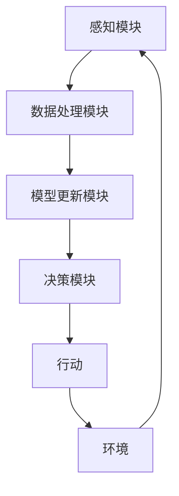

# AI Agent的增量学习与持续适应

> 关键词：AI Agent、增量学习、持续适应、机器学习、智能系统、数据更新、模型进化

> 摘要：本文聚焦于AI Agent的增量学习与持续适应这一前沿领域。随着人工智能应用场景的不断拓展，AI Agent需要在动态变化的环境中持续学习和适应新数据，以保持良好的性能。文章深入探讨了AI Agent增量学习与持续适应的核心概念、算法原理、数学模型，并通过项目实战展示具体实现方法。同时，分析了其实际应用场景，推荐了相关的学习资源、开发工具和论文著作。最后总结了未来发展趋势与挑战，为读者全面了解和研究该领域提供了系统而深入的参考。

## 1. 背景介绍 
### 1.1 目的和范围
本文章的目的在于全面而深入地介绍AI Agent的增量学习与持续适应的相关知识和技术。范围涵盖从基本概念的讲解、核心算法原理的剖析、数学模型的推导，到通过实际项目案例展示如何实现AI Agent的增量学习与持续适应。同时，还将探讨其在不同领域的实际应用场景，为研究人员、开发者和相关从业者提供一个系统的知识体系和实践指导。

### 1.2 预期读者
本文预期读者包括但不限于人工智能领域的研究人员、机器学习工程师、软件开发者、对AI Agent技术感兴趣的学生以及相关领域的从业者。无论是希望深入了解增量学习与持续适应原理的理论研究者，还是想要在实际项目中应用这些技术的开发者，都能从本文中获得有价值的信息。

### 1.3 文档结构概述
本文将按照以下结构进行组织：首先介绍背景知识，包括目的、预期读者和文档结构概述等内容；接着阐述AI Agent增量学习与持续适应的核心概念与联系，通过文本示意图和Mermaid流程图进行清晰展示；然后详细讲解核心算法原理和具体操作步骤，结合Python源代码进行说明；再介绍相关的数学模型和公式，并举例说明；之后通过项目实战展示代码实现和详细解释；随后分析实际应用场景；推荐相关的工具和资源；最后总结未来发展趋势与挑战，并提供常见问题解答和扩展阅读参考资料。

### 1.4 术语表
#### 1.4.1 核心术语定义
- **AI Agent（人工智能智能体）**：是一种能够感知环境、做出决策并采取行动以实现特定目标的智能实体。它可以是软件程序、机器人或其他智能设备。
- **增量学习（Incremental Learning）**：指的是系统在运行过程中，不断地从新的数据中学习新知识，而不需要重新训练整个模型。增量学习可以使模型在不丢失已有知识的前提下，逐步适应新的数据和环境变化。
- **持续适应（Continuous Adaptation）**：强调AI Agent在动态变化的环境中，能够持续地调整自身的行为和决策策略，以保持良好的性能和适应性。持续适应是一个长期的、不断迭代的过程。

#### 1.4.2 相关概念解释
- **机器学习（Machine Learning）**：是一门多领域交叉学科，涉及概率论、统计学、逼近论、凸分析、算法复杂度理论等多门学科。它专门研究计算机怎样模拟或实现人类的学习行为，以获取新的知识或技能，重新组织已有的知识结构使之不断改善自身的性能。
- **模型（Model）**：在机器学习中，模型是对数据和任务之间关系的一种数学表示。通过训练数据对模型进行优化，使其能够对未知数据进行预测或分类。
- **数据漂移（Data Drift）**：指的是数据的分布随时间发生变化的现象。在实际应用中，数据漂移可能会导致模型性能下降，因此需要增量学习和持续适应技术来应对。

#### 1.4.3 缩略词列表
- **ML（Machine Learning）**：机器学习
- **DL（Deep Learning）**：深度学习
- **RL（Reinforcement Learning）**：强化学习

## 2. 核心概念与联系 

### 核心概念原理
AI Agent的增量学习与持续适应是为了使智能体能够在不断变化的环境中持续保持良好的性能。增量学习的核心思想是在已有模型的基础上，利用新的数据对模型进行更新和优化，而不需要重新训练整个模型。这样可以节省计算资源和时间，同时避免了灾难性遗忘问题。

持续适应则是一个更广泛的概念，它不仅包括增量学习，还包括对环境变化的感知、决策策略的调整等方面。AI Agent需要能够实时感知环境的变化，并根据变化调整自己的行为和决策，以实现最优的性能。

### 架构的文本示意图
AI Agent的增量学习与持续适应架构主要包括以下几个部分：
1. **感知模块**：负责收集环境中的数据，包括传感器数据、用户输入等。
2. **数据处理模块**：对感知模块收集到的数据进行预处理，如数据清洗、特征提取等。
3. **模型更新模块**：根据新的数据对已有模型进行更新和优化，采用增量学习算法实现。
4. **决策模块**：根据更新后的模型和环境信息，做出决策并采取行动。
5. **反馈模块**：将决策结果反馈给感知模块，形成一个闭环系统，实现持续适应。

### Mermaid流程图


## 3. 核心算法原理 & 具体操作步骤 

### 核心算法原理
增量学习的算法有很多种，这里以在线梯度下降算法为例进行讲解。在线梯度下降算法是一种简单而有效的增量学习算法，它可以在每次接收到新的数据时，对模型的参数进行更新。

假设我们有一个线性回归模型 $y = \theta^T x$，其中 $\theta$ 是模型的参数，$x$ 是输入特征向量，$y$ 是输出标签。我们的目标是最小化损失函数 $L(\theta) = \frac{1}{2}(y - \theta^T x)^2$。

在线梯度下降算法的更新公式为：
$\theta = \theta - \alpha \nabla L(\theta)$
其中 $\alpha$ 是学习率，$\nabla L(\theta)$ 是损失函数关于 $\theta$ 的梯度。

### 具体操作步骤
1. 初始化模型参数 $\theta$。
2. 接收新的数据 $(x, y)$。
3. 计算损失函数的梯度 $\nabla L(\theta)$。
4. 根据更新公式更新模型参数 $\theta$。
5. 重复步骤2-4，直到所有的数据都被处理完。

### Python源代码实现
```python
import numpy as np

# 初始化模型参数
theta = np.zeros(2)
# 学习率
alpha = 0.01

# 模拟数据
data = [(np.array([1, 2]), 5), (np.array([2, 3]), 8), (np.array([3, 4]), 11)]

# 在线梯度下降算法
for x, y in data:
    # 计算预测值
    y_pred = np.dot(theta, x)
    # 计算损失函数的梯度
    gradient = (y_pred - y) * x
    # 更新模型参数
    theta = theta - alpha * gradient

print("最终模型参数:", theta)
```

## 4. 数学模型和公式 & 详细讲解 & 举例说明 

### 数学模型
在增量学习中，我们通常使用概率模型来描述数据和模型之间的关系。以朴素贝叶斯分类器为例，它的数学模型基于贝叶斯定理：
$P(c|x) = \frac{P(x|c)P(c)}{P(x)}$
其中 $P(c|x)$ 是给定输入特征 $x$ 时，类别 $c$ 的后验概率；$P(x|c)$ 是类别 $c$ 下特征 $x$ 的似然概率；$P(c)$ 是类别 $c$ 的先验概率；$P(x)$ 是特征 $x$ 的边缘概率。

### 详细讲解
在增量学习中，我们的目标是在新的数据到来时，更新模型的参数，使得后验概率 $P(c|x)$ 更加准确。对于朴素贝叶斯分类器，我们可以通过更新似然概率 $P(x|c)$ 和先验概率 $P(c)$ 来实现模型的更新。

### 举例说明
假设我们有一个二分类问题，类别 $c \in \{0, 1\}$，特征 $x$ 是一个一维向量。我们已经有了一些训练数据，并且计算出了先验概率 $P(c=0) = 0.6$，$P(c=1) = 0.4$，以及似然概率 $P(x|c=0)$ 和 $P(x|c=1)$。

现在我们接收到一个新的数据点 $(x_{new}, c_{new})$，我们可以根据这个新的数据点更新先验概率和似然概率：
$P(c=0)_{new} = \frac{n_0 + \delta_{c_{new}=0}}{n + 1}$
$P(c=1)_{new} = \frac{n_1 + \delta_{c_{new}=1}}{n + 1}$
其中 $n_0$ 和 $n_1$ 分别是类别 0 和类别 1 的样本数量，$n = n_0 + n_1$，$\delta_{c_{new}=i}$ 是一个指示函数，如果 $c_{new} = i$ 则为 1，否则为 0。

对于似然概率 $P(x|c)$，我们可以使用增量更新的方法，例如使用加权平均的方法来更新。

## 5. 项目实战：代码实际案例和详细解释说明 

### 5.1  开发环境搭建
- **操作系统**：Windows 10 或 Ubuntu 20.04
- **Python版本**：Python 3.8 或更高版本
- **相关库**：NumPy、Scikit-learn、TensorFlow 或 PyTorch

安装相关库的命令如下：
```bash
pip install numpy scikit-learn tensorflow torch
```

### 5.2  源代码详细实现和代码解读
以下是一个使用Scikit-learn库实现增量学习的示例代码：
```python
from sklearn.linear_model import SGDClassifier
from sklearn.datasets import make_classification
from sklearn.model_selection import train_test_split

# 生成数据集
X, y = make_classification(n_samples=1000, n_features=10, n_informative=5, n_redundant=0, random_state=42)
X_train, X_test, y_train, y_test = train_test_split(X, y, test_size=0.2, random_state=42)

# 初始化增量学习模型
model = SGDClassifier()

# 分批次进行增量学习
batch_size = 100
for i in range(0, len(X_train), batch_size):
    X_batch = X_train[i:i+batch_size]
    y_batch = y_train[i:i+batch_size]
    model.partial_fit(X_batch, y_batch, classes=np.unique(y))

# 评估模型
accuracy = model.score(X_test, y_test)
print("模型准确率:", accuracy)
```
### 代码解读与分析
1. **数据集生成**：使用 `make_classification` 函数生成一个分类数据集，并将其划分为训练集和测试集。
2. **模型初始化**：使用 `SGDClassifier` 初始化一个增量学习模型。`SGDClassifier` 是一个基于随机梯度下降的分类器，支持增量学习。
3. **增量学习过程**：使用 `partial_fit` 方法分批次对模型进行训练。`partial_fit` 方法可以在不重新训练整个模型的情况下，利用新的数据对模型进行更新。
4. **模型评估**：使用测试集对模型进行评估，计算模型的准确率。

## 6. 实际应用场景 
### 金融领域
在金融领域，AI Agent的增量学习与持续适应技术可以用于风险评估、欺诈检测等任务。随着市场环境的变化和新的金融产品的推出，数据的分布会不断发生变化。通过增量学习，AI Agent可以实时更新模型，提高风险评估和欺诈检测的准确性。

### 医疗领域
在医疗领域，AI Agent可以用于疾病诊断、治疗方案推荐等任务。随着医学研究的不断进展和新的病例数据的积累，AI Agent需要不断学习新的知识，以提高诊断和治疗的准确性。增量学习和持续适应技术可以使AI Agent在不丢失已有知识的前提下，快速适应新的数据和疾病类型。

### 工业领域
在工业领域，AI Agent可以用于设备故障预测、生产过程优化等任务。随着设备的运行和生产环境的变化，设备的状态和生产数据会不断发生变化。通过增量学习，AI Agent可以实时监测设备状态，预测设备故障，并优化生产过程，提高生产效率和质量。

## 7. 工具和资源推荐
### 7.1 学习资源推荐
#### 7.1.1 书籍推荐
- 《机器学习》（周志华著）：全面介绍了机器学习的基本概念、算法和应用，是机器学习领域的经典教材。
- 《深度学习》（Ian Goodfellow、Yoshua Bengio和Aaron Courville著）：深入探讨了深度学习的原理和方法，是深度学习领域的权威著作。
- 《Python机器学习实战》（Sebastian Raschka和Vahid Mirjalili著）：通过实际案例介绍了Python在机器学习中的应用，适合初学者学习。

#### 7.1.2 在线课程
- Coursera上的《机器学习》课程（Andrew Ng教授主讲）：是机器学习领域的经典在线课程，内容全面，讲解详细。
- edX上的《深度学习》课程（由麻省理工学院等高校提供）：深入介绍了深度学习的原理和应用，适合有一定基础的学习者。
- 哔哩哔哩上的相关机器学习和人工智能教程：有很多优秀的UP主分享了机器学习和人工智能的学习视频，内容丰富，适合不同层次的学习者。

#### 7.1.3 技术博客和网站
- Medium：是一个技术博客平台，有很多关于机器学习、人工智能的优秀文章。
- Towards Data Science：专注于数据科学和机器学习领域，提供了很多高质量的技术文章和教程。
- 机器之心：是一个专注于人工智能领域的媒体平台，提供了最新的技术动态和研究成果。

### 7.2 开发工具框架推荐
#### 7.2.1 IDE和编辑器
- PyCharm：是一款专业的Python集成开发环境，提供了丰富的代码编辑、调试和项目管理功能。
- Visual Studio Code：是一款轻量级的代码编辑器，支持多种编程语言和插件扩展，适合快速开发和调试。
- Jupyter Notebook：是一个交互式的开发环境，适合数据探索、模型训练和可视化展示。

#### 7.2.2 调试和性能分析工具
- TensorBoard：是TensorFlow提供的一个可视化工具，可以用于查看模型的训练过程、损失曲线、参数分布等信息。
- PyTorch Profiler：是PyTorch提供的一个性能分析工具，可以用于分析模型的运行时间、内存占用等性能指标。
- cProfile：是Python标准库中的一个性能分析工具，可以用于分析Python代码的运行时间和函数调用情况。

#### 7.2.3 相关框架和库
- Scikit-learn：是一个简单而有效的机器学习库，提供了丰富的机器学习算法和工具，适合初学者和快速开发。
- TensorFlow：是一个开源的深度学习框架，提供了高效的模型训练和部署功能，广泛应用于工业界和学术界。
- PyTorch：是一个动态图的深度学习框架，具有简洁易用的API和高效的性能，受到很多研究者的喜爱。

### 7.3 相关论文著作推荐
#### 7.3.1 经典论文
- “A Survey on Continual Learning”（German I. Parisi等著）：全面综述了持续学习的相关研究成果和技术方法。
- “Online Learning and Stochastic Approximations”（Léon Bottou著）：介绍了在线学习和随机逼近的基本理论和算法。
- “Incremental Learning in Neural Networks: A Survey”（S. B. Kotsiantis等著）：对神经网络中的增量学习方法进行了综述。

#### 7.3.2 最新研究成果
- 关注顶级学术会议如NeurIPS、ICML、CVPR等上的相关论文，了解最新的研究进展和技术趋势。
- 关注知名学术期刊如Journal of Artificial Intelligence Research（JAIR）、Artificial Intelligence等上的相关文章。

#### 7.3.3 应用案例分析
- 可以参考工业界的一些实际应用案例，如Google、Facebook等公司在人工智能领域的应用实践，了解如何将增量学习和持续适应技术应用到实际项目中。

## 8. 总结：未来发展趋势与挑战
### 未来发展趋势
- **多模态融合**：未来的AI Agent将不仅仅依赖于单一的数据源，而是会融合多种模态的数据，如图像、语音、文本等，以实现更全面、更准确的感知和决策。
- **强化学习与增量学习的结合**：强化学习可以使AI Agent在动态环境中学习最优的决策策略，而增量学习可以使模型在新的数据到来时进行实时更新。两者的结合将使AI Agent在复杂环境中具有更强的适应能力。
- **边缘计算与增量学习**：随着物联网的发展，越来越多的设备将产生大量的数据。边缘计算可以在设备端进行数据处理和模型更新，减少数据传输延迟，提高系统的实时性。增量学习技术将在边缘计算中发挥重要作用。

### 挑战
- **灾难性遗忘问题**：在增量学习过程中，模型可能会遗忘之前学习到的知识，导致性能下降。如何有效地解决灾难性遗忘问题是当前研究的一个热点。
- **数据隐私和安全问题**：在增量学习中，新的数据可能包含敏感信息，如何在保证数据隐私和安全的前提下进行模型更新是一个重要的挑战。
- **计算资源和时间成本**：增量学习需要不断地对模型进行更新，这会增加计算资源和时间成本。如何优化算法和模型结构，降低计算资源和时间成本是一个亟待解决的问题。

## 9. 附录：常见问题与解答
### 问题1：增量学习和传统的批量学习有什么区别？
答：传统的批量学习需要在所有的数据都收集完成后，一次性对模型进行训练。而增量学习则是在模型运行过程中，不断地从新的数据中学习新知识，不需要重新训练整个模型。增量学习可以节省计算资源和时间，同时能够实时适应数据的变化。

### 问题2：如何选择合适的增量学习算法？
答：选择合适的增量学习算法需要考虑多个因素，如数据的特点、模型的复杂度、计算资源等。对于简单的线性模型，可以选择在线梯度下降算法；对于复杂的深度学习模型，可以选择基于增量学习的优化算法，如FTRL（Follow-the-Regularized-Leader）等。

### 问题3：增量学习会导致模型过拟合吗？
答：增量学习本身并不会直接导致模型过拟合，但是如果新的数据存在偏差或者噪声，可能会影响模型的性能。为了避免过拟合，可以采用正则化方法、数据增强等技术。

## 10. 扩展阅读 & 参考资料
- 李航. 《统计学习方法》. 清华大学出版社.
- 周志华. 《机器学习实战》. 人民邮电出版社.
- Goodfellow, I., Bengio, Y., & Courville, A. (2016). Deep Learning. MIT Press.
- 相关学术论文和技术报告可在IEEE Xplore、ACM Digital Library等学术数据库中查找。
- 相关开源代码和项目可在GitHub等代码托管平台上查找。