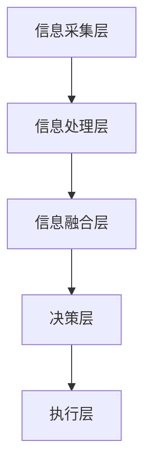

# AI Agent的多源信息融合与决策技术

> 关键词：AI Agent、多源信息融合、决策技术、信息处理、智能决策

> 摘要：本文围绕AI Agent的多源信息融合与决策技术展开深入探讨。首先介绍了该技术的背景，包括目的、预期读者等内容。接着阐述了核心概念与联系，给出了相应的原理和架构示意图及流程图。详细讲解了核心算法原理，并通过Python代码进行说明，同时给出了相关的数学模型和公式。在项目实战部分，通过实际案例展示了开发环境搭建、源代码实现及解读。探讨了该技术的实际应用场景，推荐了相关的学习资源、开发工具框架和论文著作。最后总结了未来发展趋势与挑战，提供了常见问题解答及扩展阅读参考资料，旨在全面深入地剖析AI Agent的多源信息融合与决策技术。

## 1. 背景介绍 
### 1.1 目的和范围
AI Agent的多源信息融合与决策技术旨在整合来自不同数据源的信息，以提高AI Agent的决策准确性和智能水平。在当今复杂多变的环境中，单一数据源往往无法提供全面、准确的信息，而多源信息融合能够综合不同数据源的优势，使AI Agent更好地理解环境并做出合理决策。

本技术的范围涵盖了从信息采集、传输、处理到最终决策的整个过程。涉及到多种类型的数据源，如传感器数据、文本数据、图像数据等，以及多种融合和决策方法。

### 1.2 预期读者
本文预期读者包括对AI Agent、多源信息融合和决策技术感兴趣的研究人员、工程师、学生等。对于从事人工智能、机器学习、数据处理等领域的专业人士，本文可以提供深入的技术原理和实践指导；对于初学者，本文可以帮助他们了解该领域的基本概念和方法。

### 1.3 文档结构概述
本文将按照以下结构进行阐述：首先介绍核心概念与联系，包括相关概念的原理和架构；接着讲解核心算法原理和具体操作步骤，并给出Python代码示例；然后介绍数学模型和公式，并进行详细讲解和举例说明；通过项目实战展示代码实际案例和详细解释；探讨实际应用场景；推荐相关的工具和资源；总结未来发展趋势与挑战；提供常见问题与解答以及扩展阅读和参考资料。

### 1.4 术语表
#### 1.4.1 核心术语定义
- **AI Agent**：人工智能代理，是一种能够感知环境、进行决策并执行相应动作的智能实体。
- **多源信息融合**：将来自多个不同数据源的信息进行整合，以获得更全面、准确的信息表示。
- **决策技术**：根据融合后的信息，选择最优的行动方案或做出判断的技术。

#### 1.4.2 相关概念解释
- **数据源**：提供信息的来源，可以是传感器、数据库、网络等。
- **信息采集**：从数据源中获取信息的过程。
- **信息处理**：对采集到的信息进行清洗、转换、特征提取等操作，以便后续的融合和决策。

#### 1.4.3 缩略词列表
- **AI**：Artificial Intelligence（人工智能）
- **ML**：Machine Learning（机器学习）
- **DL**：Deep Learning（深度学习）

## 2. 核心概念与联系 
### 核心概念原理
AI Agent的多源信息融合与决策技术主要基于以下原理：
- **信息互补性**：不同数据源提供的信息具有互补性，通过融合可以获得更全面的信息。例如，图像数据可以提供物体的外观信息，而传感器数据可以提供物体的物理状态信息。
- **不确定性处理**：由于数据源的多样性和噪声的存在，信息往往具有不确定性。多源信息融合可以通过合理的方法处理这些不确定性，提高信息的可靠性。
- **智能决策**：融合后的信息为AI Agent的决策提供了更丰富的依据，通过决策技术可以选择最优的行动方案，实现智能决策。

### 架构的文本示意图
AI Agent的多源信息融合与决策技术的架构主要包括以下几个部分：
1. **信息采集层**：负责从不同的数据源采集信息，如传感器、数据库、网络等。
2. **信息处理层**：对采集到的信息进行清洗、转换、特征提取等操作，以提高信息的质量和可用性。
3. **信息融合层**：将处理后的信息进行融合，采用不同的融合方法，如加权平均、贝叶斯融合等。
4. **决策层**：根据融合后的信息，采用决策技术选择最优的行动方案。
5. **执行层**：AI Agent根据决策结果执行相应的动作。

### Mermaid流程图


## 3. 核心算法原理 & 具体操作步骤 
### 核心算法原理
多源信息融合的算法有很多种，这里以加权平均融合算法为例进行介绍。加权平均融合算法的基本思想是根据不同数据源的可靠性给每个数据源分配一个权重，然后将各个数据源的信息按照权重进行加权平均，得到融合后的信息。

### 具体操作步骤
1. **确定数据源的可靠性**：可以通过历史数据、专家经验等方法确定每个数据源的可靠性，用权重 $w_i$ 表示，其中 $i$ 表示第 $i$ 个数据源，且 $\sum_{i=1}^{n}w_i = 1$，$n$ 为数据源的数量。
2. **采集信息**：从各个数据源采集信息，用 $x_i$ 表示第 $i$ 个数据源采集到的信息。
3. **加权平均计算**：根据以下公式计算融合后的信息 $x_f$：
$$x_f = \sum_{i=1}^{n}w_ix_i$$

### Python源代码实现
```python
# 定义数据源信息和权重
data_sources = [10, 12, 11]  # 假设三个数据源的信息
weights = [0.3, 0.4, 0.3]  # 对应的权重

# 计算融合后的信息
def weighted_average_fusion(data_sources, weights):
    fusion_result = 0
    for i in range(len(data_sources)):
        fusion_result += data_sources[i] * weights[i]
    return fusion_result

# 调用函数进行融合
result = weighted_average_fusion(data_sources, weights)
print("融合后的信息:", result)
```

## 4. 数学模型和公式 & 详细讲解 & 举例说明 
### 数学模型和公式
在多源信息融合中，除了加权平均融合算法，还有贝叶斯融合算法。贝叶斯融合算法基于贝叶斯定理，通过计算后验概率来进行信息融合。

贝叶斯定理的公式为：
$$P(A|B) = \frac{P(B|A)P(A)}{P(B)}$$
其中，$P(A|B)$ 表示在事件 $B$ 发生的条件下事件 $A$ 发生的概率，$P(B|A)$ 表示在事件 $A$ 发生的条件下事件 $B$ 发生的概率，$P(A)$ 表示事件 $A$ 发生的先验概率，$P(B)$ 表示事件 $B$ 发生的概率。

在多源信息融合中，设 $X$ 为待估计的变量，$Z_1, Z_2, \cdots, Z_n$ 为来自不同数据源的观测值。则根据贝叶斯定理，融合后的后验概率 $P(X|Z_1, Z_2, \cdots, Z_n)$ 可以通过以下公式计算：
$$P(X|Z_1, Z_2, \cdots, Z_n) = \frac{P(Z_1, Z_2, \cdots, Z_n|X)P(X)}{P(Z_1, Z_2, \cdots, Z_n)}$$

### 详细讲解
贝叶斯融合算法的核心思想是利用先验知识和观测数据来更新对变量 $X$ 的估计。先验概率 $P(X)$ 表示在没有观测数据之前对变量 $X$ 的估计，而 $P(Z_1, Z_2, \cdots, Z_n|X)$ 表示在变量 $X$ 取值已知的情况下观测到数据 $Z_1, Z_2, \cdots, Z_n$ 的概率。通过贝叶斯定理，可以计算出在观测到数据 $Z_1, Z_2, \cdots, Z_n$ 的情况下变量 $X$ 的后验概率 $P(X|Z_1, Z_2, \cdots, Z_n)$，从而实现信息融合。

### 举例说明
假设我们要估计一个物体的位置 $X$，有两个传感器提供观测值 $Z_1$ 和 $Z_2$。已知先验概率 $P(X)$，以及条件概率 $P(Z_1|X)$ 和 $P(Z_2|X)$。

设 $X$ 有两个可能的取值 $x_1$ 和 $x_2$，$P(X = x_1) = 0.6$，$P(X = x_2) = 0.4$。

传感器 1 的观测值 $Z_1$ 满足：$P(Z_1|X = x_1) = 0.8$，$P(Z_1|X = x_2) = 0.2$。

传感器 2 的观测值 $Z_2$ 满足：$P(Z_2|X = x_1) = 0.7$，$P(Z_2|X = x_2) = 0.3$。

首先计算 $P(Z_1, Z_2|X)$：
- 当 $X = x_1$ 时，$P(Z_1, Z_2|X = x_1) = P(Z_1|X = x_1)P(Z_2|X = x_1) = 0.8 \times 0.7 = 0.56$。
- 当 $X = x_2$ 时，$P(Z_1, Z_2|X = x_2) = P(Z_1|X = x_2)P(Z_2|X = x_2) = 0.2 \times 0.3 = 0.06$。

然后计算 $P(Z_1, Z_2)$：
$$P(Z_1, Z_2) = P(Z_1, Z_2|X = x_1)P(X = x_1) + P(Z_1, Z_2|X = x_2)P(X = x_2) = 0.56 \times 0.6 + 0.06 \times 0.4 = 0.36$$

最后计算后验概率：
- $P(X = x_1|Z_1, Z_2) = \frac{P(Z_1, Z_2|X = x_1)P(X = x_1)}{P(Z_1, Z_2)} = \frac{0.56 \times 0.6}{0.36} \approx 0.93$。
- $P(X = x_2|Z_1, Z_2) = \frac{P(Z_1, Z_2|X = x_2)P(X = x_2)}{P(Z_1, Z_2)} = \frac{0.06 \times 0.4}{0.36} \approx 0.07$。

通过贝叶斯融合，我们得到了在观测到 $Z_1$ 和 $Z_2$ 的情况下物体位置的后验概率，从而实现了信息融合。

## 5. 项目实战：代码实际案例和详细解释说明 
### 5.1  开发环境搭建
本项目实战使用Python进行开发，需要安装以下库：
- **NumPy**：用于数值计算。
- **Pandas**：用于数据处理。
- **Scikit-learn**：用于机器学习算法。

可以使用以下命令进行安装：
```sh
pip install numpy pandas scikit-learn
```

### 5.2  源代码详细实现和代码解读
以下是一个基于加权平均融合算法的多源信息融合与决策的示例代码：
```python
import numpy as np
import pandas as pd
from sklearn.linear_model import LogisticRegression

# 模拟多源信息数据
# 假设有三个数据源，每个数据源有100个样本，每个样本有5个特征
data_source_1 = np.random.rand(100, 5)
data_source_2 = np.random.rand(100, 5)
data_source_3 = np.random.rand(100, 5)

# 定义数据源的权重
weights = [0.3, 0.4, 0.3]

# 加权平均融合
def weighted_average_fusion(data_sources, weights):
    fusion_result = np.zeros(data_sources[0].shape)
    for i in range(len(data_sources)):
        fusion_result += data_sources[i] * weights[i]
    return fusion_result

# 进行信息融合
fused_data = weighted_average_fusion([data_source_1, data_source_2, data_source_3], weights)

# 模拟标签数据
labels = np.random.randint(0, 2, 100)

# 划分训练集和测试集
train_data = fused_data[:80]
train_labels = labels[:80]
test_data = fused_data[80:]
test_labels = labels[80:]

# 使用逻辑回归进行决策
model = LogisticRegression()
model.fit(train_data, train_labels)

# 进行预测
predictions = model.predict(test_data)

# 计算准确率
accuracy = np.mean(predictions == test_labels)
print("准确率:", accuracy)
```

### 5.3  代码解读与分析
1. **数据模拟**：使用 `np.random.rand` 函数模拟了三个数据源的数据，每个数据源有100个样本，每个样本有5个特征。
2. **加权平均融合**：定义了 `weighted_average_fusion` 函数，将三个数据源的数据按照权重进行加权平均，得到融合后的数据。
3. **标签模拟**：使用 `np.random.randint` 函数模拟了标签数据。
4. **数据划分**：将融合后的数据和标签数据划分为训练集和测试集，训练集占80%，测试集占20%。
5. **决策模型训练**：使用 `LogisticRegression` 模型进行训练，将训练集的数据和标签作为输入。
6. **预测和准确率计算**：使用训练好的模型对测试集的数据进行预测，并计算预测结果的准确率。

通过这个示例，我们展示了如何使用加权平均融合算法进行多源信息融合，并使用逻辑回归模型进行决策。

## 6. 实际应用场景 
### 智能交通系统
在智能交通系统中，AI Agent需要融合来自多个传感器（如摄像头、雷达、激光雷达等）的信息，以实现车辆的自动驾驶和交通流量的优化。例如，摄像头可以提供道路和交通标志的图像信息，雷达可以提供车辆与障碍物的距离信息，激光雷达可以提供三维环境信息。通过多源信息融合，AI Agent可以更准确地感知周围环境，做出合理的决策，如加速、减速、转弯等。

### 医疗诊断系统
在医疗诊断系统中，AI Agent可以融合来自不同检查设备（如X光、CT、MRI等）的图像信息，以及患者的病历、症状等文本信息，以提高疾病诊断的准确性。例如，X光图像可以显示骨骼的结构，CT图像可以提供更详细的内部器官信息，MRI图像可以对软组织进行更清晰的成像。通过多源信息融合，AI Agent可以综合分析各种信息，为医生提供更准确的诊断建议。

### 智能家居系统
在智能家居系统中，AI Agent可以融合来自多个传感器（如温度传感器、湿度传感器、光照传感器等）的信息，以及用户的行为习惯和偏好信息，以实现家居设备的智能控制。例如，温度传感器可以实时监测室内温度，湿度传感器可以监测室内湿度，光照传感器可以监测室内光照强度。通过多源信息融合，AI Agent可以根据环境条件和用户需求，自动调节空调、加湿器、灯光等设备的运行状态。

## 7. 工具和资源推荐
### 7.1 学习资源推荐
#### 7.1.1 书籍推荐
- 《人工智能：一种现代的方法》：全面介绍了人工智能的基本概念、算法和应用，是学习人工智能的经典教材。
- 《机器学习》：详细讲解了机器学习的各种算法和模型，适合对机器学习感兴趣的读者。
- 《深度学习》：深入探讨了深度学习的原理和应用，是深度学习领域的权威著作。

#### 7.1.2 在线课程
- Coursera上的“人工智能基础”课程：由知名高校的教授授课，系统地介绍了人工智能的基础知识和应用。
- edX上的“机器学习”课程：提供了丰富的教学资源和实践项目，帮助学习者掌握机器学习的算法和技巧。
- 哔哩哔哩上的“深度学习教程”：由国内的技术专家讲解，内容生动有趣，适合初学者入门。

#### 7.1.3 技术博客和网站
- 机器之心：专注于人工智能领域的技术资讯和研究成果分享，提供了大量的优质文章和案例分析。
- 开源中国：涵盖了各种开源技术和项目，包括人工智能、机器学习等领域，是开发者交流和学习的平台。
- 知乎：有很多关于人工智能的讨论和问答，用户可以从中获取不同的观点和经验。

### 7.2 开发工具框架推荐
#### 7.2.1 IDE和编辑器
- PyCharm：一款专门为Python开发设计的集成开发环境，提供了丰富的功能和插件，方便开发者进行代码编写、调试和管理。
- Jupyter Notebook：一种交互式的开发环境，适合进行数据分析、机器学习等实验和研究。
- Visual Studio Code：一款轻量级的代码编辑器，支持多种编程语言和插件，具有良好的扩展性和用户体验。

#### 7.2.2 调试和性能分析工具
- PDB：Python自带的调试工具，可以帮助开发者定位和解决代码中的问题。
- Py-Spy：一个用于Python代码性能分析的工具，可以实时监测代码的运行情况，找出性能瓶颈。
- TensorBoard：TensorFlow提供的可视化工具，可以帮助开发者可视化模型的训练过程和性能指标。

#### 7.2.3 相关框架和库
- TensorFlow：一个开源的深度学习框架，提供了丰富的工具和接口，支持多种深度学习模型的开发和训练。
- PyTorch：另一个流行的深度学习框架，具有动态计算图和简洁的API，适合快速原型开发和研究。
- Scikit-learn：一个用于机器学习的Python库，提供了各种机器学习算法和工具，方便开发者进行数据处理、模型选择和评估。

### 7.3 相关论文著作推荐
#### 7.3.1 经典论文
- “A Mathematical Theory of Communication” by Claude E. Shannon：信息论的经典论文，为信息处理和融合提供了理论基础。
- “Pattern Recognition and Machine Learning” by Christopher M. Bishop：机器学习领域的经典著作，系统地介绍了机器学习的理论和算法。
- “Deep Learning” by Yann LeCun, Yoshua Bengio, and Geoffrey Hinton：深度学习领域的开创性论文，推动了深度学习的发展和应用。

#### 7.3.2 最新研究成果
- 可以通过IEEE Xplore、ACM Digital Library等学术数据库查找最新的关于AI Agent、多源信息融合和决策技术的研究论文。
- 关注国际人工智能会议（如IJCAI、AAAI等）的会议论文，了解最新的研究动态和成果。

#### 7.3.3 应用案例分析
- 一些知名企业（如谷歌、微软、百度等）会在其官方博客或技术报告中分享AI Agent的多源信息融合与决策技术的应用案例，可以从中学习到实际应用中的经验和技巧。

## 8. 总结：未来发展趋势与挑战
### 未来发展趋势
- **多模态信息融合**：未来的AI Agent将不仅仅融合单一类型的信息，而是融合多种模态的信息，如图像、语音、文本等，以实现更全面、准确的信息理解和决策。
- **深度融合与智能决策**：随着深度学习技术的不断发展，多源信息融合将与深度学习相结合，实现更深度的信息融合和更智能的决策。
- **边缘计算与信息融合**：边缘计算技术的发展将使得信息融合可以在边缘设备上进行，减少数据传输延迟，提高系统的实时性和可靠性。

### 挑战
- **信息质量和可靠性**：由于数据源的多样性和噪声的存在，如何保证多源信息的质量和可靠性是一个挑战。需要研究有效的信息处理和清洗方法，提高信息的可用性。
- **融合算法的复杂性**：多源信息融合算法往往比较复杂，需要消耗大量的计算资源和时间。如何设计高效、简洁的融合算法是一个亟待解决的问题。
- **隐私和安全问题**：多源信息融合涉及到大量的个人和敏感信息，如何保护这些信息的隐私和安全是一个重要的挑战。需要研究有效的隐私保护和安全机制，确保信息的合法使用。

## 9. 附录：常见问题与解答
### 问题1：多源信息融合的主要方法有哪些？
答：多源信息融合的主要方法包括加权平均融合、贝叶斯融合、D-S证据理论融合、神经网络融合等。不同的方法适用于不同的应用场景和数据类型。

### 问题2：如何确定数据源的权重？
答：可以通过历史数据、专家经验、统计分析等方法确定数据源的权重。例如，可以根据数据源的准确率、可靠性等指标来分配权重。

### 问题3：多源信息融合会带来哪些问题？
答：多源信息融合可能会带来信息冲突、信息冗余、计算复杂度增加等问题。需要通过合理的方法解决这些问题，如冲突消解、信息筛选、优化算法等。

### 问题4：如何评估多源信息融合的效果？
答：可以通过评估融合后信息的准确性、可靠性、完整性等指标来评估多源信息融合的效果。常用的评估方法包括准确率、召回率、F1值等。

## 10. 扩展阅读 & 参考资料
### 扩展阅读
- 《多传感器信息融合及应用》：深入探讨了多传感器信息融合的理论和应用，提供了丰富的案例和实践经验。
- 《人工智能前沿技术》：介绍了人工智能领域的最新技术和发展趋势，包括多源信息融合与决策技术的相关内容。

### 参考资料
- IEEE Transactions on Systems, Man, and Cybernetics：该期刊发表了大量关于信息融合和人工智能的研究论文，具有较高的学术水平和影响力。
- ACM SIGKDD Conference on Knowledge Discovery and Data Mining：该会议是数据挖掘领域的顶级会议，涵盖了多源信息融合和决策技术的相关研究成果。