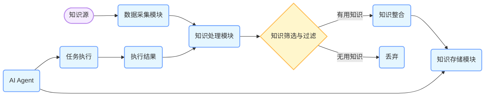

# AI Agent的实时知识更新：保持LLM信息的时效性

> 关键词：AI Agent、实时知识更新、大语言模型（LLM）、信息时效性、知识图谱

> 摘要：本文聚焦于AI Agent的实时知识更新，旨在解决大语言模型（LLM）信息时效性不足的问题。首先介绍了相关背景，包括目的、预期读者、文档结构和术语表。接着阐述了核心概念与联系，通过文本示意图和Mermaid流程图展示其原理和架构。详细讲解了核心算法原理和具体操作步骤，并用Python源代码进行说明。同时给出了数学模型和公式，并举例说明。通过项目实战展示了代码实际案例及详细解释。探讨了实际应用场景，推荐了相关工具和资源，包括学习资源、开发工具框架和论文著作。最后总结了未来发展趋势与挑战，提供了常见问题与解答以及扩展阅读和参考资料，为实现AI Agent的实时知识更新提供全面的技术指导。

## 1. 背景介绍 
### 1.1 目的和范围
在当今信息爆炸的时代，知识和信息的更新速度极快。大语言模型（LLM）虽然具有强大的语言处理能力，但由于其训练数据的局限性，其知识往往存在一定的滞后性。AI Agent作为一种能够自主执行任务的智能体，在许多应用场景中需要实时获取最新的知识，以提供准确和有用的信息。本文的目的就是探讨如何实现AI Agent的实时知识更新，以保持LLM信息的时效性。范围涵盖了从核心概念的介绍、算法原理的讲解、项目实战的演示到实际应用场景的分析等多个方面。

### 1.2 预期读者
本文的预期读者包括人工智能领域的研究人员、开发者、对AI Agent和LLM技术感兴趣的技术爱好者、相关企业的技术决策者等。无论是想要深入了解实时知识更新技术原理的专业人士，还是希望掌握相关技术应用方法的开发者，都能从本文中获得有价值的信息。

### 1.3 文档结构概述
本文首先介绍相关背景知识，包括目的、读者和术语表。接着详细阐述核心概念与联系，通过示意图和流程图直观展示其架构。然后讲解核心算法原理和具体操作步骤，结合Python代码进行说明。给出数学模型和公式，并举例解释。通过项目实战展示代码实现和解读。探讨实际应用场景，推荐相关工具和资源。最后总结未来发展趋势与挑战，提供常见问题解答和扩展阅读参考资料。

### 1.4 术语表
#### 1.4.1 核心术语定义
- **AI Agent（人工智能智能体）**：能够感知环境、做出决策并采取行动以实现特定目标的智能实体。
- **LLM（大语言模型）**：基于深度学习的大规模语言模型，能够处理自然语言任务，如文本生成、问答系统等。
- **实时知识更新**：在不影响AI Agent正常运行的情况下，及时获取和整合最新的知识，以保证其知识的时效性。
- **知识图谱**：一种以图的形式表示知识的语义网络，包含实体、关系和属性等信息。

#### 1.4.2 相关概念解释
- **信息时效性**：指信息在一定时间内的有效性和价值。对于AI Agent来说，信息时效性直接影响其决策和响应的准确性。
- **增量学习**：一种机器学习方法，在已有模型的基础上，通过不断学习新的数据来更新模型，而不需要重新训练整个模型。

#### 1.4.3 缩略词列表
- **LLM**：Large Language Model（大语言模型）
- **API**：Application Programming Interface（应用程序编程接口）

## 2. 核心概念与联系 

### 核心概念原理
AI Agent的实时知识更新主要基于以下几个核心概念。首先是知识源的获取，通过各种渠道，如新闻网站、专业数据库、社交媒体等，收集最新的知识。然后是知识的筛选和过滤，去除无用或错误的信息，只保留有价值的知识。接着是知识的整合，将新获取的知识与AI Agent已有的知识进行融合，更新其知识图谱或模型参数。最后是知识的应用，AI Agent在执行任务时能够根据最新的知识做出准确的决策和响应。

### 架构的文本示意图
AI Agent的实时知识更新架构可以描述为一个循环系统。知识源通过数据采集模块将数据传输到知识处理模块，在知识处理模块中进行筛选、过滤和整合。处理后的知识被存储在知识存储模块中，AI Agent在执行任务时从知识存储模块中获取知识。同时，AI Agent的执行结果可以反馈到知识处理模块，用于进一步的知识更新和优化。

### Mermaid流程图


## 3. 核心算法原理 & 具体操作步骤 

### 核心算法原理
AI Agent的实时知识更新主要涉及到知识的获取、筛选、整合和应用等过程。在知识获取阶段，可以使用网络爬虫技术从各种网站和数据源中获取最新的知识。在知识筛选阶段，可以使用自然语言处理技术，如文本分类、情感分析等，对获取的知识进行筛选和过滤。在知识整合阶段，可以使用增量学习算法，如在线梯度下降算法，将新获取的知识与已有的模型进行融合。

### 具体操作步骤
1. **知识获取**：使用Python的`requests`库和`BeautifulSoup`库编写网络爬虫程序，从指定的网站和数据源中获取最新的知识。
```python
import requests
from bs4 import BeautifulSoup

def get_news(url):
    try:
        response = requests.get(url)
        response.raise_for_status()
        soup = BeautifulSoup(response.text, 'html.parser')
        # 这里需要根据具体的网页结构提取新闻内容
        news_content = soup.find('div', class_='news-content').text
        return news_content
    except Exception as e:
        print(f"Error getting news: {e}")
        return None
```
2. **知识筛选**：使用Python的`scikit-learn`库进行文本分类，筛选出有用的知识。
```python
from sklearn.feature_extraction.text import TfidfVectorizer
from sklearn.naive_bayes import MultinomialNB
from sklearn.pipeline import Pipeline

# 假设已经有了训练好的分类器
text_clf = Pipeline([
    ('tfidf', TfidfVectorizer()),
    ('clf', MultinomialNB()),
])

def filter_news(news_content):
    prediction = text_clf.predict([news_content])
    if prediction[0] == 'useful':
        return news_content
    else:
        return None
```
3. **知识整合**：使用在线梯度下降算法更新模型参数。
```python
import numpy as np

def online_gradient_descent(model, new_data, learning_rate):
    for data_point in new_data:
        # 计算梯度
        gradient = model.compute_gradient(data_point)
        # 更新模型参数
        model.parameters -= learning_rate * gradient
    return model
```
4. **知识应用**：AI Agent在执行任务时，从知识存储模块中获取最新的知识，并根据这些知识做出决策和响应。

## 4. 数学模型和公式 & 详细讲解 & 举例说明 

### 数学模型
在AI Agent的实时知识更新中，主要涉及到两个数学模型：文本分类模型和增量学习模型。

#### 文本分类模型
文本分类模型可以使用朴素贝叶斯分类器。朴素贝叶斯分类器基于贝叶斯定理，通过计算文本属于各个类别的概率来进行分类。贝叶斯定理的公式为：
$$P(c|d)=\frac{P(d|c)P(c)}{P(d)}$$
其中，$P(c|d)$ 表示文本 $d$ 属于类别 $c$ 的概率，$P(d|c)$ 表示类别 $c$ 中出现文本 $d$ 的概率，$P(c)$ 表示类别 $c$ 的先验概率，$P(d)$ 表示文本 $d$ 出现的概率。

#### 增量学习模型
增量学习模型可以使用在线梯度下降算法。在线梯度下降算法的目标是最小化损失函数 $L(\theta)$，其中 $\theta$ 是模型的参数。算法的更新公式为：
$$\theta_{t+1}=\theta_{t}-\eta\nabla L(\theta_{t})$$
其中，$\theta_{t}$ 是第 $t$ 次迭代的模型参数，$\eta$ 是学习率，$\nabla L(\theta_{t})$ 是损失函数在 $\theta_{t}$ 处的梯度。

### 详细讲解
#### 文本分类模型
在文本分类中，我们需要先计算各个类别的先验概率 $P(c)$ 和类别 $c$ 中出现文本 $d$ 的概率 $P(d|c)$。然后，根据贝叶斯定理计算文本 $d$ 属于各个类别的概率 $P(c|d)$，选择概率最大的类别作为文本的分类结果。

#### 增量学习模型
在线梯度下降算法是一种迭代算法，每次迭代根据当前的模型参数计算损失函数的梯度，然后沿着梯度的反方向更新模型参数。学习率 $\eta$ 控制了每次更新的步长，过大的学习率可能导致模型无法收敛，过小的学习率可能导致收敛速度过慢。

### 举例说明
#### 文本分类模型
假设我们有一个文本分类任务，要将新闻分为“有用”和“无用”两类。我们已经有了一个训练集，其中包含100条“有用”的新闻和200条“无用”的新闻。那么，“有用”类别的先验概率 $P(有用)=\frac{100}{100 + 200}=\frac{1}{3}$，“无用”类别的先验概率 $P(无用)=\frac{200}{100 + 200}=\frac{2}{3}$。对于一条新的新闻 $d$，我们可以计算 $P(d|有用)$ 和 $P(d|无用)$，然后根据贝叶斯定理计算 $P(有用|d)$ 和 $P(无用|d)$，选择概率大的类别作为分类结果。

#### 增量学习模型
假设我们有一个线性回归模型 $y = \theta_0 + \theta_1x$，损失函数为均方误差 $L(\theta)=\frac{1}{n}\sum_{i=1}^{n}(y_i - (\theta_0 + \theta_1x_i))^2$。我们使用在线梯度下降算法更新模型参数。每次迭代时，我们根据当前的模型参数计算损失函数的梯度 $\nabla L(\theta)$，然后更新模型参数 $\theta_{t+1}=\theta_{t}-\eta\nabla L(\theta_{t})$。例如，当 $\eta = 0.01$ 时，每次迭代模型参数的更新步长为 $0.01\times\nabla L(\theta_{t})$。

## 5. 项目实战：代码实际案例和详细解释说明 

### 5.1  开发环境搭建
1. **安装Python**：确保你已经安装了Python 3.x版本。可以从Python官方网站（https://www.python.org/downloads/） 下载并安装。
2. **安装必要的库**：使用`pip`命令安装所需的库，如`requests`、`BeautifulSoup`、`scikit-learn`等。
```bash
pip install requests beautifulsoup4 scikit-learn
```
3. **准备开发环境**：可以使用PyCharm、VS Code等集成开发环境进行代码开发。

### 5.2  源代码详细实现和代码解读
```python
import requests
from bs4 import BeautifulSoup
from sklearn.feature_extraction.text import TfidfVectorizer
from sklearn.naive_bayes import MultinomialNB
from sklearn.pipeline import Pipeline
import numpy as np

# 模拟知识存储模块
knowledge_storage = []

# 知识获取函数
def get_news(url):
    try:
        response = requests.get(url)
        response.raise_for_status()
        soup = BeautifulSoup(response.text, 'html.parser')
        # 这里需要根据具体的网页结构提取新闻内容
        news_content = soup.find('div', class_='news-content').text
        return news_content
    except Exception as e:
        print(f"Error getting news: {e}")
        return None

# 知识筛选函数
text_clf = Pipeline([
    ('tfidf', TfidfVectorizer()),
    ('clf', MultinomialNB()),
])

def filter_news(news_content):
    prediction = text_clf.predict([news_content])
    if prediction[0] == 'useful':
        return news_content
    else:
        return None

# 知识整合函数
def online_gradient_descent(model, new_data, learning_rate):
    for data_point in new_data:
        # 计算梯度
        gradient = model.compute_gradient(data_point)
        # 更新模型参数
        model.parameters -= learning_rate * gradient
    return model

# 主函数
def main():
    url = 'https://example.com/news'  # 替换为实际的新闻网站URL
    news_content = get_news(url)
    if news_content:
        filtered_news = filter_news(news_content)
        if filtered_news:
            knowledge_storage.append(filtered_news)
            # 假设这里有一个模型需要更新
            model = ...  # 初始化模型
            learning_rate = 0.01
            new_data = [filtered_news]
            updated_model = online_gradient_descent(model, new_data, learning_rate)

if __name__ == '__main__':
    main()
```
### 5.3  代码解读与分析
1. **知识获取**：`get_news`函数使用`requests`库发送HTTP请求获取网页内容，然后使用`BeautifulSoup`库解析网页，提取新闻内容。
2. **知识筛选**：`filter_news`函数使用`scikit-learn`库的`Pipeline`构建文本分类器，对获取的新闻内容进行分类，筛选出有用的新闻。
3. **知识整合**：`online_gradient_descent`函数使用在线梯度下降算法更新模型参数，将新获取的知识整合到模型中。
4. **主函数**：`main`函数调用`get_news`函数获取新闻内容，调用`filter_news`函数筛选新闻，将有用的新闻添加到知识存储模块中，并调用`online_gradient_descent`函数更新模型。

## 6. 实际应用场景 
### 智能客服
在智能客服系统中，AI Agent需要实时获取最新的产品信息、常见问题解答等知识，以提供准确的客户服务。通过实时知识更新，AI Agent可以及时响应客户的咨询，提高客户满意度。

### 金融投资顾问
金融市场变化迅速，AI Agent作为金融投资顾问需要实时获取最新的市场动态、财经新闻等知识，以做出准确的投资决策。实时知识更新可以帮助AI Agent及时调整投资策略，降低投资风险。

### 医疗辅助诊断
在医疗领域，医学知识不断更新，AI Agent作为医疗辅助诊断工具需要实时获取最新的医学研究成果、疾病诊断标准等知识，以提供准确的诊断建议。实时知识更新可以提高医疗诊断的准确性和效率。

## 7. 工具和资源推荐
### 7.1 学习资源推荐
#### 7.1.1 书籍推荐
- 《Python机器学习实战》：介绍了Python在机器学习领域的应用，包括文本分类、增量学习等算法。
- 《人工智能：一种现代的方法》：全面介绍了人工智能的基本概念、算法和应用，对AI Agent和LLM有深入的讲解。
- 《自然语言处理入门》：详细介绍了自然语言处理的基本技术，如文本分类、情感分析等。

#### 7.1.2 在线课程
- Coursera上的“机器学习”课程：由斯坦福大学的Andrew Ng教授授课，系统介绍了机器学习的基本算法和应用。
- edX上的“人工智能基础”课程：提供了人工智能的基础知识和实践经验。
- 哔哩哔哩上的“Python数据分析与机器学习实战”课程：结合实际案例，讲解Python在数据分析和机器学习中的应用。

#### 7.1.3 技术博客和网站
- Medium：有许多人工智能领域的技术博客，提供最新的技术文章和研究成果。
- arXiv：一个预印本数据库，包含了大量的人工智能领域的研究论文。
- 机器之心：专注于人工智能领域的资讯和技术分享，提供了丰富的学习资源。

### 7.2 开发工具框架推荐
#### 7.2.1 IDE和编辑器
- PyCharm：一款专业的Python集成开发环境，提供了丰富的代码编辑、调试和部署功能。
- VS Code：一款轻量级的代码编辑器，支持多种编程语言，有丰富的插件可以扩展功能。
- Jupyter Notebook：一种交互式的编程环境，适合进行数据分析和机器学习实验。

#### 7.2.2 调试和性能分析工具
- PySnooper：一个简单易用的Python调试工具，可以自动打印函数的执行过程和变量的值。
- cProfile：Python内置的性能分析工具，可以分析代码的运行时间和函数调用次数。
- TensorBoard：一个用于可视化深度学习模型训练过程的工具，可以帮助开发者监控模型的性能。

#### 7.2.3 相关框架和库
- TensorFlow：一个开源的深度学习框架，提供了丰富的工具和函数，用于构建和训练深度学习模型。
- PyTorch：另一个流行的深度学习框架，具有动态计算图的特点，适合快速开发和实验。
- NLTK：一个自然语言处理工具包，提供了丰富的文本处理功能，如分词、词性标注、命名实体识别等。

### 7.3 相关论文著作推荐
#### 7.3.1 经典论文
- “Attention Is All You Need”：介绍了Transformer模型，是现代大语言模型的基础。
- “A Unified Architecture for Natural Language Processing: Deep Neural Networks with Multitask Learning”：提出了多任务学习的概念，用于提高自然语言处理模型的性能。
- “Efficient Estimation of Word Representations in Vector Space”：介绍了Word2Vec模型，用于将文本转换为向量表示。

#### 7.3.2 最新研究成果
- 关注顶级学术会议，如NeurIPS、ICML、ACL等，这些会议上的论文代表了人工智能领域的最新研究成果。
- 关注知名研究机构的官方网站，如OpenAI、Google AI等，他们会发布最新的研究论文和技术报告。

#### 7.3.3 应用案例分析
- 分析一些实际应用中的AI Agent和LLM系统，如ChatGPT、Bing Chat等，了解它们的架构、算法和应用场景。
- 参考一些企业的技术博客和案例分享，了解他们在AI Agent和LLM领域的实践经验。

## 8. 总结：未来发展趋势与挑战
### 未来发展趋势
1. **多模态知识更新**：未来的AI Agent不仅要更新文本知识，还要更新图像、音频、视频等多模态知识，以提供更全面的信息服务。
2. **知识的深度融合**：将不同来源、不同类型的知识进行深度融合，构建更强大的知识图谱，提高AI Agent的智能水平。
3. **自主学习和进化**：AI Agent将具备更强的自主学习能力，能够自动发现和获取新知识，并不断进化和优化自己的性能。

### 挑战
1. **数据质量和安全性**：实时获取的知识数据可能存在质量问题和安全隐患，需要加强数据的清洗、验证和安全保护。
2. **计算资源和效率**：实时知识更新需要大量的计算资源和时间，如何提高计算效率，降低成本是一个挑战。
3. **知识的一致性和冲突解决**：不同来源的知识可能存在一致性问题和冲突，需要研究有效的方法来解决这些问题。

## 9. 附录：常见问题与解答
### 问题1：如何选择合适的知识源？
答：选择合适的知识源需要考虑知识的准确性、时效性、权威性等因素。可以选择官方网站、专业数据库、知名媒体等作为知识源。

### 问题2：如何评估知识更新的效果？
答：可以通过准确率、召回率、F1值等指标来评估知识更新后的模型性能，也可以通过用户反馈和实际应用效果来评估。

### 问题3：实时知识更新会影响AI Agent的稳定性吗？
答：在设计合理的情况下，实时知识更新不会影响AI Agent的稳定性。可以采用增量学习等方法，在不影响模型整体性能的前提下进行知识更新。

## 10. 扩展阅读 & 参考资料
### 扩展阅读
- 《深度学习》（Ian Goodfellow等著）：深入介绍了深度学习的理论和实践。
- 《大数据时代》（维克托·迈尔 - 舍恩伯格等著）：探讨了大数据对社会和科技的影响。

### 参考资料
- 相关学术论文和研究报告。
- 开源项目的文档和代码。
- 官方网站和技术博客的文章。