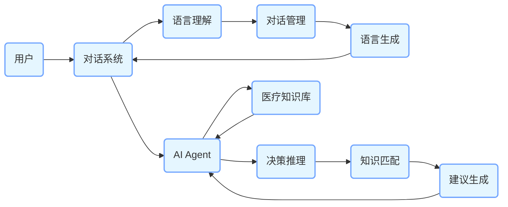

# AI Agent的对话系统在远程医疗中的应用

> 关键词：AI Agent、对话系统、远程医疗、智能诊断、医疗辅助

> 摘要：本文聚焦于AI Agent的对话系统在远程医疗中的应用。详细阐述了相关核心概念、算法原理、数学模型，通过实际项目案例展示其实现过程。深入探讨了该技术在远程医疗中的具体应用场景，推荐了相关学习资源、开发工具和论文著作。最后对其未来发展趋势与挑战进行了总结，并给出常见问题解答和参考资料，旨在全面介绍AI Agent的对话系统在远程医疗领域的应用价值与潜力。

## 1. 背景介绍 
### 1.1 目的和范围
随着信息技术的飞速发展，远程医疗逐渐成为医疗领域的重要发展方向。AI Agent的对话系统作为人工智能技术的重要应用，为远程医疗带来了新的机遇和变革。本文的目的在于深入探讨AI Agent的对话系统在远程医疗中的应用，包括其技术原理、实现方法、应用场景以及未来发展趋势等方面，范围涵盖从基础概念到实际项目应用的各个环节，旨在为相关研究人员、开发者和医疗从业者提供全面的参考。

### 1.2 预期读者
本文预期读者包括但不限于人工智能领域的研究人员、软件开发工程师、医疗信息系统的开发者、医疗从业者以及对远程医疗和人工智能技术感兴趣的爱好者。不同背景的读者可以从本文中获取到与自身需求相关的知识和信息，例如研究人员可以了解最新的技术发展动态和研究方向，开发者可以获取具体的技术实现细节和开发经验，医疗从业者可以了解如何将该技术应用于实际医疗场景中。

### 1.3 文档结构概述
本文首先介绍相关背景知识，包括目的、预期读者和文档结构等内容。接着阐述AI Agent和对话系统的核心概念及其联系，通过文本示意图和Mermaid流程图进行直观展示。然后详细讲解核心算法原理和具体操作步骤，并使用Python源代码进行阐述。随后介绍数学模型和公式，并举例说明。再通过项目实战展示代码实际案例和详细解释。之后探讨实际应用场景，推荐相关工具和资源。最后总结未来发展趋势与挑战，给出常见问题解答和参考资料。

### 1.4 术语表
#### 1.4.1 核心术语定义
- **AI Agent（人工智能智能体）**：是一个能够感知环境、并根据感知到的信息进行决策和行动的智能实体。它可以自主地完成特定的任务，通过与环境的交互不断学习和优化自身的行为。
- **对话系统**：是一种允许用户与计算机进行自然语言对话的系统。它能够理解用户的输入，生成合适的响应，实现人机之间的自然交流。
- **远程医疗**：是指通过信息技术手段，跨越地理空间的限制，实现医疗服务的远程提供。包括远程诊断、远程治疗、远程监护等多种形式。

#### 1.4.2 相关概念解释
- **自然语言处理（NLP）**：是人工智能的一个重要分支，主要研究如何让计算机理解和处理人类语言。在对话系统中，NLP技术用于实现语言的理解、生成和语义分析等功能。
- **机器学习（ML）**：是一门多领域交叉学科，涉及概率论、统计学、逼近论、凸分析、算法复杂度理论等多门学科。它专门研究计算机怎样模拟或实现人类的学习行为，以获取新的知识或技能，重新组织已有的知识结构使之不断改善自身的性能。在AI Agent的对话系统中，机器学习算法用于训练模型，提高系统的性能和智能水平。

#### 1.4.3 缩略词列表
- **NLP**：Natural Language Processing（自然语言处理）
- **ML**：Machine Learning（机器学习）
- **RNN**：Recurrent Neural Network（循环神经网络）
- **LSTM**：Long Short - Term Memory（长短期记忆网络）

## 2. 核心概念与联系 

### 核心概念原理
#### AI Agent
AI Agent是一个具有自主性、反应性、社会性和适应性的智能实体。它通过传感器感知环境信息，然后根据内部的决策机制进行推理和决策，最后通过执行器对环境进行操作。例如，在远程医疗中，AI Agent可以通过与患者的对话系统交互，获取患者的症状信息，然后根据医学知识和算法进行诊断和建议。

#### 对话系统
对话系统主要由语言理解模块、对话管理模块和语言生成模块组成。语言理解模块负责将用户的自然语言输入转换为计算机能够理解的语义表示；对话管理模块根据当前的对话状态和历史信息，决定如何回应用户；语言生成模块将对话管理模块的决策转换为自然语言输出。

### 架构的文本示意图
```plaintext
用户 <-> 对话系统 <-> AI Agent <-> 医疗知识库
        |                |
        |                |
    语言理解        决策推理
        |                |
        |                |
    对话管理        知识匹配
        |                |
        |                |
    语言生成        建议生成
```

### Mermaid流程图


## 3. 核心算法原理 & 具体操作步骤 

### 核心算法原理
在AI Agent的对话系统中，常用的算法包括自然语言处理算法和机器学习算法。其中，自然语言处理算法用于处理用户的自然语言输入，机器学习算法用于训练模型，提高系统的性能。

#### 自然语言处理算法
- **词法分析**：将用户输入的文本进行分词，将其拆分为一个个单词或词组。例如，使用Python的`jieba`库进行中文分词：
```python
import jieba

text = "我头疼，体温38度"
words = jieba.lcut(text)
print(words)
```
- **词性标注**：为每个分词标注其词性，例如名词、动词、形容词等。可以使用`jieba.posseg`库进行词性标注：
```python
import jieba.posseg as pseg

words = pseg.cut(text)
for word, flag in words:
    print(word, flag)
```
- **命名实体识别（NER）**：识别文本中的命名实体，如人名、地名、疾病名等。可以使用`spaCy`库进行英文命名实体识别：
```python
import spacy

nlp = spacy.load("en_core_web_sm")
doc = nlp("I have a headache and my temperature is 38 degrees.")
for ent in doc.ents:
    print(ent.text, ent.label_)
```

#### 机器学习算法
- **循环神经网络（RNN）**：RNN是一种具有循环结构的神经网络，能够处理序列数据。在对话系统中，RNN可以用于处理用户的对话历史，捕捉上下文信息。以下是一个简单的RNN示例：
```python
import torch
import torch.nn as nn

# 定义RNN模型
class SimpleRNN(nn.Module):
    def __init__(self, input_size, hidden_size, output_size):
        super(SimpleRNN, self).__init__()
        self.rnn = nn.RNN(input_size, hidden_size, batch_first=True)
        self.fc = nn.Linear(hidden_size, output_size)

    def forward(self, x):
        out, _ = self.rnn(x)
        out = self.fc(out[:, -1, :])
        return out

# 初始化模型
input_size = 10
hidden_size = 20
output_size = 5
model = SimpleRNN(input_size, hidden_size, output_size)

# 生成随机输入
batch_size = 3
seq_length = 4
x = torch.randn(batch_size, seq_length, input_size)

# 前向传播
output = model(x)
print(output.shape)
```
- **长短期记忆网络（LSTM）**：LSTM是RNN的一种改进版本，能够有效解决长序列中的梯度消失问题。以下是一个简单的LSTM示例：
```python
import torch
import torch.nn as nn

# 定义LSTM模型
class SimpleLSTM(nn.Module):
    def __init__(self, input_size, hidden_size, output_size):
        super(SimpleLSTM, self).__init__()
        self.lstm = nn.LSTM(input_size, hidden_size, batch_first=True)
        self.fc = nn.Linear(hidden_size, output_size)

    def forward(self, x):
        out, _ = self.lstm(x)
        out = self.fc(out[:, -1, :])
        return out

# 初始化模型
input_size = 10
hidden_size = 20
output_size = 5
model = SimpleLSTM(input_size, hidden_size, output_size)

# 生成随机输入
batch_size = 3
seq_length = 4
x = torch.randn(batch_size, seq_length, input_size)

# 前向传播
output = model(x)
print(output.shape)
```

### 具体操作步骤
1. **数据收集**：收集医疗领域的对话数据，包括患者与医生的对话记录、医学文献等。
2. **数据预处理**：对收集到的数据进行清洗、标注和分词等处理，将其转换为适合模型训练的格式。
3. **模型训练**：使用预处理后的数据对自然语言处理和机器学习模型进行训练，调整模型的参数，提高模型的性能。
4. **系统集成**：将训练好的模型集成到对话系统中，实现AI Agent的对话功能。
5. **系统测试**：对集成后的系统进行测试，检查系统的功能和性能是否满足要求。
6. **系统优化**：根据测试结果对系统进行优化，不断提高系统的性能和用户体验。

## 4. 数学模型和公式 & 详细讲解 & 举例说明 

### 数学模型
在AI Agent的对话系统中，常用的数学模型包括概率模型和神经网络模型。

#### 概率模型
- **朴素贝叶斯模型**：朴素贝叶斯模型是一种基于贝叶斯定理的概率分类模型，假设特征之间相互独立。其数学公式为：
$$P(c|x)=\frac{P(x|c)P(c)}{P(x)}$$
其中，$P(c|x)$ 表示在特征 $x$ 出现的情况下类别 $c$ 出现的概率，$P(x|c)$ 表示在类别 $c$ 出现的情况下特征 $x$ 出现的概率，$P(c)$ 表示类别 $c$ 出现的先验概率，$P(x)$ 表示特征 $x$ 出现的概率。

#### 神经网络模型
- **前馈神经网络（FNN）**：前馈神经网络是一种最简单的神经网络模型，由输入层、隐藏层和输出层组成。其数学公式为：
$$y = f(Wx + b)$$
其中，$x$ 是输入向量，$W$ 是权重矩阵，$b$ 是偏置向量，$f$ 是激活函数，$y$ 是输出向量。

### 详细讲解
#### 朴素贝叶斯模型
朴素贝叶斯模型的核心思想是通过计算每个类别的后验概率，选择后验概率最大的类别作为预测结果。在对话系统中，可以使用朴素贝叶斯模型对用户的意图进行分类。例如，根据用户的输入判断用户是咨询疾病信息、预约挂号还是其他需求。

#### 前馈神经网络
前馈神经网络通过不断调整权重和偏置，使得输出结果尽可能接近真实标签。在对话系统中，前馈神经网络可以用于语言生成和语义理解等任务。

### 举例说明
#### 朴素贝叶斯模型
假设我们有一个简单的医疗对话数据集，包含用户的输入和对应的意图标签。我们可以使用Python的`sklearn`库实现朴素贝叶斯分类器：
```python
from sklearn.feature_extraction.text import CountVectorizer
from sklearn.naive_bayes import MultinomialNB
from sklearn.pipeline import Pipeline

# 训练数据
train_data = ["我头疼，该怎么办", "我想预约挂号", "感冒了吃什么药"]
train_labels = ["咨询疾病信息", "预约挂号", "咨询疾病信息"]

# 创建管道
pipeline = Pipeline([
    ('vectorizer', CountVectorizer()),
    ('classifier', MultinomialNB())
])

# 训练模型
pipeline.fit(train_data, train_labels)

# 预测
test_data = ["我发烧了，该吃什么药"]
predicted_labels = pipeline.predict(test_data)
print(predicted_labels)
```
#### 前馈神经网络
以下是一个简单的前馈神经网络示例，用于手写数字识别：
```python
import torch
import torch.nn as nn
import torch.optim as optim
from torchvision import datasets, transforms

# 定义前馈神经网络模型
class SimpleFNN(nn.Module):
    def __init__(self):
        super(SimpleFNN, self).__init__()
        self.fc1 = nn.Linear(784, 128)
        self.fc2 = nn.Linear(128, 10)
        self.relu = nn.ReLU()

    def forward(self, x):
        x = x.view(-1, 784)
        x = self.relu(self.fc1(x))
        x = self.fc2(x)
        return x

# 数据预处理
transform = transforms.Compose([
    transforms.ToTensor(),
    transforms.Normalize((0.1307,), (0.3081,))
])

# 加载数据集
train_dataset = datasets.MNIST('data', train=True, download=True, transform=transform)
train_loader = torch.utils.data.DataLoader(train_dataset, batch_size=64, shuffle=True)

# 初始化模型、损失函数和优化器
model = SimpleFNN()
criterion = nn.CrossEntropyLoss()
optimizer = optim.SGD(model.parameters(), lr=0.01)

# 训练模型
for epoch in range(5):
    for batch_idx, (data, target) in enumerate(train_loader):
        optimizer.zero_grad()
        output = model(data)
        loss = criterion(output, target)
        loss.backward()
        optimizer.step()
    print(f'Epoch {epoch + 1} completed')
```

## 5. 项目实战：代码实际案例和详细解释说明 

### 5.1  开发环境搭建
#### 安装Python
首先需要安装Python环境，建议使用Python 3.7及以上版本。可以从Python官方网站（https://www.python.org/downloads/）下载并安装。

#### 安装相关库
使用`pip`命令安装所需的库，例如：
```sh
pip install torch torchvision jieba spacy scikit-learn
```

#### 下载医疗知识库
可以从公开的医疗数据库或医学文献中收集医疗知识，构建医疗知识库。

### 5.2  源代码详细实现和代码解读
以下是一个简单的AI Agent对话系统在远程医疗中的实现示例：
```python
import jieba
import random

# 医疗知识库
medical_knowledge = {
    "头疼": "头疼可能是由多种原因引起的，如感冒、睡眠不足、压力过大等。建议多休息，保持充足的睡眠。如果症状持续或加重，建议及时就医。",
    "发烧": "发烧可能是身体感染的一种表现。可以先采取物理降温的方法，如用湿毛巾擦拭额头、腋窝等部位。如果体温超过38.5度，可以服用退烧药。如果症状持续或加重，建议及时就医。"
}

# 对话系统类
class MedicalDialogueSystem:
    def __init__(self):
        self.greetings = ["你好！有什么可以帮助你的？", "欢迎咨询，请问你有什么症状？"]

    def greet(self):
        return random.choice(self.greetings)

    def answer(self, user_input):
        words = jieba.lcut(user_input)
        for word in words:
            if word in medical_knowledge:
                return medical_knowledge[word]
        return "很抱歉，暂时无法回答你的问题。请提供更详细的信息。"

# 主程序
if __name__ == "__main__":
    dialogue_system = MedicalDialogueSystem()
    print(dialogue_system.greet())
    while True:
        user_input = input("请输入你的症状：")
        if user_input.lower() == "退出":
            break
        response = dialogue_system.answer(user_input)
        print(response)
```

### 5.3  代码解读与分析
- **医疗知识库**：使用字典`medical_knowledge`存储常见疾病的症状和对应的建议信息。
- **对话系统类**：`MedicalDialogueSystem`类包含两个方法，`greet`方法用于生成问候语，`answer`方法用于根据用户输入查找医疗知识库并返回相应的建议。
- **主程序**：创建`MedicalDialogueSystem`对象，打印问候语，然后进入循环，不断接收用户输入并输出相应的回答，直到用户输入“退出”。

这个示例只是一个简单的实现，实际的AI Agent对话系统在远程医疗中需要更复杂的技术和算法，如自然语言处理、机器学习等，以提高系统的性能和智能水平。

## 6. 实际应用场景 
### 远程诊断
AI Agent的对话系统可以与患者进行实时对话，收集患者的症状信息，然后根据医学知识和算法进行初步诊断。医生可以根据系统的诊断结果进行进一步的判断和决策，提高诊断的效率和准确性。

### 医疗咨询
患者可以通过对话系统向AI Agent咨询医疗问题，如疾病的症状、治疗方法、用药注意事项等。AI Agent可以根据医疗知识库提供准确的回答和建议，为患者提供及时的帮助。

### 健康管理
AI Agent的对话系统可以与患者进行定期的沟通，了解患者的健康状况，提供健康建议和提醒。例如，提醒患者按时服药、进行体检等，帮助患者更好地管理自己的健康。

### 医疗教育
对话系统可以作为一种医疗教育工具，向患者和公众普及医学知识，提高公众的健康意识和医疗素养。例如，通过问答的方式向用户介绍常见疾病的预防和治疗方法。

## 7. 工具和资源推荐
### 7.1 学习资源推荐
#### 7.1.1 书籍推荐
- 《Python自然语言处理》：全面介绍了Python在自然语言处理领域的应用，包括词法分析、句法分析、语义分析等内容。
- 《深度学习》：由深度学习领域的三位先驱Ian Goodfellow、Yoshua Bengio和Aaron Courville撰写，系统地介绍了深度学习的基本原理和算法。
- 《医疗人工智能》：介绍了人工智能在医疗领域的应用，包括医学影像分析、智能诊断、医疗机器人等方面的内容。

#### 7.1.2 在线课程
- Coursera上的“自然语言处理专项课程”：由顶尖大学的教授授课，涵盖了自然语言处理的各个方面，包括词法分析、句法分析、语义分析、机器翻译等。
- edX上的“深度学习基础”：提供了深度学习的基础知识和实践经验，包括神经网络、卷积神经网络、循环神经网络等内容。
- 中国大学MOOC上的“人工智能基础”：介绍了人工智能的基本概念、算法和应用，适合初学者学习。

#### 7.1.3 技术博客和网站
- 博客园：提供了大量的技术文章和经验分享，涵盖了人工智能、机器学习、自然语言处理等多个领域。
- 开源中国：关注开源技术和开源项目，提供了丰富的技术资源和行业动态。
- arXiv：一个开放获取的预印本数据库，包含了大量的学术论文，特别是在人工智能、机器学习等领域。

### 7.2 开发工具框架推荐
#### 7.2.1 IDE和编辑器
- PyCharm：一款专门为Python开发设计的集成开发环境，提供了丰富的功能和插件，方便开发者进行代码编写、调试和管理。
- Visual Studio Code：一款轻量级的代码编辑器，支持多种编程语言，具有丰富的插件生态系统，可以满足不同的开发需求。

#### 7.2.2 调试和性能分析工具
- Py-Spy：一个Python性能分析工具，可以实时监测Python程序的性能，找出性能瓶颈。
- TensorBoard：一个用于可视化深度学习模型训练过程的工具，可以帮助开发者更好地理解模型的训练情况。

#### 7.2.3 相关框架和库
- PyTorch：一个开源的深度学习框架，提供了丰富的深度学习模型和工具，方便开发者进行模型训练和部署。
- TensorFlow：一个广泛使用的深度学习框架，具有强大的计算能力和分布式训练功能。
- NLTK：一个自然语言处理工具包，提供了丰富的自然语言处理算法和数据集，方便开发者进行自然语言处理任务的开发。

### 7.3 相关论文著作推荐
#### 7.3.1 经典论文
- “Attention Is All You Need”：提出了Transformer架构，为自然语言处理领域带来了革命性的变化。
- “Long Short-Term Memory”：介绍了长短期记忆网络（LSTM）的原理和应用，解决了传统循环神经网络中的梯度消失问题。

#### 7.3.2 最新研究成果
- 关注国际顶级学术会议，如NeurIPS、ICML、ACL等，了解人工智能和自然语言处理领域的最新研究成果。
- 查阅知名学术期刊，如Journal of Artificial Intelligence Research、Artificial Intelligence等，获取最新的学术论文。

#### 7.3.3 应用案例分析
- 分析医疗领域的实际应用案例，了解AI Agent的对话系统在远程医疗中的具体应用和效果。可以参考相关的医疗行业报告和学术论文。

## 8. 总结：未来发展趋势与挑战
### 未来发展趋势
- **多模态融合**：未来的AI Agent对话系统将不仅仅局限于文本对话，还将融合语音、图像、视频等多种模态信息，提供更加丰富和自然的交互方式。例如，患者可以通过语音描述症状，同时上传相关的医学影像，系统可以综合分析这些信息，提供更准确的诊断和建议。
- **个性化服务**：根据患者的个人信息、病史、健康状况等因素，为患者提供个性化的医疗服务。例如，为不同年龄段、不同疾病类型的患者提供定制化的健康管理方案和治疗建议。
- **与医疗物联网的结合**：将AI Agent对话系统与医疗物联网设备相结合，实现对患者的实时监测和远程干预。例如，通过智能手环、智能血压计等设备实时收集患者的生理数据，系统可以根据这些数据及时发现异常情况并发出预警。
- **强化学习的应用**：利用强化学习算法，让AI Agent对话系统在与患者的交互过程中不断学习和优化，提高系统的性能和智能水平。例如，通过奖励机制鼓励系统提供更准确、更有用的回答和建议。

### 挑战
- **数据隐私和安全**：在远程医疗中，涉及到大量患者的个人信息和医疗数据，数据的隐私和安全是一个重要的挑战。需要采取有效的技术和管理措施，确保数据的保密性、完整性和可用性。
- **医学知识的准确性和更新**：医学知识不断更新和发展，AI Agent对话系统需要及时获取和更新医学知识，以保证系统提供的回答和建议的准确性。同时，如何对海量的医学知识进行有效的管理和组织也是一个挑战。
- **自然语言理解的局限性**：自然语言具有复杂性和歧义性，目前的自然语言处理技术在理解用户的真实意图和语义方面还存在一定的局限性。需要进一步提高自然语言理解的能力，以实现更加准确和自然的人机对话。
- **法律和伦理问题**：AI Agent对话系统在远程医疗中的应用涉及到一系列法律和伦理问题，如医疗责任的界定、患者的知情同意权等。需要建立相应的法律法规和伦理准则，规范系统的开发和应用。

## 9. 附录：常见问题与解答
### 问题1：AI Agent的对话系统能否完全替代医生？
答：目前还不能完全替代医生。虽然AI Agent的对话系统可以提供一些初步的诊断和建议，但它缺乏医生的临床经验和判断力。在复杂的医疗情况下，医生的专业知识和决策仍然是不可或缺的。

### 问题2：如何保证AI Agent对话系统提供的医疗建议的准确性？
答：可以通过以下几个方面来保证：一是建立准确、全面的医疗知识库，并及时更新；二是使用先进的自然语言处理和机器学习算法，提高系统的理解和推理能力；三是进行大量的测试和验证，不断优化系统的性能。

### 问题3：AI Agent对话系统在远程医疗中会对患者的隐私造成威胁吗？
答：如果采取了有效的数据隐私和安全措施，一般不会对患者的隐私造成威胁。例如，对患者的个人信息和医疗数据进行加密处理，限制访问权限，建立严格的安全管理制度等。

### 问题4：AI Agent对话系统的开发难度大吗？
答：开发难度相对较大，需要涉及到自然语言处理、机器学习、医学知识等多个领域的知识和技术。同时，还需要进行大量的数据收集、预处理和模型训练等工作。但随着技术的不断发展和开源工具的不断完善，开发难度也在逐渐降低。

## 10. 扩展阅读 & 参考资料
### 扩展阅读
- 《人工智能时代的医疗革命》：探讨了人工智能在医疗领域的发展趋势和应用前景，以及对医疗行业的影响。
- 《智能医疗：技术与应用》：介绍了智能医疗的相关技术和应用案例，包括远程医疗、医疗大数据、医疗机器人等方面的内容。

### 参考资料
- 相关学术论文和研究报告，如IEEE Transactions on Biomedical Engineering、Journal of Medical Internet Research等期刊上的论文。
- 医疗行业的标准和规范，如《远程医疗服务管理规范（试行）》等。
- 开源项目和代码库，如GitHub上的相关项目。