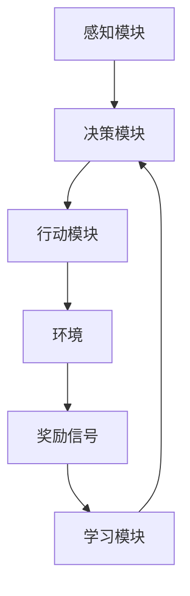

# AI Agent的情境适应学习：提高在复杂环境中的表现

> 关键词：AI Agent、情境适应学习、复杂环境、强化学习、机器学习、智能体、环境感知

> 摘要：本文围绕AI Agent的情境适应学习展开，深入探讨其在复杂环境中提高表现的相关技术和方法。首先介绍了研究的背景、目的、预期读者等内容，接着阐述了AI Agent情境适应学习的核心概念与联系，包括原理和架构的示意图及流程图。详细讲解了核心算法原理和具体操作步骤，并给出Python源代码示例。对相关数学模型和公式进行了详细推导和举例说明。通过项目实战，展示了代码的实际案例和详细解释。分析了AI Agent情境适应学习的实际应用场景，推荐了学习、开发工具框架以及相关论文著作等资源。最后总结了未来发展趋势与挑战，并提供常见问题与解答及扩展阅读参考资料，旨在为读者全面深入地了解AI Agent的情境适应学习提供有价值的参考。

## 1. 背景介绍 
### 1.1 目的和范围
随着人工智能技术的不断发展，AI Agent在各个领域的应用越来越广泛。然而，现实世界中的环境往往是复杂多变的，传统的AI Agent在面对复杂环境时，其表现可能会受到限制。本研究的目的在于深入探讨AI Agent的情境适应学习机制，以提高其在复杂环境中的表现。范围涵盖了情境适应学习的理论基础、核心算法、数学模型、实际应用案例等多个方面，旨在为相关领域的研究和实践提供全面的指导。

### 1.2 预期读者
本文预期读者包括人工智能领域的研究人员、程序员、软件架构师、对AI Agent技术感兴趣的开发者以及相关专业的学生等。希望通过本文的介绍，能够帮助读者深入理解AI Agent的情境适应学习技术，为其在实际工作和学习中提供有益的参考。

### 1.3 文档结构概述
本文将按照以下结构进行组织：首先介绍AI Agent情境适应学习的背景信息，包括目的、预期读者和文档结构概述等；接着阐述核心概念与联系，包括相关原理和架构的示意图及流程图；详细讲解核心算法原理和具体操作步骤，并给出Python源代码示例；对相关数学模型和公式进行详细推导和举例说明；通过项目实战展示代码的实际案例和详细解释；分析实际应用场景；推荐学习、开发工具框架以及相关论文著作等资源；最后总结未来发展趋势与挑战，提供常见问题与解答及扩展阅读参考资料。

### 1.4 术语表
#### 1.4.1 核心术语定义
- **AI Agent（人工智能智能体）**：是指能够感知环境、做出决策并采取行动的智能实体。它可以是软件程序、机器人等，通过与环境的交互来实现特定的目标。
- **情境适应学习**：是指AI Agent在不同的环境情境下，能够自动调整自身的行为和策略，以适应环境变化并提高任务执行的效果。
- **复杂环境**：是指具有高度不确定性、动态性、多样性和复杂性的环境，其中包含多种因素和变量，这些因素之间相互作用，使得环境的状态难以预测和控制。

#### 1.4.2 相关概念解释
- **环境感知**：AI Agent通过各种传感器获取环境信息的过程，包括环境的状态、特征、变化等。
- **决策制定**：AI Agent根据感知到的环境信息，结合自身的目标和策略，选择合适的行动方案的过程。
- **强化学习**：是一种机器学习方法，通过智能体与环境的交互，根据环境反馈的奖励信号来学习最优的行为策略。

#### 1.4.3 缩略词列表
- **RL**：Reinforcement Learning，强化学习
- **MDP**：Markov Decision Process，马尔可夫决策过程

## 2. 核心概念与联系 

### 核心概念原理
AI Agent的情境适应学习基于环境感知、决策制定和行动执行的循环过程。AI Agent首先通过传感器感知环境的状态和特征，然后根据这些信息进行决策，选择合适的行动。行动执行后，环境会反馈奖励信号，AI Agent根据奖励信号来评估自己的行为，并调整后续的决策策略，以提高在环境中的表现。

### 架构的文本示意图
AI Agent的情境适应学习架构主要包括以下几个部分：
1. **感知模块**：负责获取环境的信息，如视觉、听觉、触觉等传感器数据。
2. **决策模块**：根据感知到的环境信息，结合自身的目标和策略，选择合适的行动。
3. **行动模块**：执行决策模块选择的行动，与环境进行交互。
4. **学习模块**：根据环境反馈的奖励信号，更新自身的策略和模型，以提高在环境中的表现。

以下是其文本示意图：

```plaintext
+-------------------+
|    感知模块       |
|  (获取环境信息)   |
+-------------------+
        |
        v
+-------------------+
|    决策模块       |
|  (选择行动方案)   |
+-------------------+
        |
        v
+-------------------+
|    行动模块       |
|  (执行行动)       |
+-------------------+
        |
        v
+-------------------+
|    环境           |
|  (反馈奖励信号)   |
+-------------------+
        |
        v
+-------------------+
|    学习模块       |
|  (更新策略模型)   |
+-------------------+
```

### Mermaid流程图


## 3. 核心算法原理 & 具体操作步骤 

### 核心算法原理 - 强化学习
强化学习是AI Agent情境适应学习中常用的算法之一。其基本思想是智能体通过与环境的交互，根据环境反馈的奖励信号来学习最优的行为策略。在强化学习中，环境通常被建模为马尔可夫决策过程（MDP），MDP由状态集合 $S$、动作集合 $A$、状态转移概率 $P(s'|s,a)$、奖励函数 $R(s,a,s')$ 和折扣因子 $\gamma$ 组成。

智能体的目标是最大化长期累积奖励，通常用价值函数来表示。价值函数可以分为状态价值函数 $V(s)$ 和动作价值函数 $Q(s,a)$。状态价值函数 $V(s)$ 表示从状态 $s$ 开始，遵循某个策略 $\pi$ 所能获得的长期累积奖励的期望值；动作价值函数 $Q(s,a)$ 表示在状态 $s$ 下采取动作 $a$，遵循某个策略 $\pi$ 所能获得的长期累积奖励的期望值。

### 具体操作步骤
1. **初始化**：初始化状态价值函数 $V(s)$ 或动作价值函数 $Q(s,a)$，以及策略 $\pi$。
2. **环境交互**：智能体根据当前的策略 $\pi$ 在环境中选择动作 $a$，执行动作并观察环境的反馈，包括下一个状态 $s'$ 和奖励 $r$。
3. **更新价值函数**：根据环境反馈的奖励信号，更新状态价值函数 $V(s)$ 或动作价值函数 $Q(s,a)$。
4. **更新策略**：根据更新后的价值函数，更新策略 $\pi$。
5. **重复步骤2 - 4**：直到满足终止条件，如达到最大迭代次数或价值函数收敛。

### Python源代码示例
```python
import numpy as np

# 定义环境参数
num_states = 5
num_actions = 2
gamma = 0.9  # 折扣因子

# 初始化动作价值函数 Q(s,a)
Q = np.zeros((num_states, num_actions))

# 定义环境的状态转移概率和奖励函数
# 这里简单假设一个固定的状态转移和奖励
def transition(s, a):
    if a == 0:
        s_next = (s + 1) % num_states
    else:
        s_next = (s - 1) % num_states
    r = 1 if s_next == 0 else 0
    return s_next, r

# 定义策略：epsilon-greedy 策略
epsilon = 0.1
def epsilon_greedy_policy(s):
    if np.random.uniform(0, 1) < epsilon:
        a = np.random.choice(num_actions)
    else:
        a = np.argmax(Q[s])
    return a

# 执行 Q-learning 算法
num_episodes = 1000
for episode in range(num_episodes):
    s = np.random.randint(0, num_states)  # 随机初始化状态
    done = False
    while not done:
        a = epsilon_greedy_policy(s)
        s_next, r = transition(s, a)
        # Q-learning 更新公式
        Q[s, a] = Q[s, a] + 0.1 * (r + gamma * np.max(Q[s_next]) - Q[s, a])
        s = s_next
        if s == 0:
            done = True

print("最终的 Q 函数：")
print(Q)
```

## 4. 数学模型和公式 & 详细讲解 & 举例说明 

### 马尔可夫决策过程（MDP）
马尔可夫决策过程（MDP）是强化学习中常用的数学模型，它由以下几个部分组成：
- **状态集合 $S$**：表示环境的所有可能状态。
- **动作集合 $A$**：表示智能体可以采取的所有可能动作。
- **状态转移概率 $P(s'|s,a)$**：表示在状态 $s$ 下采取动作 $a$ 后，转移到状态 $s'$ 的概率。
- **奖励函数 $R(s,a,s')$**：表示在状态 $s$ 下采取动作 $a$ 后转移到状态 $s'$ 所获得的奖励。
- **折扣因子 $\gamma$**：取值范围为 $[0,1]$，用于权衡即时奖励和未来奖励的重要性。

### 价值函数
- **状态价值函数 $V^\pi(s)$**：表示在策略 $\pi$ 下，从状态 $s$ 开始所能获得的长期累积奖励的期望值，定义为：
$$V^\pi(s) = \mathbb{E}_\pi\left[\sum_{t=0}^{\infty}\gamma^tR_{t+1}|S_0 = s\right]$$
其中，$\mathbb{E}_\pi$ 表示在策略 $\pi$ 下的期望，$R_{t+1}$ 表示第 $t+1$ 时刻的奖励，$S_0$ 表示初始状态。

- **动作价值函数 $Q^\pi(s,a)$**：表示在策略 $\pi$ 下，在状态 $s$ 下采取动作 $a$ 所能获得的长期累积奖励的期望值，定义为：
$$Q^\pi(s,a) = \mathbb{E}_\pi\left[\sum_{t=0}^{\infty}\gamma^tR_{t+1}|S_0 = s, A_0 = a\right]$$
其中，$A_0$ 表示初始动作。

### 贝尔曼方程
状态价值函数和动作价值函数满足贝尔曼方程，这是强化学习中非常重要的方程。
- **状态价值函数的贝尔曼方程**：
$$V^\pi(s) = \sum_{a\in A}\pi(a|s)\sum_{s'\in S}P(s'|s,a)\left[R(s,a,s') + \gamma V^\pi(s')\right]$$
其中，$\pi(a|s)$ 表示在状态 $s$ 下采取动作 $a$ 的概率。

- **动作价值函数的贝尔曼方程**：
$$Q^\pi(s,a) = \sum_{s'\in S}P(s'|s,a)\left[R(s,a,s') + \gamma\sum_{a'\in A}\pi(a'|s')Q^\pi(s',a')\right]$$

### 举例说明
假设一个简单的环境，有两个状态 $S = \{s_1, s_2\}$，两个动作 $A = \{a_1, a_2\}$。状态转移概率和奖励函数如下：
- $P(s_1|s_1,a_1) = 0.8$，$P(s_2|s_1,a_1) = 0.2$，$R(s_1,a_1,s_1) = 1$，$R(s_1,a_1,s_2) = 0$
- $P(s_1|s_1,a_2) = 0.3$，$P(s_2|s_1,a_2) = 0.7$，$R(s_1,a_2,s_1) = 0$，$R(s_1,a_2,s_2) = 2$
- 同理定义状态 $s_2$ 下的状态转移概率和奖励函数。

假设折扣因子 $\gamma = 0.9$，策略 $\pi$ 是一个随机策略，即 $\pi(a_1|s_1) = \pi(a_2|s_1) = 0.5$。

根据状态价值函数的贝尔曼方程，计算 $V^\pi(s_1)$：
$$
\begin{align*}
V^\pi(s_1) &= \pi(a_1|s_1)\sum_{s'\in S}P(s'|s_1,a_1)\left[R(s_1,a_1,s') + \gamma V^\pi(s')\right] + \pi(a_2|s_1)\sum_{s'\in S}P(s'|s_1,a_2)\left[R(s_1,a_2,s') + \gamma V^\pi(s')\right]\\
&= 0.5\times(0.8\times(1 + 0.9V^\pi(s_1)) + 0.2\times(0 + 0.9V^\pi(s_2))) + 0.5\times(0.3\times(0 + 0.9V^\pi(s_1)) + 0.7\times(2 + 0.9V^\pi(s_2)))
\end{align*}
$$
同理可以计算 $V^\pi(s_2)$，通过联立方程组求解可以得到状态价值函数的值。

## 5. 项目实战：代码实际案例和详细解释说明 

### 5.1  开发环境搭建
在进行项目实战之前，需要搭建相应的开发环境。以下是具体步骤：
1. **安装Python**：建议安装Python 3.6及以上版本，可以从Python官方网站（https://www.python.org/downloads/） 下载并安装。
2. **安装必要的库**：本项目需要使用 `numpy` 库进行数值计算，可以使用以下命令进行安装：
```sh
pip install numpy
```

### 5.2  源代码详细实现和代码解读
以下是一个基于OpenAI Gym环境的AI Agent情境适应学习的项目实战代码：
```python
import gym
import numpy as np

# 创建环境
env = gym.make('CartPole-v1')

# 定义超参数
num_episodes = 1000
max_steps_per_episode = 200
learning_rate = 0.1
discount_factor = 0.99
epsilon = 1
epsilon_decay = 0.995
epsilon_min = 0.01

# 离散化状态空间
state_space_size = env.observation_space.shape[0]
action_space_size = env.action_space.n

# 初始化 Q 表
q_table = np.zeros((state_space_size, action_space_size))

# 定义 epsilon-greedy 策略
def epsilon_greedy_policy(state):
    if np.random.uniform(0, 1) < epsilon:
        action = env.action_space.sample()
    else:
        action = np.argmax(q_table[state])
    return action

# 训练循环
for episode in range(num_episodes):
    state = env.reset()
    state = tuple(map(int, state * 10))  # 离散化状态
    done = False
    for step in range(max_steps_per_episode):
        action = epsilon_greedy_policy(state)
        next_state, reward, done, _ = env.step(action)
        next_state = tuple(map(int, next_state * 10))  # 离散化状态

        # Q-learning 更新公式
        q_table[state][action] = q_table[state][action] + learning_rate * (
            reward + discount_factor * np.max(q_table[next_state]) - q_table[state][action]
        )

        state = next_state

        if done:
            break

    # 更新 epsilon
    if epsilon > epsilon_min:
        epsilon *= epsilon_decay

# 测试训练好的智能体
state = env.reset()
state = tuple(map(int, state * 10))  # 离散化状态
done = False
total_reward = 0
while not done:
    action = np.argmax(q_table[state])
    next_state, reward, done, _ = env.step(action)
    next_state = tuple(map(int, next_state * 10))  # 离散化状态
    state = next_state
    total_reward += reward
    env.render()

print(f"测试总奖励: {total_reward}")

env.close()
```

### 5.3  代码解读与分析
1. **环境创建**：使用 `gym.make('CartPole-v1')` 创建OpenAI Gym的 `CartPole-v1` 环境。
2. **超参数定义**：定义了训练的相关超参数，如 `num_episodes`（训练的回合数）、`max_steps_per_episode`（每个回合的最大步数）、`learning_rate`（学习率）、`discount_factor`（折扣因子）、`epsilon`（探索率）等。
3. **Q 表初始化**：初始化一个 $Q$ 表，用于存储每个状态 - 动作对的价值。
4. **epsilon-greedy 策略**：定义了一个 `epsilon-greedy` 策略，用于在训练过程中平衡探索和利用。
5. **训练循环**：在每个回合中，智能体根据 `epsilon-greedy` 策略选择动作，与环境进行交互，根据环境反馈的奖励信号更新 $Q$ 表。
6. **epsilon 更新**：在每个回合结束后，更新探索率 `epsilon`，使其逐渐减小，以增加利用的比例。
7. **测试智能体**：使用训练好的 $Q$ 表，让智能体在环境中进行测试，观察其表现并计算总奖励。

## 6. 实际应用场景 
### 机器人导航
在机器人导航领域，AI Agent需要在复杂的环境中找到从起点到终点的路径。环境可能包含障碍物、动态变化的物体等，AI Agent需要通过情境适应学习，根据不同的环境情境调整自己的导航策略，如选择合适的路径、避开障碍物等。

### 自动驾驶
自动驾驶汽车需要在各种复杂的交通环境中行驶，包括不同的道路条件、交通规则、其他车辆和行人等。AI Agent通过情境适应学习，能够根据实时的交通状况和环境信息，做出合理的驾驶决策，如加速、减速、转弯等，以确保行车安全和高效。

### 游戏AI
在游戏领域，AI Agent需要与其他玩家或游戏环境进行交互。不同的游戏场景和对手会带来不同的挑战，AI Agent通过情境适应学习，能够根据游戏情境调整自己的策略和行为，提高游戏表现，如在即时战略游戏中选择合适的战术、在角色扮演游戏中选择合适的技能等。

### 智能客服
智能客服系统需要处理各种用户的问题和需求，不同的用户具有不同的语言风格、问题类型和情绪状态。AI Agent通过情境适应学习，能够根据用户的情境信息，如问题的主题、用户的语气等，提供更加个性化和准确的回答，提高用户满意度。

## 7. 工具和资源推荐
### 7.1 学习资源推荐
#### 7.1.1 书籍推荐
- 《Reinforcement Learning: An Introduction》（《强化学习：原理与Python实现》）：由Richard S. Sutton和Andrew G. Barto所著，是强化学习领域的经典教材，详细介绍了强化学习的基本概念、算法和应用。
- 《Artificial Intelligence: A Modern Approach》（《人工智能：一种现代的方法》）：由Stuart Russell和Peter Norvig所著，全面介绍了人工智能的各个领域，包括AI Agent、机器学习、搜索算法等。

#### 7.1.2 在线课程
- Coursera上的“Reinforcement Learning Specialization”：由University of Alberta提供，包含多个强化学习相关的课程，从基础概念到高级算法都有涉及。
- edX上的“Introduction to Artificial Intelligence”：由UC Berkeley提供，介绍了人工智能的基本概念和方法，包括AI Agent的相关内容。

#### 7.1.3 技术博客和网站
- OpenAI Blog（https://openai.com/blog/）：OpenAI官方博客，提供了人工智能领域的最新研究成果和技术动态。
- Medium上的“Towards Data Science”（https://towardsdatascience.com/）：有很多关于机器学习、人工智能的技术文章和教程。

### 7.2 开发工具框架推荐
#### 7.2.1 IDE和编辑器
- PyCharm：是一款专门为Python开发设计的集成开发环境，具有强大的代码编辑、调试和自动完成等功能。
- Visual Studio Code：是一款轻量级的代码编辑器，支持多种编程语言，有丰富的插件可以扩展功能。

#### 7.2.2 调试和性能分析工具
- PDB：Python自带的调试器，可以帮助开发者调试Python代码，定位问题。
- cProfile：Python的性能分析工具，可以分析代码的运行时间和函数调用情况，帮助优化代码性能。

#### 7.2.3 相关框架和库
- OpenAI Gym：是一个用于开发和比较强化学习算法的工具包，提供了多种环境和基准测试。
- Stable Baselines3：是一个基于PyTorch的强化学习库，提供了多种预训练的强化学习算法和模型。

### 7.3 相关论文著作推荐
#### 7.3.1 经典论文
- “Q-learning” by Watkins, C. J. C. H., & Dayan, P.：介绍了Q-learning算法，是强化学习领域的经典论文之一。
- “Policy Gradient Methods for Reinforcement Learning with Function Approximation” by Sutton, R. S., McAllester, D. A., Singh, S. P., & Mansour, Y.：提出了策略梯度方法，为强化学习中的策略优化提供了重要的理论基础。

#### 7.3.2 最新研究成果
- 关注顶级学术会议如NeurIPS（Conference on Neural Information Processing Systems）、ICML（International Conference on Machine Learning）等，这些会议上会发表很多关于AI Agent和情境适应学习的最新研究成果。

#### 7.3.3 应用案例分析
- 可以参考一些实际应用案例的论文，如关于机器人导航、自动驾驶等领域的论文，了解AI Agent在实际场景中的应用和优化方法。

## 8. 总结：未来发展趋势与挑战
### 未来发展趋势
- **多智能体协同学习**：未来的AI Agent将更多地与其他智能体进行协同工作，如多个机器人在复杂环境中协作完成任务。多智能体协同学习将成为研究的热点，通过智能体之间的信息共享和协作，提高整体的任务执行效率和效果。
- **结合深度学习**：深度学习在图像识别、自然语言处理等领域取得了巨大的成功，将深度学习与AI Agent的情境适应学习相结合，可以更好地处理复杂的环境信息，提高智能体的感知和决策能力。
- **迁移学习和元学习**：迁移学习和元学习可以帮助AI Agent更快地适应新的环境和任务，通过利用已有的知识和经验，减少学习的时间和成本。未来的研究将更加注重这方面的发展，提高智能体的泛化能力和适应性。

### 挑战
- **环境复杂性**：现实世界的环境非常复杂，包含大量的不确定性和动态变化，如何让AI Agent在这样的环境中高效地学习和适应是一个巨大的挑战。
- **可解释性**：AI Agent的决策过程往往比较复杂，难以解释其决策的依据。在一些关键领域，如医疗、金融等，可解释性是非常重要的，如何提高AI Agent决策的可解释性是一个亟待解决的问题。
- **数据隐私和安全**：AI Agent在学习过程中需要大量的数据，这些数据可能包含用户的隐私信息。如何保护数据的隐私和安全，防止数据泄露和滥用，是一个重要的挑战。

## 9. 附录：常见问题与解答
### Q1：什么是AI Agent的情境适应学习？
A1：AI Agent的情境适应学习是指AI Agent在不同的环境情境下，能够自动调整自身的行为和策略，以适应环境变化并提高任务执行的效果。

### Q2：强化学习在情境适应学习中起到什么作用？
A2：强化学习是AI Agent情境适应学习中常用的算法之一，通过智能体与环境的交互，根据环境反馈的奖励信号来学习最优的行为策略，从而实现情境适应学习。

### Q3：如何选择合适的超参数？
A3：选择合适的超参数需要进行实验和调优。可以通过网格搜索、随机搜索等方法，在不同的超参数组合下进行实验，选择性能最优的超参数组合。

### Q4：AI Agent的情境适应学习在实际应用中有哪些限制？
A4：AI Agent的情境适应学习在实际应用中可能受到环境复杂性、数据隐私和安全、可解释性等方面的限制。例如，在复杂的环境中，智能体可能难以准确地感知环境信息和做出合理的决策；数据隐私和安全问题可能导致数据泄露和滥用；可解释性问题可能影响智能体在关键领域的应用。

## 10. 扩展阅读 & 参考资料
- Richard S. Sutton, Andrew G. Barto. Reinforcement Learning: An Introduction. MIT Press, 2018.
- Stuart Russell, Peter Norvig. Artificial Intelligence: A Modern Approach. Pearson, 2020.
- Watkins, C. J. C. H., & Dayan, P. Q-learning. Machine learning, 8(3-4), 279-292, 1992.
- Sutton, R. S., McAllester, D. A., Singh, S. P., & Mansour, Y. Policy Gradient Methods for Reinforcement Learning with Function Approximation. Advances in neural information processing systems, 1057-1063, 2000.
- OpenAI Gym官方文档（https://gym.openai.com/docs/）
- Stable Baselines3官方文档（https://stable-baselines3.readthedocs.io/en/master/）