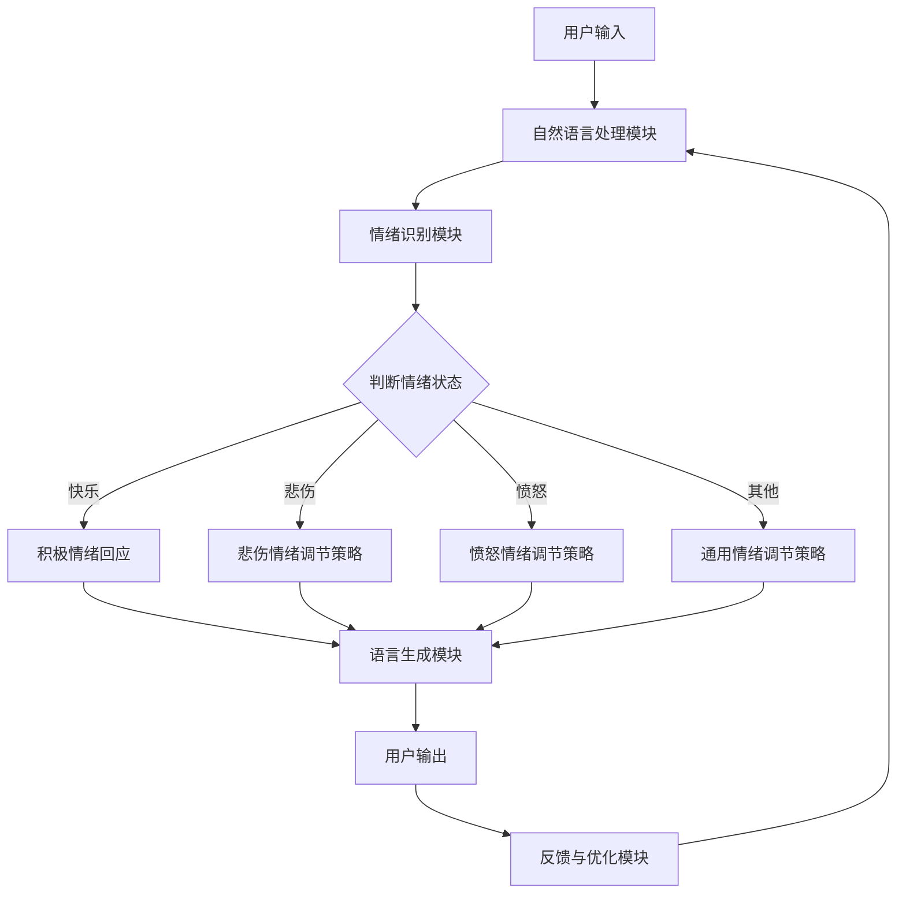

# AI Agent的情绪调节功能：LLM驱动的心理健康助手

> 关键词：AI Agent、情绪调节、大语言模型（LLM）、心理健康助手、自然语言处理

> 摘要：本文围绕AI Agent的情绪调节功能展开，探讨以大语言模型（LLM）驱动的心理健康助手的相关技术与应用。首先介绍了该领域的背景，包括目的、预期读者等内容。接着阐述了核心概念与联系，详细讲解了核心算法原理和具体操作步骤，通过Python代码进行了说明。同时给出了相关的数学模型和公式，并结合实际案例进行分析。还介绍了项目实战的具体过程，包括开发环境搭建、源代码实现与解读等。此外，探讨了实际应用场景，推荐了相关的工具和资源。最后对未来发展趋势与挑战进行了总结，并提供了常见问题解答和参考资料，旨在为开发和使用基于LLM的心理健康助手提供全面的技术参考。

## 1. 背景介绍 
### 1.1 目的和范围
在当今快节奏的社会中，人们面临着各种各样的压力，心理健康问题日益受到关注。AI Agent的情绪调节功能，尤其是基于大语言模型（LLM）驱动的心理健康助手，旨在为人们提供一种便捷、高效且个性化的心理健康支持。其范围涵盖了从情绪识别、情绪分析到提供情绪调节策略等多个方面，通过自然语言交互的方式，帮助用户更好地管理自己的情绪，缓解心理压力。

### 1.2 预期读者
本文预期读者包括从事人工智能、自然语言处理、心理健康相关领域的研究人员、开发者，以及对AI Agent在心理健康领域应用感兴趣的爱好者。同时，心理健康从业者也可以通过本文了解如何借助AI技术提升心理健康服务的质量和效率。

### 1.3 文档结构概述
本文将按照以下结构进行阐述：首先介绍核心概念与联系，明确相关术语和概念的定义；接着详细讲解核心算法原理和具体操作步骤，并通过Python代码进行实现；然后给出数学模型和公式，进一步解释算法的原理；再通过项目实战，展示如何开发一个基于LLM的心理健康助手，包括开发环境搭建、源代码实现和代码解读；之后探讨该技术的实际应用场景；推荐相关的工具和资源；最后总结未来发展趋势与挑战，并提供常见问题解答和参考资料。

### 1.4 术语表
#### 1.4.1 核心术语定义
- **AI Agent（人工智能代理）**：是一种能够感知环境、自主决策并采取行动以实现特定目标的智能实体。在本文中，指的是具备情绪调节功能的智能程序。
- **大语言模型（LLM）**：是一种基于深度学习的自然语言处理模型，通过对大量文本数据的学习，能够生成自然语言文本，理解语言的语义和上下文信息。
- **情绪调节**：是指个体管理和改变自己或他人情绪的过程，包括情绪的识别、评估和调整等环节。
- **心理健康助手**：是一种借助AI技术，为用户提供心理健康支持和帮助的工具或服务。

#### 1.4.2 相关概念解释
- **自然语言处理（NLP）**：是人工智能的一个重要领域，研究如何让计算机理解、处理和生成自然语言。在基于LLM的心理健康助手中，NLP技术用于实现用户与AI Agent之间的自然语言交互。
- **情感分析**：是自然语言处理的一个子任务，旨在识别文本中表达的情感倾向，如积极、消极或中性。在情绪调节功能中，情感分析用于识别用户的情绪状态。

#### 1.4.3 缩略词列表
- **LLM**：Large Language Model（大语言模型）
- **NLP**：Natural Language Processing（自然语言处理）

## 2. 核心概念与联系 

### 核心概念原理
基于LLM的心理健康助手的核心原理是利用大语言模型强大的语言理解和生成能力，实现与用户的自然语言交互，并在此基础上进行情绪识别、分析和调节。具体来说，用户通过自然语言向心理健康助手表达自己的情绪和困扰，助手利用LLM对用户输入的文本进行语义理解，识别出用户的情绪状态。然后，根据预设的情绪调节策略和知识，生成相应的回应和建议，帮助用户调节情绪。

### 架构的文本示意图
该心理健康助手的架构主要包括以下几个部分：
1. **用户界面**：用户与心理健康助手进行交互的界面，可以是网页、移动应用或聊天机器人等形式。
2. **自然语言处理模块**：负责对用户输入的文本进行处理，包括分词、词性标注、命名实体识别等操作，以及利用LLM进行语义理解和情感分析。
3. **情绪识别模块**：根据自然语言处理模块的输出，识别用户的情绪状态，如快乐、悲伤、愤怒等。
4. **情绪调节策略库**：存储各种情绪调节策略和知识，根据用户的情绪状态和需求，提供相应的建议和指导。
5. **语言生成模块**：利用LLM生成自然语言文本，将情绪调节策略以自然、流畅的语言形式呈现给用户。
6. **反馈与优化模块**：收集用户的反馈信息，对系统的性能和效果进行评估和优化。

### Mermaid流程图


## 3. 核心算法原理 & 具体操作步骤 

### 核心算法原理
基于LLM的心理健康助手的核心算法主要包括自然语言处理算法和情绪调节算法。

#### 自然语言处理算法
自然语言处理算法主要利用大语言模型进行语义理解和情感分析。以Hugging Face的Transformers库为例，我们可以使用预训练的语言模型，如BERT、GPT等，对用户输入的文本进行编码和分类。具体来说，将用户输入的文本转换为词向量，然后输入到预训练的语言模型中，通过模型的输出进行情感分类。

#### 情绪调节算法
情绪调节算法根据用户的情绪状态，从情绪调节策略库中选择合适的策略和建议。可以使用规则引擎或机器学习算法来实现情绪调节策略的选择。例如，对于悲伤情绪，可以选择一些鼓励、安慰的话语和放松的方法；对于愤怒情绪，可以选择一些情绪宣泄和冷静思考的方法。

### 具体操作步骤
#### 步骤1：数据预处理
对用户输入的文本进行预处理，包括去除特殊字符、分词、词干提取等操作，以提高文本的质量和可处理性。

#### 步骤2：情感分析
使用预训练的语言模型对预处理后的文本进行情感分析，判断用户的情绪状态。

#### 步骤3：情绪调节策略选择
根据用户的情绪状态，从情绪调节策略库中选择合适的策略和建议。

#### 步骤4：语言生成
利用LLM生成自然语言文本，将情绪调节策略以自然、流畅的语言形式呈现给用户。

#### 步骤5：反馈与优化
收集用户的反馈信息，对系统的性能和效果进行评估和优化。

### Python源代码实现
```python
import torch
from transformers import AutoTokenizer, AutoModelForSequenceClassification

# 加载预训练的情感分析模型
tokenizer = AutoTokenizer.from_pretrained("distilbert-base-uncased-finetuned-sst-2-english")
model = AutoModelForSequenceClassification.from_pretrained("distilbert-base-uncased-finetuned-sst-2-english")

# 定义情绪调节策略库
emotion_strategies = {
    "positive": ["你今天心情很不错呀，继续保持这份快乐哦！", "希望你的好心情能一直延续下去！"],
    "negative": ["别太难过啦，一切都会好起来的。可以试着听一些舒缓的音乐放松一下。", "难过的时候不妨找朋友聊聊天，倾诉一下也许会感觉好一些。"]
}

def preprocess_text(text):
    """
    文本预处理函数
    """
    # 去除特殊字符
    text = text.replace("!", "").replace("?", "").replace(".", "")
    return text

def sentiment_analysis(text):
    """
    情感分析函数
    """
    inputs = tokenizer(text, return_tensors="pt")
    outputs = model(**inputs)
    logits = outputs.logits
    prediction = torch.argmax(logits, dim=1)
    if prediction.item() == 0:
        return "negative"
    else:
        return "positive"

def get_emotion_strategy(emotion):
    """
    获取情绪调节策略函数
    """
    import random
    if emotion in emotion_strategies:
        return random.choice(emotion_strategies[emotion])
    else:
        return "很抱歉，暂时没有适合的建议。"

def generate_response(text):
    """
    生成回应函数
    """
    preprocessed_text = preprocess_text(text)
    emotion = sentiment_analysis(preprocessed_text)
    strategy = get_emotion_strategy(emotion)
    return strategy

# 示例
user_input = "今天心情好糟糕啊。"
response = generate_response(user_input)
print(response)
```

## 4. 数学模型和公式 & 详细讲解 & 举例说明 

### 数学模型
在基于LLM的心理健康助手中，主要涉及到的数学模型包括词向量表示模型和分类模型。

#### 词向量表示模型
词向量表示模型将文本中的每个词转换为一个向量，以便计算机能够处理和理解。常见的词向量表示模型有Word2Vec、GloVe等。在基于Transformer的大语言模型中，通常使用基于注意力机制的词向量表示方法，如BERT中的词嵌入层。

#### 分类模型
分类模型用于对用户的情绪状态进行分类，常见的分类模型有逻辑回归、支持向量机、神经网络等。在基于LLM的心理健康助手中，通常使用预训练的语言模型进行分类，如BERT、GPT等。

### 数学公式
#### 词向量表示
在基于Transformer的大语言模型中，词向量表示可以表示为：
$$\mathbf{e}_i = \text{Embedding}(w_i)$$
其中，$\mathbf{e}_i$ 表示第 $i$ 个词的词向量，$w_i$ 表示第 $i$ 个词，$\text{Embedding}$ 表示词嵌入层。

#### 分类模型
在基于预训练语言模型的分类任务中，分类模型的输出可以表示为：
$$\hat{y} = \text{softmax}(\mathbf{W} \cdot \mathbf{h} + \mathbf{b})$$
其中，$\hat{y}$ 表示分类结果的概率分布，$\mathbf{W}$ 表示权重矩阵，$\mathbf{h}$ 表示预训练语言模型的输出，$\mathbf{b}$ 表示偏置向量，$\text{softmax}$ 表示softmax函数。

### 详细讲解
词向量表示模型的作用是将文本中的词转换为向量，以便计算机能够处理和理解。在基于Transformer的大语言模型中，词嵌入层将每个词映射到一个高维向量空间中，使得语义相近的词在向量空间中距离较近。分类模型的作用是根据词向量表示模型的输出，对用户的情绪状态进行分类。在基于预训练语言模型的分类任务中，通常使用softmax函数将模型的输出转换为概率分布，然后选择概率最大的类别作为分类结果。

### 举例说明
假设我们有一个文本 “今天心情好糟糕啊。”，首先使用词向量表示模型将文本中的每个词转换为向量，然后将这些向量输入到预训练的语言模型中，得到模型的输出。接着，将模型的输出输入到分类模型中，使用softmax函数计算每个类别的概率，最后选择概率最大的类别作为分类结果。如果分类结果为 “negative”，则从情绪调节策略库中选择相应的策略和建议，如 “别太难过啦，一切都会好起来的。可以试着听一些舒缓的音乐放松一下。”。

## 5. 项目实战：代码实际案例和详细解释说明 

### 5.1  开发环境搭建
#### 安装Python
首先需要安装Python环境，建议使用Python 3.7及以上版本。可以从Python官方网站（https://www.python.org/downloads/） 下载并安装Python。

#### 安装依赖库
使用pip命令安装项目所需的依赖库，包括transformers、torch等。
```bash
pip install transformers torch
```

### 5.2  源代码详细实现和代码解读
```python
import torch
from transformers import AutoTokenizer, AutoModelForSequenceClassification

# 加载预训练的情感分析模型
tokenizer = AutoTokenizer.from_pretrained("distilbert-base-uncased-finetuned-sst-2-english")
model = AutoModelForSequenceClassification.from_pretrained("distilbert-base-uncased-finetuned-sst-2-english")

# 定义情绪调节策略库
emotion_strategies = {
    "positive": ["你今天心情很不错呀，继续保持这份快乐哦！", "希望你的好心情能一直延续下去！"],
    "negative": ["别太难过啦，一切都会好起来的。可以试着听一些舒缓的音乐放松一下。", "难过的时候不妨找朋友聊聊天，倾诉一下也许会感觉好一些。"]
}

def preprocess_text(text):
    """
    文本预处理函数
    """
    # 去除特殊字符
    text = text.replace("!", "").replace("?", "").replace(".", "")
    return text

def sentiment_analysis(text):
    """
    情感分析函数
    """
    inputs = tokenizer(text, return_tensors="pt")
    outputs = model(**inputs)
    logits = outputs.logits
    prediction = torch.argmax(logits, dim=1)
    if prediction.item() == 0:
        return "negative"
    else:
        return "positive"

def get_emotion_strategy(emotion):
    """
    获取情绪调节策略函数
    """
    import random
    if emotion in emotion_strategies:
        return random.choice(emotion_strategies[emotion])
    else:
        return "很抱歉，暂时没有适合的建议。"

def generate_response(text):
    """
    生成回应函数
    """
    preprocessed_text = preprocess_text(text)
    emotion = sentiment_analysis(preprocessed_text)
    strategy = get_emotion_strategy(emotion)
    return strategy

# 示例
user_input = "今天心情好糟糕啊。"
response = generate_response(user_input)
print(response)
```

#### 代码解读
1. **加载预训练的情感分析模型**：使用 `AutoTokenizer` 和 `AutoModelForSequenceClassification` 从Hugging Face的模型库中加载预训练的情感分析模型。
2. **定义情绪调节策略库**：定义一个字典 `emotion_strategies`，存储不同情绪状态下的调节策略和建议。
3. **文本预处理函数**：`preprocess_text` 函数用于去除文本中的特殊字符，提高文本的质量和可处理性。
4. **情感分析函数**：`sentiment_analysis` 函数使用预训练的情感分析模型对文本进行情感分类，返回 “positive” 或 “negative”。
5. **获取情绪调节策略函数**：`get_emotion_strategy` 函数根据用户的情绪状态，从情绪调节策略库中选择合适的策略和建议。
6. **生成回应函数**：`generate_response` 函数将文本预处理、情感分析和获取情绪调节策略的步骤组合起来，生成最终的回应。

### 5.3  代码解读与分析
#### 优点
- **使用预训练的模型**：利用Hugging Face的预训练模型，减少了模型训练的时间和成本，同时提高了模型的性能。
- **简单易懂**：代码结构简单，逻辑清晰，易于理解和维护。
- **可扩展性**：可以通过修改情绪调节策略库和使用不同的预训练模型，对系统进行扩展和优化。

#### 缺点
- **语言局限性**：目前的代码只支持英文文本的情感分析，对于其他语言的支持较差。
- **情绪分类的准确性**：由于预训练模型的局限性，情绪分类的准确性可能不够高，需要进一步优化。
- **策略的多样性**：情绪调节策略库中的策略和建议相对较少，可能无法满足用户的多样化需求。

## 6. 实际应用场景 
### 个人心理健康管理
用户可以通过与基于LLM的心理健康助手进行自然语言交互，随时表达自己的情绪和困扰，获取情绪调节的建议和指导。例如，当用户感到焦虑时，助手可以提供一些放松的方法和技巧，帮助用户缓解焦虑情绪。

### 心理咨询辅助
心理健康从业者可以利用心理健康助手作为辅助工具，在心理咨询过程中，帮助用户更好地表达自己的情绪和问题，同时为从业者提供一些参考建议，提高心理咨询的效率和质量。

### 企业员工心理健康关怀
企业可以为员工提供基于LLM的心理健康助手，帮助员工缓解工作压力，提高工作效率和心理健康水平。例如，在员工面临工作压力较大时，助手可以提供一些应对压力的方法和建议。

### 教育领域
在教育领域，心理健康助手可以用于学生的心理健康教育和辅导。例如，当学生面临学习压力、人际关系等问题时，助手可以提供相应的情绪调节策略和建议，帮助学生更好地应对挑战。

## 7. 工具和资源推荐
### 7.1 学习资源推荐
#### 7.1.1 书籍推荐
- 《自然语言处理入门》：介绍了自然语言处理的基本概念、算法和技术，适合初学者学习。
- 《深度学习》：详细介绍了深度学习的原理和方法，对于理解基于LLM的心理健康助手的核心算法有很大帮助。
- 《情感分析：挖掘观点、情感和情绪》：专门介绍了情感分析的相关技术和应用，对于情绪识别和分析有深入的讲解。

#### 7.1.2 在线课程
- Coursera上的“Natural Language Processing Specialization”：由顶尖大学的教授授课，系统地介绍了自然语言处理的各个方面。
- edX上的“Deep Learning Specialization”：深入讲解了深度学习的原理和应用，包括基于Transformer的大语言模型。
- 哔哩哔哩上的一些自然语言处理和人工智能相关的视频教程，适合初学者快速入门。

#### 7.1.3 技术博客和网站
- Hugging Face官方博客：提供了关于大语言模型和自然语言处理的最新技术和应用案例。
- Medium上的人工智能和自然语言处理相关的博客文章，有很多优秀的技术分享和实践经验。
- 机器之心、新智元等人工智能领域的资讯网站，及时报道最新的技术动态和研究成果。

### 7.2 开发工具框架推荐
#### 7.2.1 IDE和编辑器
- PyCharm：一款专业的Python集成开发环境，提供了丰富的代码编辑、调试和管理功能。
- Visual Studio Code：一款轻量级的代码编辑器，支持多种编程语言，有丰富的插件可以扩展功能。

#### 7.2.2 调试和性能分析工具
- TensorBoard：用于可视化深度学习模型的训练过程和性能指标，帮助开发者进行模型调试和优化。
- Py-Spy：一款Python性能分析工具，可以分析Python程序的性能瓶颈，提高程序的运行效率。

#### 7.2.3 相关框架和库
- Hugging Face Transformers：提供了丰富的预训练语言模型和自然语言处理工具，方便开发者进行模型的加载、训练和应用。
- PyTorch：一个开源的深度学习框架，广泛应用于自然语言处理、计算机视觉等领域。
- NLTK：一个自然语言处理工具包，提供了丰富的文本处理功能，如分词、词性标注、命名实体识别等。

### 7.3 相关论文著作推荐
#### 7.3.1 经典论文
- “Attention Is All You Need”：介绍了Transformer架构，为基于大语言模型的自然语言处理奠定了基础。
- “BERT: Pre-training of Deep Bidirectional Transformers for Language Understanding”：提出了BERT模型，在自然语言处理领域取得了巨大的成功。
- “GPT: Generative Pretrained Transformer”：介绍了GPT系列模型，展示了生成式语言模型的强大能力。

#### 7.3.2 最新研究成果
- 关注ACL（Association for Computational Linguistics）、EMNLP（Conference on Empirical Methods in Natural Language Processing）等自然语言处理领域的顶级会议，了解最新的研究成果和技术趋势。
- 阅读相关的学术期刊，如Journal of Artificial Intelligence Research、Computational Linguistics等。

#### 7.3.3 应用案例分析
- 研究一些基于大语言模型的心理健康应用案例，了解其实现方法和应用效果，从中获取灵感和经验。

## 8. 总结：未来发展趋势与挑战
### 未来发展趋势
#### 个性化服务
未来的基于LLM的心理健康助手将更加注重个性化服务，根据用户的个人信息、情绪历史和偏好，提供更加精准、个性化的情绪调节策略和建议。

#### 多模态交互
除了自然语言交互，未来的心理健康助手将支持多模态交互，如语音、图像、视频等，提高用户与助手之间的交互体验。

#### 跨语言支持
随着全球化的发展，未来的心理健康助手将支持更多的语言，满足不同地区用户的需求。

#### 与其他技术的融合
未来的心理健康助手将与其他技术，如虚拟现实、增强现实、物联网等融合，提供更加全面、深入的心理健康支持服务。

### 挑战
#### 数据隐私和安全
在收集和处理用户的情绪和心理健康数据时，需要确保数据的隐私和安全，防止数据泄露和滥用。

#### 情绪理解的准确性
目前的情绪识别和分析技术还存在一定的局限性，对于复杂情绪的理解和识别还不够准确，需要进一步提高情绪理解的准确性。

#### 伦理和法律问题
基于LLM的心理健康助手的应用涉及到伦理和法律问题，如责任界定、误导用户等，需要制定相应的伦理和法律规范。

#### 技术成本
开发和维护基于LLM的心理健康助手需要较高的技术成本，包括计算资源、数据标注等，需要降低技术成本，提高系统的可扩展性和可用性。

## 9. 附录：常见问题与解答
### 问题1：基于LLM的心理健康助手能否替代心理咨询师？
解答：目前基于LLM的心理健康助手不能完全替代心理咨询师。虽然助手可以提供一些情绪调节的建议和指导，但心理咨询师具有专业的知识和经验，能够进行更深入的心理评估和治疗。心理健康助手可以作为心理咨询的辅助工具，为用户提供初步的支持和帮助。

### 问题2：如何保证心理健康助手的情绪调节策略的有效性？
解答：可以通过以下方法保证情绪调节策略的有效性：一是参考专业的心理健康知识和研究成果，确保策略的科学性；二是收集用户的反馈信息，对策略进行不断的优化和改进；三是与心理健康专家合作，对策略进行评估和验证。

### 问题3：心理健康助手如何处理用户的敏感信息？
解答：心理健康助手需要遵循严格的数据隐私和安全政策，对用户的敏感信息进行加密处理，防止数据泄露和滥用。同时，在收集用户信息时，需要获得用户的明确授权，并告知用户信息的使用目的和方式。

### 问题4：如何提高心理健康助手的情绪识别准确性？
解答：可以通过以下方法提高情绪识别准确性：一是使用更强大的预训练语言模型和更先进的自然语言处理技术；二是增加训练数据的多样性和规模，提高模型的泛化能力；三是结合多模态信息，如语音、表情等，辅助情绪识别。

## 10. 扩展阅读 & 参考资料
### 扩展阅读
- 《人工智能时代的心理健康》：探讨了人工智能技术在心理健康领域的应用和挑战，以及未来的发展趋势。
- 《情绪心理学》：介绍了情绪的基本概念、理论和研究方法，对于理解情绪调节功能有很大帮助。

### 参考资料
- Hugging Face官方文档：https://huggingface.co/docs
- PyTorch官方文档：https://pytorch.org/docs/stable/index.html
- NLTK官方文档：https://www.nltk.org/