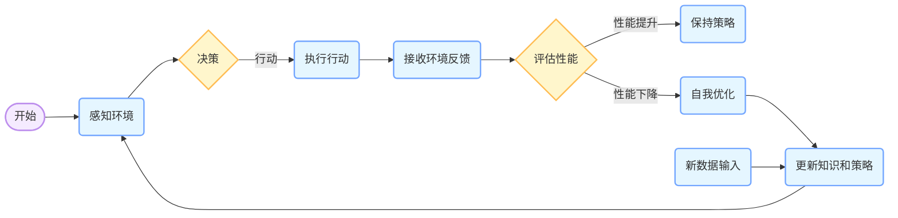

# AI Agent的持续学习与自我优化机制

> 关键词：AI Agent、持续学习、自我优化、机器学习、强化学习、知识表示、元学习

> 摘要：本文深入探讨了AI Agent的持续学习与自我优化机制。首先介绍了相关背景知识，包括目的范围、预期读者等内容。接着阐述了AI Agent、持续学习和自我优化等核心概念及其联系，通过文本示意图和Mermaid流程图进行直观展示。详细讲解了核心算法原理，并用Python代码示例辅助说明，同时给出了相关数学模型和公式。在项目实战部分，提供了开发环境搭建步骤、源代码实现及解读。探讨了AI Agent持续学习与自我优化机制在多个领域的实际应用场景。推荐了学习资源、开发工具框架和相关论文著作。最后总结了未来发展趋势与挑战，还提供了常见问题解答和扩展阅读参考资料，旨在为读者全面呈现AI Agent持续学习与自我优化机制的相关知识和技术。

## 1. 背景介绍 
### 1.1 目的和范围
AI Agent作为人工智能领域的重要组成部分，在许多实际场景中发挥着关键作用。然而，传统的AI Agent往往在面对动态变化的环境和新的任务时表现出一定的局限性。本文章的目的在于深入研究AI Agent的持续学习与自我优化机制，探讨如何使AI Agent能够不断适应新环境、学习新知识、提升自身性能。范围涵盖了持续学习与自我优化的核心概念、算法原理、数学模型、项目实战、应用场景等多个方面，旨在为读者提供全面而深入的理解。

### 1.2 预期读者
本文预期读者包括对人工智能、机器学习领域感兴趣的研究人员、开发者、学生等。对于希望深入了解AI Agent技术细节和实现方法的专业人士，文章提供了详细的算法原理和代码示例；对于初学者，通过背景知识的介绍和概念的解释，能够帮助他们建立起对AI Agent持续学习与自我优化机制的初步认识。

### 1.3 文档结构概述
本文按照以下结构进行组织：首先介绍背景知识，包括目的范围、预期读者和文档结构概述等内容。接着阐述核心概念与联系，通过文本示意图和Mermaid流程图直观展示相关概念。然后详细讲解核心算法原理，用Python代码示例进行说明，并给出相关数学模型和公式。在项目实战部分，提供开发环境搭建步骤、源代码实现及解读。探讨实际应用场景，推荐学习资源、开发工具框架和相关论文著作。最后总结未来发展趋势与挑战，提供常见问题解答和扩展阅读参考资料。

### 1.4 术语表
#### 1.4.1 核心术语定义
- **AI Agent（人工智能智能体）**：能够感知环境、做出决策并采取行动以实现特定目标的智能实体。
- **持续学习（Continual Learning）**：AI Agent在不断接收新数据的过程中，持续更新和扩展自身知识与技能，同时避免遗忘旧知识的学习方式。
- **自我优化（Self - Optimization）**：AI Agent通过对自身行为和性能的评估，自动调整内部参数和策略，以提高在各种任务和环境中的表现。

#### 1.4.2 相关概念解释
- **机器学习（Machine Learning）**：让计算机通过数据和经验自动学习模式和规律，从而做出预测和决策的技术。AI Agent的持续学习和自我优化往往依赖于机器学习算法。
- **强化学习（Reinforcement Learning）**：一种通过智能体与环境进行交互，根据环境反馈的奖励信号来学习最优行为策略的机器学习方法。在AI Agent的自我优化中，强化学习起着重要作用。
- **知识表示（Knowledge Representation）**：将知识以计算机能够理解和处理的形式进行表示的方法。对于AI Agent的持续学习，有效的知识表示是存储和利用新知识的关键。

#### 1.4.3 缩略词列表
- **ML（Machine Learning）**：机器学习
- **RL（Reinforcement Learning）**：强化学习
- **CL（Continual Learning）**：持续学习

## 2. 核心概念与联系 

### 核心概念原理
#### AI Agent
AI Agent是一个具有感知、决策和行动能力的智能实体。它通过传感器感知周围环境的状态信息，然后根据内部的决策机制选择合适的行动，最后通过执行器将行动施加到环境中。例如，在一个机器人导航任务中，机器人作为AI Agent，通过摄像头、激光雷达等传感器感知周围的障碍物和路径信息，然后根据导航算法做出决策，控制电机驱动轮子移动。

#### 持续学习
持续学习的核心思想是让AI Agent能够在不断接收新数据的过程中持续提升自身能力。传统的机器学习模型通常是在固定的数据集上进行训练，当遇到新的数据或任务时，需要重新进行训练。而持续学习要求模型能够在不遗忘旧知识的前提下，不断学习新知识。这需要解决诸如灾难性遗忘（Catastrophic Forgetting）等问题，即模型在学习新任务时忘记了之前学习的任务。

#### 自我优化
自我优化是AI Agent根据自身的性能评估结果自动调整内部参数和策略的过程。AI Agent通过与环境的交互获得反馈信息，例如奖励信号、错误率等，然后根据这些反馈信息对自身的决策机制和行为策略进行优化。例如，在一个游戏AI中，AI Agent根据游戏得分情况调整自己的游戏策略，以提高游戏表现。

### 架构的文本示意图
AI Agent的持续学习与自我优化机制的架构可以描述如下：AI Agent包含感知模块、决策模块、行动模块和学习优化模块。感知模块负责收集环境信息，将其传递给决策模块。决策模块根据当前的知识和策略做出决策，然后通过行动模块执行决策。学习优化模块接收环境的反馈信息，对AI Agent的知识和策略进行更新和优化。同时，持续学习过程中会不断有新的数据输入，学习优化模块需要处理这些新数据，以实现知识的积累和能力的提升。

### Mermaid流程图


## 3. 核心算法原理 & 具体操作步骤 

### 持续学习算法原理 - 弹性权重巩固（Elastic Weight Consolidation, EWC）
弹性权重巩固算法的核心思想是通过引入一个正则化项来保护模型中对旧任务重要的参数，从而减轻灾难性遗忘问题。

#### 原理讲解
设模型的参数为 $\theta$，对于旧任务的损失函数为 $L_{old}(\theta)$，对于新任务的损失函数为 $L_{new}(\theta)$。EWC算法的目标是在学习新任务时，尽量保持旧任务的性能。因此，总的损失函数可以表示为：

$L(\theta) = L_{new}(\theta) + \lambda \sum_{i} F_{i}(\theta_{i} - \theta_{i}^{*})^{2}$

其中，$\lambda$ 是一个超参数，用于控制对旧任务的保护程度；$F_{i}$ 是Fisher信息矩阵的对角元素，用于衡量参数 $\theta_{i}$ 对旧任务的重要性；$\theta_{i}^{*}$ 是旧任务训练完成后的参数值。

#### Python代码示例
```python
import torch
import torch.nn as nn
import torch.optim as optim

# 定义一个简单的神经网络模型
class SimpleNet(nn.Module):
    def __init__(self):
        super(SimpleNet, self).__init__()
        self.fc1 = nn.Linear(10, 20)
        self.fc2 = nn.Linear(20, 1)

    def forward(self, x):
        x = torch.relu(self.fc1(x))
        x = self.fc2(x)
        return x

# 计算Fisher信息矩阵
def compute_fisher(model, data_loader, criterion):
    fisher = {}
    for n, p in model.named_parameters():
        fisher[n] = torch.zeros_like(p)
    model.eval()
    for inputs, labels in data_loader:
        model.zero_grad()
        outputs = model(inputs)
        loss = criterion(outputs, labels)
        loss.backward()
        for n, p in model.named_parameters():
            if p.grad is not None:
                fisher[n] += p.grad ** 2
    for n, p in fisher.items():
        p /= len(data_loader)
    return fisher

# 弹性权重巩固训练
def ewc_train(model, data_loader_new, data_loader_old, criterion, optimizer, fisher, theta_star, lambda_ewc):
    model.train()
    for inputs, labels in data_loader_new:
        optimizer.zero_grad()
        outputs = model(inputs)
        loss_new = criterion(outputs, labels)
        loss_ewc = 0
        for n, p in model.named_parameters():
            if n in fisher:
                loss_ewc += (fisher[n] * (p - theta_star[n]) ** 2).sum()
        loss = loss_new + lambda_ewc * loss_ewc
        loss.backward()
        optimizer.step()
    return model

# 示例使用
model = SimpleNet()
criterion = nn.MSELoss()
optimizer = optim.Adam(model.parameters(), lr=0.001)

# 模拟旧任务数据加载器
data_loader_old = None  # 这里需要根据实际情况创建数据加载器
# 计算Fisher信息矩阵
fisher = compute_fisher(model, data_loader_old, criterion)
# 保存旧任务的参数
theta_star = {n: p.clone().detach() for n, p in model.named_parameters()}

# 模拟新任务数据加载器
data_loader_new = None  # 这里需要根据实际情况创建数据加载器
lambda_ewc = 1000
model = ewc_train(model, data_loader_new, data_loader_old, criterion, optimizer, fisher, theta_star, lambda_ewc)
```

### 自我优化算法原理 - 深度Q网络（Deep Q - Network, DQN）
深度Q网络是一种基于值函数的强化学习算法，用于学习最优的行为策略。

#### 原理讲解
DQN的核心思想是使用一个神经网络来近似Q值函数 $Q(s, a)$，其中 $s$ 是环境的状态，$a$ 是采取的行动。Q值函数表示在状态 $s$ 下采取行动 $a$ 并遵循最优策略后所能获得的期望累积奖励。

DQN通过经验回放（Experience Replay）和目标网络（Target Network）来提高训练的稳定性。经验回放是指将智能体与环境的交互经验存储在一个经验池中，训练时随机从经验池中采样进行学习。目标网络是一个与主网络结构相同但参数更新较慢的网络，用于计算目标Q值。

#### Python代码示例
```python
import torch
import torch.nn as nn
import torch.optim as optim
import numpy as np
import random
from collections import deque

# 定义Q网络
class QNetwork(nn.Module):
    def __init__(self, state_size, action_size):
        super(QNetwork, self).__init__()
        self.fc1 = nn.Linear(state_size, 64)
        self.fc2 = nn.Linear(64, 64)
        self.fc3 = nn.Linear(64, action_size)

    def forward(self, x):
        x = torch.relu(self.fc1(x))
        x = torch.relu(self.fc2(x))
        x = self.fc3(x)
        return x

# 定义经验回放缓冲区
class ReplayBuffer:
    def __init__(self, buffer_size):
        self.buffer = deque(maxlen=buffer_size)

    def add(self, state, action, reward, next_state, done):
        self.buffer.append((state, action, reward, next_state, done))

    def sample(self, batch_size):
        batch = random.sample(self.buffer, batch_size)
        states, actions, rewards, next_states, dones = zip(*batch)
        return np.array(states), np.array(actions), np.array(rewards), np.array(next_states), np.array(dones)

    def __len__(self):
        return len(self.buffer)

# DQN训练
def dqn_train(env, state_size, action_size, num_episodes, batch_size, gamma, lr):
    q_network = QNetwork(state_size, action_size)
    target_network = QNetwork(state_size, action_size)
    target_network.load_state_dict(q_network.state_dict())
    optimizer = optim.Adam(q_network.parameters(), lr=lr)
    replay_buffer = ReplayBuffer(10000)
    epsilon = 1.0
    epsilon_decay = 0.995
    epsilon_min = 0.01

    for episode in range(num_episodes):
        state = env.reset()
        state = np.reshape(state, [1, state_size])
        done = False
        total_reward = 0
        while not done:
            if np.random.rand() <= epsilon:
                action = env.action_space.sample()
            else:
                q_values = q_network(torch.FloatTensor(state))
                action = np.argmax(q_values.detach().numpy())
            next_state, reward, done, _ = env.step(action)
            next_state = np.reshape(next_state, [1, state_size])
            replay_buffer.add(state, action, reward, next_state, done)
            state = next_state
            total_reward += reward

            if len(replay_buffer) > batch_size:
                states, actions, rewards, next_states, dones = replay_buffer.sample(batch_size)
                states = torch.FloatTensor(states)
                actions = torch.LongTensor(actions)
                rewards = torch.FloatTensor(rewards)
                next_states = torch.FloatTensor(next_states)
                dones = torch.FloatTensor(dones)

                q_values = q_network(states).gather(1, actions.unsqueeze(1)).squeeze(1)
                next_q_values = target_network(next_states).max(1)[0].detach()
                target_q_values = rewards + gamma * (1 - dones) * next_q_values

                loss = nn.MSELoss()(q_values, target_q_values)
                optimizer.zero_grad()
                loss.backward()
                optimizer.step()

        if epsilon > epsilon_min:
            epsilon *= epsilon_decay
        if episode % 10 == 0:
            target_network.load_state_dict(q_network.state_dict())
        print(f"Episode {episode}: Total Reward = {total_reward}")

    return q_network

# 示例使用
import gym
env = gym.make('CartPole-v1')
state_size = env.observation_space.shape[0]
action_size = env.action_space.n
num_episodes = 100
batch_size = 32
gamma = 0.99
lr = 0.001
q_network = dqn_train(env, state_size, action_size, num_episodes, batch_size, gamma, lr)
```

## 4. 数学模型和公式 & 详细讲解 & 举例说明 

### 持续学习的数学模型 - 弹性权重巩固（EWC）
#### 数学公式
如前面所述，EWC的总损失函数为：

$L(\theta) = L_{new}(\theta) + \lambda \sum_{i} F_{i}(\theta_{i} - \theta_{i}^{*})^{2}$

#### 详细讲解
- $L_{new}(\theta)$：新任务的损失函数，用于衡量模型在新任务数据上的预测误差。例如，在分类任务中，通常使用交叉熵损失函数；在回归任务中，使用均方误差损失函数。
- $\lambda$：超参数，控制对旧任务的保护程度。$\lambda$ 越大，模型在学习新任务时越倾向于保持旧任务的性能，但可能会影响新任务的学习速度。
- $F_{i}$：Fisher信息矩阵的对角元素，用于衡量参数 $\theta_{i}$ 对旧任务的重要性。Fisher信息矩阵定义为：

$F_{ij} = \mathbb{E}_{p(x,y|\theta)}\left[\frac{\partial \log p(y|x,\theta)}{\partial \theta_{i}}\frac{\partial \log p(y|x,\theta)}{\partial \theta_{j}}\right]$

在实际计算中，通常只计算对角元素 $F_{i}$，可以通过对旧任务数据进行一次前向和反向传播来近似计算。
- $\theta_{i}^{*}$：旧任务训练完成后的参数值。

#### 举例说明
假设我们有一个简单的线性回归模型 $y = \theta_{1}x + \theta_{2}$，旧任务是拟合一组数据 $(x_{old}, y_{old})$，新任务是拟合另一组数据 $(x_{new}, y_{new})$。在旧任务训练完成后，我们得到参数 $\theta_{1}^{*}$ 和 $\theta_{2}^{*}$。在学习新任务时，根据EWC算法，我们需要计算Fisher信息矩阵的对角元素 $F_{1}$ 和 $F_{2}$，然后根据总损失函数 $L(\theta)$ 进行训练，以避免遗忘旧任务的知识。

### 自我优化的数学模型 - 深度Q网络（DQN）
#### 数学公式
DQN的目标是学习最优的Q值函数 $Q^{*}(s, a)$，满足贝尔曼最优方程：

$Q^{*}(s, a) = \mathbb{E}_{s'}\left[r + \gamma \max_{a'} Q^{*}(s', a')\right]$

其中，$r$ 是即时奖励，$\gamma$ 是折扣因子（$0 \leq \gamma \leq 1$），$s'$ 是下一个状态。

在训练过程中，我们使用均方误差损失函数来更新Q网络的参数：

$L(\theta) = \mathbb{E}_{(s,a,r,s')}\left[(Q(s, a; \theta) - y)^{2}\right]$

其中，$y = r + \gamma \max_{a'} Q(s', a'; \theta^{-})$，$\theta^{-}$ 是目标网络的参数。

#### 详细讲解
- 贝尔曼最优方程：描述了最优Q值函数的递归性质，即当前状态下采取某个行动的最优Q值等于即时奖励加上下一个状态下采取最优行动的折扣后的Q值。
- 损失函数：通过最小化预测Q值 $Q(s, a; \theta)$ 与目标Q值 $y$ 之间的均方误差来更新Q网络的参数。目标Q值使用目标网络来计算，以提高训练的稳定性。

#### 举例说明
考虑一个简单的迷宫游戏，智能体在迷宫中移动，目标是找到出口。状态 $s$ 可以表示为智能体在迷宫中的位置，行动 $a$ 可以表示智能体的移动方向（上、下、左、右）。当智能体到达出口时，获得奖励 $r = 100$；当智能体撞到墙壁时，获得奖励 $r = -10$；其他情况下，获得奖励 $r = -1$。折扣因子 $\gamma = 0.9$。

假设智能体当前处于状态 $s$，采取行动 $a$ 后到达下一个状态 $s'$，获得即时奖励 $r = -1$。Q网络预测的Q值为 $Q(s, a; \theta) = 5$，目标网络计算的下一个状态的最大Q值为 $\max_{a'} Q(s', a'; \theta^{-}) = 8$。则目标Q值 $y = -1 + 0.9 \times 8 = 6.2$，损失函数 $L(\theta) = (5 - 6.2)^{2} = 1.44$。通过反向传播更新Q网络的参数，以减小损失。

## 5. 项目实战：代码实际案例和详细解释说明 

### 5.1  开发环境搭建
#### 安装Python
首先需要安装Python，建议使用Python 3.7及以上版本。可以从Python官方网站（https://www.python.org/downloads/） 下载安装包，按照安装向导进行安装。

#### 安装必要的库
使用以下命令安装必要的Python库：
```sh
pip install torch
pip install gym
```
- `torch`：PyTorch是一个深度学习框架，用于构建和训练神经网络。
- `gym`：OpenAI Gym是一个用于开发和比较强化学习算法的工具包，提供了许多标准的环境。

### 5.2  源代码详细实现和代码解读
#### 持续学习示例 - 弹性权重巩固（EWC）
```python
import torch
import torch.nn as nn
import torch.optim as optim
import numpy as np

# 定义一个简单的神经网络模型
class SimpleNet(nn.Module):
    def __init__(self):
        super(SimpleNet, self).__init__()
        self.fc1 = nn.Linear(10, 20)
        self.fc2 = nn.Linear(20, 1)

    def forward(self, x):
        x = torch.relu(self.fc1(x))
        x = self.fc2(x)
        return x

# 计算Fisher信息矩阵
def compute_fisher(model, data_loader, criterion):
    fisher = {}
    for n, p in model.named_parameters():
        fisher[n] = torch.zeros_like(p)
    model.eval()
    for inputs, labels in data_loader:
        model.zero_grad()
        outputs = model(inputs)
        loss = criterion(outputs, labels)
        loss.backward()
        for n, p in model.named_parameters():
            if p.grad is not None:
                fisher[n] += p.grad ** 2
    for n, p in fisher.items():
        p /= len(data_loader)
    return fisher

# 弹性权重巩固训练
def ewc_train(model, data_loader_new, data_loader_old, criterion, optimizer, fisher, theta_star, lambda_ewc):
    model.train()
    for inputs, labels in data_loader_new:
        optimizer.zero_grad()
        outputs = model(inputs)
        loss_new = criterion(outputs, labels)
        loss_ewc = 0
        for n, p in model.named_parameters():
            if n in fisher:
                loss_ewc += (fisher[n] * (p - theta_star[n]) ** 2).sum()
        loss = loss_new + lambda_ewc * loss_ewc
        loss.backward()
        optimizer.step()
    return model

# 示例使用
model = SimpleNet()
criterion = nn.MSELoss()
optimizer = optim.Adam(model.parameters(), lr=0.001)

# 模拟旧任务数据加载器
# 这里需要根据实际情况创建数据加载器
data_loader_old = None
# 计算Fisher信息矩阵
fisher = compute_fisher(model, data_loader_old, criterion)
# 保存旧任务的参数
theta_star = {n: p.clone().detach() for n, p in model.named_parameters()}

# 模拟新任务数据加载器
# 这里需要根据实际情况创建数据加载器
data_loader_new = None
lambda_ewc = 1000
model = ewc_train(model, data_loader_new, data_loader_old, criterion, optimizer, fisher, theta_star, lambda_ewc)
```
#### 代码解读
- `SimpleNet` 类：定义了一个简单的两层神经网络模型，用于演示持续学习。
- `compute_fisher` 函数：计算Fisher信息矩阵的对角元素，通过对旧任务数据进行一次前向和反向传播来近似计算。
- `ewc_train` 函数：实现了弹性权重巩固训练，将新任务的损失函数和EWC正则化项相加作为总损失函数进行训练。

#### 自我优化示例 - 深度Q网络（DQN）
```python
import torch
import torch.nn as nn
import torch.optim as optim
import numpy as np
import random
from collections import deque
import gym

# 定义Q网络
class QNetwork(nn.Module):
    def __init__(self, state_size, action_size):
        super(QNetwork, self).__init__()
        self.fc1 = nn.Linear(state_size, 64)
        self.fc2 = nn.Linear(64, 64)
        self.fc3 = nn.Linear(64, action_size)

    def forward(self, x):
        x = torch.relu(self.fc1(x))
        x = torch.relu(self.fc2(x))
        x = self.fc3(x)
        return x

# 定义经验回放缓冲区
class ReplayBuffer:
    def __init__(self, buffer_size):
        self.buffer = deque(maxlen=buffer_size)

    def add(self, state, action, reward, next_state, done):
        self.buffer.append((state, action, reward, next_state, done))

    def sample(self, batch_size):
        batch = random.sample(self.buffer, batch_size)
        states, actions, rewards, next_states, dones = zip(*batch)
        return np.array(states), np.array(actions), np.array(rewards), np.array(next_states), np.array(dones)

    def __len__(self):
        return len(self.buffer)

# DQN训练
def dqn_train(env, state_size, action_size, num_episodes, batch_size, gamma, lr):
    q_network = QNetwork(state_size, action_size)
    target_network = QNetwork(state_size, action_size)
    target_network.load_state_dict(q_network.state_dict())
    optimizer = optim.Adam(q_network.parameters(), lr=lr)
    replay_buffer = ReplayBuffer(10000)
    epsilon = 1.0
    epsilon_decay = 0.995
    epsilon_min = 0.01

    for episode in range(num_episodes):
        state = env.reset()
        state = np.reshape(state, [1, state_size])
        done = False
        total_reward = 0
        while not done:
            if np.random.rand() <= epsilon:
                action = env.action_space.sample()
            else:
                q_values = q_network(torch.FloatTensor(state))
                action = np.argmax(q_values.detach().numpy())
            next_state, reward, done, _ = env.step(action)
            next_state = np.reshape(next_state, [1, state_size])
            replay_buffer.add(state, action, reward, next_state, done)
            state = next_state
            total_reward += reward

            if len(replay_buffer) > batch_size:
                states, actions, rewards, next_states, dones = replay_buffer.sample(batch_size)
                states = torch.FloatTensor(states)
                actions = torch.LongTensor(actions)
                rewards = torch.FloatTensor(rewards)
                next_states = torch.FloatTensor(next_states)
                dones = torch.FloatTensor(dones)

                q_values = q_network(states).gather(1, actions.unsqueeze(1)).squeeze(1)
                next_q_values = target_network(next_states).max(1)[0].detach()
                target_q_values = rewards + gamma * (1 - dones) * next_q_values

                loss = nn.MSELoss()(q_values, target_q_values)
                optimizer.zero_grad()
                loss.backward()
                optimizer.step()

        if epsilon > epsilon_min:
            epsilon *= epsilon_decay
        if episode % 10 == 0:
            target_network.load_state_dict(q_network.state_dict())
        print(f"Episode {episode}: Total Reward = {total_reward}")

    return q_network

# 示例使用
env = gym.make('CartPole-v1')
state_size = env.observation_space.shape[0]
action_size = env.action_space.n
num_episodes = 100
batch_size = 32
gamma = 0.99
lr = 0.001
q_network = dqn_train(env, state_size, action_size, num_episodes, batch_size, gamma, lr)
```
#### 代码解读
- `QNetwork` 类：定义了一个三层的神经网络，用于近似Q值函数。
- `ReplayBuffer` 类：实现了经验回放缓冲区，用于存储智能体与环境的交互经验。
- `dqn_train` 函数：实现了DQN训练过程，包括epsilon - greedy策略选择行动、经验回放、目标网络更新等步骤。

### 5.3  代码解读与分析
#### 持续学习代码分析
- **Fisher信息矩阵的计算**：通过对旧任务数据进行一次前向和反向传播，计算每个参数的梯度平方的平均值，得到Fisher信息矩阵的对角元素。这些元素反映了每个参数对旧任务的重要性。
- **EWC正则化项**：在训练新任务时，通过添加EWC正则化项，保护对旧任务重要的参数，避免灾难性遗忘。正则化项的权重 $\lambda$ 控制了对旧任务的保护程度。

#### 自我优化代码分析
- **经验回放**：将智能体与环境的交互经验存储在经验回放缓冲区中，训练时随机采样进行学习。这样可以打破数据之间的相关性，提高训练的稳定性。
- **目标网络**：使用目标网络来计算目标Q值，目标网络的参数更新较慢，减少了训练过程中的波动，提高了训练的稳定性。
- **epsilon - greedy策略**：在训练初期，以较大的概率随机选择行动，以探索环境；随着训练的进行，逐渐减小随机选择行动的概率，以利用已学习到的策略。

## 6. 实际应用场景 

### 机器人领域
在机器人领域，AI Agent的持续学习与自我优化机制具有重要的应用价值。例如，服务机器人在不同的环境中执行任务时，需要不断学习新的环境信息和任务要求。通过持续学习，机器人可以适应新的场景，如在不同布局的房间中导航、识别新的物体等。自我优化机制可以让机器人根据任务执行的效果不断调整自己的行为策略，提高任务执行的效率和准确性。例如，在物流仓库中，搬运机器人可以通过持续学习和自我优化，优化搬运路径，提高货物搬运的效率。

### 自动驾驶领域
自动驾驶汽车作为一种复杂的AI Agent，需要在不断变化的交通环境中持续学习和自我优化。在行驶过程中，自动驾驶汽车会遇到各种不同的路况、天气条件和交通规则。持续学习机制可以让汽车不断学习新的路况信息和交通规则，例如识别新的交通标志、适应新的道路施工情况等。自我优化机制可以根据驾驶过程中的反馈信息，如油耗、行驶时间、安全性等，优化驾驶策略，提高自动驾驶的性能和安全性。

### 游戏领域
在游戏领域，AI Agent的持续学习与自我优化机制可以创造出更具挑战性和趣味性的游戏体验。例如，在电子竞技游戏中，AI对手可以通过持续学习玩家的游戏策略和习惯，不断调整自己的游戏策略，提高游戏的难度和趣味性。自我优化机制可以让AI Agent根据游戏的结果，如胜率、得分等，优化自己的决策和行动，提高游戏水平。

### 医疗领域
在医疗领域，AI Agent可以辅助医生进行疾病诊断和治疗方案制定。通过持续学习新的医学知识和临床案例，AI Agent可以不断更新自己的诊断模型和治疗建议。自我优化机制可以根据治疗效果和患者反馈，优化诊断和治疗方案，提高医疗服务的质量和效率。例如，在癌症治疗中，AI Agent可以根据患者的基因数据、病情变化等信息，持续学习和优化治疗方案，提高癌症治疗的成功率。

## 7. 工具和资源推荐
### 7.1 学习资源推荐
#### 7.1.1 书籍推荐
- 《深度学习》（Deep Learning）：由Ian Goodfellow、Yoshua Bengio和Aaron Courville合著，是深度学习领域的经典教材，全面介绍了深度学习的基本原理、算法和应用。
- 《强化学习：原理与Python实现》：详细介绍了强化学习的基本概念、算法和实现方法，通过Python代码示例帮助读者理解和实践强化学习。
- 《持续学习》（Continual Learning）：专门介绍持续学习的相关理论和方法，包括持续学习的挑战、算法和应用。

#### 7.1.2 在线课程
- Coursera上的“深度学习专项课程”（Deep Learning Specialization）：由Andrew Ng教授主讲，系统介绍了深度学习的各个方面，包括神经网络、卷积神经网络、循环神经网络等。
- Udemy上的“强化学习实战”（Reinforcement Learning in Action）：通过实际项目和案例，帮助学习者掌握强化学习的应用和实现。
- edX上的“持续学习基础”（Foundations of Continual Learning）：介绍持续学习的基本概念、算法和研究进展。

#### 7.1.3 技术博客和网站
- Medium：有许多关于人工智能、机器学习的技术博客，如Towards Data Science，提供了最新的研究成果和实践经验。
- arXiv：是一个预印本平台，包含了大量的人工智能、机器学习领域的研究论文，可以及时了解最新的研究动态。
- OpenAI博客：OpenAI官方发布的博客，分享了许多关于人工智能的前沿研究和应用案例。

### 7.2 开发工具框架推荐
#### 7.2.1 IDE和编辑器
- PyCharm：是一款专门为Python开发设计的集成开发环境，提供了丰富的功能，如代码编辑、调试、版本控制等，适合开发大型的Python项目。
- Jupyter Notebook：是一个交互式的开发环境，支持Python、R等多种编程语言，适合进行数据分析、模型训练和实验验证。
- Visual Studio Code：是一款轻量级的代码编辑器，支持多种编程语言和插件，具有丰富的扩展功能，适合快速开发和调试。

#### 7.2.2 调试和性能分析工具
- PyTorch Profiler：是PyTorch提供的性能分析工具，可以帮助开发者分析模型的训练时间、内存使用等性能指标，优化模型性能。
- TensorBoard：是TensorFlow提供的可视化工具，也可以与PyTorch结合使用，用于可视化模型的训练过程、损失函数变化等信息。
- cProfile：是Python内置的性能分析工具，可以分析Python代码的执行时间和函数调用情况，帮助开发者找出性能瓶颈。

#### 7.2.3 相关框架和库
- PyTorch：是一个开源的深度学习框架，提供了丰富的神经网络层和优化算法，支持GPU加速，适合进行深度学习模型的开发和训练。
- TensorFlow：是另一个广泛使用的深度学习框架，具有强大的分布式训练和部署能力，提供了丰富的工具和库。
- Stable Baselines3：是一个基于PyTorch的强化学习库，提供了多种强化学习算法的实现，方便开发者进行强化学习实验和应用开发。

### 7.3 相关论文著作推荐
#### 7.3.1 经典论文
- "Human - Level Control through Deep Reinforcement Learning"：介绍了深度Q网络（DQN）算法，开创了深度强化学习的先河。
- "Overcoming catastrophic forgetting in neural networks"：提出了弹性权重巩固（EWC）算法，用于解决持续学习中的灾难性遗忘问题。
- "Continual Learning with Deep Generative Replay"：提出了深度生成重放（Deep Generative Replay）算法，通过生成模型来缓解持续学习中的遗忘问题。

#### 7.3.2 最新研究成果
- 关注NeurIPS、ICML、CVPR等顶级人工智能会议的最新论文，了解持续学习和自我优化领域的最新研究进展。
- 关注相关学术期刊，如Journal of Artificial Intelligence Research（JAIR）、Artificial Intelligence等，获取最新的研究成果。

#### 7.3.3 应用案例分析
- 一些实际应用案例的论文，如自动驾驶、机器人等领域的应用案例，分析了AI Agent的持续学习与自我优化机制在实际场景中的应用和效果。

## 8. 总结：未来发展趋势与挑战
### 未来发展趋势
#### 多模态持续学习
未来的AI Agent将不仅仅局限于单一模态的数据，如文本、图像、音频等，而是会进行多模态的持续学习。例如，在一个智能客服系统中，AI Agent可以同时处理用户的文本咨询、语音提问和表情图像等多模态信息，通过持续学习不断提高对用户需求的理解和响应能力。

#### 跨领域迁移学习
AI Agent将具备更强的跨领域迁移学习能力，能够将在一个领域学到的知识和技能迁移到其他领域。例如，一个在医疗领域学习了疾病诊断知识的AI Agent，可以将部分知识迁移到农业领域，用于农作物病虫害的诊断。

#### 与人类的协同学习
AI Agent将与人类进行更加紧密的协同学习。人类可以为AI Agent提供知识和指导，AI Agent可以通过持续学习和自我优化，不断提升与人类的协作效率和效果。例如，在一个团队项目中，AI Agent可以与人类成员共同完成任务，根据人类的反馈和建议进行自我优化。

### 挑战
#### 灾难性遗忘问题
尽管已经有许多方法来缓解灾难性遗忘问题，但目前还没有完全解决该问题的有效方法。在持续学习过程中，如何更好地平衡新任务的学习和旧知识的保留，仍然是一个挑战。

#### 计算资源和时间成本
持续学习和自我优化通常需要大量的计算资源和时间。如何在有限的计算资源和时间内，实现高效的持续学习和自我优化，是一个亟待解决的问题。

#### 知识表示和管理
随着AI Agent不断学习新的知识，如何有效地表示和管理这些知识，以便于后续的使用和更新，是一个挑战。需要研究更加高效的知识表示方法和知识管理系统。

## 9. 附录：常见问题与解答
### 什么是灾难性遗忘？
灾难性遗忘是指在持续学习过程中，模型在学习新任务时忘记了之前学习的任务。例如，一个神经网络模型在学习了手写数字识别任务后，再学习图像分类任务时，可能会忘记之前学习的手写数字识别能力。

### 如何选择合适的持续学习算法？
选择合适的持续学习算法需要考虑多个因素，如任务的类型、数据的特点、计算资源等。例如，如果任务之间的相关性较高，可以选择基于正则化的持续学习算法，如弹性权重巩固（EWC）；如果任务之间的差异较大，可以选择基于生成模型的持续学习算法，如深度生成重放（Deep Generative Replay）。

### 自我优化机制中如何设置合适的奖励函数？
设置合适的奖励函数需要根据具体的任务和目标来确定。奖励函数应该能够准确地反映智能体的行为对任务目标的贡献。例如，在机器人导航任务中，到达目标位置可以给予正奖励，撞到障碍物可以给予负奖励。同时，奖励函数的设计还需要考虑到任务的长期目标和短期目标的平衡。

### 持续学习和传统机器学习有什么区别？
传统机器学习通常是在固定的数据集上进行训练，模型训练完成后，其参数不再更新。而持续学习要求模型能够在不断接收新数据的过程中持续更新和扩展自身知识与技能，同时避免遗忘旧知识。持续学习更能适应动态变化的环境和新的任务。

## 10. 扩展阅读 & 参考资料
### 扩展阅读
- "Lifelong Machine Learning"：深入探讨了终身机器学习的相关理论和方法，与AI Agent的持续学习和自我优化机制密切相关。
- "Meta - Learning: A Survey"：介绍了元学习的基本概念、算法和应用，元学习可以为AI Agent的持续学习和自我优化提供新的思路和方法。

### 参考资料
- Goodfellow, I., Bengio, Y., & Courville, A. (2016). Deep Learning. MIT Press.
- Mnih, V., Kavukcuoglu, K., Silver, D., et al. (2015). Human - Level Control through Deep Reinforcement Learning. Nature.
- Kirkpatrick, J., Pascanu, R., Rabinowitz, N., et al. (2017). Overcoming catastrophic forgetting in neural networks. Proceedings of the National Academy of Sciences.