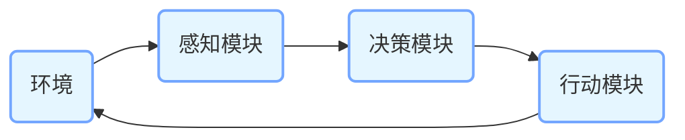

# AI Agent的未来：趋势预测与展望

> 关键词：AI Agent、人工智能、趋势预测、自主智能、多模态交互

> 摘要：本文围绕AI Agent的未来发展展开深入探讨。首先介绍了AI Agent的背景知识，包括其目的、适用读者、文档结构和相关术语。接着阐述了AI Agent的核心概念与联系，通过文本示意图和Mermaid流程图清晰展示其架构原理。详细讲解了核心算法原理和具体操作步骤，并以Python代码进行说明。深入分析了相关数学模型和公式，辅以举例加深理解。通过项目实战展示了AI Agent的实际应用和代码实现。探讨了AI Agent在不同领域的实际应用场景，推荐了学习、开发工具和相关论文著作。最后总结了AI Agent未来的发展趋势与挑战，提供了常见问题解答和扩展阅读参考资料，旨在为读者全面呈现AI Agent的未来图景。

## 1. 背景介绍 
### 1.1 目的和范围
AI Agent作为人工智能领域的重要组成部分，正逐渐改变着我们的生活和工作方式。本文的目的在于全面分析AI Agent的未来发展趋势，为相关从业者、研究者以及对AI Agent感兴趣的人士提供有价值的参考。范围涵盖AI Agent的核心概念、算法原理、数学模型、实际应用场景等多个方面，旨在从理论到实践，全方位探讨其未来的发展方向。

### 1.2 预期读者
本文预期读者包括但不限于人工智能领域的研究者、开发者、相关企业的技术人员、对新兴技术有兴趣的学生以及关注科技发展趋势的普通读者。希望通过本文，不同层次的读者都能对AI Agent的未来有更深入的理解和认识。

### 1.3 文档结构概述
本文首先介绍AI Agent的背景知识，包括目的、读者和术语等。接着阐述核心概念与联系，展示其架构原理。然后详细讲解核心算法原理和具体操作步骤，结合数学模型和公式进行深入分析。通过项目实战展示其实际应用和代码实现。探讨实际应用场景，推荐相关学习和开发资源。最后总结未来发展趋势与挑战，提供常见问题解答和扩展阅读参考资料。

### 1.4 术语表
#### 1.4.1 核心术语定义
- **AI Agent**：即人工智能智能体，是一种能够感知环境、进行决策并采取行动以实现特定目标的智能实体。
- **自主智能**：指AI Agent在没有人类直接干预的情况下，能够独立地感知、思考和行动的能力。
- **多模态交互**：AI Agent能够同时处理多种模态的信息，如视觉、听觉、触觉等，与人类或其他系统进行更加自然和高效的交互。

#### 1.4.2 相关概念解释
- **强化学习**：一种机器学习方法，智能体通过与环境进行交互，根据环境反馈的奖励信号来学习最优的行为策略。
- **深度学习**：基于人工神经网络的机器学习技术，通过多层神经网络对数据进行特征提取和模式识别。

#### 1.4.3 缩略词列表
- **AI**：Artificial Intelligence，人工智能
- **ML**：Machine Learning，机器学习
- **RL**：Reinforcement Learning，强化学习
- **DL**：Deep Learning，深度学习

## 2. 核心概念与联系 
### 核心概念原理
AI Agent的核心在于其能够感知环境，根据感知到的信息进行决策，并采取相应的行动。它通常由感知模块、决策模块和行动模块组成。感知模块负责收集环境中的信息，如通过传感器获取图像、声音等数据；决策模块根据感知到的信息和预设的目标，运用算法进行推理和决策；行动模块则根据决策结果执行相应的动作，如移动、操作设备等。

### 架构的文本示意图
AI Agent的架构可以描述为一个闭环系统。环境是AI Agent的外部世界，感知模块从环境中获取信息并传递给决策模块。决策模块基于这些信息和内部的知识、算法进行决策，生成行动指令。行动模块将这些指令转化为实际的行动，作用于环境。环境的变化又会被感知模块再次捕捉，形成一个不断循环的过程。

### Mermaid流程图


## 3. 核心算法原理 & 具体操作步骤 
### 核心算法原理
AI Agent常用的算法包括强化学习算法，如Q - learning和深度Q网络（DQN）。以Q - learning为例，其核心思想是通过不断地与环境进行交互，学习一个动作价值函数 $Q(s, a)$，表示在状态 $s$ 下采取动作 $a$ 的预期累计奖励。智能体在每个时间步根据当前状态选择动作，执行动作后得到环境的反馈（奖励和下一个状态），然后更新 $Q$ 值。

### Python源代码详细阐述
```python
import numpy as np

# 定义环境参数
num_states = 5
num_actions = 2
gamma = 0.9  # 折扣因子
alpha = 0.1  # 学习率

# 初始化Q表
Q = np.zeros((num_states, num_actions))

# 定义环境的转移和奖励函数
def environment(state, action):
    # 简单示例：随机转移到下一个状态并返回奖励
    next_state = np.random.randint(0, num_states)
    reward = np.random.randint(-1, 2)
    return next_state, reward

# Q - learning算法
def q_learning(num_episodes):
    for episode in range(num_episodes):
        state = np.random.randint(0, num_states)  # 随机初始化状态
        done = False
        while not done:
            # 选择动作（使用epsilon - greedy策略）
            epsilon = 0.1
            if np.random.uniform(0, 1) < epsilon:
                action = np.random.randint(0, num_actions)
            else:
                action = np.argmax(Q[state, :])
            
            # 执行动作，得到下一个状态和奖励
            next_state, reward = environment(state, action)
            
            # 更新Q值
            max_q_next = np.max(Q[next_state, :])
            Q[state, action] = Q[state, action] + alpha * (reward + gamma * max_q_next - Q[state, action])
            
            # 判断是否结束
            if np.random.uniform(0, 1) < 0.1:  # 简单示例，以10%的概率结束
                done = True
            
            state = next_state

# 训练Q - learning算法
q_learning(num_episodes=1000)
print("最终的Q表：")
print(Q)
```
### 具体操作步骤
1. **初始化**：初始化Q表，将所有的 $Q$ 值设为0。
2. **选择动作**：在每个时间步，根据当前状态选择动作。可以使用epsilon - greedy策略，以一定的概率随机选择动作，以探索环境；以其余概率选择 $Q$ 值最大的动作。
3. **执行动作**：执行选择的动作，与环境进行交互，得到下一个状态和奖励。
4. **更新Q值**：根据Q - learning的更新公式更新当前状态和动作的 $Q$ 值。
5. **判断是否结束**：判断当前episode是否结束，如果结束则进入下一个episode；否则继续执行步骤2 - 4。

## 4. 数学模型和公式 & 详细讲解 & 举例说明 
### 数学模型和公式
Q - learning的核心更新公式为：
$$Q(s_t, a_t) \leftarrow Q(s_t, a_t) + \alpha [r_{t+1} + \gamma \max_{a} Q(s_{t+1}, a) - Q(s_t, a_t)]$$
其中：
- $s_t$ 表示时间步 $t$ 的状态。
- $a_t$ 表示时间步 $t$ 采取的动作。
- $r_{t+1}$ 表示执行动作 $a_t$ 后在时间步 $t + 1$ 得到的奖励。
- $\gamma$ 是折扣因子，取值范围为 $[0, 1]$，用于权衡当前奖励和未来奖励的重要性。
- $\alpha$ 是学习率，控制每次更新的步长。

### 详细讲解
- **奖励信号**：$r_{t+1}$ 是环境对智能体执行动作的即时反馈，它反映了当前动作的好坏。例如，在一个机器人导航任务中，如果机器人成功到达目标位置，奖励可能为正；如果撞到障碍物，奖励可能为负。
- **折扣因子 $\gamma$**：$\gamma$ 决定了未来奖励的重要性。当 $\gamma$ 接近1时，智能体更注重长期奖励；当 $\gamma$ 接近0时，智能体更关注即时奖励。
- **学习率 $\alpha$**：$\alpha$ 控制每次更新 $Q$ 值的步长。如果 $\alpha$ 过大，可能会导致算法不稳定；如果 $\alpha$ 过小，学习速度会很慢。

### 举例说明
假设一个简单的游戏，智能体有两个状态 $s_1$ 和 $s_2$，两个动作 $a_1$ 和 $a_2$。初始时，$Q(s_1, a_1) = 0$，$Q(s_1, a_2) = 0$。在状态 $s_1$ 下选择动作 $a_1$，得到奖励 $r = 1$，并转移到状态 $s_2$。假设 $\alpha = 0.1$，$\gamma = 0.9$，$Q(s_2, a_1) = 0.5$，$Q(s_2, a_2) = 0.3$。则根据更新公式：
$$Q(s_1, a_1) = 0 + 0.1\times(1 + 0.9\times\max(0.5, 0.3) - 0) = 0 + 0.1\times(1 + 0.9\times0.5) = 0 + 0.1\times1.45 = 0.145$$

## 5. 项目实战：代码实际案例和详细解释说明 
### 5.1  开发环境搭建
- **操作系统**：可以选择Windows、Linux或macOS。
- **Python环境**：建议使用Python 3.6及以上版本。
- **依赖库**：安装numpy库，用于数值计算。可以使用以下命令安装：
```sh
pip install numpy
```

### 5.2  源代码详细实现和代码解读
```python
import numpy as np

# 定义环境参数
num_states = 5
num_actions = 2
gamma = 0.9  # 折扣因子
alpha = 0.1  # 学习率

# 初始化Q表
Q = np.zeros((num_states, num_actions))

# 定义环境的转移和奖励函数
def environment(state, action):
    # 简单示例：随机转移到下一个状态并返回奖励
    next_state = np.random.randint(0, num_states)
    reward = np.random.randint(-1, 2)
    return next_state, reward

# Q - learning算法
def q_learning(num_episodes):
    for episode in range(num_episodes):
        state = np.random.randint(0, num_states)  # 随机初始化状态
        done = False
        while not done:
            # 选择动作（使用epsilon - greedy策略）
            epsilon = 0.1
            if np.random.uniform(0, 1) < epsilon:
                action = np.random.randint(0, num_actions)
            else:
                action = np.argmax(Q[state, :])
            
            # 执行动作，得到下一个状态和奖励
            next_state, reward = environment(state, action)
            
            # 更新Q值
            max_q_next = np.max(Q[next_state, :])
            Q[state, action] = Q[state, action] + alpha * (reward + gamma * max_q_next - Q[state, action])
            
            # 判断是否结束
            if np.random.uniform(0, 1) < 0.1:  # 简单示例，以10%的概率结束
                done = True
            
            state = next_state

# 训练Q - learning算法
q_learning(num_episodes=1000)
print("最终的Q表：")
print(Q)
```
### 代码解读与分析
1. **环境参数定义**：`num_states` 和 `num_actions` 分别定义了状态和动作的数量，`gamma` 是折扣因子，`alpha` 是学习率。
2. **Q表初始化**：使用 `np.zeros` 函数将Q表初始化为全0。
3. **环境转移和奖励函数**：`environment` 函数模拟了环境的行为，随机生成下一个状态和奖励。
4. **Q - learning算法**：`q_learning` 函数实现了Q - learning算法的核心逻辑。在每个episode中，智能体不断与环境交互，根据epsilon - greedy策略选择动作，更新Q值，直到episode结束。
5. **训练和输出**：调用 `q_learning` 函数进行训练，并输出最终的Q表。

## 6. 实际应用场景 
### 智能客服
AI Agent可以作为智能客服，自动回答用户的问题。它能够通过自然语言处理技术理解用户的问题，从知识库中查找相关信息并生成回答。例如，在电商平台中，智能客服可以帮助用户查询商品信息、处理订单问题等，提高客户服务效率。

### 智能家居控制
AI Agent可以与智能家居设备进行交互，实现对家居环境的智能控制。它可以根据用户的习惯和环境条件自动调节灯光、温度、窗帘等设备。例如，当检测到室内光线较暗时，自动打开灯光；当用户离开家时，自动关闭所有电器设备。

### 自动驾驶
在自动驾驶领域，AI Agent可以感知车辆周围的环境，如通过摄像头、雷达等传感器获取道路、车辆和行人的信息。根据这些信息，AI Agent进行决策，控制车辆的加速、刹车、转向等动作，实现安全、高效的自动驾驶。

### 金融投资
AI Agent可以分析金融市场的数据，如股票价格、经济指标等。根据分析结果，AI Agent可以为投资者提供投资建议，甚至自动执行交易策略。例如，根据市场趋势和风险评估，AI Agent可以决定何时买入或卖出股票。

## 7. 工具和资源推荐
### 7.1 学习资源推荐
#### 7.1.1 书籍推荐
- 《人工智能：一种现代的方法》：全面介绍了人工智能的各个领域，包括搜索算法、机器学习、自然语言处理等，是学习人工智能的经典教材。
- 《强化学习：原理与Python实现》：详细讲解了强化学习的原理和算法，并通过Python代码实现了多个案例，适合深入学习强化学习的读者。

#### 7.1.2 在线课程
- Coursera上的“机器学习”课程：由斯坦福大学的Andrew Ng教授授课，系统地介绍了机器学习的基本概念和算法。
- edX上的“人工智能基础”课程：提供了人工智能的基础知识和实践经验，帮助学习者快速入门。

#### 7.1.3 技术博客和网站
- Medium：有许多人工智能领域的专家和研究者在上面分享最新的研究成果和技术经验。
- arXiv：提供了大量的学术论文，涵盖了人工智能的各个领域，是获取最新研究动态的重要渠道。

### 7.2 开发工具框架推荐
#### 7.2.1 IDE和编辑器
- PyCharm：功能强大的Python集成开发环境，提供了代码编辑、调试、版本控制等功能，适合开发AI Agent相关的Python项目。
- Jupyter Notebook：交互式的开发环境，适合进行数据探索、算法实验和模型训练，方便展示和分享代码和结果。

#### 7.2.2 调试和性能分析工具
- TensorBoard：用于可视化深度学习模型的训练过程和性能指标，帮助开发者调试和优化模型。
- cProfile：Python的性能分析工具，可以分析代码的运行时间和函数调用情况，找出性能瓶颈。

#### 7.2.3 相关框架和库
- TensorFlow：开源的机器学习框架，提供了丰富的工具和库，支持深度学习模型的开发和训练。
- PyTorch：另一个流行的深度学习框架，具有动态图的特点，易于使用和调试。
- OpenAI Gym：用于开发和比较强化学习算法的工具包，提供了多种环境和接口，方便进行强化学习实验。

### 7.3 相关论文著作推荐
#### 7.3.1 经典论文
- “Human - Level Control through Deep Reinforcement Learning”：介绍了深度Q网络（DQN）算法，首次将深度学习与强化学习相结合，在Atari游戏中取得了人类水平的成绩。
- “Attention Is All You Need”：提出了Transformer架构，在自然语言处理领域取得了巨大的成功，为后续的研究奠定了基础。

#### 7.3.2 最新研究成果
- 关注顶级学术会议，如NeurIPS（神经信息处理系统大会）、ICML（国际机器学习会议）等，这些会议上的论文代表了人工智能领域的最新研究成果。

#### 7.3.3 应用案例分析
- 研究一些实际应用案例的论文，如自动驾驶、智能医疗等领域的应用，了解AI Agent在实际场景中的应用方法和效果。

## 8. 总结：未来发展趋势与挑战
### 未来发展趋势
- **更强的自主智能**：未来的AI Agent将具备更强的自主智能，能够在复杂多变的环境中独立思考和决策，减少对人类的依赖。
- **多模态融合**：AI Agent将能够融合多种模态的信息，如视觉、听觉、触觉等，实现更加自然和高效的交互。例如，在智能家居中，AI Agent可以通过语音、手势等多种方式与用户进行交互。
- **群体智能**：多个AI Agent可以组成群体，通过协作和通信实现更复杂的任务。例如，在物流领域，多个智能机器人可以协作完成货物的搬运和配送任务。
- **个性化服务**：AI Agent将能够根据用户的个性化需求和偏好提供定制化的服务。例如，智能推荐系统可以根据用户的浏览历史和兴趣爱好推荐个性化的商品和内容。

### 挑战
- **伦理和道德问题**：随着AI Agent的自主能力不断增强，可能会引发一系列伦理和道德问题，如责任归属、隐私保护等。例如，在自动驾驶汽车发生事故时，如何确定责任是一个亟待解决的问题。
- **安全性问题**：AI Agent的安全性是一个重要的挑战。恶意攻击者可能会试图攻击AI Agent，导致其做出错误的决策或泄露敏感信息。例如，在金融领域，AI Agent的安全漏洞可能会导致用户的资金损失。
- **可解释性问题**：深度学习等复杂的算法使得AI Agent的决策过程难以理解和解释。在一些关键领域，如医疗、法律等，可解释性是非常重要的。例如，医生需要了解AI Agent做出诊断的依据，才能信任其结果。
- **数据隐私问题**：AI Agent的训练和运行需要大量的数据，这些数据可能包含用户的个人隐私信息。如何保护数据的隐私和安全是一个重要的问题。

## 9. 附录：常见问题与解答
### Q1：AI Agent和传统软件有什么区别？
A1：传统软件通常是按照预设的规则和流程执行任务，缺乏自主学习和适应环境的能力。而AI Agent能够感知环境，根据环境的变化进行决策和行动，具有一定的自主智能。

### Q2：AI Agent的训练需要多长时间？
A2：训练时间取决于多个因素，如算法的复杂度、数据的规模、计算资源等。简单的模型可能只需要几分钟或几小时，而复杂的模型可能需要数天甚至数周的时间。

### Q3：如何评估AI Agent的性能？
A3：可以根据具体的任务和应用场景选择合适的评估指标。例如，在分类任务中，可以使用准确率、召回率等指标；在强化学习任务中，可以使用累计奖励等指标。

### Q4：AI Agent会取代人类吗？
A4：目前来看，AI Agent虽然在某些方面表现出色，但还无法完全取代人类。人类具有创造力、情感和道德判断等能力，这些是AI Agent难以企及的。AI Agent更可能作为人类的辅助工具，帮助人类完成一些复杂的任务。

## 10. 扩展阅读 & 参考资料
- Russell, S. J., & Norvig, P. (2009). Artificial Intelligence: A Modern Approach. Pearson.
- Sutton, R. S., & Barto, A. G. (2018). Reinforcement Learning: An Introduction. MIT Press.
- Goodfellow, I. J., Bengio, Y., & Courville, A. (2016). Deep Learning. MIT Press.
- OpenAI. (2023). OpenAI Gym Documentation. Retrieved from https://gym.openai.com/docs/
- TensorFlow. (2023). TensorFlow Documentation. Retrieved from https://www.tensorflow.org/
- PyTorch. (2023). PyTorch Documentation. Retrieved from https://pytorch.org/docs/stable/index.html