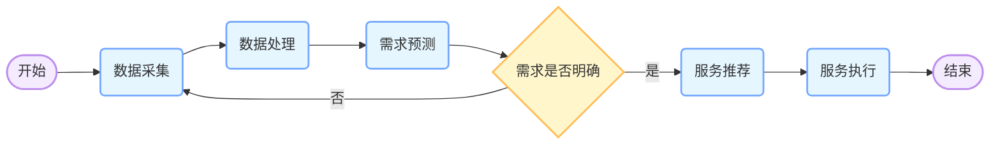

# AI Agent的用户需求预测与主动服务

> 关键词：AI Agent、用户需求预测、主动服务、机器学习、自然语言处理、数据分析、智能决策

> 摘要：本文聚焦于AI Agent的用户需求预测与主动服务这一前沿领域。首先介绍了该研究的背景、目的、预期读者和文档结构等内容。接着详细阐述了AI Agent、用户需求预测和主动服务的核心概念及相互联系，通过文本示意图和Mermaid流程图进行直观展示。深入剖析了核心算法原理，并用Python代码进行说明，同时给出相关数学模型和公式。在项目实战部分，展示了开发环境搭建、源代码实现与解读。探讨了实际应用场景，推荐了相关学习资源、开发工具框架和论文著作。最后总结了未来发展趋势与挑战，提供常见问题解答和扩展阅读参考资料，旨在为相关领域的研究和实践提供全面且深入的指导。

## 1. 背景介绍 
### 1.1 目的和范围
随着人工智能技术的飞速发展，AI Agent在各个领域的应用越来越广泛。用户对于智能系统的需求不再仅仅满足于被动响应，而是期望系统能够主动理解他们的需求并提供相应的服务。本研究的目的在于深入探讨AI Agent如何准确预测用户需求，并基于预测结果提供主动服务，以提升用户体验和系统的智能化水平。

研究范围涵盖了AI Agent的基本概念、用户需求预测的方法和技术、主动服务的实现策略，以及相关的算法、数学模型和实际应用案例等方面。通过对这些内容的研究，旨在构建一个完整的理论和实践体系，为AI Agent的用户需求预测与主动服务提供全面的解决方案。

### 1.2 预期读者
本文的预期读者包括人工智能领域的研究人员、开发者、软件架构师、CTO等技术专家，以及对AI Agent和智能服务感兴趣的学生和爱好者。对于希望深入了解AI Agent技术原理和应用实践的读者，本文将提供有价值的参考；对于从事相关项目开发的技术人员，本文的算法实现、项目实战和工具推荐等内容将具有实际的指导意义。

### 1.3 文档结构概述
本文将按照以下结构进行组织：
1. 背景介绍：阐述研究的目的、范围、预期读者和文档结构，以及相关术语的定义和解释。
2. 核心概念与联系：介绍AI Agent、用户需求预测和主动服务的核心概念，通过文本示意图和Mermaid流程图展示它们之间的关系。
3. 核心算法原理 & 具体操作步骤：详细讲解用于用户需求预测和主动服务的核心算法原理，并用Python代码进行实现和说明。
4. 数学模型和公式 & 详细讲解 & 举例说明：给出相关的数学模型和公式，并进行详细讲解和举例说明。
5. 项目实战：代码实际案例和详细解释说明：包括开发环境搭建、源代码实现与解读，以及代码分析。
6. 实际应用场景：探讨AI Agent的用户需求预测与主动服务在不同领域的实际应用场景。
7. 工具和资源推荐：推荐相关的学习资源、开发工具框架和论文著作。
8. 总结：未来发展趋势与挑战：总结AI Agent的用户需求预测与主动服务的未来发展趋势和面临的挑战。
9. 附录：常见问题与解答：提供常见问题的解答。
10. 扩展阅读 & 参考资料：提供扩展阅读的建议和参考资料列表。

### 1.4 术语表
#### 1.4.1 核心术语定义
- **AI Agent**：即人工智能代理，是一种能够感知环境、进行推理和决策，并采取行动以实现特定目标的智能实体。它可以是软件程序、机器人或其他智能设备。
- **用户需求预测**：指通过对用户历史行为、偏好、上下文信息等数据的分析和挖掘，预测用户未来可能的需求。
- **主动服务**：指系统在没有用户明确请求的情况下，根据用户需求预测结果主动为用户提供相关的服务或信息。

#### 1.4.2 相关概念解释
- **机器学习**：是一门多领域交叉学科，涉及概率论、统计学、逼近论、凸分析、算法复杂度理论等多门学科。它专门研究计算机怎样模拟或实现人类的学习行为，以获取新的知识或技能，重新组织已有的知识结构使之不断改善自身的性能。
- **自然语言处理**：是计算机科学与人工智能领域中的一个重要方向。它研究能实现人与计算机之间用自然语言进行有效通信的各种理论和方法。自然语言处理包括自然语言理解和自然语言生成两个方面。
- **数据分析**：是指用适当的统计分析方法对收集来的大量数据进行分析，提取有用信息和形成结论而对数据加以详细研究和概括总结的过程。

#### 1.4.3 缩略词列表
- **AI**：Artificial Intelligence，人工智能
- **ML**：Machine Learning，机器学习
- **NLP**：Natural Language Processing，自然语言处理
- **DNN**：Deep Neural Network，深度神经网络
- **RNN**：Recurrent Neural Network，循环神经网络
- **LSTM**：Long Short - Term Memory，长短期记忆网络

## 2. 核心概念与联系 
### 核心概念原理
#### AI Agent
AI Agent是一个具有感知、决策和行动能力的智能实体。它通过传感器感知环境信息，然后根据内部的知识和算法进行推理和决策，最后通过执行器采取相应的行动。AI Agent的设计目标是在不同的环境中自主地完成特定的任务，以满足用户的需求。

#### 用户需求预测
用户需求预测是基于用户的历史数据和当前上下文信息，运用机器学习、数据分析等技术，预测用户未来可能的需求。用户的历史数据包括用户的浏览记录、购买记录、搜索记录等，当前上下文信息包括用户的位置、时间、设备等。通过对这些数据的分析和挖掘，可以发现用户的行为模式和偏好，从而预测用户的需求。

#### 主动服务
主动服务是指系统在没有用户明确请求的情况下，根据用户需求预测结果主动为用户提供相关的服务或信息。主动服务的实现需要系统具备准确的用户需求预测能力和高效的服务推荐机制。系统根据预测结果，从服务库中选择合适的服务，并以合适的方式推送给用户。

### 架构的文本示意图
AI Agent的用户需求预测与主动服务架构主要包括以下几个部分：
1. **数据采集层**：负责采集用户的历史数据和当前上下文信息，包括用户的行为数据、位置信息、时间信息等。
2. **数据处理层**：对采集到的数据进行清洗、预处理和特征提取，将原始数据转换为适合机器学习算法处理的格式。
3. **需求预测层**：运用机器学习算法对处理后的数据进行分析和挖掘，预测用户的需求。
4. **服务推荐层**：根据用户需求预测结果，从服务库中选择合适的服务，并进行排序和推荐。
5. **服务执行层**：将推荐的服务推送给用户，并执行相应的服务操作。

### Mermaid流程图


## 3. 核心算法原理 & 具体操作步骤 
### 核心算法原理
#### 机器学习算法
机器学习算法是用户需求预测的核心技术之一。常用的机器学习算法包括决策树、支持向量机、神经网络等。这里以神经网络为例进行说明。

神经网络是一种模仿人类神经系统的计算模型，由大量的神经元组成。每个神经元接收输入信号，经过加权求和和非线性变换后输出信号。神经网络通过不断调整神经元之间的连接权重，来学习输入数据和输出结果之间的映射关系。

在用户需求预测中，可以使用深度神经网络（DNN）、循环神经网络（RNN）或长短期记忆网络（LSTM）等。DNN适用于处理静态数据，RNN和LSTM适用于处理序列数据，如用户的浏览记录、搜索记录等。

#### 自然语言处理算法
自然语言处理算法用于处理用户的文本数据，如用户的评论、反馈等。常用的自然语言处理算法包括词法分析、句法分析、语义分析等。

词法分析是将文本数据分解为单词或词元的过程；句法分析是分析文本的语法结构的过程；语义分析是理解文本的语义信息的过程。通过自然语言处理算法，可以提取用户文本数据中的关键信息，为用户需求预测提供支持。

### 具体操作步骤
#### 数据采集
使用日志记录、传感器等方式采集用户的历史数据和当前上下文信息。例如，记录用户的浏览记录、购买记录、搜索记录、位置信息、时间信息等。

#### 数据预处理
对采集到的数据进行清洗、归一化、编码等预处理操作。清洗操作包括去除重复数据、缺失值处理等；归一化操作是将数据转换到相同的尺度上；编码操作是将分类数据转换为数值数据。

#### 特征提取
从预处理后的数据中提取有用的特征。例如，从用户的浏览记录中提取浏览频率、浏览时长等特征；从用户的位置信息中提取地理位置、距离等特征。

#### 模型训练
使用机器学习算法对提取的特征进行训练，得到用户需求预测模型。在训练过程中，将数据分为训练集和测试集，使用训练集进行模型训练，使用测试集进行模型评估。

#### 需求预测
使用训练好的模型对用户的当前数据进行预测，得到用户的需求预测结果。

#### 服务推荐
根据用户需求预测结果，从服务库中选择合适的服务，并进行排序和推荐。可以使用基于内容的推荐算法、协同过滤算法等进行服务推荐。

### Python源代码实现
```python
import numpy as np
from sklearn.model_selection import train_test_split
from sklearn.neural_network import MLPClassifier
from sklearn.preprocessing import StandardScaler

# 生成示例数据
X = np.random.rand(100, 5)  # 特征数据
y = np.random.randint(0, 2, 100)  # 标签数据

# 数据预处理：标准化
scaler = StandardScaler()
X_scaled = scaler.fit_transform(X)

# 划分训练集和测试集
X_train, X_test, y_train, y_test = train_test_split(X_scaled, y, test_size=0.2, random_state=42)

# 模型训练
model = MLPClassifier(hidden_layer_sizes=(10, 5), max_iter=1000, random_state=42)
model.fit(X_train, y_train)

# 需求预测
y_pred = model.predict(X_test)

# 输出预测结果
print("预测结果：", y_pred)
```

## 4. 数学模型和公式 & 详细讲解 & 举例说明 
### 神经网络的数学模型
神经网络的基本单元是神经元，其数学模型可以表示为：
$$
z = \sum_{i = 1}^{n} w_{i}x_{i} + b
$$
$$
y = f(z)
$$
其中，$x_{i}$ 是输入信号，$w_{i}$ 是连接权重，$b$ 是偏置，$z$ 是加权求和结果，$f(z)$ 是激活函数，$y$ 是输出信号。

常见的激活函数包括Sigmoid函数、ReLU函数等。Sigmoid函数的表达式为：
$$
f(z)=\frac{1}{1 + e^{-z}}
$$
ReLU函数的表达式为：
$$
f(z)=\max(0, z)
$$

### 神经网络的训练算法
神经网络的训练过程是通过调整连接权重和偏置，使得网络的输出结果与真实标签之间的误差最小化。常用的训练算法是反向传播算法。

反向传播算法的核心思想是通过计算误差的梯度，然后沿着梯度的反方向更新连接权重和偏置。误差函数通常使用均方误差（MSE）：
$$
E=\frac{1}{2}\sum_{j = 1}^{m}(y_{j}-\hat{y}_{j})^{2}
$$
其中，$y_{j}$ 是真实标签，$\hat{y}_{j}$ 是网络的输出结果，$m$ 是样本数量。

连接权重和偏置的更新公式为：
$$
w_{i}=w_{i}-\eta\frac{\partial E}{\partial w_{i}}
$$
$$
b = b-\eta\frac{\partial E}{\partial b}
$$
其中，$\eta$ 是学习率。

### 举例说明
假设有一个简单的神经网络，包含一个输入层（2个神经元）、一个隐藏层（3个神经元）和一个输出层（1个神经元）。输入数据为 $x = [x_{1}, x_{2}]$，连接权重和偏置分别为 $w_{11}, w_{12}, w_{21}, w_{22}, w_{31}, w_{32}, b_{1}, b_{2}, b_{3}, w_{41}, w_{42}, w_{43}, b_{4}$。

首先，计算隐藏层神经元的输入：
$$
z_{1}=w_{11}x_{1}+w_{12}x_{2}+b_{1}
$$
$$
z_{2}=w_{21}x_{1}+w_{22}x_{2}+b_{2}
$$
$$
z_{3}=w_{31}x_{1}+w_{32}x_{2}+b_{3}
$$
然后，计算隐藏层神经元的输出：
$$
y_{1}=f(z_{1})
$$
$$
y_{2}=f(z_{2})
$$
$$
y_{3}=f(z_{3})
$$
最后，计算输出层神经元的输入和输出：
$$
z_{4}=w_{41}y_{1}+w_{42}y_{2}+w_{43}y_{3}+b_{4}
$$
$$
\hat{y}=f(z_{4})
$$

假设真实标签为 $y$，则误差为：
$$
E=\frac{1}{2}(y - \hat{y})^{2}
$$
根据反向传播算法，计算误差对连接权重和偏置的梯度，并更新连接权重和偏置。

## 5. 项目实战：代码实际案例和详细解释说明 
### 5.1  开发环境搭建
#### 操作系统
可以选择Windows、Linux或macOS等操作系统。建议使用Linux系统，如Ubuntu，因为它具有良好的开源软件支持和稳定性。

#### 编程语言
使用Python作为开发语言，Python具有丰富的机器学习和数据分析库，如NumPy、Pandas、Scikit - learn、TensorFlow、PyTorch等。

#### 开发工具
可以使用PyCharm、Jupyter Notebook等开发工具。PyCharm是一个功能强大的Python集成开发环境（IDE），适合进行大规模项目开发；Jupyter Notebook是一个交互式的开发环境，适合进行数据探索和模型实验。

#### 安装依赖库
在命令行中使用以下命令安装所需的依赖库：
```sh
pip install numpy pandas scikit-learn tensorflow torch
```

### 5.2  源代码详细实现和代码解读
```python
import numpy as np
import pandas as pd
from sklearn.model_selection import train_test_split
from sklearn.preprocessing import StandardScaler
from sklearn.neural_network import MLPClassifier

# 数据加载
data = pd.read_csv('user_data.csv')

# 特征提取
X = data.drop('label', axis=1).values
y = data['label'].values

# 数据预处理：标准化
scaler = StandardScaler()
X_scaled = scaler.fit_transform(X)

# 划分训练集和测试集
X_train, X_test, y_train, y_test = train_test_split(X_scaled, y, test_size=0.2, random_state=42)

# 模型训练
model = MLPClassifier(hidden_layer_sizes=(10, 5), max_iter=1000, random_state=42)
model.fit(X_train, y_train)

# 需求预测
y_pred = model.predict(X_test)

# 模型评估
from sklearn.metrics import accuracy_score
accuracy = accuracy_score(y_test, y_pred)
print("模型准确率：", accuracy)
```
#### 代码解读
1. **数据加载**：使用Pandas库的 `read_csv` 函数加载用户数据文件 `user_data.csv`。
2. **特征提取**：从数据中提取特征数据 `X` 和标签数据 `y`。
3. **数据预处理**：使用 `StandardScaler` 对特征数据进行标准化处理，将数据转换到相同的尺度上。
4. **划分训练集和测试集**：使用 `train_test_split` 函数将数据划分为训练集和测试集，测试集占比为20%。
5. **模型训练**：使用 `MLPClassifier` 构建一个多层感知器分类器模型，并使用训练集进行训练。
6. **需求预测**：使用训练好的模型对测试集进行预测，得到预测结果 `y_pred`。
7. **模型评估**：使用 `accuracy_score` 函数计算模型的准确率，评估模型的性能。

### 5.3  代码解读与分析
#### 优点
- **简单易用**：使用Scikit - learn库的 `MLPClassifier` 构建模型，代码简单易懂，易于实现。
- **可扩展性**：可以根据需要调整模型的参数，如隐藏层的神经元数量、迭代次数等，以提高模型的性能。
- **数据处理方便**：使用Pandas和NumPy库进行数据处理，方便快捷。

#### 缺点
- **模型复杂度有限**：`MLPClassifier` 是一个简单的神经网络模型，对于复杂的问题可能表现不佳。
- **缺乏深度优化**：没有进行深度的模型优化，如使用更复杂的优化算法、调整学习率等。

#### 改进建议
- **使用更复杂的模型**：可以使用深度学习框架，如TensorFlow或PyTorch，构建更复杂的神经网络模型，如卷积神经网络（CNN）、循环神经网络（RNN）等。
- **模型优化**：使用更复杂的优化算法，如Adam、Adagrad等，调整学习率，进行模型正则化等，以提高模型的性能。

## 6. 实际应用场景 
### 电子商务领域
在电子商务领域，AI Agent可以通过分析用户的浏览记录、购买记录、搜索记录等数据，预测用户的购买需求。例如，当用户浏览了某类商品后，AI Agent可以主动推荐相关的商品、优惠券等，提高用户的购买转化率。

### 智能客服领域
在智能客服领域，AI Agent可以通过分析用户的问题和反馈，预测用户的需求。例如，当用户咨询某类产品的信息时，AI Agent可以主动提供相关的产品介绍、使用说明、常见问题解答等，提高用户的满意度。

### 金融服务领域
在金融服务领域，AI Agent可以通过分析用户的财务状况、投资偏好、风险承受能力等数据，预测用户的金融需求。例如，当用户的账户余额发生变化时，AI Agent可以主动提醒用户进行理财规划、投资建议等，帮助用户实现资产增值。

### 医疗健康领域
在医疗健康领域，AI Agent可以通过分析用户的病历、体检报告、症状描述等数据，预测用户的健康需求。例如，当用户的某项指标异常时，AI Agent可以主动提醒用户进行进一步的检查、治疗建议等，提高用户的健康水平。

## 7. 工具和资源推荐
### 7.1 学习资源推荐
#### 7.1.1 书籍推荐
- 《Python机器学习》：介绍了Python在机器学习领域的应用，包括机器学习算法的原理、实现和应用。
- 《深度学习》：由深度学习领域的三位权威专家Ian Goodfellow、Yoshua Bengio和Aaron Courville撰写，全面介绍了深度学习的理论和实践。
- 《自然语言处理入门》：适合初学者学习自然语言处理的基本概念、算法和应用。

#### 7.1.2 在线课程
- Coursera上的《机器学习》课程：由Andrew Ng教授授课，是机器学习领域的经典课程。
- edX上的《深度学习》课程：由知名高校和研究机构的专家授课，深入介绍了深度学习的理论和实践。
- 中国大学MOOC上的《自然语言处理》课程：由国内高校的专家授课，介绍了自然语言处理的基本概念、算法和应用。

#### 7.1.3 技术博客和网站
- Medium：一个技术博客平台，有很多关于人工智能、机器学习、自然语言处理等领域的优质文章。
- Towards Data Science：专注于数据科学和机器学习领域的技术博客，提供了很多实用的技术文章和案例分析。
- arXiv：一个预印本数据库，收录了很多最新的人工智能、机器学习等领域的研究论文。

### 7.2 开发工具框架推荐
#### 7.2.1 IDE和编辑器
- PyCharm：一个功能强大的Python集成开发环境，适合进行大规模项目开发。
- Jupyter Notebook：一个交互式的开发环境，适合进行数据探索和模型实验。
- Visual Studio Code：一个轻量级的代码编辑器，支持多种编程语言，具有丰富的插件生态系统。

#### 7.2.2 调试和性能分析工具
- TensorBoard：TensorFlow的可视化工具，可以用于查看模型的训练过程、性能指标等。
- PyTorch Profiler：PyTorch的性能分析工具，可以用于分析模型的性能瓶颈。
- cProfile：Python的内置性能分析工具，可以用于分析Python代码的性能。

#### 7.2.3 相关框架和库
- TensorFlow：一个开源的深度学习框架，由Google开发，具有强大的计算能力和丰富的工具库。
- PyTorch：一个开源的深度学习框架，由Facebook开发，具有动态图的优势，适合快速迭代和实验。
- Scikit - learn：一个开源的机器学习库，提供了丰富的机器学习算法和工具，适合初学者和快速开发。

### 7.3 相关论文著作推荐
#### 7.3.1 经典论文
- "Deep Learning" by Yann LeCun, Yoshua Bengio, and Geoffrey Hinton：深度学习领域的经典综述论文，介绍了深度学习的发展历程、基本概念和应用。
- "Attention Is All You Need" by Ashish Vaswani et al.：提出了Transformer模型，是自然语言处理领域的重要突破。
- "A Neural Algorithm of Artistic Style" by Leon A. Gatys et al.：提出了风格迁移算法，开创了深度学习在艺术领域的应用。

#### 7.3.2 最新研究成果
- 在arXiv、ACM、IEEE等学术数据库中搜索关于AI Agent、用户需求预测、主动服务等领域的最新研究论文。

#### 7.3.3 应用案例分析
- 可以参考一些知名公司的技术博客和研究报告，了解AI Agent的用户需求预测与主动服务在实际应用中的案例和经验。

## 8. 总结：未来发展趋势与挑战
### 未来发展趋势
#### 多模态融合
未来的AI Agent将融合多种模态的数据，如文本、图像、语音等，以更全面地理解用户的需求。例如，结合用户的语音指令和面部表情，更准确地判断用户的情绪和需求。

#### 个性化服务
AI Agent将提供更加个性化的服务，根据用户的独特偏好和行为模式，为每个用户定制专属的服务内容和推荐策略。

#### 自主学习和进化
AI Agent将具备更强的自主学习和进化能力，能够在不断的交互过程中自动调整和优化自己的模型和策略，以适应不断变化的用户需求和环境。

#### 与物联网的深度融合
AI Agent将与物联网设备深度融合，实现对物理世界的实时感知和控制。例如，通过智能家居设备感知用户的生活习惯，主动调节室内温度、灯光等。

### 挑战
#### 数据隐私和安全
随着AI Agent对用户数据的大量收集和分析，数据隐私和安全问题变得尤为重要。如何保护用户的个人信息不被泄露和滥用，是一个亟待解决的问题。

#### 模型可解释性
深度学习模型通常是黑盒模型，其决策过程难以解释。在一些关键领域，如医疗、金融等，模型的可解释性至关重要。如何提高模型的可解释性，是一个挑战。

#### 计算资源和效率
AI Agent的训练和推理需要大量的计算资源，如何在有限的计算资源下提高模型的效率，是一个需要解决的问题。

#### 伦理和法律问题
AI Agent的应用可能会引发一系列伦理和法律问题，如责任认定、偏见和歧视等。如何制定相应的伦理和法律规范，是一个需要深入探讨的问题。

## 9. 附录：常见问题与解答
### 1. AI Agent的用户需求预测准确率如何提高？
可以从以下几个方面提高用户需求预测的准确率：
- **数据质量**：确保采集到的数据准确、完整、无噪声。
- **特征工程**：提取更有价值的特征，如用户的行为模式、偏好等。
- **模型选择和优化**：选择合适的模型，并进行模型优化，如调整模型参数、使用更复杂的模型等。
- **多模型融合**：将多个不同的模型进行融合，综合利用它们的优势。

### 2. 如何处理用户数据的隐私和安全问题？
- **数据加密**：对用户数据进行加密处理，确保数据在传输和存储过程中的安全性。
- **匿名化处理**：在对用户数据进行分析和挖掘时，对数据进行匿名化处理，保护用户的个人信息。
- **访问控制**：设置严格的访问控制权限，只有授权人员才能访问用户数据。
- **合规性**：遵守相关的法律法规和行业标准，如GDPR等。

### 3. AI Agent的主动服务如何避免打扰用户？
- **个性化设置**：允许用户根据自己的需求和偏好设置主动服务的时间、方式和内容。
- **情境感知**：结合用户的当前情境，如时间、地点、活动等，判断是否适合提供主动服务。
- **用户反馈**：根据用户的反馈，不断调整主动服务的策略，提高用户的满意度。

## 10. 扩展阅读 & 参考资料
### 扩展阅读
- 《人工智能时代的人机协作》：探讨了人工智能时代人机协作的模式和发展趋势。
- 《智能时代的伦理与法律》：分析了智能时代面临的伦理和法律问题，并提出了相应的解决方案。

### 参考资料
- 相关的学术论文、研究报告、技术博客等。
- 各大开源项目的官方文档和代码库。