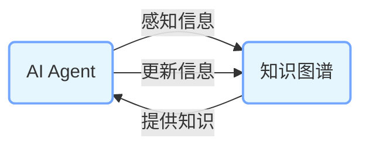

# AI Agent的知识图谱构建与应用

> 关键词：AI Agent、知识图谱、构建方法、应用场景、图数据库

> 摘要：本文围绕AI Agent的知识图谱构建与应用展开深入探讨。首先介绍了相关背景，包括目的范围、预期读者等内容。接着阐述了AI Agent和知识图谱的核心概念及它们之间的联系，并给出相应的文本示意图和Mermaid流程图。详细讲解了知识图谱构建的核心算法原理，结合Python代码进行阐述，同时给出了相关的数学模型和公式。通过项目实战，展示了代码的实际案例并进行详细解释。分析了AI Agent知识图谱的实际应用场景，推荐了学习资源、开发工具框架以及相关论文著作。最后总结了未来发展趋势与挑战，解答了常见问题并提供了扩展阅读和参考资料，旨在为读者全面呈现AI Agent知识图谱构建与应用的全貌。

## 1. 背景介绍 
### 1.1 目的和范围
随着人工智能技术的不断发展，AI Agent在各个领域的应用越来越广泛。知识图谱作为一种强大的知识表示和管理工具，能够为AI Agent提供丰富的知识支持，使其具备更强的推理和决策能力。本文的目的在于深入探讨AI Agent的知识图谱构建方法和应用场景，为相关研究和实践提供理论支持和技术指导。范围涵盖了知识图谱的基本概念、构建算法、数学模型，以及在不同领域的实际应用案例等。

### 1.2 预期读者
本文预期读者包括人工智能领域的研究人员、开发者、学生，以及对AI Agent和知识图谱感兴趣的技术爱好者。对于希望深入了解知识图谱在AI Agent中应用的专业人士，本文将提供详细的技术细节和实践经验；对于初学者，本文将从基础概念入手，逐步引导读者理解相关技术原理。

### 1.3 文档结构概述
本文共分为十个部分。第一部分为背景介绍，阐述了文章的目的、预期读者和文档结构。第二部分介绍AI Agent和知识图谱的核心概念及它们之间的联系，并给出相应的示意图和流程图。第三部分讲解知识图谱构建的核心算法原理，结合Python代码进行详细阐述。第四部分给出相关的数学模型和公式，并举例说明。第五部分通过项目实战，展示代码的实际案例并进行详细解释。第六部分分析AI Agent知识图谱的实际应用场景。第七部分推荐学习资源、开发工具框架以及相关论文著作。第八部分总结未来发展趋势与挑战。第九部分为附录，解答常见问题。第十部分提供扩展阅读和参考资料。

### 1.4 术语表
#### 1.4.1 核心术语定义
- **AI Agent**：人工智能代理，是一种能够感知环境、进行决策并采取行动以实现特定目标的智能实体。
- **知识图谱**：一种以图的形式表示知识的方法，由实体、关系和属性组成，用于描述事物之间的语义关系。
- **实体**：知识图谱中的基本元素，代表现实世界中的具体事物或抽象概念。
- **关系**：用于连接实体，表示实体之间的语义联系。
- **属性**：描述实体的特征和性质。

#### 1.4.2 相关概念解释
- **语义网络**：一种早期的知识表示方法，与知识图谱类似，都用于表示事物之间的关系，但知识图谱在语义表达和数据整合方面更加强大。
- **本体**：对概念及其关系的形式化描述，是知识图谱构建的重要基础，用于定义实体、关系和属性的类别和约束。

#### 1.4.3 缩略词列表
- **RDF**：Resource Description Framework，资源描述框架，是一种用于表示知识图谱数据的标准格式。
- **OWL**：Web Ontology Language，网络本体语言，用于定义本体和知识图谱的语义。
- **SPARQL**：SPARQL Protocol and RDF Query Language，用于查询和操作RDF数据的语言。

## 2. 核心概念与联系 

### 2.1 AI Agent概念
AI Agent是人工智能系统中的一个重要概念，它具有自主性、反应性、社会性和适应性等特点。自主性意味着AI Agent能够在没有人类干预的情况下独立地感知环境、进行决策和采取行动；反应性表示AI Agent能够对环境中的变化做出及时的响应；社会性指AI Agent能够与其他Agent或人类进行交互和协作；适应性则表示AI Agent能够根据环境的变化和自身的经验不断调整自己的行为。

### 2.2 知识图谱概念
知识图谱是一种语义网络，它以图的形式表示知识。知识图谱由节点和边组成，节点表示实体，边表示实体之间的关系。每个实体可以有多个属性，用于描述其特征和性质。知识图谱的主要作用是将大量的结构化和非结构化数据整合到一个统一的框架中，以便于知识的管理、查询和推理。

### 2.3 两者联系
AI Agent可以利用知识图谱中的知识来提高自己的智能水平。知识图谱为AI Agent提供了丰富的背景知识，使其能够更好地理解环境中的信息，进行更准确的决策和推理。例如，在智能问答系统中，AI Agent可以通过知识图谱查询相关的知识，为用户提供准确的答案。同时，AI Agent在与环境交互的过程中，也可以不断地更新和扩展知识图谱，使其更加完善和准确。

### 2.4 文本示意图
AI Agent与知识图谱的关系可以用以下文本示意图表示：

AI Agent通过感知模块获取环境信息，然后将信息与知识图谱中的知识进行匹配和推理。知识图谱为AI Agent提供了语义理解和知识支持，帮助AI Agent做出更合理的决策。AI Agent在执行决策的过程中，会产生新的信息，这些信息可以反馈给知识图谱，用于更新和扩展知识图谱。

### 2.5 Mermaid流程图


## 3. 核心算法原理 & 具体操作步骤 

### 3.1 知识抽取算法
知识抽取是知识图谱构建的第一步，其目的是从各种数据源中提取实体、关系和属性等知识。常见的知识抽取算法包括基于规则的方法、基于机器学习的方法和基于深度学习的方法。

#### 3.1.1 基于规则的方法
基于规则的方法是通过预定义的规则来抽取知识。例如，在文本中，如果出现“[实体1]是[实体2]的[关系]”这样的模式，就可以抽取相应的实体和关系。以下是一个简单的Python代码示例：

```python
import re

def rule_based_extraction(text):
    pattern = r'(\w+)是(\w+)的(\w+)'
    matches = re.findall(pattern, text)
    entities_relations = []
    for match in matches:
        entity1 = match[0]
        entity2 = match[1]
        relation = match[2]
        entities_relations.append((entity1, entity2, relation))
    return entities_relations

text = "小明是小红的朋友"
result = rule_based_extraction(text)
print(result)
```

#### 3.1.2 基于机器学习的方法
基于机器学习的方法通常使用分类器来判断文本中是否存在实体和关系。常见的分类器包括支持向量机（SVM）、决策树等。以下是一个使用SVM进行关系抽取的简单示例：

```python
from sklearn import svm
from sklearn.feature_extraction.text import TfidfVectorizer
from sklearn.model_selection import train_test_split
from sklearn.metrics import accuracy_score

# 示例数据
texts = ["小明是小红的朋友", "小李是小张的同事"]
labels = ["朋友", "同事"]

# 特征提取
vectorizer = TfidfVectorizer()
X = vectorizer.fit_transform(texts)

# 划分训练集和测试集
X_train, X_test, y_train, y_test = train_test_split(X, labels, test_size=0.2, random_state=42)

# 训练模型
clf = svm.SVC()
clf.fit(X_train, y_train)

# 预测
y_pred = clf.predict(X_test)

# 评估
accuracy = accuracy_score(y_test, y_pred)
print("Accuracy:", accuracy)
```

#### 3.1.3 基于深度学习的方法
基于深度学习的方法通常使用神经网络来进行知识抽取。例如，使用循环神经网络（RNN）或卷积神经网络（CNN）来处理文本数据。以下是一个使用LSTM进行关系抽取的简单示例：

```python
from tensorflow.keras.preprocessing.text import Tokenizer
from tensorflow.keras.preprocessing.sequence import pad_sequences
from tensorflow.keras.models import Sequential
from tensorflow.keras.layers import Embedding, LSTM, Dense
import numpy as np

# 示例数据
texts = ["小明是小红的朋友", "小李是小张的同事"]
labels = ["朋友", "同事"]

# 文本预处理
tokenizer = Tokenizer()
tokenizer.fit_on_texts(texts)
sequences = tokenizer.texts_to_sequences(texts)
max_length = max([len(seq) for seq in sequences])
padded_sequences = pad_sequences(sequences, maxlen=max_length)

# 标签编码
label_mapping = {label: index for index, label in enumerate(set(labels))}
encoded_labels = np.array([label_mapping[label] for label in labels])

# 构建模型
model = Sequential()
model.add(Embedding(input_dim=len(tokenizer.word_index) + 1, output_dim=100, input_length=max_length))
model.add(LSTM(100))
model.add(Dense(len(label_mapping), activation='softmax'))

# 编译模型
model.compile(loss='sparse_categorical_crossentropy', optimizer='adam', metrics=['accuracy'])

# 训练模型
model.fit(padded_sequences, encoded_labels, epochs=10, batch_size=1)
```

### 3.2 知识融合算法
知识融合是将从不同数据源中抽取的知识进行整合的过程。知识融合的主要任务包括实体对齐和属性融合。实体对齐是指将不同数据源中表示同一实体的不同标识进行统一，属性融合是指将同一实体的不同属性进行合并。

以下是一个简单的实体对齐算法示例：

```python
def entity_alignment(entities1, entities2):
    aligned_entities = []
    for entity1 in entities1:
        for entity2 in entities2:
            if entity1['name'] == entity2['name']:
                aligned_entity = {
                    'name': entity1['name'],
                    'attributes': {**entity1.get('attributes', {}), **entity2.get('attributes', {})}
                }
                aligned_entities.append(aligned_entity)
    return aligned_entities

entities1 = [{'name': '小明', 'attributes': {'age': 20}}]
entities2 = [{'name': '小明', 'attributes': {'gender': '男'}}]
result = entity_alignment(entities1, entities2)
print(result)
```

### 3.3 知识推理算法
知识推理是指利用知识图谱中的已有知识推导出新的知识。常见的知识推理算法包括基于规则的推理、基于逻辑的推理和基于表示学习的推理。

以下是一个简单的基于规则的推理示例：

```python
rules = [
    {"if": [("A", "朋友", "B"), ("B", "朋友", "C")], "then": ("A", "朋友的朋友", "C")}
]

knowledge_graph = [("小明", "朋友", "小红"), ("小红", "朋友", "小李")]

new_knowledge = []
for rule in rules:
    antecedents = rule["if"]
    consequent = rule["then"]
    for i in range(len(knowledge_graph) - len(antecedents) + 1):
        match = True
        for j in range(len(antecedents)):
            if knowledge_graph[i + j] != antecedents[j]:
                match = False
                break
        if match:
            new_knowledge.append(consequent)

knowledge_graph.extend(new_knowledge)
print(knowledge_graph)
```

## 4. 数学模型和公式 & 详细讲解 & 举例说明 

### 4.1 知识图谱的表示模型
知识图谱通常可以用三元组 $(h, r, t)$ 来表示，其中 $h$ 表示头实体，$r$ 表示关系，$t$ 表示尾实体。例如，在知识图谱中，“小明是小红的朋友” 可以表示为 (小明, 朋友, 小红)。

### 4.2 知识抽取的概率模型
在基于机器学习的知识抽取中，通常使用概率模型来计算实体和关系的抽取概率。例如，在关系抽取中，可以使用条件概率 $P(r|h, t)$ 来表示在给定头实体 $h$ 和尾实体 $t$ 的情况下，关系 $r$ 存在的概率。

### 4.3 知识推理的逻辑模型
在基于逻辑的知识推理中，通常使用逻辑规则来推导新的知识。例如，假设有以下逻辑规则：

$$
\begin{cases}
Friend(A, B) \land Friend(B, C) \to FriendOfFriend(A, C) \\
\end{cases}
$$

其中 $Friend(A, B)$ 表示 $A$ 是 $B$ 的朋友，$FriendOfFriend(A, C)$ 表示 $A$ 是 $C$ 的朋友的朋友。如果在知识图谱中存在 $(A, Friend, B)$ 和 $(B, Friend, C)$ 这两个三元组，那么就可以推导出 $(A, FriendOfFriend, C)$ 这个新的三元组。

### 4.4 举例说明
假设我们有一个简单的知识图谱，包含以下三元组：

$$
\begin{cases}
(小明, 朋友, 小红) \\
(小红, 朋友, 小李) \\
\end{cases}
$$

根据上述逻辑规则，我们可以推导出新的三元组：

$$
(小明, 朋友的朋友, 小李)
$$

## 5. 项目实战：代码实际案例和详细解释说明 

### 5.1  开发环境搭建
#### 5.1.1 安装Python
首先需要安装Python环境，建议使用Python 3.6及以上版本。可以从Python官方网站（https://www.python.org/downloads/） 下载安装包进行安装。

#### 5.1.2 安装必要的库
在项目中，我们需要使用一些Python库，如 `nltk`、`scikit-learn`、`tensorflow` 等。可以使用以下命令进行安装：

```sh
pip install nltk scikit-learn tensorflow
```

#### 5.1.3 安装图数据库
为了存储和管理知识图谱，我们可以使用图数据库，如Neo4j。可以从Neo4j官方网站（https://neo4j.com/download/） 下载安装包进行安装。

### 5.2  源代码详细实现和代码解读
#### 5.2.1 知识抽取模块
```python
import re
import nltk
from nltk.tokenize import word_tokenize
from nltk.corpus import stopwords
nltk.download('punkt')
nltk.download('stopwords')

def extract_entities(text):
    tokens = word_tokenize(text)
    stop_words = set(stopwords.words('english'))
    filtered_tokens = [token for token in tokens if token.isalnum() and token not in stop_words]
    entities = []
    for token in filtered_tokens:
        if token.istitle():
            entities.append(token)
    return entities

def extract_relations(text):
    pattern = r'(\w+)是(\w+)的(\w+)'
    matches = re.findall(pattern, text)
    relations = []
    for match in matches:
        entity1 = match[0]
        entity2 = match[1]
        relation = match[2]
        relations.append((entity1, entity2, relation))
    return relations

text = "小明是小红的朋友"
entities = extract_entities(text)
relations = extract_relations(text)
print("Entities:", entities)
print("Relations:", relations)
```

代码解读：
- `extract_entities` 函数用于从文本中提取实体。首先对文本进行分词，然后过滤掉停用词和非字母数字的字符，最后提取所有首字母大写的单词作为实体。
- `extract_relations` 函数用于从文本中提取关系。使用正则表达式匹配 “[实体1]是[实体2]的[关系]” 这样的模式，然后提取相应的实体和关系。

#### 5.2.2 知识融合模块
```python
def entity_alignment(entities1, entities2):
    aligned_entities = []
    for entity1 in entities1:
        for entity2 in entities2:
            if entity1 == entity2:
                if entity1 not in aligned_entities:
                    aligned_entities.append(entity1)
    return aligned_entities

entities1 = ["小明", "小红"]
entities2 = ["小明", "小李"]
aligned_entities = entity_alignment(entities1, entities2)
print("Aligned Entities:", aligned_entities)
```

代码解读：
- `entity_alignment` 函数用于对两个实体列表进行实体对齐。遍历两个实体列表，找出相同的实体并添加到对齐后的实体列表中。

#### 5.2.3 知识存储模块
```python
from py2neo import Graph, Node, Relationship

# 连接到Neo4j数据库
graph = Graph("bolt://localhost:7687", auth=("neo4j", "password"))

# 创建实体节点
entity1 = Node("Person", name="小明")
entity2 = Node("Person", name="小红")

# 创建关系
relation = Relationship(entity1, "朋友", entity2)

# 将节点和关系添加到图数据库中
graph.create(entity1)
graph.create(entity2)
graph.create(relation)
```

代码解读：
- 使用 `py2neo` 库连接到Neo4j数据库。
- 创建实体节点和关系，然后将它们添加到图数据库中。

### 5.3  代码解读与分析
通过上述代码，我们实现了知识抽取、知识融合和知识存储的基本功能。知识抽取模块从文本中提取实体和关系，知识融合模块对不同来源的实体进行对齐，知识存储模块将抽取和融合后的知识存储到图数据库中。

在实际应用中，我们可以根据具体需求对代码进行扩展和优化。例如，在知识抽取模块中，可以使用更复杂的机器学习或深度学习算法来提高抽取的准确性；在知识融合模块中，可以使用更先进的实体对齐算法来处理大规模的知识图谱；在知识存储模块中，可以使用分布式图数据库来提高存储和查询的性能。

## 6. 实际应用场景 

### 6.1 智能问答系统
在智能问答系统中，知识图谱可以为AI Agent提供丰富的背景知识，帮助其更好地理解用户的问题并给出准确的答案。例如，当用户询问 “小明的朋友是谁” 时，AI Agent可以通过知识图谱查询到 “小明的朋友是小红” 并返回给用户。

### 6.2 推荐系统
在推荐系统中，知识图谱可以用于表示用户和物品之间的关系，从而提高推荐的准确性和多样性。例如，根据用户的兴趣爱好和历史行为，结合知识图谱中的知识，可以为用户推荐更符合其需求的物品。

### 6.3 语义搜索
在语义搜索中，知识图谱可以帮助搜索引擎理解用户的查询意图，从而提供更准确的搜索结果。例如，当用户搜索 “苹果” 时，搜索引擎可以根据知识图谱中的知识，判断用户是想搜索水果 “苹果” 还是科技公司 “苹果”，并提供相应的搜索结果。

### 6.4 医疗诊断
在医疗诊断中，知识图谱可以整合医学知识和患者信息，为医生提供辅助诊断的支持。例如，根据患者的症状和病史，结合知识图谱中的医学知识，AI Agent可以为医生提供可能的疾病诊断和治疗建议。

### 6.5 金融风险评估
在金融风险评估中，知识图谱可以用于表示企业和个人之间的关系，从而帮助金融机构更好地评估风险。例如，通过分析企业之间的股权关系、交易关系等，结合知识图谱中的行业知识，AI Agent可以预测企业的信用风险和市场风险。

## 7. 工具和资源推荐
### 7.1 学习资源推荐
#### 7.1.1 书籍推荐
- 《人工智能：一种现代的方法》：全面介绍了人工智能的基本概念、算法和应用，是人工智能领域的经典教材。
- 《知识图谱：方法、实践与应用》：详细介绍了知识图谱的构建方法、技术和应用案例，是学习知识图谱的重要参考书籍。
- 《Python自然语言处理》：介绍了使用Python进行自然语言处理的方法和技术，对于知识抽取和处理有很大的帮助。

#### 7.1.2 在线课程
- Coursera上的 “人工智能基础” 课程：由知名高校的教授授课，系统地介绍了人工智能的基本概念和算法。
- edX上的 “知识图谱与语义网” 课程：深入讲解了知识图谱的构建和应用，以及语义网的相关技术。
- 中国大学MOOC上的 “Python语言程序设计” 课程：适合初学者学习Python编程，为后续的知识图谱开发打下基础。

#### 7.1.3 技术博客和网站
- 开源中国（https://www.oschina.net/）：提供了丰富的开源项目和技术文章，对于了解最新的技术动态和开源工具非常有帮助。
- 博客园（https://www.cnblogs.com/）：有很多技术博主分享自己的技术经验和研究成果，对于学习知识图谱和人工智能有很大的启发。
- 知乎（https://www.zhihu.com/）：有很多关于知识图谱和人工智能的讨论和问答，可以从中获取不同的观点和思路。

### 7.2 开发工具框架推荐
#### 7.2.1 IDE和编辑器
- PyCharm：一款专业的Python集成开发环境，提供了丰富的代码编辑、调试和项目管理功能，适合Python开发。
- Visual Studio Code：一款轻量级的代码编辑器，支持多种编程语言，有丰富的插件可以扩展功能，适合快速开发和调试。
- Jupyter Notebook：一种交互式的开发环境，适合进行数据探索和模型实验，对于知识图谱的开发和研究非常方便。

#### 7.2.2 调试和性能分析工具
- PySnooper：一个简单易用的Python调试工具，可以自动记录函数的执行过程和变量的值，方便调试代码。
- cProfile：Python内置的性能分析工具，可以分析代码的运行时间和函数调用次数，帮助优化代码性能。
- TensorBoard：TensorFlow的可视化工具，可以用于可视化训练过程、模型结构和性能指标，对于深度学习模型的调试和优化非常有帮助。

#### 7.2.3 相关框架和库
- NLTK：Python的自然语言处理工具包，提供了丰富的文本处理功能，如分词、词性标注、命名实体识别等，对于知识抽取非常有用。
- Scikit-learn：Python的机器学习库，提供了各种机器学习算法和工具，如分类、回归、聚类等，对于知识融合和推理有很大的帮助。
- TensorFlow：一个开源的深度学习框架，提供了丰富的深度学习模型和工具，如神经网络、卷积神经网络、循环神经网络等，对于复杂的知识抽取和推理任务非常有用。
- Py2neo：Python的Neo4j图数据库驱动程序，用于连接和操作Neo4j图数据库，方便知识的存储和查询。

### 7.3 相关论文著作推荐
#### 7.3.1 经典论文
- “Knowledge Graph Embedding: A Survey of Approaches and Applications”：对知识图谱嵌入的方法和应用进行了全面的综述，是了解知识图谱嵌入技术的重要论文。
- “Entity Alignment in Knowledge Graphs: A Machine Learning Approach”：介绍了基于机器学习的实体对齐方法，对于知识融合有很大的参考价值。
- “Semantic Web: A New Form of Web Content that is Meaningful to Computers”：提出了语义网的概念，为知识图谱的发展奠定了基础。

#### 7.3.2 最新研究成果
- 关注顶级学术会议如AAAI、IJCAI、KDD等的相关论文，了解知识图谱和人工智能领域的最新研究成果。
- 查阅知名学术期刊如Journal of Artificial Intelligence Research (JAIR)、Artificial Intelligence等的相关文章，获取前沿的研究动态。

#### 7.3.3 应用案例分析
- 研究各大科技公司如Google、Microsoft、Amazon等在知识图谱应用方面的案例，了解知识图谱在实际业务中的应用场景和实现方法。
- 分析金融、医疗、电商等行业的知识图谱应用案例，学习如何将知识图谱技术应用到具体的业务场景中。

## 8. 总结：未来发展趋势与挑战
### 8.1 未来发展趋势
#### 8.1.1 大规模知识图谱的构建
随着数据量的不断增长，未来将需要构建更大规模、更复杂的知识图谱。这将涉及到多源数据的融合、分布式存储和处理等技术的发展。

#### 8.1.2 知识图谱与深度学习的融合
知识图谱和深度学习的融合将是未来的一个重要发展方向。知识图谱可以为深度学习模型提供先验知识，提高模型的可解释性和泛化能力；深度学习模型可以用于知识图谱的构建和推理，提高知识图谱的质量和效率。

#### 8.1.3 知识图谱在行业应用的深化
知识图谱将在更多的行业得到应用，如教育、交通、能源等。通过将行业知识与知识图谱技术相结合，可以为行业提供更智能、更高效的解决方案。

#### 8.1.4 知识图谱的跨语言和跨文化应用
随着全球化的发展，知识图谱的跨语言和跨文化应用将变得越来越重要。未来需要研究如何构建跨语言和跨文化的知识图谱，以及如何实现不同语言和文化之间的知识共享和交流。

### 8.2 挑战
#### 8.2.1 数据质量和一致性问题
知识图谱的构建依赖于大量的数据，数据的质量和一致性直接影响知识图谱的质量。如何处理数据中的噪声、错误和不一致性，是知识图谱构建过程中面临的一个重要挑战。

#### 8.2.2 知识表示和推理的复杂性
知识图谱的表示和推理涉及到复杂的语义和逻辑问题。如何设计高效的知识表示方法和推理算法，提高知识图谱的表达能力和推理效率，是需要解决的关键问题。

#### 8.2.3 隐私和安全问题
知识图谱中包含大量的敏感信息，如个人信息、商业机密等。如何保护知识图谱中的隐私和安全，防止信息泄露和滥用，是知识图谱应用中面临的一个重要挑战。

#### 8.2.4 跨领域知识融合的困难
不同领域的知识具有不同的特点和表示方法，如何实现跨领域知识的有效融合，是知识图谱发展过程中需要克服的一个难题。

## 9. 附录：常见问题与解答
### 9.1 知识图谱和数据库有什么区别？
知识图谱和数据库都是用于存储和管理数据的工具，但它们有一些区别。数据库主要用于存储结构化数据，如关系型数据库中的表和记录；而知识图谱主要用于表示和管理语义信息，以图的形式存储实体、关系和属性。知识图谱更注重数据之间的语义关系，可以进行更复杂的推理和查询。

### 9.2 如何评估知识图谱的质量？
可以从以下几个方面评估知识图谱的质量：
- **完整性**：知识图谱是否包含了足够的知识，是否覆盖了相关领域的主要内容。
- **准确性**：知识图谱中的知识是否准确无误，是否存在错误或矛盾的信息。
- **一致性**：知识图谱中的知识是否一致，是否存在逻辑冲突。
- **时效性**：知识图谱中的知识是否及时更新，是否反映了最新的信息。

### 9.3 知识图谱的构建需要多长时间？
知识图谱的构建时间取决于多个因素，如数据量的大小、数据的复杂性、构建方法的选择等。对于小型的知识图谱，可能只需要几天或几周的时间；而对于大型的知识图谱，可能需要几个月甚至几年的时间。

### 9.4 如何选择适合的知识图谱存储系统？
选择适合的知识图谱存储系统需要考虑以下几个因素：
- **数据规模**：根据知识图谱的数据量大小选择合适的存储系统。对于小规模的知识图谱，可以选择轻量级的图数据库；对于大规模的知识图谱，可能需要选择分布式图数据库。
- **查询性能**：根据实际的查询需求选择查询性能好的存储系统。不同的存储系统在查询性能上可能存在差异。
- **功能需求**：根据具体的功能需求选择支持相应功能的存储系统，如是否支持推理、是否支持可视化等。
- **易用性和可维护性**：选择易用性和可维护性好的存储系统，方便开发和管理。

## 10. 扩展阅读 & 参考资料
### 10.1 扩展阅读
- 《大数据时代：生活、工作与思维的大变革》：介绍了大数据时代的特点和影响，对于理解知识图谱在大数据环境下的应用有很大的帮助。
- 《人类简史：从动物到上帝》：从人类历史的角度探讨了人类的认知和知识的发展，对于理解知识图谱的本质和意义有一定的启发。
- 《未来简史：从智人到神人》：对未来人类的发展进行了展望，探讨了人工智能和知识图谱等技术对人类未来的影响。

### 10.2 参考资料
- 相关学术论文和研究报告，如ACM、IEEE等学术组织发表的关于知识图谱和人工智能的论文。
- 各大科技公司的技术博客和开源项目，如Google、Microsoft、Facebook等公司的技术分享和开源代码。
- 行业标准和规范，如W3C发布的关于语义网和知识图谱的标准和规范。