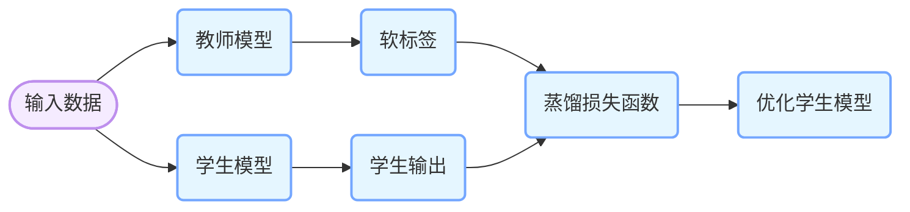

# AI Agent的知识蒸馏：从集成模型到单一高效LLM

> 关键词：AI Agent、知识蒸馏、集成模型、单一高效LLM、大语言模型

> 摘要：本文聚焦于AI Agent的知识蒸馏过程，探讨如何将集成模型的知识迁移到单一高效的大语言模型（LLM）中。首先介绍了知识蒸馏的背景，包括其目的、预期读者和文档结构等内容。接着阐述了核心概念与联系，通过文本示意图和Mermaid流程图展示知识蒸馏的原理和架构。详细讲解了核心算法原理和具体操作步骤，并使用Python源代码进行说明。给出了相关的数学模型和公式，并举例说明。通过项目实战展示了代码实际案例和详细解释。分析了知识蒸馏在不同场景下的实际应用，推荐了学习、开发工具和相关论文著作等资源。最后总结了未来发展趋势与挑战，还提供了常见问题与解答以及扩展阅读和参考资料，旨在为读者全面深入地了解AI Agent的知识蒸馏提供参考。

## 1. 背景介绍 
### 1.1 目的和范围
知识蒸馏作为一种模型压缩和知识迁移的技术，在AI领域有着重要的应用价值。本文章的目的在于深入探讨AI Agent中知识蒸馏的过程，特别是如何将集成模型所蕴含的丰富知识有效地迁移到单一高效的大语言模型（LLM）中。通过研究这一过程，我们可以在保证模型性能的前提下，降低模型的复杂度和计算资源需求，提高模型的部署效率和实用性。

本文章的范围涵盖了知识蒸馏的基本概念、核心算法原理、数学模型、实际项目案例以及在不同场景下的应用等方面。我们将详细分析知识蒸馏的各个环节，从理论到实践，为读者提供一个全面的知识体系。

### 1.2 预期读者
本文预期读者包括但不限于以下几类人群：
- **AI研究人员**：希望深入了解知识蒸馏技术在AI Agent和大语言模型中的应用，为其研究工作提供新的思路和方法。
- **程序员和开发者**：对如何实现知识蒸馏算法，以及如何将其应用到实际项目中感兴趣，通过学习本文可以获取相关的代码实现和实践经验。
- **软件架构师**：关注如何在系统架构层面应用知识蒸馏技术，优化模型的性能和资源利用，提升整个系统的效率。
- **对AI和大语言模型感兴趣的爱好者**：希望通过本文对知识蒸馏有一个初步的了解，拓宽自己在AI领域的知识面。

### 1.3 文档结构概述
本文将按照以下结构进行组织：
1. **背景介绍**：介绍文章的目的、预期读者和文档结构，以及相关术语的定义和解释。
2. **核心概念与联系**：阐述知识蒸馏的核心概念、原理和架构，通过文本示意图和Mermaid流程图进行直观展示。
3. **核心算法原理 & 具体操作步骤**：详细讲解知识蒸馏的核心算法原理，并使用Python源代码进行具体的实现和说明。
4. **数学模型和公式 & 详细讲解 & 举例说明**：给出知识蒸馏相关的数学模型和公式，并通过具体例子进行详细讲解。
5. **项目实战：代码实际案例和详细解释说明**：通过实际项目案例，展示知识蒸馏的代码实现和详细解释，包括开发环境搭建、源代码实现和代码解读。
6. **实际应用场景**：分析知识蒸馏在不同场景下的实际应用，探讨其优势和挑战。
7. **工具和资源推荐**：推荐学习知识蒸馏相关的书籍、在线课程、技术博客和网站，以及开发工具、框架和相关论文著作。
8. **总结：未来发展趋势与挑战**：总结知识蒸馏的发展趋势，分析其面临的挑战和未来的研究方向。
9. **附录：常见问题与解答**：解答读者在学习和应用知识蒸馏过程中常见的问题。
10. **扩展阅读 & 参考资料**：提供相关的扩展阅读材料和参考资料，方便读者进一步深入学习。

### 1.4 术语表
#### 1.4.1 核心术语定义
- **AI Agent**：人工智能代理，是一种能够感知环境、进行决策并采取行动的智能实体，它可以自主地完成特定的任务。
- **知识蒸馏**：一种模型压缩和知识迁移的技术，通过将一个复杂的教师模型（如集成模型）的知识传递给一个简单的学生模型（如单一高效LLM），使得学生模型能够在保持较高性能的同时，降低模型的复杂度和计算资源需求。
- **集成模型**：由多个不同的基模型组成的模型集合，通过综合多个基模型的预测结果，提高模型的性能和稳定性。
- **大语言模型（LLM）**：基于深度学习的语言模型，具有强大的语言理解和生成能力，能够处理自然语言任务，如文本生成、问答系统等。
- **教师模型**：在知识蒸馏过程中，提供知识的复杂模型，通常是集成模型。
- **学生模型**：在知识蒸馏过程中，接收知识的简单模型，通常是单一高效的LLM。

#### 1.4.2 相关概念解释
- **软标签**：教师模型输出的概率分布，包含了比硬标签（类别标签）更多的信息，知识蒸馏中通过最小化学生模型输出与教师模型软标签之间的差异来传递知识。
- **温度参数**：在知识蒸馏中用于控制软标签的平滑程度，温度越高，软标签越平滑，不同类别之间的差异越小。

#### 1.4.3 缩略词列表
- **LLM**：Large Language Model（大语言模型）

## 2. 核心概念与联系 
### 知识蒸馏的基本原理
知识蒸馏的核心思想是将教师模型的知识迁移到学生模型中。教师模型通常是一个复杂的、性能较好的模型，如集成模型，它可以从数据中学习到丰富的知识和模式。学生模型则是一个相对简单的模型，如单一高效的LLM，通过模仿教师模型的输出，学习到教师模型所蕴含的知识。

在知识蒸馏过程中，教师模型和学生模型同时接收输入数据。教师模型输出一个概率分布，即软标签，这个软标签包含了比硬标签（类别标签）更多的信息，它反映了教师模型对不同类别的置信度。学生模型的目标是尽量接近教师模型的软标签，通过最小化两者之间的差异来学习知识。

### 知识蒸馏的架构
知识蒸馏的架构可以分为三个主要部分：教师模型、学生模型和蒸馏损失函数。

- **教师模型**：负责从输入数据中提取知识，并输出软标签。
- **学生模型**：接收输入数据，并尝试模仿教师模型的软标签。
- **蒸馏损失函数**：衡量学生模型输出与教师模型软标签之间的差异，通过优化这个损失函数，使得学生模型逐渐接近教师模型的性能。

### 文本示意图
```plaintext
输入数据 --> 教师模型 --> 软标签
           |
           v
输入数据 --> 学生模型 --> 学生输出
           |
           v
蒸馏损失函数(软标签, 学生输出) --> 优化学生模型
```

### Mermaid流程图


## 3. 核心算法原理 & 具体操作步骤 
### 核心算法原理
知识蒸馏的核心算法是通过最小化学生模型输出与教师模型软标签之间的差异来实现知识的迁移。常用的损失函数是KL散度（Kullback-Leibler divergence），它衡量了两个概率分布之间的差异。

设教师模型的输出概率分布为 $p_t$，学生模型的输出概率分布为 $p_s$，则蒸馏损失函数可以定义为：

$$L_{distill} = KL(p_t || p_s) = \sum_{i} p_t(i) \log \frac{p_t(i)}{p_s(i)}$$

其中，$i$ 表示类别索引。

为了控制软标签的平滑程度，通常会引入温度参数 $T$。在计算概率分布时，使用softmax函数：

$$p(i) = \frac{\exp(z(i)/T)}{\sum_{j} \exp(z(j)/T)}$$

其中，$z(i)$ 是模型的原始输出得分。

### 具体操作步骤
1. **训练教师模型**：使用训练数据对教师模型（集成模型）进行训练，使其达到较好的性能。
2. **初始化学生模型**：随机初始化学生模型的参数。
3. **知识蒸馏过程**：
    - 同时将输入数据输入到教师模型和学生模型中。
    - 教师模型输出软标签 $p_t$，学生模型输出学生输出 $p_s$。
    - 计算蒸馏损失函数 $L_{distill}$。
    - 使用优化算法（如随机梯度下降）更新学生模型的参数，使得蒸馏损失函数最小化。
4. **评估学生模型**：使用测试数据对学生模型进行评估，检查其性能是否达到预期。

### Python源代码实现
```python
import torch
import torch.nn as nn
import torch.optim as optim

# 定义教师模型
class TeacherModel(nn.Module):
    def __init__(self, input_size, hidden_size, output_size):
        super(TeacherModel, self).__init__()
        self.fc1 = nn.Linear(input_size, hidden_size)
        self.relu = nn.ReLU()
        self.fc2 = nn.Linear(hidden_size, output_size)

    def forward(self, x):
        out = self.fc1(x)
        out = self.relu(out)
        out = self.fc2(out)
        return out

# 定义学生模型
class StudentModel(nn.Module):
    def __init__(self, input_size, output_size):
        super(StudentModel, self).__init__()
        self.fc = nn.Linear(input_size, output_size)

    def forward(self, x):
        out = self.fc(x)
        return out

# 知识蒸馏函数
def knowledge_distillation(teacher_model, student_model, dataloader, criterion, optimizer, T=2.0, epochs=10):
    for epoch in range(epochs):
        running_loss = 0.0
        for inputs, _ in dataloader:
            # 教师模型输出软标签
            with torch.no_grad():
                teacher_outputs = teacher_model(inputs)
                teacher_soft_labels = nn.functional.softmax(teacher_outputs / T, dim=1)

            # 学生模型输出
            student_outputs = student_model(inputs)
            student_soft_outputs = nn.functional.softmax(student_outputs / T, dim=1)

            # 计算蒸馏损失
            loss = criterion(student_soft_outputs.log(), teacher_soft_labels)

            # 反向传播和优化
            optimizer.zero_grad()
            loss.backward()
            optimizer.step()

            running_loss += loss.item()

        print(f'Epoch {epoch + 1}, Loss: {running_loss / len(dataloader)}')

# 示例数据
input_size = 10
hidden_size = 20
output_size = 5
batch_size = 32
epochs = 10
T = 2.0

# 初始化教师模型和学生模型
teacher_model = TeacherModel(input_size, hidden_size, output_size)
student_model = StudentModel(input_size, output_size)

# 定义损失函数和优化器
criterion = nn.KLDivLoss(reduction='batchmean')
optimizer = optim.Adam(student_model.parameters(), lr=0.001)

# 示例数据加载器
dummy_data = torch.randn(100, input_size)
dummy_labels = torch.randint(0, output_size, (100,))
dummy_dataset = torch.utils.data.TensorDataset(dummy_data, dummy_labels)
dataloader = torch.utils.data.DataLoader(dummy_dataset, batch_size=batch_size, shuffle=True)

# 知识蒸馏
knowledge_distillation(teacher_model, student_model, dataloader, criterion, optimizer, T, epochs)
```

## 4. 数学模型和公式 & 详细讲解 & 举例说明 
### 数学模型和公式
#### KL散度
KL散度是知识蒸馏中常用的损失函数，用于衡量两个概率分布之间的差异。设 $p$ 和 $q$ 是两个概率分布，则它们之间的KL散度定义为：

$$KL(p || q) = \sum_{i} p(i) \log \frac{p(i)}{q(i)}$$

其中，$i$ 表示类别索引。KL散度具有非负性，即 $KL(p || q) \geq 0$，当且仅当 $p = q$ 时，$KL(p || q) = 0$。

#### 温度参数
在知识蒸馏中，引入温度参数 $T$ 来控制软标签的平滑程度。在计算概率分布时，使用softmax函数：

$$p(i) = \frac{\exp(z(i)/T)}{\sum_{j} \exp(z(j)/T)}$$

其中，$z(i)$ 是模型的原始输出得分。当 $T = 1$ 时，softmax函数退化为普通的softmax函数；当 $T > 1$ 时，软标签变得更加平滑，不同类别之间的差异减小；当 $T < 1$ 时，软标签变得更加尖锐，不同类别之间的差异增大。

### 详细讲解
#### KL散度的作用
在知识蒸馏中，KL散度用于衡量学生模型输出的概率分布与教师模型输出的软标签之间的差异。通过最小化KL散度，学生模型可以逐渐学习到教师模型所蕴含的知识。

#### 温度参数的作用
温度参数 $T$ 可以控制软标签的平滑程度。在知识蒸馏中，平滑的软标签可以提供更多的信息，帮助学生模型更好地学习。例如，当教师模型对某些类别有较高的置信度，但对其他类别也有一定的置信度时，平滑的软标签可以将这些信息传递给学生模型，使得学生模型能够学习到更丰富的知识。

### 举例说明
假设我们有一个二分类问题，教师模型的原始输出得分 $z_t = [2, 1]$，学生模型的原始输出得分 $z_s = [1, 2]$。

#### 不使用温度参数（$T = 1$）
教师模型的软标签：

$$p_t(1) = \frac{\exp(2)}{\exp(2) + \exp(1)} \approx 0.731$$
$$p_t(2) = \frac{\exp(1)}{\exp(2) + \exp(1)} \approx 0.269$$

学生模型的输出：

$$p_s(1) = \frac{\exp(1)}{\exp(1) + \exp(2)} \approx 0.269$$
$$p_s(2) = \frac{\exp(2)}{\exp(1) + \exp(2)} \approx 0.731$$

KL散度：

$$KL(p_t || p_s) = p_t(1) \log \frac{p_t(1)}{p_s(1)} + p_t(2) \log \frac{p_t(2)}{p_s(2)} \approx 0.511$$

#### 使用温度参数（$T = 2$）
教师模型的软标签：

$$p_t(1) = \frac{\exp(2/2)}{\exp(2/2) + \exp(1/2)} \approx 0.622$$
$$p_t(2) = \frac{\exp(1/2)}{\exp(2/2) + \exp(1/2)} \approx 0.378$$

学生模型的输出：

$$p_s(1) = \frac{\exp(1/2)}{\exp(1/2) + \exp(2/2)} \approx 0.378$$
$$p_s(2) = \frac{\exp(2/2)}{\exp(1/2) + \exp(2/2)} \approx 0.622$$

KL散度：

$$KL(p_t || p_s) = p_t(1) \log \frac{p_t(1)}{p_s(1)} + p_t(2) \log \frac{p_t(2)}{p_s(2)} \approx 0.313$$

可以看到，使用温度参数 $T = 2$ 时，软标签更加平滑，KL散度也更小，说明学生模型更容易学习到教师模型的知识。

## 5. 项目实战：代码实际案例和详细解释说明 
### 5.1  开发环境搭建
#### 安装Python
首先，确保你已经安装了Python 3.x版本。可以从Python官方网站（https://www.python.org/downloads/） 下载并安装适合你操作系统的Python版本。

#### 安装深度学习框架
本项目使用PyTorch作为深度学习框架，可以使用以下命令安装PyTorch：

```sh
pip install torch torchvision
```

#### 安装其他依赖库
还需要安装一些其他的依赖库，如NumPy、Matplotlib等，可以使用以下命令安装：

```sh
pip install numpy matplotlib
```

### 5.2  源代码详细实现和代码解读
```python
import torch
import torch.nn as nn
import torch.optim as optim
import numpy as np
import matplotlib.pyplot as plt
from torch.utils.data import DataLoader, TensorDataset

# 定义教师模型
class TeacherModel(nn.Module):
    def __init__(self, input_size, hidden_size, output_size):
        super(TeacherModel, self).__init__()
        self.fc1 = nn.Linear(input_size, hidden_size)
        self.relu = nn.ReLU()
        self.fc2 = nn.Linear(hidden_size, output_size)

    def forward(self, x):
        out = self.fc1(x)
        out = self.relu(out)
        out = self.fc2(out)
        return out

# 定义学生模型
class StudentModel(nn.Module):
    def __init__(self, input_size, output_size):
        super(StudentModel, self).__init__()
        self.fc = nn.Linear(input_size, output_size)

    def forward(self, x):
        out = self.fc(x)
        return out

# 知识蒸馏函数
def knowledge_distillation(teacher_model, student_model, dataloader, criterion, optimizer, T=2.0, epochs=10):
    losses = []
    for epoch in range(epochs):
        running_loss = 0.0
        for inputs, _ in dataloader:
            # 教师模型输出软标签
            with torch.no_grad():
                teacher_outputs = teacher_model(inputs)
                teacher_soft_labels = nn.functional.softmax(teacher_outputs / T, dim=1)

            # 学生模型输出
            student_outputs = student_model(inputs)
            student_soft_outputs = nn.functional.softmax(student_outputs / T, dim=1)

            # 计算蒸馏损失
            loss = criterion(student_soft_outputs.log(), teacher_soft_labels)

            # 反向传播和优化
            optimizer.zero_grad()
            loss.backward()
            optimizer.step()

            running_loss += loss.item()

        epoch_loss = running_loss / len(dataloader)
        losses.append(epoch_loss)
        print(f'Epoch {epoch + 1}, Loss: {epoch_loss}')

    return losses

# 示例数据
input_size = 10
hidden_size = 20
output_size = 5
batch_size = 32
epochs = 10
T = 2.0

# 初始化教师模型和学生模型
teacher_model = TeacherModel(input_size, hidden_size, output_size)
student_model = StudentModel(input_size, output_size)

# 定义损失函数和优化器
criterion = nn.KLDivLoss(reduction='batchmean')
optimizer = optim.Adam(student_model.parameters(), lr=0.001)

# 示例数据加载器
dummy_data = torch.randn(100, input_size)
dummy_labels = torch.randint(0, output_size, (100,))
dummy_dataset = torch.utils.data.TensorDataset(dummy_data, dummy_labels)
dataloader = torch.utils.data.DataLoader(dummy_dataset, batch_size=batch_size, shuffle=True)

# 知识蒸馏
losses = knowledge_distillation(teacher_model, student_model, dataloader, criterion, optimizer, T, epochs)

# 绘制损失曲线
plt.plot(np.arange(1, epochs + 1), losses)
plt.xlabel('Epoch')
plt.ylabel('Loss')
plt.title('Knowledge Distillation Loss')
plt.show()
```

### 5.3  代码解读与分析
#### 模型定义
- **教师模型**：`TeacherModel` 是一个简单的两层全连接神经网络，包含一个隐藏层和一个输出层。隐藏层使用ReLU激活函数，输出层直接输出原始得分。
- **学生模型**：`StudentModel` 是一个简单的单层全连接神经网络，直接将输入映射到输出。

#### 知识蒸馏函数
- `knowledge_distillation` 函数实现了知识蒸馏的核心逻辑。在每个epoch中，将输入数据同时输入到教师模型和学生模型中。教师模型输出软标签，学生模型输出学生输出。计算蒸馏损失，并使用优化器更新学生模型的参数。

#### 数据加载
使用 `TensorDataset` 和 `DataLoader` 来加载示例数据。`TensorDataset` 将输入数据和标签组合成一个数据集，`DataLoader` 用于批量加载数据。

#### 损失曲线绘制
最后，使用 `matplotlib` 库绘制损失曲线，直观地展示知识蒸馏过程中损失的变化情况。

## 6. 实际应用场景 
### 自然语言处理
在自然语言处理任务中，如文本分类、情感分析、机器翻译等，大语言模型通常具有较高的性能，但模型复杂度和计算资源需求也较大。通过知识蒸馏，可以将集成模型的知识迁移到单一高效的LLM中，在保持较高性能的同时，降低模型的复杂度和计算资源需求，提高模型的部署效率。

例如，在文本分类任务中，集成多个不同的语言模型可以提高分类的准确性。但在实际应用中，由于计算资源的限制，可能无法部署多个模型。通过知识蒸馏，可以将集成模型的知识迁移到一个简单的LLM中，使得该LLM在文本分类任务中也能达到较好的性能。

### 计算机视觉
在计算机视觉任务中，如图像分类、目标检测、语义分割等，深度卷积神经网络通常具有较高的性能。但这些模型往往非常复杂，需要大量的计算资源和存储空间。知识蒸馏可以将复杂的集成模型的知识迁移到一个简单的模型中，减少模型的复杂度和计算资源需求。

例如，在图像分类任务中，集成多个不同的卷积神经网络可以提高分类的准确性。但在移动设备或嵌入式设备上，由于计算资源的限制，无法部署复杂的模型。通过知识蒸馏，可以将集成模型的知识迁移到一个轻量级的卷积神经网络中，使得该网络在图像分类任务中也能达到较好的性能。

### 智能语音
在智能语音任务中，如语音识别、语音合成等，深度神经网络通常具有较高的性能。但这些模型的训练和推理过程需要大量的计算资源和时间。知识蒸馏可以将复杂的集成模型的知识迁移到一个简单的模型中，提高模型的推理速度和效率。

例如，在语音识别任务中，集成多个不同的语音识别模型可以提高识别的准确性。但在实时语音识别场景中，由于时间限制，需要快速的推理速度。通过知识蒸馏，可以将集成模型的知识迁移到一个轻量级的语音识别模型中，使得该模型在实时语音识别场景中也能达到较好的性能。

## 7. 工具和资源推荐
### 7.1 学习资源推荐
#### 7.1.1 书籍推荐
- 《深度学习》（Deep Learning）：由Ian Goodfellow、Yoshua Bengio和Aaron Courville合著，是深度学习领域的经典教材，涵盖了深度学习的基本原理、算法和应用。
- 《动手学深度学习》（Dive into Deep Learning）：由李沐等人编写，以Python和PyTorch为工具，通过大量的代码示例和实践项目，介绍了深度学习的基本概念和应用。

#### 7.1.2 在线课程
- Coursera上的《深度学习专项课程》（Deep Learning Specialization）：由Andrew Ng教授讲授，包括五门课程，全面介绍了深度学习的基本原理、算法和应用。
- 吴恩达老师的《机器学习》课程：虽然主要聚焦于机器学习的基础知识，但对于理解深度学习和知识蒸馏的背景和原理有很大的帮助。

#### 7.1.3 技术博客和网站
- Medium：有许多关于深度学习和知识蒸馏的技术博客文章，作者来自世界各地的研究人员和开发者。
- arXiv：一个开放的学术预印本平台，提供了大量关于深度学习和知识蒸馏的最新研究成果。

### 7.2 开发工具框架推荐
#### 7.2.1 IDE和编辑器
- PyCharm：一款专门为Python开发设计的集成开发环境，提供了丰富的代码编辑、调试和版本控制功能。
- Visual Studio Code：一款轻量级的代码编辑器，支持多种编程语言，通过安装Python扩展，可以方便地进行Python开发。

#### 7.2.2 调试和性能分析工具
- PyTorch Profiler：PyTorch提供的性能分析工具，可以帮助开发者分析模型的计算性能和内存使用情况。
- TensorBoard：一个可视化工具，可以帮助开发者可视化模型的训练过程、损失曲线、准确率等信息。

#### 7.2.3 相关框架和库
- PyTorch：一个开源的深度学习框架，提供了丰富的神经网络模块和优化算法，方便开发者进行深度学习模型的开发和训练。
- Hugging Face Transformers：一个开源的自然语言处理库，提供了大量预训练的语言模型和工具，方便开发者进行自然语言处理任务的开发。

### 7.3 相关论文著作推荐
#### 7.3.1 经典论文
- 《Distilling the Knowledge in a Neural Network》：由Geoffrey Hinton等人发表，是知识蒸馏领域的经典论文，首次提出了知识蒸馏的概念和方法。

#### 7.3.2 最新研究成果
- 在arXiv等学术预印本平台上搜索“Knowledge Distillation”，可以获取到关于知识蒸馏的最新研究成果。

#### 7.3.3 应用案例分析
- 许多学术会议和期刊上发表了关于知识蒸馏在不同领域应用的案例分析，如自然语言处理、计算机视觉、智能语音等。可以通过搜索相关会议和期刊的论文来获取这些应用案例。

## 8. 总结：未来发展趋势与挑战
### 未来发展趋势
#### 模型压缩和加速
随着深度学习模型的不断发展，模型的复杂度和计算资源需求也越来越大。知识蒸馏作为一种有效的模型压缩和加速技术，将在未来得到更广泛的应用。通过知识蒸馏，可以将复杂的集成模型的知识迁移到简单的模型中，降低模型的复杂度和计算资源需求，提高模型的推理速度和效率。

#### 多模态知识蒸馏
在实际应用中，数据往往具有多种模态，如图像、文本、语音等。未来的研究将关注如何进行多模态知识蒸馏，将不同模态的知识迁移到一个统一的模型中，提高模型的性能和泛化能力。

#### 自适应知识蒸馏
不同的任务和数据集对知识蒸馏的需求可能不同。未来的研究将关注如何实现自适应知识蒸馏，根据任务和数据集的特点，自动调整知识蒸馏的参数和策略，提高知识蒸馏的效果。

### 挑战
#### 知识迁移的有效性
如何有效地将教师模型的知识迁移到学生模型中，是知识蒸馏面临的一个重要挑战。在知识蒸馏过程中，可能会出现信息丢失或迁移不准确的问题，导致学生模型的性能无法达到预期。

#### 教师模型的选择
教师模型的性能和复杂度对知识蒸馏的效果有很大的影响。如何选择合适的教师模型，是知识蒸馏面临的另一个挑战。如果教师模型过于复杂，可能会导致知识蒸馏的效率低下；如果教师模型过于简单，可能无法提供足够的知识。

#### 计算资源和时间成本
知识蒸馏的训练过程通常需要大量的计算资源和时间。如何在保证知识蒸馏效果的前提下，降低计算资源和时间成本，是知识蒸馏面临的一个重要挑战。

## 9. 附录：常见问题与解答
### 问题1：知识蒸馏和模型量化有什么区别？
知识蒸馏是一种模型压缩和知识迁移的技术，通过将一个复杂的教师模型的知识传递给一个简单的学生模型，使得学生模型能够在保持较高性能的同时，降低模型的复杂度和计算资源需求。模型量化是一种将模型参数和计算从浮点数转换为低精度数据类型（如整数）的技术，通过减少模型的存储空间和计算量，提高模型的推理速度和效率。

### 问题2：如何选择合适的温度参数 $T$？
温度参数 $T$ 可以控制软标签的平滑程度。一般来说，$T$ 的取值需要根据具体的任务和数据集进行调整。如果 $T$ 取值过大，软标签会过于平滑，导致学生模型学习到的信息过于模糊；如果 $T$ 取值过小，软标签会过于尖锐，导致学生模型学习到的信息过于局部。通常可以通过实验来选择合适的 $T$ 值。

### 问题3：知识蒸馏只能用于分类任务吗？
不是的，知识蒸馏可以用于多种任务，如分类、回归、生成等。在不同的任务中，知识蒸馏的具体实现方式可能会有所不同，但核心思想都是将教师模型的知识迁移到学生模型中。

## 10. 扩展阅读 & 参考资料
### 扩展阅读
- 《Neural Network Compression: Principles, Algorithms, and Applications》：介绍了神经网络压缩的原理、算法和应用，包括知识蒸馏、模型量化等技术。
- 《Advances in Neural Information Processing Systems》（NeurIPS）：是机器学习和人工智能领域的顶级学术会议，每年都会发表大量关于深度学习和知识蒸馏的最新研究成果。

### 参考资料
- Hinton, G., Vinyals, O., & Dean, J. (2015). Distilling the Knowledge in a Neural Network. arXiv preprint arXiv:1503.02531.
- PyTorch官方文档：https://pytorch.org/docs/stable/index.html
- Hugging Face Transformers官方文档：https://huggingface.co/docs/transformers/index