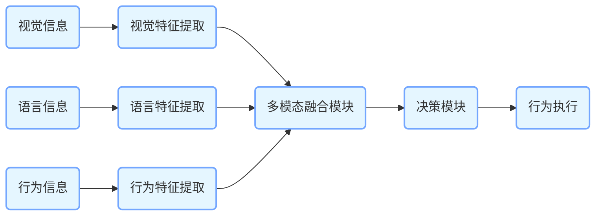

# AI Agent的视觉-语言-行为三模态融合

> 关键词：AI Agent、视觉-语言-行为、三模态融合、多模态学习、人工智能

> 摘要：本文围绕AI Agent的视觉-语言-行为三模态融合展开深入探讨。首先介绍了该领域的背景，包括目的范围、预期读者等内容。接着阐述了视觉、语言、行为这三个核心概念及其相互联系，通过文本示意图和Mermaid流程图进行直观展示。详细讲解了实现三模态融合的核心算法原理，并用Python源代码进行阐述。对涉及的数学模型和公式进行了详细说明并举例。通过项目实战给出代码实际案例并进行解读分析。探讨了其实际应用场景，推荐了相关的学习资源、开发工具框架以及论文著作。最后总结了未来发展趋势与挑战，还设置了附录解答常见问题，并提供了扩展阅读和参考资料，旨在全面深入地剖析AI Agent的视觉-语言-行为三模态融合技术。

## 1. 背景介绍 
### 1.1 目的和范围
AI Agent的视觉-语言-行为三模态融合的研究目的在于使AI Agent能够像人类一样，综合利用视觉、语言和行为信息来感知环境、理解任务并执行相应动作。传统的AI系统往往只侧重于单一模态的信息处理，如仅处理图像的计算机视觉系统、仅处理文本的自然语言处理系统等。然而，在现实世界中，人类是通过多种感官和行为来与环境交互的，这种多模态的信息处理方式使得人类能够更全面、准确地理解和应对各种情况。因此，实现AI Agent的视觉-语言-行为三模态融合具有重要的理论和实际意义。

本研究的范围涵盖了从基础的多模态信息表示、融合方法到实际应用场景的探索。具体包括研究如何将视觉图像、语言文本和行为动作进行有效的特征提取和表示，采用何种融合策略将这些不同模态的信息整合在一起，以及如何将融合后的信息应用于实际的任务中，如机器人导航、智能客服、智能家居控制等。

### 1.2 预期读者
本文预期读者主要包括人工智能领域的研究人员、开发者、学生以及对多模态融合技术感兴趣的专业人士。对于研究人员，本文可以为他们提供该领域的最新研究进展和技术思路，启发他们在相关方向上进行更深入的研究。对于开发者，本文将提供具体的算法实现和项目实战案例，帮助他们在实际项目中应用视觉-语言-行为三模态融合技术。对于学生，本文可以作为学习多模态学习和AI Agent相关知识的参考资料，帮助他们建立起系统的知识体系。

### 1.3 文档结构概述
本文将按照以下结构进行组织：首先介绍背景知识，包括目的范围、预期读者等内容。接着阐述视觉、语言、行为这三个核心概念及其相互联系，通过文本示意图和Mermaid流程图进行直观展示。详细讲解实现三模态融合的核心算法原理，并用Python源代码进行阐述。对涉及的数学模型和公式进行详细说明并举例。通过项目实战给出代码实际案例并进行解读分析。探讨其实际应用场景，推荐相关的学习资源、开发工具框架以及论文著作。最后总结未来发展趋势与挑战，设置附录解答常见问题，并提供扩展阅读和参考资料。

### 1.4 术语表
#### 1.4.1 核心术语定义
- **AI Agent**：即人工智能智能体，是一种能够感知环境、进行决策并执行相应动作的智能实体。它可以是软件程序，也可以是物理机器人。
- **视觉-语言-行为三模态融合**：指将视觉、语言和行为这三种不同模态的信息进行整合和处理，以实现更全面、准确的感知和决策。
- **多模态学习**：研究如何处理和融合来自不同模态（如视觉、听觉、语言等）信息的机器学习领域。
- **特征提取**：从原始数据中提取出具有代表性的特征，以便后续的处理和分析。
- **融合策略**：用于将不同模态的信息整合在一起的方法和技术。

#### 1.4.2 相关概念解释
- **视觉信息**：通常指通过摄像头等设备获取的图像或视频数据，包含了物体的形状、颜色、位置等信息。
- **语言信息**：包括文本、语音等形式的自然语言数据，用于表达语义、任务指令等信息。
- **行为信息**：指AI Agent执行的动作，如机器人的运动轨迹、操作动作等。

#### 1.4.3 缩略词列表
- **CNN**：卷积神经网络（Convolutional Neural Network）
- **RNN**：循环神经网络（Recurrent Neural Network）
- **LSTM**：长短期记忆网络（Long Short-Term Memory）
- **Transformer**：一种基于注意力机制的深度学习模型

## 2. 核心概念与联系 

### 核心概念原理
#### 视觉模态
视觉模态主要涉及对图像和视频数据的处理和理解。在计算机视觉领域，通常会使用卷积神经网络（CNN）来提取图像的特征。CNN通过卷积层、池化层等操作，能够自动学习图像中的局部特征，如边缘、纹理等。例如，在一个图像分类任务中，CNN可以学习到不同物体的特征模式，从而将图像分类到不同的类别中。

#### 语言模态
语言模态主要处理自然语言文本或语音数据。自然语言处理（NLP）技术用于对语言信息进行分析和理解。常见的方法包括使用循环神经网络（RNN）及其变体，如长短期记忆网络（LSTM），来处理序列数据。近年来，Transformer模型在NLP领域取得了巨大的成功，它通过自注意力机制能够更好地捕捉文本中的语义信息。

#### 行为模态
行为模态涉及AI Agent的动作执行和决策。在机器人领域，行为模态可以表示机器人的运动轨迹、操作动作等。行为决策通常基于对视觉和语言信息的理解，例如，根据视觉信息识别出目标物体，再根据语言指令确定对目标物体的操作动作。

### 架构的文本示意图
视觉、语言和行为三模态信息通过各自的特征提取模块进行处理，得到对应的特征表示。然后，这些特征通过融合模块进行整合，生成统一的多模态特征表示。最后，基于这个多模态特征表示，AI Agent进行决策并执行相应的行为动作。

### Mermaid流程图


## 3. 核心算法原理 & 具体操作步骤 

### 特征提取
#### 视觉特征提取
在Python中，可以使用深度学习框架如PyTorch来实现视觉特征提取。以下是一个简单的示例，使用预训练的ResNet模型来提取图像的特征：
```python
import torch
import torchvision.models as models
import torchvision.transforms as transforms
from PIL import Image

# 加载预训练的ResNet模型
resnet = models.resnet18(pretrained=True)
# 移除最后一层全连接层，用于提取特征
feature_extractor = torch.nn.Sequential(*list(resnet.children())[:-1])
feature_extractor.eval()

# 图像预处理
transform = transforms.Compose([
    transforms.Resize(256),
    transforms.CenterCrop(224),
    transforms.ToTensor(),
    transforms.Normalize(mean=[0.485, 0.456, 0.406], std=[0.229, 0.224, 0.225])
])

# 加载图像
image = Image.open('example.jpg')
image = transform(image).unsqueeze(0)

# 提取特征
with torch.no_grad():
    features = feature_extractor(image)
    features = features.squeeze()

print(features.shape)
```
#### 语言特征提取
对于语言特征提取，可以使用Hugging Face的Transformers库。以下是一个使用预训练的BERT模型提取文本特征的示例：
```python
from transformers import AutoTokenizer, AutoModel
import torch

# 加载预训练的BERT模型和分词器
tokenizer = AutoTokenizer.from_pretrained('bert-base-uncased')
model = AutoModel.from_pretrained('bert-base-uncased')
model.eval()

# 输入文本
text = "This is an example sentence."

# 分词
inputs = tokenizer(text, return_tensors='pt')

# 提取特征
with torch.no_grad():
    outputs = model(**inputs)
    # 取[CLS]标记的特征作为句子的表示
    features = outputs.last_hidden_state[:, 0, :]

print(features.shape)
```

### 多模态融合
一种常见的多模态融合方法是简单的拼接。以下是一个将视觉特征和语言特征拼接的示例：
```python
# 假设已经提取了视觉特征和语言特征
visual_features = torch.randn(512)
language_features = torch.randn(768)

# 拼接特征
combined_features = torch.cat((visual_features, language_features), dim=0)

print(combined_features.shape)
```

### 决策与行为执行
在得到多模态特征后，可以使用一个全连接神经网络进行决策。以下是一个简单的示例：
```python
import torch.nn as nn

# 定义决策网络
class DecisionNetwork(nn.Module):
    def __init__(self, input_size, output_size):
        super(DecisionNetwork, self).__init__()
        self.fc1 = nn.Linear(input_size, 256)
        self.relu = nn.ReLU()
        self.fc2 = nn.Linear(256, output_size)

    def forward(self, x):
        x = self.fc1(x)
        x = self.relu(x)
        x = self.fc2(x)
        return x

# 假设多模态特征的维度为512 + 768 = 1280
input_size = 1280
# 假设输出为10个类别
output_size = 10

# 创建决策网络
decision_network = DecisionNetwork(input_size, output_size)

# 输入多模态特征
input_features = torch.randn(input_size)

# 进行决策
output = decision_network(input_features)

print(output.shape)
```

## 4. 数学模型和公式 & 详细讲解 & 举例说明 

### 特征提取的数学模型
#### 视觉特征提取
在卷积神经网络中，卷积层的操作可以用以下公式表示：
$$y_{i,j}^k = \sum_{m=0}^{M-1} \sum_{n=0}^{N-1} x_{i+m,j+n} w_{m,n}^k + b^k$$
其中，$x$ 是输入图像，$w$ 是卷积核，$b$ 是偏置，$y$ 是卷积后的特征图，$k$ 表示第 $k$ 个卷积核，$M$ 和 $N$ 是卷积核的大小。

例如，假设有一个输入图像 $x$ 大小为 $32\times32$，卷积核 $w$ 大小为 $3\times3$，有 16 个卷积核。那么经过卷积操作后，会得到 16 个大小为 $30\times30$ 的特征图。

#### 语言特征提取
在Transformer模型中，自注意力机制的计算可以用以下公式表示：
$$\text{Attention}(Q, K, V) = \text{softmax}(\frac{QK^T}{\sqrt{d_k}})V$$
其中，$Q$、$K$、$V$ 分别是查询、键和值矩阵，$d_k$ 是查询和键的维度。

例如，假设输入的词向量序列的维度为 $d = 512$，查询、键和值的维度 $d_k = d_v = 64$。那么在自注意力计算中，会先将输入的词向量分别投影到查询、键和值空间，然后进行上述的注意力计算。

### 多模态融合的数学模型
简单的拼接融合可以用以下公式表示：
$$z = [x; y]$$
其中，$x$ 和 $y$ 分别是不同模态的特征向量，$z$ 是融合后的特征向量。

例如，假设视觉特征向量 $x$ 的维度为 512，语言特征向量 $y$ 的维度为 768，那么融合后的特征向量 $z$ 的维度为 $512 + 768 = 1280$。

### 决策网络的数学模型
决策网络通常是一个全连接神经网络，其前向传播过程可以用以下公式表示：
$$h_1 = \text{ReLU}(W_1x + b_1)$$
$$y = W_2h_1 + b_2$$
其中，$x$ 是输入的多模态特征向量，$W_1$ 和 $W_2$ 是权重矩阵，$b_1$ 和 $b_2$ 是偏置向量，$h_1$ 是隐藏层的输出，$y$ 是最终的输出。

例如，假设输入的多模态特征向量 $x$ 的维度为 1280，隐藏层的神经元数量为 256，输出的类别数为 10。那么 $W_1$ 的维度为 $256\times1280$，$b_1$ 的维度为 256，$W_2$ 的维度为 $10\times256$，$b_2$ 的维度为 10。

## 5. 项目实战：代码实际案例和详细解释说明 

### 5.1  开发环境搭建
#### 安装Python
首先需要安装Python，建议使用Python 3.7及以上版本。可以从Python官方网站（https://www.python.org/downloads/）下载并安装。

#### 安装深度学习框架
本项目使用PyTorch和Hugging Face的Transformers库。可以使用以下命令进行安装：
```sh
pip install torch torchvision
pip install transformers
```

#### 安装其他依赖库
还需要安装一些其他的依赖库，如Pillow用于图像处理：
```sh
pip install pillow
```

### 5.2  源代码详细实现和代码解读
以下是一个完整的项目示例，实现了AI Agent的视觉-语言-行为三模态融合。

```python
import torch
import torchvision.models as models
import torchvision.transforms as transforms
from PIL import Image
from transformers import AutoTokenizer, AutoModel
import torch.nn as nn

# 视觉特征提取
class VisualFeatureExtractor:
    def __init__(self):
        self.resnet = models.resnet18(pretrained=True)
        self.feature_extractor = torch.nn.Sequential(*list(self.resnet.children())[:-1])
        self.feature_extractor.eval()
        self.transform = transforms.Compose([
            transforms.Resize(256),
            transforms.CenterCrop(224),
            transforms.ToTensor(),
            transforms.Normalize(mean=[0.485, 0.456, 0.406], std=[0.229, 0.224, 0.225])
        ])

    def extract_features(self, image_path):
        image = Image.open(image_path)
        image = self.transform(image).unsqueeze(0)
        with torch.no_grad():
            features = self.feature_extractor(image)
            features = features.squeeze()
        return features

# 语言特征提取
class LanguageFeatureExtractor:
    def __init__(self):
        self.tokenizer = AutoTokenizer.from_pretrained('bert-base-uncased')
        self.model = AutoModel.from_pretrained('bert-base-uncased')
        self.model.eval()

    def extract_features(self, text):
        inputs = self.tokenizer(text, return_tensors='pt')
        with torch.no_grad():
            outputs = self.model(**inputs)
            features = outputs.last_hidden_state[:, 0, :]
        return features

# 多模态融合
class MultiModalFusion:
    def __init__(self):
        pass

    def fuse_features(self, visual_features, language_features):
        combined_features = torch.cat((visual_features, language_features), dim=0)
        return combined_features

# 决策网络
class DecisionNetwork(nn.Module):
    def __init__(self, input_size, output_size):
        super(DecisionNetwork, self).__init__()
        self.fc1 = nn.Linear(input_size, 256)
        self.relu = nn.ReLU()
        self.fc2 = nn.Linear(256, output_size)

    def forward(self, x):
        x = self.fc1(x)
        x = self.relu(x)
        x = self.fc2(x)
        return x

# 主函数
def main():
    # 初始化特征提取器和融合模块
    visual_extractor = VisualFeatureExtractor()
    language_extractor = LanguageFeatureExtractor()
    fusion = MultiModalFusion()

    # 提取视觉特征
    visual_features = visual_extractor.extract_features('example.jpg')

    # 提取语言特征
    text = "This is an example sentence."
    language_features = language_extractor.extract_features(text)

    # 融合特征
    combined_features = fusion.fuse_features(visual_features, language_features)

    # 初始化决策网络
    input_size = visual_features.shape[0] + language_features.shape[1]
    output_size = 10
    decision_network = DecisionNetwork(input_size, output_size)

    # 进行决策
    output = decision_network(combined_features)

    print(output.shape)

if __name__ == "__main__":
    main()
```

### 5.3  代码解读与分析
- **VisualFeatureExtractor类**：负责视觉特征的提取。使用预训练的ResNet模型，通过移除最后一层全连接层来提取图像的特征。
- **LanguageFeatureExtractor类**：负责语言特征的提取。使用预训练的BERT模型，取[CLS]标记的特征作为句子的表示。
- **MultiModalFusion类**：负责多模态特征的融合。使用简单的拼接方法将视觉特征和语言特征融合在一起。
- **DecisionNetwork类**：定义了一个全连接神经网络，用于进行决策。输入是融合后的多模态特征，输出是决策结果。
- **main函数**：主函数，依次调用特征提取、特征融合和决策网络，完成整个流程。

## 6. 实际应用场景 
### 智能机器人
在智能机器人领域，视觉-语言-行为三模态融合技术可以使机器人更好地理解环境和任务。例如，机器人可以通过视觉识别周围的物体和场景，根据语言指令确定要执行的任务，然后通过行为模块执行相应的动作。在家庭服务机器人中，用户可以用语言指令机器人去拿某个物品，机器人通过视觉找到该物品，然后移动到物品所在位置并将其拿起。

### 智能客服
智能客服系统可以利用三模态融合技术提供更智能、更人性化的服务。通过视觉分析用户的表情和肢体语言，结合用户的语言输入，更准确地理解用户的需求和情绪状态。例如，当用户在视频客服中表现出焦急的情绪时，客服系统可以更快地响应并提供更贴心的服务。

### 智能家居
在智能家居系统中，三模态融合技术可以实现更自然、便捷的交互方式。用户可以通过语音指令控制家电设备，同时系统可以通过视觉感知用户的位置和动作，自动调整设备的状态。例如，当用户走进房间时，系统可以通过视觉检测到用户的到来，同时根据用户的语音指令打开灯光、调节温度等。

### 自动驾驶
在自动驾驶领域，视觉-语言-行为三模态融合技术可以提高自动驾驶车辆的安全性和智能性。车辆通过视觉传感器感知周围的道路环境和交通标志，结合语音导航指令，做出相应的驾驶决策。例如，当语音导航提示前方路口左转时，车辆通过视觉识别路口的交通状况，安全地完成左转动作。

## 7. 工具和资源推荐
### 7.1 学习资源推荐
#### 7.1.1 书籍推荐
- 《深度学习》（Deep Learning）：由Ian Goodfellow、Yoshua Bengio和Aaron Courville所著，是深度学习领域的经典教材，涵盖了深度学习的基本原理、算法和应用。
- 《Python深度学习》（Deep Learning with Python）：由Francois Chollet所著，以Python和Keras为工具，介绍了深度学习的实践方法。
- 《自然语言处理入门》（Natural Language Processing in Action）：由Hobson Lane、Cole Howard和 Hannes Hapke所著，系统地介绍了自然语言处理的基本概念、算法和应用。

#### 7.1.2 在线课程
- Coursera上的“深度学习专项课程”（Deep Learning Specialization）：由Andrew Ng教授主讲，包括神经网络和深度学习、改善深层神经网络、结构化机器学习项目等多门课程。
- edX上的“自然语言处理基础”（Foundations of Natural Language Processing）：介绍了自然语言处理的基本概念和技术。
- Udemy上的“计算机视觉实战课程”（Computer Vision A-Z™: Hands-On Computer Vision with Python）：通过实际项目讲解计算机视觉的应用。

#### 7.1.3 技术博客和网站
- Medium：有很多人工智能领域的优秀博客文章，涵盖了最新的研究成果和技术应用。
- arXiv：是一个预印本平台，提供了大量的学术论文，包括多模态学习、AI Agent等领域的最新研究。
- OpenAI Blog：OpenAI发布的博客文章，介绍了他们在人工智能领域的最新研究和成果。

### 7.2 开发工具框架推荐
#### 7.2.1 IDE和编辑器
- PyCharm：是一款专门为Python开发设计的集成开发环境，具有强大的代码编辑、调试和项目管理功能。
- Visual Studio Code：是一款轻量级的代码编辑器，支持多种编程语言，有丰富的插件可以扩展功能。
- Jupyter Notebook：是一个交互式的开发环境，适合进行数据分析和模型训练的实验。

#### 7.2.2 调试和性能分析工具
- PyTorch Profiler：是PyTorch自带的性能分析工具，可以帮助开发者分析模型的性能瓶颈。
- TensorBoard：是TensorFlow的可视化工具，也可以与PyTorch结合使用，用于可视化训练过程和模型性能。
- cProfile：是Python的内置性能分析工具，可以帮助开发者找出代码中的性能瓶颈。

#### 7.2.3 相关框架和库
- PyTorch：是一个开源的深度学习框架，具有动态图计算的优势，广泛应用于计算机视觉、自然语言处理等领域。
- Hugging Face Transformers：是一个自然语言处理库，提供了大量的预训练模型和工具，方便开发者进行语言处理任务。
- OpenCV：是一个计算机视觉库，提供了丰富的图像处理和计算机视觉算法，如图像滤波、特征提取等。

### 7.3 相关论文著作推荐
#### 7.3.1 经典论文
- “Attention Is All You Need”：提出了Transformer模型，开创了基于注意力机制的深度学习新时代。
- “ImageNet Classification with Deep Convolutional Neural Networks”：介绍了AlexNet模型，推动了卷积神经网络在计算机视觉领域的发展。
- “Long Short-Term Memory”：提出了长短期记忆网络（LSTM），解决了传统循环神经网络的梯度消失问题。

#### 7.3.2 最新研究成果
- 关注顶级学术会议如NeurIPS、ICCV、ACL等的最新论文，了解多模态学习和AI Agent领域的最新研究进展。
- 关注知名研究机构如OpenAI、DeepMind等的研究成果，他们在人工智能领域处于领先地位。

#### 7.3.3 应用案例分析
- 一些企业和研究机构会发布他们在实际项目中应用多模态融合技术的案例分析，可以从中学习到实际应用中的经验和技巧。例如，谷歌在自动驾驶、智能家居等领域的应用案例。

## 8. 总结：未来发展趋势与挑战
### 未来发展趋势
#### 更强大的多模态融合模型
未来，将会有更强大的多模态融合模型出现，能够更好地处理不同模态之间的复杂关系。例如，结合Transformer架构的多模态模型可能会在视觉-语言-行为三模态融合中取得更好的效果。

#### 跨模态迁移学习
跨模态迁移学习将成为一个重要的研究方向。通过在不同模态之间迁移知识，可以提高模型的泛化能力和学习效率。例如，将在视觉领域学习到的知识迁移到语言处理任务中。

#### 与其他技术的融合
AI Agent的视觉-语言-行为三模态融合技术将与其他技术如物联网、区块链等进行融合。例如，在智能家居中，结合物联网技术可以实现更智能的设备控制和交互。

### 挑战
#### 数据标注和获取
多模态数据的标注和获取是一个挑战。由于不同模态的数据具有不同的特点，需要设计合适的标注方法和数据采集方案。例如，在获取视觉-语言-行为三模态数据时，需要同时记录图像、语言文本和行为动作，并且进行准确的标注。

#### 计算资源和效率
多模态融合模型通常需要大量的计算资源和时间进行训练。如何提高模型的训练效率，减少计算资源的消耗，是一个需要解决的问题。例如，采用分布式训练、模型压缩等技术来提高训练效率。

#### 语义理解和对齐
不同模态的数据在语义层面的理解和对齐是一个难题。如何准确地捕捉不同模态之间的语义关联，是实现有效多模态融合的关键。例如，在视觉和语言模态中，如何将图像中的物体和语言描述进行准确的对齐。

## 9. 附录：常见问题与解答
### 1. 如何选择合适的特征提取方法？
选择合适的特征提取方法需要考虑数据的特点和任务的需求。对于视觉数据，可以根据图像的复杂度和任务的要求选择不同的卷积神经网络模型，如ResNet、VGG等。对于语言数据，可以使用预训练的语言模型，如BERT、GPT等。

### 2. 多模态融合有哪些其他的方法？
除了简单的拼接方法，还有一些其他的多模态融合方法，如注意力机制融合、多模态交互网络等。注意力机制可以根据不同模态的重要性动态地分配权重，从而更好地融合不同模态的信息。

### 3. 如何评估多模态融合模型的性能？
可以根据具体的任务选择合适的评估指标。例如，在分类任务中，可以使用准确率、召回率、F1值等指标；在回归任务中，可以使用均方误差、平均绝对误差等指标。同时，还可以进行用户调研和实际应用测试，评估模型的实用性和用户体验。

### 4. 多模态融合模型的训练过程中可能会遇到哪些问题？
在训练过程中可能会遇到梯度消失、梯度爆炸、过拟合等问题。可以采用一些优化方法来解决这些问题，如使用合适的激活函数、正则化技术、调整学习率等。

## 10. 扩展阅读 & 参考资料
### 扩展阅读
- 关注人工智能领域的顶级学术会议和期刊，如NeurIPS、ICCV、ACL、Journal of Artificial Intelligence Research等，获取最新的研究成果和技术进展。
- 阅读相关的研究报告和技术白皮书，了解行业动态和发展趋势。

### 参考资料
- Goodfellow, I., Bengio, Y., & Courville, A. (2016). Deep Learning. MIT Press.
- Chollet, F. (2018). Deep Learning with Python. Manning Publications.
- Lane, H., Howard, C., & Hapke, H. (2019). Natural Language Processing in Action. Manning Publications.
- Vaswani, A., Shazeer, N., Parmar, N., et al. (2017). Attention Is All You Need. Advances in Neural Information Processing Systems.
- Krizhevsky, A., Sutskever, I., & Hinton, G. E. (2012). ImageNet Classification with Deep Convolutional Neural Networks. Advances in Neural Information Processing Systems.
- Hochreiter, S., & Schmidhuber, J. (1997). Long Short-Term Memory. Neural Computation.