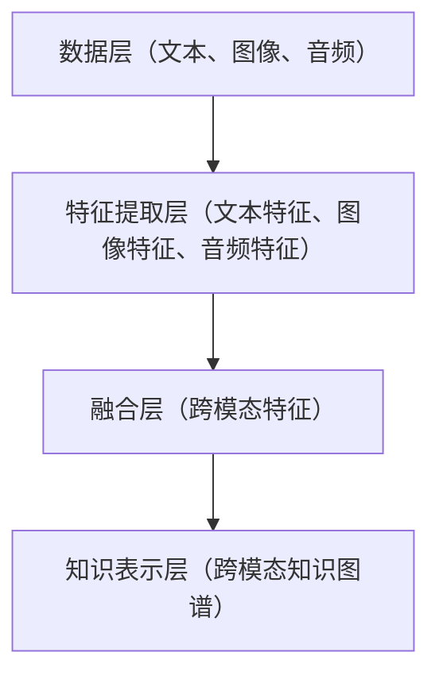

# AI Agent的跨模态知识图谱构建与应用

> 关键词：AI Agent、跨模态、知识图谱、构建、应用

> 摘要：本文围绕AI Agent的跨模态知识图谱构建与应用展开深入探讨。首先介绍了相关背景，包括目的、预期读者等内容。接着阐述了核心概念及联系，详细剖析了跨模态知识图谱的原理和架构。通过Python源代码讲解了核心算法原理及具体操作步骤，同时给出数学模型和公式并举例说明。在项目实战部分，提供了开发环境搭建、源代码实现及解读。随后探讨了实际应用场景，推荐了相关工具和资源，包括学习资源、开发工具框架以及论文著作等。最后总结了未来发展趋势与挑战，给出常见问题解答和扩展阅读参考资料，旨在为读者全面呈现AI Agent的跨模态知识图谱构建与应用的相关知识和技术。

## 1. 背景介绍 
### 1.1 目的和范围
随着人工智能技术的不断发展，单一模态的数据处理已经难以满足复杂的应用需求。跨模态知识图谱作为一种整合多种模态信息的知识表示形式，能够更全面、准确地描述现实世界的知识。AI Agent作为智能的执行体，结合跨模态知识图谱可以实现更智能、高效的决策和交互。本文的目的在于详细阐述AI Agent的跨模态知识图谱的构建方法和应用场景，范围涵盖了从基本概念到具体实现，再到实际应用和未来展望的全过程。

### 1.2 预期读者
本文预期读者包括人工智能领域的研究人员、开发者、学生以及对跨模态知识图谱和AI Agent技术感兴趣的相关人士。对于希望深入了解该领域技术原理和应用的读者，本文提供了全面且深入的技术内容。

### 1.3 文档结构概述
本文首先介绍背景知识，让读者了解研究的目的和范围。接着阐述核心概念与联系，包括跨模态知识图谱的原理和架构。然后详细讲解核心算法原理及具体操作步骤，通过Python代码进行说明。再给出数学模型和公式并举例。在项目实战部分，介绍开发环境搭建、源代码实现及解读。之后探讨实际应用场景，推荐相关工具和资源。最后总结未来发展趋势与挑战，给出常见问题解答和扩展阅读参考资料。

### 1.4 术语表
#### 1.4.1 核心术语定义
- **AI Agent**：人工智能代理，是一种能够感知环境、进行决策并采取行动的智能实体。
- **跨模态**：指融合多种不同模态的数据，如文本、图像、音频等。
- **知识图谱**：一种以图的形式表示知识的结构化语义网络，由实体、关系和属性组成。

#### 1.4.2 相关概念解释
- **多模态数据**：包含多种不同类型的数据，例如在一个场景中同时存在图像、文本和音频信息。
- **语义理解**：对数据所包含的语义信息进行分析和理解，以便更好地处理和利用知识。

#### 1.4.3 缩略词列表
- **KG**：Knowledge Graph，知识图谱
- **AI**：Artificial Intelligence，人工智能

## 2. 核心概念与联系 

### 2.1 跨模态知识图谱的原理
跨模态知识图谱的核心原理在于将不同模态的数据进行融合和关联，形成一个统一的知识表示。不同模态的数据具有各自的特点和优势，例如文本数据能够提供详细的语义信息，图像数据能够直观地展示视觉信息，音频数据能够传达声音相关的信息。通过跨模态知识图谱，可以将这些不同模态的数据所包含的知识进行整合，使得知识的表示更加全面和准确。

### 2.2 跨模态知识图谱的架构
跨模态知识图谱的架构主要包括数据层、特征提取层、融合层和知识表示层。

- **数据层**：负责收集和存储各种不同模态的数据，如文本文件、图像文件、音频文件等。
- **特征提取层**：对不同模态的数据进行特征提取，将原始数据转换为计算机能够处理的特征向量。例如，对于文本数据可以使用词嵌入技术提取语义特征，对于图像数据可以使用卷积神经网络提取视觉特征。
- **融合层**：将不同模态的特征向量进行融合，得到统一的跨模态特征表示。常见的融合方法包括早期融合、晚期融合和深度融合等。
- **知识表示层**：将融合后的跨模态特征表示转换为知识图谱的形式，以实体、关系和属性的方式进行表示。

### 2.3 文本示意图
```plaintext
+------------------+
|    数据层        |
| （文本、图像、音频）|
+------------------+
        |
        v
+------------------+
|  特征提取层      |
| （文本特征、图像特征、音频特征）|
+------------------+
        |
        v
+------------------+
|  融合层          |
| （跨模态特征）    |
+------------------+
        |
        v
+------------------+
|  知识表示层      |
| （跨模态知识图谱）|
+------------------+
```

### 2.4 Mermaid流程图


## 3. 核心算法原理 & 具体操作步骤 

### 3.1 特征提取算法
#### 3.1.1 文本特征提取
对于文本数据，我们可以使用词嵌入技术将文本转换为向量表示。以Word2Vec为例，其基本思想是通过训练神经网络来学习词语的分布式表示。以下是使用Python和`gensim`库实现的示例代码：
```python
from gensim.models import Word2Vec
import numpy as np

# 示例文本数据
sentences = [['this', 'is', 'a', 'sample'], ['another', 'example']]

# 训练Word2Vec模型
model = Word2Vec(sentences, min_count=1)

# 获取词语的向量表示
word_vector = model.wv['sample']
print(word_vector)
```
#### 3.1.2 图像特征提取
对于图像数据，我们可以使用预训练的卷积神经网络（如ResNet）来提取特征。以下是使用Python和`torchvision`库实现的示例代码：
```python
import torch
import torchvision.models as models
import torchvision.transforms as transforms
from PIL import Image

# 加载预训练的ResNet模型
model = models.resnet18(pretrained=True)
model.eval()

# 定义图像预处理转换
preprocess = transforms.Compose([
    transforms.Resize(256),
    transforms.CenterCrop(224),
    transforms.ToTensor(),
    transforms.Normalize(mean=[0.485, 0.456, 0.406], std=[0.229, 0.224, 0.225])
])

# 加载图像
image = Image.open('example.jpg')
input_tensor = preprocess(image)
input_batch = input_tensor.unsqueeze(0)

# 提取图像特征
with torch.no_grad():
    features = model(input_batch)
print(features)
```

### 3.2 特征融合算法
#### 3.2.1 早期融合
早期融合是在特征提取之前将不同模态的数据进行合并。以下是一个简单的示例代码：
```python
import numpy as np

# 假设文本特征和图像特征
text_feature = np.array([1, 2, 3])
image_feature = np.array([4, 5, 6])

# 早期融合
early_fusion_feature = np.concatenate((text_feature, image_feature))
print(early_fusion_feature)
```
#### 3.2.2 晚期融合
晚期融合是在特征提取之后将不同模态的特征进行合并。以下是一个简单的示例代码：
```python
import numpy as np

# 假设文本特征和图像特征
text_feature = np.array([1, 2, 3])
image_feature = np.array([4, 5, 6])

# 晚期融合
late_fusion_feature = np.mean([text_feature, image_feature], axis=0)
print(late_fusion_feature)
```

### 3.3 知识图谱构建算法
知识图谱的构建主要包括实体识别、关系抽取和知识表示。以下是一个简单的示例代码，使用`spaCy`库进行实体识别：
```python
import spacy

# 加载英文语言模型
nlp = spacy.load('en_core_web_sm')

# 示例文本
text = 'Apple is a technology company founded by Steve Jobs.'

# 进行实体识别
doc = nlp(text)
for ent in doc.ents:
    print(ent.text, ent.label_)
```

## 4. 数学模型和公式 & 详细讲解 & 举例说明 

### 4.1 词嵌入模型
词嵌入模型的目标是将词语映射到低维向量空间中，使得语义相近的词语在向量空间中距离较近。以Word2Vec的Skip-gram模型为例，其目标函数可以表示为：
$$
\max_{\theta} \frac{1}{T} \sum_{t=1}^{T} \sum_{-c \leq j \leq c, j \neq 0} \log p(w_{t+j} | w_t; \theta)
$$
其中，$T$ 是语料库的长度，$c$ 是上下文窗口的大小，$w_t$ 是中心词，$w_{t+j}$ 是上下文词，$\theta$ 是模型的参数。

### 4.2 卷积神经网络
卷积神经网络（CNN）通过卷积层、池化层和全连接层来提取图像特征。卷积层的卷积操作可以表示为：
$$
y_{i,j}^l = \sum_{m=0}^{M-1} \sum_{n=0}^{N-1} x_{i+m,j+n}^{l-1} \cdot k_{m,n}^l + b^l
$$
其中，$y_{i,j}^l$ 是第 $l$ 层的特征图中第 $(i,j)$ 位置的值，$x_{i+m,j+n}^{l-1}$ 是第 $l-1$ 层的特征图中第 $(i+m,j+n)$ 位置的值，$k_{m,n}^l$ 是第 $l$ 层的卷积核中第 $(m,n)$ 位置的值，$b^l$ 是第 $l$ 层的偏置。

### 4.3 特征融合模型
以晚期融合为例，融合后的特征向量 $f_{fusion}$ 可以表示为：
$$
f_{fusion} = \frac{1}{K} \sum_{k=1}^{K} f_k
$$
其中，$K$ 是模态的数量，$f_k$ 是第 $k$ 个模态的特征向量。

### 4.4 举例说明
假设我们有一个文本描述“这是一个苹果”和对应的苹果图像。通过词嵌入模型，将文本中的“苹果”转换为向量 $v_{text} = [0.1, 0.2, 0.3]$。通过卷积神经网络，从图像中提取特征向量 $v_{image} = [0.4, 0.5, 0.6]$。使用晚期融合方法，融合后的特征向量为：
$$
f_{fusion} = \frac{v_{text} + v_{image}}{2} = \left[\frac{0.1 + 0.4}{2}, \frac{0.2 + 0.5}{2}, \frac{0.3 + 0.6}{2}\right] = [0.25, 0.35, 0.45]
$$

## 5. 项目实战：代码实际案例和详细解释说明 

### 5.1  开发环境搭建
#### 5.1.1 安装Python
首先需要安装Python，建议使用Python 3.7及以上版本。可以从Python官方网站（https://www.python.org/downloads/）下载安装包进行安装。

#### 5.1.2 安装必要的库
使用`pip`命令安装所需的库，例如：
```sh
pip install gensim torch torchvision spacy
python -m spacy download en_core_web_sm
```

### 5.2  源代码详细实现和代码解读
以下是一个完整的项目示例，实现了跨模态知识图谱的构建：
```python
import numpy as np
from gensim.models import Word2Vec
import torch
import torchvision.models as models
import torchvision.transforms as transforms
from PIL import Image
import spacy

# 文本特征提取
def extract_text_features(sentences):
    model = Word2Vec(sentences, min_count=1)
    text_features = []
    for sentence in sentences:
        sentence_features = []
        for word in sentence:
            if word in model.wv:
                sentence_features.append(model.wv[word])
        if sentence_features:
            text_features.append(np.mean(sentence_features, axis=0))
    return np.array(text_features)

# 图像特征提取
def extract_image_features(image_path):
    model = models.resnet18(pretrained=True)
    model.eval()
    preprocess = transforms.Compose([
        transforms.Resize(256),
        transforms.CenterCrop(224),
        transforms.ToTensor(),
        transforms.Normalize(mean=[0.485, 0.456, 0.406], std=[0.229, 0.224, 0.225])
    ])
    image = Image.open(image_path)
    input_tensor = preprocess(image)
    input_batch = input_tensor.unsqueeze(0)
    with torch.no_grad():
        features = model(input_batch)
    return features.numpy().flatten()

# 特征融合
def fuse_features(text_features, image_features):
    return np.mean([text_features, image_features], axis=0)

# 知识图谱构建
def build_knowledge_graph(text):
    nlp = spacy.load('en_core_web_sm')
    doc = nlp(text)
    entities = []
    for ent in doc.ents:
        entities.append((ent.text, ent.label_))
    return entities

# 示例数据
sentences = [['this', 'is', 'a', 'sample'], ['another', 'example']]
image_path = 'example.jpg'
text = 'Apple is a technology company founded by Steve Jobs.'

# 提取特征
text_features = extract_text_features(sentences)
image_features = extract_image_features(image_path)

# 特征融合
fused_features = fuse_features(text_features[0], image_features)

# 构建知识图谱
knowledge_graph = build_knowledge_graph(text)

print("Text Features:", text_features)
print("Image Features:", image_features)
print("Fused Features:", fused_features)
print("Knowledge Graph:", knowledge_graph)
```
### 5.3  代码解读与分析
- **`extract_text_features` 函数**：使用`Word2Vec`模型提取文本特征，将每个句子中的词语向量求平均作为句子的特征表示。
- **`extract_image_features` 函数**：使用预训练的`ResNet18`模型提取图像特征，将图像经过预处理后输入模型，得到特征向量。
- **`fuse_features` 函数**：将文本特征和图像特征进行晚期融合，求平均值得到融合后的特征向量。
- **`build_knowledge_graph` 函数**：使用`spaCy`库进行实体识别，构建知识图谱的实体部分。

## 6. 实际应用场景 
### 6.1 智能客服
在智能客服系统中，AI Agent可以结合跨模态知识图谱，处理用户的文本、语音和图像等多模态信息。例如，用户可以通过语音描述问题，同时上传相关的图片，AI Agent利用跨模态知识图谱理解用户的需求，提供更准确的回答和解决方案。

### 6.2 智能医疗
在智能医疗领域，跨模态知识图谱可以整合患者的病历文本、医学影像（如X光、CT等）和生命体征数据（如心率、血压等）。AI Agent可以基于这些跨模态信息进行疾病诊断、治疗方案推荐等任务，提高医疗服务的质量和效率。

### 6.3 智能教育
在智能教育系统中，跨模态知识图谱可以融合教材文本、教学视频、实验数据等多种信息。AI Agent可以根据学生的学习情况和需求，提供个性化的学习资源和指导，实现更加高效的学习。

### 6.4 智能安防
在智能安防领域，跨模态知识图谱可以整合监控视频、报警文本、传感器数据等信息。AI Agent可以实时分析这些多模态信息，及时发现异常事件并采取相应的措施，保障安全。

## 7. 工具和资源推荐
### 7.1 学习资源推荐
#### 7.1.1 书籍推荐
- 《人工智能：一种现代的方法》：全面介绍了人工智能的基本概念、算法和应用，是人工智能领域的经典教材。
- 《深度学习》：由深度学习领域的三位先驱Ian Goodfellow、Yoshua Bengio和Aaron Courville撰写，详细介绍了深度学习的理论和实践。
- 《知识图谱：方法、实践与应用》：系统介绍了知识图谱的构建方法、应用场景和相关技术。

#### 7.1.2 在线课程
- Coursera上的“人工智能基础”课程：由知名大学的教授授课，讲解人工智能的基本概念和算法。
- edX上的“深度学习”课程：提供深度学习的理论和实践教学，包括TensorFlow等深度学习框架的使用。
- 中国大学MOOC上的“知识图谱”课程：介绍知识图谱的基本概念、构建方法和应用案例。

#### 7.1.3 技术博客和网站
- Medium：有很多人工智能领域的技术博客，涵盖了跨模态知识图谱、AI Agent等相关技术的最新研究成果和实践经验。
- arXiv：提供了大量的学术论文，包括人工智能领域的前沿研究。
- 开源中国：有很多开发者分享的人工智能相关的技术文章和项目经验。

### 7.2 开发工具框架推荐
#### 7.2.1 IDE和编辑器
- PyCharm：功能强大的Python集成开发环境，提供代码编辑、调试、版本控制等功能。
- Jupyter Notebook：交互式的开发环境，适合进行数据分析、模型训练和实验验证。
- Visual Studio Code：轻量级的代码编辑器，支持多种编程语言和插件扩展。

#### 7.2.2 调试和性能分析工具
- TensorBoard：用于可视化深度学习模型的训练过程和性能指标。
- Py-Spy：用于分析Python程序的性能瓶颈，找出耗时的代码段。
- cProfile：Python内置的性能分析工具，用于统计函数的调用次数和执行时间。

#### 7.2.3 相关框架和库
- PyTorch：开源的深度学习框架，提供了丰富的神经网络模型和优化算法。
- TensorFlow：谷歌开发的深度学习框架，广泛应用于工业界和学术界。
- SpaCy：用于自然语言处理的Python库，提供了高效的实体识别、词性标注等功能。

### 7.3 相关论文著作推荐
#### 7.3.1 经典论文
- "Distributed Representations of Words and Phrases and their Compositionality"：介绍了Word2Vec模型的原理和实现。
- "Deep Residual Learning for Image Recognition"：提出了ResNet模型，解决了深度神经网络训练中的梯度消失问题。
- "Knowledge Graph Embedding: A Survey of Approaches and Applications"：对知识图谱嵌入技术进行了全面的综述。

#### 7.3.2 最新研究成果
- 关注ACM SIGKDD、NeurIPS、ICML等顶级学术会议上的相关论文，了解跨模态知识图谱和AI Agent领域的最新研究进展。

#### 7.3.3 应用案例分析
- 参考一些实际应用案例的论文，如智能医疗、智能客服等领域的跨模态知识图谱应用案例，学习如何将理论应用到实际场景中。

## 8. 总结：未来发展趋势与挑战
### 8.1 未来发展趋势
- **更深度的跨模态融合**：未来的研究将更加注重不同模态数据之间的深度融合，挖掘数据之间的潜在联系，提高跨模态知识图谱的表达能力。
- **多智能体协作**：多个AI Agent之间的协作将成为研究热点，通过协作可以更高效地处理复杂的任务，实现更智能的决策。
- **应用场景拓展**：跨模态知识图谱和AI Agent的应用场景将不断拓展，如在自动驾驶、智能家居等领域发挥更大的作用。

### 8.2 挑战
- **数据处理和标注**：跨模态数据的处理和标注是一个挑战，不同模态的数据具有不同的特点和格式，需要开发高效的数据处理和标注方法。
- **模型可解释性**：深度学习模型的可解释性是一个难题，跨模态知识图谱和AI Agent中的模型也面临同样的问题，需要提高模型的可解释性，以便更好地理解和应用模型。
- **隐私和安全**：跨模态数据包含大量的敏感信息，如医疗数据、个人隐私信息等，需要加强隐私和安全保护，防止数据泄露和滥用。

## 9. 附录：常见问题与解答
### 9.1 如何选择合适的特征提取算法？
选择合适的特征提取算法需要考虑数据的模态、特点和应用场景。对于文本数据，可以选择词嵌入技术如Word2Vec、BERT等；对于图像数据，可以选择预训练的卷积神经网络如ResNet、VGG等。同时，还需要根据具体的任务和数据规模进行实验和评估，选择效果最好的算法。

### 9.2 特征融合的方法有哪些优缺点？
早期融合的优点是简单直接，能够保留原始数据的信息；缺点是不同模态的数据在特征空间中的分布可能不同，直接融合可能会导致信息损失。晚期融合的优点是可以分别对不同模态的数据进行处理和优化，避免了早期融合的问题；缺点是需要更多的计算资源和时间。

### 9.3 如何提高知识图谱的质量？
提高知识图谱的质量可以从以下几个方面入手：选择高质量的数据源，使用准确的实体识别和关系抽取算法，进行人工审核和验证，不断更新和完善知识图谱。

## 10. 扩展阅读 & 参考资料
- Goodfellow, I., Bengio, Y., & Courville, A. (2016). Deep Learning. MIT Press.
- Russel, S. J., & Norvig, P. (2010). Artificial Intelligence: A Modern Approach. Pearson.
- 李涓子, 聂兰顺, 王克宏. (2016). 知识图谱：方法、实践与应用. 电子工业出版社.
- 相关学术论文和技术博客文章，如arXiv、ACM SIGKDD、NeurIPS、ICML等会议和期刊上的论文，Medium、开源中国等网站上的技术文章。