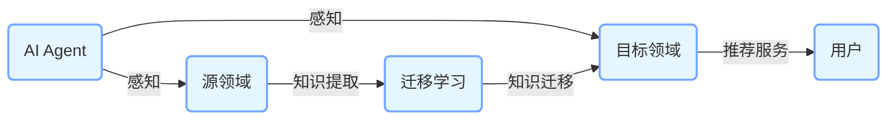

# AI Agent的迁移学习在跨领域推荐中的应用

> 关键词：AI Agent、迁移学习、跨领域推荐、推荐系统、领域适配、知识迁移

> 摘要：本文聚焦于AI Agent的迁移学习在跨领域推荐中的应用。随着互联网数据的爆炸式增长，跨领域推荐系统的需求日益凸显，传统推荐方法在处理跨领域问题时面临诸多挑战。而AI Agent借助迁移学习技术，能够在不同领域间迁移知识和经验，有效提升跨领域推荐的性能和效果。文章详细阐述了AI Agent、迁移学习和跨领域推荐的核心概念与联系，深入剖析了相关核心算法原理及操作步骤，通过数学模型和公式进行理论支撑，并结合实际项目案例进行代码实现与解读。同时探讨了其实际应用场景，推荐了相关的学习资源、开发工具框架以及论文著作。最后对未来发展趋势与挑战进行总结，为相关领域的研究和实践提供全面且深入的参考。

## 1. 背景介绍 
### 1.1 目的和范围
随着互联网的迅速发展，用户在不同领域的行为数据呈现出海量增长的趋势。传统的推荐系统往往局限于单一领域，无法充分利用不同领域之间的关联信息，导致推荐的准确性和多样性受到限制。本文章的目的在于深入探讨AI Agent的迁移学习在跨领域推荐中的应用，旨在解决跨领域推荐中数据稀缺、领域差异大等问题，提高推荐系统的性能和用户体验。

本文的范围涵盖了AI Agent、迁移学习和跨领域推荐的基本概念、核心算法原理、数学模型、项目实战案例以及实际应用场景等方面，力求全面而深入地阐述相关技术和应用。

### 1.2 预期读者
本文预期读者包括对推荐系统、迁移学习、AI Agent等领域感兴趣的研究人员、开发者、数据科学家以及相关专业的学生。对于想要深入了解跨领域推荐技术和AI Agent迁移学习应用的人士，本文将提供有价值的参考和指导。

### 1.3 文档结构概述
本文首先介绍背景信息，包括目的、预期读者和文档结构概述。接着阐述AI Agent、迁移学习和跨领域推荐的核心概念与联系，并给出相应的文本示意图和Mermaid流程图。然后详细讲解核心算法原理及具体操作步骤，使用Python源代码进行说明。随后介绍数学模型和公式，并举例说明。再通过项目实战案例展示代码实现和详细解释。之后探讨实际应用场景，推荐相关的工具和资源。最后总结未来发展趋势与挑战，并提供常见问题解答和扩展阅读参考资料。

### 1.4 术语表
#### 1.4.1 核心术语定义
- **AI Agent（人工智能智能体）**：是一种能够感知环境、自主决策并采取行动以实现特定目标的智能实体。它可以通过学习和交互不断优化自身的行为和决策能力。
- **迁移学习（Transfer Learning）**：是一种机器学习技术，旨在将在一个或多个源领域中学习到的知识和经验迁移到目标领域中，以提高目标领域的学习效率和性能。
- **跨领域推荐（Cross - Domain Recommendation）**：是指在不同领域之间进行推荐的系统，利用不同领域的数据和信息，为用户提供更全面、个性化的推荐服务。

#### 1.4.2 相关概念解释
- **领域（Domain）**：在机器学习和推荐系统中，领域通常指具有相似特征和数据分布的数据集或应用场景。例如，电影推荐领域、音乐推荐领域等。
- **源领域（Source Domain）**：是指已经拥有大量标注数据和丰富知识的领域，迁移学习中知识的来源领域。
- **目标领域（Target Domain）**：是指需要借助源领域知识来提升性能的领域，通常目标领域的数据较少或缺乏足够的标注信息。

#### 1.4.3 缩略词列表
- **ML（Machine Learning）**：机器学习
- **DL（Deep Learning）**：深度学习
- **MF（Matrix Factorization）**：矩阵分解

## 2. 核心概念与联系 

### 2.1 AI Agent
AI Agent是一种具有智能决策能力的实体，它可以根据环境的感知信息，自主地做出决策并采取行动。AI Agent通常由感知模块、决策模块和执行模块组成。感知模块负责收集环境信息，决策模块根据感知信息和自身的知识进行决策，执行模块则将决策转化为实际的行动。

### 2.2 迁移学习
迁移学习的核心思想是利用源领域和目标领域之间的相似性，将源领域中学习到的知识迁移到目标领域中。迁移学习可以分为基于特征的迁移、基于模型的迁移和基于实例的迁移等不同类型。

### 2.3 跨领域推荐
跨领域推荐的目的是在不同领域之间进行信息共享和推荐。例如，根据用户在电影领域的偏好，为用户推荐相关的音乐作品。跨领域推荐可以充分利用不同领域的数据，提高推荐的准确性和多样性。

### 2.4 核心概念的联系
AI Agent可以利用迁移学习技术，在不同领域之间迁移知识和经验，从而更好地适应跨领域推荐的需求。迁移学习为AI Agent在跨领域推荐中提供了一种有效的知识传递机制，使得AI Agent能够在目标领域中快速学习和适应。跨领域推荐则为AI Agent和迁移学习提供了应用场景，通过将不同领域的数据和信息进行整合，实现更个性化、准确的推荐服务。

### 2.5 文本示意图
AI Agent通过感知不同领域的环境信息，利用迁移学习技术从源领域获取知识，并将其应用到目标领域的跨领域推荐中。具体来说，AI Agent在源领域中学习到用户的偏好模式和数据特征，通过迁移学习将这些知识迁移到目标领域，然后结合目标领域的用户信息和数据，为用户提供跨领域的推荐服务。

### 2.6 Mermaid流程图


## 3. 核心算法原理 & 具体操作步骤 

### 3.1 基于特征的迁移学习算法原理
基于特征的迁移学习算法主要是通过提取源领域和目标领域的共同特征，将源领域的知识映射到目标领域。一种常见的方法是使用主成分分析（PCA）进行特征降维和提取。

以下是使用Python实现基于PCA的特征迁移的示例代码：
```python
import numpy as np
from sklearn.decomposition import PCA

# 源领域数据
source_data = np.random.rand(100, 20)
# 目标领域数据
target_data = np.random.rand(50, 20)

# 训练PCA模型
pca = PCA(n_components=10)
pca.fit(source_data)

# 对源领域和目标领域数据进行特征转换
source_transformed = pca.transform(source_data)
target_transformed = pca.transform(target_data)

print("源领域转换后数据形状:", source_transformed.shape)
print("目标领域转换后数据形状:", target_transformed.shape)
```
### 3.2 具体操作步骤
1. **数据收集与预处理**：收集源领域和目标领域的数据，并进行清洗、归一化等预处理操作。
2. **特征提取**：使用PCA等方法提取源领域和目标领域的共同特征。
3. **知识迁移**：将源领域的特征表示迁移到目标领域。
4. **模型训练与推荐**：在目标领域中使用迁移后的特征训练推荐模型，并为用户提供推荐服务。

### 3.3 基于模型的迁移学习算法原理
基于模型的迁移学习算法是通过复用源领域的模型结构和参数，在目标领域中进行微调。例如，使用预训练的深度学习模型，如ResNet、VGG等，在目标领域中进行微调。

以下是使用PyTorch实现基于预训练模型的迁移学习的示例代码：
```python
import torch
import torch.nn as nn
import torch.optim as optim
from torchvision import models, datasets, transforms

# 加载预训练的ResNet模型
model = models.resnet18(pretrained=True)

# 冻结模型的所有参数
for param in model.parameters():
    param.requires_grad = False

# 修改最后一层全连接层
num_ftrs = model.fc.in_features
model.fc = nn.Linear(num_ftrs, 2)

# 定义损失函数和优化器
criterion = nn.CrossEntropyLoss()
optimizer = optim.SGD(model.fc.parameters(), lr=0.001, momentum=0.9)

# 数据加载和预处理
transform = transforms.Compose([
    transforms.Resize(256),
    transforms.CenterCrop(224),
    transforms.ToTensor(),
    transforms.Normalize(mean=[0.485, 0.456, 0.406], std=[0.229, 0.224, 0.225])
])

trainset = datasets.ImageFolder(root='path/to/train_data', transform=transform)
trainloader = torch.utils.data.DataLoader(trainset, batch_size=4, shuffle=True)

# 训练模型
for epoch in range(2):
    running_loss = 0.0
    for i, data in enumerate(trainloader, 0):
        inputs, labels = data
        optimizer.zero_grad()
        outputs = model(inputs)
        loss = criterion(outputs, labels)
        loss.backward()
        optimizer.step()
        running_loss += loss.item()
    print(f'Epoch {epoch + 1}, Loss: {running_loss / len(trainloader)}')
```
### 3.4 操作步骤
1. **选择预训练模型**：根据目标领域的特点选择合适的预训练模型。
2. **冻结模型参数**：冻结预训练模型的大部分参数，只训练最后一层或少数几层。
3. **修改模型结构**：根据目标领域的任务需求，修改模型的最后一层或少数几层。
4. **训练模型**：使用目标领域的数据对模型进行微调。

## 4. 数学模型和公式 & 详细讲解 & 举例说明 

### 4.1 基于矩阵分解的跨领域推荐数学模型
在跨领域推荐中，矩阵分解是一种常用的方法。假设我们有两个领域，电影领域和音乐领域。我们可以将用户 - 电影评分矩阵 $R_{m}$ 和用户 - 音乐评分矩阵 $R_{s}$ 进行分解。

设 $R_{m} \in \mathbb{R}^{n \times m}$ 表示用户 - 电影评分矩阵，其中 $n$ 是用户数量，$m$ 是电影数量。$R_{s} \in \mathbb{R}^{n \times k}$ 表示用户 - 音乐评分矩阵，其中 $k$ 是音乐数量。

我们可以将矩阵 $R_{m}$ 和 $R_{s}$ 分解为：
$$R_{m} \approx U_{m}V_{m}^{T}$$
$$R_{s} \approx U_{s}V_{s}^{T}$$
其中 $U_{m} \in \mathbb{R}^{n \times d}$，$U_{s} \in \mathbb{R}^{n \times d}$ 是用户特征矩阵，$V_{m} \in \mathbb{R}^{m \times d}$，$V_{s} \in \mathbb{R}^{k \times d}$ 是物品特征矩阵，$d$ 是特征维度。

为了实现跨领域的知识迁移，我们可以引入一个约束项，使得 $U_{m}$ 和 $U_{s}$ 尽可能相似。目标函数可以表示为：
$$\min_{U_{m},V_{m},U_{s},V_{s}} \sum_{(i,j) \in \Omega_{m}} (r_{ij}^{m} - (U_{m}V_{m}^{T})_{ij})^{2} + \sum_{(i,l) \in \Omega_{s}} (r_{il}^{s} - (U_{s}V_{s}^{T})_{il})^{2} + \lambda \| U_{m} - U_{s} \|_{F}^{2}$$
其中 $\Omega_{m}$ 和 $\Omega_{s}$ 分别是电影领域和音乐领域的已知评分集合，$r_{ij}^{m}$ 和 $r_{il}^{s}$ 分别是用户 $i$ 对电影 $j$ 和音乐 $l$ 的评分，$\lambda$ 是正则化参数，$\| \cdot \|_{F}$ 是 Frobenius 范数。

### 4.2 详细讲解
- **矩阵分解原理**：矩阵分解的基本思想是将用户 - 物品评分矩阵分解为用户特征矩阵和物品特征矩阵的乘积。通过学习用户和物品的特征表示，可以预测用户对未评分物品的评分。
- **约束项的作用**：约束项 $\lambda \| U_{m} - U_{s} \|_{F}^{2}$ 的作用是使得电影领域和音乐领域的用户特征矩阵尽可能相似，从而实现跨领域的知识迁移。

### 4.3 举例说明
假设我们有 3 个用户，2 部电影和 2 首音乐。用户 - 电影评分矩阵 $R_{m}$ 和用户 - 音乐评分矩阵 $R_{s}$ 如下：
$$R_{m} = \begin{bmatrix}
1 & 2 \\
3 & 4 \\
5 & 6
\end{bmatrix}$$
$$R_{s} = \begin{bmatrix}
2 & 3 \\
4 & 5 \\
6 & 7
\end{bmatrix}$$
我们选择特征维度 $d = 1$，则用户特征矩阵 $U_{m} \in \mathbb{R}^{3 \times 1}$，$U_{s} \in \mathbb{R}^{3 \times 1}$，电影特征矩阵 $V_{m} \in \mathbb{R}^{2 \times 1}$，音乐特征矩阵 $V_{s} \in \mathbb{R}^{2 \times 1}$。

通过最小化目标函数，我们可以得到 $U_{m}$，$V_{m}$，$U_{s}$，$V_{s}$ 的最优解，从而实现跨领域的推荐。

## 5. 项目实战：代码实际案例和详细解释说明 

### 5.1  开发环境搭建
- **操作系统**：Windows 10 或 Ubuntu 18.04 及以上版本。
- **编程语言**：Python 3.7 及以上版本。
- **深度学习框架**：PyTorch 1.7 及以上版本。
- **数据处理库**：NumPy、Pandas。
- **可视化库**：Matplotlib。

安装相关库的命令如下：
```bash
pip install torch torchvision numpy pandas matplotlib
```

### 5.2  源代码详细实现和代码解读
以下是一个基于 PyTorch 实现的跨领域推荐的简单示例代码：
```python
import torch
import torch.nn as nn
import torch.optim as optim
import numpy as np

# 生成模拟数据
num_users = 100
num_movies = 50
num_music = 30

# 用户 - 电影评分矩阵
R_m = np.random.randint(1, 6, size=(num_users, num_movies))
# 用户 - 音乐评分矩阵
R_s = np.random.randint(1, 6, size=(num_users, num_music))

# 转换为 PyTorch 张量
R_m = torch.from_numpy(R_m).float()
R_s = torch.from_numpy(R_s).float()

# 定义矩阵分解模型
class MatrixFactorization(nn.Module):
    def __init__(self, num_users, num_movies, num_music, d):
        super(MatrixFactorization, self).__init__()
        self.U_m = nn.Parameter(torch.randn(num_users, d))
        self.V_m = nn.Parameter(torch.randn(num_movies, d))
        self.U_s = nn.Parameter(torch.randn(num_users, d))
        self.V_s = nn.Parameter(torch.randn(num_music, d))

    def forward(self):
        R_m_pred = torch.matmul(self.U_m, self.V_m.t())
        R_s_pred = torch.matmul(self.U_s, self.V_s.t())
        return R_m_pred, R_s_pred

# 初始化模型
d = 10
model = MatrixFactorization(num_users, num_movies, num_music, d)

# 定义损失函数和优化器
criterion = nn.MSELoss()
optimizer = optim.Adam(model.parameters(), lr=0.001)

# 训练模型
num_epochs = 100
lambda_reg = 0.1

for epoch in range(num_epochs):
    optimizer.zero_grad()
    R_m_pred, R_s_pred = model()

    # 计算损失
    loss_m = criterion(R_m_pred, R_m)
    loss_s = criterion(R_s_pred, R_s)
    reg_loss = lambda_reg * torch.norm(model.U_m - model.U_s) ** 2
    total_loss = loss_m + loss_s + reg_loss

    # 反向传播和优化
    total_loss.backward()
    optimizer.step()

    if (epoch + 1) % 10 == 0:
        print(f'Epoch {epoch + 1}, Loss: {total_loss.item()}')
```
### 5.3  代码解读与分析
- **数据生成**：使用 `np.random.randint` 生成模拟的用户 - 电影评分矩阵和用户 - 音乐评分矩阵。
- **模型定义**：定义了一个 `MatrixFactorization` 类，继承自 `nn.Module`。在类中定义了用户特征矩阵和物品特征矩阵作为可训练的参数。
- **前向传播**：在 `forward` 方法中，计算预测的评分矩阵。
- **损失函数**：使用均方误差损失函数 `nn.MSELoss` 计算电影领域和音乐领域的预测误差，并添加正则化项 `lambda_reg * torch.norm(model.U_m - model.U_s) ** 2` 来实现跨领域的知识迁移。
- **训练过程**：使用 `Adam` 优化器进行优化，在每个 epoch 中进行前向传播、计算损失、反向传播和参数更新。

## 6. 实际应用场景 

### 6.1 电商平台的跨领域推荐
在电商平台中，用户可能同时对不同类型的商品感兴趣，如电子产品、服装、家居用品等。通过AI Agent的迁移学习，可以将用户在一个领域的购买偏好和行为信息迁移到其他领域，为用户提供更个性化的推荐。例如，根据用户购买手机的记录，推荐相关的手机配件和手机壳等商品。

### 6.2 多媒体平台的跨领域推荐
在多媒体平台中，用户可能同时观看电影、听音乐、阅读书籍等。通过迁移学习，可以将用户在一个媒体领域的偏好信息迁移到其他媒体领域，为用户提供跨媒体的推荐服务。例如，根据用户观看的电影类型，推荐相关的音乐作品或书籍。

### 6.3 金融领域的跨领域推荐
在金融领域，用户可能有不同的金融需求，如储蓄、投资、贷款等。通过AI Agent的迁移学习，可以将用户在一个金融领域的风险偏好和投资行为信息迁移到其他金融领域，为用户提供更全面的金融产品推荐。例如，根据用户的储蓄习惯，推荐适合的投资理财产品。

## 7. 工具和资源推荐
### 7.1 学习资源推荐
#### 7.1.1 书籍推荐
- 《深度学习》（Deep Learning）：由 Ian Goodfellow、Yoshua Bengio 和 Aaron Courville 合著，是深度学习领域的经典教材，涵盖了深度学习的基本原理、算法和应用。
- 《机器学习》（Machine Learning）：由 Tom M. Mitchell 著，是机器学习领域的经典教材，介绍了机器学习的基本概念、算法和模型。
- 《推荐系统实践》：由项亮著，详细介绍了推荐系统的原理、算法和实践经验，适合对推荐系统感兴趣的读者。

#### 7.1.2 在线课程
- Coursera 上的《机器学习》课程：由 Andrew Ng 教授主讲，是机器学习领域的经典在线课程，内容涵盖了机器学习的基本概念、算法和应用。
- edX 上的《深度学习》课程：由 Berkeley 大学的教授主讲，介绍了深度学习的基本原理、算法和实践。
- 中国大学MOOC上的《推荐系统原理与实践》课程：由国内高校的教授主讲，详细介绍了推荐系统的原理、算法和实践经验。

#### 7.1.3 技术博客和网站
- Medium：是一个技术博客平台，上面有很多关于AI Agent、迁移学习和推荐系统的技术文章和经验分享。
- arXiv：是一个预印本平台，上面有很多最新的学术研究成果和论文，可以及时了解相关领域的最新进展。
- 机器之心：是一个专注于人工智能领域的媒体平台，提供了丰富的技术文章、行业动态和研究报告。

### 7.2 开发工具框架推荐
#### 7.2.1 IDE和编辑器
- PyCharm：是一款专门为Python开发设计的集成开发环境，提供了丰富的代码编辑、调试和项目管理功能。
- Jupyter Notebook：是一个交互式的开发环境，适合进行数据探索、模型训练和实验验证。
- Visual Studio Code：是一款轻量级的代码编辑器，支持多种编程语言和插件扩展，适合快速开发和调试。

#### 7.2.2 调试和性能分析工具
- PyTorch Profiler：是 PyTorch 提供的性能分析工具，可以帮助开发者分析模型的运行时间、内存使用等性能指标。
- TensorBoard：是 TensorFlow 提供的可视化工具，也可以与 PyTorch 结合使用，用于可视化模型的训练过程和性能指标。
- cProfile：是 Python 内置的性能分析工具，可以帮助开发者分析代码的运行时间和函数调用关系。

#### 7.2.3 相关框架和库
- PyTorch：是一个开源的深度学习框架，提供了丰富的深度学习模型和工具，适合进行AI Agent和迁移学习的开发。
- Scikit - learn：是一个开源的机器学习库，提供了丰富的机器学习算法和工具，适合进行数据处理、特征工程和模型训练。
- Pandas：是一个开源的数据处理库，提供了丰富的数据结构和数据处理工具，适合进行数据清洗、分析和预处理。

### 7.3 相关论文著作推荐
#### 7.3.1 经典论文
- “Inductive Transfer for Collaborative Filtering”：提出了一种基于归纳迁移的协同过滤方法，用于解决跨领域推荐中的数据稀疏问题。
- “Deep Transfer Learning for Cross - Domain Recommendation”：介绍了一种基于深度学习的迁移学习方法，用于跨领域推荐，通过深度神经网络学习不同领域之间的关联信息。
- “Transfer Learning for Recommender Systems: A Survey”：对迁移学习在推荐系统中的应用进行了全面的综述，介绍了不同类型的迁移学习方法和应用场景。

#### 7.3.2 最新研究成果
- 近年来，有很多关于AI Agent的迁移学习在跨领域推荐中的最新研究成果。例如，一些研究提出了基于强化学习的AI Agent迁移学习方法，通过智能体的自主学习和决策，实现更高效的跨领域推荐。
- 还有一些研究将图神经网络应用于跨领域推荐，通过构建用户 - 物品图模型，挖掘不同领域之间的复杂关系，提高推荐的准确性和多样性。

#### 7.3.3 应用案例分析
- 一些大型电商平台和多媒体平台的技术博客上会分享他们在跨领域推荐中的应用案例和实践经验。例如，阿里巴巴的技术博客上有关于电商平台跨领域推荐的案例分析，介绍了他们如何利用迁移学习技术提高推荐系统的性能。
- 腾讯的技术博客上也有关于多媒体平台跨领域推荐的案例分享，包括如何利用用户的多模态数据进行跨媒体推荐。

## 8. 总结：未来发展趋势与挑战
### 8.1 未来发展趋势
- **多模态融合**：未来的跨领域推荐系统将更加注重多模态数据的融合，如文本、图像、音频等。通过AI Agent的迁移学习，可以将不同模态的数据信息进行整合，为用户提供更丰富、个性化的推荐服务。
- **强化学习与迁移学习的结合**：强化学习可以帮助AI Agent在动态环境中进行自主决策和学习，将强化学习与迁移学习相结合，可以提高AI Agent在跨领域推荐中的适应性和智能性。
- **联邦学习下的跨领域推荐**：随着数据隐私和安全问题的日益重要，联邦学习将成为跨领域推荐的一个重要发展方向。通过联邦学习，可以在不泄露用户隐私的前提下，实现不同领域之间的知识共享和推荐。

### 8.2 挑战
- **领域差异处理**：不同领域之间存在着较大的差异，如数据分布、特征表示等。如何有效地处理这些领域差异，实现知识的准确迁移，是跨领域推荐面临的一个重要挑战。
- **数据隐私和安全**：在跨领域推荐中，需要处理大量的用户数据，如何保护用户的隐私和数据安全是一个亟待解决的问题。
- **可解释性**：AI Agent的迁移学习在跨领域推荐中的决策过程往往比较复杂，如何提高推荐结果的可解释性，让用户理解推荐的依据和原因，是提高用户信任度的关键。

## 9. 附录：常见问题与解答
### 9.1 问题1：迁移学习在跨领域推荐中一定能提高推荐性能吗？
答：不一定。迁移学习的效果取决于源领域和目标领域之间的相似性、数据的质量和数量等因素。如果源领域和目标领域之间的差异过大，或者数据存在噪声和偏差，迁移学习可能无法提高推荐性能，甚至会降低性能。

### 9.2 问题2：如何选择合适的迁移学习方法？
答：选择合适的迁移学习方法需要考虑多个因素，如领域的特点、数据的分布、任务的需求等。一般来说，如果源领域和目标领域的特征空间相似，可以选择基于特征的迁移学习方法；如果源领域的模型结构和参数对目标领域有一定的借鉴作用，可以选择基于模型的迁移学习方法。

### 9.3 问题3：如何处理跨领域推荐中的数据稀疏问题？
答：可以使用迁移学习技术，将源领域中丰富的数据信息迁移到目标领域，缓解目标领域的数据稀疏问题。此外，还可以使用矩阵分解、深度学习等方法对数据进行建模和预测，提高推荐的准确性。

### 9.4 问题4：AI Agent在跨领域推荐中的优势是什么？
答：AI Agent具有自主决策和学习的能力，可以根据环境的变化和用户的反馈，不断调整自己的推荐策略。在跨领域推荐中，AI Agent可以利用迁移学习技术，在不同领域之间迁移知识和经验，更好地适应跨领域的推荐需求，提高推荐的准确性和多样性。

## 10. 扩展阅读 & 参考资料
- [1] Goodfellow, I., Bengio, Y., & Courville, A. (2016). Deep Learning. MIT Press.
- [2] Mitchell, T. M. (1997). Machine Learning. McGraw - Hill.
- [3] 项亮. (2012). 推荐系统实践. 人民邮电出版社.
- [4] “Inductive Transfer for Collaborative Filtering” paper link
- [5] “Deep Transfer Learning for Cross - Domain Recommendation” paper link
- [6] “Transfer Learning for Recommender Systems: A Survey” paper link
- [7] Coursera: Machine Learning course link
- [8] edX: Deep Learning course link
- [9] 中国大学MOOC: 推荐系统原理与实践 course link
- [10] Medium official website
- [11] arXiv official website
- [12] 机器之心 official website
- [13] PyTorch official website
- [14] Scikit - learn official website
- [15] Pandas official website
- [16] PyCharm official website
- [17] Jupyter Notebook official website
- [18] Visual Studio Code official website
- [19] PyTorch Profiler documentation
- [20] TensorBoard official website
- [21] cProfile Python documentation