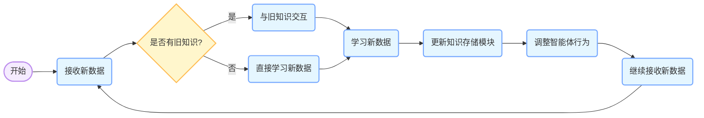

# AI中的终身学习:持续适应新知识

> 关键词：AI、终身学习、持续适应、新知识、机器学习、遗忘问题、智能体

> 摘要：本文聚焦于AI中的终身学习这一前沿领域，深入探讨其核心概念、算法原理、数学模型等内容。首先介绍了AI终身学习的背景，包括目的范围、预期读者等。接着详细阐述了核心概念与联系，通过示意图和流程图展示其架构。在核心算法原理部分用Python代码进行了详细说明，还给出了相关数学模型和公式并举例。通过项目实战展示了代码实际案例及解读，分析了其实际应用场景。同时推荐了学习资源、开发工具框架和相关论文著作。最后总结了未来发展趋势与挑战，还设置了附录解答常见问题并提供扩展阅读和参考资料，旨在全面深入地为读者呈现AI中终身学习持续适应新知识的相关内容。

## 1. 背景介绍 
### 1.1 目的和范围
在人工智能领域，传统的机器学习模型往往是针对特定任务进行训练，一旦训练完成，其能力就相对固定。然而，现实世界是动态变化的，新的数据和知识不断涌现。AI中的终身学习旨在使智能体能够持续不断地从新数据中学习，不断提升自身的能力，并且在学习新知识的过程中，尽可能保留之前所学的内容，避免出现灾难性遗忘。本文章的范围涵盖了终身学习的核心概念、算法原理、数学模型、实际应用以及未来发展趋势等多个方面，旨在为读者全面深入地介绍AI中的终身学习。

### 1.2 预期读者
本文预期读者包括对人工智能领域感兴趣的研究人员、工程师、学生以及相关从业者。对于研究人员来说，本文可以为他们的研究提供新的思路和方向；对于工程师，能够帮助他们在实际项目中应用终身学习技术；对于学生，有助于他们系统地学习和理解AI中的终身学习知识。

### 1.3 文档结构概述
本文首先介绍AI中终身学习的背景，包括目的、预期读者和文档结构等内容。接着阐述核心概念与联系，通过文本示意图和Mermaid流程图展示其架构。然后详细讲解核心算法原理，并使用Python源代码进行说明，同时给出数学模型和公式并举例。之后通过项目实战展示代码实际案例和详细解释。再分析实际应用场景，推荐相关的工具和资源。最后总结未来发展趋势与挑战，设置附录解答常见问题并提供扩展阅读和参考资料。

### 1.4 术语表
#### 1.4.1 核心术语定义
- **终身学习（Lifelong Learning）**：在AI领域，指智能体能够在其整个生命周期内持续不断地从新数据中学习，不断提升自身性能，同时保留之前所学的知识和技能。
- **灾难性遗忘（Catastrophic Forgetting）**：当智能体学习新任务时，会快速遗忘之前学习的任务的相关知识和技能，导致在旧任务上的性能急剧下降。
- **智能体（Agent）**：在人工智能系统中，能够感知环境、做出决策并采取行动的实体。

#### 1.4.2 相关概念解释
- **增量学习（Incremental Learning）**：一种学习方式，智能体可以逐步学习新的数据，每次学习都基于之前的学习结果进行更新，而不是重新训练整个模型。
- **元学习（Meta - Learning）**：也称为“学习如何学习”，旨在让模型能够快速适应新的任务，通过学习不同任务之间的共性来提高学习效率。

#### 1.4.3 缩略词列表
- **ML（Machine Learning）**：机器学习
- **DL（Deep Learning）**：深度学习
- **RL（Reinforcement Learning）**：强化学习

## 2. 核心概念与联系 
AI中的终身学习的核心目标是让智能体能够持续适应新知识，同时避免灾难性遗忘。其核心概念主要包括持续学习、知识保留和任务适应。

### 文本示意图
智能体处于一个动态变化的环境中，不断接收新的数据。智能体内部有一个知识存储模块，用于存储之前学习到的知识。当新数据到来时，智能体通过学习算法对新数据进行学习，同时会与知识存储模块中的知识进行交互，确保在学习新知识的过程中不遗忘旧知识。学习后的结果会更新知识存储模块，智能体也会根据更新后的知识调整自己的行为，以更好地适应环境。

### Mermaid流程图


在这个流程图中，智能体首先接收新数据，然后判断是否有旧知识。如果有旧知识，则将新数据与旧知识进行交互；如果没有旧知识，则直接学习新数据。学习完成后，更新知识存储模块，并调整智能体的行为，然后继续接收新数据，形成一个循环，实现持续学习。

## 3. 核心算法原理 & 具体操作步骤 
### 基于弹性权重巩固（EWC）算法的原理
弹性权重巩固（EWC）算法是一种解决灾难性遗忘问题的经典算法。其核心思想是通过计算每个参数的重要性，在学习新任务时，对重要参数进行保护，减少对这些参数的更新，从而保留旧任务的知识。

### Python源代码详细阐述
```python
import torch
import torch.nn as nn
import torch.optim as optim

# 定义一个简单的神经网络模型
class SimpleNet(nn.Module):
    def __init__(self, input_size, hidden_size, output_size):
        super(SimpleNet, self).__init__()
        self.fc1 = nn.Linear(input_size, hidden_size)
        self.relu = nn.ReLU()
        self.fc2 = nn.Linear(hidden_size, output_size)

    def forward(self, x):
        out = self.fc1(x)
        out = self.relu(out)
        out = self.fc2(out)
        return out

# 计算Fisher信息矩阵
def compute_fisher(model, dataloader, criterion):
    fisher = {}
    for n, p in model.named_parameters():
        fisher[n] = torch.zeros_like(p.data)

    model.eval()
    for inputs, labels in dataloader:
        model.zero_grad()
        outputs = model(inputs)
        loss = criterion(outputs, labels)
        loss.backward()

        for n, p in model.named_parameters():
            if p.grad is not None:
                fisher[n] += p.grad.data ** 2

    for n, p in fisher.items():
        fisher[n] /= len(dataloader)

    return fisher

# EWC损失函数
def ewc_loss(model, criterion, fisher, prior_params, lambda_ewc, inputs, labels):
    normal_loss = criterion(model(inputs), labels)
    ewc_loss = 0
    for n, p in model.named_parameters():
        if n in fisher:
            ewc_loss += (lambda_ewc / 2) * torch.sum(fisher[n] * (p - prior_params[n]) ** 2)
    return normal_loss + ewc_loss

# 训练函数
def train(model, dataloader, criterion, optimizer, fisher=None, prior_params=None, lambda_ewc=0):
    model.train()
    total_loss = 0
    for inputs, labels in dataloader:
        optimizer.zero_grad()
        if fisher is not None and prior_params is not None:
            loss = ewc_loss(model, criterion, fisher, prior_params, lambda_ewc, inputs, labels)
        else:
            loss = criterion(model(inputs), labels)
        loss.backward()
        optimizer.step()
        total_loss += loss.item()
    return total_loss / len(dataloader)

# 示例使用
input_size = 10
hidden_size = 20
output_size = 5
model = SimpleNet(input_size, hidden_size, output_size)
criterion = nn.CrossEntropyLoss()
optimizer = optim.Adam(model.parameters(), lr=0.001)

# 模拟旧任务数据加载器
old_dataloader = None  # 这里需要实际的旧任务数据加载器
# 计算Fisher信息矩阵
fisher = compute_fisher(model, old_dataloader, criterion)
prior_params = {n: p.data.clone() for n, p in model.named_parameters()}

# 模拟新任务数据加载器
new_dataloader = None  # 这里需要实际的新任务数据加载器
lambda_ewc = 100
train(model, new_dataloader, criterion, optimizer, fisher, prior_params, lambda_ewc)
```
### 具体操作步骤
1. **定义模型**：首先定义一个神经网络模型，这里使用`SimpleNet`类。
2. **计算Fisher信息矩阵**：通过`compute_fisher`函数计算每个参数的重要性，得到Fisher信息矩阵。
3. **定义EWC损失函数**：`ewc_loss`函数将正常的损失函数和EWC惩罚项相加，用于在学习新任务时保护重要参数。
4. **训练模型**：在训练新任务时，根据是否有旧任务的Fisher信息矩阵和先验参数，选择使用正常的损失函数或EWC损失函数进行训练。

## 4. 数学模型和公式 & 详细讲解 & 举例说明 
### 数学模型和公式
#### Fisher信息矩阵
Fisher信息矩阵 $F$ 用于衡量每个参数的重要性，其定义为：
$$F_{i}=\mathbb{E}_{p(\mathbf{x}, \mathbf{y})}\left[\left(\frac{\partial \log p(\mathbf{y}|\mathbf{x}, \boldsymbol{\theta})}{\partial \theta_{i}}\right)^{2}\right]$$
其中，$p(\mathbf{x}, \mathbf{y})$ 是数据的联合分布，$p(\mathbf{y}|\mathbf{x}, \boldsymbol{\theta})$ 是给定输入 $\mathbf{x}$ 和参数 $\boldsymbol{\theta}$ 时输出 $\mathbf{y}$ 的条件概率，$\theta_{i}$ 是参数向量 $\boldsymbol{\theta}$ 的第 $i$ 个元素。

#### EWC损失函数
EWC损失函数 $L_{EWC}$ 由正常的损失函数 $L$ 和EWC惩罚项组成：
$$L_{EWC}=L+\frac{\lambda}{2}\sum_{i}F_{i}(\theta_{i}-\theta_{i}^{*})^{2}$$
其中，$\lambda$ 是一个超参数，用于控制EWC惩罚项的权重，$\theta_{i}^{*}$ 是旧任务训练完成后的参数值。

### 详细讲解
Fisher信息矩阵通过计算每个参数的梯度平方的期望来衡量其重要性。在学习新任务时，对于重要性高的参数，EWC损失函数会对其更新进行惩罚，使得这些参数在学习新任务时不会发生太大的变化，从而保留旧任务的知识。

### 举例说明
假设我们有一个简单的二分类任务，输入是一个二维向量 $\mathbf{x}=(x_{1}, x_{2})$，输出是一个标量 $y\in\{0, 1\}$。我们使用一个简单的线性模型 $y=\sigma(\mathbf{w}\cdot\mathbf{x}+b)$，其中 $\sigma$ 是sigmoid函数，$\mathbf{w}=(w_{1}, w_{2})$ 是权重向量，$b$ 是偏置项。

在计算Fisher信息矩阵时，我们需要对 $\log p(y|\mathbf{x}, \mathbf{w}, b)$ 关于 $\mathbf{w}$ 和 $b$ 求偏导数，然后计算其平方的期望。假设我们已经计算出了Fisher信息矩阵 $F_{w_{1}}$、$F_{w_{2}}$ 和 $F_{b}$。

在学习新任务时，EWC损失函数会根据这些Fisher信息矩阵对参数的更新进行惩罚。例如，如果 $F_{w_{1}}$ 很大，说明 $w_{1}$ 对于旧任务很重要，在学习新任务时，$w_{1}$ 的更新就会受到较大的限制，从而保留旧任务的知识。

## 5. 项目实战：代码实际案例和详细解释说明 
### 5.1  开发环境搭建
#### 操作系统
可以选择Windows、Linux或macOS等主流操作系统。这里以Ubuntu 20.04为例进行说明。

#### Python环境
首先安装Python 3.8或更高版本。可以使用以下命令进行安装：
```bash
sudo apt update
sudo apt install python3.8
```
#### 虚拟环境
为了避免不同项目之间的依赖冲突，建议使用虚拟环境。可以使用`venv`模块创建虚拟环境：
```bash
python3.8 -m venv myenv
source myenv/bin/activate
```
#### 安装依赖库
在虚拟环境中安装所需的依赖库，包括`torch`、`torchvision`等：
```bash
pip install torch torchvision
```

### 5.2  源代码详细实现和代码解读
```python
import torch
import torch.nn as nn
import torch.optim as optim
from torch.utils.data import DataLoader, Dataset
import numpy as np

# 自定义数据集类
class CustomDataset(Dataset):
    def __init__(self, data, labels):
        self.data = data
        self.labels = labels

    def __len__(self):
        return len(self.data)

    def __getitem__(self, idx):
        return self.data[idx], self.labels[idx]

# 定义一个简单的神经网络模型
class SimpleNet(nn.Module):
    def __init__(self, input_size, hidden_size, output_size):
        super(SimpleNet, self).__init__()
        self.fc1 = nn.Linear(input_size, hidden_size)
        self.relu = nn.ReLU()
        self.fc2 = nn.Linear(hidden_size, output_size)

    def forward(self, x):
        out = self.fc1(x)
        out = self.relu(out)
        out = self.fc2(out)
        return out

# 计算Fisher信息矩阵
def compute_fisher(model, dataloader, criterion):
    fisher = {}
    for n, p in model.named_parameters():
        fisher[n] = torch.zeros_like(p.data)

    model.eval()
    for inputs, labels in dataloader:
        model.zero_grad()
        outputs = model(inputs)
        loss = criterion(outputs, labels)
        loss.backward()

        for n, p in model.named_parameters():
            if p.grad is not None:
                fisher[n] += p.grad.data ** 2

    for n, p in fisher.items():
        fisher[n] /= len(dataloader)

    return fisher

# EWC损失函数
def ewc_loss(model, criterion, fisher, prior_params, lambda_ewc, inputs, labels):
    normal_loss = criterion(model(inputs), labels)
    ewc_loss = 0
    for n, p in model.named_parameters():
        if n in fisher:
            ewc_loss += (lambda_ewc / 2) * torch.sum(fisher[n] * (p - prior_params[n]) ** 2)
    return normal_loss + ewc_loss

# 训练函数
def train(model, dataloader, criterion, optimizer, fisher=None, prior_params=None, lambda_ewc=0):
    model.train()
    total_loss = 0
    for inputs, labels in dataloader:
        optimizer.zero_grad()
        if fisher is not None and prior_params is not None:
            loss = ewc_loss(model, criterion, fisher, prior_params, lambda_ewc, inputs, labels)
        else:
            loss = criterion(model(inputs), labels)
        loss.backward()
        optimizer.step()
        total_loss += loss.item()
    return total_loss / len(dataloader)

# 生成示例数据
input_size = 10
num_samples = 1000
old_data = np.random.randn(num_samples, input_size).astype(np.float32)
old_labels = np.random.randint(0, 5, num_samples).astype(np.long)

new_data = np.random.randn(num_samples, input_size).astype(np.float32)
new_labels = np.random.randint(0, 5, num_samples).astype(np.long)

# 创建数据集和数据加载器
old_dataset = CustomDataset(old_data, old_labels)
old_dataloader = DataLoader(old_dataset, batch_size=32, shuffle=True)

new_dataset = CustomDataset(new_data, new_labels)
new_dataloader = DataLoader(new_dataset, batch_size=32, shuffle=True)

# 初始化模型、损失函数和优化器
hidden_size = 20
output_size = 5
model = SimpleNet(input_size, hidden_size, output_size)
criterion = nn.CrossEntropyLoss()
optimizer = optim.Adam(model.parameters(), lr=0.001)

# 训练旧任务
train(model, old_dataloader, criterion, optimizer)

# 计算Fisher信息矩阵
fisher = compute_fisher(model, old_dataloader, criterion)
prior_params = {n: p.data.clone() for n, p in model.named_parameters()}

# 训练新任务
lambda_ewc = 100
train(model, new_dataloader, criterion, optimizer, fisher, prior_params, lambda_ewc)
```
### 5.3  代码解读与分析
1. **自定义数据集类**：`CustomDataset`类用于封装数据和标签，方便使用`DataLoader`进行批量加载。
2. **定义模型**：`SimpleNet`类定义了一个简单的两层神经网络模型。
3. **计算Fisher信息矩阵**：`compute_fisher`函数通过计算每个参数的梯度平方的平均值来得到Fisher信息矩阵。
4. **EWC损失函数**：`ewc_loss`函数将正常的损失函数和EWC惩罚项相加，用于在学习新任务时保护重要参数。
5. **训练函数**：`train`函数根据是否有旧任务的Fisher信息矩阵和先验参数，选择使用正常的损失函数或EWC损失函数进行训练。
6. **数据生成和加载**：生成示例的旧任务和新任务数据，并使用`DataLoader`进行批量加载。
7. **训练过程**：先训练旧任务，然后计算Fisher信息矩阵和先验参数，最后使用EWC损失函数训练新任务。

## 6. 实际应用场景 
### 自然语言处理
在自然语言处理中，语言是不断发展和变化的，新的词汇、语法和语义不断涌现。AI中的终身学习可以让语言模型持续学习新的语言知识，不断提升其语言理解和生成能力。例如，聊天机器人可以通过终身学习不断适应新的对话场景和用户需求，提供更加准确和自然的回答。

### 计算机视觉
在计算机视觉领域，图像和视频数据也在不断变化，新的物体、场景和视觉任务不断出现。终身学习可以让视觉模型持续学习新的视觉知识，提高其目标检测、图像分类和语义分割等任务的性能。例如，自动驾驶汽车的视觉系统可以通过终身学习不断适应新的道路环境和交通规则。

### 医疗保健
在医疗保健领域，医学知识和临床数据不断更新。AI中的终身学习可以让医疗诊断模型持续学习新的疾病特征和治疗方法，提高诊断的准确性和治疗的效果。例如，智能医疗助手可以通过终身学习不断更新医学知识库，为医生提供更加准确的诊断建议和治疗方案。

### 金融服务
在金融服务领域，市场环境和客户需求不断变化。终身学习可以让金融预测模型持续学习新的市场趋势和客户行为模式，提高预测的准确性和风险评估的能力。例如，投资顾问系统可以通过终身学习不断适应新的市场变化，为客户提供更加合理的投资建议。

## 7. 工具和资源推荐
### 7.1 学习资源推荐
#### 7.1.1 书籍推荐
- 《深度学习》（Deep Learning）：由Ian Goodfellow、Yoshua Bengio和Aaron Courville合著，是深度学习领域的经典教材，涵盖了深度学习的基本概念、算法和应用。
- 《机器学习》（Machine Learning: A Probabilistic Perspective）：由Kevin P. Murphy所著，从概率的角度介绍了机器学习的基本理论和算法，对理解机器学习的数学原理有很大帮助。
- 《终身机器学习》（Lifelong Machine Learning）：专门介绍了终身学习的相关理论和技术，是学习AI中终身学习的重要参考书籍。

#### 7.1.2 在线课程
- Coursera上的“深度学习专项课程”（Deep Learning Specialization）：由Andrew Ng教授授课，全面介绍了深度学习的各个方面，包括神经网络、卷积神经网络、循环神经网络等。
- edX上的“人工智能导论”（Introduction to Artificial Intelligence）：由麻省理工学院（MIT）的教授授课，系统地介绍了人工智能的基本概念、算法和应用。
- Udemy上的“终身学习与持续适应AI”（Lifelong Learning and Continuous Adaptation in AI）：专门讲解了AI中终身学习的相关技术和应用。

#### 7.1.3 技术博客和网站
- Medium：有很多AI领域的专业博客，其中不乏关于终身学习的优秀文章。
- arXiv：一个预印本服务器，提供了大量关于AI和机器学习的最新研究论文，包括终身学习的相关研究。
- Towards Data Science：一个专注于数据科学和机器学习的技术博客，有很多关于终身学习的实践经验和技术分享。

### 7.2 开发工具框架推荐
#### 7.2.1 IDE和编辑器
- PyCharm：一款功能强大的Python集成开发环境，提供了代码编辑、调试、版本控制等功能，适合开发Python机器学习项目。
- Jupyter Notebook：一个交互式的开发环境，支持Python、R等多种编程语言，非常适合进行数据分析和模型训练的实验。
- Visual Studio Code：一款轻量级的代码编辑器，支持多种编程语言和插件，可通过安装相关插件来进行Python机器学习开发。

#### 7.2.2 调试和性能分析工具
- TensorBoard：一个可视化工具，可用于可视化深度学习模型的训练过程、损失函数变化、模型结构等，帮助调试和优化模型。
- PyTorch Profiler：PyTorch提供的性能分析工具，可用于分析模型的性能瓶颈，找出计算耗时的部分，从而进行优化。
- cProfile：Python内置的性能分析工具，可用于分析Python代码的性能，找出函数调用的时间消耗情况。

#### 7.2.3 相关框架和库
- PyTorch：一个开源的深度学习框架，提供了丰富的深度学习模型和工具，支持动态计算图，方便进行模型开发和训练。
- TensorFlow：另一个流行的深度学习框架，具有强大的分布式训练能力和丰富的工具集，广泛应用于工业界和学术界。
- Scikit - learn：一个简单易用的机器学习库，提供了多种机器学习算法和工具，适合快速实现和验证机器学习模型。

### 7.3 相关论文著作推荐
#### 7.3.1 经典论文
- "Overcoming catastrophic forgetting in neural networks"：由James Kirkpatrick等人发表，提出了弹性权重巩固（EWC）算法，是解决灾难性遗忘问题的经典论文。
- "Gradient Episodic Memory for Continual Learning"：由David Lopez - Paz和Marc'Aurelio Ranzato发表，提出了梯度情景记忆（GEM）算法，为终身学习提供了一种新的思路。

#### 7.3.2 最新研究成果
- 关注顶级AI会议如NeurIPS、ICML、CVPR等的最新论文，这些会议上会有很多关于终身学习的最新研究成果。
- arXiv上也会有很多关于终身学习的预印本论文，及时了解最新的研究动态。

#### 7.3.3 应用案例分析
- 一些知名科技公司如Google、Microsoft等的技术博客会分享他们在实际项目中应用终身学习技术的案例和经验，可以从中学习到实际应用中的技巧和方法。

## 8. 总结：未来发展趋势与挑战
### 未来发展趋势
- **更加智能化的学习策略**：未来的AI终身学习系统将能够自动选择合适的学习策略和超参数，根据不同的任务和数据特点进行自适应学习，提高学习效率和性能。
- **多模态终身学习**：随着多模态数据（如图像、文本、语音等）的广泛应用，多模态终身学习将成为一个重要的研究方向。智能体将能够同时从多种模态的数据中学习，提高对复杂环境的理解和适应能力。
- **与人类的协同学习**：AI终身学习系统将与人类进行更加紧密的协同学习，人类可以为智能体提供指导和反馈，智能体也可以为人类提供决策支持和帮助，实现人机互补。

### 挑战
- **计算资源的限制**：终身学习需要不断地处理新数据和更新模型，对计算资源的需求较大。如何在有限的计算资源下实现高效的终身学习是一个挑战。
- **数据隐私和安全**：在终身学习过程中，需要处理大量的数据，包括用户的隐私数据。如何保证数据的隐私和安全，防止数据泄露和滥用是一个重要的问题。
- **灾难性遗忘问题的彻底解决**：虽然已经有很多方法来缓解灾难性遗忘问题，但目前还没有完全解决该问题。如何设计更加有效的算法，彻底解决灾难性遗忘问题是未来的一个重要挑战。

## 9. 附录：常见问题与解答
### 什么是灾难性遗忘？
灾难性遗忘是指当智能体学习新任务时，会快速遗忘之前学习的任务的相关知识和技能，导致在旧任务上的性能急剧下降。

### 如何衡量终身学习的性能？
可以通过多种指标来衡量终身学习的性能，如在旧任务和新任务上的准确率、损失函数值、遗忘率等。遗忘率是指在学习新任务后，旧任务性能的下降程度。

### 终身学习和增量学习有什么区别？
增量学习是一种学习方式，智能体可以逐步学习新的数据，每次学习都基于之前的学习结果进行更新，而不是重新训练整个模型。终身学习则更强调智能体在整个生命周期内持续不断地学习，并且要在学习新知识的过程中保留旧知识，避免灾难性遗忘。

### 如何选择合适的终身学习算法？
选择合适的终身学习算法需要考虑多个因素，如任务的特点、数据的分布、计算资源的限制等。可以通过实验比较不同算法在特定任务上的性能，选择性能最优的算法。

## 10. 扩展阅读 & 参考资料
### 扩展阅读
- 可以阅读关于元学习、迁移学习等相关领域的书籍和论文，这些领域与终身学习有密切的联系，可以帮助深入理解终身学习的原理和方法。
- 关注AI领域的最新研究动态和技术趋势，了解终身学习在不同领域的应用案例和实践经验。

### 参考资料
- 本文中提到的书籍、论文、在线课程、技术博客和网站等都是重要的参考资料。
- 相关的学术数据库如IEEE Xplore、ACM Digital Library等也可以提供大量关于AI和机器学习的研究文献。