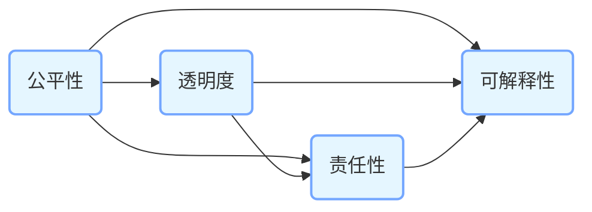

# AI伦理:在模型设计中融入道德考量

> 关键词：AI伦理、模型设计、道德考量、公平性、透明度、责任性、可解释性

> 摘要：本文围绕AI伦理中在模型设计里融入道德考量这一核心主题展开。随着人工智能技术的迅猛发展，其应用范围不断扩大，AI系统所产生的影响愈发广泛且复杂，因此在模型设计阶段就融入道德考量变得至关重要。文章首先介绍了AI伦理的背景知识，包括目的、预期读者、文档结构和相关术语。接着阐述了核心概念及其联系，详细讲解了核心算法原理与操作步骤，并结合数学模型和公式进行深入分析。通过项目实战案例展示了如何在实际中实现这些道德考量，探讨了AI伦理的实际应用场景。同时推荐了相关的学习资源、开发工具和论文著作。最后总结了未来发展趋势与挑战，提供了常见问题解答和参考资料，旨在为相关从业者和研究者提供全面且深入的关于AI伦理中道德考量的知识与实践指导。

## 1. 背景介绍 
### 1.1 目的和范围
随着人工智能（AI）技术在各个领域的广泛应用，从医疗保健到金融服务，从交通出行到社交媒体，AI系统的决策和行为对个人、社会和环境产生着越来越深远的影响。然而，当前许多AI模型在设计和开发过程中往往忽视了道德和伦理层面的问题，导致出现了一系列诸如偏见、歧视、隐私侵犯等不良后果。本文章的目的在于探讨如何在AI模型设计中融入道德考量，以确保AI技术的发展和应用符合人类的价值观和道德准则。

本文的范围涵盖了AI伦理的基本概念、核心算法原理、数学模型、实际应用案例以及相关的工具和资源推荐。旨在为AI开发者、研究人员、政策制定者以及对AI伦理感兴趣的读者提供一个全面而深入的参考，帮助他们理解和实践在模型设计中融入道德考量的方法和策略。

### 1.2 预期读者
- **AI开发者和研究人员**：希望通过了解AI伦理的相关知识，在模型设计和开发过程中更好地融入道德考量，提高AI系统的质量和可靠性。
- **政策制定者**：需要掌握AI伦理的基本原则和方法，以便制定合理的政策和法规，引导AI技术的健康发展。
- **企业管理者**：关注AI技术在企业中的应用，希望了解如何确保企业的AI系统符合道德和法律要求，避免潜在的风险和损失。
- **普通公众**：对AI技术的发展和影响感兴趣，希望了解AI伦理的基本概念和重要性，增强对AI技术的认知和理解。

### 1.3 文档结构概述
本文将按照以下结构进行组织：
1. **背景介绍**：介绍文章的目的、范围、预期读者、文档结构和相关术语。
2. **核心概念与联系**：阐述AI伦理的核心概念，包括公平性、透明度、责任性、可解释性等，并分析它们之间的联系。
3. **核心算法原理 & 具体操作步骤**：详细讲解在模型设计中融入道德考量的核心算法原理，并给出具体的操作步骤。
4. **数学模型和公式 & 详细讲解 & 举例说明**：通过数学模型和公式对AI伦理的相关概念进行量化分析，并结合实际例子进行说明。
5. **项目实战：代码实际案例和详细解释说明**：通过一个具体的项目实战案例，展示如何在实际中实现模型设计中的道德考量。
6. **实际应用场景**：探讨AI伦理在不同领域的实际应用场景，如医疗保健、金融服务、交通出行等。
7. **工具和资源推荐**：推荐相关的学习资源、开发工具和论文著作，帮助读者进一步深入学习和研究AI伦理。
8. **总结：未来发展趋势与挑战**：总结AI伦理的未来发展趋势，并分析面临的挑战和机遇。
9. **附录：常见问题与解答**：提供常见问题的解答，帮助读者解决在学习和实践过程中遇到的问题。
10. **扩展阅读 & 参考资料**：列出相关的扩展阅读材料和参考资料，供读者进一步深入学习和研究。

### 1.4 术语表
#### 1.4.1 核心术语定义
- **AI伦理（AI Ethics）**：研究AI技术的开发、部署和使用过程中涉及的道德和伦理问题的学科。
- **模型设计（Model Design）**：指构建AI模型的过程，包括选择合适的算法、数据预处理、特征工程、模型训练和评估等步骤。
- **道德考量（Moral Considerations）**：在决策和行动中考虑道德和伦理因素，以确保行为符合人类的价值观和道德准则。
- **公平性（Fairness）**：指AI系统在处理不同群体的数据时，不产生偏见或歧视，确保所有群体都能得到平等的对待。
- **透明度（Transparency）**：指AI系统的决策过程和内部机制是可理解和可解释的，用户能够清楚地知道系统是如何做出决策的。
- **责任性（Accountability）**：指AI系统的开发者和使用者对系统的行为和决策负责，能够解释和承担系统产生的后果。
- **可解释性（Interpretability）**：指AI模型的决策过程和输出结果是可解释的，能够向用户提供合理的解释和依据。

#### 1.4.2 相关概念解释
- **偏见（Bias）**：指AI系统在处理数据时，由于数据本身的偏差或算法的局限性，导致对某些群体产生不公平的对待。
- **歧视（Discrimination）**：指AI系统在决策过程中，基于某些敏感特征（如种族、性别、年龄等）对不同群体进行不公平的区分和对待。
- **隐私（Privacy）**：指个人的信息和数据应该得到保护，不被未经授权的访问、使用和披露。
- **安全性（Security）**：指AI系统应该具备足够的安全措施，防止数据泄露、恶意攻击和系统故障等问题。

#### 1.4.3 缩略词列表
- **AI**：Artificial Intelligence（人工智能）
- **ML**：Machine Learning（机器学习）
- **DL**：Deep Learning（深度学习）
- **API**：Application Programming Interface（应用程序编程接口）
- **GPU**：Graphics Processing Unit（图形处理器）

## 2. 核心概念与联系 
### 核心概念原理
#### 公平性
公平性是AI伦理中一个非常重要的概念。在AI模型中，公平性意味着模型在处理不同群体的数据时，不会因为某些敏感特征（如种族、性别、年龄等）而产生偏见或歧视。例如，在招聘过程中使用的AI模型，如果因为性别因素对女性候选人产生不公平的评价，那么这个模型就缺乏公平性。

为了实现公平性，需要从数据和算法两个层面进行考虑。在数据层面，要确保训练数据的多样性和代表性，避免数据中存在偏差。在算法层面，可以采用一些公平性算法，如对抗训练算法，来减少模型对敏感特征的依赖。

#### 透明度
透明度要求AI系统的决策过程和内部机制是可理解和可解释的。用户应该能够清楚地知道系统是如何做出决策的，以及决策的依据是什么。例如，在医疗诊断中使用的AI模型，如果医生无法理解模型的决策过程，就很难信任和使用这个模型。

实现透明度的方法包括使用可解释的模型（如决策树）、提供决策解释的技术（如特征重要性分析）以及建立透明的开发和部署流程。

#### 责任性
责任性意味着AI系统的开发者和使用者对系统的行为和决策负责。当AI系统产生不良后果时，应该能够找到相应的责任人，并让其承担相应的责任。例如，如果一个自动驾驶汽车的AI系统发生了事故，就需要明确是开发者、制造商还是使用者的责任。

为了实现责任性，需要建立明确的责任制度和法规，规定开发者和使用者的权利和义务。同时，还需要对AI系统进行审计和监督，确保其符合相关的法律和道德要求。

#### 可解释性
可解释性是指AI模型的决策过程和输出结果是可解释的。与透明度不同，可解释性更侧重于对模型本身的理解。例如，一个深度学习模型可能非常复杂，但其决策结果应该能够用简单易懂的语言或可视化的方式进行解释。

实现可解释性的方法包括使用可解释的模型结构、特征工程技术以及解释性算法（如LIME、SHAP等）。

### 架构的文本示意图
AI伦理的核心概念之间相互关联，形成一个有机的整体。公平性、透明度、责任性和可解释性是实现AI伦理的四个关键要素。

公平性是基础，确保AI系统不会对不同群体产生偏见和歧视。透明度和可解释性有助于用户理解AI系统的决策过程，增强用户对系统的信任。责任性则是保障，确保当AI系统出现问题时，能够追究相关责任人的责任。

### Mermaid流程图


## 3. 核心算法原理 & 具体操作步骤 
### 公平性算法原理及Python代码实现
#### 原理
一种常见的实现公平性的算法是对抗训练算法。其基本思想是引入一个对抗网络，该网络的任务是预测敏感特征（如性别、种族等），而主模型的任务是在完成主要任务（如分类、回归等）的同时，尽量让对抗网络无法准确预测敏感特征。这样可以减少主模型对敏感特征的依赖，从而实现公平性。

#### Python代码实现
```python
import torch
import torch.nn as nn
import torch.optim as optim

# 定义主模型
class MainModel(nn.Module):
    def __init__(self, input_size, output_size):
        super(MainModel, self).__init__()
        self.fc1 = nn.Linear(input_size, 64)
        self.fc2 = nn.Linear(64, output_size)

    def forward(self, x):
        x = torch.relu(self.fc1(x))
        x = self.fc2(x)
        return x

# 定义对抗模型
class AdversarialModel(nn.Module):
    def __init__(self, input_size, sensitive_size):
        super(AdversarialModel, self).__init__()
        self.fc1 = nn.Linear(input_size, 32)
        self.fc2 = nn.Linear(32, sensitive_size)

    def forward(self, x):
        x = torch.relu(self.fc1(x))
        x = self.fc2(x)
        return x

# 训练过程
def train_fair_model(main_model, adversarial_model, data_loader, num_epochs, alpha):
    main_optimizer = optim.Adam(main_model.parameters(), lr=0.001)
    adv_optimizer = optim.Adam(adversarial_model.parameters(), lr=0.001)
    criterion_main = nn.CrossEntropyLoss()
    criterion_adv = nn.CrossEntropyLoss()

    for epoch in range(num_epochs):
        for inputs, labels, sensitive_labels in data_loader:
            # 训练主模型
            main_optimizer.zero_grad()
            outputs = main_model(inputs)
            loss_main = criterion_main(outputs, labels)
            adv_outputs = adversarial_model(outputs.detach())
            loss_adv = criterion_adv(adv_outputs, sensitive_labels)
            loss = loss_main - alpha * loss_adv
            loss.backward()
            main_optimizer.step()

            # 训练对抗模型
            adv_optimizer.zero_grad()
            adv_outputs = adversarial_model(main_model(inputs).detach())
            loss_adv = criterion_adv(adv_outputs, sensitive_labels)
            loss_adv.backward()
            adv_optimizer.step()

        print(f'Epoch {epoch + 1}/{num_epochs}, Loss: {loss.item()}')

# 示例使用
input_size = 10
output_size = 2
sensitive_size = 2
main_model = MainModel(input_size, output_size)
adversarial_model = AdversarialModel(output_size, sensitive_size)

# 假设 data_loader 是一个包含输入数据、标签和敏感标签的 DataLoader
# num_epochs 是训练的轮数，alpha 是平衡主损失和对抗损失的超参数
train_fair_model(main_model, adversarial_model, data_loader, num_epochs=10, alpha=0.1)
```

### 可解释性算法原理及Python代码实现
#### 原理
LIME（Local Interpretable Model-agnostic Explanations）是一种常用的可解释性算法。其基本思想是在局部范围内对复杂模型进行线性近似，通过解释线性模型来解释复杂模型的决策。

#### Python代码实现
```python
import numpy as np
from sklearn.datasets import make_classification
from sklearn.ensemble import RandomForestClassifier
from lime.lime_tabular import LimeTabularExplainer

# 生成示例数据
X, y = make_classification(n_samples=1000, n_features=10, n_informative=5, n_classes=2)

# 训练一个随机森林分类器
model = RandomForestClassifier()
model.fit(X, y)

# 创建 LIME 解释器
explainer = LimeTabularExplainer(X, feature_names=[f'feature_{i}' for i in range(X.shape[1])], class_names=['class_0', 'class_1'])

# 选择一个样本进行解释
sample_index = 0
sample = X[sample_index]

# 生成解释
explanation = explainer.explain_instance(sample, model.predict_proba, num_features=5)

# 打印解释结果
print(explanation.as_list())
```

### 具体操作步骤
1. **数据预处理**：确保训练数据的质量和多样性，处理缺失值、异常值等问题。同时，对敏感特征进行标识和处理。
2. **模型选择**：根据具体任务选择合适的模型结构。如果需要高可解释性，可以选择决策树、线性回归等模型；如果需要高准确性，可以选择深度学习模型。
3. **算法实现**：根据上述公平性和可解释性算法的原理，实现相应的代码。
4. **模型训练**：使用训练数据对模型进行训练，并在训练过程中融入道德考量，如使用对抗训练算法实现公平性。
5. **模型评估**：使用评估指标（如公平性指标、可解释性指标等）对模型进行评估，确保模型符合道德要求。
6. **模型部署**：将训练好的模型部署到实际应用中，并进行持续监测和评估，及时发现和解决可能出现的道德问题。

## 4. 数学模型和公式 & 详细讲解 & 举例说明 
### 公平性数学模型和公式
#### 统计均等性（Statistical Parity）
统计均等性要求不同群体的正例率相同。设 $D$ 是数据集，$G$ 是敏感特征（如性别），$Y$ 是预测结果，$Y = 1$ 表示正例，$Y = 0$ 表示负例。统计均等性的数学定义为：

$$P(Y = 1 | G = g_1) = P(Y = 1 | G = g_2)$$

其中 $g_1$ 和 $g_2$ 是 $G$ 的不同取值。

例如，在招聘数据集中，男性和女性的录用率应该相等。如果男性的录用率为 $P(Y = 1 | G = male) = 0.6$，女性的录用率为 $P(Y = 1 | G = female) = 0.4$，则说明模型在性别方面存在不公平性。

#### 机会均等性（Equal Opportunity）
机会均等性要求不同群体在真实正例中的正例率相同。设 $Y^*$ 是真实标签，机会均等性的数学定义为：

$$P(Y = 1 | G = g_1, Y^* = 1) = P(Y = 1 | G = g_2, Y^* = 1)$$

例如，在医疗诊断中，对于患有某种疾病的患者，不同种族的患者被正确诊断的概率应该相等。

### 可解释性数学模型和公式
#### 特征重要性（Feature Importance）
特征重要性用于衡量每个特征对模型决策的贡献程度。一种常见的计算特征重要性的方法是基于特征的平均减少不纯度（Mean Decrease Impurity，MDI）。

对于决策树模型，设 $T$ 是决策树，$N$ 是树的节点数，$n_t$ 是节点 $t$ 的样本数，$i(t)$ 是节点 $t$ 的不纯度（如基尼不纯度），$v$ 是特征，$I_v$ 是特征 $v$ 的重要性，则：

$$I_v = \sum_{t \in T} \frac{n_t}{N} [i(t) - \frac{n_{left}}{n_t} i(t_{left}) - \frac{n_{right}}{n_t} i(t_{right})]$$

其中 $t_{left}$ 和 $t_{right}$ 是节点 $t$ 的左右子节点，$n_{left}$ 和 $n_{right}$ 是左右子节点的样本数。

例如，在一个预测房价的决策树模型中，特征重要性可以告诉我们哪些特征（如面积、卧室数量等）对房价的预测影响最大。

### 责任性数学模型和公式
#### 因果责任（Causal Responsibility）
因果责任用于确定某个行为或事件对结果的因果贡献。一种常见的方法是基于结构因果模型（Structural Causal Model，SCM）。

设 $X$ 是原因变量，$Y$ 是结果变量，$M$ 是中介变量，$P(Y = y | do(X = x))$ 表示在干预 $X = x$ 下 $Y = y$ 的概率，则 $X$ 对 $Y$ 的因果责任可以定义为：

$$CR(X, Y) = P(Y = y | do(X = x)) - P(Y = y | do(X = x'))$$

其中 $x'$ 是 $X$ 的另一个取值。

例如，在自动驾驶汽车事故中，我们可以使用因果责任来确定是车辆的AI系统、驾驶员还是其他因素对事故的发生负有责任。

## 5. 项目实战：代码实际案例和详细解释说明 
### 5.1  开发环境搭建
#### 安装Python
首先，确保你已经安装了Python 3.x版本。你可以从Python官方网站（https://www.python.org/downloads/） 下载并安装适合你操作系统的Python版本。

#### 安装必要的库
在命令行中使用以下命令安装必要的库：
```sh
pip install torch numpy scikit-learn lime
```

### 5.2  源代码详细实现和代码解读
#### 数据集准备
我们使用一个简单的合成数据集来演示在模型设计中融入道德考量的过程。以下是生成数据集的代码：
```python
import numpy as np
from sklearn.datasets import make_classification

# 生成合成数据集
X, y = make_classification(n_samples=1000, n_features=10, n_informative=5, n_classes=2)

# 生成敏感特征（例如性别）
sensitive_features = np.random.randint(0, 2, size=X.shape[0])
```
这段代码使用 `sklearn` 库的 `make_classification` 函数生成一个包含1000个样本、10个特征的分类数据集。同时，随机生成一个敏感特征（0或1）。

#### 模型定义
我们使用前面介绍的公平性算法中的主模型和对抗模型：
```python
import torch
import torch.nn as nn

# 定义主模型
class MainModel(nn.Module):
    def __init__(self, input_size, output_size):
        super(MainModel, self).__init__()
        self.fc1 = nn.Linear(input_size, 64)
        self.fc2 = nn.Linear(64, output_size)

    def forward(self, x):
        x = torch.relu(self.fc1(x))
        x = self.fc2(x)
        return x

# 定义对抗模型
class AdversarialModel(nn.Module):
    def __init__(self, input_size, sensitive_size):
        super(AdversarialModel, self).__init__()
        self.fc1 = nn.Linear(input_size, 32)
        self.fc2 = nn.Linear(32, sensitive_size)

    def forward(self, x):
        x = torch.relu(self.fc1(x))
        x = self.fc2(x)
        return x
```
主模型是一个简单的两层全连接神经网络，用于完成分类任务。对抗模型也是一个两层全连接神经网络，用于预测敏感特征。

#### 训练过程
以下是训练模型的代码：
```python
from torch.utils.data import DataLoader, TensorDataset
import torch.optim as optim

# 转换为 PyTorch 张量
X_tensor = torch.tensor(X, dtype=torch.float32)
y_tensor = torch.tensor(y, dtype=torch.long)
sensitive_tensor = torch.tensor(sensitive_features, dtype=torch.long)

# 创建数据集和数据加载器
dataset = TensorDataset(X_tensor, y_tensor, sensitive_tensor)
data_loader = DataLoader(dataset, batch_size=32, shuffle=True)

# 初始化模型
input_size = X.shape[1]
output_size = 2
sensitive_size = 2
main_model = MainModel(input_size, output_size)
adversarial_model = AdversarialModel(output_size, sensitive_size)

# 定义优化器和损失函数
main_optimizer = optim.Adam(main_model.parameters(), lr=0.001)
adv_optimizer = optim.Adam(adversarial_model.parameters(), lr=0.001)
criterion_main = nn.CrossEntropyLoss()
criterion_adv = nn.CrossEntropyLoss()

# 训练参数
num_epochs = 10
alpha = 0.1

# 训练循环
for epoch in range(num_epochs):
    for inputs, labels, sensitive_labels in data_loader:
        # 训练主模型
        main_optimizer.zero_grad()
        outputs = main_model(inputs)
        loss_main = criterion_main(outputs, labels)
        adv_outputs = adversarial_model(outputs.detach())
        loss_adv = criterion_adv(adv_outputs, sensitive_labels)
        loss = loss_main - alpha * loss_adv
        loss.backward()
        main_optimizer.step()

        # 训练对抗模型
        adv_optimizer.zero_grad()
        adv_outputs = adversarial_model(main_model(inputs).detach())
        loss_adv = criterion_adv(adv_outputs, sensitive_labels)
        loss_adv.backward()
        adv_optimizer.step()

    print(f'Epoch {epoch + 1}/{num_epochs}, Loss: {loss.item()}')
```
这段代码将数据集转换为 PyTorch 张量，并创建数据加载器。然后初始化主模型和对抗模型，定义优化器和损失函数。在训练循环中，交替训练主模型和对抗模型，通过调整 `alpha` 参数来平衡主损失和对抗损失。

### 5.3  代码解读与分析
#### 数据处理
通过 `make_classification` 函数生成合成数据集，并随机生成敏感特征。将数据集转换为 PyTorch 张量，方便后续的训练。

#### 模型结构
主模型和对抗模型都是简单的全连接神经网络。主模型用于完成分类任务，对抗模型用于预测敏感特征。

#### 训练过程
在训练主模型时，通过减去对抗损失的方式来减少主模型对敏感特征的依赖。在训练对抗模型时，只考虑对抗损失，以提高其预测敏感特征的能力。

#### 道德考量的体现
通过引入对抗训练算法，模型在训练过程中会尽量减少对敏感特征的依赖，从而实现公平性。同时，我们可以在训练完成后，使用公平性评估指标来验证模型的公平性。

## 6. 实际应用场景 
### 医疗保健领域
在医疗保健领域，AI技术被广泛应用于疾病诊断、治疗方案推荐等方面。然而，如果AI模型存在偏见或不公平性，可能会导致某些群体得不到及时的诊断和治疗。

例如，在皮肤癌诊断中，一些研究发现现有的AI模型在诊断深色皮肤患者的皮肤癌时准确率较低。这是因为训练数据中浅色皮肤患者的样本占比较大，导致模型对深色皮肤患者的特征学习不足。为了在医疗保健领域的模型设计中融入道德考量，需要确保训练数据的多样性，包括不同种族、性别、年龄等群体的样本。同时，可以使用公平性算法来调整模型，减少对敏感特征的依赖。

### 金融服务领域
在金融服务领域，AI技术被用于信用评分、贷款审批等方面。如果AI模型存在偏见，可能会导致某些群体（如少数民族、低收入群体等）无法获得公平的金融服务。

例如，一些信用评分模型可能会因为申请人的种族、性别等敏感特征而给予不公平的评分。为了避免这种情况，金融机构需要在模型设计中融入道德考量，确保模型的公平性和透明度。可以使用可解释性算法来解释模型的决策过程，让申请人清楚地知道自己的信用评分是如何计算的。

### 交通出行领域
在交通出行领域，AI技术被应用于自动驾驶汽车、智能交通系统等方面。如果自动驾驶汽车的AI系统存在安全隐患或道德问题，可能会对乘客和行人的生命安全造成威胁。

例如，当自动驾驶汽车面临道德困境（如在不可避免的碰撞中选择撞击行人还是乘客）时，需要有明确的道德准则和决策机制。在模型设计中，需要考虑如何在保证安全的前提下，尽量减少对不同群体的伤害。同时，需要对自动驾驶汽车的AI系统进行严格的测试和验证，确保其符合道德和法律要求。

### 社交媒体领域
在社交媒体领域，AI技术被用于内容推荐、广告投放等方面。如果AI模型存在偏见或不道德的内容推荐，可能会对用户的心理和行为产生不良影响。

例如，一些社交媒体平台的内容推荐算法可能会推荐一些极端、暴力或虚假的内容，导致用户受到不良信息的影响。为了在社交媒体领域的模型设计中融入道德考量，需要建立内容审核机制，过滤掉不道德和有害的内容。同时，可以使用公平性算法来确保不同群体的用户都能获得公平的内容推荐。

## 7. 工具和资源推荐
### 7.1 学习资源推荐
#### 7.1.1 书籍推荐
- 《Artificial Intelligence: A Modern Approach》：这是一本经典的人工智能教材，涵盖了人工智能的各个方面，包括搜索算法、机器学习、自然语言处理等。
- 《Machine Learning》：由Tom M. Mitchell编写，是机器学习领域的经典教材，对机器学习的基本概念、算法和应用进行了详细的介绍。
- 《Ethics of Artificial Intelligence and Robotics》：这本书专门探讨了人工智能和机器人领域的伦理问题，包括公平性、透明度、责任性等方面的内容。

#### 7.1.2 在线课程
- Coursera上的《Machine Learning》课程：由Andrew Ng教授授课，是一门非常受欢迎的机器学习入门课程。
- edX上的《Artificial Intelligence》课程：由麻省理工学院（MIT）提供，涵盖了人工智能的基本概念和算法。
- Udemy上的《AI Ethics: Principles and Practices》课程：专门介绍了AI伦理的基本原则和实践方法。

#### 7.1.3 技术博客和网站
- Towards Data Science：这是一个专注于数据科学和人工智能的技术博客平台，上面有很多关于AI伦理的文章和讨论。
- AI Now Institute：该网站致力于研究人工智能的社会影响和伦理问题，提供了很多相关的研究报告和资源。
- The Alan Turing Institute：英国的图灵研究所，在人工智能和数据科学领域有很多研究成果，其网站上也有关于AI伦理的相关内容。

### 7.2 开发工具框架推荐
#### 7.2.1 IDE和编辑器
- PyCharm：一款功能强大的Python集成开发环境（IDE），提供了代码编辑、调试、版本控制等功能。
- Jupyter Notebook：一种交互式的开发环境，适合进行数据分析和模型开发，方便展示代码和结果。
- Visual Studio Code：一款轻量级的代码编辑器，支持多种编程语言，有丰富的插件扩展功能。

#### 7.2.2 调试和性能分析工具
- TensorBoard：TensorFlow的可视化工具，可以帮助用户监控模型的训练过程、分析模型的性能。
- PyTorch Profiler：PyTorch提供的性能分析工具，可以帮助用户找出模型训练过程中的性能瓶颈。
- Scikit-learn的交叉验证和模型评估工具：可以帮助用户评估模型的性能和泛化能力。

#### 7.2.3 相关框架和库
- TensorFlow：一个开源的机器学习框架，广泛应用于深度学习领域，提供了丰富的工具和模型库。
- PyTorch：另一个流行的深度学习框架，具有动态图的特点，方便用户进行模型开发和调试。
- Fairlearn：一个用于评估和改善机器学习模型公平性的Python库，提供了多种公平性指标和算法。
- LIME：用于解释机器学习模型决策的Python库，实现了LIME算法。

### 7.3 相关论文著作推荐
#### 7.3.1 经典论文
- 《On Fairness and Calibration》：这篇论文讨论了公平性和校准之间的关系，提出了一些实现公平性的方法。
- 《Explaining and Harnessing Adversarial Examples》：介绍了对抗样本的概念和原理，对理解对抗训练算法有重要的参考价值。
- 《Why Should I Trust You? Explaining the Predictions of Any Classifier》：提出了LIME算法，为可解释性研究奠定了基础。

#### 7.3.2 最新研究成果
- 关注顶级学术会议（如NeurIPS、ICML、AAAI等）上关于AI伦理的最新研究论文，了解该领域的前沿动态。
- 查阅知名学术期刊（如Journal of Artificial Intelligence Research、Artificial Intelligence等）上关于AI伦理的研究文章。

#### 7.3.3 应用案例分析
- 研究一些实际应用中的AI伦理案例，如谷歌的图像识别算法偏见事件、亚马逊的招聘算法偏见事件等，从中吸取经验教训。
- 分析一些成功的AI伦理实践案例，如某些医疗保健机构在AI模型设计中如何融入道德考量，为自己的项目提供参考。

## 8. 总结：未来发展趋势与挑战
### 未来发展趋势
#### 法规和政策的完善
随着AI技术的不断发展，各国政府和国际组织将加强对AI伦理的监管，制定更加完善的法规和政策。例如，欧盟已经出台了《通用数据保护条例》（GDPR），对数据隐私和保护提出了严格的要求。未来，可能会有更多关于AI公平性、透明度和责任性的法规和标准出台。

#### 技术的创新
为了更好地在模型设计中融入道德考量，研究人员将不断创新技术和方法。例如，开发更加高效的公平性算法、可解释性算法，以及能够自动检测和纠正模型偏见的工具。同时，随着量子计算、区块链等技术的发展，也可能为AI伦理带来新的解决方案。

#### 跨学科研究的加强
AI伦理是一个跨学科的领域，涉及计算机科学、哲学、法学、社会学等多个学科。未来，跨学科研究将得到进一步加强，不同学科的专家将共同合作，从不同的角度探讨AI伦理问题，提出更加全面和有效的解决方案。

#### 公众意识的提高
随着AI技术的普及，公众对AI伦理问题的关注度将不断提高。公众将更加关注AI系统的公平性、透明度和责任性，对AI技术的开发者和使用者提出更高的要求。这将促使企业和组织更加重视AI伦理，积极采取措施确保AI系统符合道德和法律要求。

### 挑战
#### 技术难度
在模型设计中融入道德考量面临着诸多技术挑战。例如，如何准确地定义和度量公平性、可解释性等概念，如何在保证模型性能的前提下实现道德要求，如何处理复杂的高维数据和大规模数据集等。

#### 数据问题
数据是AI模型的基础，数据的质量和多样性直接影响模型的性能和公平性。然而，获取高质量、无偏见的数据是非常困难的。一方面，数据收集过程中可能存在人为的偏差；另一方面，某些敏感数据（如种族、性别等）的收集和使用受到法律和道德的限制。

#### 伦理困境
在某些情况下，AI系统可能会面临伦理困境，如自动驾驶汽车在不可避免的碰撞中如何做出决策。这些伦理困境往往没有明确的答案，需要在不同的价值观和利益之间进行权衡和取舍。

#### 社会接受度
一些AI伦理的解决方案可能会影响模型的性能和效率，导致企业和组织在实际应用中不愿意采用。此外，公众对某些AI技术（如人脸识别、自动决策系统等）的接受度也存在差异，这可能会阻碍AI伦理的推广和应用。

## 9. 附录：常见问题与解答
### 1. 为什么在模型设计中融入道德考量很重要？
在模型设计中融入道德考量可以确保AI系统的决策和行为符合人类的价值观和道德准则，避免出现偏见、歧视、隐私侵犯等不良后果。这不仅有助于保护个人和社会的利益，还可以提高公众对AI技术的信任和接受度，促进AI技术的健康发展。

### 2. 如何衡量模型的公平性？
可以使用多种公平性指标来衡量模型的公平性，如统计均等性、机会均等性、平等赔率等。这些指标可以从不同的角度评估模型在处理不同群体的数据时是否存在偏见。

### 3. 可解释性和透明度有什么区别？
透明度侧重于AI系统的决策过程和内部机制是可理解和可解释的，用户能够清楚地知道系统是如何做出决策的。而可解释性更侧重于对模型本身的理解，即模型的决策结果能够用简单易懂的语言或可视化的方式进行解释。

### 4. 如何实现模型的责任性？
实现模型的责任性需要建立明确的责任制度和法规，规定开发者和使用者的权利和义务。同时，还需要对AI系统进行审计和监督，确保其符合相关的法律和道德要求。当AI系统产生不良后果时，能够找到相应的责任人，并让其承担相应的责任。

### 5. 在实际项目中，如何平衡模型的性能和道德考量？
在实际项目中，可以通过以下方法平衡模型的性能和道德考量：
- 选择合适的算法和模型结构，在保证性能的前提下，尽量提高模型的公平性和可解释性。
- 对训练数据进行预处理，确保数据的质量和多样性，减少数据偏差对模型性能的影响。
- 使用多目标优化算法，同时优化模型的性能和道德指标。
- 在模型训练和评估过程中，不断调整超参数，找到性能和道德考量之间的最佳平衡点。

## 10. 扩展阅读 & 参考资料
### 扩展阅读
- 《The Alignment Problem: Machine Learning and Human Values》：探讨了机器学习与人类价值观的对齐问题，深入分析了AI伦理中的一些关键挑战。
- 《Weapons of Math Destruction: How Big Data Increases Inequality and Threatens Democracy》：揭示了大数据和算法在社会中可能带来的负面影响，强调了在数据和算法设计中融入道德考量的重要性。
- 《The Ethical Algorithm: The Science of Socially Aware Algorithm Design》：介绍了如何设计具有社会意识的算法，以确保算法的公平性和道德性。

### 参考资料
- 相关学术论文和研究报告，如IEEE、ACM等学术组织发表的关于AI伦理的论文。
- 政府和国际组织发布的政策文件和法规，如欧盟的《通用数据保护条例》（GDPR）、美国的《人工智能倡议》等。
- 行业标准和规范，如某些行业协会制定的关于AI应用的道德准则和规范。
- 开源代码库和工具文档，如TensorFlow、PyTorch、Fairlearn等开源项目的官方文档。