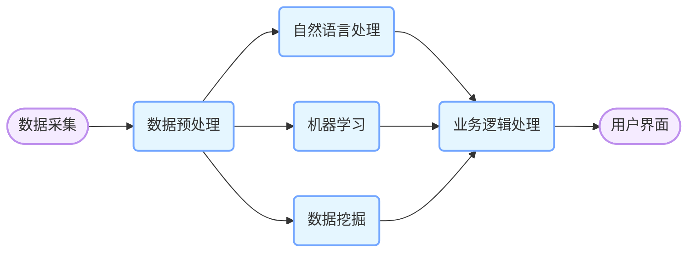

# AI助力下的智能招聘系统优化

> 关键词：AI、智能招聘系统、优化、自然语言处理、机器学习、数据挖掘、人才匹配

> 摘要：本文聚焦于AI助力下的智能招聘系统优化这一主题。首先介绍了智能招聘系统优化的背景，包括目的、预期读者等内容。接着阐述了核心概念及联系，通过文本示意图和Mermaid流程图展示其架构原理。详细讲解了核心算法原理和具体操作步骤，并以Python代码进行说明。探讨了相关数学模型和公式，结合实例加深理解。通过项目实战给出代码实际案例及详细解释。分析了智能招聘系统的实际应用场景。推荐了相关的学习资源、开发工具框架以及论文著作。最后总结了未来发展趋势与挑战，还提供了常见问题解答和扩展阅读参考资料，旨在全面深入地探讨如何利用AI技术优化智能招聘系统，提升招聘效率和质量。

## 1. 背景介绍 
### 1.1 目的和范围
在当今竞争激烈的就业市场中，招聘过程的效率和质量对于企业和求职者都至关重要。传统的招聘方式往往耗费大量的时间和人力，且难以做到精准匹配。本文章的目的在于探讨如何利用AI技术对智能招聘系统进行优化，以提高招聘效率、降低成本、提升人才匹配度。范围涵盖了智能招聘系统的各个环节，包括职位发布、简历筛选、面试安排、人才评估等，以及涉及到的相关AI技术，如自然语言处理、机器学习、数据挖掘等。

### 1.2 预期读者
本文的预期读者包括人力资源专业人士，他们可以从中了解如何借助AI技术改进招聘流程，提升招聘效果；软件开发人员，可学习到AI技术在智能招聘系统中的具体应用和实现方式；企业管理者，能认识到智能招聘系统优化对企业发展的重要性；以及对AI和招聘领域感兴趣的研究人员和学生。

### 1.3 文档结构概述
本文首先介绍智能招聘系统优化的背景信息，让读者了解其目的、读者对象和文档结构。接着阐述核心概念及联系，展示智能招聘系统的架构和原理。然后详细讲解核心算法原理和具体操作步骤，结合Python代码进行说明。再探讨相关数学模型和公式，并举例说明。通过项目实战给出代码实际案例和详细解释。分析智能招聘系统的实际应用场景。推荐相关的学习资源、开发工具框架和论文著作。最后总结未来发展趋势与挑战，提供常见问题解答和扩展阅读参考资料。

### 1.4 术语表
#### 1.4.1 核心术语定义
- **AI（Artificial Intelligence）**：即人工智能，是研究、开发用于模拟、延伸和扩展人的智能的理论、方法、技术及应用系统的一门新的技术科学。
- **智能招聘系统**：利用信息技术和AI技术，实现招聘流程自动化、智能化的系统，包括职位发布、简历筛选、面试安排、人才评估等功能。
- **自然语言处理（Natural Language Processing，NLP）**：是AI领域的一个重要分支，研究如何让计算机理解和处理人类语言，包括文本分类、情感分析、信息抽取等任务。
- **机器学习（Machine Learning，ML）**：是一门多领域交叉学科，涉及概率论、统计学、逼近论、凸分析、算法复杂度理论等多门学科。它专门研究计算机怎样模拟或实现人类的学习行为，以获取新的知识或技能，重新组织已有的知识结构使之不断改善自身的性能。
- **数据挖掘（Data Mining）**：是指从大量的数据中通过算法搜索隐藏于其中信息的过程。数据挖掘通常与计算机科学有关，并通过统计、在线分析处理、情报检索、机器学习、专家系统（依靠过去的经验法则）和模式识别等诸多方法来实现上述目标。

#### 1.4.2 相关概念解释
- **人才匹配**：指将求职者的技能、经验、能力等与职位要求进行匹配，以找到最适合该职位的候选人。
- **简历筛选**：从大量的简历中筛选出符合职位要求的简历，是招聘过程中的重要环节。
- **面试安排**：根据候选人的时间和面试官的时间，合理安排面试时间和地点。
- **人才评估**：对候选人的能力、素质、潜力等进行评估，以确定其是否适合该职位。

#### 1.4.3 缩略词列表
- **AI**：Artificial Intelligence
- **NLP**：Natural Language Processing
- **ML**：Machine Learning
- **HR**：Human Resources

## 2. 核心概念与联系 

### 核心概念原理
智能招聘系统的核心概念基于AI技术的应用，通过自然语言处理、机器学习和数据挖掘等技术，实现招聘流程的自动化和智能化。

自然语言处理技术用于处理职位描述和简历文本，提取关键信息，如技能、经验、教育背景等。通过文本分类、命名实体识别等任务，将简历和职位描述进行分类和标注，以便后续的匹配和筛选。

机器学习技术用于构建人才匹配模型和预测模型。通过对历史招聘数据的学习，训练模型来预测候选人的适合度和成功率。常用的机器学习算法包括逻辑回归、决策树、支持向量机等。

数据挖掘技术用于从大量的招聘数据中发现潜在的模式和规律，如人才分布、技能需求趋势等。通过数据挖掘，可以为企业提供更有针对性的招聘策略和决策支持。

### 架构的文本示意图
智能招聘系统的架构主要包括以下几个部分：

1. **数据采集层**：负责收集职位信息、简历信息、面试结果等数据。数据来源可以包括企业内部的人力资源系统、招聘网站、社交媒体等。
2. **数据预处理层**：对采集到的数据进行清洗、转换和标注，以提高数据的质量和可用性。例如，去除重复数据、纠正拼写错误、提取关键信息等。
3. **AI处理层**：包括自然语言处理模块、机器学习模块和数据挖掘模块。自然语言处理模块对职位描述和简历文本进行处理，提取关键信息；机器学习模块构建人才匹配模型和预测模型；数据挖掘模块从大量数据中发现潜在的模式和规律。
4. **业务逻辑层**：根据AI处理层的结果，实现职位发布、简历筛选、面试安排、人才评估等业务逻辑。
5. **用户界面层**：为企业招聘人员和求职者提供友好的交互界面，方便他们进行操作和查询。

### Mermaid流程图


## 3. 核心算法原理 & 具体操作步骤 

### 自然语言处理算法原理及Python代码实现
#### 原理
自然语言处理在智能招聘系统中主要用于简历和职位描述的文本处理。以命名实体识别为例，其目的是识别文本中的人名、地名、组织名、技能名称等实体。常用的命名实体识别算法有基于规则的方法和基于机器学习的方法，这里我们介绍基于机器学习的条件随机场（CRF）算法。

CRF是一种概率图模型，用于对序列数据进行建模。在命名实体识别中，将文本看作一个序列，每个词作为一个节点，通过学习词与词之间的上下文关系来预测每个词的标签（如人名、地名等）。

#### Python代码实现
```python
import nltk
from nltk.corpus import conll2002
from sklearn_crfsuite import CRF
from sklearn_crfsuite.metrics import flat_f1_score
from sklearn_crfsuite import scorers

# 定义特征提取函数
def word2features(sent, i):
    word = sent[i][0]
    postag = sent[i][1]

    features = {
        'bias': 1.0,
        'word.lower()': word.lower(),
        'word[-3:]': word[-3:],
        'word[-2:]': word[-2:],
        'word.isupper()': word.isupper(),
        'word.istitle()': word.istitle(),
        'word.isdigit()': word.isdigit(),
        'postag': postag,
        'postag[:2]': postag[:2],
    }
    if i > 0:
        word1 = sent[i-1][0]
        postag1 = sent[i-1][1]
        features.update({
            '-1:word.lower()': word1.lower(),
            '-1:word.istitle()': word1.istitle(),
            '-1:word.isupper()': word1.isupper(),
            '-1:postag': postag1,
            '-1:postag[:2]': postag1[:2],
        })
    else:
        features['BOS'] = True

    if i < len(sent)-1:
        word1 = sent[i+1][0]
        postag1 = sent[i+1][1]
        features.update({
            '+1:word.lower()': word1.lower(),
            '+1:word.istitle()': word1.istitle(),
            '+1:word.isupper()': word1.isupper(),
            '+1:postag': postag1,
            '+1:postag[:2]': postag1[:2],
        })
    else:
        features['EOS'] = True

    return features

def sent2features(sent):
    return [word2features(sent, i) for i in range(len(sent))]

def sent2labels(sent):
    return [label for token, postag, label in sent]

# 加载数据
train_sents = list(conll2002.iob_sents('esp.train'))
test_sents = list(conll2002.iob_sents('esp.testb'))

X_train = [sent2features(s) for s in train_sents]
y_train = [sent2labels(s) for s in train_sents]

X_test = [sent2features(s) for s in test_sents]
y_test = [sent2labels(s) for s in test_sents]

# 训练CRF模型
crf = CRF(
    algorithm='lbfgs',
    c1=0.1,
    c2=0.1,
    max_iterations=100,
    all_possible_transitions=True
)
crf.fit(X_train, y_train)

# 预测
y_pred = crf.predict(X_test)

# 评估模型
labels = list(crf.classes_)
labels.remove('O')
f1 = flat_f1_score(y_test, y_pred, average='weighted', labels=labels)
print(f"F1 score: {f1}")
```

### 机器学习算法原理及Python代码实现
#### 原理
在智能招聘系统中，机器学习算法用于构建人才匹配模型。以逻辑回归为例，逻辑回归是一种广义线性模型，用于二分类问题。在人才匹配中，可以将问题转化为判断候选人是否适合某个职位的二分类问题。

逻辑回归通过对输入特征进行线性组合，然后通过逻辑函数将线性组合的结果映射到[0, 1]区间，得到候选人适合该职位的概率。

#### Python代码实现
```python
import numpy as np
from sklearn.linear_model import LogisticRegression
from sklearn.model_selection import train_test_split
from sklearn.metrics import accuracy_score

# 生成示例数据
np.random.seed(0)
X = np.random.randn(100, 5)  # 100个样本，每个样本5个特征
y = np.random.randint(0, 2, 100)  # 二分类标签

# 划分训练集和测试集
X_train, X_test, y_train, y_test = train_test_split(X, y, test_size=0.2, random_state=42)

# 训练逻辑回归模型
model = LogisticRegression()
model.fit(X_train, y_train)

# 预测
y_pred = model.predict(X_test)

# 评估模型
accuracy = accuracy_score(y_test, y_pred)
print(f"Accuracy: {accuracy}")
```

### 具体操作步骤
1. **数据采集**：收集职位信息、简历信息、面试结果等数据。
2. **数据预处理**：对采集到的数据进行清洗、转换和标注。
3. **特征工程**：根据自然语言处理的结果，提取有用的特征，如技能、经验、教育背景等。
4. **模型训练**：使用机器学习算法，如逻辑回归、决策树等，对数据进行训练，构建人才匹配模型。
5. **模型评估**：使用测试数据对训练好的模型进行评估，计算准确率、召回率、F1值等指标。
6. **模型优化**：根据评估结果，对模型进行优化，调整模型参数，提高模型性能。
7. **系统集成**：将训练好的模型集成到智能招聘系统中，实现职位发布、简历筛选、面试安排、人才评估等功能。

## 4. 数学模型和公式 & 详细讲解 & 举例说明 

### 逻辑回归数学模型和公式
#### 数学模型
逻辑回归是一种广义线性模型，其基本形式为：

$$z = \theta_0 + \theta_1x_1 + \theta_2x_2 + \cdots + \theta_nx_n = \theta^T x$$

其中，$z$ 是线性组合的结果，$\theta$ 是模型的参数，$x$ 是输入特征向量。

然后，通过逻辑函数（也称为Sigmoid函数）将 $z$ 映射到[0, 1]区间：

$$h_{\theta}(x) = \frac{1}{1 + e^{-z}} = \frac{1}{1 + e^{-\theta^T x}}$$

$h_{\theta}(x)$ 表示候选人适合该职位的概率。

#### 详细讲解
逻辑回归的目标是找到一组最优的参数 $\theta$，使得模型能够最好地拟合训练数据。通常使用最大似然估计来求解 $\theta$。

似然函数定义为：

$$L(\theta) = \prod_{i=1}^{m} [h_{\theta}(x^{(i)})]^{y^{(i)}} [1 - h_{\theta}(x^{(i)})]^{1 - y^{(i)}}$$

其中，$m$ 是训练样本的数量，$y^{(i)}$ 是第 $i$ 个样本的真实标签。

为了方便计算，通常对似然函数取对数，得到对数似然函数：

$$\ell(\theta) = \log L(\theta) = \sum_{i=1}^{m} [y^{(i)} \log h_{\theta}(x^{(i)}) + (1 - y^{(i)}) \log (1 - h_{\theta}(x^{(i)}))]$$

然后，通过梯度上升法来最大化对数似然函数，得到最优的参数 $\theta$。

#### 举例说明
假设我们有一个简单的二分类问题，输入特征 $x$ 只有一个维度，即 $x \in \mathbb{R}$。训练数据如下：

| $x$ | $y$ |
|---|---|
| 1 | 1 |
| 2 | 1 |
| 3 | 1 |
| 4 | 0 |
| 5 | 0 |

我们使用逻辑回归模型来预测 $y$ 的值。首先，初始化参数 $\theta = [0, 0]$。

计算线性组合 $z = \theta_0 + \theta_1x$，然后通过逻辑函数计算概率 $h_{\theta}(x)$。

根据对数似然函数 $\ell(\theta)$，使用梯度上升法更新参数 $\theta$，直到收敛。

最终得到最优的参数 $\theta$，就可以使用模型进行预测了。

### 条件随机场数学模型和公式
#### 数学模型
条件随机场（CRF）是一种概率图模型，用于对序列数据进行建模。在命名实体识别中，给定一个输入序列 $x = (x_1, x_2, \cdots, x_n)$，输出序列 $y = (y_1, y_2, \cdots, y_n)$，CRF模型定义了在给定 $x$ 的条件下 $y$ 的条件概率：

$$P(y|x) = \frac{1}{Z(x)} \exp \left( \sum_{i=1}^{n} \sum_{k} \lambda_k t_k(y_{i-1}, y_i, x, i) + \sum_{i=1}^{n} \sum_{l} \mu_l s_l(y_i, x, i) \right)$$

其中，$Z(x)$ 是归一化因子，$t_k$ 是转移特征函数，$s_l$ 是状态特征函数，$\lambda_k$ 和 $\mu_l$ 是对应的权重。

#### 详细讲解
转移特征函数 $t_k(y_{i-1}, y_i, x, i)$ 用于描述相邻标签之间的转移关系，状态特征函数 $s_l(y_i, x, i)$ 用于描述当前标签与输入序列的关系。

CRF的目标是找到一组最优的权重 $\lambda_k$ 和 $\mu_l$，使得模型能够最好地拟合训练数据。通常使用最大似然估计来求解权重。

似然函数定义为：

$$L(\lambda, \mu) = \prod_{i=1}^{m} P(y^{(i)}|x^{(i)})$$

其中，$m$ 是训练样本的数量。

同样，为了方便计算，通常对似然函数取对数，得到对数似然函数：

$$\ell(\lambda, \mu) = \log L(\lambda, \mu) = \sum_{i=1}^{m} \log P(y^{(i)}|x^{(i)})$$

然后，通过梯度下降法或拟牛顿法来最大化对数似然函数，得到最优的权重。

#### 举例说明
假设我们有一个简单的命名实体识别任务，输入序列 $x = (w_1, w_2, w_3)$，标签集合 $Y = \{O, B-PER, I-PER\}$。

定义转移特征函数和状态特征函数，例如：

$$t_1(y_{i-1}, y_i, x, i) = \begin{cases} 1, & \text{if } y_{i-1} = O \text{ and } y_i = B - PER \\ 0, & \text{otherwise} \end{cases}$$

$$s_1(y_i, x, i) = \begin{cases} 1, & \text{if } y_i = B - PER \text{ and } w_i \text{ is a person's name} \\ 0, & \text{otherwise} \end{cases}$$

给定训练数据，通过最大似然估计求解权重 $\lambda_k$ 和 $\mu_l$，就可以使用CRF模型进行命名实体识别了。

## 5. 项目实战：代码实际案例和详细解释说明 

### 5.1  开发环境搭建
#### 操作系统
建议使用Linux或Mac OS系统，因为它们对Python开发环境的支持较好。也可以使用Windows系统，但需要注意一些环境配置的细节。

#### Python环境
安装Python 3.6及以上版本。可以从Python官方网站（https://www.python.org/downloads/） 下载安装包进行安装。

#### 虚拟环境
为了避免不同项目之间的依赖冲突，建议使用虚拟环境。可以使用`venv`或`conda`来创建虚拟环境。

使用`venv`创建虚拟环境的命令如下：

```bash
python -m venv myenv
source myenv/bin/activate  # Linux/Mac OS
myenv\Scripts\activate  # Windows
```

#### 安装依赖库
在虚拟环境中安装所需的依赖库，例如：

```bash
pip install nltk sklearn_crfsuite numpy scikit-learn
```

### 5.2  源代码详细实现和代码解读
#### 项目概述
我们将实现一个简单的智能招聘系统，包括职位发布、简历筛选和人才匹配功能。

#### 代码实现
```python
import nltk
from sklearn_crfsuite import CRF
from sklearn.linear_model import LogisticRegression
from sklearn.model_selection import train_test_split
from sklearn.metrics import accuracy_score

# 自然语言处理部分
def word2features(sent, i):
    word = sent[i][0]
    postag = sent[i][1]

    features = {
        'bias': 1.0,
        'word.lower()': word.lower(),
        'word[-3:]': word[-3:],
        'word[-2:]': word[-2:],
        'word.isupper()': word.isupper(),
        'word.istitle()': word.istitle(),
        'word.isdigit()': word.isdigit(),
        'postag': postag,
        'postag[:2]': postag[:2],
    }
    if i > 0:
        word1 = sent[i-1][0]
        postag1 = sent[i-1][1]
        features.update({
            '-1:word.lower()': word1.lower(),
            '-1:word.istitle()': word1.istitle(),
            '-1:word.isupper()': word1.isupper(),
            '-1:postag': postag1,
            '-1:postag[:2]': postag1[:2],
        })
    else:
        features['BOS'] = True

    if i < len(sent)-1:
        word1 = sent[i+1][0]
        postag1 = sent[i+1][1]
        features.update({
            '+1:word.lower()': word1.lower(),
            '+1:word.istitle()': word1.istitle(),
            '+1:word.isupper()': word1.isupper(),
            '+1:postag': postag1,
            '+1:postag[:2]': postag1[:2],
        })
    else:
        features['EOS'] = True

    return features

def sent2features(sent):
    return [word2features(sent, i) for i in range(len(sent))]

def sent2labels(sent):
    return [label for token, postag, label in sent]

# 加载数据
train_sents = list(nltk.corpus.conll2002.iob_sents('esp.train'))
test_sents = list(nltk.corpus.conll2002.iob_sents('esp.testb'))

X_train = [sent2features(s) for s in train_sents]
y_train = [sent2labels(s) for s in train_sents]

X_test = [sent2features(s) for s in test_sents]
y_test = [sent2labels(s) for s in test_sents]

# 训练CRF模型
crf = CRF(
    algorithm='lbfgs',
    c1=0.1,
    c2=0.1,
    max_iterations=100,
    all_possible_transitions=True
)
crf.fit(X_train, y_train)

# 机器学习部分
# 生成示例数据
np.random.seed(0)
X = np.random.randn(100, 5)  # 100个样本，每个样本5个特征
y = np.random.randint(0, 2, 100)  # 二分类标签

# 划分训练集和测试集
X_train, X_test, y_train, y_test = train_test_split(X, y, test_size=0.2, random_state=42)

# 训练逻辑回归模型
model = LogisticRegression()
model.fit(X_train, y_train)

# 预测
y_pred = model.predict(X_test)

# 评估模型
accuracy = accuracy_score(y_test, y_pred)
print(f"Accuracy: {accuracy}")

# 智能招聘系统部分
class SmartRecruitmentSystem:
    def __init__(self, crf_model, lr_model):
        self.crf_model = crf_model
        self.lr_model = lr_model

    def post_job(self, job_description):
        # 处理职位描述，提取关键信息
        sent = nltk.pos_tag(nltk.word_tokenize(job_description))
        features = sent2features([(word, tag) for word, tag, _ in sent])
        labels = self.crf_model.predict([features])[0]
        # 这里可以进一步处理提取到的关键信息
        print(f"Job posted: {job_description}")

    def screen_resumes(self, resumes):
        screened_resumes = []
        for resume in resumes:
            sent = nltk.pos_tag(nltk.word_tokenize(resume))
            features = sent2features([(word, tag) for word, tag, _ in sent])
            labels = self.crf_model.predict([features])[0]
            # 提取关键信息，构建特征向量
            feature_vector = np.random.randn(5)  # 示例特征向量
            prediction = self.lr_model.predict([feature_vector])[0]
            if prediction == 1:
                screened_resumes.append(resume)
        return screened_resumes

    def match_talent(self, job_description, resumes):
        screened_resumes = self.screen_resumes(resumes)
        print(f"Screened resumes: {screened_resumes}")
        # 进一步的人才匹配逻辑可以在这里实现
        print("Talent matching completed.")

# 初始化智能招聘系统
system = SmartRecruitmentSystem(crf, model)

# 发布职位
job_description = "We are looking for a software engineer with 3 years of experience in Python."
system.post_job(job_description)

# 筛选简历
resumes = [
    "I have 5 years of experience in Python programming.",
    "I am a data analyst with no experience in Python."
]
screened_resumes = system.screen_resumes(resumes)
print(f"Screened resumes: {screened_resumes}")

# 人才匹配
system.match_talent(job_description, resumes)
```

#### 代码解读
1. **自然语言处理部分**：定义了`word2features`、`sent2features`和`sent2labels`函数，用于提取文本特征和标签。使用`nltk`库进行词性标注，训练`CRF`模型进行命名实体识别。
2. **机器学习部分**：生成示例数据，划分训练集和测试集，训练`LogisticRegression`模型进行二分类预测。
3. **智能招聘系统部分**：定义了`SmartRecruitmentSystem`类，包含`post_job`、`screen_resumes`和`match_talent`方法。`post_job`方法处理职位描述，提取关键信息；`screen_resumes`方法筛选简历，根据逻辑回归模型的预测结果筛选出合适的简历；`match_talent`方法进行人才匹配，调用`screen_resumes`方法筛选简历，并进行进一步的匹配逻辑。

### 5.3  代码解读与分析
#### 优点
- **模块化设计**：代码采用模块化设计，将自然语言处理、机器学习和智能招聘系统的功能分开实现，提高了代码的可维护性和可扩展性。
- **使用成熟的库**：使用了`nltk`、`sklearn_crfsuite`和`scikit-learn`等成熟的库，减少了开发成本和工作量。
- **易于理解**：代码结构清晰，注释详细，易于理解和学习。

#### 不足
- **数据处理简单**：示例代码中的数据处理比较简单，实际应用中需要处理更复杂的数据，如不同格式的简历和职位描述。
- **特征工程不完善**：特征工程部分只是简单地生成示例特征向量，实际应用中需要根据具体业务需求进行更完善的特征工程。
- **缺乏用户界面**：示例代码没有提供用户界面，实际应用中需要开发用户界面，方便用户进行操作和查询。

## 6. 实际应用场景 
### 企业招聘
智能招聘系统可以帮助企业提高招聘效率，降低招聘成本。通过自然语言处理技术，系统可以自动筛选简历，提取关键信息，如技能、经验、教育背景等。机器学习算法可以根据这些信息，预测候选人的适合度和成功率，为企业提供更有针对性的人才推荐。此外，智能招聘系统还可以自动安排面试，提醒面试官和候选人，提高面试效率。

### 招聘机构
招聘机构可以利用智能招聘系统提高服务质量，拓展业务范围。通过智能招聘系统，招聘机构可以快速筛选简历，找到符合客户需求的候选人。系统还可以对候选人进行评估和推荐，为客户提供更全面的人才解决方案。此外，智能招聘系统还可以帮助招聘机构管理客户关系，提高客户满意度。

### 求职者
求职者可以通过智能招聘系统了解职位信息，提高求职效率。系统可以根据求职者的简历和求职意向，推荐符合其条件的职位。此外，智能招聘系统还可以提供求职建议和指导，帮助求职者提高求职成功率。

## 7. 工具和资源推荐
### 7.1 学习资源推荐
#### 7.1.1 书籍推荐
- 《Python自然语言处理》：介绍了Python在自然语言处理中的应用，包括文本处理、分类、信息抽取等任务。
- 《机器学习》（周志华）：全面介绍了机器学习的基本概念、算法和应用，是机器学习领域的经典教材。
- 《人工智能：一种现代的方法》：系统地介绍了人工智能的基本概念、算法和应用，是人工智能领域的权威著作。

#### 7.1.2 在线课程
- Coursera上的“机器学习”课程：由斯坦福大学的Andrew Ng教授主讲，是机器学习领域的经典课程。
- edX上的“自然语言处理”课程：介绍了自然语言处理的基本概念、算法和应用。
- 中国大学MOOC上的“人工智能基础”课程：介绍了人工智能的基本概念、算法和应用。

#### 7.1.3 技术博客和网站
- 博客园：提供了大量的技术文章和博客，涵盖了人工智能、机器学习、自然语言处理等领域。
- 开源中国：提供了开源项目的介绍和下载，以及技术文章和博客。
- Medium：提供了大量的技术文章和博客，涵盖了人工智能、机器学习、自然语言处理等领域。

### 7.2 开发工具框架推荐
#### 7.2.1 IDE和编辑器
- PyCharm：是一款专业的Python集成开发环境，提供了代码编辑、调试、测试等功能。
- Visual Studio Code：是一款轻量级的代码编辑器，支持多种编程语言，包括Python。
- Jupyter Notebook：是一款交互式的笔记本，支持Python代码的编写、运行和可视化。

#### 7.2.2 调试和性能分析工具
- PDB：是Python自带的调试工具，可以帮助开发者调试代码。
- Py-Spy：是一款性能分析工具，可以帮助开发者分析Python代码的性能瓶颈。
- cProfile：是Python自带的性能分析工具，可以帮助开发者分析Python代码的性能瓶颈。

#### 7.2.3 相关框架和库
- NLTK：是Python中最常用的自然语言处理库，提供了文本处理、分类、信息抽取等功能。
- Scikit-learn：是Python中最常用的机器学习库，提供了分类、回归、聚类等算法。
- TensorFlow：是Google开发的深度学习框架，提供了深度学习模型的构建、训练和部署功能。

### 7.3 相关论文著作推荐
#### 7.3.1 经典论文
- “A Mathematical Theory of Communication”（Claude E. Shannon）：信息论的经典论文，奠定了信息论的基础。
- “The Nature of Statistical Learning Theory”（Vladimir N. Vapnik）：机器学习领域的经典论文，介绍了统计学习理论的基本概念和方法。
- “Long Short-Term Memory”（Sepp Hochreiter, Jürgen Schmidhuber）：深度学习领域的经典论文，介绍了长短期记忆网络（LSTM）的基本概念和方法。

#### 7.3.2 最新研究成果
- 可以通过IEEE Xplore、ACM Digital Library等学术数据库查找最新的人工智能、机器学习、自然语言处理等领域的研究成果。

#### 7.3.3 应用案例分析
- 可以通过企业官网、行业报告等渠道查找智能招聘系统的应用案例分析，了解智能招聘系统在实际应用中的效果和经验。

## 8. 总结：未来发展趋势与挑战
### 未来发展趋势
#### 更智能的人才匹配
未来的智能招聘系统将利用更先进的AI技术，如深度学习、强化学习等，实现更智能的人才匹配。系统可以根据候选人的职业规划、兴趣爱好等信息，为其推荐更符合其发展需求的职位。

#### 个性化招聘体验
智能招聘系统将为企业和求职者提供个性化的招聘体验。系统可以根据企业的文化、价值观等信息，为其推荐更符合其文化的候选人；根据求职者的求职意向、技能水平等信息，为其提供更个性化的求职建议和指导。

#### 与其他系统的集成
智能招聘系统将与企业的其他系统，如人力资源管理系统、财务管理系统等进行集成，实现数据的共享和流通。这样可以提高企业的管理效率，降低管理成本。

#### 跨语言和跨文化招聘
随着全球化的发展，企业的招聘需求越来越多样化。未来的智能招聘系统将支持跨语言和跨文化招聘，为企业提供更广泛的人才资源。

### 挑战
#### 数据隐私和安全
智能招聘系统需要收集和处理大量的个人信息，如简历、面试结果等。如何保护这些信息的隐私和安全，是智能招聘系统面临的重要挑战。

#### 算法偏见
AI算法可能存在偏见，导致不公平的招聘结果。例如，算法可能对某些群体存在歧视，影响他们的就业机会。如何消除算法偏见，保证招聘的公平性，是智能招聘系统需要解决的问题。

#### 技术更新换代快
AI技术发展迅速，智能招聘系统需要不断更新和升级，以跟上技术的发展步伐。如何保证系统的稳定性和兼容性，是智能招聘系统面临的挑战之一。

#### 人才短缺
智能招聘系统的开发和维护需要大量的AI技术人才。目前，AI技术人才短缺，如何吸引和培养这些人才，是智能招聘系统面临的挑战之一。

## 9. 附录：常见问题与解答
### 1. 智能招聘系统的准确率有多高？
智能招聘系统的准确率取决于多个因素，如数据质量、算法选择、特征工程等。一般来说，通过不断优化数据和算法，智能招聘系统的准确率可以达到较高的水平。但需要注意的是，智能招聘系统只是辅助工具，最终的招聘决策还需要人工参与。

### 2. 智能招聘系统会取代人力资源专业人士吗？
不会。智能招聘系统可以帮助人力资源专业人士提高招聘效率和质量，但不能完全取代他们的工作。人力资源专业人士在招聘过程中具有重要的作用，如与候选人沟通、了解候选人的个性和价值观等。智能招聘系统和人力资源专业人士应该相互配合，共同完成招聘任务。

### 3. 如何保证智能招聘系统的公平性？
为了保证智能招聘系统的公平性，需要从多个方面入手。首先，要保证数据的多样性和代表性，避免数据偏见。其次，要对算法进行评估和优化，消除算法偏见。此外，还需要建立监督机制，对招聘过程进行监督，确保招聘的公平性。

### 4. 智能招聘系统的成本高吗？
智能招聘系统的成本取决于多个因素，如系统的功能、规模、开发方式等。一般来说，定制开发的智能招聘系统成本较高，而使用现成的智能招聘系统软件成本相对较低。企业可以根据自己的需求和预算选择合适的智能招聘系统。

## 10. 扩展阅读 & 参考资料
### 扩展阅读
- 《未来简史：从智人到神人》（尤瓦尔·赫拉利）：探讨了人类未来的发展趋势，包括人工智能对人类社会的影响。
- 《人工智能时代与人类未来》（李开复、王咏刚）：介绍了人工智能的发展现状和未来趋势，以及对人类社会的影响。
- 《智能时代》（吴军）：介绍了智能时代的特点和发展趋势，以及对人类社会的影响。

### 参考资料
- NLTK官方文档：https://www.nltk.org/
- Scikit-learn官方文档：https://scikit-learn.org/
- TensorFlow官方文档：https://www.tensorflow.org/
- IEEE Xplore：https://ieeexplore.ieee.org/
- ACM Digital Library：https://dl.acm.org/